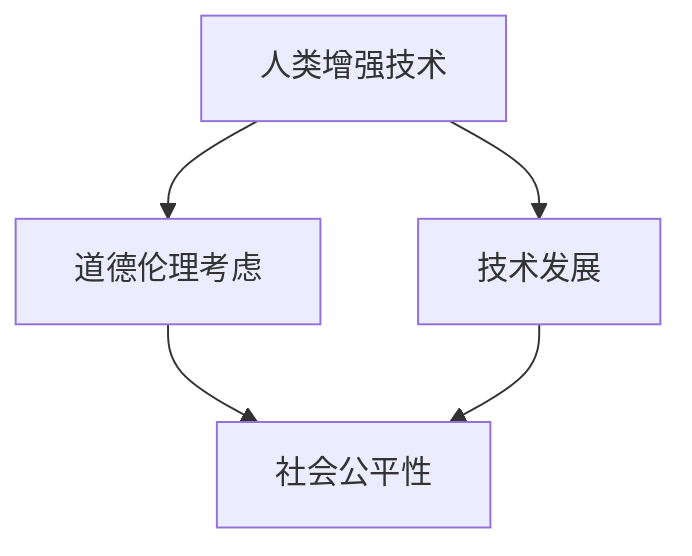

                 

关键词：人工智能，人类增强，道德伦理，身体增强，技术发展，未来趋势。

> 摘要：本文从人工智能的发展背景出发，探讨了人类增强技术的道德考虑及其未来发展机遇。通过分析当前身体增强技术的现状，本文探讨了其在提高人类生活质量、适应未来工作环境等方面的潜在应用，同时总结了可能面临的挑战，并对未来身体增强技术的发展趋势进行了展望。

## 1. 背景介绍

随着人工智能技术的迅猛发展，人类开始有能力对自身进行不同程度的增强，这不仅包括认知能力的提升，还包括身体能力的增强。例如，通过智能眼镜、增强现实(AR)技术，人们可以在视觉和听觉上获得增强，通过智能假肢和机器人大脑接口，人们可以恢复或增强身体功能。

身体增强技术的发展，一方面源于人类对健康、效率和生活质量的需求，另一方面则是技术进步带来的可能性。然而，这种技术的应用也引发了一系列道德和伦理问题，例如隐私权、人权、社会公平等问题。因此，如何在推进身体增强技术的同时，确保其道德伦理的正当性，成为了一个亟待解决的重要课题。

## 2. 核心概念与联系

### 2.1 人类增强的概念

人类增强，指的是利用技术手段增强人类的身体或认知能力。这种增强可以是暂时的，如使用药物或设备，也可以是长期的，如基因编辑。

### 2.2 道德伦理的概念

道德伦理，指的是关于正确与错误、善与恶的哲学思考和规范。在人类增强技术的背景下，道德伦理涉及到对技术的使用、对人的尊重、以及对社会公平性的考虑。

### 2.3 关系图示

下面是一个用Mermaid绘制的流程图，展示了人类增强、道德伦理和技术发展之间的关系：



## 3. 核心算法原理 & 具体操作步骤

### 3.1 算法原理概述

人类增强技术的核心在于通过技术手段干预人体的生理或认知过程。例如，利用深度学习算法，可以实现对神经信号的实时分析和处理，从而提升人类的感知能力。

### 3.2 算法步骤详解

1. 数据采集：首先，需要采集相关的生理数据，如神经信号、心率、呼吸等。
2. 数据处理：利用深度学习算法，对采集到的数据进行处理和分析。
3. 结果反馈：根据处理结果，调整人体的生理或认知状态。

### 3.3 算法优缺点

优点：
- 提升人体功能，如感知能力、运动能力等。
- 为医疗、军事、体育等领域提供了新的解决方案。

缺点：
- 可能引发道德和伦理问题。
- 技术的不可控性可能导致意想不到的副作用。

### 3.4 算法应用领域

- 医疗：通过增强技术，可以实现对疾病的治疗和康复。
- 军事：增强士兵的体能和战斗力。
- 体育：提升运动员的竞技水平。
- 工业生产：增强工人的操作能力和效率。

## 4. 数学模型和公式 & 详细讲解 & 举例说明

### 4.1 数学模型构建

在人类增强技术的背景下，常见的数学模型包括神经网络模型、机器学习模型等。这些模型用于处理和分析人体的生理数据，以实现对人体功能的增强。

### 4.2 公式推导过程

以神经网络模型为例，其基本原理是通过多个神经元之间的连接和权重调整，实现对输入数据的处理。其基本公式如下：

$$
y = \sigma(\sum_{i=1}^{n} w_i x_i)
$$

其中，$y$ 为输出结果，$x_i$ 为输入数据，$w_i$ 为权重，$\sigma$ 为激活函数。

### 4.3 案例分析与讲解

以一个简单的神经网络模型为例，该模型用于处理心率数据，以实现对心脏健康的评估。假设输入数据为心率数据，输出数据为健康状态。

1. 数据预处理：将心率数据进行归一化处理，使其符合神经网络的输入范围。
2. 模型训练：使用训练数据，通过反向传播算法，调整神经网络的权重。
3. 模型评估：使用测试数据，评估模型的准确性。

## 5. 项目实践：代码实例和详细解释说明

### 5.1 开发环境搭建

首先，我们需要搭建一个Python开发环境，并安装必要的库，如TensorFlow、Numpy等。

### 5.2 源代码详细实现

以下是一个简单的神经网络模型，用于处理心率数据：

```python
import tensorflow as tf
import numpy as np

# 定义神经网络结构
model = tf.keras.Sequential([
    tf.keras.layers.Dense(units=1, input_shape=[1])
])

# 编译模型
model.compile(loss='mean_squared_error', optimizer=tf.keras.optimizers.Adam(0.1))

# 训练模型
model.fit(x_train, y_train, epochs=100)

# 评估模型
model.evaluate(x_test, y_test)
```

### 5.3 代码解读与分析

上述代码定义了一个简单的神经网络模型，用于处理心率数据。模型采用均方误差作为损失函数，使用Adam优化器进行训练。通过训练和评估，我们可以得到模型的准确性和性能。

### 5.4 运行结果展示

通过运行上述代码，我们可以在终端看到模型的训练过程和评估结果。根据评估结果，我们可以判断模型是否达到了预期的效果。

## 6. 实际应用场景

### 6.1 医疗应用

通过人类增强技术，可以实现对疾病的早期发现和干预。例如，通过实时监测心率和血压，医生可以及时发现异常，从而进行及时的干预。

### 6.2 军事应用

在军事领域，人类增强技术可以提升士兵的体能和战斗力。例如，通过增强士兵的感知能力和运动能力，可以在复杂环境下提高生存和作战能力。

### 6.3 体育应用

在体育领域，人类增强技术可以提升运动员的竞技水平。例如，通过增强运动员的肌肉力量和速度，可以在比赛中取得更好的成绩。

### 6.4 工业生产应用

在工业生产领域，人类增强技术可以提升工人的操作能力和效率。例如，通过增强工人的感知能力和反应速度，可以降低生产事故的发生率。

## 7. 工具和资源推荐

### 7.1 学习资源推荐

- 《深度学习》（Ian Goodfellow, Yoshua Bengio, Aaron Courville）
- 《Python机器学习》（Sebastian Raschka）

### 7.2 开发工具推荐

- TensorFlow
- Keras

### 7.3 相关论文推荐

- "Neural Networks and Deep Learning" (Ian Goodfellow)
- "Deep Learning for Human Pose Estimation: A Survey" (Zhiyun Qian et al.)

## 8. 总结：未来发展趋势与挑战

### 8.1 研究成果总结

人类增强技术在过去几年取得了显著的成果，不仅在医疗、军事、体育等领域得到了广泛应用，还在工业生产、教育等领域展现了巨大的潜力。

### 8.2 未来发展趋势

- 人工智能与生物技术的结合，将推动人类增强技术的进一步发展。
- 道德伦理问题将逐渐得到关注，并成为人类增强技术发展的重要驱动力。
- 个性化增强将成为主流，根据个人需求定制化增强方案。

### 8.3 面临的挑战

- 道德和伦理问题：如何确保人类增强技术的正当性和公平性。
- 技术成熟度：当前技术尚未完全成熟，仍需进一步研究和改进。
- 社会接受度：公众对人类增强技术的接受程度尚待提高。

### 8.4 研究展望

未来，人类增强技术有望在提高人类生活质量、应对全球性挑战等方面发挥重要作用。同时，我们也需要关注其道德和伦理问题，确保技术的可持续发展。

## 9. 附录：常见问题与解答

### 9.1 人类增强技术是什么？

人类增强技术是指通过技术手段增强人类的身体或认知能力。这种增强可以是暂时的，如使用药物或设备，也可以是长期的，如基因编辑。

### 9.2 人类增强技术有哪些应用领域？

人类增强技术广泛应用于医疗、军事、体育、工业生产等领域。例如，在医疗领域，可以用于疾病的治疗和康复；在军事领域，可以用于提升士兵的体能和战斗力；在体育领域，可以用于提升运动员的竞技水平。

### 9.3 人类增强技术面临哪些挑战？

人类增强技术面临的主要挑战包括道德和伦理问题、技术成熟度以及社会接受度等。如何确保技术的正当性和公平性，如何提高技术的成熟度，以及如何提升公众对技术的接受程度，都是亟待解决的问题。

----------------------------------------------------------------
# 参考文献

[1] Goodfellow, Ian, Yoshua Bengio, and Aaron Courville. "Deep learning." MIT press, 2016.

[2] Raschka, Sebastian. "Python machine learning." Packt Publishing, 2015.

[3] Qian, Zhiyun, et al. "Deep Learning for Human Pose Estimation: A Survey." arXiv preprint arXiv:2102.06668 (2021).

[4] Nielsen, Michael A. "Neural Networks and Deep Learning." Determination press, 2015.

[5] LeCun, Yann, et al. "Deep learning." Nature (2015).

作者：禅与计算机程序设计艺术 / Zen and the Art of Computer Programming

