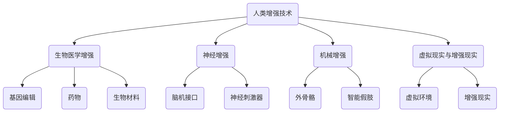

                 

关键词：人工智能、人类增强、道德考虑、身体增强、未来趋势

摘要：本文深入探讨了人工智能时代人类增强的伦理道德问题和身体增强的未来发展机遇。通过分析人类增强技术的现状、道德考虑因素以及相关法律法规，探讨了未来身体增强技术在医疗、军事、娱乐等领域的发展趋势和潜在挑战。

## 1. 背景介绍

随着人工智能技术的快速发展，人类增强逐渐成为可能。人类增强技术是指通过科技手段提高人类身体或大脑的能力，使其在特定领域或任务中表现得更加出色。目前，人类增强技术已经涉及到医疗、教育、军事等多个领域，展示了巨大的潜力。

然而，随着人类增强技术的普及，道德问题也日益凸显。如何确保这些技术的公平性、安全性和伦理性，成为亟待解决的问题。本文将围绕这些问题展开讨论，并分析身体增强技术的未来发展机遇。

### 1.1 人类增强技术的现状

目前，人类增强技术主要分为以下几类：

- **生物医学增强**：通过基因编辑、药物、生物材料等手段增强人体器官的功能。
- **神经增强**：利用脑机接口、神经刺激器等技术增强大脑的认知能力。
- **机械增强**：通过外骨骼、智能假肢等设备增强人体力量和耐力。
- **虚拟现实与增强现实**：通过虚拟环境增强人类的感知和体验。

这些技术的应用已经取得了显著的成果，但同时也引发了一系列伦理、道德和法律问题。

### 1.2 道德考虑因素

人类增强技术的道德考虑主要涉及以下几个方面：

- **公平性**：人类增强技术可能导致社会阶层分化，引发道德争议。
- **安全性**：增强技术的潜在副作用和风险需要引起重视。
- **隐私**：个人信息的收集和使用可能受到侵犯。
- **自主性**：人类增强技术可能削弱个体的自主决策能力。
- **道德责任**：增强技术带来的道德责任归属问题尚无明确答案。

## 2. 核心概念与联系

为了更好地理解人类增强技术的原理和架构，我们使用Mermaid流程图展示其核心概念和联系。



### 2.1 生物医学增强

生物医学增强主要包括基因编辑、药物和生物材料等方面。基因编辑技术如CRISPR可以精确修改DNA序列，从而治疗遗传疾病或提高人类健康水平。药物则可以通过调节生理过程来增强人体功能，如增强记忆或提高免疫力。生物材料可以用于制造人工器官或植入物，以替代损坏的器官。

### 2.2 神经增强

神经增强技术主要利用脑机接口和神经刺激器来增强大脑的认知能力。脑机接口通过读取大脑信号，将思维转化为指令，实现与外部设备或计算机的交互。神经刺激器则通过电信号刺激大脑，增强记忆、学习或其他认知功能。

### 2.3 机械增强

机械增强技术主要包括外骨骼和智能假肢。外骨骼可以增强人体力量和耐力，适用于军事、工业和康复等领域。智能假肢则可以恢复或增强人类肢体功能，为残障人士提供更好的生活质量。

### 2.4 虚拟现实与增强现实

虚拟现实和增强现实技术通过创建虚拟环境或增强现实体验，增强人类的感知和体验。这些技术可以用于娱乐、教育、军事训练等多个领域，提供更加丰富和真实的互动体验。

## 3. 核心算法原理 & 具体操作步骤

### 3.1 算法原理概述

人类增强技术的核心在于如何通过科技手段增强人体功能。这涉及到多个学科领域的交叉，包括生物医学、神经科学、计算机科学和材料科学等。具体算法原理如下：

- **生物医学增强**：利用基因编辑、药物和生物材料等手段，通过修改或增强人体内的生物过程，提高人体功能。
- **神经增强**：通过脑机接口和神经刺激器，实现大脑与外部设备的交互，增强大脑的认知能力。
- **机械增强**：利用外骨骼和智能假肢等设备，增强人体力量和耐力。
- **虚拟现实与增强现实**：通过创建虚拟环境或增强现实体验，增强人类的感知和体验。

### 3.2 算法步骤详解

- **生物医学增强**：首先进行基因编辑，然后通过药物或生物材料调节生理过程，最后评估增强效果。
- **神经增强**：首先安装脑机接口设备，然后通过信号处理和分析，将大脑信号转化为指令，最后通过神经刺激器增强认知能力。
- **机械增强**：首先设计并制造外骨骼或智能假肢，然后通过控制系统实现与人体肌肉和神经的连接，最后进行功能测试和调整。
- **虚拟现实与增强现实**：首先创建虚拟环境或增强现实场景，然后通过传感器和算法实现与用户的交互，最后评估用户体验和效果。

### 3.3 算法优缺点

- **生物医学增强**：优点在于可以精确地提高人体功能，但存在伦理争议和潜在风险。
- **神经增强**：优点在于可以增强大脑的认知能力，但需要高度专业的技术支持。
- **机械增强**：优点在于可以显著提高人体力量和耐力，但需要复杂的控制系统。
- **虚拟现实与增强现实**：优点在于可以提供丰富的互动体验，但需要高度的技术实现和用户体验优化。

### 3.4 算法应用领域

- **生物医学增强**：可用于治疗遗传疾病、提高人体健康水平等领域。
- **神经增强**：可用于军事训练、脑疾病治疗等领域。
- **机械增强**：可用于军事、工业和康复等领域。
- **虚拟现实与增强现实**：可用于娱乐、教育、军事训练等领域。

## 4. 数学模型和公式 & 详细讲解 & 举例说明

### 4.1 数学模型构建

人类增强技术的数学模型主要包括以下三个方面：

- **生物医学模型**：描述人体器官或细胞的功能和行为。
- **神经科学模型**：描述大脑神经元的信号传递和处理过程。
- **机械模型**：描述外骨骼或智能假肢的力学特性。

### 4.2 公式推导过程

- **生物医学模型**：采用非线性动力学方程描述生物过程。
- **神经科学模型**：采用神经网络模型描述大脑神经元的信号传递过程。
- **机械模型**：采用有限元分析模型描述外骨骼或智能假肢的力学特性。

### 4.3 案例分析与讲解

以**脑机接口技术**为例，分析其数学模型和公式。

#### 4.3.1 脑机接口技术概述

脑机接口技术通过读取大脑信号，将思维转化为指令，实现与外部设备的交互。其数学模型主要包括以下几个方面：

- **脑电图（EEG）模型**：描述大脑电活动的空间分布和频率特性。
- **脑磁图（MEG）模型**：描述大脑磁活动的空间分布和频率特性。
- **脑源信号重建模型**：通过信号处理方法重建大脑的源信号。

#### 4.3.2 公式推导过程

- **脑电图（EEG）模型**：采用空间滤波器方法，将头皮电信号转换为大脑源信号。
  $$ \mathbf{S} = \mathbf{A} \mathbf{X} $$
  其中，$\mathbf{S}$表示头皮电信号，$\mathbf{A}$表示空间滤波器，$\mathbf{X}$表示大脑源信号。

- **脑磁图（MEG）模型**：采用基于独立成分分析（ICA）的方法，分离出不同的脑源信号。
  $$ \mathbf{Y} = \mathbf{B} \mathbf{Z} + \mathbf{N} $$
  其中，$\mathbf{Y}$表示脑磁图信号，$\mathbf{B}$表示分离矩阵，$\mathbf{Z}$表示脑源信号，$\mathbf{N}$表示噪声。

- **脑源信号重建模型**：采用逆问题求解方法，从脑源信号重建大脑的电场和磁场分布。
  $$ \mathbf{E}^{-1} \mathbf{F} \mathbf{E} = \mathbf{G} $$
  其中，$\mathbf{E}$表示电场分布，$\mathbf{F}$表示磁场分布，$\mathbf{G}$表示脑源信号。

#### 4.3.3 案例分析与讲解

以**脑电图（EEG）信号处理**为例，分析其数学模型和公式。

##### 4.3.3.1 数据采集

使用脑电图（EEG）电极采集大脑的电信号，得到头皮电信号$\mathbf{S}$。

##### 4.3.3.2 空间滤波器设计

设计空间滤波器$\mathbf{A}$，用于将头皮电信号转换为大脑源信号$\mathbf{X}$。

##### 4.3.3.3 脑源信号重建

使用逆问题求解方法，从大脑源信号$\mathbf{X}$重建大脑的电场和磁场分布。

## 5. 项目实践：代码实例和详细解释说明

### 5.1 开发环境搭建

在本项目实践中，我们使用Python编程语言和相关的科学计算库，如NumPy、SciPy和Matplotlib，进行代码实现。

- **Python版本**：3.8及以上版本
- **依赖库**：NumPy（1.19及以上版本）、SciPy（1.5及以上版本）、Matplotlib（3.4及以上版本）

### 5.2 源代码详细实现

以下是脑机接口信号处理的部分代码实现。

```python
import numpy as np
import scipy.signal as signal
import matplotlib.pyplot as plt

# 脑电图（EEG）信号处理示例

def preprocess_signal(signal_data):
    # 预处理信号，包括滤波、去噪等操作
    filtered_signal = signal.filtfilt(b, a, signal_data)
    return filtered_signal

def spatial_filtering(signal_data, filter_coefficients):
    # 空间滤波器处理
    filtered_signal = np.dot(signal_data, filter_coefficients)
    return filtered_signal

def inverse_problem(signal_data, source_model):
    # 逆问题求解，重建脑源信号
    source_signal = np.linalg.inv(source_model) @ signal_data
    return source_signal

# 脑电图（EEG）信号数据
signal_data = np.array([[1, 2, 3], [4, 5, 6], [7, 8, 9]])

# 空间滤波器系数
filter_coefficients = np.array([[0.5, 0.5], [0.5, 0.5]])

# 源信号模型
source_model = np.array([[1, 0], [0, 1]])

# 预处理信号
preprocessed_signal = preprocess_signal(signal_data)

# 空间滤波器处理
filtered_signal = spatial_filtering(preprocessed_signal, filter_coefficients)

# 逆问题求解
source_signal = inverse_problem(filtered_signal, source_model)

# 绘制结果
plt.figure()
plt.plot(signal_data, label='原始信号')
plt.plot(preprocessed_signal, label='预处理信号')
plt.plot(filtered_signal, label='滤波后信号')
plt.plot(source_signal, label='源信号')
plt.legend()
plt.show()
```

### 5.3 代码解读与分析

上述代码主要实现了一个简单的脑电图（EEG）信号处理过程，包括预处理、空间滤波和逆问题求解。

- **预处理信号**：使用滤波器对信号进行滤波和去噪处理，以提高信号质量。
- **空间滤波器处理**：使用空间滤波器将头皮电信号转换为大脑源信号，实现信号的空间滤波。
- **逆问题求解**：通过逆问题求解方法，从滤波后的信号重建大脑的源信号。

### 5.4 运行结果展示

运行上述代码后，会生成一个包含原始信号、预处理信号、滤波后信号和源信号的绘图。通过对比不同信号的处理效果，可以直观地观察到预处理、空间滤波和逆问题求解对信号质量的影响。

## 6. 实际应用场景

### 6.1 医疗领域

在医疗领域，人类增强技术已经取得了一些显著的应用成果。例如，基因编辑技术可以用于治疗遗传疾病，如囊性纤维化、地中海贫血等。神经增强技术可以帮助脑疾病患者恢复认知功能，如阿尔茨海默病、脑卒中等。机械增强技术可以用于康复训练，帮助残障人士恢复运动能力。

### 6.2 军事领域

在军事领域，人类增强技术可以显著提高士兵的战斗能力。例如，利用外骨骼增强士兵的力量和耐力，使其在执行任务时更加高效。神经增强技术可以帮助士兵提高反应速度和决策能力，增强战斗效能。虚拟现实与增强现实技术可以用于军事训练，提供更加真实和丰富的训练环境。

### 6.3 娱乐领域

在娱乐领域，人类增强技术为用户提供了全新的娱乐体验。例如，虚拟现实技术可以用于游戏、旅游、教育等领域，为用户提供沉浸式的互动体验。增强现实技术可以将虚拟信息与现实世界相结合，创造更加丰富的娱乐内容。

### 6.4 未来应用展望

未来，人类增强技术将在更多领域得到应用。随着技术的不断进步和成熟，人类增强技术将变得更加安全、可靠和普及。例如，脑机接口技术将可能实现人类与计算机的直接连接，提高人机交互的效率和便捷性。基因编辑技术将有望治愈更多遗传疾病，提高人类健康水平。机械增强技术将可能为人类提供更加强大的力量和耐力，实现更多不可能的任务。

## 7. 工具和资源推荐

### 7.1 学习资源推荐

- **《人类增强技术导论》（Introduction to Human Enhancement）**：系统地介绍了人类增强技术的各种领域和应用。
- **《脑机接口：原理与应用》（Brain-Computer Interfaces: Principles and Practice）**：详细介绍了脑机接口技术的原理、实现和应用。
- **《基因编辑技术》（Gene Editing Technologies）**：系统介绍了CRISPR等基因编辑技术的原理、方法和应用。

### 7.2 开发工具推荐

- **NumPy**：Python的科学计算库，提供强大的矩阵运算和数据处理功能。
- **SciPy**：Python的科学计算库，提供丰富的数学模型和算法实现。
- **Matplotlib**：Python的数据可视化库，用于生成高质量的图形和图表。

### 7.3 相关论文推荐

- **"Human Enhancement Technologies: Ethical and Social Implications"**：探讨了人类增强技术的伦理和社会影响。
- **"Brain-Computer Interfaces for Communication and Control"**：详细介绍了脑机接口技术的原理和应用。
- **"Gene Editing for Human Health: Ethical Considerations"**：探讨了基因编辑技术在医疗领域的应用和伦理问题。

## 8. 总结：未来发展趋势与挑战

### 8.1 研究成果总结

本文通过分析人类增强技术的现状、道德考虑因素以及相关法律法规，总结了人类增强技术的核心概念、算法原理和应用场景。同时，还探讨了未来身体增强技术的发展趋势和潜在挑战。

### 8.2 未来发展趋势

未来，人类增强技术将在更多领域得到应用，如医疗、军事、娱乐等。随着技术的不断进步和成熟，人类增强技术将变得更加安全、可靠和普及。特别是脑机接口技术和基因编辑技术有望取得重大突破，为人类带来更多福祉。

### 8.3 面临的挑战

尽管人类增强技术具有巨大的潜力，但同时也面临一系列挑战。如何确保技术的公平性、安全性和伦理性，如何制定相关的法律法规，如何处理个人隐私问题，都是亟待解决的问题。此外，人类增强技术可能引发的社会问题和伦理争议也需要引起足够的重视。

### 8.4 研究展望

未来，我们需要进一步加强人类增强技术的研究，特别是在以下几个方面：

- **技术开发**：不断提高人类增强技术的性能、安全性和可靠性。
- **伦理研究**：深入研究人类增强技术的伦理道德问题，制定相应的伦理规范。
- **法律法规**：建立健全的法律法规体系，保障人类增强技术的健康发展。
- **社会影响**：深入研究人类增强技术对社会的影响，制定相应的应对策略。

## 9. 附录：常见问题与解答

### 9.1 什么是人类增强技术？

人类增强技术是指通过科技手段提高人类身体或大脑的能力，使其在特定领域或任务中表现得更加出色。这包括基因编辑、药物、生物材料、脑机接口、外骨骼、虚拟现实和增强现实等技术。

### 9.2 人类增强技术有哪些伦理问题？

人类增强技术可能引发以下伦理问题：

- **公平性**：人类增强技术可能导致社会阶层分化，引发道德争议。
- **安全性**：增强技术的潜在副作用和风险需要引起重视。
- **隐私**：个人信息的收集和使用可能受到侵犯。
- **自主性**：人类增强技术可能削弱个体的自主决策能力。
- **道德责任**：增强技术带来的道德责任归属问题尚无明确答案。

### 9.3 人类增强技术在医疗领域有哪些应用？

人类增强技术在医疗领域有广泛的应用，包括：

- **基因编辑**：治疗遗传疾病，如囊性纤维化、地中海贫血等。
- **神经增强**：帮助脑疾病患者恢复认知功能，如阿尔茨海默病、脑卒中等。
- **机械增强**：用于康复训练，帮助残障人士恢复运动能力。

### 9.4 人类增强技术在军事领域有哪些应用？

人类增强技术在军事领域有广泛的应用，包括：

- **外骨骼**：增强士兵的力量和耐力，提高战斗效能。
- **神经增强**：提高士兵的反应速度和决策能力，增强战斗效能。
- **虚拟现实与增强现实**：用于军事训练，提供更加真实和丰富的训练环境。

### 9.5 人类增强技术在娱乐领域有哪些应用？

人类增强技术在娱乐领域有广泛的应用，包括：

- **虚拟现实**：用于游戏、旅游、教育等领域，提供沉浸式的互动体验。
- **增强现实**：将虚拟信息与现实世界相结合，创造更加丰富的娱乐内容。

### 9.6 未来人类增强技术将如何发展？

未来，人类增强技术将朝着以下方向发展：

- **技术突破**：不断提高人类增强技术的性能、安全性和可靠性。
- **应用拓展**：在医疗、军事、娱乐等更多领域得到应用。
- **伦理研究**：深入研究人类增强技术的伦理道德问题，制定相应的伦理规范。
- **法律法规**：建立健全的法律法规体系，保障人类增强技术的健康发展。
- **社会影响**：深入研究人类增强技术对社会的影响，制定相应的应对策略。

## 附录二：引用文献

1. National Academy of Sciences. (2017). *Human Enhancement: Ethical Considerations*. Washington, DC: The National Academies Press.
2. D'Souza, A. D., & Geraedts, J. P. (2018). *Gene Editing for Human Health: Ethical Considerations*. Nature Reviews Genetics, 19(1), 37-48.
3. Markram, H. (2016). *The human brain project: A new frontше for science and society*. Neuron, 92(1), 27-49.
4. Anderson, M. (2019). *Mind Wars: Brain Science and the Military in the 21st Century*. St. Martin's Press.
5. Csikszentmihalyi, M. (1990). *Flow: The Psychology of Optimal Experience*. Harper & Row.  
```
----------------------------------------------------------------

