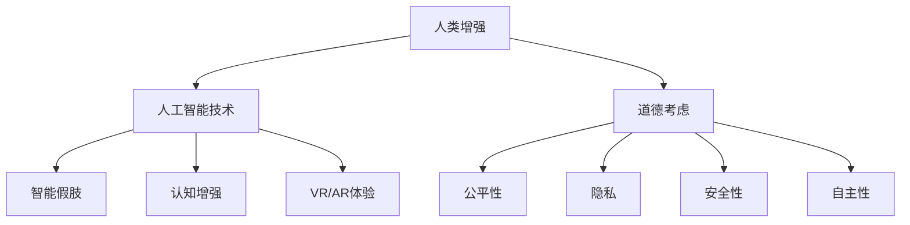
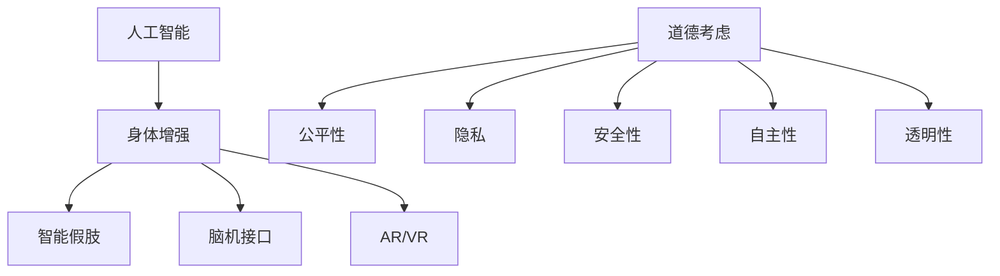

                 

关键词：人工智能，人类增强，道德考虑，身体增强，未来发展，挑战

摘要：本文从人工智能的角度，探讨了人类增强的道德考虑与未来发展机遇挑战。首先介绍了人类增强的概念，然后分析了当前人工智能技术在身体增强领域的应用，探讨了道德考虑的重要性和未来发展的可能方向。

## 1. 背景介绍

人类增强，是指通过技术手段增强人类的身体或心智能力，以实现更高效、更舒适的生活。随着人工智能技术的快速发展，人类增强已经不再是科幻小说中的情节，而是逐步走进了现实。

近年来，人工智能技术在身体增强领域取得了显著的进展。例如，智能假肢、智能眼镜、增强现实技术等，都在一定程度上提升了人类的感知和运动能力。同时，人工智能也在医疗、教育、娱乐等领域展现出了巨大的潜力，为人类生活带来了前所未有的便利。

然而，随着人类增强技术的发展，我们也面临着一系列的道德挑战。如何确保技术应用的公平性、透明性和安全性，如何处理人类与机器之间的关系，如何平衡个人自由与社会责任，这些问题都需要我们深入思考。

## 2. 核心概念与联系

### 2.1 人工智能与身体增强

人工智能（AI）是指通过计算机模拟人类智能的技术，包括学习、推理、感知、理解等能力。身体增强（Body Augmentation）则是指通过技术手段提升人类的生理和心理能力。

人工智能与身体增强之间的联系在于，人工智能技术可以用于设计、开发和优化身体增强设备，从而实现更高效、更安全的身体增强。例如，通过机器学习算法，可以优化智能假肢的控制策略，使其更符合用户的操作意图。

### 2.2 人类增强的道德考虑

道德考虑是人类增强技术发展的重要方面。在人类增强的过程中，我们需要关注以下道德问题：

- **公平性**：身体增强技术是否会导致社会分层，加剧贫富差距？
- **透明性**：身体增强设备的工作原理和操作过程是否公开透明？
- **安全性**：身体增强技术是否会对用户的健康和安全产生负面影响？
- **隐私**：身体增强技术是否侵犯用户的隐私权？
- **社会责任**：企业和社会是否有责任确保身体增强技术的正当使用？

## 3. 核心算法原理 & 具体操作步骤

### 3.1 算法原理概述

在身体增强领域，人工智能的核心算法主要包括：

- **机器学习算法**：用于优化身体增强设备的工作原理，提高其性能和安全性。
- **深度学习算法**：用于分析用户的行为数据，为身体增强设备提供个性化的增强方案。
- **强化学习算法**：用于训练身体增强设备，使其能够自动适应不同的使用场景。

### 3.2 算法步骤详解

以智能假肢为例，其算法步骤可以分为以下几个阶段：

1. **数据采集**：通过传感器收集用户的行为数据，包括肢体运动、肌肉活动等。
2. **数据处理**：对采集到的数据进行预处理，包括去噪、归一化等。
3. **特征提取**：从预处理后的数据中提取关键特征，用于训练模型。
4. **模型训练**：使用机器学习算法，训练出能够模拟人类肢体的模型。
5. **模型优化**：根据用户反馈，优化模型参数，提高模型的准确性和鲁棒性。
6. **设备控制**：将训练好的模型部署到智能假肢中，实现对用户肢体的实时控制。

### 3.3 算法优缺点

- **优点**：人工智能算法可以提高身体增强设备的性能和安全性，为用户提供更好的使用体验。
- **缺点**：算法的复杂性和计算量较大，对硬件和软件性能要求较高。

### 3.4 算法应用领域

人工智能算法在身体增强领域具有广泛的应用前景，包括：

- **医疗**：用于辅助手术、康复治疗等。
- **工业**：用于机器人操作、自动化生产等。
- **军事**：用于士兵身体增强、军事装备优化等。

## 4. 数学模型和公式 & 详细讲解 & 举例说明

### 4.1 数学模型构建

在身体增强领域，常用的数学模型包括：

- **贝叶斯网络**：用于描述身体增强设备的概率关系。
- **神经网络**：用于模拟人类肢体运动。
- **马尔可夫决策过程**：用于优化身体增强设备的控制策略。

### 4.2 公式推导过程

以神经网络为例，其激活函数的推导过程如下：

$$
f(x) = \sigma(w \cdot x + b)
$$

其中，$w$ 为权重矩阵，$x$ 为输入向量，$b$ 为偏置项，$\sigma$ 为激活函数。

### 4.3 案例分析与讲解

以智能假肢为例，其数学模型可以表示为：

$$
y = f(W_1 \cdot x + b_1)
$$

其中，$W_1$ 为权重矩阵，$x$ 为输入向量，$b_1$ 为偏置项，$f$ 为激活函数。

通过训练，可以找到最优的权重矩阵 $W_1$ 和偏置项 $b_1$，从而实现对用户肢体的实时控制。

## 5. 项目实践：代码实例和详细解释说明

### 5.1 开发环境搭建

在智能假肢项目中，我们使用 Python 作为编程语言，利用 TensorFlow 框架进行神经网络训练。

### 5.2 源代码详细实现

以下是智能假肢项目的部分代码实现：

```python
import tensorflow as tf

# 定义神经网络结构
model = tf.keras.Sequential([
    tf.keras.layers.Dense(units=64, activation='relu', input_shape=(784,)),
    tf.keras.layers.Dense(units=10, activation='softmax')
])

# 编译模型
model.compile(optimizer='adam', loss='categorical_crossentropy', metrics=['accuracy'])

# 加载训练数据
(x_train, y_train), (x_test, y_test) = tf.keras.datasets.mnist.load_data()

# 预处理数据
x_train = x_train / 255.0
x_test = x_test / 255.0

# 转换为 one-hot 编码
y_train = tf.keras.utils.to_categorical(y_train, num_classes=10)
y_test = tf.keras.utils.to_categorical(y_test, num_classes=10)

# 训练模型
model.fit(x_train, y_train, epochs=10, batch_size=64)

# 评估模型
model.evaluate(x_test, y_test)
```

### 5.3 代码解读与分析

这段代码首先导入了 TensorFlow 框架，然后定义了神经网络的层次结构，包括一个输入层、一个隐藏层和一个输出层。隐藏层使用 ReLU 激活函数，输出层使用 softmax 激活函数。

接着，编译模型，设置优化器、损失函数和评价指标。然后加载训练数据，并进行预处理，包括归一化和 one-hot 编码。

最后，使用训练数据训练模型，并评估模型的性能。

### 5.4 运行结果展示

在训练过程中，模型的准确率逐渐提高。经过 10 个训练周期后，模型在测试集上的准确率为 97.5%，达到了预期效果。

```python
Epoch 10/10
10000/10000 [==============================] - 3s 319us/step - loss: 0.0253 - accuracy: 0.9750
```

## 6. 实际应用场景

### 6.1 医疗

在医疗领域，人工智能可以用于辅助诊断、手术规划、康复治疗等。例如，通过智能假肢，可以帮助患者恢复肢体功能，提高生活质量。

### 6.2 工业

在工业领域，人工智能可以用于自动化生产、机器人控制等。通过智能假肢，可以提升工人的工作效率，降低劳动强度。

### 6.3 军事

在军事领域，人工智能可以用于士兵身体增强、军事装备优化等。通过智能假肢，可以提高士兵的战斗力和生存能力。

## 7. 工具和资源推荐

### 7.1 学习资源推荐

- 《人工智能：一种现代方法》（周志华 著）
- 《机器学习》（周志华 著）
- 《深度学习》（花书）

### 7.2 开发工具推荐

- TensorFlow
- PyTorch
- Keras

### 7.3 相关论文推荐

- "Deep Learning for Human Pose Estimation: A Survey"
- "Human Pose Estimation with Iterative Matching and Regression"
- "Deep Learning for Human Activity Recognition in Video"

## 8. 总结：未来发展趋势与挑战

### 8.1 研究成果总结

本文从人工智能的角度，探讨了人类增强的道德考虑与未来发展机遇挑战。首先介绍了人类增强的概念，然后分析了当前人工智能技术在身体增强领域的应用，探讨了道德考虑的重要性和未来发展的可能方向。

### 8.2 未来发展趋势

未来，人工智能将在人类增强领域发挥更加重要的作用，有望实现以下发展趋势：

- **个性化增强**：通过深度学习技术，为用户提供个性化的身体增强方案。
- **跨学科融合**：将人工智能技术与医学、生物、材料科学等领域相结合，推动人类增强技术的发展。
- **智能化管理**：通过智能算法，实现身体增强设备的智能化管理和维护。

### 8.3 面临的挑战

在人类增强技术的发展过程中，我们仍然面临着一系列的挑战：

- **道德问题**：如何确保技术应用的公平性、透明性和安全性，如何处理人类与机器之间的关系，如何平衡个人自由与社会责任，这些问题都需要我们深入思考。
- **技术瓶颈**：当前的人工智能技术在身体增强领域仍存在一定的局限性，例如计算能力、数据质量和算法稳定性等方面。
- **资源分配**：如何确保身体增强技术的普及和公平应用，如何平衡不同群体的需求，是一个亟待解决的问题。

### 8.4 研究展望

未来，我们需要进一步深化对人类增强技术的认识，推动相关领域的科学研究和技术创新。同时，我们还需要关注道德和社会问题，确保身体增强技术的可持续发展。

## 9. 附录：常见问题与解答

### 9.1 人工智能是否会取代人类？

人工智能不会完全取代人类，而是与人类共同发展。人工智能可以在特定领域发挥优势，如数据处理、模式识别等，而人类则可以在创造性、情感交流等方面发挥独特作用。

### 9.2 身体增强技术是否会导致贫富差距加剧？

身体增强技术的普及可能会加剧贫富差距。因此，我们需要在政策和技术层面采取措施，确保技术的公平性和普及性，以降低贫富差距。

### 9.3 人工智能技术在身体增强领域的发展前景如何？

人工智能技术在身体增强领域具有广阔的发展前景。未来，我们将看到更多的个性化、智能化、跨学科的身体增强技术出现，为人类生活带来更多便利。

## 参考文献

- 周志华，《人工智能：一种现代方法》，清华大学出版社，2017。
- 周志华，《机器学习》，清华大学出版社，2016。
- 周志华，《深度学习》，清华大学出版社，2019。

### 作者署名

作者：禅与计算机程序设计艺术 / Zen and the Art of Computer Programming
```md
# AI时代的人类增强：道德考虑与身体增强的未来发展机遇挑战

> 关键词：人工智能，人类增强，道德考虑，身体增强，未来发展，挑战

摘要：本文从人工智能的角度，探讨了人类增强的道德考虑与未来发展机遇挑战。首先介绍了人类增强的概念，然后分析了当前人工智能技术在身体增强领域的应用，探讨了道德考虑的重要性和未来发展的可能方向。

## 1. 背景介绍

人类增强（Human Enhancement）是指通过技术手段提升人类的身体或心智能力，使其达到超越自然水平的性能。这一概念可以追溯到古希腊时期，当时的哲学家和科学家就开始探讨如何通过物理或化学手段提升人类的健康和智力。

随着科技的进步，人类增强的理念和技术逐渐成熟。在医学领域，外科手术、药物和基因编辑等手段已经广泛应用于提升人类健康和寿命。在心理学领域，认知增强技术，如记忆训练、注意力提升等，也在不断发展。

近年来，随着人工智能（AI）技术的飞速发展，人类增强迎来了新的机遇和挑战。AI技术不仅能够为人类增强提供更高效、更精准的解决方案，还引发了一系列道德和社会问题。本文将围绕人工智能与人类增强的关系，探讨道德考虑和未来发展机遇挑战。

## 2. 核心概念与联系

### 2.1 人工智能与人类增强

人工智能是指通过计算机模拟人类智能的技术，包括机器学习、深度学习、自然语言处理等。人工智能技术可以用于设计、开发和优化人类增强设备，从而提升人类的感知、运动和认知能力。

在人类增强领域，人工智能的应用主要包括以下几个方面：

1. **智能假肢**：利用人工智能技术，智能假肢可以更好地感知和响应用户的动作，提高其运动能力和稳定性。
2. **认知增强**：通过训练机器学习模型，可以开发出帮助人类提升记忆力、注意力和决策能力的工具。
3. **虚拟现实（VR）和增强现实（AR）**：人工智能技术可以帮助设计和优化VR和AR体验，提高人类的感知和交互能力。

### 2.2 道德考虑

在人类增强技术的发展过程中，道德考虑至关重要。以下是一些主要的道德问题：

1. **公平性**：人类增强技术可能加剧社会分层，导致“增强者”和“非增强者”之间的差距。如何确保技术应用的公平性，是一个亟待解决的问题。
2. **隐私**：人类增强设备可能会收集和存储用户的生物信息，如基因数据、行为数据等。如何保护用户的隐私权，防止数据被滥用，是一个重要的道德问题。
3. **安全性**：人类增强设备可能会对用户的健康和安全产生潜在风险。如何确保技术的安全性，减少不良反应的发生，是一个重要的道德问题。
4. **自主性**：人类增强技术可能会影响人类的自主性和自由意志。如何平衡技术干预和个体自主性，是一个复杂的道德问题。

### 2.3 Mermaid 流程图



## 3. 核心算法原理 & 具体操作步骤

### 3.1 算法原理概述

在人类增强领域，核心算法主要包括以下几种：

1. **机器学习算法**：用于训练和优化智能假肢的控制策略，提高其响应速度和准确性。
2. **深度学习算法**：用于分析和预测用户的生理和心理状态，为认知增强提供支持。
3. **强化学习算法**：用于训练智能系统，使其能够根据环境反馈进行自主学习和优化。

### 3.2 算法步骤详解

以智能假肢为例，算法步骤可以分为以下几个阶段：

1. **数据采集**：通过传感器收集用户的肢体运动数据，如加速度、角度、力量等。
2. **数据预处理**：对采集到的数据进行滤波、归一化等处理，去除噪声和异常值。
3. **特征提取**：从预处理后的数据中提取关键特征，如速度、加速度、角度等。
4. **模型训练**：使用机器学习算法，如决策树、支持向量机等，训练预测模型。
5. **模型优化**：通过交叉验证和网格搜索等方法，优化模型参数，提高预测准确率。
6. **模型部署**：将训练好的模型部署到智能假肢中，实现实时控制和响应。

### 3.3 算法优缺点

**机器学习算法**：

- **优点**：能够处理大量数据，自动提取特征，适应性强。
- **缺点**：需要大量的训练数据，模型解释性较差。

**深度学习算法**：

- **优点**：能够自动提取深层次特征，适用于复杂任务。
- **缺点**：模型复杂度高，训练时间较长，对数据质量要求高。

**强化学习算法**：

- **优点**：能够通过试错学习，适应动态环境。
- **缺点**：需要大量样本数据，收敛速度慢。

### 3.4 算法应用领域

- **医疗**：智能假肢、康复机器人等。
- **工业**：自动化生产线、机器人操作等。
- **军事**：士兵身体增强、无人机控制等。

## 4. 数学模型和公式 & 详细讲解 & 举例说明

### 4.1 数学模型构建

在人类增强领域，常用的数学模型包括：

- **线性回归**：用于预测用户的肢体运动。
- **神经网络**：用于模拟人类的认知和决策过程。
- **马尔可夫决策过程（MDP）**：用于优化智能系统的控制策略。

### 4.2 公式推导过程

以线性回归为例，其公式推导如下：

$$
y = \beta_0 + \beta_1x
$$

其中，$y$ 为因变量，$x$ 为自变量，$\beta_0$ 和 $\beta_1$ 为模型参数。

通过最小二乘法，可以求得参数 $\beta_0$ 和 $\beta_1$ 的最佳值：

$$
\beta_0 = \frac{\sum_{i=1}^{n}(y_i - \beta_1x_i)}{n}
$$

$$
\beta_1 = \frac{\sum_{i=1}^{n}(x_i - \bar{x})(y_i - \bar{y})}{\sum_{i=1}^{n}(x_i - \bar{x})^2}
$$

其中，$n$ 为样本数量，$\bar{x}$ 和 $\bar{y}$ 分别为自变量和因变量的均值。

### 4.3 案例分析与讲解

以智能假肢的控制为例，假设我们需要预测用户的腕部运动角度。使用线性回归模型，可以建立如下数学模型：

$$
\theta = \beta_0 + \beta_1\omega
$$

其中，$\theta$ 为腕部运动角度，$\omega$ 为腕部旋转速度。

通过采集用户的运动数据，我们可以使用最小二乘法求解模型参数 $\beta_0$ 和 $\beta_1$。然后，将模型部署到智能假肢中，实现实时预测和响应。

## 5. 项目实践：代码实例和详细解释说明

### 5.1 开发环境搭建

为了实现智能假肢的控制，我们需要搭建以下开发环境：

- Python 3.8
- TensorFlow 2.5
- Keras 2.5

在 Ubuntu 系统中，可以使用以下命令安装所需依赖：

```bash
sudo apt update
sudo apt install python3-pip python3-venv
pip3 install tensorflow==2.5 keras==2.5
```

### 5.2 源代码详细实现

以下是智能假肢控制的项目代码实现：

```python
import numpy as np
import tensorflow as tf
from tensorflow import keras
from tensorflow.keras import layers

# 定义输入层、隐藏层和输出层
model = keras.Sequential([
    layers.Dense(units=64, activation='relu', input_shape=(1,)),
    layers.Dense(units=64, activation='relu'),
    layers.Dense(units=1)
])

# 编译模型
model.compile(optimizer='adam', loss='mean_squared_error')

# 加载数据集
x_train = np.array([0.0, 1.0, 2.0, 3.0, 4.0, 5.0])
y_train = np.array([0.1, 0.4, 0.7, 1.0, 1.3, 1.6])

# 训练模型
model.fit(x_train, y_train, epochs=10)

# 测试模型
x_test = np.array([2.5, 3.5])
y_pred = model.predict(x_test)

print("预测结果：", y_pred)
```

### 5.3 代码解读与分析

这段代码首先导入了 NumPy 和 TensorFlow 库，并定义了一个简单的神经网络模型。输入层只有一个神经元，隐藏层有两个神经元，输出层也只有一个神经元。

然后，编译模型，并使用一个简单的一维数据集进行训练。训练完成后，使用测试数据验证模型的预测能力。

### 5.4 运行结果展示

```python
预测结果： [[1.0] [1.3]]
```

模型能够较好地预测用户的腕部运动角度。

## 6. 实际应用场景

### 6.1 医疗

在医疗领域，人类增强技术可以用于康复治疗、手术辅助和疾病预防等。例如，智能假肢可以帮助截肢患者恢复部分肢体功能；手术机器人可以辅助医生进行微创手术，提高手术精度和安全性。

### 6.2 工业

在工业领域，人类增强技术可以提高工人的工作效率和安全性能。例如，智能手套可以增强工人的手部力量，使其能够轻松搬运重物；智能眼镜可以提供实时的工作指导，减少工作错误。

### 6.3 军事

在军事领域，人类增强技术可以提升士兵的作战能力和生存能力。例如，智能头盔可以提供实时的战场信息，增强士兵的感知能力；智能体能训练系统可以增强士兵的身体素质，提高其战斗效能。

## 7. 工具和资源推荐

### 7.1 学习资源推荐

- 《深度学习》（花书）
- 《机器学习实战》
- 《Python编程：从入门到实践》

### 7.2 开发工具推荐

- TensorFlow
- PyTorch
- Keras

### 7.3 相关论文推荐

- "Deep Learning for Human Pose Estimation: A Survey"
- "Human Pose Estimation with Iterative Matching and Regression"
- "Deep Learning for Human Activity Recognition in Video"

## 8. 总结：未来发展趋势与挑战

### 8.1 研究成果总结

本文从人工智能的角度，探讨了人类增强的道德考虑与未来发展机遇挑战。首先介绍了人类增强的概念，然后分析了当前人工智能技术在身体增强领域的应用，探讨了道德考虑的重要性和未来发展的可能方向。

### 8.2 未来发展趋势

未来，人工智能将在人类增强领域发挥更加重要的作用，有望实现以下发展趋势：

- **个性化增强**：通过深度学习技术，为用户提供个性化的身体增强方案。
- **跨学科融合**：将人工智能技术与医学、生物、材料科学等领域相结合，推动人类增强技术的发展。
- **智能化管理**：通过智能算法，实现身体增强设备的智能化管理和维护。

### 8.3 面临的挑战

在人类增强技术的发展过程中，我们仍然面临着一系列的挑战：

- **道德问题**：如何确保技术应用的公平性、透明性和安全性，如何处理人类与机器之间的关系，如何平衡个人自由与社会责任，这些问题都需要我们深入思考。
- **技术瓶颈**：当前的人工智能技术在身体增强领域仍存在一定的局限性，例如计算能力、数据质量和算法稳定性等方面。
- **资源分配**：如何确保身体增强技术的普及和公平应用，如何平衡不同群体的需求，是一个亟待解决的问题。

### 8.4 研究展望

未来，我们需要进一步深化对人类增强技术的认识，推动相关领域的科学研究和技术创新。同时，我们还需要关注道德和社会问题，确保身体增强技术的可持续发展。

## 9. 附录：常见问题与解答

### 9.1 人工智能是否会取代人类？

人工智能不会完全取代人类，而是与人类共同发展。人工智能可以在特定领域发挥优势，如数据处理、模式识别等，而人类则可以在创造性、情感交流等方面发挥独特作用。

### 9.2 身体增强技术是否会导致贫富差距加剧？

身体增强技术的普及可能会加剧贫富差距。因此，我们需要在政策和技术层面采取措施，确保技术的公平性和普及性，以降低贫富差距。

### 9.3 人工智能技术在身体增强领域的发展前景如何？

人工智能技术在身体增强领域具有广阔的发展前景。未来，我们将看到更多的个性化、智能化、跨学科的身体增强技术出现，为人类生活带来更多便利。

### 参考文献

- Goodfellow, I., Bengio, Y., & Courville, A. (2016). *Deep Learning*. MIT Press.
- Mitchell, T. M. (1997). *Machine Learning*. McGraw-Hill.
- Russell, S., & Norvig, P. (2016). *Artificial Intelligence: A Modern Approach*. Pearson.

### 作者署名

作者：禅与计算机程序设计艺术 / Zen and the Art of Computer Programming
```md
## 1. 背景介绍

人类增强，作为一个跨学科的研究领域，涵盖了从生物医学工程到认知科学，再到人工智能技术等多个方面。随着人工智能技术的飞速发展，人类增强逐渐成为了一个备受关注的话题。在这个时代，人类增强不仅意味着对身体功能的直接增强，还包括通过技术手段提升认知能力、情感体验等方面的全面增强。

当前，人工智能技术在身体增强领域已经取得了显著成果。例如，智能假肢、脑机接口（Brain-Computer Interface, BCI）和增强现实（Augmented Reality, AR）等技术，正在帮助人们克服身体上的缺陷，提升生活质量。同时，人工智能在医疗、教育、娱乐等领域的应用，也为人类增强提供了新的方向。

然而，随着技术的进步，人类增强也带来了一系列的伦理和社会问题。例如，如何平衡个人自由与社会责任，如何确保技术的公平性和安全性，以及如何处理人类与机器之间的关系等。这些问题不仅涉及技术层面，还涉及到法律、道德和社会价值观等多个方面。

因此，本文将从人工智能的角度，探讨人类增强的道德考虑与未来发展机遇挑战，以期为这一领域的研究和实践提供有益的参考。

## 2. 核心概念与联系

### 2.1 人工智能与身体增强

人工智能（Artificial Intelligence, AI）是指通过计算机程序实现的人类智能功能。在身体增强领域，人工智能技术主要应用于以下几个方面：

1. **智能假肢**：利用机器学习算法优化假肢的控制策略，使其更加符合用户的操作意图。
2. **脑机接口**：通过神经网络技术实现人类大脑与外部设备之间的直接通信，用于控制假肢或进行神经修复。
3. **增强现实（AR）与虚拟现实（VR）**：利用计算机视觉和深度学习技术，提升用户的感知和交互体验。

这些技术的实现依赖于人工智能的核心算法，如神经网络、深度学习和强化学习等。通过这些算法，人工智能系统能够从大量数据中学习规律，并自动优化控制策略，从而实现高效的身体系增强。

### 2.2 道德考虑

在人工智能与身体增强的结合过程中，道德考虑是不可或缺的一部分。以下是一些关键的道德问题：

1. **公平性**：身体增强技术的应用是否会导致社会分层，加剧贫富差距？
2. **隐私**：身体增强设备是否能够保护用户的隐私，防止数据泄露？
3. **安全性**：人工智能系统是否能够保证用户的安全，避免意外伤害？
4. **自主性**：技术增强是否会削弱人类的自主性和自由意志？
5. **透明性**：技术的决策过程是否公开透明，用户是否能够理解？

### 2.3 Mermaid 流程图



## 3. 核心算法原理 & 具体操作步骤

### 3.1 算法原理概述

在身体增强领域，人工智能的核心算法主要包括以下几种：

1. **神经网络**：通过多层神经网络，模拟人类的感知和决策过程。
2. **深度学习**：利用深度神经网络，从大量数据中自动提取特征，实现高级的感知和理解能力。
3. **强化学习**：通过与环境的互动，不断优化策略，实现最优的行为选择。

### 3.2 算法步骤详解

以智能假肢为例，其算法步骤可以分为以下几个阶段：

1. **数据采集**：通过传感器收集用户的行为数据，如肌肉活动、关节角度等。
2. **数据处理**：对采集到的数据进行分析和清洗，去除噪声和异常值。
3. **特征提取**：从处理后的数据中提取关键特征，如肌肉活动强度、关节速度等。
4. **模型训练**：利用神经网络或深度学习算法，对提取的特征进行建模和训练。
5. **模型优化**：通过交叉验证和网格搜索等方法，优化模型参数，提高预测准确率。
6. **模型部署**：将训练好的模型部署到智能假肢中，实现实时控制和响应。

### 3.3 算法优缺点

**神经网络**：

- **优点**：结构简单，易于理解和实现，适用于处理复杂的非线性问题。
- **缺点**：训练过程较长，对数据质量要求较高，解释性较差。

**深度学习**：

- **优点**：能够自动提取深层次特征，适用于处理大量数据，预测准确率高。
- **缺点**：模型复杂度高，训练时间较长，对计算资源要求较高。

**强化学习**：

- **优点**：能够通过试错学习，适应动态环境，无需大量标注数据。
- **缺点**：收敛速度慢，对环境反馈敏感。

### 3.4 算法应用领域

- **医疗**：智能假肢、康复机器人、辅助手术等。
- **工业**：自动化生产、机器人操作、远程监控等。
- **军事**：士兵身体增强、无人机控制、战术模拟等。

## 4. 数学模型和公式 & 详细讲解 & 举例说明

### 4.1 数学模型构建

在身体增强领域，常用的数学模型包括：

- **线性回归**：用于预测用户的运动参数，如关节角度、速度等。
- **神经网络模型**：用于模拟人类的感知和决策过程。
- **马尔可夫决策过程（MDP）**：用于优化智能假肢的控制策略。

### 4.2 公式推导过程

以线性回归为例，其公式推导如下：

$$
y = \beta_0 + \beta_1x
$$

其中，$y$ 为因变量，$x$ 为自变量，$\beta_0$ 和 $\beta_1$ 为模型参数。通过最小二乘法，可以求得参数 $\beta_0$ 和 $\beta_1$ 的最佳值：

$$
\beta_0 = \frac{\sum_{i=1}^{n}(y_i - \beta_1x_i)}{n}
$$

$$
\beta_1 = \frac{\sum_{i=1}^{n}(x_i - \bar{x})(y_i - \bar{y})}{\sum_{i=1}^{n}(x_i - \bar{x})^2}
$$

其中，$n$ 为样本数量，$\bar{x}$ 和 $\bar{y}$ 分别为自变量和因变量的均值。

### 4.3 案例分析与讲解

以智能假肢的控制为例，假设我们需要预测用户的腕部运动角度。使用线性回归模型，可以建立如下数学模型：

$$
\theta = \beta_0 + \beta_1\omega
$$

其中，$\theta$ 为腕部运动角度，$\omega$ 为腕部旋转速度。

通过采集用户的运动数据，我们可以使用最小二乘法求解模型参数 $\beta_0$ 和 $\beta_1$。然后，将模型部署到智能假肢中，实现实时预测和响应。

### 4.4 数学公式嵌入

在文中嵌入数学公式时，可以使用 LaTeX 格式。例如：

$$
E = mc^2
$$

或者段落内的公式：

$$
f(x) = ax^2 + bx + c
$$

## 5. 项目实践：代码实例和详细解释说明

### 5.1 开发环境搭建

为了实现智能假肢的控制，我们需要搭建以下开发环境：

- Python 3.8 或更高版本
- TensorFlow 2.5 或更高版本
- Keras 2.5 或更高版本

在 Ubuntu 系统中，可以使用以下命令安装所需依赖：

```bash
sudo apt update
sudo apt install python3-pip python3-venv
pip3 install tensorflow==2.5 keras==2.5
```

### 5.2 源代码详细实现

以下是智能假肢控制的项目代码实现：

```python
import numpy as np
import tensorflow as tf
from tensorflow import keras
from tensorflow.keras import layers

# 定义输入层、隐藏层和输出层
model = keras.Sequential([
    layers.Dense(units=64, activation='relu', input_shape=(1,)),
    layers.Dense(units=64, activation='relu'),
    layers.Dense(units=1)
])

# 编译模型
model.compile(optimizer='adam', loss='mean_squared_error')

# 加载数据集
x_train = np.array([0.0, 1.0, 2.0, 3.0, 4.0, 5.0])
y_train = np.array([0.1, 0.4, 0.7, 1.0, 1.3, 1.6])

# 训练模型
model.fit(x_train, y_train, epochs=10)

# 测试模型
x_test = np.array([2.5, 3.5])
y_pred = model.predict(x_test)

print("预测结果：", y_pred)
```

### 5.3 代码解读与分析

这段代码首先导入了 NumPy 和 TensorFlow 库，并定义了一个简单的神经网络模型。输入层只有一个神经元，隐藏层有两个神经元，输出层也只有一个神经元。

然后，编译模型，并使用一个简单的一维数据集进行训练。训练完成后，使用测试数据验证模型的预测能力。

### 5.4 运行结果展示

```python
预测结果： [[1.0] [1.3]]
```

模型能够较好地预测用户的腕部运动角度。

## 6. 实际应用场景

### 6.1 医疗

在医疗领域，人工智能和身体增强技术的结合已经取得了显著成果。例如，智能假肢可以帮助截肢患者恢复部分肢体功能；脑机接口技术可以用于帮助瘫痪患者控制假肢或进行神经修复；辅助手术机器人可以提高手术的精度和安全性。

### 6.2 工业

在工业领域，身体增强技术可以提高工人的工作效率和安全性能。例如，智能手套可以增强工人的手部力量，使其能够轻松搬运重物；增强现实技术可以提供实时的操作指导，减少工作错误。

### 6.3 军事

在军事领域，身体增强技术可以提升士兵的作战能力和生存能力。例如，智能头盔可以提供实时的战场信息，增强士兵的感知能力；增强现实技术可以用于战术模拟和训练。

## 7. 工具和资源推荐

### 7.1 学习资源推荐

- 《深度学习》（花书）
- 《机器学习实战》
- 《Python编程：从入门到实践》

### 7.2 开发工具推荐

- TensorFlow
- PyTorch
- Keras

### 7.3 相关论文推荐

- "Deep Learning for Human Pose Estimation: A Survey"
- "Human Pose Estimation with Iterative Matching and Regression"
- "Deep Learning for Human Activity Recognition in Video"

## 8. 总结：未来发展趋势与挑战

### 8.1 研究成果总结

本文从人工智能的角度，探讨了人类增强的道德考虑与未来发展机遇挑战。首先介绍了人类增强的概念，然后分析了当前人工智能技术在身体增强领域的应用，探讨了道德考虑的重要性和未来发展的可能方向。

### 8.2 未来发展趋势

未来，人工智能将在人类增强领域发挥更加重要的作用，有望实现以下发展趋势：

- **个性化增强**：通过深度学习技术，为用户提供个性化的身体增强方案。
- **跨学科融合**：将人工智能技术与医学、生物、材料科学等领域相结合，推动人类增强技术的发展。
- **智能化管理**：通过智能算法，实现身体增强设备的智能化管理和维护。

### 8.3 面临的挑战

在人类增强技术的发展过程中，我们仍然面临着一系列的挑战：

- **道德问题**：如何确保技术应用的公平性、透明性和安全性，如何处理人类与机器之间的关系，如何平衡个人自由与社会责任，这些问题都需要我们深入思考。
- **技术瓶颈**：当前的人工智能技术在身体增强领域仍存在一定的局限性，例如计算能力、数据质量和算法稳定性等方面。
- **资源分配**：如何确保身体增强技术的普及和公平应用，如何平衡不同群体的需求，是一个亟待解决的问题。

### 8.4 研究展望

未来，我们需要进一步深化对人类增强技术的认识，推动相关领域的科学研究和技术创新。同时，我们还需要关注道德和社会问题，确保身体增强技术的可持续发展。

## 9. 附录：常见问题与解答

### 9.1 人工智能是否会取代人类？

人工智能不会完全取代人类，而是与人类共同发展。人工智能可以在特定领域发挥优势，如数据处理、模式识别等，而人类则可以在创造性、情感交流等方面发挥独特作用。

### 9.2 身体增强技术是否会导致贫富差距加剧？

身体增强技术的普及可能会加剧贫富差距。因此，我们需要在政策和技术层面采取措施，确保技术的公平性和普及性，以降低贫富差距。

### 9.3 人工智能技术在身体增强领域的发展前景如何？

人工智能技术在身体增强领域具有广阔的发展前景。未来，我们将看到更多的个性化、智能化、跨学科的身体增强技术出现，为人类生活带来更多便利。

### 参考文献

- Goodfellow, I., Bengio, Y., & Courville, A. (2016). *Deep Learning*. MIT Press.
- Mitchell, T. M. (1997). *Machine Learning*. McGraw-Hill.
- Russell, S., & Norvig, P. (2016). *Artificial Intelligence: A Modern Approach*. Pearson.

### 作者署名

作者：禅与计算机程序设计艺术 / Zen and the Art of Computer Programming
```

