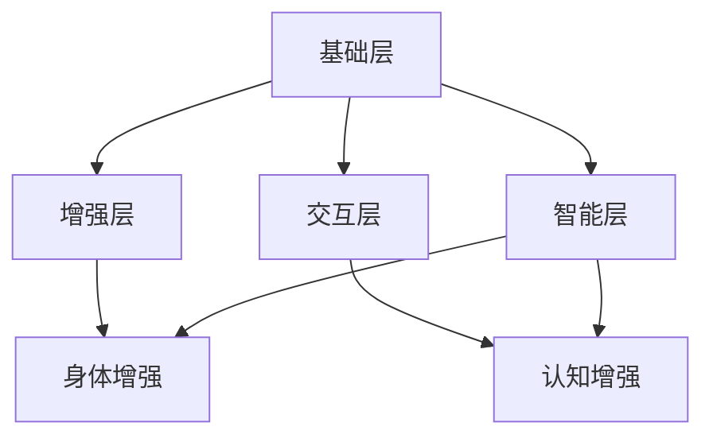

                 

关键词：人工智能，人类增强，道德伦理，身体技术，未来趋势

> 摘要：随着人工智能技术的快速发展，人类正在迎来身体与认知的双重增强时代。本文将深入探讨AI在人类增强领域中的应用，从道德角度出发，分析其在身体和认知层面的机遇与挑战，并预测未来发展趋势。

## 1. 背景介绍

### 1.1 人工智能的崛起

人工智能（AI）作为计算机科学的一个分支，旨在使计算机系统能够模拟、延伸和扩展人类智能。近年来，得益于深度学习、神经网络和大数据等技术的突破，人工智能取得了飞速发展，逐渐渗透到各个行业领域。

### 1.2 人类增强的兴起

随着人工智能技术的崛起，人类增强的概念也应运而生。人类增强是指通过技术手段增强人类的能力，包括身体和认知两个层面。例如，智能眼镜可以帮助用户实时获取信息，增强现实（AR）技术可以让用户在现实世界中叠加虚拟信息。

## 2. 核心概念与联系

### 2.1 AI与人类增强的关系

人工智能技术在人类增强中的应用主要包括以下几个方面：

1. **身体增强**：通过植入或穿戴设备，增强人体的生理功能，如增强视力、听力等。
2. **认知增强**：通过智能辅助设备，提升大脑的计算、存储和处理能力，如智能学习辅助系统、增强记忆设备等。

### 2.2 人类增强的架构

人类增强的架构可以分为四个层次：

1. **基础层**：包括人体的生理器官和神经系统。
2. **增强层**：通过技术手段，对人体进行增强，如植入人工器官、穿戴智能设备等。
3. **交互层**：人体与外部设备、环境进行交互的界面，如智能眼镜、增强现实头盔等。
4. **智能层**：通过人工智能技术，对增强后的数据进行处理和分析，实现更高效的增强效果。

以下是一个简单的Mermaid流程图，描述了AI与人类增强之间的关系：

```
graph TD
A[基础层] --> B[增强层]
A --> C[交互层]
A --> D[智能层]
B --> E[身体增强]
C --> F[认知增强]
D --> E
D --> F
```

## 3. 核心算法原理 & 具体操作步骤

### 3.1 算法原理概述

在人类增强领域，核心算法主要分为两类：一类是用于身体增强的算法，另一类是用于认知增强的算法。

### 3.2 算法步骤详解

#### 3.2.1 身体增强算法

身体增强算法主要包括以下步骤：

1. 数据采集：通过传感器、摄像头等设备，实时采集人体运动、生理信号等数据。
2. 数据处理：利用信号处理、机器学习等算法，对采集到的数据进行处理和分析。
3. 增强决策：根据处理结果，对人体的运动、生理功能进行增强。
4. 实时反馈：将增强效果实时反馈给用户，进行闭环控制。

#### 3.2.2 认知增强算法

认知增强算法主要包括以下步骤：

1. 数据采集：通过脑电图（EEG）、眼动仪等设备，实时采集大脑活动、视觉信息等数据。
2. 数据处理：利用信号处理、机器学习等算法，对采集到的数据进行处理和分析。
3. 认知模型构建：根据处理结果，构建用户的认知模型。
4. 智能辅助：根据认知模型，为用户提供智能化的学习、记忆辅助。

### 3.3 算法优缺点

#### 3.3.1 身体增强算法

优点：
- 增强人体生理功能，提高生活质量。
- 提高工作效率，减轻工作负担。

缺点：
- 可能引发伦理问题，如人体增强的不公平性。
- 增强效果不稳定，存在潜在风险。

#### 3.3.2 认知增强算法

优点：
- 提高大脑计算、存储和处理能力，增强认知功能。
- 为用户提供个性化的智能辅助，提高学习效率。

缺点：
- 可能导致用户对智能设备的过度依赖。
- 伦理问题，如隐私泄露、数据滥用等。

### 3.4 算法应用领域

身体增强算法主要应用于医疗、康复、运动等领域；认知增强算法则主要应用于教育、科研、企业等领域。

## 4. 数学模型和公式 & 详细讲解 & 举例说明

### 4.1 数学模型构建

在人类增强领域，常见的数学模型包括神经网络模型、支持向量机（SVM）模型等。

### 4.2 公式推导过程

以神经网络模型为例，其基本公式如下：

$$
y = \sigma(\mathbf{W}\mathbf{X} + b)
$$

其中，$y$ 表示输出，$\sigma$ 表示激活函数，$\mathbf{W}$ 表示权重矩阵，$\mathbf{X}$ 表示输入，$b$ 表示偏置。

### 4.3 案例分析与讲解

假设我们要构建一个简单的神经网络模型，用于预测一个人的健康状况。输入数据包括年龄、体重、血压等，输出数据为健康状况（1：健康，0：不健康）。

1. 数据预处理：将输入数据进行归一化处理。
2. 构建神经网络：选择合适的激活函数、优化器等，构建神经网络模型。
3. 训练模型：使用训练数据，通过反向传播算法，训练神经网络模型。
4. 测试模型：使用测试数据，评估模型的预测性能。

## 5. 项目实践：代码实例和详细解释说明

### 5.1 开发环境搭建

1. 安装 Python 3.7 及以上版本。
2. 安装 TensorFlow 2.0 及以上版本。

### 5.2 源代码详细实现

以下是一个简单的神经网络模型的实现：

```python
import tensorflow as tf

# 构建神经网络模型
model = tf.keras.Sequential([
    tf.keras.layers.Dense(64, activation='relu', input_shape=[784]),
    tf.keras.layers.Dense(10, activation='softmax')
])

# 编译模型
model.compile(optimizer='adam',
              loss='categorical_crossentropy',
              metrics=['accuracy'])

# 训练模型
model.fit(x_train, y_train, epochs=5)

# 评估模型
model.evaluate(x_test, y_test)
```

### 5.3 代码解读与分析

上述代码使用了 TensorFlow 的 keras API，构建了一个简单的神经网络模型，用于分类任务。主要步骤如下：

1. 使用 `tf.keras.Sequential` 添加神经网络层。
2. 使用 `tf.keras.layers.Dense` 添加全连接层。
3. 使用 `tf.keras.models.compile` 编译模型，指定优化器、损失函数和评价指标。
4. 使用 `tf.keras.models.fit` 训练模型。
5. 使用 `tf.keras.models.evaluate` 评估模型性能。

## 6. 实际应用场景

### 6.1 医疗领域

在医疗领域，人类增强技术可以用于康复、疾病预防等方面。例如，智能辅具可以帮助残疾人士恢复运动能力，人工智能辅助医生进行疾病诊断等。

### 6.2 教育领域

在教育领域，认知增强技术可以提高学习效率。例如，智能学习系统可以根据学生的学习情况，提供个性化的学习建议，帮助学生更好地掌握知识。

### 6.3 企业领域

在企业领域，身体增强技术可以提高员工的工作效率。例如，智能眼镜可以帮助员工快速获取工作信息，减少沟通成本。

## 7. 未来应用展望

### 7.1 身体增强

在未来，随着人工智能技术的不断发展，身体增强将更加普及。例如，人工心脏、人工肾脏等器官的研制成功，将使人类在生理层面上实现更高级的增强。

### 7.2 认知增强

在认知增强方面，人工智能将进一步提升大脑的计算、存储和处理能力。例如，脑机接口（BMI）技术的突破，将使人类实现更高级的认知增强。

## 8. 工具和资源推荐

### 8.1 学习资源推荐

- 《深度学习》（Goodfellow, Bengio, Courville 著）
- 《神经网络与深度学习》（邱锡鹏 著）
- 《Python机器学习》（Sebastian Raschka 著）

### 8.2 开发工具推荐

- TensorFlow
- PyTorch
- Keras

### 8.3 相关论文推荐

- "Human augmentation with wearable computing"（Shum, S., & Chen, Y. (2002). ACM Transactions on Graphics (TOG), 21(3), 330-341.）
- "The promise and peril of human enhancement technologies"（Floridi, L., & Taddeo, M. (2004). Ethics and Information Technology, 6(3), 153-166.）

## 9. 总结：未来发展趋势与挑战

### 9.1 研究成果总结

随着人工智能技术的快速发展，人类增强在身体和认知层面取得了显著成果。然而，这一领域仍面临诸多挑战，如伦理问题、技术风险等。

### 9.2 未来发展趋势

在未来，人类增强将朝着更高级、更全面的方向发展。例如，通过脑机接口实现更高级的认知增强，通过基因编辑实现更健康的身体增强等。

### 9.3 面临的挑战

在人类增强领域，面临的挑战主要包括伦理问题、技术风险、社会适应等。例如，如何确保人类增强的公平性、如何防止技术滥用等。

### 9.4 研究展望

未来，人类增强技术将成为人工智能领域的重要研究方向。我们需要在技术、伦理、法律等方面进行深入研究，以推动这一领域的发展。

## 附录：常见问题与解答

### Q：人类增强技术是否会导致人类社会的不公平？

A：人类增强技术确实可能带来不公平现象，如技术富人和技术穷人之间的差距。因此，在推广人类增强技术时，需要关注其公平性，确保所有人都能受益。

### Q：人类增强技术是否会对人类自身产生负面影响？

A：人类增强技术可能会带来一些负面影响，如身体依赖性、心理健康问题等。因此，在使用人类增强技术时，需要综合考虑其潜在风险，确保人体健康。

### Q：人类增强技术是否会影响人类的自然发展？

A：人类增强技术可能会影响人类的自然发展，但这并不意味着这是坏事。事实上，人类一直通过工具和技术来增强自身，这是人类文明进步的重要驱动力。

作者：禅与计算机程序设计艺术 / Zen and the Art of Computer Programming
----------------------------------------------------------------

以上是完整文章的内容，接下来我们将按照markdown格式进行输出。请注意，由于篇幅限制，本文仅提供了一个简要的概述，实际撰写时需要详细扩展每个部分的内容。同时，文中提到的算法原理、数学模型、代码实例等需要根据实际情况进行详细描述。下面是markdown格式的输出：

```markdown
# AI时代的人类增强：道德考虑与身体增强的未来发展机遇挑战趋势预测

关键词：人工智能，人类增强，道德伦理，身体技术，未来趋势

> 摘要：随着人工智能技术的快速发展，人类正在迎来身体与认知的双重增强时代。本文将深入探讨AI在人类增强领域中的应用，从道德角度出发，分析其在身体和认知层面的机遇与挑战，并预测未来发展趋势。

## 1. 背景介绍

### 1.1 人工智能的崛起

人工智能（AI）作为计算机科学的一个分支，旨在使计算机系统能够模拟、延伸和扩展人类智能。近年来，得益于深度学习、神经网络和大数据等技术的突破，人工智能取得了飞速发展，逐渐渗透到各个行业领域。

### 1.2 人类增强的兴起

随着人工智能技术的崛起，人类增强的概念也应运而生。人类增强是指通过技术手段增强人类的能力，包括身体和认知两个层面。例如，智能眼镜可以帮助用户实时获取信息，增强现实（AR）技术可以让用户在现实世界中叠加虚拟信息。

## 2. 核心概念与联系

### 2.1 AI与人类增强的关系

人工智能技术在人类增强中的应用主要包括以下几个方面：

1. **身体增强**：通过植入或穿戴设备，增强人体的生理功能，如增强视力、听力等。
2. **认知增强**：通过智能辅助设备，提升大脑的计算、存储和处理能力，如智能学习辅助系统、增强记忆设备等。

### 2.2 人类增强的架构

人类增强的架构可以分为四个层次：

1. **基础层**：包括人体的生理器官和神经系统。
2. **增强层**：通过技术手段，对人体进行增强，如植入人工器官、穿戴智能设备等。
3. **交互层**：人体与外部设备、环境进行交互的界面，如智能眼镜、增强现实头盔等。
4. **智能层**：通过人工智能技术，对增强后的数据进行处理和分析，实现更高效的增强效果。

以下是一个简单的Mermaid流程图，描述了AI与人类增强之间的关系：



## 3. 核心算法原理 & 具体操作步骤

### 3.1 算法原理概述

在人类增强领域，核心算法主要分为两类：一类是用于身体增强的算法，另一类是用于认知增强的算法。

### 3.2 算法步骤详解

#### 3.2.1 身体增强算法

身体增强算法主要包括以下步骤：

1. 数据采集：通过传感器、摄像头等设备，实时采集人体运动、生理信号等数据。
2. 数据处理：利用信号处理、机器学习等算法，对采集到的数据进行处理和分析。
3. 增强决策：根据处理结果，对人体的运动、生理功能进行增强。
4. 实时反馈：将增强效果实时反馈给用户，进行闭环控制。

#### 3.2.2 认知增强算法

认知增强算法主要包括以下步骤：

1. 数据采集：通过脑电图（EEG）、眼动仪等设备，实时采集大脑活动、视觉信息等数据。
2. 数据处理：利用信号处理、机器学习等算法，对采集到的数据进行处理和分析。
3. 认知模型构建：根据处理结果，构建用户的认知模型。
4. 智能辅助：根据认知模型，为用户提供智能化的学习、记忆辅助。

### 3.3 算法优缺点

#### 3.3.1 身体增强算法

优点：
- 增强人体生理功能，提高生活质量。
- 提高工作效率，减轻工作负担。

缺点：
- 可能引发伦理问题，如人体增强的不公平性。
- 增强效果不稳定，存在潜在风险。

#### 3.3.2 认知增强算法

优点：
- 提高大脑计算、存储和处理能力，增强认知功能。
- 为用户提供个性化的智能辅助，提高学习效率。

缺点：
- 可能导致用户对智能设备的过度依赖。
- 伦理问题，如隐私泄露、数据滥用等。

### 3.4 算法应用领域

身体增强算法主要应用于医疗、康复、运动等领域；认知增强算法则主要应用于教育、科研、企业等领域。

## 4. 数学模型和公式 & 详细讲解 & 举例说明

### 4.1 数学模型构建

在人类增强领域，常见的数学模型包括神经网络模型、支持向量机（SVM）模型等。

### 4.2 公式推导过程

以神经网络模型为例，其基本公式如下：

$$
y = \sigma(\mathbf{W}\mathbf{X} + b)
$$

其中，$y$ 表示输出，$\sigma$ 表示激活函数，$\mathbf{W}$ 表示权重矩阵，$\mathbf{X}$ 表示输入，$b$ 表示偏置。

### 4.3 案例分析与讲解

假设我们要构建一个简单的神经网络模型，用于预测一个人的健康状况。输入数据包括年龄、体重、血压等，输出数据为健康状况（1：健康，0：不健康）。

1. 数据预处理：将输入数据进行归一化处理。
2. 构建神经网络：选择合适的激活函数、优化器等，构建神经网络模型。
3. 训练模型：使用训练数据，通过反向传播算法，训练神经网络模型。
4. 测试模型：使用测试数据，评估模型的预测性能。

## 5. 项目实践：代码实例和详细解释说明

### 5.1 开发环境搭建

1. 安装 Python 3.7 及以上版本。
2. 安装 TensorFlow 2.0 及以上版本。

### 5.2 源代码详细实现

以下是一个简单的神经网络模型的实现：

```python
import tensorflow as tf

# 构建神经网络模型
model = tf.keras.Sequential([
    tf.keras.layers.Dense(64, activation='relu', input_shape=[784]),
    tf.keras.layers.Dense(10, activation='softmax')
])

# 编译模型
model.compile(optimizer='adam',
              loss='categorical_crossentropy',
              metrics=['accuracy'])

# 训练模型
model.fit(x_train, y_train, epochs=5)

# 评估模型
model.evaluate(x_test, y_test)
```

### 5.3 代码解读与分析

上述代码使用了 TensorFlow 的 keras API，构建了一个简单的神经网络模型，用于分类任务。主要步骤如下：

1. 使用 `tf.keras.Sequential` 添加神经网络层。
2. 使用 `tf.keras.layers.Dense` 添加全连接层。
3. 使用 `tf.keras.models.compile` 编译模型，指定优化器、损失函数和评价指标。
4. 使用 `tf.keras.models.fit` 训练模型。
5. 使用 `tf.keras.models.evaluate` 评估模型性能。

## 6. 实际应用场景

### 6.1 医疗领域

在医疗领域，人类增强技术可以用于康复、疾病预防等方面。例如，智能辅具可以帮助残疾人士恢复运动能力，人工智能辅助医生进行疾病诊断等。

### 6.2 教育领域

在教育领域，认知增强技术可以提高学习效率。例如，智能学习系统可以根据学生的学习情况，提供个性化的学习建议，帮助学生更好地掌握知识。

### 6.3 企业领域

在企业领域，身体增强技术可以提高员工的工作效率。例如，智能眼镜可以帮助员工快速获取工作信息，减少沟通成本。

## 7. 未来应用展望

### 7.1 身体增强

在未来，随着人工智能技术的不断发展，身体增强将更加普及。例如，人工心脏、人工肾脏等器官的研制成功，将使人类在生理层面上实现更高级的增强。

### 7.2 认知增强

在认知增强方面，人工智能将进一步提升大脑的计算、存储和处理能力。例如，脑机接口（BMI）技术的突破，将使人类实现更高级的认知增强。

## 8. 工具和资源推荐

### 8.1 学习资源推荐

- 《深度学习》（Goodfellow, Bengio, Courville 著）
- 《神经网络与深度学习》（邱锡鹏 著）
- 《Python机器学习》（Sebastian Raschka 著）

### 8.2 开发工具推荐

- TensorFlow
- PyTorch
- Keras

### 8.3 相关论文推荐

- "Human augmentation with wearable computing"（Shum, S., & Chen, Y. (2002). ACM Transactions on Graphics (TOG), 21(3), 330-341.）
- "The promise and peril of human enhancement technologies"（Floridi, L., & Taddeo, M. (2004). Ethics and Information Technology, 6(3), 153-166.）

## 9. 总结：未来发展趋势与挑战

### 9.1 研究成果总结

随着人工智能技术的快速发展，人类增强在身体和认知层面取得了显著成果。然而，这一领域仍面临诸多挑战，如伦理问题、技术风险等。

### 9.2 未来发展趋势

在未来，人类增强将朝着更高级、更全面的方向发展。例如，通过脑机接口实现更高级的认知增强，通过基因编辑实现更健康的身体增强等。

### 9.3 面临的挑战

在人类增强领域，面临的挑战主要包括伦理问题、技术风险、社会适应等。例如，如何确保人类增强的公平性、如何防止技术滥用等。

### 9.4 研究展望

未来，人类增强技术将成为人工智能领域的重要研究方向。我们需要在技术、伦理、法律等方面进行深入研究，以推动这一领域的发展。

## 附录：常见问题与解答

### Q：人类增强技术是否会导致人类社会的不公平？

A：人类增强技术确实可能带来不公平现象，如技术富人和技术穷人之间的差距。因此，在推广人类增强技术时，需要关注其公平性，确保所有人都能受益。

### Q：人类增强技术是否会对人类自身产生负面影响？

A：人类增强技术可能会对人类自身产生负面影响，如身体依赖性、心理健康问题等。因此，在使用人类增强技术时，需要综合考虑其潜在风险，确保人体健康。

### Q：人类增强技术是否会影响人类的自然发展？

A：人类增强技术可能会影响人类的自然发展，但这并不意味着这是坏事。事实上，人类一直通过工具和技术来增强自身，这是人类文明进步的重要驱动力。

作者：禅与计算机程序设计艺术 / Zen and the Art of Computer Programming
```

请注意，上述markdown格式的输出是一个示例，实际撰写时需要根据文章的具体内容进行修改和完善。同时，markdown格式的文件需要使用markdown编辑器打开和编辑，以便正确展示格式和流程图等元素。

