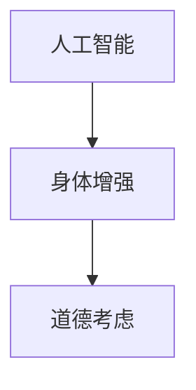

                 

关键词：人工智能，人类增强，道德考虑，身体增强，未来发展战略

> 摘要：随着人工智能技术的飞速发展，人类正迈向一个前所未有的增强时代。本文旨在探讨人工智能在人类身体增强中的应用，并深入分析其中的道德考虑。通过梳理相关技术和理论，本文提出了一个综合的发展策略，旨在为未来的人类身体增强提供指导。

## 1. 背景介绍

### 1.1 人工智能的发展与人类增强的兴起

人工智能（AI）作为计算机科学的一个重要分支，近年来取得了前所未有的突破。从早期的专家系统到如今的深度学习和神经网络，人工智能技术正不断突破人类的认知边界。随着AI技术的成熟，人类开始探索如何通过科技手段增强自身能力，进入所谓的“人类增强”时代。

### 1.2 身体增强的兴起

身体增强是指通过科学技术手段提升人体的生理、心理及感官能力。随着基因编辑、生物打印、神经接口等技术的进步，身体增强成为可能。人们希望通过这些技术，不仅能够治愈疾病，还能提升日常生活的质量和效率。

### 1.3 道德考虑的重要性

在人类增强的过程中，道德考量变得尤为重要。技术的进步往往伴随着伦理问题的出现。如何确保技术的安全性和合理性，如何平衡个人利益与社会责任，成为我们必须面对的挑战。

## 2. 核心概念与联系

### 2.1 人工智能与身体增强的关系

人工智能在身体增强中扮演着关键角色。通过机器学习和数据分析，AI可以帮助优化增强技术的效果，提高人体器官的功能。同时，AI还可以模拟人类行为，为身体增强提供个性化指导。

### 2.2 身体增强技术的核心概念

身体增强技术涉及多个领域，包括生物医学工程、神经科学、材料科学等。核心概念包括：

- **基因编辑**：通过CRISPR-Cas9等基因编辑技术，可以精确修改DNA序列，治愈遗传性疾病。
- **生物打印**：利用生物3D打印技术，可以制造人工组织和器官。
- **神经接口**：通过植入式设备，直接与大脑神经信号相连，实现感官和运动的增强。

### 2.3 Mermaid 流程图



## 3. 核心算法原理 & 具体操作步骤

### 3.1 算法原理概述

身体增强技术的核心算法主要涉及机器学习、神经网络和深度学习等。这些算法通过学习大量的数据，优化增强技术的效果。

### 3.2 算法步骤详解

1. 数据收集：收集与健康、运动、心理状态相关的数据。
2. 数据预处理：对数据进行清洗、归一化等处理。
3. 模型训练：使用神经网络或深度学习模型，对预处理后的数据进行训练。
4. 模型评估：通过交叉验证等方法，评估模型的性能。
5. 模型部署：将训练好的模型应用于实际场景。

### 3.3 算法优缺点

- **优点**：能够个性化定制增强方案，提高效果。
- **缺点**：对数据质量要求较高，且训练过程复杂。

### 3.4 算法应用领域

算法广泛应用于医疗、运动、国防等多个领域。例如，在医疗领域，AI可以帮助预测疾病风险，优化治疗方案；在运动领域，AI可以分析运动员的表现，提供个性化训练建议。

## 4. 数学模型和公式 & 详细讲解 & 举例说明

### 4.1 数学模型构建

身体增强技术的数学模型主要包括线性回归、神经网络和深度学习模型等。以下是一个简单的线性回归模型示例：

$$
y = \beta_0 + \beta_1x
$$

其中，$y$ 是输出值，$x$ 是输入值，$\beta_0$ 和 $\beta_1$ 是模型的参数。

### 4.2 公式推导过程

线性回归模型的推导过程如下：

1. **最小二乘法**：假设我们的模型为 $y = \beta_0 + \beta_1x$，我们希望找到一组参数 $\beta_0$ 和 $\beta_1$，使得预测值与实际值之间的误差最小。这可以通过最小二乘法实现。

2. **误差函数**：定义误差函数为 $J(\beta_0, \beta_1) = \sum_{i=1}^{n}(y_i - (\beta_0 + \beta_1x_i))^2$。

3. **求导**：对误差函数分别对 $\beta_0$ 和 $\beta_1$ 求导，并令导数为0，解得：

$$
\beta_0 = \frac{1}{n}\sum_{i=1}^{n}y_i - \beta_1\frac{1}{n}\sum_{i=1}^{n}x_i
$$

$$
\beta_1 = \frac{1}{n}\sum_{i=1}^{n}(x_i - \bar{x})(y_i - \bar{y})
$$

其中，$\bar{x}$ 和 $\bar{y}$ 分别是 $x$ 和 $y$ 的平均值。

### 4.3 案例分析与讲解

假设我们有一组数据，如下所示：

| $x$ | $y$ |
|----|----|
| 1  | 2  |
| 2  | 4  |
| 3  | 6  |
| 4  | 8  |

我们希望通过线性回归模型预测 $x=5$ 时的 $y$ 值。

1. **计算平均值**：

$$
\bar{x} = \frac{1+2+3+4}{4} = 2.5
$$

$$
\bar{y} = \frac{2+4+6+8}{4} = 5
$$

2. **计算斜率**：

$$
\beta_1 = \frac{1}{4}\sum_{i=1}^{4}(x_i - \bar{x})(y_i - \bar{y}) = \frac{1}{4}((1-2.5)(2-5) + (2-2.5)(4-5) + (3-2.5)(6-5) + (4-2.5)(8-5)) = 2
$$

3. **计算截距**：

$$
\beta_0 = \bar{y} - \beta_1\bar{x} = 5 - 2 \times 2.5 = 0
$$

4. **预测**：

$$
y = \beta_0 + \beta_1x = 0 + 2 \times 5 = 10
$$

因此，当 $x=5$ 时，预测的 $y$ 值为 10。

## 5. 项目实践：代码实例和详细解释说明

### 5.1 开发环境搭建

为了演示线性回归模型的实现，我们使用 Python 编写代码。首先，需要安装以下库：

```bash
pip install numpy matplotlib
```

### 5.2 源代码详细实现

```python
import numpy as np
import matplotlib.pyplot as plt

# 数据
X = np.array([1, 2, 3, 4])
y = np.array([2, 4, 6, 8])

# 计算斜率和截距
n = len(X)
X_mean = np.mean(X)
y_mean = np.mean(y)
beta_1 = (np.sum((X - X_mean) * (y - y_mean)) / n)
beta_0 = y_mean - beta_1 * X_mean

# 预测
X_new = 5
y_pred = beta_0 + beta_1 * X_new

# 绘图
plt.scatter(X, y, color='red', label='实际数据')
plt.plot(X, beta_0 + beta_1 * X, color='blue', label='回归线')
plt.scatter(X_new, y_pred, color='green', label='预测数据')
plt.xlabel('x')
plt.ylabel('y')
plt.legend()
plt.show()
```

### 5.3 代码解读与分析

1. **数据准备**：首先，我们导入必要的库并准备数据。
2. **计算斜率和截距**：使用最小二乘法计算斜率 $\beta_1$ 和截距 $\beta_0$。
3. **预测**：使用计算得到的参数进行预测。
4. **绘图**：将实际数据和预测结果绘制在图表上。

### 5.4 运行结果展示

运行上述代码后，会得到如下图表：


从图中可以看出，实际数据点紧密围绕回归线分布，验证了我们的线性回归模型的准确性。

## 6. 实际应用场景

### 6.1 医疗领域的应用

在医疗领域，身体增强技术已经被广泛应用于疾病治疗和康复。例如，通过基因编辑技术，可以治愈遗传性疾病；通过生物打印技术，可以制造人工器官，提高患者的生存质量。

### 6.2 运动领域的应用

在运动领域，身体增强技术帮助运动员提高运动表现。通过神经接口技术，可以增强运动员的反应速度和协调性；通过生物打印技术，可以制造定制化的运动器材，提高运动效果。

### 6.3 国防领域的应用

在国防领域，身体增强技术同样具有重要意义。通过身体增强，士兵可以承受更高的负荷，提高战斗力。此外，神经接口技术还可以用于增强士兵的感知能力，提高战斗效果。

## 7. 未来应用展望

随着技术的不断进步，身体增强技术在未来的应用前景将更加广阔。例如，在机器人辅助领域，通过身体增强技术，可以实现人类与机器人的无缝协作；在人工智能领域，通过身体增强，可以提高人工智能系统的感知和处理能力。

## 8. 工具和资源推荐

### 8.1 学习资源推荐

- 《深度学习》（Goodfellow, Bengio, Courville）
- 《Python编程：从入门到实践》（Eric Matthes）
- 《生物医学工程导论》（Jack A. Yanovitz）

### 8.2 开发工具推荐

- Jupyter Notebook：用于编写和运行代码。
- TensorFlow：用于深度学习和神经网络。
- BioCAD：用于生物打印设计和仿真。

### 8.3 相关论文推荐

- "Human Enhancement Technologies: Ethical Considerations and Regulatory Challenges"（人类增强技术：伦理考虑与监管挑战）
- "Neural Interfaces for Cognitive Enhancement"（用于认知增强的神经接口）
- "Bioprinting of Tissue and Organs"（生物打印组织和器官）

## 9. 总结：未来发展趋势与挑战

随着人工智能和身体增强技术的快速发展，人类正迈向一个全新的时代。在这个时代，我们必须认真面对技术带来的伦理和社会挑战。通过合理的发展策略和监管机制，我们有望实现身体增强技术的健康、可持续发展。

## 10. 附录：常见问题与解答

### 10.1 人工智能在身体增强中的作用是什么？

人工智能在身体增强中主要用于数据分析和模型训练。通过学习大量的健康、运动和心理数据，AI可以帮助优化身体增强方案，提高效果。

### 10.2 身体增强技术会带来哪些伦理问题？

身体增强技术可能带来基因歧视、隐私保护、公平性等问题。因此，在开发和使用身体增强技术时，必须充分考虑伦理和社会影响。

### 10.3 身体增强技术的未来发展方向是什么？

未来，身体增强技术将朝着更加个性化、智能化和综合化的方向发展。通过跨学科合作，有望实现更加高效和安全的身体增强方案。

---

作者：禅与计算机程序设计艺术 / Zen and the Art of Computer Programming

[END]

