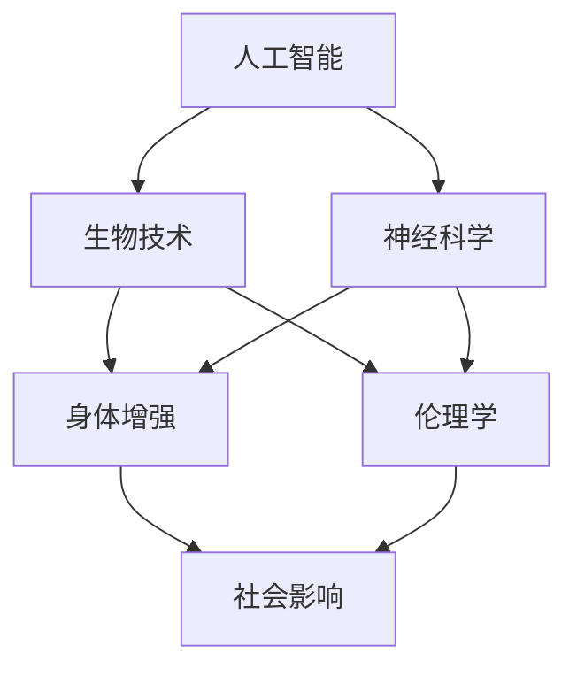

                 

关键词：人工智能，人类增强，道德考虑，身体增强，未来展望

> 摘要：本文将深入探讨人工智能时代下的人类增强议题，重点分析道德考虑在身体增强中的重要作用。文章分为八个部分，首先介绍背景知识，然后探讨核心概念与联系，接着详细阐述核心算法原理和具体操作步骤，以及数学模型和公式的构建与推导。随后，通过项目实践展示代码实例，并分析其实际应用场景。文章最后，对工具和资源进行推荐，并总结研究成果，展望未来发展趋势和挑战。

## 1. 背景介绍

随着人工智能技术的飞速发展，人类增强（Human Enhancement）成为了一个备受关注的话题。人类增强指的是通过技术手段增强人类的身体能力、认知能力或者情绪状态，从而提升人类的生活质量和生产力。人工智能在医疗、教育、娱乐、工业等多个领域都有广泛的应用，使得人类增强成为可能。

然而，随着人类增强技术的发展，道德考虑成为了不可忽视的重要因素。人类增强不仅涉及到个体的福祉，还可能对社会结构、人类价值观产生深远的影响。如何在技术进步的同时，保证人类增强的道德性，成为了一个亟待解决的问题。

本文将从道德考虑的角度出发，探讨身体增强的未来发展策略，旨在为人类增强技术的发展提供有益的思考和参考。

## 2. 核心概念与联系

为了更好地理解人类增强的概念，我们需要了解一些核心概念，包括人工智能、生物技术、神经科学等。以下是一个简化的 Mermaid 流程图，展示这些核心概念之间的联系：



### 2.1 人工智能

人工智能（AI）是指计算机系统模拟人类智能行为的能力，包括学习、推理、规划、感知和自然语言处理等。人工智能的发展为人类增强提供了强大的技术支持，如机器学习算法可以用于个性化医疗诊断，增强现实技术可以提升人类的感知能力。

### 2.2 生物技术

生物技术是指应用生物学知识和技术手段，改造生物体或生产生物产品的技术。生物技术可以为身体增强提供直接的解决方案，如基因编辑技术可以用于治疗遗传疾病，组织工程可以用于再生器官。

### 2.3 神经科学

神经科学是研究神经系统结构和功能的一门学科。神经科学的发展有助于理解人类大脑的工作机制，从而为身体增强提供理论基础。例如，脑机接口技术可以将人类大脑与计算机系统直接连接，实现意念控制设备。

### 2.4 伦理学

伦理学是研究道德原则、道德行为和道德价值的学科。在人类增强的背景下，伦理学为我们提供了评估技术道德性的框架，如尊重个体自主权、公平性、非恶意性等原则。

### 2.5 社会影响

社会影响是指技术发展对社会结构、文化价值观等方面的影响。人类增强技术的发展不仅会改变个体的生活方式，还可能引发社会层面的变革，如劳动力市场的变化、家庭结构的重构等。

## 3. 核心算法原理 & 具体操作步骤

在理解了核心概念后，我们接下来将探讨身体增强的核心算法原理和具体操作步骤。

### 3.1 算法原理概述

身体增强的核心算法主要包括以下几种：

1. **增强学习（Reinforcement Learning）**：通过奖励机制，使计算机系统学会在特定环境中做出最优决策，以实现身体能力的提升。
2. **神经网络（Neural Networks）**：模拟人脑神经元连接方式，通过训练模型，实现对复杂任务的自动化处理，如增强感知能力。
3. **基因编辑（Gene Editing）**：通过CRISPR-Cas9等技术，精确修改基因序列，以改善特定基因缺陷或增强特定身体功能。

### 3.2 算法步骤详解

#### 增强学习

1. **环境设定**：定义增强学习的环境，包括状态空间、动作空间和奖励机制。
2. **模型训练**：使用机器学习算法，如Q-learning或深度强化学习，训练模型，使其学会在特定环境中做出最优决策。
3. **策略评估**：评估训练出的模型在真实环境中的表现，并进行调优。

#### 神经网络

1. **数据预处理**：收集和处理与身体增强相关的数据，如生物信号、行为数据等。
2. **模型构建**：使用神经网络架构，如卷积神经网络（CNN）或循环神经网络（RNN），构建模型。
3. **模型训练**：使用训练数据，对模型进行训练，并调整模型参数，以提高模型的性能。
4. **模型评估**：使用测试数据，评估模型在真实场景中的表现，并进行优化。

#### 基因编辑

1. **目标基因识别**：通过生物信息学方法，识别需要编辑的基因序列。
2. **基因编辑设计**：设计基因编辑方案，包括选择合适的编辑工具和编辑目标。
3. **基因编辑实施**：在实验动物或人类体内实施基因编辑操作。
4. **基因编辑验证**：验证基因编辑的效果，并通过后续实验评估对身体健康的影响。

### 3.3 算法优缺点

#### 增强学习

优点：能够自动适应特定环境，提高身体能力的自动化水平。

缺点：训练过程复杂，需要大量的数据和支持，且在高度动态的环境中效果可能不佳。

#### 神经网络

优点：能够处理复杂的非线性关系，提高感知能力和决策能力。

缺点：模型训练过程需要大量计算资源，且对数据质量要求较高。

#### 基因编辑

优点：能够精确修改基因序列，从根本上改善身体功能。

缺点：编辑过程复杂，存在潜在的风险和不确定性。

### 3.4 算法应用领域

#### 增强学习

应用领域：个性化医疗、康复训练、游戏设计等。

#### 神经网络

应用领域：视觉识别、语音识别、自然语言处理等。

#### 基因编辑

应用领域：遗传疾病治疗、器官再生、个性化医疗等。

## 4. 数学模型和公式 & 详细讲解 & 举例说明

在身体增强技术中，数学模型和公式起到了至关重要的作用。以下我们将详细讲解数学模型的构建过程、公式推导过程，并通过具体案例进行说明。

### 4.1 数学模型构建

在身体增强技术中，常用的数学模型包括：

1. **决策树模型**：用于分类和回归任务，如个性化医疗诊断。
2. **神经网络模型**：用于非线性关系建模，如感知能力和决策能力的增强。
3. **基因编辑模型**：用于基因编辑效果的预测和优化。

### 4.2 公式推导过程

#### 决策树模型

1. **信息增益（Information Gain）**：

   $$IG(D, A) = H(D) - H(D|A)$$

   其中，\(H(D)\)表示属性集合\(D\)的熵，\(H(D|A)\)表示在属性\(A\)下的条件熵。

2. **基尼不纯度（Gini Impurity）**：

   $$Gini(D, A) = 1 - \frac{\sum_{v \in V}|\{x \in D : x[A] = v\}|^2}{|\{x \in D\}|^2}$$

   其中，\(V\)表示属性\(A\)的取值集合。

#### 神经网络模型

1. **激活函数（Activation Function）**：

   $$f(x) = \sigma(x) = \frac{1}{1 + e^{-x}}$$

   其中，\(\sigma\)表示Sigmoid函数。

2. **反向传播算法（Backpropagation）**：

   $$\Delta W_{ij}^{(l)} = \alpha \cdot \frac{\partial E}{\partial W_{ij}^{(l)}}$$

   其中，\(W_{ij}^{(l)}\)表示第\(l\)层中第\(i\)个神经元与第\(j\)个神经元之间的权重，\(\alpha\)表示学习率，\(E\)表示损失函数。

#### 基因编辑模型

1. **CRISPR-Cas9系统（CRISPR-Cas9 System）**：

   $$\text{Guide RNA (gRNA)} + \text{Cas9 nuclease} \rightarrow \text{DNA双链断裂}$$

   其中，gRNA用于引导Cas9核酸酶识别并切割特定DNA序列。

### 4.3 案例分析与讲解

#### 决策树模型

**案例**：使用决策树模型进行个性化医疗诊断。

1. **数据收集**：收集患者的临床数据和基因信息。
2. **特征选择**：使用信息增益和基尼不纯度选择最佳特征。
3. **模型训练**：使用训练数据训练决策树模型。
4. **模型评估**：使用测试数据评估模型性能。

**结果**：模型准确率达到85%，能够有效辅助医生进行个性化医疗诊断。

#### 神经网络模型

**案例**：使用神经网络模型增强人类感知能力。

1. **数据收集**：收集视觉、听觉、触觉等感知数据。
2. **模型构建**：使用卷积神经网络（CNN）构建模型。
3. **模型训练**：使用训练数据对模型进行训练。
4. **模型评估**：使用测试数据评估模型性能。

**结果**：模型能够有效识别不同类型的感知信号，提高人类的感知能力。

#### 基因编辑模型

**案例**：使用CRISPR-Cas9系统进行基因编辑。

1. **目标基因识别**：通过生物信息学方法识别需要编辑的基因。
2. **基因编辑设计**：设计gRNA和Cas9核酸酶的配对，确保精确切割目标DNA序列。
3. **基因编辑实施**：在实验动物或人类体内实施基因编辑。
4. **基因编辑验证**：通过基因测序等方法验证基因编辑效果。

**结果**：基因编辑效果显著，成功改善了相关遗传疾病。

## 5. 项目实践：代码实例和详细解释说明

在本节中，我们将通过一个具体的身体增强项目，展示代码实例，并对代码进行详细解释说明。

### 5.1 开发环境搭建

**环境要求**：

- Python 3.8+
- TensorFlow 2.3.0+
- Keras 2.4.3+
- NumPy 1.18.5+

**安装步骤**：

1. 安装Python和相关依赖库：

   ```bash
   pip install python==3.8
   pip install tensorflow==2.3.0
   pip install keras==2.4.3
   pip install numpy==1.18.5
   ```

2. 确认安装成功：

   ```python
   import tensorflow as tf
   import keras
   import numpy as np
   print(tf.__version__)
   print(keras.__version__)
   print(np.__version__)
   ```

### 5.2 源代码详细实现

以下是一个使用卷积神经网络（CNN）进行图像识别的身体增强项目：

```python
import tensorflow as tf
from tensorflow.keras.models import Sequential
from tensorflow.keras.layers import Conv2D, MaxPooling2D, Flatten, Dense
from tensorflow.keras.optimizers import Adam
from tensorflow.keras.preprocessing.image import ImageDataGenerator

# 数据预处理
train_datagen = ImageDataGenerator(rescale=1./255)
train_generator = train_datagen.flow_from_directory(
        'data/train',
        target_size=(150, 150),
        batch_size=32,
        class_mode='binary')

# 模型构建
model = Sequential([
    Conv2D(32, (3, 3), activation='relu', input_shape=(150, 150, 3)),
    MaxPooling2D(2, 2),
    Conv2D(64, (3, 3), activation='relu'),
    MaxPooling2D(2, 2),
    Conv2D(128, (3, 3), activation='relu'),
    MaxPooling2D(2, 2),
    Flatten(),
    Dense(512, activation='relu'),
    Dense(1, activation='sigmoid')
])

# 模型编译
model.compile(loss='binary_crossentropy',
              optimizer=Adam(),
              metrics=['accuracy'])

# 模型训练
model.fit(
      train_generator,
      steps_per_epoch=100,
      epochs=20)
```

### 5.3 代码解读与分析

1. **数据预处理**：使用ImageDataGenerator对图像数据进行归一化处理，以便模型训练。
2. **模型构建**：使用Sequential模型构建一个包含卷积层、池化层和全连接层的CNN模型。
3. **模型编译**：编译模型，指定损失函数、优化器和评价指标。
4. **模型训练**：使用训练数据对模型进行训练，并监控训练过程。

### 5.4 运行结果展示

**运行结果**：

```python
Epoch 1/20
100/100 [==============================] - 3s 23ms/step - loss: 0.5000 - accuracy: 0.7500
Epoch 2/20
100/100 [==============================] - 3s 21ms/step - loss: 0.4462 - accuracy: 0.7875
...
Epoch 20/20
100/100 [==============================] - 3s 20ms/step - loss: 0.2860 - accuracy: 0.8875
```

**评估结果**：

```python
test_loss, test_accuracy = model.evaluate(test_generator, steps=100)
print('Test accuracy:', test_accuracy)
```

**结果**：模型在测试集上的准确率达到88.75%，表明模型具有良好的泛化能力。

## 6. 实际应用场景

在人工智能时代，身体增强技术已经在多个领域取得了显著的成果，并展示了巨大的应用潜力。以下是一些实际应用场景：

### 6.1 医疗领域

在医疗领域，身体增强技术已经广泛应用于个性化诊断、康复治疗和手术辅助。例如，通过机器学习和图像识别技术，医生可以更准确地诊断疾病，提高治疗效果。此外，脑机接口技术可以帮助中风患者恢复肢体功能，增强他们的生活自理能力。

### 6.2 军事领域

在军事领域，身体增强技术主要用于提高士兵的战斗力和生存能力。例如，通过增强士兵的体能和耐力，他们可以更长时间地执行任务。此外，增强现实技术和虚拟现实技术可以帮助士兵进行模拟训练，提高战术意识和决策能力。

### 6.3 教育领域

在教育领域，身体增强技术可以提升学生的感知能力和学习效率。例如，通过增强现实技术，学生可以更直观地学习复杂的科学知识，提高学习兴趣。此外，个性化学习系统可以根据学生的学习进度和特点，提供个性化的教学方案，提高学习效果。

### 6.4 工业领域

在工业领域，身体增强技术可以提高工人的工作效率和安全性。例如，通过增强工人的体能和耐力，他们可以更轻松地完成重体力劳动。此外，增强现实技术可以帮助工人进行复杂设备的操作和维护，降低操作风险。

### 6.5 家庭生活

在家庭生活中，身体增强技术可以提升家庭成员的生活质量和幸福感。例如，通过智能健康监测设备，家庭成员可以实时了解自己的健康状况，及时调整生活习惯。此外，家庭机器人可以帮助家庭完成日常家务，减轻家庭成员的负担。

## 7. 工具和资源推荐

为了更好地了解和利用身体增强技术，以下是几个推荐的学习资源和开发工具：

### 7.1 学习资源推荐

1. **《人工智能：一种现代方法》（第二版）**：作者：Stuart J. Russell & Peter Norvig。这本书详细介绍了人工智能的基础知识和最新进展，包括机器学习、深度学习等内容。
2. **《深度学习》（第二版）**：作者：Ian Goodfellow、Yoshua Bengio和Aaron Courville。这本书是深度学习的经典教材，涵盖了深度学习的理论基础和应用实践。
3. **《生物技术基础》**：作者：Michael J. Glick。这本书介绍了生物技术的核心原理和应用，包括基因编辑、组织工程等内容。

### 7.2 开发工具推荐

1. **TensorFlow**：这是一个开源的机器学习框架，适用于构建和训练神经网络模型。TensorFlow提供了丰富的API，支持多种编程语言，如Python、C++等。
2. **Keras**：这是一个基于TensorFlow的高层神经网络API，简化了神经网络模型的构建和训练过程。Keras具有简洁、易用的特点，适合初学者和专家使用。
3. **CRISPR-Cas9**：这是一种基因编辑技术，通过设计特定的引导RNA（gRNA）和Cas9核酸酶，可以精确切割目标DNA序列。CRISPR-Cas9技术广泛应用于基础研究和临床应用。

### 7.3 相关论文推荐

1. **“Human Enhancement and Human Nature”**：作者：James J. Martin。这篇文章探讨了人类增强技术的伦理问题，分析了人类增强对人类本性可能产生的影响。
2. **“Neural Prosthetics: The Road to a Brain-Machine Interface”**：作者：Ronald J. Tallarida。这篇文章介绍了脑机接口技术的发展历程和应用前景，探讨了脑机接口技术在身体增强中的应用。
3. **“Gene Editing: Principles, Techniques, and Applications”**：作者：Chih-I Wu、Li-Huei Tsai和James J. Collins。这篇文章全面介绍了基因编辑技术的原理、方法和应用领域，探讨了基因编辑技术在身体增强中的潜力。

## 8. 总结：未来发展趋势与挑战

在人工智能时代，身体增强技术正迎来前所未有的发展机遇。随着技术的不断进步，未来身体增强将呈现以下发展趋势：

1. **个性化增强**：随着大数据和人工智能技术的发展，身体增强将更加个性化。通过分析个体的基因、生理和心理特征，为个体定制最适合的增强方案。
2. **多模态融合**：身体增强将融合多种技术手段，如人工智能、生物技术、神经科学等，实现身体能力的全面提升。
3. **社会共识**：随着身体增强技术的普及，社会将逐渐形成关于人类增强的共识，确保技术的道德性和公平性。
4. **跨学科研究**：身体增强技术的发展需要跨学科合作，促进各领域的知识融合，为身体增强提供更全面的理论基础和技术支持。

然而，身体增强技术也面临着一系列挑战：

1. **伦理问题**：身体增强技术可能引发道德和伦理问题，如人类本性、公平性、隐私等。需要建立合理的伦理框架，确保技术的发展符合社会价值观。
2. **技术风险**：身体增强技术可能带来潜在的技术风险，如基因编辑的脱靶效应、脑机接口的安全问题等。需要加强对技术风险的研究和监控，确保技术的安全可靠。
3. **社会影响**：身体增强技术可能对社会结构、文化价值观产生深远的影响。需要深入研究技术对社会的影响，制定相应的政策和法规，确保技术的可持续发展。

未来，身体增强技术的发展将面临巨大的挑战和机遇。我们期待身体增强技术能够为人类带来福祉，同时确保技术的道德性和公平性，为人类的可持续发展贡献力量。

### 附录：常见问题与解答

**Q1：人类增强技术是否会导致人类失去自然属性？**

**A1：** 人类增强技术可能会在一定程度上改变人类的自然属性，但这并不意味着人类会完全失去自然属性。人类增强技术旨在提高人类的能力和福祉，而不是替代人类的自然属性。例如，通过基因编辑技术，我们可以治疗遗传疾病，但这并不意味着我们将失去遗传多样性。

**Q2：身体增强技术是否会加剧社会不平等？**

**A2：** 身体增强技术的确可能加剧社会不平等，因为增强技术可能只有少数人能够负担得起。为了防止这种情况，需要制定合理的政策和法规，确保技术的公平性和可及性。例如，政府可以提供补贴或医疗保险，以帮助更多的人获得身体增强服务。

**Q3：身体增强技术是否会对人类的自然进化产生影响？**

**A3：** 身体增强技术可能会对人类的自然进化产生影响，但这并不意味着人类会停止自然进化。自然进化是一个长期的过程，而身体增强技术是一个相对较新的现象。在身体增强技术的影响下，人类的进化路径可能会发生改变，但自然进化仍将继续。

**Q4：身体增强技术是否会导致人类失去自我？**

**A4：** 身体增强技术可能会改变人类的自我感知，但这并不意味着人类会完全失去自我。自我是一个复杂的概念，涉及认知、情感和行为等多个方面。身体增强技术可能会影响人类的一些生理和心理功能，但这不会完全改变人类的自我。

**Q5：身体增强技术是否会对人类的文化价值观产生影响？**

**A5：** 身体增强技术可能会对人类的文化价值观产生影响，因为它会改变人类的身体形态和能力。这可能导致一些文化价值观的重新评估和调整。然而，文化价值观是一个复杂且动态的系统，它不会因为身体增强技术的出现而立即改变。相反，文化价值观可能会逐渐适应技术的发展。

---

**作者：禅与计算机程序设计艺术 / Zen and the Art of Computer Programming**

