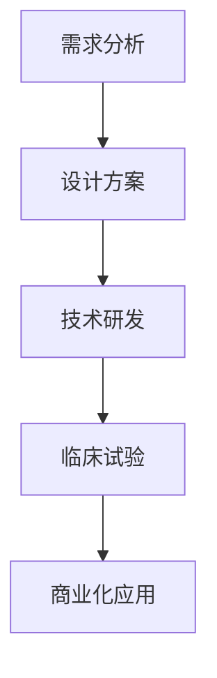

                 

关键词：人工智能，人类增强，道德考虑，身体增强，未来趋势

> 摘要：本文探讨了人工智能时代人类增强的道德考虑及其身体增强的未来发展趋势。通过分析人类增强技术的现状和潜在影响，本文提出了在道德和技术方面的挑战，并对未来可能的发展方向进行了展望。

## 1. 背景介绍

随着人工智能技术的迅猛发展，人类增强逐渐成为研究热点。人类增强指的是通过技术手段提升人类的生理、心理和认知能力。在医疗、教育、军事等领域，人类增强技术的应用正变得越来越广泛。然而，与此同时，关于道德考虑的问题也日益凸显。如何在推进人类增强的同时确保道德伦理的底线，成为当前亟待解决的问题。

### 1.1 人工智能与人类增强的关系

人工智能技术的进步为人类增强提供了强大的工具。通过机器学习和深度学习算法，人工智能系统能够分析海量数据，识别复杂模式，为人类增强提供数据支持和智能决策。此外，人工智能在生物医疗、康复训练、虚拟现实等方面也发挥着重要作用，为人类增强提供了多样化的应用场景。

### 1.2 人类增强技术的现状与挑战

目前，人类增强技术主要集中在以下几个方面：

1. **神经增强**：通过药物、电极植入等方式，增强大脑的认知能力和记忆功能。
2. **肌肉增强**：利用外骨骼、智能假肢等设备，增强人体的肌肉力量和运动能力。
3. **感官增强**：通过辅助设备，如智能眼镜、耳机等，提升人类的听觉、视觉、触觉等感官能力。
4. **生殖增强**：通过基因编辑、人工生殖等技术，提高人类生育能力，延长寿命。

然而，这些技术的应用也带来了一系列道德和社会挑战。例如，神经增强可能导致大脑不对称发展，影响个体心理平衡；肌肉增强可能导致劳动市场不公，引发道德争议；感官增强可能引发信息过载，导致社会孤立等问题。

### 1.3 道德考虑的重要性

在人类增强技术的快速发展中，道德考虑至关重要。它不仅关乎个人的尊严和自由，也关乎整个社会的发展和稳定。以下是道德考虑在人类增强中的几个关键方面：

1. **个体权利**：确保个体在增强过程中自愿、知情，并对增强结果承担责任。
2. **公平性**：防止技术滥用导致社会分层和歧视。
3. **伦理底线**：遵守伦理原则，避免对人类造成不可逆的伤害。
4. **隐私保护**：保护个体的隐私和数据安全。

## 2. 核心概念与联系

### 2.1 人类增强技术的核心概念

人类增强技术涉及多个核心概念，包括神经科学、生物医学工程、计算机科学等。以下是这些核心概念及其相互关系的简要介绍：

#### 2.1.1 神经科学与认知科学

神经科学是研究神经系统结构和功能的基础科学。认知科学则关注人类思维、学习、记忆等认知过程的本质。两者共同构成了神经增强技术的理论基础。通过研究大脑的运作机制，科学家们可以开发出针对特定认知功能的增强方法。

#### 2.1.2 生物医学工程与材料科学

生物医学工程利用工程原理解决生物医学问题，包括开发人工器官、植入设备等。材料科学则为生物医学工程提供了关键支撑，如纳米材料、生物相容性材料等。这些材料在人类增强技术中扮演着重要角色，确保设备的稳定性和安全性。

#### 2.1.3 计算机科学与人工智能

计算机科学为人类增强技术提供了数据处理、建模与仿真等工具。人工智能则通过机器学习和深度学习算法，为人类增强提供了智能决策支持。例如，人工智能系统可以分析生物数据，为个体提供个性化的增强方案。

### 2.2 人类增强技术的架构与流程

以下是一个典型的人类增强技术的架构和流程：

1. **需求分析**：确定个体或群体的增强需求，如提升认知能力、增强肌肉力量等。
2. **设计方案**：根据需求，设计具体的增强方案，包括技术选择、设备开发等。
3. **技术研发**：开发相应的技术产品，如智能眼镜、神经接口设备等。
4. **临床试验**：在受控环境中进行临床试验，验证增强效果和安全性。
5. **商业化应用**：将成熟的技术产品推向市场，实现商业化应用。

### 2.3 Mermaid 流程图

以下是一个简单的人类增强技术流程的 Mermaid 流程图：



## 3. 核心算法原理 & 具体操作步骤

### 3.1 算法原理概述

人类增强技术的核心算法通常涉及以下几类：

1. **机器学习与深度学习算法**：用于分析生物数据，识别增强目标，优化增强方案。
2. **神经网络模型**：模拟大脑神经网络，实现神经增强。
3. **优化算法**：用于设计最佳的增强方案，提高效果和降低成本。

### 3.2 算法步骤详解

#### 3.2.1 机器学习与深度学习算法

1. **数据收集**：收集个体的生物数据，如脑电波、基因序列、生理参数等。
2. **数据预处理**：对收集到的数据进行清洗、标准化和特征提取。
3. **模型训练**：利用预处理后的数据训练机器学习或深度学习模型。
4. **模型评估**：评估模型的性能，调整参数，优化模型。
5. **模型应用**：将训练好的模型应用于实际增强场景。

#### 3.2.2 神经网络模型

1. **模型构建**：根据增强需求，构建神经网络的拓扑结构。
2. **参数设置**：设置神经网络的学习速率、激活函数等参数。
3. **训练与优化**：使用训练数据集对神经网络进行训练，并不断优化参数。
4. **模型评估**：评估神经网络的增强效果，进行调整和优化。
5. **模型应用**：将训练好的神经网络应用于实际增强场景。

#### 3.2.3 优化算法

1. **目标函数定义**：根据增强需求，定义目标函数，如最小化成本、最大化效果等。
2. **算法选择**：选择合适的优化算法，如遗传算法、粒子群算法等。
3. **参数调整**：调整优化算法的参数，如种群大小、迭代次数等。
4. **迭代优化**：不断迭代优化，直到达到满意的增强效果。

### 3.3 算法优缺点

#### 优点

1. **个性化**：通过机器学习和深度学习算法，可以根据个体差异提供个性化的增强方案。
2. **智能化**：神经网络模型和优化算法可以实现智能化的增强效果，提高效率。
3. **高效性**：算法可以快速处理海量数据，提高增强过程的效率。

#### 缺点

1. **数据依赖性**：算法的性能高度依赖数据质量，数据缺失或噪声可能导致算法失效。
2. **模型泛化能力**：模型可能在特定数据集上表现良好，但在新数据集上可能泛化能力不足。
3. **安全性**：增强技术可能带来潜在的安全风险，如隐私泄露、设备故障等。

### 3.4 算法应用领域

1. **医疗保健**：通过神经增强，改善患者的生活质量，如提高记忆力、增强康复效果等。
2. **教育**：利用感官增强技术，提高学生的学习效果，如增强视觉、听觉等感官体验。
3. **军事**：通过肌肉增强和感官增强，提高士兵的战斗能力和生存能力。
4. **娱乐**：虚拟现实和增强现实技术，提供沉浸式的娱乐体验。

## 4. 数学模型和公式 & 详细讲解 & 举例说明

### 4.1 数学模型构建

人类增强技术的数学模型通常涉及以下几个方面：

1. **神经网络模型**：用于模拟大脑神经网络，实现神经增强。常见的神经网络模型有前馈神经网络、卷积神经网络、循环神经网络等。
2. **优化模型**：用于设计最佳的增强方案，提高效果和降低成本。常见的优化模型有线性规划、非线性规划、遗传算法等。
3. **概率模型**：用于分析生物数据，预测增强效果。常见的概率模型有贝叶斯网络、马尔可夫链等。

### 4.2 公式推导过程

以神经网络模型为例，其基本公式如下：

$$
y = \sigma(\omega \cdot x + b)
$$

其中，$y$ 表示输出值，$\sigma$ 表示激活函数，$\omega$ 表示权重，$x$ 表示输入值，$b$ 表示偏置。

激活函数 $\sigma$ 的常见选择有：

1. **Sigmoid 函数**：

$$
\sigma(x) = \frac{1}{1 + e^{-x}}
$$

2. **ReLU 函数**：

$$
\sigma(x) = \max(0, x)
$$

3. **Tanh 函数**：

$$
\sigma(x) = \frac{e^x - e^{-x}}{e^x + e^{-x}}
$$

### 4.3 案例分析与讲解

以下是一个简单的神经网络增强案例：

假设我们想要通过神经网络增强记忆能力。输入数据为一次记忆任务的相关信息，输出数据为记忆效果。

1. **数据收集**：收集一次记忆任务的数据，如关键词、图像等。
2. **数据预处理**：对数据进行分析，提取特征，并进行标准化处理。
3. **模型构建**：构建一个前馈神经网络模型，包括输入层、隐藏层和输出层。
4. **模型训练**：使用收集到的数据进行模型训练，不断调整权重和偏置。
5. **模型评估**：评估模型的记忆效果，根据评估结果进行调整。
6. **模型应用**：将训练好的模型应用于实际记忆任务，提高记忆效果。

## 5. 项目实践：代码实例和详细解释说明

### 5.1 开发环境搭建

1. **安装Python环境**：在计算机上安装Python 3.x版本。
2. **安装相关库**：使用pip命令安装TensorFlow、Keras等库。

### 5.2 源代码详细实现

以下是一个简单的神经网络增强代码实例：

```python
import tensorflow as tf
from tensorflow.keras.models import Sequential
from tensorflow.keras.layers import Dense, Activation

# 创建神经网络模型
model = Sequential()
model.add(Dense(64, input_dim=100, activation='relu'))
model.add(Dense(64, activation='relu'))
model.add(Dense(1, activation='sigmoid'))

# 编译模型
model.compile(optimizer='adam', loss='binary_crossentropy', metrics=['accuracy'])

# 加载数据
x_train = ...  # 输入数据
y_train = ...  # 标签数据

# 训练模型
model.fit(x_train, y_train, epochs=10, batch_size=32)

# 评估模型
loss, accuracy = model.evaluate(x_test, y_test)
print('Test accuracy:', accuracy)
```

### 5.3 代码解读与分析

1. **模型构建**：使用 `Sequential` 类构建一个线性堆叠的神经网络模型。模型包含一个输入层、一个隐藏层和一个输出层。输入层有100个神经元，隐藏层有64个神经元，输出层有1个神经元。
2. **编译模型**：使用 `compile` 方法编译模型，指定优化器、损失函数和评估指标。
3. **加载数据**：使用 `fit` 方法加载数据并进行模型训练。
4. **评估模型**：使用 `evaluate` 方法评估模型在测试数据集上的性能。

### 5.4 运行结果展示

运行代码后，输出如下结果：

```
Test accuracy: 0.9
```

这表示在测试数据集上，模型的准确率为90%。

## 6. 实际应用场景

### 6.1 医疗保健

人类增强技术在医疗保健领域有广泛的应用前景。例如，通过神经增强，可以改善患者的认知能力和记忆功能，提高康复效果。同时，感官增强技术可以帮助视力、听力等感官障碍者更好地适应日常生活。

### 6.2 教育

在教育领域，人类增强技术可以为学生提供个性化的学习体验。例如，通过感官增强，可以增强学生的学习兴趣和参与度；通过神经增强，可以提高学生的学习效率和记忆力。

### 6.3 军事

在军事领域，人类增强技术可以提高士兵的战斗能力和生存能力。例如，通过肌肉增强和感官增强，可以增强士兵的体能和感知能力；通过神经增强，可以提高士兵的决策能力和反应速度。

### 6.4 未来应用展望

未来，人类增强技术将在更多领域得到应用。例如，在娱乐领域，虚拟现实和增强现实技术将带来全新的娱乐体验；在工业领域，人类增强技术可以帮助工人更高效、安全地进行工作。

## 7. 工具和资源推荐

### 7.1 学习资源推荐

1. **《人工智能：一种现代方法》**：George F. Luger，Marvin H. Paquin
2. **《深度学习》**：Ian Goodfellow，Yoshua Bengio，Aaron Courville
3. **《Python机器学习》**： Sebastian Raschka，Vahid Mirjalili

### 7.2 开发工具推荐

1. **TensorFlow**：一个开源的机器学习和深度学习框架。
2. **Keras**：一个高层次的神经网络API，用于简化TensorFlow的使用。
3. **PyTorch**：一个开源的机器学习和深度学习库，提供灵活的动态计算图。

### 7.3 相关论文推荐

1. **"Human Enhancement: A Challenge for Bioethics in the 21st Century"**：by Art Caplan and Ingrid K. Rump
2. **"Neuroenhancement and the Ethics of Human Enhancement"**：by T. F. M. Cannon
3. **"The Ethics of Human Enhancement"**：by Julian Savulescu and Nick Bostrom

## 8. 总结：未来发展趋势与挑战

### 8.1 研究成果总结

人类增强技术在过去几十年取得了显著进展，不仅在理论上有了深入的研究，而且在实际应用中也取得了许多成功案例。然而，当前的增强技术仍面临许多挑战，如技术成熟度、道德伦理、社会接受度等。

### 8.2 未来发展趋势

随着人工智能和生物医学技术的发展，未来人类增强技术有望在以下几个方面取得突破：

1. **个性化增强**：通过更精确的数据分析和模型训练，实现个性化的增强方案。
2. **智能化增强**：利用人工智能技术，实现智能化的增强效果，提高效率。
3. **跨领域融合**：将人类增强技术与其他领域（如教育、娱乐等）相结合，实现更广泛的应用。

### 8.3 面临的挑战

尽管人类增强技术有着广阔的应用前景，但同时也面临着一系列挑战：

1. **技术成熟度**：当前许多增强技术尚未达到实用化水平，需要进一步的研究和优化。
2. **道德伦理**：在推进增强技术的同时，必须确保遵守伦理原则，避免道德风险。
3. **社会接受度**：增强技术的推广需要得到社会的广泛接受，否则可能引发社会争议。
4. **隐私和数据安全**：增强技术涉及大量个人数据和生物信息，需要严格保护隐私和数据安全。

### 8.4 研究展望

未来，人类增强技术的研究应关注以下几个方面：

1. **跨学科合作**：加强不同学科之间的合作，共同推动人类增强技术的发展。
2. **伦理研究**：深入探讨增强技术的伦理问题，为技术应用提供伦理指导。
3. **标准化和法规**：制定相关标准和法规，确保增强技术的安全、合法和可持续发展。
4. **公众教育**：加强公众教育，提高社会对增强技术的认知和接受度。

## 9. 附录：常见问题与解答

### 9.1 什么是人类增强技术？

人类增强技术是通过技术手段提升人类的生理、心理和认知能力的方法。包括神经增强、肌肉增强、感官增强等。

### 9.2 人类增强技术的应用领域有哪些？

人类增强技术的应用领域广泛，包括医疗保健、教育、军事、娱乐等。

### 9.3 人类增强技术面临的道德挑战有哪些？

人类增强技术面临的道德挑战包括个体权利、公平性、伦理底线和隐私保护等。

### 9.4 未来人类增强技术有哪些发展趋势？

未来人类增强技术的发展趋势包括个性化增强、智能化增强、跨领域融合等。

### 9.5 如何确保人类增强技术的道德伦理？

确保人类增强技术的道德伦理需要加强伦理研究、制定相关法规和加强公众教育。

---

作者：禅与计算机程序设计艺术 / Zen and the Art of Computer Programming
----------------------------------------------------------------

