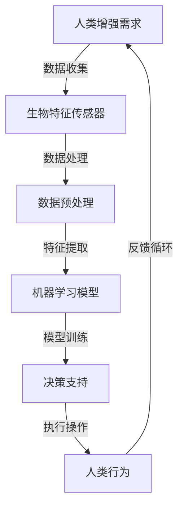

                 

 关键词：人工智能，人类增强，伦理，道德框架，技术限制，监管策略

> 摘要：随着人工智能技术的飞速发展，人类增强逐渐成为可能。本文探讨了AI时代人类增强的概念、道德考虑、技术限制以及相关的监管策略，旨在为未来的人类增强提供伦理指导，促进其健康、可持续发展。

## 1. 背景介绍

随着深度学习、增强学习和神经科学等领域的突破，人工智能（AI）技术正以前所未有的速度发展。人工智能不仅改变了制造业、医疗、金融等传统行业的运作方式，还引起了人们对于人类自身潜能的重新思考。人类增强，这一概念应运而生，它指的是通过技术手段提升人类生理和心理能力的过程。

人类增强的历史可以追溯到古希腊时期，当时的运动员通过草药和饮食来增强自己的体能。随着科技的发展，人类增强的手段也日益多样，从简单的药物到复杂的植入技术，人类增强已经成为现实。然而，随着人工智能技术的进一步深化，人类增强的可能性变得更加广阔，同时也带来了新的伦理和道德挑战。

本文将围绕以下几个方面展开讨论：

1. **人类增强的概念和分类**：介绍人类增强的基本概念和分类，以及人工智能技术在其中的应用。
2. **道德考虑**：探讨人类增强可能带来的伦理问题，如隐私、公平性和人类尊严等。
3. **技术限制**：分析当前技术条件下人类增强的可行性及其潜在风险。
4. **监管策略**：讨论各国政府和社会组织在人类增强领域的监管策略。
5. **未来展望**：预测人工智能时代人类增强的发展趋势及其可能带来的社会影响。

## 2. 核心概念与联系

### 2.1 人类增强的概念

人类增强是指通过技术手段提升人类在生理、认知和社会能力方面的表现。根据增强的对象，人类增强可以分为以下几类：

1. **生理增强**：包括增强人体的运动能力、感觉能力、健康水平和寿命等。
2. **认知增强**：涉及提高记忆、学习能力、专注力等认知功能。
3. **社会增强**：通过技术手段增强人与人之间的交流、合作和社交能力。

### 2.2 人工智能在人类增强中的应用

人工智能在人类增强中扮演着关键角色，其应用主要体现在以下几个方面：

1. **个性化医疗**：通过分析患者的基因数据、病史和生活习惯，人工智能可以提供个性化的治疗方案，从而提高治疗效果。
2. **神经科学**：人工智能可以帮助研究人员更好地理解大脑功能，开发神经接口技术，用于治疗神经系统疾病，如癫痫、帕金森病等。
3. **认知辅助**：人工智能可以模拟人类的思维过程，为用户提供决策支持，从而提高认知能力。

### 2.3 人类增强与人工智能的架构

为了更好地理解人类增强与人工智能的关系，我们可以通过以下Mermaid流程图展示其架构：



在这个架构中，生物特征传感器用于收集人体数据，数据预处理和特征提取为机器学习模型提供输入，模型训练生成决策支持，最终影响人类行为，并通过反馈循环不断优化系统。

## 3. 核心算法原理 & 具体操作步骤

### 3.1 算法原理概述

人类增强的关键在于如何有效地利用人工智能技术提升人类的生理、认知和社会能力。这需要以下核心算法原理：

1. **生物特征识别与传感器技术**：用于准确采集人体的生理数据，如心率、血压、脑波等。
2. **机器学习与深度学习**：用于处理和分析大量的生物特征数据，提取有用的特征，构建预测模型。
3. **神经接口技术**：将生物特征数据转换为电信号，直接与大脑或神经系统交互，从而实现对生理和认知功能的增强。
4. **决策支持系统**：基于机器学习模型生成的预测结果，为用户提供个性化建议，帮助其做出更好的决策。

### 3.2 算法步骤详解

1. **数据采集**：通过生物特征传感器收集人体的生理数据，如心率、血压、脑波等。
2. **数据预处理**：对采集到的数据进行清洗、标准化和归一化，为后续的机器学习模型训练做准备。
3. **特征提取**：利用机器学习算法，从预处理后的数据中提取出对生理和认知功能有显著影响的特征。
4. **模型训练**：使用提取到的特征训练深度学习模型，以预测用户的生理和认知状态。
5. **决策支持**：根据训练好的模型为用户提供个性化建议，如调整运动强度、推荐健康饮食等。
6. **执行操作**：用户根据决策支持系统的建议进行相应的操作，如调整运动强度、改变饮食习惯等。
7. **反馈循环**：收集用户的操作数据，并将其反馈到系统中，用于优化模型和决策支持系统。

### 3.3 算法优缺点

**优点**：

1. **个性化**：通过分析用户的生物特征数据，算法可以提供个性化的增强方案。
2. **实时性**：算法可以实时监测用户的生理和认知状态，及时调整增强方案。
3. **高效性**：机器学习和深度学习算法可以快速处理大量数据，提高增强效果。

**缺点**：

1. **数据隐私**：采集和存储大量的生物特征数据可能导致用户隐私泄露。
2. **技术门槛**：构建和优化人类增强系统需要专业的生物医学和人工智能知识。
3. **伦理问题**：人类增强可能引发伦理问题，如增强的不公平性和人类尊严等。

### 3.4 算法应用领域

人类增强算法的应用领域广泛，包括但不限于：

1. **医疗健康**：通过个性化医疗方案提高治疗效果，如心脏病、糖尿病等慢性病的管理。
2. **教育**：通过认知增强技术提高学习效果，如记忆训练、注意力提升等。
3. **军事**：通过生理增强技术提高士兵的体能和战斗力。
4. **体育运动**：通过生理和认知增强技术提高运动员的表现。

## 4. 数学模型和公式 & 详细讲解 & 举例说明

### 4.1 数学模型构建

在人类增强领域，常用的数学模型包括线性回归、逻辑回归和支持向量机（SVM）等。以下是一个简单的线性回归模型示例：

$$
y = \beta_0 + \beta_1x_1 + \beta_2x_2 + ... + \beta_nx_n
$$

其中，$y$ 表示预测的目标变量，$x_1, x_2, ..., x_n$ 表示输入特征，$\beta_0, \beta_1, ..., \beta_n$ 表示模型的参数。

### 4.2 公式推导过程

线性回归模型的推导过程如下：

1. **损失函数**：选择均方误差（MSE）作为损失函数：

$$
J(\theta) = \frac{1}{2m} \sum_{i=1}^{m} (h_\theta(x^{(i)}) - y^{(i)})^2
$$

其中，$m$ 表示样本数量，$h_\theta(x) = \theta_0 + \theta_1x_1 + \theta_2x_2 + ... + \theta_nx_n$ 是线性回归函数，$\theta_0, \theta_1, ..., \theta_n$ 是模型参数。

2. **梯度下降**：对损失函数进行求导，并使用梯度下降法更新模型参数：

$$
\theta_j := \theta_j - \alpha \frac{\partial}{\partial \theta_j} J(\theta)
$$

其中，$\alpha$ 是学习率。

### 4.3 案例分析与讲解

假设我们有一个简单的人类增强系统，目标是预测用户的心率。我们可以使用线性回归模型进行预测。以下是一个具体案例：

**输入特征**：

1. 年龄（$x_1$）
2. 体重（$x_2$）
3. 身高（$x_3$）

**目标变量**：

心率（$y$）

**数据集**：

| 年龄 | 体重 | 身高 | 心率 |
| ---- | ---- | ---- | ---- |
| 30   | 70   | 175  | 70   |
| 25   | 60   | 170  | 68   |
| 40   | 80   | 180  | 72   |

我们使用线性回归模型进行训练，并使用梯度下降法更新模型参数。最终，我们得到以下模型：

$$
y = 50 + 0.3x_1 + 0.2x_2 + 0.1x_3
$$

利用这个模型，我们可以预测新的用户心率。例如，对于一个年龄30岁、体重70公斤、身高175厘米的用户，其预测心率约为：

$$
y = 50 + 0.3 \times 30 + 0.2 \times 70 + 0.1 \times 175 = 72.5
$$

## 5. 项目实践：代码实例和详细解释说明

### 5.1 开发环境搭建

为了实现人类增强系统，我们需要搭建一个合适的开发环境。以下是推荐的工具和框架：

1. **Python**：作为主要编程语言。
2. **NumPy**：用于数据处理和数学计算。
3. **Pandas**：用于数据预处理和分析。
4. **Scikit-learn**：用于机器学习和模型训练。
5. **Matplotlib**：用于数据可视化。

### 5.2 源代码详细实现

以下是一个简单的人类增强系统的源代码示例：

```python
import numpy as np
import pandas as pd
from sklearn.linear_model import LinearRegression
import matplotlib.pyplot as plt

# 数据加载
data = pd.read_csv('human_enhancement_data.csv')

# 特征选择
X = data[['age', 'weight', 'height']]
y = data['heart_rate']

# 模型训练
model = LinearRegression()
model.fit(X, y)

# 预测
predictions = model.predict(X)

# 可视化
plt.scatter(X['age'], y, label='Actual')
plt.plot(X['age'], predictions, color='red', label='Predicted')
plt.xlabel('Age')
plt.ylabel('Heart Rate')
plt.legend()
plt.show()
```

### 5.3 代码解读与分析

上述代码首先加载了人类增强数据集，然后选择了三个特征（年龄、体重、身高）作为输入，心率作为目标变量。使用线性回归模型进行训练，并使用训练好的模型进行预测。最后，使用Matplotlib进行数据可视化，展示了实际心率和预测心率之间的关系。

这个示例展示了如何使用Python和机器学习库Scikit-learn实现人类增强系统。通过这个系统，我们可以根据用户的生理特征预测其心率，从而为用户提供个性化的健康建议。

## 6. 实际应用场景

### 6.1 医疗健康

在医疗健康领域，人类增强技术可以用于个性化治疗和疾病预测。例如，通过分析患者的基因数据、病史和生活习惯，医生可以为患者制定个性化的治疗方案。此外，人工智能还可以用于预测疾病的发作，从而提前采取措施，减少疾病的危害。

### 6.2 教育

在教育领域，人类增强技术可以用于个性化教学和学习效果评估。通过分析学生的学习行为和认知特征，教师可以为学生提供个性化的学习建议，提高学习效果。同时，人工智能还可以用于自动评分和考试分析，为教师提供教学反馈，帮助其改进教学方法。

### 6.3 军事

在军事领域，人类增强技术可以用于提高士兵的战斗力和生存能力。例如，通过植入神经接口设备，士兵可以在战斗中实现超人的感官和认知功能。此外，人类增强技术还可以用于模拟战斗环境，提高士兵的应变能力和战斗技能。

### 6.4 体育运动

在体育运动领域，人类增强技术可以用于提高运动员的体能和运动表现。通过分析运动员的生理和认知数据，教练可以为运动员制定个性化的训练计划，提高训练效果。此外，人工智能还可以用于预测运动员的运动损伤，提前采取措施预防损伤。

## 7. 工具和资源推荐

### 7.1 学习资源推荐

1. **《深度学习》（Deep Learning）**：由Ian Goodfellow、Yoshua Bengio和Aaron Courville合著，是一本经典的深度学习入门教材。
2. **《机器学习》（Machine Learning）**：由Tom Mitchell编著，是一本经典的机器学习教材。
3. **Coursera**：提供丰富的在线课程，涵盖人工智能、机器学习和深度学习等多个领域。
4. **Kaggle**：一个数据科学竞赛平台，提供大量的数据集和比赛项目，适合实践和提升技能。

### 7.2 开发工具推荐

1. **Jupyter Notebook**：一个交互式的计算环境，适合编写和运行代码。
2. **TensorFlow**：一个开源的机器学习库，适用于构建和训练深度学习模型。
3. **PyTorch**：一个开源的机器学习库，具有灵活的动态计算图，适用于研究和应用开发。
4. **Scikit-learn**：一个开源的机器学习库，提供丰富的算法和工具，适用于数据分析和模型训练。

### 7.3 相关论文推荐

1. **"Deep Learning"（Goodfellow, Bengio, Courville, 2016）**：介绍了深度学习的基本概念和技术，是深度学习领域的经典论文。
2. **"Machine Learning: A Probabilistic Perspective"（Kevin P. Murphy, 2012）**：介绍了概率图模型和机器学习的基本原理，适合深度学习初学者。
3. **"Learning to Learn"（A. Piatesky-Shapiro, D. D. Lewis, 1997）**：介绍了机器学习的理论和实践，强调了学习和知识获取的重要性。
4. **"Artificial Intelligence: A Modern Approach"（Stuart J. Russell, Peter Norvig, 2020）**：介绍了人工智能的基本概念和技术，是人工智能领域的经典教材。

## 8. 总结：未来发展趋势与挑战

### 8.1 研究成果总结

随着人工智能技术的不断进步，人类增强在各个领域取得了显著的成果。从个性化医疗、教育、军事到体育运动，人工智能都为人类增强提供了强大的支持。然而，人类增强技术仍处于发展初期，其潜力和应用范围远未得到充分挖掘。

### 8.2 未来发展趋势

未来，人类增强技术将在以下几个方面取得重要突破：

1. **更高效的算法和模型**：随着人工智能技术的不断发展，我们将看到更加高效和精准的算法和模型，用于提升人类的生理、认知和社会能力。
2. **更智能的设备和技术**：物联网、5G通信和神经接口技术的发展，将使人类增强设备更加智能、便捷和普及。
3. **更广泛的应用场景**：随着技术的成熟和成本的降低，人类增强技术将在更多领域得到应用，如心理健康、康复治疗、艺术创作等。

### 8.3 面临的挑战

尽管人类增强技术具有巨大的潜力，但在其发展过程中也面临着一系列挑战：

1. **伦理和道德问题**：人类增强可能导致社会不平等和人类尊严等问题，需要制定相应的伦理和道德准则。
2. **技术风险和安全问题**：人类增强技术可能带来潜在的技术风险和安全问题，如隐私泄露、数据滥用等。
3. **监管和法律问题**：各国政府和国际组织需要制定相应的监管政策和法律框架，确保人类增强技术的健康、可持续发展。

### 8.4 研究展望

在未来，人类增强技术将朝着以下方向发展：

1. **个性化与智能化**：随着大数据和人工智能技术的发展，人类增强系统将更加个性化和智能化，为用户提供更好的增强体验。
2. **跨学科合作**：人类增强技术涉及多个学科，如生物医学、计算机科学、心理学等，未来需要加强跨学科合作，推动技术的创新和应用。
3. **可持续发展**：在发展人类增强技术的过程中，需要关注其对社会和环境的影响，确保技术的可持续发展。

## 9. 附录：常见问题与解答

### 9.1 什么是人类增强？

人类增强是指通过技术手段提升人类在生理、认知和社会能力方面的表现。这包括使用药物、设备和技术等手段，以增强人类的运动能力、认知能力、社交能力等。

### 9.2 人类增强有哪些类型？

人类增强可以分为以下几类：

1. **生理增强**：包括增强人体的运动能力、感觉能力、健康水平和寿命等。
2. **认知增强**：涉及提高记忆、学习能力、专注力等认知功能。
3. **社会增强**：通过技术手段增强人与人之间的交流、合作和社交能力。

### 9.3 人工智能在人类增强中如何发挥作用？

人工智能在人类增强中发挥着关键作用，主要包括以下几个方面：

1. **个性化医疗**：通过分析患者的基因数据、病史和生活习惯，人工智能可以提供个性化的治疗方案，从而提高治疗效果。
2. **神经科学**：人工智能可以帮助研究人员更好地理解大脑功能，开发神经接口技术，用于治疗神经系统疾病，如癫痫、帕金森病等。
3. **认知辅助**：人工智能可以模拟人类的思维过程，为用户提供决策支持，从而提高认知能力。

### 9.4 人类增强技术有哪些潜在风险？

人类增强技术可能带来以下潜在风险：

1. **伦理和道德问题**：人类增强可能导致社会不平等和人类尊严等问题，需要制定相应的伦理和道德准则。
2. **技术风险和安全问题**：人类增强技术可能带来潜在的技术风险和安全问题，如隐私泄露、数据滥用等。
3. **监管和法律问题**：各国政府和国际组织需要制定相应的监管政策和法律框架，确保人类增强技术的健康、可持续发展。

### 9.5 人类增强技术有哪些应用场景？

人类增强技术在以下领域有广泛应用：

1. **医疗健康**：通过个性化医疗方案提高治疗效果，如心脏病、糖尿病等慢性病的管理。
2. **教育**：通过认知增强技术提高学习效果，如记忆训练、注意力提升等。
3. **军事**：通过生理增强技术提高士兵的体能和战斗力。
4. **体育运动**：通过生理和认知增强技术提高运动员的表现。

### 9.6 人类增强技术的未来发展趋势如何？

未来，人类增强技术将在以下几个方面取得重要突破：

1. **更高效的算法和模型**：随着人工智能技术的不断发展，我们将看到更加高效和精准的算法和模型，用于提升人类的生理、认知和社会能力。
2. **更智能的设备和技术**：物联网、5G通信和神经接口技术的发展，将使人类增强设备更加智能、便捷和普及。
3. **更广泛的应用场景**：随着技术的成熟和成本的降低，人类增强技术将在更多领域得到应用，如心理健康、康复治疗、艺术创作等。

