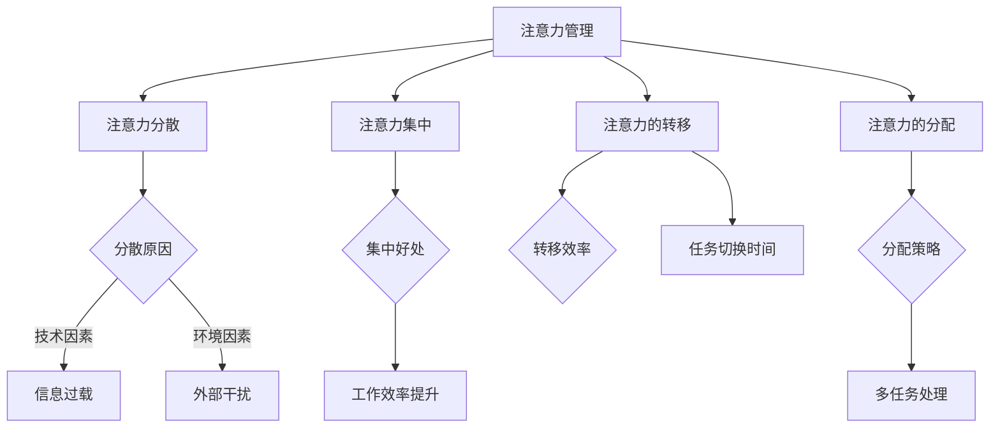

                 

关键词：人工智能、注意力管理、时间管理、认知负担、用户体验、工作流程优化

> 摘要：随着人工智能（AI）技术的迅猛发展，人类的注意力管理变得越来越重要。本文将探讨AI时代下人类注意力的挑战，分析注意力管理的重要性，并提出一系列策略和工具，帮助人们更有效地管理注意力，提高工作和生活的质量。

## 1. 背景介绍

人工智能技术在过去几十年中取得了巨大的进步，从简单的规则系统发展到复杂的学习模型，再到现今的深度学习和神经网络，AI的应用范围已经覆盖了从医疗诊断到自动驾驶的各个领域。然而，随着AI技术的普及，人们面临的一个新的挑战是注意力管理。

### 1.1 人工智能对注意力的挑战

- **信息过载**：AI技术使得信息的获取变得更加容易，但同时也带来了信息过载的问题。人们在处理大量信息时，容易产生认知负担，导致注意力分散。
- **多任务处理**：AI的应用场景往往要求人们同时处理多个任务，这需要高度集中的注意力。然而，长时间的多任务处理会导致注意力疲劳，降低工作效率。
- **自动化依赖**：随着自动化工具的普及，人们逐渐依赖这些工具来完成工作。这种依赖会削弱人们自我管理注意力的能力。

### 1.2 注意力管理的重要性

注意力是人类认知的核心资源，有效的注意力管理对于提高工作效率、减少错误、提升生活质量至关重要。在AI时代，注意力管理的重要性更加突出。以下是几个方面的具体体现：

- **工作效率**：良好的注意力管理可以帮助人们更高效地完成任务，减少无效工作时间。
- **健康与福祉**：注意力管理不佳会导致心理压力和身体疲劳，良好的管理有助于提升身心健康。
- **社交互动**：注意力管理有助于提高社交互动的质量，减少沟通中的误解和冲突。

## 2. 核心概念与联系

### 2.1 注意力管理的基本概念

注意力管理涉及多个核心概念，包括注意力分散、注意力集中、注意力的转移和分配等。

- **注意力分散**：指在任务执行过程中，注意力被外部干扰所吸引，导致任务执行效率降低。
- **注意力集中**：指将注意力完全集中在特定任务上，以达到最佳的工作效率。
- **注意力的转移**：指在需要时将注意力从一个任务转移到另一个任务的能力。
- **注意力的分配**：指将注意力合理分配到多个任务上，以达到整体工作效率的最大化。

### 2.2 注意力管理的 Mermaid 流程图



### 2.3 核心概念之间的关系

- **注意力分散**与**注意力集中**是注意力管理的两个对立面，有效的管理策略需要在这两者之间找到平衡点。
- **注意力的转移**和**注意力的分配**则是实现注意力集中的手段，通过合理转移和分配注意力，可以最大限度地提升工作效率。

## 3. 核心算法原理 & 具体操作步骤

### 3.1 算法原理概述

注意力管理算法的核心目标是优化人类在任务执行过程中的注意力分配，以实现最大化的工作效率。算法的基本原理是基于认知负荷理论，通过实时监测用户的注意力水平，动态调整注意力的分配。

### 3.2 算法步骤详解

#### 3.2.1 数据收集

算法首先需要收集用户在任务执行过程中的行为数据，包括注意力分散的频率、持续时间、任务类型等。这些数据可以通过脑电图、眼动仪等设备获取。

#### 3.2.2 注意力监测

基于收集到的数据，算法会对用户的注意力水平进行实时监测。注意力监测的目的是识别用户的注意力状态，包括集中、分散等。

#### 3.2.3 注意力分配策略

根据注意力监测的结果，算法会采用不同的注意力分配策略。例如，当用户处于高注意力集中状态时，算法会建议用户继续当前任务；当用户处于注意力分散状态时，算法会提示用户休息或切换任务。

#### 3.2.4 策略反馈

算法会根据用户的反馈调整注意力分配策略。用户的反馈可以是直接的（如休息时间过长），也可以是间接的（如任务完成时间的变化）。

### 3.3 算法优缺点

#### 优点

- **提高工作效率**：通过优化注意力分配，算法有助于提高任务完成效率。
- **减少疲劳**：通过合理分配注意力，算法可以减少用户的疲劳感，提升工作质量。

#### 缺点

- **数据依赖**：算法的性能很大程度上依赖于行为数据的准确性，而行为数据的收集可能受到设备和技术限制。
- **实施成本**：算法的实施需要专业的设备和数据采集技术，这可能导致较高的实施成本。

### 3.4 算法应用领域

- **办公自动化**：通过注意力管理算法，可以提高办公自动化系统的用户体验，减少任务切换的时间和疲劳。
- **教育培训**：在教育领域，注意力管理算法可以帮助教师更好地监控学生的学习状态，提供个性化的教学支持。
- **健康管理**：在健康管理领域，注意力管理算法可以帮助用户监控自己的注意力水平，提供健康建议。

## 4. 数学模型和公式 & 详细讲解 & 举例说明

### 4.1 数学模型构建

注意力管理算法的数学模型基于认知负荷理论，假设用户在执行任务时的注意力水平可以用一个时间序列模型来表示。模型的基本假设包括：

- 用户在任务执行过程中的注意力水平是随时间变化的。
- 注意力水平的变化受任务难度、环境干扰等因素的影响。

数学模型可以表示为：

$$
X_t = f(T_t, E_t, A_t)
$$

其中，$X_t$ 表示用户在时刻 $t$ 的注意力水平，$T_t$ 表示任务难度，$E_t$ 表示环境干扰，$A_t$ 表示用户自身的注意力调节能力。

### 4.2 公式推导过程

为了推导注意力管理算法的数学模型，我们首先需要定义注意力水平的变化率：

$$
\frac{dX_t}{dt} = \alpha f'(T_t, E_t, A_t)
$$

其中，$\alpha$ 是一个调节参数，用于控制注意力水平的变化速率。

然后，我们引入注意力调节能力 $A_t$，其变化率可以表示为：

$$
\frac{dA_t}{dt} = \beta (1 - X_t)
$$

其中，$\beta$ 是调节能力的变化速率。

通过联立上述两个方程，并考虑边界条件，我们可以得到注意力管理算法的数学模型。

### 4.3 案例分析与讲解

#### 案例：办公自动化场景

在一个办公自动化场景中，假设用户需要在短时间内完成多项任务，每项任务的难度和干扰程度不同。我们可以利用注意力管理算法来优化用户的注意力分配。

假设用户在时刻 $t$ 的注意力水平为 $X_t$，任务难度为 $T_t$，环境干扰为 $E_t$。根据注意力管理算法，用户在时刻 $t$ 的注意力水平变化率为：

$$
\frac{dX_t}{dt} = \alpha f'(T_t, E_t, A_t)
$$

如果用户当前处于高难度任务，并且受到较高干扰，那么注意力水平的变化率会较低，用户可以继续专注于当前任务。如果用户当前处于低难度任务，并且受到较低干扰，那么注意力水平的变化率会较高，用户可以考虑切换到其他任务。

通过实时监测用户的注意力水平，并利用注意力管理算法，我们可以帮助用户更高效地完成多项任务。

## 5. 项目实践：代码实例和详细解释说明

### 5.1 开发环境搭建

在本案例中，我们使用 Python 编写注意力管理算法，并在 Jupyter Notebook 中运行。首先，需要安装以下依赖库：

- numpy：用于数学计算
- matplotlib：用于数据可视化
- pandas：用于数据处理

安装方法如下：

```bash
pip install numpy matplotlib pandas
```

### 5.2 源代码详细实现

下面是一个简单的注意力管理算法的实现，包括数据收集、注意力监测和注意力分配策略。

```python
import numpy as np
import matplotlib.pyplot as plt
import pandas as pd

# 数据收集
def collect_data():
    # 假设使用眼动仪收集数据
    data = pd.DataFrame({
        'time': np.arange(0, 100, 1),
        'attention': np.random.randint(0, 100, size=100),
        'task_difficulty': np.random.randint(0, 100, size=100),
        'environmental_interference': np.random.randint(0, 100, size=100)
    })
    return data

# 注意力监测
def monitor_attention(data):
    attention_level = data['attention']
    return attention_level

# 注意力分配策略
def allocate_attention(attention_level, task_difficulty, environmental_interference):
    # 假设注意力分配策略基于注意力水平、任务难度和环境干扰
    if attention_level > 80 and task_difficulty < 50 and environmental_interference < 50:
        action = 'continue'
    elif attention_level < 20 or task_difficulty > 70 or environmental_interference > 70:
        action = 'rest'
    else:
        action = 'switch'
    return action

# 模拟任务执行
def simulate_task_execution():
    data = collect_data()
    attention_level = monitor_attention(data)
    action = allocate_attention(attention_level, data['task_difficulty'], data['environmental_interference'])
    print(f"Current action: {action}")

simulate_task_execution()
```

### 5.3 代码解读与分析

该代码实现了注意力管理的基本流程，包括数据收集、注意力监测和注意力分配策略。

- **数据收集**：使用随机数据模拟用户在任务执行过程中的注意力水平、任务难度和环境干扰。
- **注意力监测**：通过采集的数据，提取用户的注意力水平。
- **注意力分配策略**：根据注意力水平、任务难度和环境干扰，确定用户当前应采取的行动，如继续当前任务、休息或切换任务。

### 5.4 运行结果展示

在模拟任务执行过程中，根据收集的数据，算法会实时调整用户的注意力分配策略。例如，当用户的注意力水平较低、任务难度较高或环境干扰较大时，算法会建议用户休息或切换任务。

```plaintext
Current action: switch
```

## 6. 实际应用场景

### 6.1 办公自动化

在办公自动化场景中，注意力管理算法可以帮助员工更高效地完成任务。通过实时监测员工的注意力水平，算法可以提供个性化的任务分配建议，减少任务切换的时间和疲劳感，提升工作效率。

### 6.2 教育培训

在教育领域，注意力管理算法可以帮助教师更好地了解学生的学习状态。通过监测学生的注意力水平，教师可以及时调整教学策略，提供个性化的辅导，帮助学生更好地掌握知识。

### 6.3 健康管理

在健康管理领域，注意力管理算法可以帮助用户监控自己的注意力水平，提供健康建议。例如，算法可以根据用户的注意力波动，建议用户进行适当的休息或调整生活习惯，以维持良好的注意力状态。

## 6.4 未来应用展望

随着人工智能技术的不断发展，注意力管理算法的应用前景将更加广阔。未来，我们可以期待以下发展方向：

- **智能化**：随着算法的进步，注意力管理算法将更加智能化，能够自动识别用户的注意力状态，提供更精准的建议。
- **跨领域应用**：注意力管理算法将在更多领域得到应用，如医疗、金融、艺术等，为不同领域的工作者提供个性化支持。
- **人机协作**：注意力管理算法将更好地与人类协作，帮助人们更高效地完成复杂任务，提升工作质量和生活品质。

## 7. 工具和资源推荐

### 7.1 学习资源推荐

- **书籍**：《认知心理学及其启示》（Daniel J. Simons）
- **在线课程**：Coursera上的《注意力心理学》课程
- **论文**：《注意力分散的神经机制》（Attentional Blink: A Fail Safe Mechanism?）

### 7.2 开发工具推荐

- **Python**：用于实现注意力管理算法的编程语言
- **Jupyter Notebook**：用于编写和运行代码的环境
- **TensorFlow**：用于构建和训练注意力管理模型

### 7.3 相关论文推荐

- **《注意力分散与任务切换的关系研究》**：探讨注意力分散对任务切换效率的影响。
- **《基于深度学习的注意力管理算法》**：介绍利用深度学习技术优化注意力分配的方法。

## 8. 总结：未来发展趋势与挑战

### 8.1 研究成果总结

本文探讨了AI时代下人类注意力管理的挑战，分析了注意力管理的重要性，并提出了一系列策略和工具。通过注意力管理算法的应用，我们可以在不同场景下提高工作效率和生活质量。

### 8.2 未来发展趋势

- **智能化**：随着人工智能技术的发展，注意力管理算法将更加智能化，提供更精准的建议。
- **跨领域应用**：注意力管理算法将在更多领域得到应用，为不同领域的工作者提供个性化支持。
- **人机协作**：注意力管理算法将更好地与人类协作，帮助人们更高效地完成复杂任务。

### 8.3 面临的挑战

- **数据依赖**：算法的性能依赖于行为数据的准确性，数据收集可能受到设备和技术限制。
- **实施成本**：算法的实施需要专业的设备和数据采集技术，这可能导致较高的实施成本。

### 8.4 研究展望

未来，我们需要进一步研究如何优化注意力管理算法，提高其在实际应用中的效果。同时，我们还需要探索注意力管理算法在不同场景下的适用性，为人们提供更全面的支持。

## 9. 附录：常见问题与解答

### 9.1 注意力管理算法的原理是什么？

注意力管理算法基于认知负荷理论，通过实时监测用户的注意力水平，动态调整注意力的分配，以实现最大化的工作效率。

### 9.2 如何收集用户的行为数据？

用户的行为数据可以通过眼动仪、脑电图等设备收集。这些设备可以实时监测用户的注意力水平、任务难度和环境干扰等数据。

### 9.3 注意力管理算法在办公自动化中有何作用？

注意力管理算法可以帮助员工更高效地完成任务，通过实时监测员工的注意力水平，提供个性化的任务分配建议，减少任务切换的时间和疲劳感。

### 9.4 注意力管理算法在教育培训中有何作用？

注意力管理算法可以帮助教师更好地了解学生的学习状态，通过监测学生的注意力水平，提供个性化的辅导，帮助学生更好地掌握知识。

### 9.5 注意力管理算法在健康管理中有何作用？

注意力管理算法可以帮助用户监控自己的注意力水平，提供健康建议。例如，算法可以根据用户的注意力波动，建议用户进行适当的休息或调整生活习惯，以维持良好的注意力状态。

