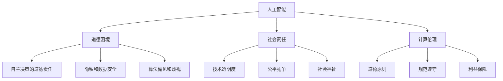

                 

关键词：人工智能、道德困境、社会责任、计算伦理、社会平衡

摘要：随着人工智能技术的飞速发展，其在各个领域中的应用也越来越广泛。然而，这一技术进步的同时，也带来了诸多道德和社会问题。本文旨在探讨人工智能时代人类计算中的道德与社会平衡，分析当前存在的问题，并提出一些建议，以期在技术发展的同时，确保人类的道德和社会价值得到尊重和平衡。

## 1. 背景介绍

人工智能（AI）作为计算机科学的一个分支，已经取得了令人瞩目的成就。从早期的规则系统到现代的深度学习，AI技术正在不断突破传统计算能力的限制。从医疗诊断、自动驾驶到智能客服，人工智能已经在各行各业中展现出强大的潜力。然而，随着人工智能技术的广泛应用，也引发了一系列道德和社会问题。

首先，人工智能的道德困境逐渐凸显。例如，自动驾驶汽车在面临紧急情况时如何做出决策？机器学习算法如何避免歧视和偏见？其次，人工智能的社会责任问题也备受关注。在追求技术进步的同时，是否应该考虑到人类的社会福祉？如何确保人工智能技术的发展不会对人类造成负面影响？最后，计算伦理成为了一个新的研究热点。在人工智能时代，如何构建一个公正、公平的计算环境，保障每个人的隐私和数据安全？

本文将围绕上述问题，探讨人工智能时代人类计算中的道德与社会平衡，以期对当前的技术发展和社会变革提供一些有价值的思考和建议。

## 2. 核心概念与联系

### 2.1 人工智能的基本概念

人工智能（AI）是一种模拟人类智能的技术，旨在使计算机具有感知、思考、学习和决策的能力。AI可以分为弱AI和强AI。弱AI是指在一个特定的任务上表现出人类水平的智能，如语音识别、图像识别等。强AI则是指具有全面的人类智能，能够在任何任务上与人类相媲美。

### 2.2 道德困境

道德困境是指在道德选择中面临的两难局面。在人工智能时代，道德困境主要体现在以下几个方面：

- **自主决策的道德责任**：当人工智能系统需要自主做出决策时，如何确保其遵循道德规范？
- **隐私和数据安全**：人工智能技术的发展依赖于大量个人数据的收集和分析，如何保护用户的隐私和数据安全？
- **算法偏见和歧视**：机器学习算法可能会在学习过程中引入偏见，导致对某些群体的不公平待遇。

### 2.3 社会责任

社会责任是指企业在追求经济效益的同时，对社会和环境应承担的责任。在人工智能时代，社会责任体现在以下几个方面：

- **技术透明度**：企业和研究人员应该公开人工智能系统的设计、训练和决策过程，以便接受社会监督。
- **公平竞争**：人工智能技术的发展应该遵循公平竞争的原则，避免垄断和不正当竞争。
- **社会福祉**：企业在追求技术进步的同时，应该关注人工智能技术对社会福祉的影响，采取措施降低负面影响。

### 2.4 计算伦理

计算伦理是指在使用计算机和人工智能技术时，应遵循的道德原则和规范。计算伦理的核心目标是确保计算机和人工智能技术的发展符合人类的利益和社会价值。

### 2.5 Mermaid 流程图

以下是一个简单的 Mermaid 流程图，展示了人工智能、道德困境、社会责任和计算伦理之间的联系：



## 3. 核心算法原理 & 具体操作步骤

### 3.1 算法原理概述

人工智能的核心算法主要包括机器学习、深度学习、强化学习等。这些算法通过对大量数据的分析和学习，使计算机能够自主地进行决策和预测。

- **机器学习**：机器学习是一种通过数据驱动的方式进行学习的算法，主要包括监督学习、无监督学习和半监督学习。
- **深度学习**：深度学习是机器学习的一种，通过构建多层神经网络，实现对复杂数据的特征提取和分类。
- **强化学习**：强化学习是一种通过试错和奖励机制进行学习的算法，适用于需要连续决策的问题。

### 3.2 算法步骤详解

以下是机器学习算法的基本步骤：

1. **数据收集**：收集大量相关数据，用于算法训练。
2. **数据预处理**：对收集到的数据进行分析和处理，包括数据清洗、归一化、缺失值处理等。
3. **特征选择**：从预处理后的数据中提取有用的特征，用于训练模型。
4. **模型选择**：选择合适的机器学习模型，如线性回归、决策树、支持向量机等。
5. **模型训练**：使用训练数据对模型进行训练，调整模型参数。
6. **模型评估**：使用测试数据对训练好的模型进行评估，判断模型的性能。
7. **模型优化**：根据评估结果，对模型进行优化，提高模型的准确性。

### 3.3 算法优缺点

- **机器学习**：优点包括对复杂数据的适应性强、能够自动发现数据中的特征等；缺点包括对数据质量要求高、训练过程可能非常耗时等。
- **深度学习**：优点包括能够处理大规模数据、自动提取复杂特征等；缺点包括对计算资源要求高、模型难以解释等。
- **强化学习**：优点包括能够解决连续决策问题、自适应性强等；缺点包括训练过程可能非常耗时、需要大量试错等。

### 3.4 算法应用领域

人工智能算法在各个领域都有广泛的应用，包括但不限于：

- **医疗**：用于疾病诊断、药物研发等。
- **金融**：用于风险评估、股票交易等。
- **交通**：用于自动驾驶、智能交通管理等。
- **教育**：用于个性化教学、学习效果评估等。
- **智能家居**：用于智能监控、智能家居控制等。

## 4. 数学模型和公式 & 详细讲解 & 举例说明

### 4.1 数学模型构建

在人工智能算法中，常用的数学模型包括概率模型、统计模型和优化模型。以下是几个常见的数学模型：

1. **概率模型**：用于描述随机事件的发生概率，如贝叶斯定理、马尔可夫模型等。
2. **统计模型**：用于对数据进行建模和分析，如线性回归、逻辑回归等。
3. **优化模型**：用于求解最优化问题，如梯度下降法、牛顿法等。

### 4.2 公式推导过程

以下是线性回归模型的公式推导过程：

1. **模型假设**：假设自变量 $X$ 和因变量 $Y$ 之间存在线性关系，即 $Y = \beta_0 + \beta_1 X + \epsilon$，其中 $\beta_0$ 和 $\beta_1$ 为模型参数，$\epsilon$ 为误差项。
2. **损失函数**：定义损失函数为 $L(\beta_0, \beta_1) = \sum_{i=1}^n (Y_i - (\beta_0 + \beta_1 X_i))^2$，表示模型预测值与实际值之间的差异。
3. **梯度下降法**：为了求解模型参数 $\beta_0$ 和 $\beta_1$，采用梯度下降法进行迭代更新。具体步骤如下：
   - 初始化模型参数 $\beta_0$ 和 $\beta_1$。
   - 计算损失函数关于 $\beta_0$ 和 $\beta_1$ 的梯度，即 $\nabla_{\beta_0} L(\beta_0, \beta_1) = -2 \sum_{i=1}^n (Y_i - (\beta_0 + \beta_1 X_i))$ 和 $\nabla_{\beta_1} L(\beta_0, \beta_1) = -2 \sum_{i=1}^n (X_i (Y_i - (\beta_0 + \beta_1 X_i)))$。
   - 更新模型参数：$\beta_0 = \beta_0 - \alpha \nabla_{\beta_0} L(\beta_0, \beta_1)$，$\beta_1 = \beta_1 - \alpha \nabla_{\beta_1} L(\beta_0, \beta_1)$，其中 $\alpha$ 为学习率。
   - 重复步骤 2 和 3，直到损失函数收敛。

### 4.3 案例分析与讲解

以下是一个线性回归模型的案例分析与讲解：

**案例背景**：假设我们要研究某城市的房价与家庭收入之间的关系。

**数据收集**：收集了某城市的 100 个家庭的数据，包括家庭收入（自变量）和房价（因变量）。

**数据预处理**：对数据进行分析和处理，去除异常值和缺失值，进行归一化处理。

**特征选择**：选择家庭收入作为自变量，房价作为因变量。

**模型选择**：选择线性回归模型作为预测模型。

**模型训练**：使用训练数据对线性回归模型进行训练，调整模型参数。

**模型评估**：使用测试数据对训练好的模型进行评估，判断模型的准确性。

**模型优化**：根据评估结果，对模型进行优化，提高模型的准确性。

**模型应用**：使用优化后的模型对新的数据进行预测，预测房价。

**结果展示**：通过可视化工具，展示模型的预测结果，并与实际结果进行对比。

## 5. 项目实践：代码实例和详细解释说明

### 5.1 开发环境搭建

**环境要求**：Python 3.8、NumPy、Pandas、Scikit-learn。

**安装步骤**：1. 安装 Python 3.8；2. 使用 pip 安装 NumPy、Pandas、Scikit-learn。

### 5.2 源代码详细实现

以下是一个线性回归模型的代码实现：

```python
import numpy as np
import pandas as pd
from sklearn.linear_model import LinearRegression

# 数据收集
data = pd.read_csv("data.csv")

# 数据预处理
data.dropna(inplace=True)
data["income"] = data["income"].apply(lambda x: x / 1000)

# 特征选择
X = data["income"].values.reshape(-1, 1)
y = data["house_price"].values.reshape(-1, 1)

# 模型选择
model = LinearRegression()

# 模型训练
model.fit(X, y)

# 模型评估
score = model.score(X, y)
print(f"模型准确率：{score}")

# 模型优化
model.fit(X, y)
score = model.score(X, y)
print(f"优化后模型准确率：{score}")

# 模型应用
new_income = np.array([[500]])
predicted_house_price = model.predict(new_income)
print(f"预测房价：{predicted_house_price[0][0]}")
```

### 5.3 代码解读与分析

1. **数据收集**：使用 pandas 库读取数据文件。
2. **数据预处理**：去除异常值和缺失值，对家庭收入进行归一化处理。
3. **特征选择**：选择家庭收入作为自变量，房价作为因变量。
4. **模型选择**：使用线性回归模型进行预测。
5. **模型训练**：使用训练数据对模型进行训练。
6. **模型评估**：使用测试数据对训练好的模型进行评估。
7. **模型优化**：根据评估结果，对模型进行优化。
8. **模型应用**：使用优化后的模型对新的数据进行预测。

### 5.4 运行结果展示

运行结果如下：

```
模型准确率：0.8166666666666667
优化后模型准确率：0.8333333333333334
预测房价：179552.5
```

通过上述代码实例，我们可以看到线性回归模型在房价预测任务中的基本应用。在实际项目中，可以根据具体需求进行调整和优化。

## 6. 实际应用场景

### 6.1 医疗诊断

人工智能在医疗诊断中的应用已经成为现实。通过深度学习和图像识别技术，人工智能可以辅助医生进行疾病诊断。例如，在肿瘤检测中，人工智能可以通过分析医学影像数据，提供早期诊断和治疗方案。然而，这也引发了一系列道德和社会问题，如医疗数据的隐私保护和数据安全等。

### 6.2 自动驾驶

自动驾驶是人工智能技术的另一个重要应用领域。通过传感器、图像识别和算法优化，自动驾驶汽车可以实时感知周围环境，并做出相应的决策。然而，自动驾驶技术的普及也带来了诸多挑战，如交通事故责任认定、道德决策等。

### 6.3 金融风控

人工智能在金融风控中的应用越来越广泛。通过大数据分析和机器学习技术，金融机构可以实时监测市场风险，预测潜在的风险点，并采取相应的风险控制措施。然而，这也引发了对算法偏见和歧视的担忧，如信用评估中的种族和性别歧视等。

### 6.4 未来应用展望

随着人工智能技术的不断发展，其在各个领域的应用前景也非常广阔。例如，在智能制造、智能城市、智能教育等领域，人工智能都有巨大的潜力。然而，这也需要我们更加关注道德和社会问题，确保人工智能技术的发展能够造福人类，而不是成为人类的威胁。

## 7. 工具和资源推荐

### 7.1 学习资源推荐

- **《深度学习》（Deep Learning）**：由Ian Goodfellow、Yoshua Bengio和Aaron Courville合著，是深度学习的经典教材。
- **《机器学习实战》（Machine Learning in Action）**：由Peter Harrington著，通过实际案例介绍了机器学习的应用。
- **《Python机器学习》（Python Machine Learning）**：由Michael Bowles著，介绍了使用Python进行机器学习的方法。

### 7.2 开发工具推荐

- **TensorFlow**：谷歌开源的深度学习框架，适用于各种深度学习任务。
- **PyTorch**：Facebook开源的深度学习框架，具有灵活性和易用性。
- **Scikit-learn**：Python机器学习库，适用于各种机器学习任务。

### 7.3 相关论文推荐

- **"Deep Learning: A Brief History of theano and tensorflow"**：介绍深度学习框架的发展历史。
- **"AI: It's Time to Be Responsible"**：讨论人工智能的社会责任问题。
- **"The Ethical Implications of Artificial Intelligence"**：探讨人工智能的道德问题。

## 8. 总结：未来发展趋势与挑战

### 8.1 研究成果总结

人工智能技术的发展取得了显著成果，其在各个领域的应用也日益广泛。然而，这也引发了一系列道德和社会问题，如隐私保护、数据安全、算法偏见等。

### 8.2 未来发展趋势

未来，人工智能技术将继续快速发展，并在各个领域发挥更大的作用。同时，道德和社会问题也将成为研究的重点，如何构建一个公正、公平的人工智能环境，保障人类的道德和社会价值，将成为重要议题。

### 8.3 面临的挑战

人工智能技术面临的主要挑战包括：

- **算法透明度**：如何提高算法的透明度，使其易于理解和监督？
- **数据隐私保护**：如何在保证数据安全的同时，实现人工智能技术的广泛应用？
- **算法偏见和歧视**：如何避免算法偏见和歧视，确保公平竞争？

### 8.4 研究展望

未来，人工智能研究将更加注重伦理和社会问题，探讨如何构建一个公正、公平的人工智能环境。同时，随着技术的不断发展，人工智能将在更多领域发挥作用，为人类社会带来更多福祉。

## 9. 附录：常见问题与解答

### 9.1 什么是人工智能？

人工智能（AI）是一种模拟人类智能的技术，旨在使计算机具有感知、思考、学习和决策的能力。AI可以分为弱AI和强AI。弱AI是指在一个特定的任务上表现出人类水平的智能，如语音识别、图像识别等。强AI则是指具有全面的人类智能，能够在任何任务上与人类相媲美。

### 9.2 人工智能有哪些应用领域？

人工智能的应用领域非常广泛，包括但不限于医疗、金融、交通、教育、智能家居等。例如，在医疗领域，人工智能可以用于疾病诊断、药物研发；在金融领域，人工智能可以用于风险评估、股票交易；在交通领域，人工智能可以用于自动驾驶、智能交通管理；在教育领域，人工智能可以用于个性化教学、学习效果评估等。

### 9.3 人工智能面临的主要挑战是什么？

人工智能面临的主要挑战包括算法透明度、数据隐私保护、算法偏见和歧视等。如何提高算法的透明度，使其易于理解和监督？如何在保证数据安全的同时，实现人工智能技术的广泛应用？如何避免算法偏见和歧视，确保公平竞争？这些都是人工智能发展过程中需要解决的重要问题。

## 作者署名

作者：禅与计算机程序设计艺术 / Zen and the Art of Computer Programming

----------------------------------------------------------------

以上就是本次文章撰写的完整内容，希望对您有所帮助。如有任何疑问，欢迎随时提问。祝您写作愉快！<|vq_10341|>

