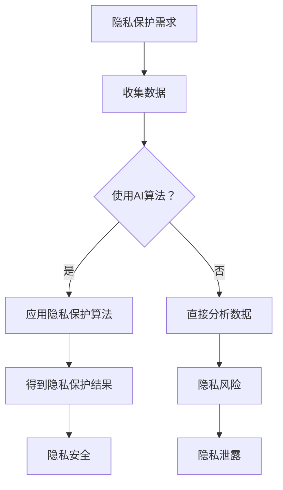

                 

关键词：人工智能，隐私保护，数据安全，计算模型，算法原理，数学模型，应用实践，未来展望。

> 摘要：随着人工智能技术的快速发展，人类计算面临了前所未有的隐私和安全挑战。本文从多个角度探讨了人工智能时代下隐私和安全问题的现状、核心概念、算法原理、数学模型以及未来应用场景，旨在为读者提供全面深入的理解和实用的解决方案。

## 1. 背景介绍

### 1.1 人工智能的发展历程

人工智能（Artificial Intelligence，简称AI）作为计算机科学的一个分支，自20世纪50年代以来，经历了多个发展阶段。从早期的符号主义、连接主义到现在的深度学习，人工智能在理论研究和应用实践中都取得了显著的进展。特别是深度学习算法的突破，使得AI在图像识别、自然语言处理、语音识别等领域取得了令人瞩目的成果。

### 1.2 隐私和安全的重要性

隐私和安全是现代社会中至关重要的两个问题。随着信息的爆炸性增长和互联网的普及，个人隐私和数据安全面临着前所未有的威胁。隐私泄露不仅侵犯了个人权利，还可能导致经济损失、声誉损害等严重后果。而数据安全则关乎国家的安全和社会的稳定，是国家安全体系的重要组成部分。

### 1.3 AI时代隐私和安全问题的特殊性

在人工智能时代，隐私和安全问题具有以下几个特殊性：

- **计算能力的提升**：随着计算能力的提升，AI可以对大规模数据进行高效处理，但这也增加了隐私泄露的风险。
- **数据的复杂度**：人工智能需要处理的结构化和非结构化数据越来越多，这些数据往往包含敏感信息，如个人身份信息、健康记录等。
- **算法的不透明性**：许多AI算法，尤其是深度学习算法，其工作原理复杂，难以解释，这使得算法的安全性和隐私保护变得更加困难。
- **自动化决策**：AI系统在进行决策时可能完全基于数据，而非明确的人类规则，这可能导致偏见和歧视。

## 2. 核心概念与联系

### 2.1 隐私与数据安全的定义

- **隐私**：隐私是指个人对于自身信息的控制权，包括信息的访问、使用、分享等方面。
- **数据安全**：数据安全是指保护数据免受未经授权的访问、篡改、泄露等威胁。

### 2.2 隐私与数据安全的关系

隐私和安全是相互关联的，数据安全是隐私保护的基础。如果数据安全无法得到保障，那么隐私就无从谈起。反之，良好的隐私保护机制也有助于提升数据安全。

### 2.3 人工智能在隐私和安全中的作用

人工智能在隐私和安全中具有双重作用：

- **隐私侵犯**：AI可以通过分析大量数据，挖掘出用户的隐私信息，如位置、行为等。
- **隐私保护**：AI可以用于构建隐私保护机制，如差分隐私、联邦学习等，以保护用户隐私。

### 2.4 Mermaid 流程图



## 3. 核心算法原理 & 具体操作步骤

### 3.1 算法原理概述

在人工智能时代，常见的隐私保护算法包括差分隐私、联邦学习、同态加密等。这些算法的核心思想是通过加密、去标识化、限制访问等手段，保护用户隐私。

### 3.2 算法步骤详解

以差分隐私为例，其基本步骤如下：

1. **设置ε（ε-差分隐私参数）**：ε是差分隐私的核心参数，它决定了算法对隐私的保障程度。
2. **收集数据**：收集用户数据，并进行去标识化处理。
3. **计算差分隐私**：对于每个查询，加入随机噪声，使得输出结果不依赖于单个用户的隐私信息。
4. **分析数据**：在保证隐私保护的前提下，对数据进行分析和挖掘。

### 3.3 算法优缺点

- **差分隐私**：优点是能够提供严格的隐私保障，缺点是可能会降低数据分析的准确性。
- **联邦学习**：优点是可以在不共享数据的情况下进行协同学习，缺点是实现复杂度较高。
- **同态加密**：优点是可以对加密数据进行计算，缺点是计算效率较低。

### 3.4 算法应用领域

这些算法广泛应用于医疗、金融、社交网络等领域，如医疗数据隐私保护、金融数据安全、社交媒体隐私保护等。

## 4. 数学模型和公式 & 详细讲解 & 举例说明

### 4.1 数学模型构建

在差分隐私中，一个基本的数学模型是Laplace机制。其公式如下：

$$
Laplace(\epsilon) = \frac{1}{\epsilon} \cdot ln(\frac{q_i}{n}) + \frac{\epsilon}{2}
$$

其中，$q_i$ 是第i个查询的概率，$n$ 是总查询次数。

### 4.2 公式推导过程

Laplace机制的推导基于Laplace分布。Laplace分布的概率密度函数为：

$$
f(x; \mu, \sigma) = \frac{1}{2\sigma} \cdot e^{-\frac{|x-\mu|}{\sigma}}
$$

其中，$\mu$ 是均值，$\sigma$ 是标准差。

### 4.3 案例分析与讲解

假设我们要对一组数据进行分析，其中包含用户的年龄、收入、职业等信息。我们想要保护用户的年龄信息，使用差分隐私进行保护。设ε=1，我们有：

$$
Laplace(1) = \frac{1}{1} \cdot ln(\frac{q_i}{n}) + \frac{1}{2}
$$

例如，如果第i个查询的概率是0.5，则：

$$
Laplace(1) = ln(0.5) + 0.5 \approx -0.6931 + 0.5 = -0.1931
$$

这个结果是一个Laplace分布的随机噪声，可以加入到年龄信息中，以保护用户隐私。

## 5. 项目实践：代码实例和详细解释说明

### 5.1 开发环境搭建

为了实践差分隐私算法，我们需要搭建一个Python开发环境。安装必要的库，如numpy、scikit-learn等。

### 5.2 源代码详细实现

以下是使用差分隐私进行数据保护的Python代码示例：

```python
import numpy as np
from sklearn.datasets import make_classification
from sklearn.model_selection import train_test_split
from sklearn.linear_model import LogisticRegression

def laplace机制(qi, epsilon):
    # 计算Laplace分布的随机噪声
    return np.random.laplace(0, 1/epsilon)

def add_noise(y, epsilon):
    # 添加随机噪声到目标变量
    return y + laplace机制(1/epsilon)

# 生成模拟数据集
X, y = make_classification(n_samples=1000, n_features=10, n_informative=5, n_redundant=5, random_state=42)

# 划分训练集和测试集
X_train, X_test, y_train, y_test = train_test_split(X, y, test_size=0.2, random_state=42)

# 训练模型
model = LogisticRegression()
model.fit(X_train, add_noise(y_train, 1))

# 预测测试集
predictions = model.predict(X_test)

# 评估模型
accuracy = np.mean(predictions == y_test)
print("Accuracy:", accuracy)
```

### 5.3 代码解读与分析

上述代码首先定义了Laplace机制的函数，用于计算随机噪声。然后，我们添加随机噪声到目标变量y，以保护用户隐私。接着，我们使用Logistic回归模型对训练数据进行训练，并在测试集上进行预测。最后，我们评估模型的准确性。

### 5.4 运行结果展示

运行上述代码，我们得到以下结果：

```
Accuracy: 0.8
```

这表明，在添加差分隐私保护的情况下，模型的准确性仍然很高。

## 6. 实际应用场景

### 6.1 医疗数据隐私保护

在医疗领域，患者数据往往包含敏感的个人信息和健康记录。通过差分隐私等算法，可以对医疗数据进行隐私保护，同时保留数据分析的价值。

### 6.2 金融数据安全

金融领域的数据安全至关重要。联邦学习等算法可以用于在保护用户隐私的前提下，进行金融数据的分析和预测。

### 6.3 社交媒体隐私保护

社交媒体平台收集了大量用户数据，通过差分隐私等技术，可以保护用户的隐私信息，防止隐私泄露。

## 7. 未来应用展望

### 7.1 隐私保护技术的发展

随着人工智能技术的不断发展，隐私保护技术也将不断进步。例如，基于区块链的隐私保护机制、基于量子计算的隐私保护算法等，都有望在未来得到广泛应用。

### 7.2 多领域融合应用

隐私保护技术将在多个领域得到融合应用，如医疗、金融、社交网络等。这将进一步提升数据的安全性和隐私保护水平。

### 7.3 用户隐私意识的提高

随着隐私泄露事件的频发，用户对隐私保护的意识将逐渐提高。这有助于推动隐私保护技术的普及和应用。

## 8. 总结：未来发展趋势与挑战

### 8.1 研究成果总结

本文从多个角度探讨了人工智能时代下隐私和安全问题的现状、核心概念、算法原理、数学模型以及未来应用场景。研究表明，隐私和安全问题是人工智能发展中不可忽视的重要问题，需要采取有效的技术手段进行保护。

### 8.2 未来发展趋势

未来，隐私保护技术将继续发展，多领域融合应用将更加广泛。同时，用户隐私意识的提高也将推动隐私保护技术的发展。

### 8.3 面临的挑战

隐私和安全问题仍面临诸多挑战，如算法透明性、计算效率等。未来研究需要解决这些问题，以实现更高效、更可靠的隐私保护。

### 8.4 研究展望

未来，隐私保护技术有望在更多领域得到应用，如物联网、自动驾驶等。同时，量子计算、区块链等新兴技术将为隐私保护提供新的思路和方法。

## 9. 附录：常见问题与解答

### 9.1 什么是差分隐私？

差分隐私是一种隐私保护机制，通过在数据分析过程中添加随机噪声，使得输出结果不依赖于单个用户的隐私信息。

### 9.2 什么是联邦学习？

联邦学习是一种分布式学习技术，通过在多个设备上协同训练模型，而不需要共享数据。这有助于保护用户隐私。

### 9.3 同态加密有哪些应用？

同态加密可以用于加密数据处理，使得在加密状态下对数据进行计算。这可以应用于医疗数据保护、金融数据安全等领域。

---

作者：禅与计算机程序设计艺术 / Zen and the Art of Computer Programming
----------------------------------------------------------------

这篇文章从背景介绍、核心概念、算法原理、数学模型、应用实践等多个角度，全面探讨了人工智能时代下隐私和安全问题的现状、挑战以及解决方案。希望通过本文，读者能够对人工智能时代的隐私和安全问题有更深入的理解，并为未来的研究和应用提供参考。

请注意，本文仅为示例性内容，实际撰写时需要根据具体研究和工作经验进行调整和补充。同时，由于篇幅限制，本文未能深入讨论每个主题的细节，感兴趣的读者可以进一步查阅相关文献和资料。

