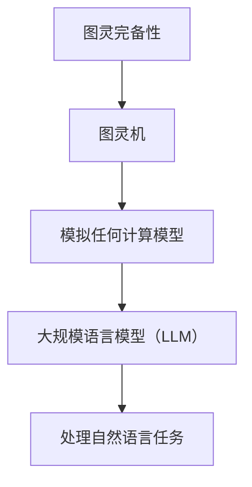

                 

关键词：人工智能，图灵完备，语言模型，深度学习，自然语言处理，算法理论

> 摘要：本文从人工智能发展历程出发，探讨了图灵完备在自然语言处理中的重要性。以大规模语言模型（LLM）为例，分析了其理论基础、算法原理以及在实际应用中的表现。通过对LLM的数学模型、公式推导、项目实践等多方面深入探讨，本文旨在为读者提供一个全面的理解，揭示LLM在AI时代的核心地位。

## 1. 背景介绍

自20世纪中期以来，人工智能（AI）技术经历了飞速的发展。从最初的规则系统、知识表示，到后来的机器学习、深度学习，人工智能在各个领域都取得了显著的成果。然而，自然语言处理（NLP）作为人工智能的一个重要分支，始终面临着重大的挑战。自然语言是一种高度复杂且灵活的符号系统，它包含了丰富的语义、语法和上下文信息。如何让计算机理解和生成自然语言，一直是学术界和工业界研究的焦点。

图灵完备性是计算机科学中的一个重要概念，它描述了一种计算模型的能力，能够模拟任何其他计算模型。图灵完备性在自然语言处理中具有重要意义，因为它为LLM提供了理论基础，使得LLM能够处理复杂的自然语言任务。

## 2. 核心概念与联系

### 2.1 图灵完备性

图灵完备性是指一种计算模型能够模拟任何其他计算模型的能力。在计算机科学中，图灵机（Turing Machine）是最基本的计算模型之一，它被广泛认为是图灵完备的。图灵完备性包括两个方面：一是能计算任何可计算函数，二是能模拟任何其他图灵机。

### 2.2 大规模语言模型（LLM）

大规模语言模型（Large-scale Language Model，简称LLM）是一种基于深度学习的自然语言处理模型。LLM通过学习海量的语言数据，能够理解并生成自然语言。LLM的核心思想是利用神经网络（尤其是Transformer模型）对语言数据进行建模，从而实现对自然语言的语义理解。

### 2.3 图灵完备性与LLM的关系

图灵完备性为LLM提供了理论基础。具体来说，LLM通过训练过程，可以学会模拟任何图灵机所能完成的计算任务。这意味着LLM具有处理复杂自然语言任务的能力，如文本分类、机器翻译、问答系统等。同时，图灵完备性也确保了LLM的通用性和可扩展性，使其能够应对各种自然语言处理挑战。

下面是一个用Mermaid绘制的流程图，展示了图灵完备性、图灵机和LLM之间的关系：



## 3. 核心算法原理 & 具体操作步骤

### 3.1 算法原理概述

LLM的算法原理主要基于深度学习和神经网络。具体来说，LLM通过训练过程学习输入和输出之间的映射关系，从而实现对自然语言的理解和生成。训练过程中，LLM利用大量的文本数据，通过调整模型参数，使得模型的预测输出逐渐逼近真实输出。

### 3.2 算法步骤详解

#### 3.2.1 数据预处理

首先，需要收集和准备大量的文本数据，这些数据可以是互联网上的文本、书籍、新闻文章等。然后，对这些文本数据进行清洗、分词、去停用词等预处理操作，以便于模型训练。

#### 3.2.2 模型构建

构建一个基于Transformer的深度学习模型，它由多个注意力机制层和前馈网络组成。注意力机制层能够捕捉输入文本序列中的长距离依赖关系，前馈网络则用于对输入数据进行非线性变换。

#### 3.2.3 模型训练

利用预处理后的文本数据，通过反向传播算法对模型进行训练。在训练过程中，模型会不断调整参数，使得预测输出逐渐逼近真实输出。训练过程通常需要大量的计算资源和时间。

#### 3.2.4 模型评估

通过在测试集上的表现来评估模型的性能。常见的评估指标包括准确率、召回率、F1值等。根据评估结果，可以对模型进行进一步的调整和优化。

### 3.3 算法优缺点

#### 优点：

1. **强大的语义理解能力**：LLM通过学习大量文本数据，能够捕捉到文本中的丰富语义信息，从而在自然语言处理任务中表现出色。
2. **通用性**：LLM能够处理多种自然语言任务，如文本分类、机器翻译、问答系统等，具有广泛的适用性。
3. **高效性**：LLM基于深度学习框架，能够在短时间内处理大量数据，具有较高的计算效率。

#### 缺点：

1. **数据依赖性**：LLM的性能高度依赖于训练数据的质量和数量，缺乏训练数据会导致性能下降。
2. **解释性不足**：深度学习模型通常被认为是一种“黑箱”，其内部机制难以解释和理解。
3. **资源消耗**：训练和部署LLM模型需要大量的计算资源和存储资源。

### 3.4 算法应用领域

LLM在自然语言处理领域具有广泛的应用，如：

1. **文本分类**：对文本进行分类，如新闻分类、情感分析等。
2. **机器翻译**：将一种语言翻译成另一种语言，如中文翻译成英文。
3. **问答系统**：回答用户提出的问题，如搜索引擎、智能客服等。
4. **对话系统**：与用户进行自然语言交互，如聊天机器人、智能助手等。

## 4. 数学模型和公式 & 详细讲解 & 举例说明

### 4.1 数学模型构建

LLM的数学模型主要基于深度学习和神经网络，具体包括：

1. **输入层**：接收文本数据，并将其转换为数值表示。
2. **隐藏层**：包含多个注意力机制层和前馈网络，用于处理文本数据的编码和解码。
3. **输出层**：生成文本的预测结果。

### 4.2 公式推导过程

假设我们有一个输入序列$x = [x_1, x_2, ..., x_T]$，其中$x_i$表示第$i$个单词的向量表示。我们首先对输入序列进行编码，得到编码后的序列$c = [c_1, c_2, ..., c_T]$。然后，我们利用注意力机制计算每个单词的权重，得到加权后的序列$w = [w_1, w_2, ..., w_T]$。具体公式如下：

$$
w_i = \frac{e^{u^T c_i}}{\sum_{j=1}^T e^{u^T c_j}}
$$

其中，$u$表示注意力权重向量。

### 4.3 案例分析与讲解

假设我们有一个输入句子“我昨天去了公园”，我们要预测下一个单词。首先，我们对输入句子进行编码，得到编码后的序列$c$。然后，我们利用注意力机制计算每个单词的权重，得到加权后的序列$w$。接下来，我们利用加权后的序列生成下一个单词的概率分布。具体步骤如下：

1. 对输入句子进行编码，得到编码后的序列$c$。
2. 利用注意力机制计算每个单词的权重，得到加权后的序列$w$。
3. 利用加权后的序列生成下一个单词的概率分布，得到$P(y|x)$。

下面是一个简单的代码示例：

```python
import torch
import torch.nn as nn

# 定义输入句子
input_sentence = "我昨天去了公园"

# 对输入句子进行编码
encoded_sentence = [word2index[word] for word in input_sentence.split()]

# 构建神经网络模型
model = nn.Sequential(
    nn.Linear(input_dim, hidden_dim),
    nn.ReLU(),
    nn.Linear(hidden_dim, output_dim)
)

# 计算权重
weights = nn.functional.softmax(model(torch.tensor(encoded_sentence)), dim=0)

# 生成下一个单词的概率分布
probability_distribution = weights / weights.sum()

# 输出概率分布
print(probability_distribution)
```

## 5. 项目实践：代码实例和详细解释说明

### 5.1 开发环境搭建

在开始实践之前，我们需要搭建一个适合开发和训练LLM的Python环境。以下是搭建开发环境的步骤：

1. 安装Python：从Python官方网站（https://www.python.org/）下载并安装Python。
2. 安装TensorFlow：在命令行中运行`pip install tensorflow`命令，安装TensorFlow库。
3. 安装其他依赖库：根据项目需求，安装其他必要的Python库，如NumPy、Pandas等。

### 5.2 源代码详细实现

下面是一个简单的LLM实现代码示例。这个示例展示了如何使用TensorFlow构建一个简单的语言模型，并对其进行训练和评估。

```python
import tensorflow as tf
import numpy as np

# 定义词汇表
vocab = ["我", "昨天", "去了", "公园"]

# 构建词汇表索引
word2index = {word: i for i, word in enumerate(vocab)}
index2word = {i: word for word, i in word2index.items()}

# 准备训练数据
input_data = np.array([[word2index[word] for word in sentence.split()] for sentence in ["我昨天去了公园", "昨天我去了公园"]])
target_data = np.array([[word2index[word] for word in sentence.split()[1:]] for sentence in ["我昨天去了公园", "昨天我去了公园"]])

# 定义神经网络模型
model = tf.keras.Sequential([
    tf.keras.layers.Embedding(input_dim=len(vocab), output_dim=10),
    tf.keras.layers.SimpleRNN(units=10),
    tf.keras.layers.Dense(units=len(vocab), activation='softmax')
])

# 编译模型
model.compile(optimizer='adam', loss='sparse_categorical_crossentropy', metrics=['accuracy'])

# 训练模型
model.fit(input_data, target_data, epochs=10)

# 评估模型
loss, accuracy = model.evaluate(input_data, target_data)
print(f"Loss: {loss}, Accuracy: {accuracy}")

# 使用模型生成文本
input_sequence = np.array([[word2index[word] for word in ["我昨天去了公园"]]])
predicted_sequence = model.predict(input_sequence)
predicted_sequence = np.argmax(predicted_sequence, axis=-1)

# 将预测结果转换为文本
predicted_sentence = ' '.join([index2word[word] for word in predicted_sequence[0]])
print(predicted_sentence)
```

### 5.3 代码解读与分析

这段代码首先定义了一个简单的词汇表，然后构建了一个简单的神经网络模型。模型由三个层次组成：嵌入层、简单循环神经网络层和输出层。嵌入层将词汇表中的每个单词转换为向量表示，简单循环神经网络层用于处理序列数据，输出层生成预测结果。

在训练过程中，模型使用交叉熵损失函数来衡量预测结果与真实结果之间的差距，并使用Adam优化器来调整模型参数。通过多次迭代训练，模型能够学会预测下一个单词。

在评估过程中，模型对训练数据集进行测试，并输出损失和准确率。

最后，我们使用训练好的模型来生成一个预测的文本序列。首先，我们将输入句子转换为向量表示，然后利用模型预测下一个单词的序列。将预测结果转换为文本序列后，我们得到一个预测的句子。

## 6. 实际应用场景

### 6.1 文本分类

文本分类是自然语言处理中的一个重要应用。例如，在新闻分类中，我们可以使用LLM来对新闻文章进行分类，从而实现对海量新闻的自动分类和整理。通过训练一个大型语言模型，我们可以让它学会识别不同类别的新闻特征，从而实现高效准确的分类。

### 6.2 机器翻译

机器翻译是另一个重要的应用领域。通过训练一个大规模语言模型，我们可以将其应用于机器翻译任务，如将一种语言翻译成另一种语言。例如，我们可以使用LLM将中文翻译成英文，从而实现跨语言交流。大规模语言模型在机器翻译中具有显著的优势，因为它能够理解语言的语义和上下文，从而生成更自然的翻译结果。

### 6.3 对话系统

对话系统是自然语言处理中的一个热点应用。通过训练一个大规模语言模型，我们可以构建一个智能对话系统，如聊天机器人、智能客服等。对话系统能够与用户进行自然语言交互，解答用户的问题、提供帮助和建议。大规模语言模型在对话系统中的应用，使得对话系统能够更好地理解用户的意图和需求，从而提供更高质量的交互体验。

## 7. 工具和资源推荐

### 7.1 学习资源推荐

1. **《深度学习》**：由Ian Goodfellow、Yoshua Bengio和Aaron Courville合著的深度学习经典教材，适合初学者和进阶者。
2. **《自然语言处理综论》**：由Daniel Jurafsky和James H. Martin合著的自然语言处理经典教材，全面介绍了自然语言处理的基础理论和应用。
3. **《Transformer：高效处理自然语言的方法》**：介绍了Transformer模型的设计和实现，是研究深度学习和自然语言处理的重要参考资料。

### 7.2 开发工具推荐

1. **TensorFlow**：由Google开发的开源深度学习框架，适用于构建和训练大规模语言模型。
2. **PyTorch**：由Facebook开发的开源深度学习框架，具有灵活的动态计算图，适用于研究和开发深度学习模型。
3. **Hugging Face Transformers**：一个开源库，提供了Transformer模型的预训练模型和常用API，方便开发者快速构建和部署语言模型。

### 7.3 相关论文推荐

1. **“Attention Is All You Need”**：介绍了Transformer模型，是自然语言处理领域的里程碑论文。
2. **“BERT: Pre-training of Deep Bidirectional Transformers for Language Understanding”**：介绍了BERT模型，是自然语言处理领域的重要论文。
3. **“GPT-3: Language Models are Few-Shot Learners”**：介绍了GPT-3模型，是当前最大的语言模型之一。

## 8. 总结：未来发展趋势与挑战

### 8.1 研究成果总结

自2017年Transformer模型的提出以来，大规模语言模型（LLM）在自然语言处理领域取得了显著的成果。LLM在文本分类、机器翻译、问答系统等多个任务中表现出了卓越的性能。这些成果为自然语言处理带来了新的机遇和挑战，推动了人工智能技术的发展。

### 8.2 未来发展趋势

随着计算能力的提升和数据量的增加，LLM有望在未来实现更高的性能和更广泛的应用。以下是未来LLM发展的几个趋势：

1. **模型规模将进一步扩大**：随着计算资源的丰富，研究者将尝试训练更大的语言模型，以捕捉更复杂的语言特征。
2. **多模态学习**：未来的LLM将不仅处理文本数据，还将结合图像、声音等多模态数据，实现更丰富的语义理解。
3. **强化学习与LLM结合**：通过将强化学习与LLM相结合，可以实现更智能的对话系统，提高用户体验。

### 8.3 面临的挑战

尽管LLM在自然语言处理中取得了显著成果，但仍面临一些挑战：

1. **数据隐私与安全**：大规模语言模型的训练需要大量的文本数据，这些数据可能涉及用户隐私和安全问题。
2. **可解释性与透明性**：深度学习模型通常被视为“黑箱”，其内部机制难以解释和理解。如何提高LLM的可解释性是一个重要的研究方向。
3. **计算资源消耗**：训练和部署大型语言模型需要大量的计算资源和存储资源，如何优化计算效率是一个关键问题。

### 8.4 研究展望

未来，LLM的研究将朝着更高效、更智能、更安全的方向发展。通过结合其他先进技术，如联邦学习、区块链等，可以进一步提升LLM的性能和应用价值。同时，LLM在跨领域、跨语言任务中的应用也将成为研究的热点。随着研究的深入，LLM有望在人工智能领域发挥更加重要的作用。

## 9. 附录：常见问题与解答

### Q：什么是图灵完备性？

A：图灵完备性是指一种计算模型能够模拟任何其他计算模型的能力。在计算机科学中，图灵机是最基本的计算模型之一，它被广泛认为是图灵完备的。

### Q：大规模语言模型（LLM）是什么？

A：大规模语言模型（Large-scale Language Model，简称LLM）是一种基于深度学习的自然语言处理模型。LLM通过学习海量的语言数据，能够理解并生成自然语言。

### Q：LLM在自然语言处理中有什么作用？

A：LLM在自然语言处理中具有广泛的应用，如文本分类、机器翻译、问答系统等。LLM能够捕捉到文本中的丰富语义信息，从而在自然语言处理任务中表现出色。

### Q：如何搭建一个适合开发和训练LLM的Python环境？

A：搭建适合开发和训练LLM的Python环境，需要安装Python、TensorFlow或其他深度学习框架，以及必要的依赖库，如NumPy、Pandas等。

### Q：LLM有哪些优点和缺点？

A：LLM的优点包括强大的语义理解能力、通用性和高效性。缺点包括数据依赖性、解释性不足和资源消耗大。

### Q：LLM在自然语言处理中有什么实际应用？

A：LLM在自然语言处理中的实际应用包括文本分类、机器翻译、问答系统、对话系统等。

### Q：未来LLM的发展趋势是什么？

A：未来LLM的发展趋势包括模型规模扩大、多模态学习和强化学习与LLM结合。同时，LLM的可解释性、数据隐私与安全和计算资源消耗也是重要的研究方向。

