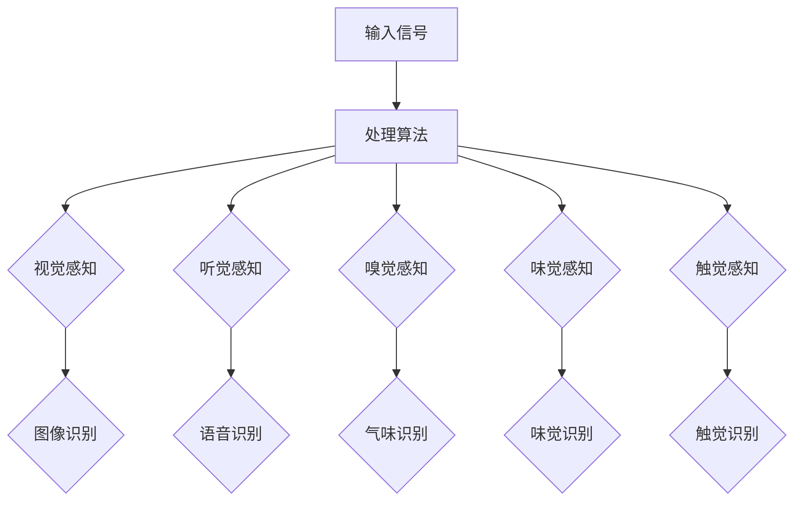

                 

关键词：人工智能、感知革命、五感、人机交互、技术发展、未来展望

> 摘要：本文探讨了人工智能技术在感知革命中的作用，以及它如何重塑人类的五感体验。通过深入分析AI在视觉、听觉、嗅觉、味觉和触觉领域的应用，本文揭示了人工智能如何改变我们的生活方式，并探讨了未来的发展趋势与挑战。

## 1. 背景介绍

近年来，人工智能（AI）技术取得了令人瞩目的进展。从深度学习到自然语言处理，从计算机视觉到机器人技术，AI的突破性发展正在改变世界的面貌。然而，尽管AI在很多领域取得了显著的成就，但我们在感知层面的互动依然有限。人类拥有五感——视觉、听觉、嗅觉、味觉和触觉，这些感官让我们能够体验世界的丰富多样性。那么，AI技术能否增强我们的感知能力，提升我们的生活体验呢？这正是本文要探讨的问题。

## 2. 核心概念与联系

### 2.1. 感知系统的基本概念

感知系统是人类与外部世界互动的重要渠道。五感分别是：

- 视觉：通过眼睛感知光信号，形成视觉图像。
- 听觉：通过耳朵接收声音信号，识别语言和环境音。
- 嗅觉：通过鼻腔感知气味，识别不同的香气。
- 味觉：通过舌头感知味觉分子，区分不同的味道。
- 触觉：通过皮肤感知触觉信号，包括压力、温度和纹理等。

### 2.2. AI与五感感知的联系

人工智能技术的发展，使得机器开始模拟人类的感知系统。例如：

- 计算机视觉：AI通过图像处理和模式识别技术，模拟人类的视觉感知。
- 语音识别：AI通过信号处理和自然语言理解，模拟人类的听觉感知。
- 机器嗅觉：AI通过传感器和算法，模拟人类的嗅觉感知。
- 机器味觉：AI通过化学传感器和机器学习，模拟人类的味觉感知。
- 机器人触觉：AI通过传感器和控制算法，模拟人类的触觉感知。

### 2.3. Mermaid 流程图

下面是AI在五感感知中的应用的Mermaid流程图：



## 3. 核心算法原理 & 具体操作步骤

### 3.1. 算法原理概述

AI感知技术的核心在于算法。不同的感知领域有不同的算法，但总体上可以分为以下几个步骤：

- 数据收集与预处理：收集相关的感知数据，并进行清洗、归一化等处理。
- 特征提取：从预处理后的数据中提取有用的特征。
- 模型训练：使用提取的特征，训练相应的感知模型。
- 模型评估与优化：评估模型的性能，并进行优化。

### 3.2. 算法步骤详解

下面以计算机视觉为例，详细解释算法的每个步骤：

#### 3.2.1. 数据收集与预处理

- 数据收集：收集大量的图像数据，可以是公开的数据集，如ImageNet、CIFAR-10等，也可以是自定义的数据集。
- 预处理：对图像进行灰度化、缩放、裁剪等操作，使其符合模型的输入要求。

#### 3.2.2. 特征提取

- 特征提取：使用卷积神经网络（CNN）等深度学习模型，从图像中提取特征。

#### 3.2.3. 模型训练

- 模型训练：使用提取的特征，训练图像分类模型。

#### 3.2.4. 模型评估与优化

- 评估：使用测试集对模型进行评估，计算准确率、召回率等指标。
- 优化：根据评估结果，调整模型参数，提高模型的性能。

### 3.3. 算法优缺点

#### 优点：

- 高效性：AI算法可以处理大量数据，提高感知的效率。
- 准确性：通过深度学习等技术，AI算法的准确率不断提高。
- 自适应性：AI算法可以根据不同的任务和数据，进行自适应调整。

#### 缺点：

- 数据依赖：算法的性能高度依赖数据的质量和数量。
- 复杂性：算法的实现和优化需要专业知识。
- 道德和隐私问题：在处理敏感数据时，可能引发道德和隐私问题。

### 3.4. 算法应用领域

AI感知算法广泛应用于多个领域，包括但不限于：

- 图像识别：用于人脸识别、物体检测、图像分类等。
- 语音识别：用于语音助手、自动翻译、语音搜索等。
- 气味识别：用于环境监测、健康诊断、食品检测等。
- 味觉识别：用于食品工业、健康监测、科学研究等。
- 触觉识别：用于机器人控制、虚拟现实、康复治疗等。

## 4. 数学模型和公式 & 详细讲解 & 举例说明

### 4.1. 数学模型构建

感知算法通常基于机器学习，特别是深度学习模型。以下是一个简单的卷积神经网络（CNN）的数学模型：

$$
\text{CNN}(\text{Input}) = \text{Activation}(\text{ReLU}(\text{Conv}(\text{Input})))
$$

其中，$\text{Input}$ 是输入图像，$\text{Conv}$ 是卷积层，$\text{ReLU}$ 是ReLU激活函数，$\text{Activation}$ 是最终的激活函数。

### 4.2. 公式推导过程

假设输入图像 $X$ 是一个 $H \times W \times C$ 的三维数组，其中 $H$ 是高度，$W$ 是宽度，$C$ 是通道数。卷积层 $\text{Conv}$ 的公式可以表示为：

$$
\text{Conv}(X) = \sum_{i=1}^{K} w_i * X + b
$$

其中，$w_i$ 是卷积核，$b$ 是偏置项，$K$ 是卷积核的数量。

### 4.3. 案例分析与讲解

假设我们有一个图像分类任务，需要识别图片中的猫和狗。我们可以使用以下公式进行分类：

$$
P(\text{Cat} | \text{Image}) = \frac{e^{\text{Logit}(\text{Cat})}}{e^{\text{Logit}(\text{Cat})} + e^{\text{Logit}(\text{Dog})}}
$$

其中，$\text{Logit}(\text{Cat})$ 和 $\text{Logit}(\text{Dog})$ 是猫和狗的预测概率。

## 5. 项目实践：代码实例和详细解释说明

### 5.1. 开发环境搭建

在Python中，我们可以使用TensorFlow和Keras等库来构建和训练CNN模型。以下是搭建开发环境的基本步骤：

- 安装Python和pip
- 安装TensorFlow和Keras
- 准备数据集

### 5.2. 源代码详细实现

以下是使用Keras构建的简单CNN模型的代码实例：

```python
from tensorflow.keras.models import Sequential
from tensorflow.keras.layers import Conv2D, MaxPooling2D, Flatten, Dense, Activation

model = Sequential()
model.add(Conv2D(32, (3, 3), input_shape=(64, 64, 3)))
model.add(Activation('relu'))
model.add(MaxPooling2D(pool_size=(2, 2)))
model.add(Conv2D(64, (3, 3)))
model.add(Activation('relu'))
model.add(MaxPooling2D(pool_size=(2, 2)))
model.add(Flatten())
model.add(Dense(64))
model.add(Activation('relu'))
model.add(Dense(1, activation='sigmoid'))

model.compile(optimizer='adam', loss='binary_crossentropy', metrics=['accuracy'])
```

### 5.3. 代码解读与分析

- Conv2D：这是卷积层，用于从输入图像中提取特征。
- Activation：这是ReLU激活函数，用于引入非线性。
- MaxPooling2D：这是最大池化层，用于减少模型的参数数量。
- Flatten：这是展平层，用于将高维特征展平为一维。
- Dense：这是全连接层，用于进行分类。
- compile：这是编译模型，指定优化器、损失函数和评价指标。

### 5.4. 运行结果展示

假设我们有一个包含猫和狗的图像数据集，我们可以使用以下代码进行模型训练和评估：

```python
model.fit(train_images, train_labels, epochs=10, validation_data=(validation_images, validation_labels))
```

## 6. 实际应用场景

AI感知技术在各个领域都有广泛的应用，以下是几个实际应用场景的例子：

- 智能家居：通过计算机视觉和语音识别，实现自动化的家庭控制。
- 医疗诊断：通过图像识别和语音识别，辅助医生进行诊断和治疗。
- 食品检测：通过气味识别和味觉识别，检测食品的质量和安全。
- 娱乐产业：通过计算机视觉和触觉识别，创造更加沉浸式的游戏体验。

## 7. 工具和资源推荐

### 7.1. 学习资源推荐

- 《深度学习》（Goodfellow, Bengio, Courville著）
- 《Python机器学习》（Sebastian Raschka著）
- 《人工智能：一种现代方法》（Stuart Russell和Peter Norvig著）

### 7.2. 开发工具推荐

- TensorFlow
- Keras
- PyTorch

### 7.3. 相关论文推荐

- "Deep Learning"（Ian Goodfellow等著）
- "Convolutional Neural Networks for Visual Recognition"（Geoffrey Hinton等著）
- "Speech Recognition with Deep Neural Networks"（D.ca Fernandez等著）

## 8. 总结：未来发展趋势与挑战

AI感知技术的发展将带来更多的可能性，但同时也面临许多挑战。未来，AI将在以下几个方面继续发展：

- 感知能力的提升：通过不断优化的算法和更强大的计算能力，AI的感知能力将更加精准。
- 应用领域的扩展：AI感知技术将在医疗、教育、工业等多个领域得到更广泛的应用。
- 道德和隐私问题：随着AI感知技术的发展，如何处理道德和隐私问题将成为一个重要的议题。

## 9. 附录：常见问题与解答

### 9.1. 问题1：AI感知技术是否能够完全替代人类的五感？

解答：AI感知技术目前还不能完全替代人类的五感，但它们可以作为一个补充，提高我们的感知能力和效率。

### 9.2. 问题2：AI感知技术是否会对隐私造成威胁？

解答：确实存在这样的风险。在使用AI感知技术时，需要严格遵守隐私保护法规，确保用户的数据安全。

作者：禅与计算机程序设计艺术 / Zen and the Art of Computer Programming
----------------------------------------------------------------

