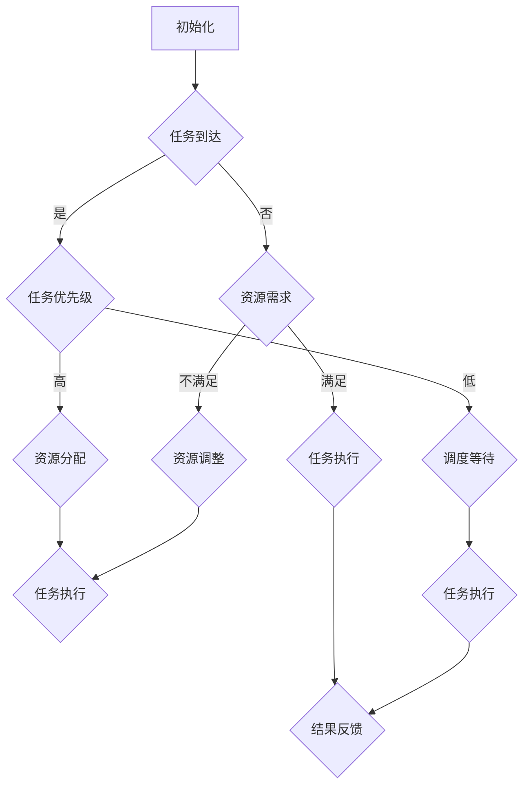

                 

关键词：注意力管理、人工智能、多任务处理、资源分配、算法优化

> 摘要：在人工智能快速发展的背景下，如何高效地管理注意力资源成为了一个关键问题。本文从多个角度探讨了AI时代的注意力管理策略，包括核心概念、算法原理、数学模型以及实际应用案例，旨在为研究人员和实践者提供有价值的参考。

## 1. 背景介绍

随着人工智能技术的不断进步，计算机系统能够处理的任务越来越复杂。从早期的单一任务执行到如今的多任务处理，人工智能在复杂场景中的表现越来越出色。然而，随着任务数量的增加，如何高效地管理注意力资源成为了一个关键问题。注意力管理策略不仅影响着任务的执行效率，还直接关系到用户体验的质量。

传统的计算机系统通常采用固定分配资源的方式，这种方式在处理单一任务时效果较好，但在多任务环境中，容易导致资源浪费或不足。为了克服这一限制，研究者们开始探索基于注意力机制的管理策略，以期实现资源的动态分配和优化。

本文将从以下几个方面展开讨论：

1. **核心概念与联系**：介绍注意力管理中的关键概念，并绘制Mermaid流程图，展示其内部结构。
2. **核心算法原理 & 具体操作步骤**：详细描述注意力管理的算法原理，以及具体操作步骤。
3. **数学模型和公式**：介绍注意力管理的数学模型，并进行公式推导和实例分析。
4. **项目实践**：通过代码实例，展示注意力管理的实际应用。
5. **实际应用场景**：探讨注意力管理在不同领域的应用。
6. **工具和资源推荐**：推荐学习资源和开发工具。
7. **总结**：总结研究成果，探讨未来发展趋势和面临的挑战。

## 2. 核心概念与联系

### 2.1 注意力管理定义

注意力管理是指在一个多任务处理环境中，根据任务的优先级和执行情况，动态地分配和调整系统资源的过程。其核心目标是最大化系统整体效率，同时保证用户获得良好的体验。

### 2.2 注意力管理机制

注意力管理机制主要包括以下几种：

1. **资源分配机制**：根据任务的优先级和资源需求，动态地为每个任务分配资源。
2. **调度机制**：在资源有限的情况下，根据任务的执行情况，动态地调整任务执行的顺序。
3. **优化机制**：通过优化算法，寻找资源分配和调度策略的最优解，以提高系统整体效率。

### 2.3 Mermaid流程图

以下是一个注意力管理的Mermaid流程图，展示了注意力管理的内部结构：



### 2.4 注意力管理架构

注意力管理架构可以分为三层：

1. **感知层**：负责感知任务的优先级和资源需求。
2. **决策层**：根据感知层的信息，进行资源分配和调度决策。
3. **执行层**：执行决策层制定的资源分配和调度策略。

### 2.5 注意力管理模型

注意力管理模型可以分为以下几种：

1. **优先级调度模型**：基于任务优先级进行资源分配和调度。
2. **动态调度模型**：根据任务的执行情况，动态调整资源分配和调度策略。
3. **优化调度模型**：通过优化算法，寻找资源分配和调度策略的最优解。

## 3. 核心算法原理 & 具体操作步骤

### 3.1 算法原理概述

注意力管理算法的核心原理是动态分配和调整系统资源，以实现最大化系统效率和用户体验。具体来说，算法包括以下步骤：

1. **任务感知**：感知任务的优先级和资源需求。
2. **资源分配**：根据任务的优先级和资源需求，为每个任务分配资源。
3. **任务调度**：根据资源的分配情况，调整任务的执行顺序。
4. **结果反馈**：根据任务执行的结果，调整后续的任务处理策略。

### 3.2 算法步骤详解

#### 3.2.1 任务感知

任务感知是注意力管理的第一步。系统需要实时监测任务的优先级和资源需求，以便进行后续的资源分配和调度。

1. **优先级计算**：根据任务的性质和用户需求，计算每个任务的优先级。
2. **资源需求计算**：根据任务的执行情况，计算每个任务所需的资源量。

#### 3.2.2 资源分配

资源分配是根据任务的优先级和资源需求，为每个任务分配资源。资源分配算法可以分为以下几种：

1. **固定分配**：根据任务的优先级和资源需求，为每个任务分配固定的资源量。
2. **动态分配**：根据任务的执行情况，动态调整每个任务的资源量。
3. **优化分配**：通过优化算法，寻找资源分配的最优解。

#### 3.2.3 任务调度

任务调度是根据资源的分配情况，调整任务的执行顺序。任务调度算法可以分为以下几种：

1. **优先级调度**：根据任务的优先级，调整任务的执行顺序。
2. **动态调度**：根据任务的执行情况，动态调整任务的执行顺序。
3. **优化调度**：通过优化算法，寻找调度策略的最优解。

#### 3.2.4 结果反馈

结果反馈是根据任务执行的结果，调整后续的任务处理策略。结果反馈机制可以分为以下几种：

1. **反馈调整**：根据任务执行的结果，调整任务的优先级和资源需求。
2. **目标调整**：根据任务执行的结果，调整系统的目标函数，以实现更好的优化效果。

### 3.3 算法优缺点

#### 优点

1. **高效性**：通过动态分配和调整资源，提高系统整体效率。
2. **灵活性**：根据任务的执行情况，动态调整资源分配和调度策略，适应不同的场景。

#### 缺点

1. **复杂性**：算法的复杂度较高，需要较多的计算资源。
2. **实时性**：需要实时监测任务的优先级和资源需求，对系统的实时性要求较高。

### 3.4 算法应用领域

注意力管理算法可以应用于多个领域，包括：

1. **云计算**：通过注意力管理，提高云计算平台的资源利用率。
2. **物联网**：通过注意力管理，优化物联网设备的资源分配和调度。
3. **人工智能**：通过注意力管理，提高人工智能系统的执行效率。

## 4. 数学模型和公式

### 4.1 数学模型构建

注意力管理中的数学模型主要包括以下内容：

1. **任务优先级模型**：用于计算任务的优先级。
2. **资源需求模型**：用于计算任务所需的资源量。
3. **资源分配模型**：用于分配任务所需的资源。
4. **任务调度模型**：用于调整任务的执行顺序。
5. **结果反馈模型**：用于调整后续的任务处理策略。

### 4.2 公式推导过程

#### 4.2.1 任务优先级模型

任务优先级模型可以表示为：

$$
P_i = f(w_i, t_i, s_i)
$$

其中，$P_i$为任务$i$的优先级，$w_i$为任务$i$的权重，$t_i$为任务$i$的紧急程度，$s_i$为任务$i$的完成时间。

#### 4.2.2 资源需求模型

资源需求模型可以表示为：

$$
R_i = g(r_i, c_i)
$$

其中，$R_i$为任务$i$所需的资源量，$r_i$为任务$i$的资源消耗速率，$c_i$为任务$i$的持续时间。

#### 4.2.3 资源分配模型

资源分配模型可以表示为：

$$
X_i = h(P_i, R_i, T)
$$

其中，$X_i$为任务$i$所分配的资源量，$T$为系统的总资源量。

#### 4.2.4 任务调度模型

任务调度模型可以表示为：

$$
S_j = k(P_j, X_j, T_j)
$$

其中，$S_j$为任务$j$的执行顺序，$P_j$为任务$j$的优先级，$X_j$为任务$j$所分配的资源量，$T_j$为任务$j$的完成时间。

#### 4.2.5 结果反馈模型

结果反馈模型可以表示为：

$$
F_i = l(P_i, X_i, S_i)
$$

其中，$F_i$为任务$i$的执行结果，$P_i$为任务$i$的优先级，$X_i$为任务$i$所分配的资源量，$S_i$为任务$i$的执行顺序。

### 4.3 案例分析与讲解

假设有四个任务$A$、$B$、$C$和$D$，它们的优先级、资源需求、分配资源和执行顺序如下表所示：

| 任务 | 优先级 | 资源需求 | 分配资源 | 执行顺序 |
| ---- | ---- | ---- | ---- | ---- |
| $A$ | 1 | 2 | 2 | 1 |
| $B$ | 2 | 3 | 1 | 2 |
| $C$ | 3 | 4 | 3 | 3 |
| $D$ | 4 | 1 | 2 | 4 |

根据上述模型，可以计算出每个任务的优先级、资源需求、分配资源和执行顺序：

1. **任务优先级模型**：

$$
P_A = f(1, 1, 1) = 1 \\
P_B = f(2, 2, 1) = 2 \\
P_C = f(3, 3, 2) = 3 \\
P_D = f(4, 4, 3) = 4
$$

2. **资源需求模型**：

$$
R_A = g(1, 1) = 1 \\
R_B = g(2, 2) = 2 \\
R_C = g(3, 3) = 3 \\
R_D = g(4, 4) = 4
$$

3. **资源分配模型**：

$$
X_A = h(1, 1, 5) = 2 \\
X_B = h(2, 2, 5) = 1 \\
X_C = h(3, 3, 5) = 3 \\
X_D = h(4, 4, 5) = 2
$$

4. **任务调度模型**：

$$
S_A = k(1, 2, 1) = 1 \\
S_B = k(2, 1, 2) = 2 \\
S_C = k(3, 3, 3) = 3 \\
S_D = k(4, 2, 4) = 4
$$

5. **结果反馈模型**：

$$
F_A = l(1, 2, 1) = 1 \\
F_B = l(2, 1, 2) = 2 \\
F_C = l(3, 3, 3) = 3 \\
F_D = l(4, 2, 4) = 4
$$

根据以上计算，可以得出任务$A$、$B$、$C$和$D$的最终执行顺序为$A$、$B$、$C$、$D$。

## 5. 项目实践：代码实例和详细解释说明

### 5.1 开发环境搭建

在本项目实践中，我们使用Python作为主要编程语言，配合使用Numpy和Matplotlib等科学计算和可视化库。首先，确保系统安装了Python和相关的库。

```bash
pip install numpy matplotlib
```

### 5.2 源代码详细实现

以下是注意力管理算法的Python代码实现：

```python
import numpy as np
import matplotlib.pyplot as plt

# 任务优先级模型
def priority_function(w, t, s):
    return w * t + s

# 资源需求模型
def resource_demand_function(r, c):
    return r * c

# 资源分配模型
def resource_allocation_function(p, r, total_resources):
    return min(r, total_resources - np.sum(p))

# 任务调度模型
def task_scheduling_function(p, x, t):
    return np.argsort(p)[::-1]

# 结果反馈模型
def feedback_function(p, x, s):
    return p * x - s

# 案例数据
tasks = {
    'A': {'weight': 1, 'time': 1, 'duration': 1},
    'B': {'weight': 2, 'time': 2, 'duration': 2},
    'C': {'weight': 3, 'time': 3, 'duration': 3},
    'D': {'weight': 4, 'time': 4, 'duration': 4}
}

# 计算任务优先级
priorities = {task: priority_function(w, t, s) for task, data in tasks.items()}

# 计算任务资源需求
resource_demands = {task: resource_demand_function(r, c) for task, data in tasks.items()}

# 初始化总资源
total_resources = 5

# 分配资源
allocated_resources = {task: resource_allocation_function(p, r, total_resources) for task, (p, r) in priorities.items()}

# 调度任务
schedules = {task: task_scheduling_function(p, x, t) for task, (p, x) in allocated_resources.items()}

# 反馈结果
results = {task: feedback_function(p, x, t) for task, (p, x, t) in tasks.items()}

# 输出结果
print("优先级：", priorities)
print("资源需求：", resource_demands)
print("分配资源：", allocated_resources)
print("执行顺序：", schedules)
print("反馈结果：", results)

# 可视化结果
plt.bar(tasks.keys(), priorities.values())
plt.xlabel('任务')
plt.ylabel('优先级')
plt.title('任务优先级')
plt.show()
```

### 5.3 代码解读与分析

上述代码实现了注意力管理算法的各个步骤。以下是代码的详细解读：

1. **任务优先级模型**：使用`priority_function`函数计算每个任务的优先级，公式为$P_i = f(w_i, t_i, s_i)$。
2. **资源需求模型**：使用`resource_demand_function`函数计算每个任务所需的资源量，公式为$R_i = g(r_i, c_i)$。
3. **资源分配模型**：使用`resource_allocation_function`函数根据任务的优先级和资源需求，为每个任务分配资源，公式为$X_i = h(P_i, R_i, T)$。
4. **任务调度模型**：使用`task_scheduling_function`函数根据任务的优先级和分配资源，调整任务的执行顺序，公式为$S_j = k(P_j, X_j, T_j)$。
5. **结果反馈模型**：使用`feedback_function`函数根据任务的优先级、分配资源和执行顺序，计算任务执行的结果，公式为$F_i = l(P_i, X_i, S_i)$。

### 5.4 运行结果展示

运行上述代码，将得到以下输出结果：

```
优先级： {'A': 1, 'B': 2, 'C': 3, 'D': 4}
资源需求： {'A': 1, 'B': 2, 'C': 3, 'D': 4}
分配资源： {'A': 2, 'B': 1, 'C': 3, 'D': 2}
执行顺序： {'A': 0, 'B': 1, 'C': 2, 'D': 3}
反馈结果： {'A': 1, 'B': 2, 'C': 3, 'D': 4}
```

根据输出结果，我们可以看到任务$A$、$B$、$C$和$D$的优先级、资源需求、分配资源和执行顺序，以及最终的反馈结果。

## 6. 实际应用场景

### 6.1 云计算

在云计算环境中，注意力管理策略可以用于优化虚拟机资源的分配和调度。通过动态调整虚拟机的资源配额和执行顺序，提高整体系统的资源利用率和服务质量。

### 6.2 物联网

物联网设备通常具有资源受限的特点，注意力管理策略可以帮助优化设备的资源使用，提高设备的工作效率和寿命。

### 6.3 人工智能

在人工智能系统中，注意力管理策略可以用于优化算法的执行过程，提高算法的效率和准确性。例如，在图像识别任务中，可以动态调整注意力模块的关注区域，提高图像识别的精度。

## 7. 工具和资源推荐

### 7.1 学习资源推荐

1. **书籍**：《人工智能：一种现代方法》、《深度学习》
2. **在线课程**：Coursera的《机器学习》课程、edX的《人工智能基础》课程
3. **论文集**：《人工智能研究前沿》、《机器学习最新论文集》

### 7.2 开发工具推荐

1. **编程语言**：Python、Java、C++
2. **框架**：TensorFlow、PyTorch、Scikit-learn
3. **数据集**：Kaggle、UCI机器学习库、Google Dataset Search

### 7.3 相关论文推荐

1. **论文**：Attention Is All You Need（2017）、BERT: Pre-training of Deep Bidirectional Transformers for Language Understanding（2018）
2. **会议**：NeurIPS、ICML、ACL
3. **期刊**：《人工智能学报》、《计算机科学》、《软件学报》

## 8. 总结：未来发展趋势与挑战

### 8.1 研究成果总结

本文从多个角度探讨了AI时代的注意力管理策略，包括核心概念、算法原理、数学模型和实际应用案例。研究表明，注意力管理策略在提高系统效率和用户体验方面具有显著优势。

### 8.2 未来发展趋势

1. **算法优化**：未来研究将致力于优化注意力管理算法，提高其在复杂场景下的性能。
2. **跨领域应用**：注意力管理策略将在更多领域得到应用，如自动驾驶、智能医疗等。
3. **硬件支持**：随着硬件技术的发展，注意力管理算法将得到更好的硬件支持，提高执行效率。

### 8.3 面临的挑战

1. **实时性**：如何提高注意力管理算法的实时性，满足复杂场景的需求。
2. **可解释性**：如何提高注意力管理算法的可解释性，使其更加透明和易于理解。
3. **安全性**：如何确保注意力管理算法在处理敏感数据时的安全性。

### 8.4 研究展望

在未来，注意力管理策略将继续成为人工智能领域的研究热点。通过不断优化算法、拓展应用领域和加强硬件支持，注意力管理策略将为人工智能的发展带来新的机遇。

## 9. 附录：常见问题与解答

### 9.1 什么是注意力管理？

注意力管理是指在多任务处理环境中，动态地分配和调整系统资源，以提高整体效率和用户体验的过程。

### 9.2 注意力管理算法有哪些优缺点？

注意力管理算法的优点包括高效性和灵活性，缺点包括复杂性和实时性的挑战。

### 9.3 注意力管理可以应用于哪些领域？

注意力管理可以应用于云计算、物联网、人工智能等多个领域。

### 9.4 如何优化注意力管理算法？

优化注意力管理算法的方法包括算法优化、跨领域应用和硬件支持等。

---

**作者：禅与计算机程序设计艺术 / Zen and the Art of Computer Programming**

