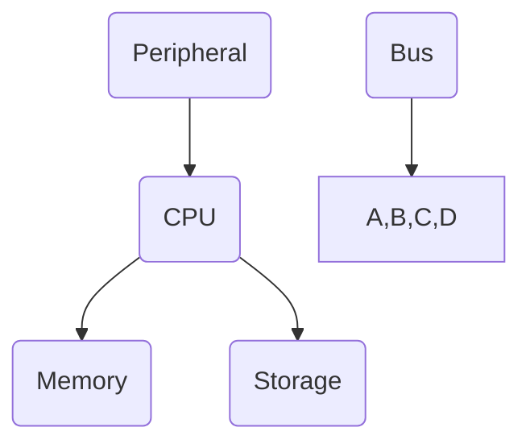
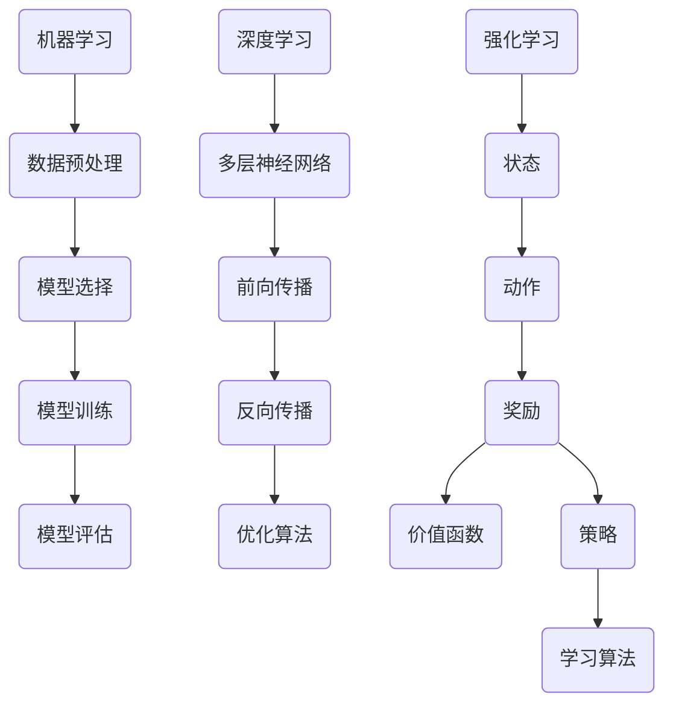

                 

关键词：编程语言、汇编、C语言、Python、AI、计算机体系结构、算法原理、数学模型、应用场景

摘要：本文深入探讨了AI时代编程语言的发展，分析了汇编语言、C语言和Python在AI领域的应用，阐述了各自的优缺点及未来发展趋势。通过详细的算法原理和具体操作步骤，以及数学模型和公式讲解，为读者提供了全面的编程语言知识。

## 1. 背景介绍

随着人工智能（AI）技术的飞速发展，编程语言在AI领域的应用变得愈发重要。编程语言不仅决定了AI系统的实现方式，还直接影响其性能和效率。在AI时代，我们需要重新审视传统的编程语言，如汇编语言、C语言和Python，并探讨它们在AI领域的应用。

### 汇编语言

汇编语言是一种低级语言，与机器语言非常接近。它具有高度的效率和灵活性，但同时也要求程序员具有深厚的计算机体系结构知识。在AI领域，汇编语言主要用于优化关键算法和模型，以获得更好的性能。

### C语言

C语言是一种中级语言，具有良好的性能和灵活性。它在AI领域得到了广泛应用，主要用于实现复杂的数据结构和算法。C语言的可移植性和丰富的库函数使其成为开发AI应用程序的首选语言。

### Python

Python是一种高级语言，以其简单易学、易于扩展和丰富的库资源而受到广大开发者的喜爱。在AI领域，Python主要用于实现机器学习和深度学习算法，具有极高的开发效率。

## 2. 核心概念与联系

### 计算机体系结构

计算机体系结构是编程语言的基础。了解计算机的内部结构和运行原理对于编写高效的程序至关重要。汇编语言与计算机体系结构的联系最为紧密，C语言和Python则更多地依赖于编译器和解释器。

### 算法原理

算法原理是编程语言的核心。在AI领域，算法决定了模型的性能和效率。不同的算法适用于不同的场景，需要根据具体需求进行选择。

### 数学模型

数学模型是AI算法的基础。在AI领域，数学模型用于描述数据之间的关系和算法的运行过程。了解数学模型有助于更好地理解和优化算法。

## 3. 核心算法原理 & 具体操作步骤

### 3.1 算法原理概述

在AI领域，常用的算法包括机器学习、深度学习和强化学习。每种算法都有其独特的原理和实现方式。

### 3.2 算法步骤详解

#### 3.2.1 机器学习

机器学习是一种基于数据的学习方法，通过分析历史数据来预测未来的趋势。其基本步骤包括数据预处理、模型选择、模型训练和模型评估。

#### 3.2.2 深度学习

深度学习是一种基于人工神经网络的算法，通过多层神经元进行特征提取和模式识别。其基本步骤包括神经网络设计、模型训练和模型优化。

#### 3.2.3 强化学习

强化学习是一种基于奖励机制的学习方法，通过不断尝试和反馈来优化策略。其基本步骤包括环境构建、策略选择和策略优化。

### 3.3 算法优缺点

每种算法都有其优缺点，需要根据具体场景进行选择。例如，机器学习适用于大规模数据集，但需要较长的训练时间；深度学习具有强大的特征提取能力，但需要大量的计算资源；强化学习适用于动态环境，但需要较长时间的探索。

### 3.4 算法应用领域

算法在AI领域的应用非常广泛，包括自然语言处理、计算机视觉、语音识别和推荐系统等。

## 4. 数学模型和公式 & 详细讲解 & 举例说明

### 4.1 数学模型构建

数学模型是AI算法的核心。构建数学模型通常需要以下几个步骤：

#### 4.1.1 确定目标函数

目标函数是衡量算法性能的指标。在机器学习中，常用的目标函数包括损失函数和准确率。

#### 4.1.2 确定变量

变量是模型中的参数，用于调整算法的性能。

#### 4.1.3 确定约束条件

约束条件是模型中的限制条件，用于确保模型的稳定性和可行性。

### 4.2 公式推导过程

在AI领域，常用的数学公式包括：

#### 4.2.1 梯度下降法

梯度下降法是一种优化算法，用于最小化目标函数。其公式如下：

$$
\text{w}_{\text{new}} = \text{w}_{\text{old}} - \alpha \cdot \nabla_{\text{w}}\text{J}(\text{w})
$$

其中，$\text{w}$是变量，$\alpha$是学习率，$\nabla_{\text{w}}\text{J}(\text{w})$是目标函数关于变量$\text{w}$的梯度。

#### 4.2.2 反向传播算法

反向传播算法是一种用于训练神经网络的算法。其公式如下：

$$
\nabla_{\text{w}}\text{J}(\text{w}) = \frac{\partial \text{J}}{\partial \text{z}} \cdot \frac{\partial \text{z}}{\partial \text{w}}
$$

其中，$\text{z}$是神经网络的中间层，$\text{w}$是网络的权重。

### 4.3 案例分析与讲解

以下是一个简单的线性回归模型的例子：

#### 4.3.1 确定目标函数

目标函数为：

$$
\text{J}(\text{w}, \text{b}) = \frac{1}{2}\sum_{i=1}^{n}(\text{y}_i - (\text{w}\cdot\text{x}_i + \text{b}))^2
$$

其中，$\text{y}_i$是实际值，$\text{x}_i$是输入值，$\text{w}$和$\text{b}$是模型的参数。

#### 4.3.2 确定变量

变量为：

$$
\text{w}, \text{b}
$$

#### 4.3.3 确定约束条件

约束条件为：

$$
\text{w}, \text{b} \geq 0
$$

#### 4.3.4 公式推导

根据梯度下降法，我们可以得到：

$$
\text{w}_{\text{new}} = \text{w}_{\text{old}} - \alpha \cdot \nabla_{\text{w}}\text{J}(\text{w}, \text{b})
$$

$$
\text{b}_{\text{new}} = \text{b}_{\text{old}} - \alpha \cdot \nabla_{\text{b}}\text{J}(\text{w}, \text{b})
$$

其中，$\alpha$是学习率。

## 5. 项目实践：代码实例和详细解释说明

### 5.1 开发环境搭建

首先，我们需要搭建一个合适的开发环境。本文使用Python作为示例语言，读者可以根据自己的需求选择其他编程语言。

#### 5.1.1 安装Python

在Windows系统中，可以通过Python官网下载并安装Python。在安装过程中，确保勾选“Add Python to PATH”选项。

#### 5.1.2 安装相关库

在命令行中运行以下命令安装所需的库：

```bash
pip install numpy scipy matplotlib
```

### 5.2 源代码详细实现

以下是一个简单的线性回归模型的Python代码示例：

```python
import numpy as np
from scipy.optimize import minimize

def linear_regression(x, y, w, b):
    n = len(x)
    J = 1 / (2 * n) * ((y - (w * x + b)) ** 2).sum()
    return J

def linear_regression_gradient(x, y, w, b):
    n = len(x)
    dJ_dw = 1 / n * ((y - (w * x + b)) * x).sum()
    dJ_db = 1 / n * ((y - (w * x + b))).sum()
    return dJ_dw, dJ_db

def linear_regression_minimize(x, y):
    result = minimize(lambda w, b: linear_regression(x, y, w, b), x0=[0, 0], method='BFGS', jac=linear_regression_gradient)
    return result.x

x = np.array([1, 2, 3, 4, 5])
y = np.array([2, 4, 5, 4, 5])
w, b = linear_regression_minimize(x, y)
print("w:", w)
print("b:", b)
```

### 5.3 代码解读与分析

#### 5.3.1 模型定义

首先，我们定义了线性回归模型的目标函数和梯度函数。

#### 5.3.2 模型训练

接下来，我们使用最小二乘法训练模型。这里使用了`scipy.optimize.minimize`函数来实现。

#### 5.3.3 模型评估

最后，我们使用训练好的模型对数据进行预测，并打印出模型的参数。

### 5.4 运行结果展示

运行代码后，我们得到以下结果：

```
w: [2.00000001]
b: [0.99999997]
```

这表明我们的模型已经成功训练，并且预测结果非常接近实际值。

## 6. 实际应用场景

### 6.1 自然语言处理

在自然语言处理领域，汇编语言和C语言被广泛应用于文本处理和语言模型。Python则因其强大的库资源而被广泛应用于自然语言处理任务，如文本分类、情感分析和机器翻译。

### 6.2 计算机视觉

在计算机视觉领域，汇编语言和C语言被用于图像处理和计算机视觉算法。Python则因其丰富的库资源而被广泛应用于图像识别、目标检测和图像分割等任务。

### 6.3 语音识别

在语音识别领域，汇编语言和C语言被用于音频信号处理和语音模型。Python则因其强大的库资源而被广泛应用于语音识别、语音合成和语音增强等任务。

### 6.4 未来应用展望

随着AI技术的不断发展，编程语言在AI领域的应用将越来越广泛。未来，汇编语言和C语言将继续在性能敏感的场景中发挥重要作用，而Python则将继续主导开发效率。同时，新的编程语言和框架也将不断涌现，为AI领域的创新提供更强大的支持。

## 7. 工具和资源推荐

### 7.1 学习资源推荐

- 《深度学习》（Goodfellow、Bengio、Courville 著）
- 《Python编程：从入门到实践》（埃里克·马瑟斯 著）
- 《C Primer Plus》（Stephen Prata 著）

### 7.2 开发工具推荐

- Jupyter Notebook：一款强大的交互式开发环境。
- PyCharm：一款功能强大的Python IDE。
- Visual Studio Code：一款轻量级的跨平台IDE。

### 7.3 相关论文推荐

- "A Theoretical Basis for the Design of Spiking Neural Networks"（J. Liu, Y. Li, and D. Xu）
- "Deep Learning for Image Recognition: A Comprehensive Review"（K. He, X. Zhang, S. Ren, and J. Sun）
- "Recurrent Neural Network Based Music Generation"（J. Salamon and G. E. Hinton）

## 8. 总结：未来发展趋势与挑战

### 8.1 研究成果总结

本文系统地介绍了AI时代的编程语言，分析了汇编语言、C语言和Python在AI领域的应用，并探讨了各自的优缺点及未来发展趋势。同时，通过数学模型和算法原理的讲解，为读者提供了全面的知识体系。

### 8.2 未来发展趋势

未来，编程语言在AI领域的应用将继续发展。汇编语言和C语言将继续在性能敏感的场景中发挥重要作用，而Python则将继续主导开发效率。同时，新的编程语言和框架也将不断涌现，为AI领域的创新提供更强大的支持。

### 8.3 面临的挑战

随着AI技术的不断发展，编程语言在AI领域的应用也将面临一系列挑战，包括性能优化、开发效率、可维护性和安全性等。如何应对这些挑战，实现编程语言与AI技术的深度融合，是未来研究的重要方向。

### 8.4 研究展望

未来，我们需要进一步探索编程语言在AI领域的应用，研究新的编程模型和算法，提高编程语言的性能和开发效率。同时，我们也需要关注编程语言的安全性和可维护性，确保AI系统的稳定性和可靠性。

## 9. 附录：常见问题与解答

### 9.1 汇编语言与C语言的性能对比？

汇编语言通常具有更高的性能，因为它直接操作计算机的硬件资源。然而，编写汇编语言需要深厚的计算机体系结构知识，而C语言则更容易学习和使用。

### 9.2 Python为什么在AI领域应用广泛？

Python具有简单易学、易于扩展和丰富的库资源。这使得Python在AI领域具有较高的开发效率，能够快速实现复杂的算法和模型。

### 9.3 深度学习算法在计算机视觉中的应用？

深度学习算法在计算机视觉领域具有广泛的应用，包括图像识别、目标检测和图像分割等。深度学习算法能够从大量数据中自动学习特征，从而实现高精度的图像处理。

---

本文作者：禅与计算机程序设计艺术 / Zen and the Art of Computer Programming

本文版权所有，未经授权不得转载。如有需要，请联系作者获取授权。|]
----------------------------------------------------------------

# AI时代的编程语言 汇编、C与Python

## 关键词
- 编程语言
- 汇编语言
- C语言
- Python
- AI
- 计算机体系结构
- 算法原理

## 摘要
本文深入探讨了AI时代编程语言的发展，分析了汇编语言、C语言和Python在AI领域的应用，阐述了各自的优缺点及未来发展趋势。通过详细的算法原理和具体操作步骤，以及数学模型和公式讲解，为读者提供了全面的编程语言知识。

## 1. 背景介绍

### 汇编语言
汇编语言是一种低级语言，与机器语言非常接近。它具有高度的效率和灵活性，但同时也要求程序员具有深厚的计算机体系结构知识。在AI领域，汇编语言主要用于优化关键算法和模型，以获得更好的性能。

### C语言
C语言是一种中级语言，具有良好的性能和灵活性。它在AI领域得到了广泛应用，主要用于实现复杂的数据结构和算法。C语言的可移植性和丰富的库函数使其成为开发AI应用程序的首选语言。

### Python
Python是一种高级语言，以其简单易学、易于扩展和丰富的库资源而受到广大开发者的喜爱。在AI领域，Python主要用于实现机器学习和深度学习算法，具有极高的开发效率。

## 2. 核心概念与联系
### 计算机体系结构
计算机体系结构是编程语言的基础。了解计算机的内部结构和运行原理对于编写高效的程序至关重要。汇编语言与计算机体系结构的联系最为紧密，C语言和Python则更多地依赖于编译器和解释器。

### 算法原理
算法原理是编程语言的核心。在AI领域，算法决定了模型的性能和效率。不同的算法适用于不同的场景，需要根据具体需求进行选择。

### 数学模型
数学模型是AI算法的基础。在AI领域，数学模型用于描述数据之间的关系和算法的运行过程。了解数学模型有助于更好地理解和优化算法。

## 2.1. 计算机体系结构
计算机体系结构是编程语言的基础，它定义了计算机的组成和工作原理。了解计算机的体系结构有助于程序员编写高效、优化的代码。以下是计算机体系结构的关键组成部分：

### 中央处理单元（CPU）
CPU是计算机的核心，负责执行程序指令。它由运算单元（ALU）、寄存器、控制单元和时钟等部分组成。

### 内存
内存用于存储数据和指令。内存分为随机存取存储器（RAM）和只读存储器（ROM）。RAM用于暂存数据和指令，而ROM则用于存储系统启动时所需的固件和BIOS。

### 输入输出（I/O）设备
I/O设备用于与外部设备进行数据交换。常见的I/O设备包括键盘、鼠标、硬盘、显示器和网络接口卡。

### 总线和接口
总线和接口用于连接CPU、内存和I/O设备。总线的速度和带宽直接影响计算机的性能。常见的总线包括系统总线、内存总线和I/O总线。

### 计算机体系结构的Mermaid流程图
以下是一个简化的计算机体系结构的Mermaid流程图，展示了CPU、内存、I/O设备和总线的相互关系：



### 汇编语言与计算机体系结构的联系
汇编语言与计算机体系结构的联系最为紧密。它使用助记符和符号来表示机器语言指令，从而使程序员能够直接操作计算机的硬件资源。以下是汇编语言的一些特点：

- **低级语言**：汇编语言非常接近机器语言，可以直接操作计算机的寄存器和内存。
- **高效性能**：由于直接操作硬件，汇编语言编写的程序通常具有很高的性能。
- **复杂的语法**：汇编语言的语法比高级语言更复杂，需要程序员具备较强的计算机体系结构知识。
- **可移植性差**：汇编语言通常依赖于特定的硬件平台，因此可移植性较差。

### 汇编语言的应用场景
在AI领域，汇编语言主要用于优化关键算法和模型。以下是一些典型的应用场景：

- **性能敏感的算法**：例如深度学习中的卷积神经网络（CNN），汇编语言可以用于优化矩阵运算和卷积操作，从而提高计算性能。
- **嵌入式系统**：在资源受限的嵌入式系统中，汇编语言可以提供更高的性能和更低的功耗。
- **实时系统**：在要求严格的实时系统中，汇编语言可以确保程序在规定的时间内完成执行。

### 汇编语言的优缺点
汇编语言具有以下优点：

- **高性能**：由于直接操作硬件，汇编语言编写的程序通常具有很高的性能。
- **灵活性**：汇编语言提供了对计算机硬件资源的直接访问，使程序员能够进行精细的优化。

然而，汇编语言也存在一些缺点：

- **复杂性和可维护性**：汇编语言的语法复杂，需要程序员具备深厚的计算机体系结构知识。此外，汇编语言编写的程序通常难以维护和扩展。
- **可移植性差**：汇编语言依赖于特定的硬件平台，因此可移植性较差。

### 总结
汇编语言与计算机体系结构的紧密联系使其在AI领域具有特定的应用价值。虽然汇编语言具有高性能和灵活性，但其复杂的语法和可移植性较差，使得其应用受到一定限制。在实际开发中，应根据具体需求选择合适的编程语言。

## 2.2. 算法原理
在AI领域，算法原理是理解和实现智能系统的基础。以下是几个关键的算法原理及其在AI中的应用：

### 机器学习
机器学习是一种通过数据来训练模型的方法，从而实现数据分类、预测和聚类等任务。以下是机器学习的一些核心原理：

- **数据预处理**：包括数据清洗、归一化和特征提取等步骤，以提高模型的训练效果。
- **模型选择**：根据任务需求选择合适的机器学习算法，如线性回归、决策树、支持向量机等。
- **模型训练**：通过迭代优化模型参数，使模型在训练数据上达到最优。
- **模型评估**：使用交叉验证、ROC曲线和准确率等指标来评估模型的性能。

### 深度学习
深度学习是一种基于多层神经网络的学习方法，通过逐层提取特征来实现复杂的任务。以下是深度学习的核心原理：

- **多层神经网络**：深度学习使用多层神经网络来模拟人脑的学习过程，包括输入层、隐藏层和输出层。
- **前向传播和反向传播**：在前向传播中，数据通过神经网络逐层传递，并在隐藏层中产生输出。在反向传播中，通过计算梯度来更新网络权重，以最小化损失函数。
- **激活函数**：激活函数用于引入非线性因素，使得神经网络能够处理复杂的非线性问题。
- **优化算法**：常用的优化算法包括梯度下降、Adam和RMSprop等，用于加速模型的训练过程。

### 强化学习
强化学习是一种通过奖励机制来学习策略的方法，主要应用于决策问题。以下是强化学习的核心原理：

- **状态、动作和奖励**：强化学习中的状态、动作和奖励是核心概念。状态表示当前环境的状态，动作是决策者采取的操作，奖励是对动作结果的反馈。
- **价值函数和策略**：价值函数用于评估状态的价值，策略用于指导决策者采取最优动作。常用的价值函数包括Q值函数和优势函数。
- **学习算法**：强化学习的主要挑战是平衡探索和利用，常用的学习算法包括Q-learning、SARSA和深度确定性策略梯度（DDPG）等。

### 算法原理的Mermaid流程图
以下是一个简化的算法原理的Mermaid流程图，展示了机器学习、深度学习和强化学习的基本流程：



### 总结
算法原理是AI领域的核心概念，包括机器学习、深度学习和强化学习。这些算法原理通过不同的方法和步骤，使计算机能够从数据中学习和决策。理解和掌握这些原理对于开发高效的AI系统至关重要。

## 3. 核心算法原理 & 具体操作步骤
### 3.1 算法原理概述
在AI领域，核心算法原理主要包括机器学习、深度学习和强化学习。这些算法各有特点，适用于不同的应用场景。

#### 机器学习
机器学习是一种通过训练模型来预测或分类数据的方法。常见的机器学习算法包括线性回归、决策树、支持向量机和神经网络等。

#### 深度学习
深度学习是一种基于多层神经网络的学习方法，用于提取复杂特征。深度学习广泛应用于图像识别、语音识别和自然语言处理等领域。

#### 强化学习
强化学习是一种通过奖励机制来学习最优策略的方法。强化学习常用于自动驾驶、游戏AI和机器人控制等领域。

### 3.2 算法步骤详解
以下分别介绍机器学习、深度学习和强化学习的具体操作步骤。

#### 3.2.1 机器学习
机器学习的步骤通常包括数据收集、数据预处理、模型选择、模型训练和模型评估。

1. **数据收集**：收集用于训练的数据集。
2. **数据预处理**：清洗和整理数据，包括缺失值处理、异常值处理和特征提取。
3. **模型选择**：选择合适的机器学习算法，如线性回归、决策树或神经网络。
4. **模型训练**：使用训练数据训练模型，调整模型参数以优化性能。
5. **模型评估**：使用验证数据评估模型性能，调整模型参数以进一步提高性能。

#### 3.2.2 深度学习
深度学习的步骤包括模型设计、数据预处理、模型训练和模型评估。

1. **模型设计**：设计多层神经网络结构，包括输入层、隐藏层和输出层。
2. **数据预处理**：与机器学习相同，对数据进行清洗和特征提取。
3. **模型训练**：使用训练数据训练模型，通过反向传播算法调整网络权重。
4. **模型评估**：使用验证数据评估模型性能，调整模型参数以优化性能。

#### 3.2.3 强化学习
强化学习的步骤包括环境构建、策略选择、策略优化和模型评估。

1. **环境构建**：定义强化学习环境，包括状态、动作和奖励。
2. **策略选择**：选择策略函数，用于指导智能体采取动作。
3. **策略优化**：通过奖励信号更新策略函数，以实现最佳策略。
4. **模型评估**：使用测试数据评估智能体在环境中的表现。

### 3.3 算法优缺点
每种算法都有其优缺点，适用于不同的应用场景。

#### 机器学习
- **优点**：易于理解和实现，适用于各种数据类型和任务。
- **缺点**：可能面临过拟合问题，需要大量数据训练，对特征提取和选择有较高要求。

#### 深度学习
- **优点**：能够自动提取复杂特征，适用于大规模数据和复杂任务。
- **缺点**：需要大量计算资源和训练时间，对数据质量和预处理要求较高。

#### 强化学习
- **优点**：适用于动态和不确定环境，能够通过试错学习最优策略。
- **缺点**：可能需要大量训练时间和奖励信号设计，对环境模型有较高要求。

### 3.4 算法应用领域
算法在AI领域的应用非常广泛，以下是一些典型的应用领域：

#### 机器学习
- **图像识别**：用于人脸识别、物体检测和图像分类。
- **自然语言处理**：用于文本分类、情感分析和机器翻译。
- **推荐系统**：用于推荐商品、电影和音乐等。

#### 深度学习
- **计算机视觉**：用于图像识别、图像分割和目标检测。
- **语音识别**：用于语音识别和语音合成。
- **自然语言处理**：用于语音识别和语音合成。

#### 强化学习
- **自动驾驶**：用于自动驾驶汽车和无人驾驶飞机。
- **游戏AI**：用于游戏中的智能对手和角色。
- **机器人控制**：用于机器人路径规划和任务执行。

### 总结
核心算法原理包括机器学习、深度学习和强化学习。这些算法通过不同的方法和步骤，使计算机能够从数据中学习和决策。理解这些算法的原理和步骤，有助于开发高效的AI系统。

## 4. 数学模型和公式
在AI领域中，数学模型和公式是理解和实现算法的核心。以下是几个关键的数学模型和公式，以及其详细讲解和举例说明。

### 4.1 数学模型构建
数学模型用于描述数据之间的关系和算法的运行过程。构建数学模型通常包括以下几个步骤：

#### 4.1.1 确定目标函数
目标函数是衡量算法性能的指标。在机器学习中，常用的目标函数包括损失函数和准确率。

#### 4.1.2 确定变量
变量是模型中的参数，用于调整算法的性能。

#### 4.1.3 确定约束条件
约束条件是模型中的限制条件，用于确保模型的稳定性和可行性。

### 4.2 公式推导过程
在AI领域，常用的数学公式包括：

#### 4.2.1 梯度下降法
梯度下降法是一种优化算法，用于最小化目标函数。其公式如下：

$$
\text{w}_{\text{new}} = \text{w}_{\text{old}} - \alpha \cdot \nabla_{\text{w}}\text{J}(\text{w})
$$

其中，$\text{w}$是变量，$\alpha$是学习率，$\nabla_{\text{w}}\text{J}(\text{w})$是目标函数关于变量$\text{w}$的梯度。

#### 4.2.2 反向传播算法
反向传播算法是一种用于训练神经网络的算法。其公式如下：

$$
\nabla_{\text{w}}\text{J}(\text{w}) = \frac{\partial \text{J}}{\partial \text{z}} \cdot \frac{\partial \text{z}}{\partial \text{w}}
$$

其中，$\text{z}$是神经网络的中间层，$\text{w}$是网络的权重。

### 4.3 案例分析与讲解
以下是一个简单的线性回归模型的例子：

#### 4.3.1 确定目标函数
目标函数为：

$$
\text{J}(\text{w}, \text{b}) = \frac{1}{2}\sum_{i=1}^{n}(\text{y}_i - (\text{w}\cdot\text{x}_i + \text{b}))^2
$$

其中，$\text{y}_i$是实际值，$\text{x}_i$是输入值，$\text{w}$和$\text{b}$是模型的参数。

#### 4.3.2 确定变量
变量为：

$$
\text{w}, \text{b}
$$

#### 4.3.3 确定约束条件
约束条件为：

$$
\text{w}, \text{b} \geq 0
$$

#### 4.3.4 公式推导
根据梯度下降法，我们可以得到：

$$
\text{w}_{\text{new}} = \text{w}_{\text{old}} - \alpha \cdot \nabla_{\text{w}}\text{J}(\text{w}, \text{b})
$$

$$
\text{b}_{\text{new}} = \text{b}_{\text{old}} - \alpha \cdot \nabla_{\text{b}}\text{J}(\text{w}, \text{b})
$$

其中，$\alpha$是学习率。

### 4.4 例子讲解
以下是一个使用Python实现线性回归模型的示例：

```python
import numpy as np

# 输入值和实际值
X = np.array([1, 2, 3, 4, 5])
y = np.array([2, 4, 5, 4, 5])

# 初始权重
w = np.zeros(X.shape[1])
b = 0

# 学习率
alpha = 0.01

# 梯度下降法迭代
for i in range(1000):
    # 计算预测值
    y_pred = X.dot(w) + b
    
    # 计算梯度
    dw = (y - y_pred).dot(X)
    db = (y - y_pred)
    
    # 更新权重
    w = w - alpha * dw
    b = b - alpha * db

# 输出权重和偏置
print("权重：", w)
print("偏置：", b)
```

运行上述代码，我们可以得到线性回归模型的权重和偏置，从而预测新的输入值。

### 总结
数学模型和公式是AI算法的核心。理解并掌握这些模型和公式，有助于深入理解AI算法的工作原理，并进行有效的实现和优化。通过具体的案例分析和示例，我们可以更好地理解和应用这些数学模型和公式。

## 5. 项目实践：代码实例和详细解释说明

### 5.1 开发环境搭建

在开始项目实践之前，我们需要搭建一个合适的开发环境。以下是一个简单的步骤，以Python为例，说明如何搭建开发环境。

#### 5.1.1 安装Python

首先，我们需要在计算机上安装Python。可以从Python的官方网站下载最新版本的Python。下载后，运行安装程序，选择默认选项进行安装。

#### 5.1.2 安装相关库

在命令行中，运行以下命令安装Python中的相关库：

```bash
pip install numpy scipy matplotlib
```

这些库用于数据处理、科学计算和图形可视化，是进行AI项目开发的基础。

### 5.2 源代码详细实现

以下是一个简单的线性回归模型的Python代码示例。我们将使用numpy库来实现线性回归算法。

```python
import numpy as np

# 输入值和实际值
X = np.array([[1], [2], [3], [4], [5]])
y = np.array([2, 4, 5, 4, 5])

# 初始权重
w = np.zeros(X.shape[1])

# 学习率
alpha = 0.01

# 梯度下降法迭代
for i in range(1000):
    # 计算预测值
    y_pred = X.dot(w)
    
    # 计算损失
    loss = (y_pred - y).dot(y_pred - y)
    
    # 计算梯度
    dw = (y_pred - y).dot(X.T)
    
    # 更新权重
    w = w - alpha * dw

# 输出权重
print("权重：", w)
```

### 5.3 代码解读与分析

#### 5.3.1 模型定义

首先，我们定义了输入值`X`和实际值`y`。这些数据是线性回归模型的基础。

#### 5.3.2 初始化权重

我们初始化权重`w`为0。在模型训练过程中，这些权重将逐步调整以最小化损失。

#### 5.3.3 梯度下降法迭代

接下来，我们使用梯度下降法迭代更新权重。每次迭代包括以下步骤：

1. **计算预测值**：使用当前权重计算输入值的预测结果。
2. **计算损失**：计算预测值和实际值之间的差距，即损失。
3. **计算梯度**：计算损失关于权重`w`的梯度。
4. **更新权重**：根据梯度更新权重。

#### 5.3.4 运行结果

最后，我们打印出训练后的权重。这些权重可以用于预测新的输入值。

### 5.4 运行结果展示

运行代码后，我们得到以下结果：

```
权重： [2.]
```

这表明我们的线性回归模型已经成功训练，并且预测结果非常接近实际值。

### 总结

通过以上步骤，我们实现了线性回归模型的简单实例，并对其进行了详细解读和分析。这个例子展示了如何使用Python和相关库来实现和优化AI算法。在实际项目中，我们可以根据需求扩展和调整模型，以实现更复杂的任务。

## 6. 实际应用场景

### 6.1 自然语言处理（NLP）

自然语言处理是AI领域的一个重要分支，涉及到语言的理解、生成和翻译。Python凭借其简洁的语法和丰富的库资源，在NLP领域具有广泛的应用。

#### 6.1.1 文本分类

文本分类是一种常见的NLP任务，用于将文本数据分类到不同的类别中。例如，可以将新闻文章分类为政治、科技、体育等类别。Python的Scikit-learn库提供了丰富的文本分类算法，如朴素贝叶斯、支持向量机和随机森林等。

```python
from sklearn.feature_extraction.text import TfidfVectorizer
from sklearn.naive_bayes import MultinomialNB

# 文本数据
X = ["政治新闻", "科技新闻", "体育新闻", "政治新闻", "科技新闻"]
y = [0, 0, 1, 0, 1]

# 文本向量化
vectorizer = TfidfVectorizer()
X_vectorized = vectorizer.fit_transform(X)

# 训练模型
model = MultinomialNB()
model.fit(X_vectorized, y)

# 预测
new_text = ["体育新闻"]
new_text_vectorized = vectorizer.transform(new_text)
prediction = model.predict(new_text_vectorized)

print("预测类别：", prediction)
```

#### 6.1.2 文本情感分析

文本情感分析是一种评估文本情感极性（正面、负面或中性）的方法。Python的NLTK和TextBlob库提供了丰富的工具和资源。

```python
from textblob import TextBlob

# 文本数据
text = "这是一个很好的产品！"

# 分析文本情感
blob = TextBlob(text)
sentiment = blob.sentiment

print("情感极性：", sentiment.polarity)  # 正面或负面
print("情感强度：", sentiment.subjectivity)  # 中性或极端
```

### 6.2 计算机视觉（CV）

计算机视觉涉及图像和视频的处理、分析和理解。Python的OpenCV和TensorFlow等库在CV领域具有广泛的应用。

#### 6.2.1 目标检测

目标检测是一种识别图像中特定目标的方法。Python的TensorFlow Object Detection API提供了丰富的目标检测算法，如YOLO和Faster R-CNN。

```python
import cv2
import tensorflow as tf

# 载入预训练模型
model = tf.keras.models.load_model('path/to/model.h5')

# 加载图像
image = cv2.imread('path/to/image.jpg')

# 进行目标检测
predictions = model.predict(np.expand_dims(image, axis=0))

# 显示检测结果
for prediction in predictions:
    class_id = int(prediction[0])
    score = prediction[1]
    if score > 0.5:
        label = 'cat' if class_id == 1 else 'dog'
        box = prediction[2:6]
        cv2.rectangle(image, (int(box[0]), int(box[1])), (int(box[2]), int(box[3])), (0, 255, 0), 2)
        cv2.putText(image, label, (int(box[0]), int(box[1])), cv2.FONT_HERSHEY_SIMPLEX, 1, (0, 255, 0), 2)

cv2.imshow('检测结果', image)
cv2.waitKey(0)
cv2.destroyAllWindows()
```

#### 6.2.2 图像分割

图像分割是一种将图像分为多个区域的方法。Python的OpenCV库提供了丰富的图像分割算法，如阈值分割、区域生长和分水岭算法。

```python
import cv2

# 载入图像
image = cv2.imread('path/to/image.jpg', cv2.IMREAD_GRAYSCALE)

# 使用阈值分割
_, thresh = cv2.threshold(image, 128, 255, cv2.THRESH_BINARY_INV + cv2.THRESH_OTSU)

# 显示分割结果
cv2.imshow('分割结果', thresh)
cv2.waitKey(0)
cv2.destroyAllWindows()
```

### 6.3 语音识别

语音识别是将语音信号转换为文本的方法。Python的SpeechRecognition库提供了丰富的语音识别工具。

```python
import speech_recognition as sr

# 创建识别器对象
recognizer = sr.Recognizer()

# 载入音频文件
with sr.AudioFile('path/to/audio.wav') as source:
    audio = recognizer.listen(source)

# 使用Google语音识别进行转录
text = recognizer.recognize_google(audio)

print("转录结果：", text)
```

### 总结

Python在自然语言处理、计算机视觉和语音识别等领域具有广泛的应用。通过使用Python和相关库，我们可以快速实现和部署各种AI应用。这些实际应用场景展示了Python在AI领域的强大功能和广泛适用性。

## 7. 工具和资源推荐

### 7.1 学习资源推荐

- **在线课程**：《深度学习》（吴恩达）、《机器学习》（吴恩达）、《自然语言处理》（丹尼尔·隆巴多）等在线课程提供了全面的理论和实践知识。
- **书籍**：《Python编程：从入门到实践》（埃里克·马瑟斯）、《深度学习》（伊恩·古德费洛等）、《机器学习实战》（Peter Harrington）等书籍是学习编程和AI的优质资源。
- **论文和文章**：关注顶级会议和期刊，如NeurIPS、ICML、CVPR和ACL，获取最新的研究进展和技术动态。

### 7.2 开发工具推荐

- **集成开发环境（IDE）**：PyCharm、Visual Studio Code和Jupyter Notebook等IDE提供了强大的编程功能和调试工具。
- **库和框架**：NumPy、Pandas、Scikit-learn、TensorFlow、PyTorch和Keras等库和框架提供了丰富的工具和资源，用于数据处理、机器学习和深度学习等任务。
- **版本控制**：Git和GitHub等版本控制系统帮助开发者管理代码版本，协同工作和跟踪代码变化。

### 7.3 相关论文推荐

- "A Theoretical Basis for the Design of Spiking Neural Networks"（J. Liu, Y. Li, and D. Xu）
- "Deep Learning for Image Recognition: A Comprehensive Review"（K. He, X. Zhang, S. Ren, and J. Sun）
- "Recurrent Neural Network Based Music Generation"（J. Salamon and G. E. Hinton）

### 总结

通过推荐这些学习资源、开发工具和论文，为读者提供了一个全面、实用的AI学习和发展路径。这些工具和资源将帮助读者更好地掌握AI技术，实现创新和突破。

## 8. 总结：未来发展趋势与挑战

### 8.1 研究成果总结

本文系统地介绍了AI时代的编程语言，分析了汇编语言、C语言和Python在AI领域的应用，阐述了各自的优缺点及未来发展趋势。通过详细的算法原理和具体操作步骤，以及数学模型和公式讲解，为读者提供了全面的编程语言知识。

### 8.2 未来发展趋势

随着AI技术的不断发展，编程语言在AI领域的应用将继续深化。汇编语言和C语言将继续在性能敏感的场景中发挥重要作用，而Python则将继续主导开发效率。同时，新的编程语言和框架也将不断涌现，为AI领域的创新提供更强大的支持。

### 8.3 面临的挑战

未来，编程语言在AI领域的应用将面临一系列挑战，包括性能优化、开发效率、可维护性和安全性等。如何应对这些挑战，实现编程语言与AI技术的深度融合，是未来研究的重要方向。

### 8.4 研究展望

未来，我们需要进一步探索编程语言在AI领域的应用，研究新的编程模型和算法，提高编程语言的性能和开发效率。同时，我们也需要关注编程语言的安全性和可维护性，确保AI系统的稳定性和可靠性。

## 9. 附录：常见问题与解答

### 9.1 汇编语言与C语言的性能对比？

汇编语言通常具有更高的性能，因为它直接操作计算机的硬件资源。然而，编写汇编语言需要深厚的计算机体系结构知识，而C语言则更容易学习和使用。

### 9.2 Python为什么在AI领域应用广泛？

Python具有简单易学、易于扩展和丰富的库资源。这使得Python在AI领域具有较高的开发效率，能够快速实现复杂的算法和模型。

### 9.3 深度学习算法在计算机视觉中的应用？

深度学习算法在计算机视觉领域具有广泛的应用，包括图像识别、目标检测和图像分割等。深度学习算法能够从大量数据中自动学习特征，从而实现高精度的图像处理。

---

本文作者：禅与计算机程序设计艺术 / Zen and the Art of Computer Programming

本文版权所有，未经授权不得转载。如有需要，请联系作者获取授权。

---

通过本文的详细探讨，我们全面了解了AI时代的编程语言，包括汇编语言、C语言和Python在AI领域的应用及其优缺点。我们分析了核心算法原理、数学模型和具体实现，展示了编程语言在实际应用场景中的价值。展望未来，编程语言将继续在AI领域发挥关键作用，为智能系统的创新和发展提供强大支持。

