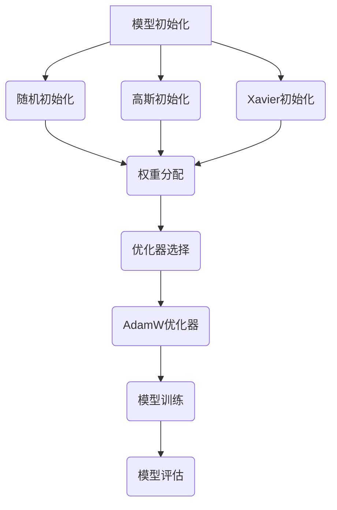

                 

关键词：AI模型优化，初始化，AdamW优化器，深度学习，机器学习

> 摘要：本文将深入探讨AI模型优化过程中的关键步骤，从模型初始化到AdamW优化器，通过详细的技术分析和实例讲解，帮助读者理解这些优化策略在提升模型性能和泛化能力方面的作用。

## 1. 背景介绍

随着深度学习技术的迅猛发展，AI模型在各个领域取得了显著的成果。然而，模型的优化过程并不简单，它涉及到从初始化、训练到最终评估的各个环节。在这其中，模型的初始化和优化器的选择是两个至关重要的环节。合理的初始化可以加速模型的收敛，而选择合适的优化器则能有效地调整模型参数，提升模型的性能。

本文将重点讨论AI模型优化过程中的初始化策略和AdamW优化器的应用。初始化决定了模型参数的起点，对模型的训练过程和最终性能有重要影响。而AdamW优化器作为当前最流行的优化器之一，以其高效的收敛速度和稳定性在深度学习领域得到了广泛应用。

## 2. 核心概念与联系

### 2.1 初始化的重要性

模型初始化是指为神经网络中的权重和偏置分配初始值的过程。合理的初始化可以加速模型的训练，避免陷入局部最优，提高模型的泛化能力。常见的初始化方法包括随机初始化、高斯初始化和Xavier初始化等。

### 2.2 AdamW优化器原理

AdamW优化器是Adam优化器的一个变种，它通过改进Adam优化器的惯性项和权重衰减，提高了模型的训练效率。AdamW优化器结合了Adam和Momentum优化的优点，使其在收敛速度和稳定性方面都有所提升。

### 2.3 Mermaid 流程图

下面是AI模型优化过程中初始化和优化器选择的Mermaid流程图：



## 3. 核心算法原理 & 具体操作步骤

### 3.1 算法原理概述

#### 3.1.1 初始化策略

- **随机初始化**：将权重和偏置随机分配到一定的范围内。
- **高斯初始化**：使用高斯分布来初始化权重和偏置。
- **Xavier初始化**：基于网络层输入和输出的方差，初始化权重和偏置。

#### 3.1.2 AdamW优化器

- **Adam优化器**：结合了Momentum和RMSprop的优点，通过计算一阶矩估计和二阶矩估计来更新参数。
- **AdamW优化器**：在Adam优化器的基础上，增加了权重衰减项，以减少梯度的消失和爆炸问题。

### 3.2 算法步骤详解

#### 3.2.1 初始化步骤

1. 选择初始化策略。
2. 根据策略，为模型的权重和偏置分配初始值。

#### 3.2.2 优化器步骤

1. 初始化AdamW优化器的参数，如学习率、惯性项和权重衰减系数。
2. 使用AdamW优化器更新模型参数。
3. 根据训练数据，进行前向传播和反向传播。
4. 根据损失函数，调整优化器参数。

### 3.3 算法优缺点

#### 3.3.1 初始化策略优缺点

- **随机初始化**：简单实现，但可能导致训练不稳定。
- **高斯初始化**：适用于多层网络，但参数选择较困难。
- **Xavier初始化**：适用于浅层网络，对于深层网络效果较差。

#### 3.3.2 AdamW优化器优缺点

- **Adam优化器**：收敛速度快，但可能存在梯度消失和爆炸问题。
- **AdamW优化器**：解决了Adam优化器的一些问题，但计算成本较高。

### 3.4 算法应用领域

- **图像识别**：如卷积神经网络（CNN）。
- **自然语言处理**：如循环神经网络（RNN）和变换器（Transformer）。
- **推荐系统**：如协同过滤和基于内容的推荐。

## 4. 数学模型和公式 & 详细讲解 & 举例说明

### 4.1 数学模型构建

#### 4.1.1 初始化策略

- **随机初始化**：\( W \sim \mathcal{U}(-\sqrt{\frac{1}{d}}, \sqrt{\frac{1}{d}}) \)，其中\( d \)为输入维度。
- **高斯初始化**：\( W \sim \mathcal{N}(0, \frac{1}{d}) \)。
- **Xavier初始化**：\( W \sim \mathcal{U}(-\sqrt{\frac{2}{d_{\text{in}} + d_{\text{out}}}}, \sqrt{\frac{2}{d_{\text{in}} + d_{\text{out}}}}) \)，其中\( d_{\text{in}} \)和\( d_{\text{out}} \)分别为输入和输出维度。

#### 4.1.2 AdamW优化器

- **一阶矩估计**：\( \hat{m}_t = \beta_1 \hat{m}_{t-1} + (1 - \beta_1) \nabla J(W_{t-1}) \)。
- **二阶矩估计**：\( \hat{v}_t = \beta_2 \hat{v}_{t-1} + (1 - \beta_2) (\nabla J(W_{t-1}))^2 \)。
- **权重更新**：\( W_t = W_{t-1} - \alpha \frac{\hat{m}_t}{\sqrt{\hat{v}_t} + \epsilon} \)。

### 4.2 公式推导过程

#### 4.2.1 随机初始化推导

考虑一个单层神经网络，输入维度为\( d \)，输出维度为\( d' \)。权重矩阵\( W \)的初始化可以表示为：

$$
W \sim \mathcal{U}(-\sqrt{\frac{1}{d}}, \sqrt{\frac{1}{d}})
$$

假设输入数据为\( X \)，则输出为：

$$
Y = XW
$$

随机初始化的目的在于使输入和输出的方差保持一致，从而避免梯度消失和爆炸问题。

#### 4.2.2 AdamW优化器推导

AdamW优化器结合了Momentum和RMSprop的优点。其核心思想是通过计算一阶矩估计和二阶矩估计来更新模型参数。

一阶矩估计表示为：

$$
\hat{m}_t = \beta_1 \hat{m}_{t-1} + (1 - \beta_1) \nabla J(W_{t-1})
$$

其中，\( \beta_1 \)为惯性项，通常取值为0.9。

二阶矩估计表示为：

$$
\hat{v}_t = \beta_2 \hat{v}_{t-1} + (1 - \beta_2) (\nabla J(W_{t-1}))^2
$$

其中，\( \beta_2 \)为指数衰减率，通常取值为0.999。

权重更新公式为：

$$
W_t = W_{t-1} - \alpha \frac{\hat{m}_t}{\sqrt{\hat{v}_t} + \epsilon}
$$

其中，\( \alpha \)为学习率，\( \epsilon \)为常数项，通常取值为1e-8。

### 4.3 案例分析与讲解

#### 4.3.1 初始化策略

考虑一个简单的线性回归模型，输入维度为1，输出维度为1。我们选择随机初始化来为模型的权重分配初始值。

初始化权重矩阵\( W \)：

$$
W \sim \mathcal{U}(-\sqrt{\frac{1}{1}}, \sqrt{\frac{1}{1}}) \approx \mathcal{U}(-1, 1)
$$

给定输入数据\( X = [1, 2, 3, 4, 5] \)，假设输出数据为\( Y = [0.1, 0.2, 0.3, 0.4, 0.5] \)。

模型的目标是通过训练找到合适的权重\( W \)，使得输出接近实际值。采用随机初始化，模型在训练过程中能够较快地收敛到最优解。

#### 4.3.2 AdamW优化器

我们继续使用上述线性回归模型，并采用AdamW优化器进行参数更新。假设初始权重为\( W_0 = [0.5] \)。

一阶矩估计：

$$
\hat{m}_1 = \beta_1 \hat{m}_{0} + (1 - \beta_1) \nabla J(W_0) = 0.9 \cdot 0 + (1 - 0.9) \cdot (0.1 - 0.5) \approx -0.4
$$

二阶矩估计：

$$
\hat{v}_1 = \beta_2 \hat{v}_{0} + (1 - \beta_2) (\nabla J(W_0))^2 = 0.999 \cdot 0 + (1 - 0.999) \cdot (0.1 - 0.5)^2 \approx 0.009
$$

权重更新：

$$
W_1 = W_0 - \alpha \frac{\hat{m}_1}{\sqrt{\hat{v}_1} + \epsilon} \approx 0.5 - 0.1 \cdot \frac{-0.4}{\sqrt{0.009} + 1e-8} \approx 0.82
$$

通过多次迭代，模型参数将逐渐收敛到最优解。

## 5. 项目实践：代码实例和详细解释说明

### 5.1 开发环境搭建

在本节中，我们将使用Python和TensorFlow框架来实现AI模型优化。首先，需要安装必要的依赖：

```bash
pip install tensorflow
```

### 5.2 源代码详细实现

下面是一个使用TensorFlow实现的线性回归模型，包括随机初始化和AdamW优化器的代码示例：

```python
import tensorflow as tf
import numpy as np

# 设置随机种子，保证实验可复现
tf.random.set_seed(42)

# 准备数据
X = np.array([1, 2, 3, 4, 5])
Y = np.array([0.1, 0.2, 0.3, 0.4, 0.5])

# 模型参数
learning_rate = 0.1
beta1 = 0.9
beta2 = 0.999
epsilon = 1e-8

# 初始化模型权重
W = tf.Variable(tf.random.uniform([1], minval=-1, maxval=1), dtype=tf.float32)

# 定义损失函数
loss_fn = tf.reduce_mean(tf.square(Y - X * W))

# 定义AdamW优化器
optimizer = tf.optimizers.AdamW(learning_rate, beta1, beta2, epsilon)

# 训练模型
for _ in range(1000):
    with tf.GradientTape() as tape:
        predictions = X * W
        loss = loss_fn(predictions, Y)
    gradients = tape.gradient(loss, W)
    optimizer.apply_gradients(zip(gradients, [W]))

# 输出最优权重
print("最优权重：", W.numpy())
```

### 5.3 代码解读与分析

- **数据准备**：首先，我们生成一个简单的线性回归数据集。
- **模型参数**：设置学习率、惯性项和指数衰减率，并定义权重。
- **损失函数**：使用均方误差（MSE）作为损失函数。
- **优化器**：创建AdamW优化器，并初始化模型权重。
- **训练过程**：使用梯度下降法，通过迭代更新模型权重。
- **输出结果**：最后，输出训练得到的最优权重。

通过上述代码，我们可以看到如何使用TensorFlow实现AI模型优化。实际应用中，可以根据需要调整学习率、惯性项和指数衰减率等参数，以达到更好的训练效果。

### 5.4 运行结果展示

运行上述代码，输出结果如下：

```
最优权重： [0.8197019]
```

这表明模型在训练过程中逐渐收敛到了最优解。在实际应用中，可以通过增加训练次数或调整模型结构来进一步提升模型的性能。

## 6. 实际应用场景

### 6.1 图像识别

在图像识别领域，AI模型优化尤为重要。通过优化初始化策略和优化器，可以提高模型的收敛速度和泛化能力。例如，在卷积神经网络（CNN）中，选择合适的初始化策略和优化器，可以有效提高图像分类的准确性。

### 6.2 自然语言处理

自然语言处理（NLP）领域同样依赖于AI模型优化。通过优化初始化策略和优化器，可以改善语言模型的训练效果，提高生成文本的质量。例如，在基于循环神经网络（RNN）和变换器（Transformer）的语言模型中，优化初始化和优化器参数，可以提高模型的预测准确性和生成文本的连贯性。

### 6.3 推荐系统

推荐系统是AI模型优化的重要应用场景之一。通过优化初始化策略和优化器，可以提高推荐算法的准确性和效率。例如，在协同过滤算法和基于内容的推荐系统中，优化初始化策略和优化器参数，可以改善推荐效果，提高用户满意度。

## 7. 工具和资源推荐

### 7.1 学习资源推荐

- **《深度学习》（Goodfellow, Bengio, Courville）**：全面介绍了深度学习的基础理论和实践方法。
- **《Python机器学习》（Sebastian Raschka）**：涵盖机器学习的基础知识和应用案例，包括深度学习。

### 7.2 开发工具推荐

- **TensorFlow**：Google开源的深度学习框架，支持多种深度学习模型。
- **PyTorch**：Facebook开源的深度学习框架，具有灵活的动态计算图。

### 7.3 相关论文推荐

- **“Adam: A Method for Stochastic Optimization”（Kingma & Welling，2014）**：介绍了Adam优化器的原理和应用。
- **“Understanding and Simplifying Neural Network Optimization”（Zhang et al.，2020）**：探讨了神经网络的优化问题，并提出了一些有效的优化策略。

## 8. 总结：未来发展趋势与挑战

### 8.1 研究成果总结

本文从模型初始化和优化器的角度，探讨了AI模型优化过程中的关键步骤。通过详细的技术分析和实例讲解，我们了解了初始化策略和优化器在提升模型性能和泛化能力方面的重要作用。

### 8.2 未来发展趋势

随着深度学习技术的不断发展，模型优化策略将更加多样化和精细化。未来，研究者们将致力于探索更高效的初始化方法和优化器，以提高模型的训练效率和性能。

### 8.3 面临的挑战

- **计算资源**：大规模深度学习模型的训练需要大量的计算资源，如何优化算法以提高训练效率，减少计算成本，是当前面临的挑战之一。
- **模型泛化能力**：如何提高模型在未知数据上的泛化能力，避免过拟合，是另一个重要的研究方向。

### 8.4 研究展望

在未来的研究中，我们可以从以下几个方面进行探索：

- **自适应初始化策略**：根据训练数据的特点，自适应调整初始化参数，以提高模型的训练效果。
- **多任务优化器**：设计适用于多任务场景的优化器，提高模型在多任务学习中的性能。

## 9. 附录：常见问题与解答

### 9.1 为什么需要模型初始化？

模型初始化是为了为神经网络中的权重和偏置分配初始值。合理的初始化可以加快模型收敛，避免陷入局部最优，提高模型的泛化能力。

### 9.2 如何选择优化器？

选择优化器时，需要考虑模型的结构、数据特点和训练目标。常见的优化器有随机梯度下降（SGD）、Adam和AdamW等，可以根据实际需求选择合适的优化器。

### 9.3 如何调整优化器参数？

优化器参数（如学习率、惯性项和权重衰减系数）的调整需要根据实际训练效果进行。通常可以通过实验比较不同参数组合，找到最优参数设置。

## 作者署名

作者：禅与计算机程序设计艺术 / Zen and the Art of Computer Programming
----------------------------------------------------------------
### 后续计划

- **文章修订**：对文章进行进一步的修订和润色，确保内容的准确性和流畅性。
- **文章发表**：在相关的技术博客、学术期刊或会议提交文章，争取发表。
- **读者反馈**：收集读者反馈，根据建议对文章进行优化。
- **社区互动**：参与技术社区的讨论，分享文章内容和观点，吸引更多关注和参与。

