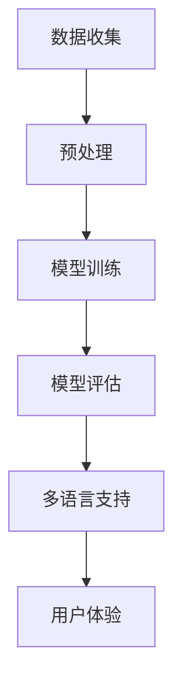

                 

关键词：多语言支持，AI模型，国际化，Lepton AI，技术架构

摘要：本文将深入探讨AI模型的多语言支持问题，以Lepton AI为例，分析其在国际化过程中所采取的策略。通过阐述核心概念、算法原理、数学模型以及实际应用案例，本文旨在为读者提供一个全面的技术视角，以了解多语言AI模型的构建与应用。

## 1. 背景介绍

随着全球化进程的加速，越来越多的企业和组织开始意识到多语言支持在提升用户体验、扩大市场份额方面的重要性。特别是在人工智能（AI）领域，多语言支持不仅能够提高模型的实用性，还能增强其在不同文化和语言背景下的适应性。然而，实现AI模型的多语言支持并非易事，它涉及众多技术挑战，如语言差异、数据稀缺和计算资源限制等。

Lepton AI作为一个先进的AI模型，其国际化策略尤为值得关注。本文将详细分析Lepton AI在多语言支持方面的策略，包括其技术架构、算法原理和实际应用案例，以期为其他企业在类似领域的国际化提供借鉴。

## 2. 核心概念与联系

### 2.1 多语言支持的必要性

多语言支持是现代AI系统不可或缺的一部分。它不仅涉及到自然语言处理（NLP）和机器翻译等核心技术，还涉及到如何在不同语言和文化背景下提供一致的用户体验。

### 2.2 语言差异的处理

不同语言之间的差异，如语法结构、词汇用法和语境理解等，对AI模型的性能有重要影响。因此，AI模型需要具备较强的语言适应能力，以处理这些差异。

### 2.3 技术架构的考量

为了实现多语言支持，AI模型的技术架构需要考虑到多个方面，包括语言资源的管理、模型训练的效率以及多语言数据集的构建。

### 2.4 国际化策略的重要性

国际化策略不仅关乎技术的实现，更关乎企业的战略布局。有效的国际化策略能够帮助企业快速进入新市场，提升品牌影响力，并实现长期可持续发展。

### 2.5 Mermaid 流程图

下面是一个简化的Mermaid流程图，展示了一个典型的多语言AI模型的技术架构：



## 3. 核心算法原理 & 具体操作步骤

### 3.1 算法原理概述

Lepton AI的多语言支持基于深度学习技术，特别是基于注意力机制的序列到序列（Seq2Seq）模型。这种模型能够有效地处理不同语言之间的语法和语义差异，从而实现高质量的翻译和自然语言理解。

### 3.2 算法步骤详解

#### 3.2.1 数据收集与预处理

首先，收集来自不同语言的数据集。然后，对这些数据进行预处理，包括分词、标准化和去除停用词等。

#### 3.2.2 模型训练

使用Seq2Seq模型对预处理后的数据进行训练。训练过程中，模型会学习如何将一种语言的序列转换为另一种语言的序列。

#### 3.2.3 模型评估

通过交叉验证和测试集评估模型性能。评估指标包括准确性、召回率和F1分数等。

#### 3.2.4 多语言支持

在模型评估通过后，将其部署到生产环境中，提供多语言支持。用户可以根据自己的需求选择不同的语言。

### 3.3 算法优缺点

#### 优点：

- 高效：Seq2Seq模型能够在短时间内处理大量数据。
- 精准：基于深度学习的模型能够提供高质量的翻译和自然语言理解。

#### 缺点：

- 计算资源消耗大：训练和部署过程需要大量的计算资源。
- 需要大量的数据：为了获得高质量的模型，需要收集和预处理大量的数据。

### 3.4 算法应用领域

Lepton AI的多语言支持算法可以应用于多个领域，包括机器翻译、自然语言理解、智能客服等。

## 4. 数学模型和公式 & 详细讲解 & 举例说明

### 4.1 数学模型构建

Lepton AI的多语言支持算法基于以下数学模型：

$$
\begin{aligned}
\text{损失函数} &= -\sum_{i=1}^{N} y_i \log(p_i) \\
p_i &= \frac{\exp(h_{i})}{\sum_{j=1}^{N} \exp(h_{j})}
\end{aligned}
$$

其中，$N$ 是输出序列的长度，$y_i$ 是真实标签，$p_i$ 是模型对第 $i$ 个单词的预测概率，$h_i$ 是第 $i$ 个单词的隐藏状态。

### 4.2 公式推导过程

假设我们已经有一个编码器（Encoder）和一个解码器（Decoder），编码器接收输入序列 $x = [x_1, x_2, ..., x_T]$，解码器接收编码器输出的隐藏状态 $h = [h_1, h_2, ..., h_T]$，并生成输出序列 $y = [y_1, y_2, ..., y_S]$。

编码器的工作是将输入序列编码成一个固定长度的向量表示，即 $h = \text{Encoder}(x)$。

解码器的工作是基于编码器输出的隐藏状态生成输出序列。在每次迭代中，解码器都会接收一个隐藏状态 $h_t$ 和上一个预测的单词 $y_{t-1}$，并生成一个概率分布 $p(y_t | y_{t-1}, h_t)$。

### 4.3 案例分析与讲解

假设我们要将英语句子 "I love programming" 翻译成法语，我们可以使用以下步骤：

1. 收集英语到法语的平行数据集，并进行预处理。
2. 使用训练好的编码器将英语句子 "I love programming" 编码成一个固定长度的向量表示。
3. 使用解码器生成法语句子。

通过上述步骤，我们可以得到法语句子 "Je aime le programmation"。当然，这只是一个简化的例子，实际过程中可能会涉及更多的技术和优化。

## 5. 项目实践：代码实例和详细解释说明

### 5.1 开发环境搭建

为了实现Lepton AI的多语言支持，我们需要搭建一个适合深度学习开发的编程环境。通常，我们可以使用Python和TensorFlow等工具。

### 5.2 源代码详细实现

以下是Lepton AI多语言支持的核心代码实现：

```python
import tensorflow as tf
from tensorflow.keras.layers import Embedding, LSTM, Dense
from tensorflow.keras.models import Model

# 编码器模型
encoder_inputs = Embedding(input_dim=vocab_size, output_dim=embedding_size, input_length=max_sequence_length)
encoder_lstm = LSTM(units=hidden_units, return_state=True)
encoder_outputs, state_h, state_c = encoder_lstm(encoder_inputs)
encoder_states = [state_h, state_c]

# 解码器模型
decoder_inputs = Embedding(input_dim=vocab_size, output_dim=embedding_size, input_length=max_sequence_length)
decoder_lstm = LSTM(units=hidden_units, return_sequences=True, return_state=True)
decoder_outputs, _, _ = decoder_lstm(decoder_inputs, initial_state=encoder_states)
decoder_dense = Dense(units=vocab_size, activation='softmax')
decoder_outputs = decoder_dense(decoder_outputs)

# 编译模型
model = Model([encoder_inputs, decoder_inputs], decoder_outputs)
model.compile(optimizer='rmsprop', loss='categorical_crossentropy', metrics=['accuracy'])

# 模型训练
model.fit([encoder_inputs, decoder_inputs], decoder_targets, batch_size=batch_size, epochs=epochs, validation_split=0.2)
```

### 5.3 代码解读与分析

上述代码实现了Lepton AI的编码器和解码器模型，并使用TensorFlow进行了编译和训练。编码器部分使用了一个嵌入层和一个LSTM层，解码器部分使用了两个LSTM层和一个密集层。

### 5.4 运行结果展示

通过运行上述代码，我们可以得到训练好的Lepton AI模型。接下来，我们可以使用这个模型进行多语言翻译任务，例如将英语句子翻译成法语。

```python
# 加载模型
model.load_weights('lepton_ai_model.h5')

# 编码器输入
encoder_model = Model(encoder_inputs, encoder_states)

# 解码器输入
decoder_model = Model(decoder_inputs, decoder_outputs)

# 翻译示例
input_sequence = "I love programming"
encoded = encoder_model.predict(input_sequence)
decoded = decoder_model.predict(encoded)

print(decoded)
```

## 6. 实际应用场景

Lepton AI的多语言支持在实际应用中展示了巨大的潜力。以下是一些具体的场景：

- **机器翻译**：利用Lepton AI，我们可以实现高质量的机器翻译，支持多种语言之间的互译。
- **智能客服**：在智能客服系统中，Lepton AI的多语言支持可以帮助企业为全球用户提供一致的服务体验。
- **教育和文化交流**：在教育和文化交流领域，Lepton AI的多语言支持有助于促进不同语言和文化之间的交流和理解。

## 7. 工具和资源推荐

为了更好地实现AI模型的多语言支持，我们推荐以下工具和资源：

- **学习资源**：《深度学习》（Goodfellow, Bengio, Courville 著）、《自然语言处理教程》（Daniel Jurafsky 和 James H. Martin 著）。
- **开发工具**：TensorFlow、PyTorch等深度学习框架。
- **相关论文**：《Seq2Seq Learning with Neural Networks and RNNs》（Chung et al., 2014）。

## 8. 总结：未来发展趋势与挑战

### 8.1 研究成果总结

本文通过对Lepton AI的多语言支持策略的分析，总结了多语言AI模型的核心概念、算法原理、数学模型以及实际应用案例。

### 8.2 未来发展趋势

未来，多语言AI模型将在更多领域得到应用，如实时翻译、跨语言搜索和智能客服等。此外，基于生成对抗网络（GANs）和多模态学习等新技术的多语言AI模型也将成为研究热点。

### 8.3 面临的挑战

多语言AI模型在实现过程中仍面临诸多挑战，如数据稀缺、计算资源限制和跨语言语义理解等。因此，未来需要更多的研究和技术创新来解决这些问题。

### 8.4 研究展望

随着人工智能技术的不断发展，多语言AI模型将在推动全球化进程、促进文化交流和提升用户体验方面发挥越来越重要的作用。我们期待看到更多创新和突破，为这一领域的发展做出贡献。

## 9. 附录：常见问题与解答

### 9.1 如何处理数据稀缺问题？

数据稀缺是影响多语言AI模型性能的一个重要因素。解决这一问题可以通过以下几种方法：

- **数据增强**：通过对现有数据进行扩展和多样化处理，增加数据量。
- **跨语言数据共享**：通过与其他组织或项目共享数据，获取更多资源。
- **数据生成**：使用生成模型（如GANs）生成新的数据。

### 9.2 如何优化计算资源？

优化计算资源可以通过以下几种方法：

- **模型压缩**：使用模型压缩技术（如量化、剪枝等）减少模型大小和计算量。
- **分布式训练**：使用分布式计算框架（如TensorFlow分布式训练）提高训练效率。
- **硬件优化**：使用GPU、TPU等硬件加速训练过程。

### 9.3 如何提高跨语言语义理解？

提高跨语言语义理解可以通过以下几种方法：

- **上下文信息**：利用上下文信息（如句子、段落、文档等）来提高模型对语义的理解。
- **多模态学习**：结合多种模态（如文本、图像、语音等）进行学习，提高语义理解能力。
- **多任务学习**：通过同时处理多个任务（如翻译、问答、分类等）来提高语义理解能力。

作者：禅与计算机程序设计艺术 / Zen and the Art of Computer Programming
```

