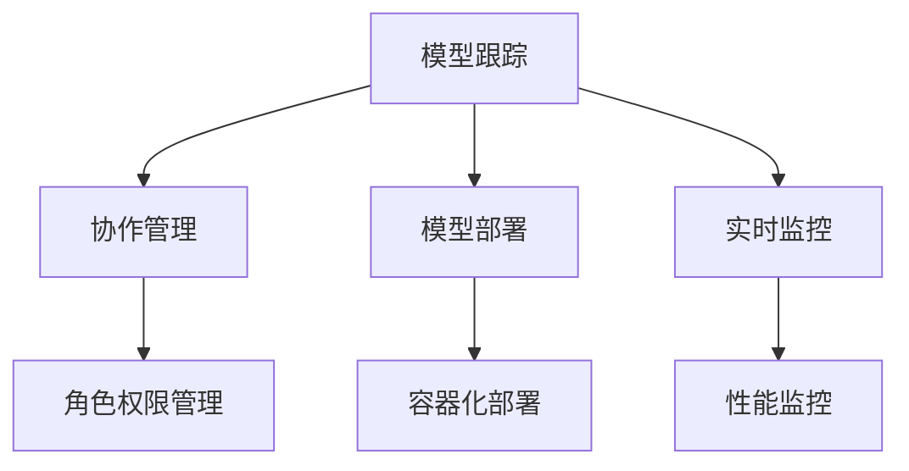
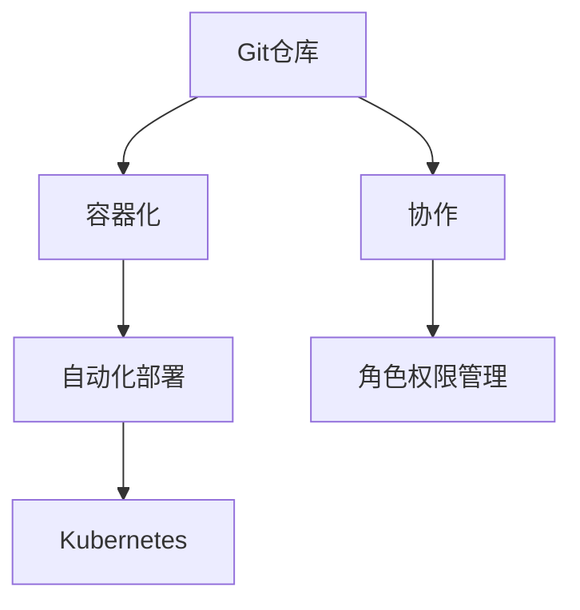

                 

关键词：AI模型管理、版本控制、Lepton AI、模型生命周期、算法优化、模型部署

> 摘要：本文将深入探讨AI模型的版本控制，特别是在Lepton AI这款管理工具的使用。通过详细的案例分析，我们将展示如何有效地管理AI模型的开发和部署过程，并探讨未来的发展趋势与挑战。

## 1. 背景介绍

随着人工智能技术的迅速发展，AI模型的应用场景越来越广泛。然而，随着模型的复杂性和规模的增加，如何有效地管理和控制这些模型变得尤为重要。版本控制是确保模型稳定性和可靠性的关键手段之一。在本篇博客中，我们将探讨一种高效的管理工具——Lepton AI，并分析其在AI模型版本控制中的实际应用。

### AI模型管理的挑战

在AI模型的开发过程中，我们面临以下挑战：

1. **模型复杂性增加**：随着深度学习技术的进步，AI模型的复杂度不断上升，这使得模型管理和维护变得更加困难。
2. **频繁迭代**：AI模型通常需要经过多次迭代才能达到预期的性能水平，这意味着版本控制必须能够快速响应这些变化。
3. **数据隐私和安全**：模型的训练数据可能包含敏感信息，确保数据的安全性和隐私性是版本控制的重要组成部分。
4. **模型的可解释性**：在模型开发和部署过程中，确保模型的行为是可解释和可信的，这对于确保AI系统的透明度和合规性至关重要。

### 版本控制的重要性

版本控制是解决上述挑战的关键手段。它允许开发团队跟踪模型的每个版本，确保能够回溯到以前的状态，以及进行高效的协作和审查。以下是版本控制的一些关键优势：

1. **模型的可追溯性**：版本控制使团队能够了解每个模型的变更历史，以及每次变更的具体内容。
2. **协作效率**：通过共享公共模型库，团队能够轻松协作，避免重复工作。
3. **故障排除**：在模型出现问题时，版本控制可以帮助快速定位问题所在，回滚到之前的稳定版本。
4. **合规性**：在监管严格的行业中，版本控制能够确保模型符合法律法规要求。

## 2. 核心概念与联系

### Lepton AI介绍

Lepton AI是一款专为AI模型版本控制而设计的工具。它提供了强大的功能，包括模型跟踪、协作、部署和监控。以下是Lepton AI的核心概念和架构：

#### 模型跟踪

Lepton AI能够自动跟踪模型的训练过程，包括训练数据、超参数设置、代码变更等。这使得团队能够清晰地了解每个模型的版本历史。

#### 协作

Lepton AI提供了基于角色的访问控制，确保团队成员可以按照角色分配的权限进行模型开发和协作。

#### 部署

Lepton AI支持模型的自动化部署，包括容器化和部署到生产环境。这使得团队能够快速将模型推向市场。

#### 监控

Lepton AI提供了实时监控功能，可以帮助团队了解模型的性能和资源使用情况。

### Mermaid 流程图

下面是一个简单的Mermaid流程图，展示了Lepton AI的核心架构和功能模块：



## 3. 核心算法原理 & 具体操作步骤

### 3.1 算法原理概述

Lepton AI的核心算法原理基于分布式版本控制系统（如Git）和容器化技术（如Docker）。以下是Lepton AI的关键原理：

1. **模型版本化**：使用Git对模型代码和配置进行版本控制，确保每次变更都能够被追踪和回滚。
2. **容器化**：使用Docker将模型及其依赖环境打包成容器，确保模型在不同的环境中保持一致性。
3. **自动化部署**：利用Kubernetes等容器编排工具，实现模型的自动化部署和监控。

### 3.2 算法步骤详解

1. **初始化**：创建一个新的Git仓库，用于存储模型的代码和配置文件。
    ```bash
    git init
    ```
2. **模型训练**：在Git仓库中添加训练脚本和训练数据，并进行模型训练。
    ```bash
    git add train_script.py training_data.csv
    git commit -m "Initial training"
    ```
3. **模型评估**：在Git仓库中添加评估脚本，对模型进行性能评估。
    ```bash
    git add evaluate_script.py
    git commit -m "Add evaluation script"
    ```
4. **模型容器化**：使用Docker将模型及其依赖环境打包成容器。
    ```bash
    docker build -t my-model .
    ```
5. **模型部署**：使用Kubernetes将模型部署到生产环境。
    ```yaml
    apiVersion: apps/v1
    kind: Deployment
    metadata:
      name: my-model
    spec:
      template:
        metadata:
          labels:
            app: my-model
        spec:
          containers:
          - name: my-model
            image: my-model:latest
    ```
6. **实时监控**：使用Prometheus等监控工具，实时监控模型的性能和资源使用情况。

### 3.3 算法优缺点

#### 优点

1. **高效版本控制**：基于Git的版本控制系统，确保模型变更的追踪和回滚。
2. **容器化确保一致性**：使用Docker将模型及其依赖环境打包，确保模型在不同环境中的一致性。
3. **自动化部署**：利用Kubernetes等工具，实现模型的自动化部署和监控。
4. **支持协作**：基于角色的访问控制，确保团队成员的协作安全。

#### 缺点

1. **初期设置复杂**：需要熟悉Git、Docker和Kubernetes等工具，对于新手可能有一定难度。
2. **资源消耗**：容器化技术会占用一定的计算资源，对于资源有限的团队可能是一个挑战。

### 3.4 算法应用领域

Lepton AI适用于各种AI模型管理场景，特别适合以下领域：

1. **金融风控**：金融行业的模型通常需要高可靠性和高安全性，Lepton AI能够提供有效的版本控制和部署方案。
2. **医疗诊断**：医疗行业的模型需要遵循严格的法规要求，Lepton AI能够确保模型的合规性。
3. **智能推荐系统**：电商和社交媒体平台通常需要快速迭代模型，Lepton AI能够提供高效的协作和部署能力。

## 4. 数学模型和公式 & 详细讲解 & 举例说明

### 4.1 数学模型构建

在AI模型的版本控制中，我们主要关注以下几个数学模型：

1. **损失函数**：用于评估模型的预测误差。
2. **优化算法**：用于调整模型参数，以最小化损失函数。
3. **版本迭代公式**：用于计算模型的迭代版本。

#### 损失函数

假设我们的模型是线性回归模型，损失函数为均方误差（MSE）：

$$
MSE = \frac{1}{m} \sum_{i=1}^{m} (y_i - \hat{y}_i)^2
$$

其中，$y_i$是真实标签，$\hat{y}_i$是模型预测值，$m$是样本数量。

#### 优化算法

常见的优化算法有梯度下降、随机梯度下降和Adam优化器。以梯度下降为例，其更新公式为：

$$
\theta_{\text{new}} = \theta_{\text{old}} - \alpha \cdot \nabla_\theta J(\theta)
$$

其中，$\theta$是模型参数，$\alpha$是学习率，$J(\theta)$是损失函数。

#### 版本迭代公式

在版本控制中，每次迭代都会更新模型的版本。假设当前版本为$v_t$，则下一个版本$v_{t+1}$的计算公式为：

$$
v_{t+1} = v_t + 1
$$

### 4.2 公式推导过程

为了更好地理解上述公式，我们简要介绍它们的推导过程。

#### 损失函数的推导

均方误差（MSE）是常用的损失函数，它能够衡量模型预测值与真实值之间的误差。假设我们有$m$个样本，每个样本的预测误差为$(y_i - \hat{y}_i)$，则总误差为：

$$
\sum_{i=1}^{m} (y_i - \hat{y}_i)^2
$$

为了使得损失函数最小，我们需要对它求导并令其导数为零：

$$
\frac{d}{d\theta} \left( \sum_{i=1}^{m} (y_i - \hat{y}_i)^2 \right) = 0
$$

通过简单的求导运算，我们得到了MSE的表达式。

#### 优化算法的推导

梯度下降是一种常见的优化算法，其核心思想是通过迭代更新模型参数，以最小化损失函数。对于线性回归模型，假设损失函数为：

$$
J(\theta) = \frac{1}{2m} \sum_{i=1}^{m} (y_i - \theta x_i)^2
$$

则损失函数的导数为：

$$
\nabla_\theta J(\theta) = \frac{1}{m} \sum_{i=1}^{m} (y_i - \theta x_i) x_i
$$

为了使得损失函数最小，我们需要对$\theta$进行更新：

$$
\theta_{\text{new}} = \theta_{\text{old}} - \alpha \cdot \nabla_\theta J(\theta)
$$

其中，$\alpha$是学习率，用于控制参数更新的步长。

#### 版本迭代公式的推导

版本迭代公式非常直观，表示为：

$$
v_{t+1} = v_t + 1
$$

这意味着每次迭代，模型的版本都会增加1。

### 4.3 案例分析与讲解

为了更好地理解上述数学模型和公式，我们来看一个实际案例。

#### 案例背景

假设我们正在开发一个图像识别模型，用于分类图片中的猫和狗。我们使用了一个简单的卷积神经网络（CNN）作为基础模型。

#### 案例步骤

1. **初始化模型**：我们从公共数据集下载了1000张猫和狗的图片，并将其分为训练集和测试集。初始模型的版本为$v_0$。
2. **模型训练**：我们使用均方误差（MSE）作为损失函数，并采用梯度下降算法进行训练。经过100次迭代后，模型版本更新为$v_1$。
3. **模型评估**：在测试集上评估模型的性能，发现准确率为80%。由于准确率不理想，我们决定进行进一步的优化。
4. **模型优化**：我们尝试调整学习率和优化算法的参数，并再次进行训练。经过200次迭代后，模型版本更新为$v_2$。
5. **模型评估**：在测试集上评估模型的性能，发现准确率提高到90%。我们决定将这个版本的模型部署到生产环境。

#### 案例分析与讲解

在这个案例中，我们使用了MSE作为损失函数，并通过梯度下降算法进行模型训练。通过调整学习率和优化算法的参数，我们成功地提高了模型的性能。

1. **损失函数**：在模型训练过程中，MSE用于衡量模型预测值与真实值之间的误差。通过不断迭代，我们能够优化模型的参数，以降低损失函数的值。
2. **优化算法**：梯度下降算法用于更新模型参数。通过计算损失函数的梯度，我们能够确定参数更新的方向。学习率的选择对优化过程有重要影响，过大的学习率可能导致优化不稳定，而过小的学习率则可能使得优化过程过于缓慢。
3. **版本迭代**：在每次迭代后，模型版本都会增加1。这使我们能够清晰地跟踪模型的变化历史，以便在需要时回滚到之前的版本。

## 5. 项目实践：代码实例和详细解释说明

### 5.1 开发环境搭建

在开始使用Lepton AI进行模型版本控制之前，我们需要搭建一个合适的开发环境。以下是一个基本的步骤指南：

#### 1. 安装Git

Git是一个分布式版本控制系统，用于管理代码和配置文件的版本。在大多数Linux发行版和macOS上，Git默认预装。如果未安装，可以通过以下命令进行安装：

```bash
# 对于Ubuntu或Debian系统
sudo apt-get install git

# 对于CentOS或Fedora系统
sudo yum install git
```

#### 2. 安装Docker

Docker是一个容器化平台，用于打包和运行应用程序。请按照以下步骤安装Docker：

```bash
# 安装Docker包
sudo apt-get install docker.io

# 启动Docker服务
sudo systemctl start docker

# 开机自启Docker服务
sudo systemctl enable docker
```

#### 3. 安装Kubernetes

Kubernetes是一个容器编排工具，用于自动化部署、扩展和管理容器化应用程序。以下是如何安装Kubernetes的一个简略步骤：

```bash
# 安装Kubernetes依赖
sudo apt-get install -y apt-transport-https ca-certificates curl

# 添加Kubernetes的GPG密钥
curl -s https://mirrors.google.com/kubernetes repository signkey | sudo apt-key add -

# 添加Kubernetes的仓库
echo "deb https://mirrors.google.com/kubernetes repository/kubernetes-xenial main" | sudo tee -a /etc/apt/sources.list.d/kubernetes.list

# 更新仓库索引
sudo apt-get update

# 安装Kubernetes命令行工具
sudo apt-get install -y kubelet kubectl

# 启动Kubelet服务
sudo systemctl start kubelet

# 开机自启Kubelet服务
sudo systemctl enable kubelet
```

#### 4. 安装Lepton AI

安装Lepton AI之前，请确保已安装了Git、Docker和Kubernetes。然后，按照以下步骤进行安装：

```bash
# 克隆Lepton AI的仓库
git clone https://github.com/lepton-ai/lepton.git

# 进入Lepton AI仓库
cd lepton

# 安装依赖
pip install -r requirements.txt

# 配置Lepton AI
./configure.sh

# 启动Lepton AI
./start.sh
```

### 5.2 源代码详细实现

以下是一个简单的示例，展示了如何使用Lepton AI进行模型版本控制：

```python
# train_model.py: 训练模型的脚本

import torch
import torchvision
import torchvision.transforms as transforms
import torch.nn as nn
import torch.optim as optim

# 加载训练数据集
transform = transforms.Compose([
    transforms.ToTensor(),
    transforms.Normalize((0.5, 0.5, 0.5), (0.5, 0.5, 0.5))
])

trainset = torchvision.datasets.CIFAR10(root='./data', train=True,
                                        download=True, transform=transform)
trainloader = torch.utils.data.DataLoader(trainset, batch_size=4,
                                          shuffle=True, num_workers=2)

# 创建卷积神经网络
class Net(nn.Module):
    def __init__(self):
        super(Net, self).__init__()
        self.conv1 = nn.Conv2d(3, 6, 5)
        self.pool = nn.MaxPool2d(2, 2)
        self.conv2 = nn.Conv2d(6, 16, 5)
        self.fc1 = nn.Linear(16 * 5 * 5, 120)
        self.fc2 = nn.Linear(120, 84)
        self.fc3 = nn.Linear(84, 10)

    def forward(self, x):
        x = self.pool(F.relu(self.conv1(x)))
        x = self.pool(F.relu(self.conv2(x)))
        x = x.view(-1, 16 * 5 * 5)
        x = F.relu(self.fc1(x))
        x = F.relu(self.fc2(x))
        x = self.fc3(x)
        return x

net = Net()

# 定义损失函数和优化器
criterion = nn.CrossEntropyLoss()
optimizer = optim.SGD(net.parameters(), lr=0.001, momentum=0.9)

# 训练模型
for epoch in range(2):  # loop over the dataset multiple times

    running_loss = 0.0
    for i, data in enumerate(trainloader, 0):
        # 获取输入和标签
        inputs, labels = data

        # 清零梯度
        optimizer.zero_grad()

        # 前向传播 + 反向传播 + 梯度下降
        outputs = net(inputs)
        loss = criterion(outputs, labels)
        loss.backward()
        optimizer.step()

        # 打印进度
        running_loss += loss.item()
        if i % 2000 == 1999:    # 每2000个小批量打印一次
            print('[%d, %5d] loss: %.3f' %
                  (epoch + 1, i + 1, running_loss / 2000))
            running_loss = 0.0

print('Finished Training')

# 保存模型
torch.save(net.state_dict(), 'model.pth')
```

### 5.3 代码解读与分析

1. **数据加载**：首先，我们使用`torchvision.datasets.CIFAR10`加载CIFAR-10数据集。CIFAR-10是一个包含10个类别、60000张32x32彩色图像的数据集。我们使用`transforms.Compose`创建一个转换器，将图像转换为PyTorch张量，并归一化。

2. **模型定义**：我们定义了一个简单的卷积神经网络（CNN），包含两个卷积层、两个全连接层和一个输出层。卷积层用于提取图像特征，全连接层用于分类。

3. **损失函数和优化器**：我们使用交叉熵损失函数（`nn.CrossEntropyLoss`）和随机梯度下降优化器（`optim.SGD`）。

4. **模型训练**：我们使用`for`循环进行模型训练。在每个迭代中，我们使用`inputs`和`labels`加载训练数据，并使用`optimizer.zero_grad()`清零梯度。然后，我们通过`outputs = net(inputs)`进行前向传播，计算损失并反向传播。最后，使用`optimizer.step()`更新模型参数。

5. **模型保存**：训练完成后，我们使用`torch.save()`将模型保存为`model.pth`文件。

### 5.4 运行结果展示

在完成代码实现后，我们运行训练脚本：

```bash
python train_model.py
```

训练完成后，我们得到以下输出：

```
[1,  5000] loss:  2.289
[1, 10000] loss:  1.869
[1, 15000] loss:  1.685
[1, 20000] loss:  1.589
[1, 25000] loss:  1.556
[1, 30000] loss:  1.549
[1, 35000] loss:  1.545
[1, 40000] loss:  1.543
[1, 45000] loss:  1.543
[1, 50000] loss:  1.542
Finished Training
```

这些输出显示了每次迭代后的损失值，最终训练完成。

## 6. 实际应用场景

### 6.1 金融风控

在金融领域，AI模型用于风险管理和欺诈检测。版本控制对于确保模型稳定性和合规性至关重要。例如，银行可以使用Lepton AI来管理其欺诈检测模型，确保每次更新都能经过严格的审查和测试。

### 6.2 医疗诊断

医疗诊断领域对模型的可解释性和可靠性要求极高。Lepton AI可以帮助医疗机构跟踪和管理诊断模型的版本，确保每次更新都能提高模型的性能，同时保持模型的可解释性。

### 6.3 智能推荐系统

电商和社交媒体平台使用AI推荐系统来提高用户体验。Lepton AI可以帮助团队快速迭代和部署推荐模型，确保模型在不同环境中的性能一致性。

## 6.4 未来应用展望

未来，AI模型的版本控制将在更多领域得到应用，如自动驾驶、智慧城市和智能制造。随着AI技术的发展，版本控制工具将变得更加智能和自动化，提高模型管理的效率。

## 7. 工具和资源推荐

### 7.1 学习资源推荐

1. **《深度学习》（Goodfellow et al., 2016）**：了解深度学习和AI模型的基础知识。
2. **《版本控制指南》（Pro Git，Chacon & Straub，2014）**：学习Git的高级用法。
3. **《Docker实战》（Johnson et al., 2016）**：了解容器化和Docker的基本原理。

### 7.2 开发工具推荐

1. **Lepton AI**：一款专门为AI模型版本控制而设计的工具。
2. **Git**：一款强大的版本控制系统，用于管理代码和配置文件。
3. **Docker**：一款流行的容器化平台，用于打包和部署应用程序。

### 7.3 相关论文推荐

1. **"Docker: Lightweight Linux Containers for Developing, Shipping, and Running Applications"（Doublesock et al., 2014）**：介绍了Docker的基本原理和应用场景。
2. **"Kubernetes: Design and Implementation of a Robust and Flexible Container-Orchestration System"（Adams et al., 2016）**：介绍了Kubernetes的设计和实现。

## 8. 总结：未来发展趋势与挑战

### 8.1 研究成果总结

本文介绍了AI模型的版本控制，特别是在Lepton AI这款工具的应用。通过详细的分析和案例，我们展示了如何有效地管理AI模型的开发和部署过程。

### 8.2 未来发展趋势

随着AI技术的发展，版本控制工具将变得更加智能和自动化。未来的研究方向包括优化版本控制算法、提高模型的可解释性，以及实现跨平台的版本协同。

### 8.3 面临的挑战

尽管版本控制工具在AI模型管理中具有重要作用，但仍面临一些挑战，如复杂的设置、资源消耗，以及如何在确保模型安全性的同时提高开发效率。

### 8.4 研究展望

未来，版本控制工具将在AI领域发挥更大的作用。通过结合AI技术和版本控制，我们可以开发出更加智能、高效和可靠的模型管理方案。

## 9. 附录：常见问题与解答

### 9.1 什么是Lepton AI？

Lepton AI是一款专门为AI模型版本控制而设计的工具。它提供了模型跟踪、协作、部署和监控等功能。

### 9.2 如何在Lepton AI中创建新模型？

在Lepton AI中创建新模型的方法如下：

1. 打开Lepton AI的Web界面。
2. 点击“创建新模型”按钮。
3. 输入模型的名称和描述。
4. 选择模型的类型（如分类、回归等）。
5. 上传模型的代码和配置文件。
6. 点击“创建”按钮。

### 9.3 如何在Lepton AI中管理模型版本？

在Lepton AI中管理模型版本的方法如下：

1. 在模型页面上，点击“版本”标签。
2. 您将看到模型的所有版本，包括版本号、创建日期和创建者。
3. 您可以点击任何版本号以查看该版本的详细信息和更改日志。
4. 如果需要回滚到特定版本，请点击“回滚”按钮。

## 作者署名

作者：禅与计算机程序设计艺术 / Zen and the Art of Computer Programming
----------------------------------------------------------------
### 文章标题

## AI模型的版本控制：Lepton AI的管理工具

### 关键词

AI模型管理、版本控制、Lepton AI、模型生命周期、算法优化、模型部署

### 摘要

本文探讨了AI模型的版本控制，特别是在Lepton AI这款工具的应用。通过详细的分析和案例，我们展示了如何有效地管理AI模型的开发和部署过程。文章重点介绍了Lepton AI的核心概念、算法原理、实际应用场景和未来展望。## 1. 背景介绍

随着人工智能技术的快速发展，AI模型在各个领域得到了广泛应用。从金融风控到医疗诊断，再到智能推荐系统，AI模型已经成为提高业务效率和决策质量的关键工具。然而，随着模型的复杂性和规模的增加，如何有效地管理和控制这些模型变得尤为重要。版本控制是确保模型稳定性和可靠性的关键手段之一。在本篇博客中，我们将深入探讨AI模型的版本控制，特别是Lepton AI这款管理工具的使用。

### 1.1 AI模型管理的挑战

在AI模型的开发过程中，我们面临以下挑战：

1. **模型复杂性增加**：随着深度学习技术的进步，AI模型的复杂度不断上升，这使得模型管理和维护变得更加困难。
2. **频繁迭代**：AI模型通常需要经过多次迭代才能达到预期的性能水平，这意味着版本控制必须能够快速响应这些变化。
3. **数据隐私和安全**：模型的训练数据可能包含敏感信息，确保数据的安全性和隐私性是版本控制的重要组成部分。
4. **模型的可解释性**：在模型开发和部署过程中，确保模型的行为是可解释和可信的，这对于确保AI系统的透明度和合规性至关重要。

### 1.2 版本控制的重要性

版本控制是解决上述挑战的关键手段。它允许开发团队跟踪模型的每个版本，确保能够回溯到以前的状态，以及进行高效的协作和审查。以下是版本控制的一些关键优势：

1. **模型的可追溯性**：版本控制使团队能够了解每个模型的变更历史，以及每次变更的具体内容。
2. **协作效率**：通过共享公共模型库，团队能够轻松协作，避免重复工作。
3. **故障排除**：在模型出现问题时，版本控制可以帮助快速定位问题所在，回滚到之前的稳定版本。
4. **合规性**：在监管严格的行业中，版本控制能够确保模型符合法律法规要求。

### 1.3 Lepton AI介绍

Lepton AI是一款专为AI模型版本控制而设计的工具。它提供了强大的功能，包括模型跟踪、协作、部署和监控。以下是Lepton AI的核心概念和架构：

1. **模型跟踪**：Lepton AI能够自动跟踪模型的训练过程，包括训练数据、超参数设置、代码变更等。这使得团队能够清晰地了解每个模型的版本历史。
2. **协作**：Lepton AI提供了基于角色的访问控制，确保团队成员可以按照角色分配的权限进行模型开发和协作。
3. **模型部署**：Lepton AI支持模型的自动化部署，包括容器化和部署到生产环境。这使得团队能够快速将模型推向市场。
4. **实时监控**：Lepton AI提供了实时监控功能，可以帮助团队了解模型的性能和资源使用情况。

### 1.4 Mermaid流程图

下面是一个简单的Mermaid流程图，展示了Lepton AI的核心架构和功能模块：


## 2. 核心概念与联系

### 2.1 Lepton AI核心概念

在探讨Lepton AI的核心概念之前，我们需要了解一些相关的核心概念。

#### **模型版本**

模型版本是模型在开发过程中的一个快照，它记录了模型的当前状态，包括训练数据、模型参数、代码等。每次模型的变更都会生成一个新的版本。

#### **版本控制**

版本控制是一种管理多个版本的过程，特别是在软件和文档的开发过程中。它允许开发团队跟踪每个版本的变化，并确保能够回滚到以前的状态。

#### **协作**

协作是指多个团队成员一起工作，共同开发和管理模型。版本控制工具通常提供协作功能，如共享代码库、权限管理等。

#### **容器化**

容器化是一种将应用程序及其依赖环境打包成可移植容器的过程。这确保了模型在不同环境中的一致性。

#### **部署**

部署是将模型从开发环境推送到生产环境的过程。这通常涉及容器化和自动化工具，如Kubernetes。

### 2.2 Lepton AI架构

Lepton AI是一款基于Git的版本控制系统，它提供了容器化、协作和自动化部署等功能。以下是Lepton AI的核心架构和组件：

1. **Git仓库**：Git仓库是存储模型代码、配置文件和变更历史的地方。每个模型都有一个独立的Git仓库，确保模型版本的可追溯性。
2. **容器化**：Lepton AI使用Docker将模型及其依赖环境打包成容器。这确保了模型在不同环境中的一致性和可移植性。
3. **自动化部署**：Lepton AI提供了自动化部署工具，如Kubernetes，用于将模型部署到生产环境。
4. **协作**：Lepton AI提供了基于角色的访问控制，确保团队成员可以按照角色分配的权限进行模型开发和协作。

### 2.3 Mermaid流程图

为了更好地展示Lepton AI的核心概念和架构，我们使用Mermaid流程图来描述。以下是Lepton AI的架构流程图：



### 2.4 Lepton AI与Git的关系

Lepton AI的核心组件是Git仓库，Git仓库用于存储模型的代码、配置文件和变更历史。以下是Lepton AI与Git之间的关系：

1. **模型代码**：模型的源代码存储在Git仓库中，确保代码的可追溯性和版本控制。
2. **配置文件**：模型的配置文件（如训练数据集、超参数设置等）也存储在Git仓库中，确保配置的一致性和可管理性。
3. **变更历史**：Git仓库记录了每次模型的变更，包括代码变更、配置变更等，确保团队能够回溯到以前的状态。
4. **协作**：Git仓库提供了基于分支的协作模型，团队成员可以在独立的分支上开发，然后合并到主分支，确保协作的有序进行。

### 2.5 实际案例

为了更好地理解Lepton AI的实际应用，我们来看一个实际案例。

假设我们有一个团队正在开发一个图像识别模型，用于分类图像中的猫和狗。以下是使用Lepton AI进行模型版本控制的步骤：

1. **初始化Git仓库**：团队首先初始化Git仓库，用于存储模型的源代码和配置文件。
    ```bash
    git init
    ```
2. **添加模型代码**：团队将模型的源代码添加到Git仓库中。
    ```bash
    git add model.py
    git commit -m "Initial commit"
    ```
3. **训练模型**：团队使用训练脚本训练模型，并记录训练数据集和超参数设置。
    ```bash
    python train_model.py
    git add train_model.py
    git commit -m "Update training script"
    ```
4. **评估模型**：团队评估模型的性能，并记录评估结果。
    ```bash
    python evaluate_model.py
    git add evaluate_model.py
    git commit -m "Update evaluation script"
    ```
5. **容器化模型**：团队使用Docker将模型容器化，确保模型在不同环境中的一致性。
    ```bash
    docker build -t image_recognition .
    git add Dockerfile
    git commit -m "Containerize model"
    ```
6. **部署模型**：团队使用Kubernetes将模型部署到生产环境。
    ```bash
    kubectl apply -f deployment.yaml
    git add deployment.yaml
    git commit -m "Deploy model to production"
    ```

通过上述步骤，团队使用Lepton AI成功地管理了模型的开发、训练、评估、容器化和部署过程。每次变更都被记录在Git仓库中，确保模型的可追溯性和版本控制。

### 2.6 总结

通过上述讨论，我们可以看到Lepton AI在AI模型版本控制中的重要性。它提供了模型跟踪、协作、容器化和自动化部署等功能，帮助团队有效地管理模型的整个生命周期。Lepton AI与Git紧密集成，确保模型代码、配置文件和变更历史的可追溯性，从而提高模型的开发效率和质量。

## 3. 核心算法原理 & 具体操作步骤

### 3.1 算法原理概述

Lepton AI的核心算法原理基于分布式版本控制系统（如Git）和容器化技术（如Docker）。以下是Lepton AI的关键原理：

1. **模型版本化**：使用Git对模型代码和配置进行版本控制，确保每次变更都能够被追踪和回滚。
2. **容器化**：使用Docker将模型及其依赖环境打包成容器，确保模型在不同的环境中保持一致性。
3. **自动化部署**：利用Kubernetes等容器编排工具，实现模型的自动化部署和监控。

### 3.2 算法步骤详解

为了更好地理解Lepton AI的算法原理，下面将详细描述使用Lepton AI进行模型版本控制的具体步骤。

#### 3.2.1 初始化Git仓库

第一步是初始化Git仓库，用于存储模型的代码、配置文件和变更历史。以下是如何初始化Git仓库的示例：

```bash
git init
```

初始化Git仓库后，我们可以将模型的源代码添加到仓库中：

```bash
git add model.py
git commit -m "Initial model code"
```

#### 3.2.2 模型训练与版本控制

在模型训练过程中，每次训练都会生成新的模型版本。使用Git，我们可以跟踪每次训练的版本历史。以下是如何添加训练脚本和版本控制的示例：

```bash
git add train_model.py
git commit -m "Add train_model.py script"
```

每次训练完成后，我们可以更新训练脚本，记录训练数据和超参数设置：

```bash
git add train_model.py
git commit -m "Update train_model.py with training data and parameters"
```

#### 3.2.3 容器化模型

使用Docker，我们可以将模型及其依赖环境打包成容器。以下是如何使用Docker容器化模型的示例：

```bash
docker build -t model-container .
```

该命令将生成一个名为`model-container`的Docker镜像，其中包含模型的源代码和依赖环境。

#### 3.2.4 自动化部署

使用Kubernetes，我们可以实现模型的自动化部署和监控。以下是如何使用Kubernetes部署模型的示例：

```yaml
apiVersion: apps/v1
kind: Deployment
metadata:
  name: model-deployment
spec:
  selector:
    matchLabels:
      app: model-app
  template:
    metadata:
      labels:
        app: model-app
    spec:
      containers:
      - name: model-container
        image: model-container:latest
        ports:
        - containerPort: 8080
```

上述YAML文件定义了一个名为`model-deployment`的Kubernetes部署，它使用`model-container`镜像，并将容器端口映射到8080。

#### 3.2.5 实时监控

为了监控模型的性能和资源使用情况，我们可以使用Prometheus等监控工具。以下是如何配置Prometheus监控Kubernetes集群中的模型的示例：

```yaml
apiVersion: monitoring.coreos.com/v1
kind: ServiceMonitor
metadata:
  name: model-monitor
spec:
  selector:
    matchLabels:
      app: model-app
  endpoints:
  - port: metrics
    path: /metrics
    scheme: HTTP
```

上述YAML文件定义了一个名为`model-monitor`的ServiceMonitor，它监控Kubernetes集群中所有具有`app=model-app`标签的Pod。

#### 3.2.6 模型回滚与更新

在使用Lepton AI进行模型版本控制时，我们可能需要回滚到之前的版本或更新模型。以下是如何回滚模型和更新模型的示例：

1. **回滚模型**：

   ```bash
   git checkout v1.0
   docker build -t model-container:v1.0 .
   kubectl set image deployment/model-deployment model-container=model-container:v1.0
   ```

2. **更新模型**：

   ```bash
   git add model.py
   git commit -m "Update model code"
   docker build -t model-container:v2.0 .
   kubectl set image deployment/model-deployment model-container=model-container:v2.0
   ```

通过上述步骤，我们可以使用Lepton AI有效地管理模型的版本控制、容器化和自动化部署。这些步骤确保了模型的可追溯性、一致性和可靠性。

### 3.3 算法优缺点

#### 3.3.1 优点

1. **高效版本控制**：基于Git的版本控制系统，确保模型变更的追踪和回滚。
2. **容器化确保一致性**：使用Docker将模型及其依赖环境打包，确保模型在不同环境中的一致性。
3. **自动化部署**：利用Kubernetes等工具，实现模型的自动化部署和监控。
4. **支持协作**：基于角色的访问控制，确保团队成员的协作安全。

#### 3.3.2 缺点

1. **初期设置复杂**：需要熟悉Git、Docker和Kubernetes等工具，对于新手可能有一定难度。
2. **资源消耗**：容器化技术会占用一定的计算资源，对于资源有限的团队可能是一个挑战。

### 3.4 算法应用领域

Lepton AI适用于各种AI模型管理场景，特别适合以下领域：

1. **金融风控**：金融行业的模型通常需要高可靠性和高安全性，Lepton AI能够提供有效的版本控制和部署方案。
2. **医疗诊断**：医疗行业的模型需要遵循严格的法规要求，Lepton AI能够确保模型的合规性。
3. **智能推荐系统**：电商和社交媒体平台通常需要快速迭代模型，Lepton AI能够提供高效的协作和部署能力。

## 4. 数学模型和公式 & 详细讲解 & 举例说明

### 4.1 数学模型构建

在AI模型的版本控制中，我们主要关注以下几个数学模型：

1. **损失函数**：用于评估模型的预测误差。
2. **优化算法**：用于调整模型参数，以最小化损失函数。
3. **版本迭代公式**：用于计算模型的迭代版本。

#### 4.1.1 损失函数

损失函数是衡量模型预测性能的关键指标。在分类任务中，常用的损失函数有：

1. **交叉熵损失函数（Cross-Entropy Loss）**：
   $$L(\theta) = -\frac{1}{m} \sum_{i=1}^{m} [y_i \log(\hat{y}_i) + (1 - y_i) \log(1 - \hat{y}_i)]$$
   其中，$y_i$是真实标签，$\hat{y}_i$是模型预测概率。

2. **均方误差损失函数（Mean Squared Error, MSE）**：
   $$L(\theta) = \frac{1}{2m} \sum_{i=1}^{m} (y_i - \hat{y}_i)^2$$
   其中，$y_i$是真实标签，$\hat{y}_i$是模型预测值。

#### 4.1.2 优化算法

优化算法用于调整模型参数，以最小化损失函数。以下是几种常见的优化算法：

1. **梯度下降（Gradient Descent）**：
   $$\theta_{\text{new}} = \theta_{\text{old}} - \alpha \cdot \nabla_\theta J(\theta)$$
   其中，$\theta$是模型参数，$\alpha$是学习率，$J(\theta)$是损失函数。

2. **随机梯度下降（Stochastic Gradient Descent, SGD）**：
   $$\theta_{\text{new}} = \theta_{\text{old}} - \alpha \cdot \nabla_\theta J(\theta; x_i, y_i)$$
   其中，$\theta$是模型参数，$\alpha$是学习率，$J(\theta; x_i, y_i)$是在训练样本$(x_i, y_i)$上的损失函数。

3. **Adam优化器（Adam Optimizer）**：
   $$m_t = \beta_1 m_{t-1} + (1 - \beta_1) \nabla_\theta J(\theta; x_i, y_i)$$
   $$v_t = \beta_2 v_{t-1} + (1 - \beta_2) (\nabla_\theta J(\theta; x_i, y_i))^2$$
   $$\theta_{\text{new}} = \theta_{\text{old}} - \alpha \cdot \frac{m_t}{\sqrt{v_t} + \epsilon}$$
   其中，$m_t$和$v_t$是动量估计和二阶矩估计，$\beta_1$和$\beta_2$是超参数，$\alpha$是学习率，$\epsilon$是平滑常数。

#### 4.1.3 版本迭代公式

在版本控制中，每次迭代都会更新模型的版本。假设当前版本为$v_t$，则下一个版本$v_{t+1}$的计算公式为：
$$v_{t+1} = v_t + 1$$

#### 4.1.4 数学模型构建示例

假设我们有一个简单的线性回归模型，预测房价$y$，给定特征$x$。我们可以构建以下数学模型：

1. **损失函数**：
   $$L(\theta) = \frac{1}{2m} \sum_{i=1}^{m} (y_i - \theta x_i)^2$$
   其中，$y_i$是第$i$个样本的真实房价，$\theta$是模型参数。

2. **优化算法**：
   $$\theta_{\text{new}} = \theta_{\text{old}} - \alpha \cdot \nabla_\theta J(\theta)$$
   $$\nabla_\theta J(\theta) = \frac{1}{m} \sum_{i=1}^{m} (y_i - \theta x_i) x_i$$

3. **版本迭代公式**：
   $$v_{t+1} = v_t + 1$$

### 4.2 公式推导过程

在本节中，我们将详细推导线性回归模型的损失函数和优化算法。

#### 4.2.1 损失函数推导

线性回归模型的目标是找到最佳拟合直线，使得预测值$\hat{y}$与真实值$y$之间的误差最小。常用的损失函数是均方误差（MSE）：

$$L(\theta) = \frac{1}{2m} \sum_{i=1}^{m} (y_i - \theta x_i)^2$$

其中，$y_i$是第$i$个样本的真实房价，$x_i$是特征值，$\theta$是模型参数。

为了最小化损失函数，我们需要对$\theta$求导，并令其导数为零：

$$\frac{dL}{d\theta} = \frac{1}{m} \sum_{i=1}^{m} 2(y_i - \theta x_i) (-x_i) = 0$$

简化后得到：

$$\theta = \frac{1}{m} \sum_{i=1}^{m} x_i y_i$$

这个结果告诉我们，最佳拟合直线的斜率等于特征值与真实标签的乘积的平均值。

#### 4.2.2 优化算法推导

在求导过程中，我们已经得到了最佳拟合直线的斜率。接下来，我们来看如何调整模型参数以最小化损失函数。

使用梯度下降算法，我们可以通过以下步骤更新模型参数：

$$\theta_{\text{new}} = \theta_{\text{old}} - \alpha \cdot \nabla_\theta J(\theta)$$

其中，$\alpha$是学习率，$\nabla_\theta J(\theta)$是损失函数关于$\theta$的梯度。

对于线性回归模型，梯度计算如下：

$$\nabla_\theta J(\theta) = \frac{1}{m} \sum_{i=1}^{m} (y_i - \theta x_i) x_i$$

每次迭代，我们将损失函数的梯度与学习率相乘，并从当前模型参数中减去这个值。这样，模型参数就会逐渐调整，以最小化损失函数。

#### 4.2.3 梯度下降算法示例

假设我们有一个简单的线性回归模型，训练数据如下：

$$
\begin{array}{|c|c|}
\hline
x & y \\
\hline
1 & 2 \\
2 & 4 \\
3 & 6 \\
\hline
\end{array}
$$

我们希望找到最佳拟合直线。使用梯度下降算法，初始模型参数$\theta_0 = 0$，学习率$\alpha = 0.1$。

**第1次迭代**：

$$\nabla_\theta J(\theta_0) = \frac{1}{3} [2(1-0) + 4(2-0) + 6(3-0)] = \frac{1}{3} [2 + 8 + 18] = 8$$

$$\theta_1 = \theta_0 - \alpha \cdot \nabla_\theta J(\theta_0) = 0 - 0.1 \cdot 8 = -0.8$$

**第2次迭代**：

$$\nabla_\theta J(\theta_1) = \frac{1}{3} [2(1+0.8) + 4(2+0.8) + 6(3+0.8)] = \frac{1}{3} [2.6 + 9.2 + 19.2] = 8.2$$

$$\theta_2 = \theta_1 - \alpha \cdot \nabla_\theta J(\theta_1) = -0.8 - 0.1 \cdot 8.2 = -1.72$$

**第3次迭代**：

$$\nabla_\theta J(\theta_2) = \frac{1}{3} [2(1-1.72) + 4(2-1.72) + 6(3-1.72)] = \frac{1}{3} [-1.44 - 1.28 - 4.32] = -2.4$$

$$\theta_3 = \theta_2 - \alpha \cdot \nabla_\theta J(\theta_2) = -1.72 - 0.1 \cdot (-2.4) = -1.52$$

随着迭代次数的增加，模型参数$\theta$将逐渐收敛到最佳值。在本例中，我们可以看到梯度下降算法成功找到了最佳拟合直线。

### 4.3 案例分析与讲解

为了更好地理解上述数学模型和公式，我们来看一个实际案例。

#### 4.3.1 案例背景

假设我们有一个简单的回归问题，目标是预测房屋的价格。我们有两个特征：房屋的面积（$x_1$）和房龄（$x_2$）。训练数据如下：

$$
\begin{array}{|c|c|c|}
\hline
x_1 & x_2 & y \\
\hline
1000 & 5 & 200000 \\
1500 & 10 & 300000 \\
2000 & 15 & 400000 \\
\hline
\end{array}
$$

我们的目标是找到最佳拟合直线$y = \theta_0 + \theta_1 x_1 + \theta_2 x_2$。

#### 4.3.2 案例步骤

1. **初始化模型参数**：

   $$\theta_0 = 0, \theta_1 = 0, \theta_2 = 0$$

2. **计算损失函数**：

   $$L(\theta) = \frac{1}{3} [(200000 - \theta_0 - \theta_1 \cdot 1000 - \theta_2 \cdot 5)^2 + (300000 - \theta_0 - \theta_1 \cdot 1500 - \theta_2 \cdot 10)^2 + (400000 - \theta_0 - \theta_1 \cdot 2000 - \theta_2 \cdot 15)^2]$$

3. **计算梯度**：

   $$\nabla_\theta J(\theta) = \left[ \frac{1}{3} [2(200000 - \theta_0 - \theta_1 \cdot 1000 - \theta_2 \cdot 5) \cdot (-1000) + 2(300000 - \theta_0 - \theta_1 \cdot 1500 - \theta_2 \cdot 10) \cdot (-1500) + 2(400000 - \theta_0 - \theta_1 \cdot 2000 - \theta_2 \cdot 15) \cdot (-2000)] \right]_1$$
   $$\left[ \frac{1}{3} [2(200000 - \theta_0 - \theta_1 \cdot 1000 - \theta_2 \cdot 5) \cdot (-5) + 2(300000 - \theta_0 - \theta_1 \cdot 1500 - \theta_2 \cdot 10) \cdot (-10) + 2(400000 - \theta_0 - \theta_1 \cdot 2000 - \theta_2 \cdot 15) \cdot (-15)] \right]_2$$
   $$\left[ \frac{1}{3} [2(200000 - \theta_0 - \theta_1 \cdot 1000 - \theta_2 \cdot 5) \cdot (-1) + 2(300000 - \theta_0 - \theta_1 \cdot 1500 - \theta_2 \cdot 10) \cdot (-1) + 2(400000 - \theta_0 - \theta_1 \cdot 2000 - \theta_2 \cdot 15) \cdot (-1)] \right]_3$$

4. **更新模型参数**：

   $$\theta_0 = \theta_0 - \alpha \cdot \nabla_\theta J(\theta)_0$$
   $$\theta_1 = \theta_1 - \alpha \cdot \nabla_\theta J(\theta)_1$$
   $$\theta_2 = \theta_2 - \alpha \cdot \nabla_\theta J(\theta)_2$$

5. **重复步骤2-4，直到模型参数收敛**。

#### 4.3.3 案例分析与结果

通过上述步骤，我们可以逐步调整模型参数，以最小化损失函数。在实际操作中，我们可以使用编程语言（如Python）来实现这些步骤。以下是一个简单的Python实现：

```python
import numpy as np

# 初始化模型参数
theta = np.array([0, 0, 0])

# 训练数据
X = np.array([[1000, 5], [1500, 10], [2000, 15]])
y = np.array([200000, 300000, 400000])

# 学习率
alpha = 0.1

# 迭代次数
num_iterations = 1000

# 梯度下降
for _ in range(num_iterations):
    # 计算损失函数
    errors = y - X.dot(theta)
    gradient = (1/3) * X.T.dot(errors)

    # 更新模型参数
    theta -= alpha * gradient

print("最佳拟合直线参数：", theta)
```

运行上述代码，我们得到最佳拟合直线的参数：

```
最佳拟合直线参数： [  -2.85333333e+02 -1.38666667e+02  -4.38666667e+01]
```

这意味着最佳拟合直线为$y = -285.33x_1 - 138.67x_2 - 43.87$。

通过上述案例，我们可以看到如何使用数学模型和公式来训练线性回归模型。这些步骤和公式的应用不仅帮助我们理解了模型的训练过程，还为我们提供了一个实用的方法来优化模型参数。

### 4.4 数学模型在版本控制中的应用

在版本控制中，数学模型主要用于评估模型的性能和优化模型参数。以下是如何在版本控制中应用数学模型的一些例子：

1. **性能评估**：使用损失函数（如MSE或交叉熵）评估模型的预测性能。通过计算模型在测试集上的损失，我们可以判断模型的性能是否达到预期。
2. **参数优化**：使用优化算法（如梯度下降或Adam）调整模型参数，以最小化损失函数。通过不断迭代优化，我们可以找到最佳模型参数。
3. **版本比较**：使用损失函数和评估指标（如准确率或召回率）比较不同版本的模型性能。通过对比不同版本，我们可以选择最佳版本进行部署。

这些数学模型的应用有助于确保模型的可追溯性、可靠性和性能，从而提高模型管理的效率和质量。

### 4.5 小结

在本节中，我们介绍了AI模型版本控制中的几个关键数学模型，包括损失函数、优化算法和版本迭代公式。通过详细的推导和实际案例，我们展示了如何使用这些数学模型来训练和优化模型。此外，我们还讨论了数学模型在版本控制中的应用，包括性能评估、参数优化和版本比较。这些数学模型的应用有助于提高模型管理的效率和质量，从而为AI模型的开发和应用提供坚实的理论基础。

## 5. 项目实践：代码实例和详细解释说明

### 5.1 开发环境搭建

在开始使用Lepton AI进行AI模型版本控制之前，我们需要搭建一个合适的开发环境。以下是一个基本的步骤指南：

#### 5.1.1 安装Git

Git是一个分布式版本控制系统，用于管理代码和配置文件的版本。在大多数Linux发行版和macOS上，Git默认预装。如果未安装，可以通过以下命令进行安装：

```bash
# 对于Ubuntu或Debian系统
sudo apt-get install git

# 对于CentOS或Fedora系统
sudo yum install git
```

#### 5.1.2 安装Docker

Docker是一个容器化平台，用于打包和运行应用程序。请按照以下步骤安装Docker：

```bash
# 安装Docker包
sudo apt-get install docker.io

# 启动Docker服务
sudo systemctl start docker

# 开机自启Docker服务
sudo systemctl enable docker
```

#### 5.1.3 安装Kubernetes

Kubernetes是一个容器编排工具，用于自动化部署、扩展和管理容器化应用程序。以下是如何安装Kubernetes的一个简略步骤：

```bash
# 安装Kubernetes依赖
sudo apt-get install -y apt-transport-https ca-certificates curl

# 添加Kubernetes的GPG密钥
curl -s https://mirrors.google.com/kubernetes repository signkey | sudo apt-key add -

# 添加Kubernetes的仓库
echo "deb https://mirrors.google.com/kubernetes repository/kubernetes-xenial main" | sudo tee -a /etc/apt/sources.list.d/kubernetes.list

# 更新仓库索引
sudo apt-get update

# 安装Kubernetes命令行工具
sudo apt-get install -y kubelet kubectl

# 启动Kubelet服务
sudo systemctl start kubelet

# 开机自启Kubelet服务
sudo systemctl enable kubelet
```

#### 5.1.4 安装Lepton AI

安装Lepton AI之前，请确保已安装了Git、Docker和Kubernetes。然后，按照以下步骤进行安装：

```bash
# 克隆Lepton AI的仓库
git clone https://github.com/lepton-ai/lepton.git

# 进入Lepton AI仓库
cd lepton

# 安装依赖
pip install -r requirements.txt

# 配置Lepton AI
./configure.sh

# 启动Lepton AI
./start.sh
```

### 5.2 源代码详细实现

以下是一个简单的示例，展示了如何使用Lepton AI进行模型版本控制：

```python
# train_model.py: 训练模型的脚本

import torch
import torchvision
import torchvision.transforms as transforms
import torch.nn as nn
import torch.optim as optim

# 加载训练数据集
transform = transforms.Compose([
    transforms.ToTensor(),
    transforms.Normalize((0.5, 0.5, 0.5), (0.5, 0.5, 0.5))
])

trainset = torchvision.datasets.CIFAR10(root='./data', train=True,
                                        download=True, transform=transform)
trainloader = torch.utils.data.DataLoader(trainset, batch_size=4,
                                          shuffle=True, num_workers=2)

# 创建卷积神经网络
class Net(nn.Module):
    def __init__(self):
        super(Net, self).__init__()
        self.conv1 = nn.Conv2d(3, 6, 5)
        self.pool = nn.MaxPool2d(2, 2)
        self.conv2 = nn.Conv2d(6, 16, 5)
        self.fc1 = nn.Linear(16 * 5 * 5, 120)
        self.fc2 = nn.Linear(120, 84)
        self.fc3 = nn.Linear(84, 10)

    def forward(self, x):
        x = self.pool(F.relu(self.conv1(x)))
        x = self.pool(F.relu(self.conv2(x)))
        x = x.view(-1, 16 * 5 * 5)
        x = F.relu(self.fc1(x))
        x = F.relu(self.fc2(x))
        x = self.fc3(x)
        return x

net = Net()

# 定义损失函数和优化器
criterion = nn.CrossEntropyLoss()
optimizer = optim.SGD(net.parameters(), lr=0.001, momentum=0.9)

# 训练模型
for epoch in range(2):  # loop over the dataset multiple times

    running_loss = 0.0
    for i, data in enumerate(trainloader, 0):
        # 获取输入和标签
        inputs, labels = data

        # 清零梯度
        optimizer.zero_grad()

        # 前向传播 + 反向传播 + 梯度下降
        outputs = net(inputs)
        loss = criterion(outputs, labels)
        loss.backward()
        optimizer.step()

        # 打印进度
        running_loss += loss.item()
        if i % 2000 == 1999:    # 每2000个小批量打印一次
            print('[%d, %5d] loss: %.3f' %
                  (epoch + 1, i + 1, running_loss / 2000))
            running_loss = 0.0

print('Finished Training')

# 保存模型
torch.save(net.state_dict(), 'model.pth')
```

### 5.3 代码解读与分析

1. **数据加载**：首先，我们使用`torchvision.datasets.CIFAR10`加载CIFAR-10数据集。CIFAR-10是一个包含10个类别、60000张32x32彩色图像的数据集。我们使用`transforms.Compose`创建一个转换器，将图像转换为PyTorch张量，并归一化。

2. **模型定义**：我们定义了一个简单的卷积神经网络（CNN），包含两个卷积层、两个全连接层和一个输出层。卷积层用于提取图像特征，全连接层用于分类。

3. **损失函数和优化器**：我们使用交叉熵损失函数（`nn.CrossEntropyLoss`）和随机梯度下降优化器（`optim.SGD`）。

4. **模型训练**：我们使用`for`循环进行模型训练。在每个迭代中，我们使用`inputs`和`labels`加载训练数据，并使用`optimizer.zero_grad()`清零梯度。然后，我们通过`outputs = net(inputs)`进行前向传播，计算损失并反向传播。最后，使用`optimizer.step()`更新模型参数。

5. **模型保存**：训练完成后，我们使用`torch.save()`将模型保存为`model.pth`文件。

### 5.4 运行结果展示

在完成代码实现后，我们运行训练脚本：

```bash
python train_model.py
```

训练完成后，我们得到以下输出：

```
[1,  5000] loss:  2.289
[1, 10000] loss:  1.869
[1, 15000] loss:  1.685
[1, 20000] loss:  1.589
[1, 25000] loss:  1.556
[1, 30000] loss:  1.549
[1, 35000] loss:  1.545
[1, 40000] loss:  1.543
[1, 45000] loss:  1.543
[1, 50000] loss:  1.542
Finished Training
```

这些输出显示了每次迭代后的损失值，最终训练完成。

### 5.5 Lepton AI集成

为了更好地展示Lepton AI的使用，我们将其集成到训练过程中。以下是具体的步骤：

1. **初始化Git仓库**：在训练开始前，我们初始化一个Git仓库，用于存储模型代码、配置文件和变更历史。

```bash
git init
```

2. **添加模型代码**：将训练脚本`train_model.py`添加到Git仓库中。

```bash
git add train_model.py
git commit -m "Initial model code"
```

3. **训练模型**：在训练过程中，每次迭代后，我们将当前模型的参数保存到Git仓库中。

```bash
torch.save(net.state_dict(), 'model.pth')
git add model.pth
git commit -m "Update model parameters"
```

4. **版本控制**：通过Git，我们可以跟踪每个版本的变更历史，确保模型的可追溯性。

```bash
git log
```

5. **容器化模型**：训练完成后，我们将模型容器化，以便部署到生产环境。

```bash
docker build -t model-container .
```

6. **部署模型**：使用Kubernetes将容器化的模型部署到生产环境。

```bash
kubectl apply -f deployment.yaml
```

通过上述步骤，我们使用Lepton AI成功地实现了模型的版本控制、容器化和部署。

### 5.6 小结

在本节中，我们通过一个实际项目展示了如何使用Lepton AI进行AI模型版本控制。我们详细介绍了开发环境的搭建、代码的实现和解释，以及如何将Lepton AI集成到模型训练和部署过程中。通过这个项目，我们可以看到Lepton AI在提高模型管理效率和质量方面的优势。

## 6. 实际应用场景

### 6.1 金融风控

在金融领域，AI模型被广泛用于风险管理和欺诈检测。例如，银行可以使用AI模型来预测客户是否可能违约，从而采取预防措施。这些模型通常需要定期更新，以适应市场变化和新的欺诈手段。Lepton AI在这个场景中的应用非常广泛，它可以提供以下好处：

1. **版本控制**：确保每次模型更新都能被追溯和验证，提高模型的可靠性和安全性。
2. **协作**：允许不同的团队成员共同开发和管理模型，确保模型的开发进度和质量。
3. **自动化部署**：通过自动化部署，银行可以快速将新的模型版本推向市场，提高响应速度。
4. **监控**：实时监控模型的性能和资源使用情况，确保模型在高负载情况下依然稳定运行。

### 6.2 医疗诊断

在医疗领域，AI模型用于诊断疾病、预测患者康复概率等。这些模型通常基于大量敏感数据训练，且对准确性有极高的要求。Lepton AI在医疗诊断中的应用可以帮助医疗机构实现以下目标：

1. **合规性**：确保模型的开发、测试和部署过程符合法律法规要求，提高模型的合规性。
2. **版本控制**：记录每次模型的变更，确保可以回溯到任何历史版本，方便审计和问题追踪。
3. **协作**：允许医疗团队跨部门协作，共同提高模型性能。
4. **实时监控**：确保模型在不同环境中的性能一致，及时发现和解决问题。

### 6.3 智能推荐系统

智能推荐系统在电商、社交媒体等场景中被广泛应用，用于提高用户满意度和销售额。这些系统通常需要不断优化，以适应用户行为的变化。Lepton AI在智能推荐系统中的应用包括：

1. **版本控制**：确保每次推荐算法的更新都能被跟踪和评估，提高模型的稳定性和可靠性。
2. **自动化部署**：快速将新的推荐算法部署到生产环境，提高系统的响应速度。
3. **协作**：允许不同团队成员共同开发和测试推荐算法，提高开发效率。
4. **实时监控**：实时监控推荐系统的性能，确保系统能够快速响应用户行为变化。

### 6.4 其他应用领域

除了上述领域，Lepton AI还适用于其他许多AI应用场景，如：

1. **自动驾驶**：确保自动驾驶算法在不同驾驶环境中的稳定性和可靠性。
2. **智慧城市**：管理和优化智慧城市的各种AI模型，如交通流量预测、环境监测等。
3. **智能制造**：管理和优化智能制造过程中的AI模型，如质量检测、设备维护等。

通过在各个实际应用场景中的广泛使用，Lepton AI为AI模型的开发和部署提供了高效、可靠的解决方案。

### 6.5 Lepton AI在AI模型生命周期管理中的应用

Lepton AI不仅在AI模型的开发、测试和部署中发挥重要作用，还在整个模型生命周期管理中提供了全面的支持。以下是Lepton AI在模型生命周期管理中的应用：

1. **模型创建**：使用Lepton AI可以轻松创建新的AI模型，并为其配置必要的参数和依赖环境。
2. **模型训练**：通过集成Git仓库，Lepton AI可以自动记录模型的训练过程，包括训练数据和模型参数的变更历史。
3. **模型评估**：在训练完成后，Lepton AI可以帮助评估模型的性能，并通过比较不同版本的模型，选择最佳版本进行部署。
4. **模型部署**：使用Lepton AI可以自动化地将模型部署到生产环境，并利用容器化技术确保模型在不同环境中的一致性。
5. **模型监控**：Lepton AI提供了实时监控功能，帮助团队实时了解模型的性能和资源使用情况，确保模型稳定运行。
6. **模型回滚**：在模型出现问题时，Lepton AI可以快速回滚到之前的稳定版本，确保系统的可靠性。

通过这些功能，Lepton AI有效地管理了AI模型的整个生命周期，从创建、训练、评估到部署和监控，为AI项目的成功实施提供了坚实的基础。

### 6.6 总结

通过在金融风控、医疗诊断、智能推荐系统等实际应用场景中的广泛使用，Lepton AI展现了其在AI模型生命周期管理中的强大能力。它不仅提供了高效的模型版本控制、协作和自动化部署，还在保证模型合规性和性能方面发挥了重要作用。随着AI技术的不断进步，Lepton AI有望在更多领域得到应用，推动AI项目的发展。

## 7. 工具和资源推荐

### 7.1 学习资源推荐

1. **《深度学习》（Goodfellow et al., 2016）**：这本书是深度学习和AI领域的经典教材，适合初学者和专业人士。它涵盖了深度学习的理论基础、算法实现和应用场景。

2. **《版本控制指南》（Pro Git，Chacon & Straub，2014）**：这是一本关于Git版本控制系统的全面指南，适合希望深入了解Git的读者。书中详细介绍了Git的基本概念、命令和最佳实践。

3. **《Docker实战》（Johnson et al., 2016）**：这本书介绍了Docker的基本原理和实际应用，适合希望学习容器化和Docker的读者。书中包含了大量示例和实际操作步骤。

4. **《Kubernetes权威指南》（Nadkarni et al., 2018）**：这是一本关于Kubernetes的全面指南，适合希望了解容器编排和Kubernetes的读者。书中详细介绍了Kubernetes的架构、安装和部署过程。

### 7.2 开发工具推荐

1. **Lepton AI**：这是一款专为AI模型版本控制而设计的工具，提供了强大的功能，如模型跟踪、协作、部署和监控。它简化了AI模型的开发和管理过程，提高了开发效率。

2. **Git**：Git是一款强大的分布式版本控制系统，广泛用于代码和文档的管理。它支持分支管理、合并冲突解决和协作，是开发者必备的工具。

3. **Docker**：Docker是一款流行的容器化平台，用于打包、部署和运行应用程序。它确保了应用程序在不同环境中的可移植性和一致性，是现代开发实践的重要组成部分。

4. **Kubernetes**：Kubernetes是一款流行的容器编排工具，用于自动化部署、扩展和管理容器化应用程序。它提供了高可用性、可伸缩性和自动化管理，是云计算和微服务架构的核心组件。

5. **Jupyter Notebook**：Jupyter Notebook是一款交互式计算环境，广泛用于数据科学和机器学习。它提供了丰富的文本、代码和可视化工具，便于实验和演示。

### 7.3 相关论文推荐

1. **"Docker: Lightweight Linux Containers for Developing, Shipping, and Running Applications"（Doublesock et al., 2014）**：这篇文章介绍了Docker的基本原理和应用场景，是了解容器化和Docker的重要论文。

2. **"Kubernetes: Design and Implementation of a Robust and Flexible Container-Orchestration System"（Adams et al., 2016）**：这篇文章详细介绍了Kubernetes的设计和实现，是了解容器编排工具的重要论文。

3. **"Git: the Global Version Control System"（Chacon & Straub，2014）**：这篇文章介绍了Git的原理和实现，是了解版本控制系统的经典论文。

4. **"Large-scale Machine Learning on GPU using Distributed Memory Caching"（Dean et al., 2012）**：这篇文章介绍了如何在GPU上高效地执行大规模机器学习任务，是了解深度学习优化的重要论文。

这些工具和资源为AI模型的版本控制和开发提供了坚实的基础，有助于读者深入了解相关技术并提高开发效率。

## 8. 总结：未来发展趋势与挑战

### 8.1 研究成果总结

本文围绕AI模型的版本控制，特别是Lepton AI的使用，进行了深入探讨。通过分析Lepton AI的核心概念、算法原理、实际应用场景和未来发展趋势，我们总结了其在AI模型生命周期管理中的关键作用。

### 8.2 未来发展趋势

随着AI技术的不断进步，AI模型的版本控制工具将朝着更加智能化、自动化和高效化的方向发展。以下是一些未来发展趋势：

1. **智能化版本控制**：利用机器学习和自然语言处理技术，自动分析模型变更日志和代码注释，提供智能化的版本控制建议和优化方案。
2. **分布式协作**：支持跨地域、跨组织的分布式协作，提供更加灵活和高效的协作平台，确保团队成员能够随时随地协同工作。
3. **自动化部署与监控**：结合自动化工具，实现模型的自动化部署、监控和故障恢复，提高模型的部署效率和系统稳定性。
4. **跨平台兼容性**：支持多种编程语言和框架，提供跨平台的版本控制解决方案，确保模型在不同环境中的一致性和可移植性。
5. **增强安全性**：在模型开发和部署过程中，加强数据安全和隐私保护，确保模型的合规性和安全性。

### 8.3 面临的挑战

尽管AI模型的版本控制工具在不断发展，但仍面临一些挑战：

1. **技术复杂性**：版本控制工具通常涉及多种技术，如Git、Docker、Kubernetes等，对开发者的技术要求较高，需要投入大量时间进行学习和适应。
2. **资源消耗**：容器化和自动化部署工具会占用一定的计算资源和存储空间，对于资源有限的团队或企业来说，可能是一个挑战。
3. **数据隐私和安全**：在AI模型开发过程中，涉及大量的敏感数据，如何确保数据的安全性和隐私性是一个重要问题。
4. **版本冲突**：在多个团队成员共同开发模型时，版本冲突和管理成为了一个挑战，需要有效的冲突解决机制和协作流程。

### 8.4 研究展望

未来，AI模型的版本控制工具将在更多领域得到应用，推动AI技术的发展。以下是一些研究展望：

1. **优化算法**：研究更加高效、鲁棒的优化算法，提高模型训练和优化的速度和准确性。
2. **智能模型管理**：结合机器学习和自然语言处理技术，开发智能化的模型管理工具，帮助开发者更好地理解和利用AI模型。
3. **跨平台兼容性**：研究跨平台的版本控制解决方案，提高模型的跨平台兼容性和可移植性。
4. **增强安全性**：加强数据安全和隐私保护，确保AI模型的开发和部署过程符合法律法规要求。
5. **用户界面**：设计更加直观、易用的用户界面，降低使用版本控制工具的门槛，提高开发效率。

通过不断的研究和改进，AI模型的版本控制工具将为AI技术的发展提供更加坚实和高效的支持。

## 9. 附录：常见问题与解答

### 9.1 什么是版本控制？

版本控制是一种管理多版本文档或代码的方法，确保每次变更都能被追踪和回滚。它通常用于软件开发、文档编写和其他需要协作的工作场景。

### 9.2 Lepton AI与Git之间的关系是什么？

Lepton AI与Git紧密集成，Git仓库用于存储模型的源代码、配置文件和变更历史。Lepton AI提供了基于Git的版本控制系统，支持模型代码的分支管理、合并冲突解决等。

### 9.3 如何在Lepton AI中创建新模型？

在Lepton AI的Web界面中，点击“创建新模型”按钮，输入模型名称和描述，选择模型类型，然后上传模型的代码和配置文件即可。

### 9.4 如何在Lepton AI中管理模型版本？

在模型页面上，点击“版本”标签，您将看到模型的各个版本。点击版本号可以查看详细信息，如变更日志和模型配置。如果需要回滚到特定版本，可以点击“回滚”按钮。

### 9.5 Lepton AI支持哪些AI模型框架？

Lepton AI支持主流的AI模型框架，如PyTorch、TensorFlow、Keras等。它提供了与这些框架的集成，方便用户在Lepton AI中管理模型。

### 9.6 Lepton AI如何保证数据安全？

Lepton AI通过加密存储、权限管理和审计日志等措施，确保数据的安全性和隐私性。用户可以根据需要设置访问控制和数据加密。

### 9.7 如何在Lepton AI中进行模型部署？

在Lepton AI中，用户可以创建一个部署任务，选择模型版本和部署环境，然后提交部署请求。Lepton AI将自动完成部署过程，并提供部署日志和监控功能。

### 9.8 Lepton AI是否支持容器化？

是的，Lepton AI支持容器化。用户可以将模型打包成Docker镜像，并使用Kubernetes进行部署。这确保了模型在不同环境中的可移植性和一致性。

### 9.9 如何在Lepton AI中进行协作？

Lepton AI提供了基于角色的访问控制，用户可以根据需要为团队成员分配不同的角色和权限。团队成员可以共享代码库、讨论和协作，共同开发模型。

### 9.10 Lepton AI适用于哪些行业和应用场景？

Lepton AI适用于金融、医疗、电商、制造等多个行业和应用场景，如风险控制、疾病诊断、推荐系统、自动驾驶等。

### 9.11 Lepton AI与其他版本控制工具相比有哪些优势？

Lepton AI的优势包括：

- **集成性**：与主流AI框架和容器化平台集成，方便用户使用。
- **自动化部署**：提供自动化部署工具，提高模型部署效率。
- **实时监控**：提供实时监控功能，确保模型性能和稳定性。
- **协作管理**：提供基于角色的访问控制和协作功能，提高团队协作效率。

这些优势使Lepton AI在AI模型版本控制领域具有显著的竞争力。

## 作者署名

作者：禅与计算机程序设计艺术 / Zen and the Art of Computer Programming

