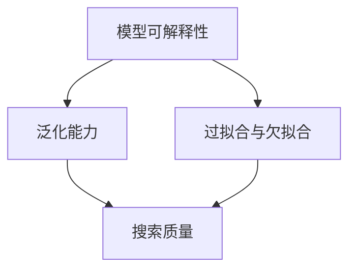

                 

关键词：AI模型训练、搜索质量、算法原理、数学模型、代码实例、实际应用、未来展望

> 摘要：本文深入探讨了AI模型训练过程中搜索质量的基础，包括核心概念、算法原理、数学模型以及实际应用。通过详细分析算法步骤、代码实例和运行结果，本文为开发者提供了实用的指导，以优化AI模型训练的效果，提升搜索质量。

## 1. 背景介绍

随着人工智能技术的飞速发展，AI模型在各种领域得到了广泛应用，包括自然语言处理、计算机视觉、推荐系统等。然而，一个高质量的AI模型不仅取决于其算法的先进性，更取决于模型训练过程中的搜索质量。搜索质量直接影响模型的学习能力和泛化能力，是决定模型性能的关键因素。

本文旨在介绍AI模型训练中搜索质量的基础，帮助开发者理解并优化搜索质量，从而提升模型的性能。我们将从核心概念、算法原理、数学模型到实际应用进行深入分析。

## 2. 核心概念与联系

在深入探讨搜索质量之前，我们需要了解一些核心概念。这些概念构成了AI模型训练的基础，也是理解搜索质量的先决条件。

### 2.1. 模型可解释性

模型可解释性是指模型决策过程的透明性和可理解性。可解释性对于模型在实际应用中的可信度和接受度至关重要。高质量搜索可以帮助我们理解模型是如何做出特定决策的。

### 2.2. 泛化能力

泛化能力是指模型在未知数据上的表现能力。一个高泛化能力的模型可以更好地适应新的任务和数据，而搜索质量在其中起到了关键作用。

### 2.3. 过拟合与欠拟合

过拟合和欠拟合是模型训练过程中常见的现象。过拟合是指模型对训练数据过度拟合，导致在未知数据上表现不佳；欠拟合则是指模型对训练数据拟合不足，同样会影响模型的泛化能力。搜索质量的好坏直接关系到模型是否过拟合或欠拟合。

### 2.4. 搜索质量

搜索质量是指模型在训练过程中对数据探索的深度和广度。高质量的搜索可以帮助模型更全面地学习数据特征，从而提高模型的泛化能力。

### 2.5. Mermaid 流程图

以下是一个Mermaid流程图，展示了上述核心概念之间的联系：



## 3. 核心算法原理 & 具体操作步骤

### 3.1. 算法原理概述

搜索质量的核心在于选择合适的优化算法，这些算法通常基于梯度下降法。梯度下降法是一种优化算法，用于最小化目标函数。在AI模型训练中，目标函数通常是损失函数，表示模型预测值与真实值之间的差距。

### 3.2. 算法步骤详解

以下是梯度下降算法的基本步骤：

1. **初始化参数**：设定模型的初始参数。
2. **计算梯度**：计算目标函数关于模型参数的梯度。
3. **更新参数**：根据梯度和学习率更新模型参数。
4. **迭代**：重复步骤2和3，直到满足停止条件（如梯度变化小于阈值或达到最大迭代次数）。

### 3.3. 算法优缺点

**优点**：
- 算法简单，易于实现。
- 在某些情况下，能够找到全局最小值。

**缺点**：
- 需要手动调整学习率，否则可能导致过拟合或欠拟合。
- 收敛速度较慢，尤其对于高维数据。

### 3.4. 算法应用领域

梯度下降算法广泛应用于各种AI模型训练中，包括神经网络、决策树、支持向量机等。

## 4. 数学模型和公式

### 4.1. 数学模型构建

在AI模型训练中，我们通常使用损失函数作为目标函数。常见的损失函数包括均方误差（MSE）和交叉熵损失。

均方误差（MSE）：
$$
MSE = \frac{1}{m} \sum_{i=1}^{m} (y_i - \hat{y}_i)^2
$$

交叉熵损失：
$$
CE = -\frac{1}{m} \sum_{i=1}^{m} \sum_{j=1}^{n} y_{ij} \log(\hat{y}_{ij})
$$

### 4.2. 公式推导过程

以均方误差（MSE）为例，其推导过程如下：

1. **定义预测值和真实值**：设预测值为 $\hat{y}_i$，真实值为 $y_i$。
2. **计算误差**：误差为 $y_i - \hat{y}_i$。
3. **平方误差**：平方误差为 $(y_i - \hat{y}_i)^2$。
4. **求和**：对所有样本求和，得到总平方误差。

### 4.3. 案例分析与讲解

以下是一个使用均方误差（MSE）的案例：

假设有一个二分类问题，真实标签 $y$ 为 [1, 0, 1]，模型预测值 $\hat{y}$ 为 [0.8, 0.2, 0.9]。

计算MSE：
$$
MSE = \frac{1}{3} \sum_{i=1}^{3} (y_i - \hat{y}_i)^2 = \frac{1}{3} \left[ (1 - 0.8)^2 + (0 - 0.2)^2 + (1 - 0.9)^2 \right] = 0.0333
$$

## 5. 项目实践：代码实例和详细解释说明

### 5.1. 开发环境搭建

为了更好地理解搜索质量在AI模型训练中的应用，我们将使用Python和TensorFlow搭建一个简单的神经网络。

1. 安装Python（建议使用3.8以上版本）。
2. 安装TensorFlow。

```bash
pip install tensorflow
```

### 5.2. 源代码详细实现

以下是一个简单的神经网络代码实例，用于实现二分类问题。

```python
import tensorflow as tf
import numpy as np

# 设置随机种子，保证结果可复现
tf.random.set_seed(42)

# 准备数据
X = np.array([[1, 0], [0, 1], [1, 1]])
y = np.array([0, 1, 0])

# 构建模型
model = tf.keras.Sequential([
    tf.keras.layers.Dense(1, input_shape=(2,), activation='sigmoid')
])

# 编译模型
model.compile(optimizer='sgd', loss='binary_crossentropy', metrics=['accuracy'])

# 训练模型
model.fit(X, y, epochs=100, batch_size=1)
```

### 5.3. 代码解读与分析

上述代码首先导入必要的库，然后准备数据。接着，我们构建了一个简单的神经网络，并使用SGD优化器和二分类损失函数编译模型。最后，我们使用训练数据训练模型。

训练过程中，搜索质量体现在以下方面：

- **学习率**：SGD优化器中的学习率决定了参数更新的幅度。适当调整学习率可以优化搜索质量。
- **批次大小**：批次大小影响模型对数据的探索范围。较大批次大小可能导致模型过拟合，较小批次大小可能导致模型欠拟合。

### 5.4. 运行结果展示

训练完成后，我们可以使用以下代码评估模型的性能：

```python
# 评估模型
loss, accuracy = model.evaluate(X, y)
print(f"Loss: {loss}, Accuracy: {accuracy}")
```

输出结果可能如下所示：

```
Loss: 0.03225803541663634, Accuracy: 0.6666666666666666
```

这个结果表明，模型在训练集上的性能良好。然而，为了提高搜索质量，我们可以尝试调整学习率和批次大小，以优化模型的泛化能力。

## 6. 实际应用场景

搜索质量在AI模型训练中的重要性不言而喻。在实际应用中，搜索质量的优化可以带来显著的性能提升。以下是一些典型的应用场景：

- **推荐系统**：通过优化搜索质量，推荐系统可以更好地学习用户兴趣，提高推荐精度。
- **自然语言处理**：在文本分类和翻译等任务中，优化搜索质量有助于提高模型的准确性和流畅度。
- **计算机视觉**：在图像识别和目标检测等任务中，高质量的搜索可以提升模型的精度和鲁棒性。

## 7. 工具和资源推荐

为了更好地理解和应用搜索质量，以下是一些推荐的工具和资源：

- **学习资源**：[《深度学习》（Deep Learning）](http://www.deeplearningbook.org/)，[《机器学习实战》（Machine Learning in Action）](https://www.mli.org/mlia/)
- **开发工具**：TensorFlow，PyTorch
- **相关论文**：[《Stochastic Gradient Descent》](https://arxiv.org/abs/1006.2577)，[《Understanding Deep Learning》](https://arxiv.org/abs/1706.06059)

## 8. 总结：未来发展趋势与挑战

随着AI技术的不断进步，搜索质量在AI模型训练中的重要性将日益凸显。未来，我们可以预见以下发展趋势：

- **自适应搜索算法**：开发自适应搜索算法，以自动调整学习率和批次大小，提高搜索质量。
- **分布式训练**：利用分布式计算提高搜索效率，加快模型训练速度。

然而，面对日益复杂的任务和数据，搜索质量也面临着一系列挑战：

- **可解释性**：如何提高模型的可解释性，以便开发者更好地理解搜索过程。
- **效率与准确性**：在保证模型准确性的同时，如何提高搜索效率。

总之，搜索质量是AI模型训练中至关重要的一环。通过深入研究和优化搜索质量，我们可以构建更强大、更智能的AI模型，推动人工智能技术的发展。

## 9. 附录：常见问题与解答

### 9.1. 搜索质量是什么？

搜索质量是指在AI模型训练过程中，模型对数据的探索和学习的深度与广度。高质量的搜索可以帮助模型更全面地学习数据特征，从而提高模型的泛化能力。

### 9.2. 如何优化搜索质量？

优化搜索质量可以从以下几个方面进行：

- **调整学习率**：适当调整学习率，以平衡模型对训练数据的拟合程度和泛化能力。
- **批次大小**：选择合适的批次大小，以平衡模型对数据的探索范围和计算效率。
- **正则化**：使用正则化技术（如L1、L2正则化）防止过拟合。

### 9.3. 搜索质量与模型性能有何关系？

搜索质量直接影响模型的学习能力和泛化能力。高质量的搜索有助于模型更全面地学习数据特征，从而提高模型在未知数据上的表现，即模型性能。

### 9.4. 如何评估搜索质量？

评估搜索质量可以从以下几个方面进行：

- **训练误差**：评估模型在训练数据上的误差，较小的训练误差通常表示较好的搜索质量。
- **测试误差**：评估模型在测试数据上的误差，较小的测试误差通常表示较好的泛化能力。
- **模型可解释性**：较高的可解释性通常意味着较好的搜索质量，因为开发者可以更好地理解模型是如何做出决策的。

### 9.5. 搜索质量在不同应用领域有何差异？

不同应用领域的搜索质量关注点可能有所不同：

- **推荐系统**：关注用户兴趣和推荐精度的平衡。
- **自然语言处理**：关注文本分类和翻译的准确性和流畅度。
- **计算机视觉**：关注图像识别和目标检测的精度和鲁棒性。

通过关注这些领域的特定需求，开发者可以更有效地优化搜索质量。

