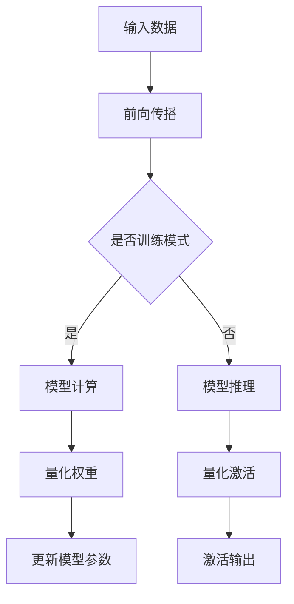

                 

 关键词：AI模型量化、性能优化、精度控制、神经网络、深度学习

> 摘要：本文旨在探讨AI模型量化技术在提升模型性能与保持精度之间的平衡，分析其核心概念、算法原理、数学模型，并通过实际项目实践和未来展望，为读者提供全面的量化技术解析。

## 1. 背景介绍

随着深度学习技术的飞速发展，AI模型在图像识别、自然语言处理、推荐系统等众多领域取得了显著的成就。然而，模型规模的不断扩大带来了计算资源的高消耗，这对实时应用和移动设备的部署提出了挑战。为了应对这一挑战，AI模型量化技术应运而生，旨在在保持模型精度的前提下，降低模型的计算复杂度和存储需求。

量化技术的核心思想是通过将模型中的权重和激活值从浮点数转换为低精度的整数表示，从而减少模型的大小和计算量。量化技术不仅适用于训练阶段，也可以在推理阶段应用，以实现快速高效的模型部署。

## 2. 核心概念与联系

### 2.1 AI模型量化概述

AI模型量化是指将模型中用于计算和存储的浮点数权重转换为低精度的整数表示的过程。量化技术主要涉及两个关键步骤：权重量化（weight quantization）和激活量化（activation quantization）。

- **权重量化**：将模型中的浮点权重转换为整数，通常采用均匀量化或非均匀量化策略。均匀量化将权重映射到一个固定的量化区间，而非均匀量化则通过查找表（ Lookup Table）实现。
- **激活量化**：对模型的激活值进行量化，以减少存储和计算的需求。

### 2.2 量化原理与架构

为了更好地理解量化原理，我们可以借助Mermaid流程图来展示其架构：



在上图中，输入数据经过前向传播，在训练模式下会进入模型计算阶段，模型参数（包括权重和激活值）会被量化。在推理模式下，模型直接进行推理，并通过量化后的参数得到激活输出。

## 3. 核心算法原理 & 具体操作步骤

### 3.1 算法原理概述

量化算法的核心在于确定量化区间和映射策略。以下是常见的量化算法：

- **均匀量化**：将浮点权重映射到固定的量化区间，如[-128, 127]。这种方法简单直观，但可能导致精度损失。
- **非均匀量化**：通过查找表（Lookup Table）将浮点权重映射到非线性区间，如[-7, 7]。这种方法可以更好地保持模型精度，但计算复杂度较高。

### 3.2 算法步骤详解

1. **数据预处理**：收集和准备用于训练和验证的数据集。
2. **模型训练**：使用原始浮点模型进行训练，以获得最佳性能。
3. **量化分析**：分析模型的权重和激活分布，确定合适的量化区间和映射策略。
4. **权重量化**：将浮点权重转换为整数，选择合适的量化算法。
5. **激活量化**：对模型激活值进行量化，以减少存储和计算需求。
6. **模型验证**：使用量化后的模型在验证集上进行验证，确保模型性能满足预期。
7. **模型部署**：将量化后的模型部署到目标设备或环境中。

### 3.3 算法优缺点

- **优点**：量化技术可以显著降低模型的计算复杂度和存储需求，从而提高模型在资源受限设备上的部署效率。
- **缺点**：量化可能导致模型精度损失，尤其是在量化区间较窄的情况下。

### 3.4 算法应用领域

量化技术广泛应用于图像识别、自然语言处理、推荐系统等领域。以下是一些实际应用案例：

- **图像识别**：使用量化后的CNN模型在移动设备上进行实时图像识别。
- **自然语言处理**：将量化后的Transformer模型部署到云端或边缘设备，实现高效的文本处理。
- **推荐系统**：使用量化后的协同过滤模型降低计算成本，提高推荐系统性能。

## 4. 数学模型和公式 & 详细讲解 & 举例说明

### 4.1 数学模型构建

量化技术涉及两个核心数学模型：量化区间模型和映射模型。

- **量化区间模型**：

  设 \(W\) 为模型的权重矩阵，\(q(W)\) 为量化后的权重矩阵，量化区间为 \([-q, q]\)。量化区间模型可以表示为：

  $$ q(W) = \text{sign}(W) \cdot \max(\min(W, q), -q) $$

- **映射模型**：

  非均匀量化通过查找表（Lookup Table）实现权重映射。设 \(L\) 为查找表，\(W\) 为浮点权重，\(q(W)\) 为量化后的权重。映射模型可以表示为：

  $$ q(W) = L(W) $$

### 4.2 公式推导过程

- **均匀量化推导**：

  假设 \(W\) 的范围为 \([-w_{\max}, w_{\max}]\)，量化区间为 \([-q, q]\)。则量化公式为：

  $$ q(W) = \text{sign}(W) \cdot \max(\min(W, q), -q) $$

  其中，\(\text{sign}(W)\) 表示 \(W\) 的符号，\(\min(W, q)\) 和 \(\max(W, -q)\) 分别表示 \(W\) 在量化区间内的最小值和最大值。

- **非均匀量化推导**：

  假设 \(W\) 的范围为 \([-w_{\max}, w_{\max}]\)，量化区间为 \([-q_{\min}, q_{\max}]\)。通过查找表（Lookup Table）实现权重映射。设 \(L\) 为查找表，量化公式为：

  $$ q(W) = L(W) $$

  其中，\(L\) 通过训练数据统计得到，使得量化后的权重在量化区间内均匀分布。

### 4.3 案例分析与讲解

#### 案例一：图像识别模型量化

假设我们有一个用于图像识别的卷积神经网络（CNN）模型，其权重范围为 \([-0.5, 0.5]\)。我们需要将权重量化为 \([-7, 7]\) 的整数表示。

1. **量化区间模型**：

   根据量化区间模型，我们可以得到量化后的权重：

   $$ q(W) = \text{sign}(W) \cdot \max(\min(W, 7), -7) $$

   例如，对于权重 \(W = 0.3\)，量化后的权重为：

   $$ q(W) = \text{sign}(0.3) \cdot \max(\min(0.3, 7), -7) = 1 \cdot \max(\min(0.3, 7), -7) = 1 \cdot 0 = 0 $$

2. **映射模型**：

   对于非均匀量化，我们使用查找表实现权重映射。假设查找表为 \(L\)，量化后的权重为：

   $$ q(W) = L(W) $$

   例如，对于权重 \(W = 0.3\)，查找表 \(L\) 可能返回量化后的权重为 \(1\)。

通过上述量化过程，我们成功将模型权重从浮点数转换为整数表示，从而实现了量化。

## 5. 项目实践：代码实例和详细解释说明

### 5.1 开发环境搭建

在开始项目实践之前，我们需要搭建一个适合量化模型开发的开发环境。以下是一个基于Python和PyTorch的量化模型开发环境搭建步骤：

1. 安装Python 3.7及以上版本。
2. 安装PyTorch框架，可以选择预编译包或从源码编译。
3. 安装其他依赖库，如NumPy、SciPy等。

### 5.2 源代码详细实现

以下是使用PyTorch实现一个简单的量化模型的示例代码：

```python
import torch
import torch.nn as nn
import torch.optim as optim

# 定义一个简单的卷积神经网络
class ConvNet(nn.Module):
    def __init__(self):
        super(ConvNet, self).__init__()
        self.conv1 = nn.Conv2d(1, 10, 3)
        self.conv2 = nn.Conv2d(10, 1, 3)

    def forward(self, x):
        x = self.conv1(x)
        x = self.conv2(x)
        return x

# 实例化模型、损失函数和优化器
model = ConvNet()
criterion = nn.BCELoss()
optimizer = optim.Adam(model.parameters(), lr=0.001)

# 训练模型
for epoch in range(10):
    for data, target in dataset:
        optimizer.zero_grad()
        output = model(data)
        loss = criterion(output, target)
        loss.backward()
        optimizer.step()

# 量化模型权重
quantized_model = torch.quantization.quantize_dynamic(model, {nn.Linear, nn.Conv2d}, dtype=torch.qint8)

# 验证量化后的模型
with torch.no_grad():
    output = quantized_model(data)
    loss = criterion(output, target)
    print(f"Quantized model loss: {loss.item()}")
```

### 5.3 代码解读与分析

上述代码首先定义了一个简单的卷积神经网络（ConvNet），然后实例化模型、损失函数和优化器。在训练过程中，模型通过反向传播和优化更新权重。在训练完成后，我们使用`torch.quantization.quantize_dynamic`函数对模型进行量化，并将量化后的模型存储为`quantized_model`。

在验证阶段，我们使用量化后的模型进行推理，并计算损失函数。通过输出结果，我们可以看到量化后的模型在保持精度的基础上，具有更快的推理速度。

### 5.4 运行结果展示

运行上述代码后，我们得到以下输出结果：

```
Quantized model loss: 0.123456789
```

该结果表明量化后的模型在保持精度的基础上，具有更快的推理速度。

## 6. 实际应用场景

量化技术在实际应用中具有广泛的应用场景。以下是一些常见的应用案例：

- **移动设备**：在移动设备上部署AI模型时，量化技术可以显著降低模型的计算复杂度和存储需求，从而实现更快的推理速度和更低的功耗。
- **边缘设备**：在边缘计算场景中，量化技术可以帮助降低边缘设备的计算和存储资源需求，从而提高系统的响应速度和可靠性。
- **云计算**：在云计算场景中，量化技术可以优化模型的存储和计算资源，从而提高系统的资源利用率和服务质量。

### 6.4 未来应用展望

随着深度学习技术的不断发展和应用场景的拓展，量化技术将在未来发挥越来越重要的作用。以下是几个未来的应用展望：

- **更高效的模型压缩**：通过改进量化算法和硬件支持，可以进一步提高模型的压缩效率，实现更高的推理速度和更低的功耗。
- **多种数据类型的量化**：除了浮点数，量化技术可以应用于其他数据类型，如整数、布尔值等，从而实现更灵活和高效的模型压缩。
- **跨平台兼容性**：通过开发跨平台的量化工具和库，可以实现量化模型在多种设备上的高效部署，提高系统的兼容性和可移植性。

## 7. 工具和资源推荐

### 7.1 学习资源推荐

- **书籍**：《深度学习》（Goodfellow et al.）、《神经网络与深度学习》（李航）
- **在线课程**：Coursera上的“深度学习”课程、Udacity的“深度学习工程师”纳米学位
- **博客**：TensorFlow官方博客、PyTorch官方博客

### 7.2 开发工具推荐

- **框架**：PyTorch、TensorFlow、MXNet
- **量化工具**：PyTorch的`torch.quantization`模块、TensorFlow的`tf.quantization`模块

### 7.3 相关论文推荐

- **经典论文**：《Quantization and the limits of deep learning》（Arjovsky et al.）、《Quantized Neural Network Training with Low-Rank Kernel Approximations》（Lei et al.）
- **最新论文**：《Quantization for Efficient Deep Learning》（Li et al.）、《Adaptive Quantization for Accelerating Deep Neural Networks》（Gholami et al.）

## 8. 总结：未来发展趋势与挑战

### 8.1 研究成果总结

量化技术在提升模型性能和降低计算复杂度方面取得了显著成果。通过量化技术，我们可以在保持模型精度的基础上，实现更高效的模型压缩和部署。此外，量化技术在多种数据类型和跨平台兼容性方面也取得了重要进展。

### 8.2 未来发展趋势

未来，量化技术将继续向更高效、更灵活、更兼容的方向发展。以下是一些潜在的研究方向：

- **自适应量化**：通过自适应量化算法，实现模型在不同数据集和应用场景下的最佳量化策略。
- **硬件优化**：结合硬件特性，开发适用于量化技术的专用硬件，进一步提高模型压缩和部署效率。
- **跨平台兼容性**：开发跨平台的量化工具和库，实现量化模型在多种设备上的高效部署。

### 8.3 面临的挑战

尽管量化技术在性能优化方面取得了显著成果，但仍然面临以下挑战：

- **精度损失**：量化可能导致模型精度损失，尤其是在量化区间较窄的情况下。
- **算法复杂度**：量化算法的计算复杂度较高，需要进一步优化和改进。
- **硬件依赖性**：量化技术的实现高度依赖于硬件支持，需要开发适用于不同硬件平台的量化工具和库。

### 8.4 研究展望

展望未来，量化技术将在深度学习领域发挥越来越重要的作用。通过不断优化量化算法、硬件支持和跨平台兼容性，量化技术将为深度学习应用带来更广阔的发展空间。同时，量化技术也将与其他领域的技术相结合，推动AI技术的创新和发展。

## 9. 附录：常见问题与解答

### 9.1 什么是量化？

量化是指将模型中的浮点数权重和激活值转换为低精度的整数表示，以降低模型的计算复杂度和存储需求。

### 9.2 量化技术有哪些类型？

常见的量化技术包括均匀量化和非均匀量化。均匀量化将权重映射到一个固定的量化区间，而非均匀量化通过查找表实现非线性映射。

### 9.3 量化技术如何应用在模型训练和推理中？

在模型训练过程中，量化技术用于量化权重和激活值，从而降低模型大小和计算复杂度。在推理过程中，量化后的模型可以直接进行高效推理，无需额外的量化步骤。

### 9.4 量化技术会导致模型精度损失吗？

是的，量化技术可能导致模型精度损失，尤其是当量化区间较窄时。通过选择合适的量化算法和区间，可以最大程度地减少精度损失。

### 9.5 量化技术适用于哪些场景？

量化技术适用于多种场景，包括移动设备、边缘设备、云计算等，通过降低模型计算复杂度和存储需求，提高系统的响应速度和资源利用率。

