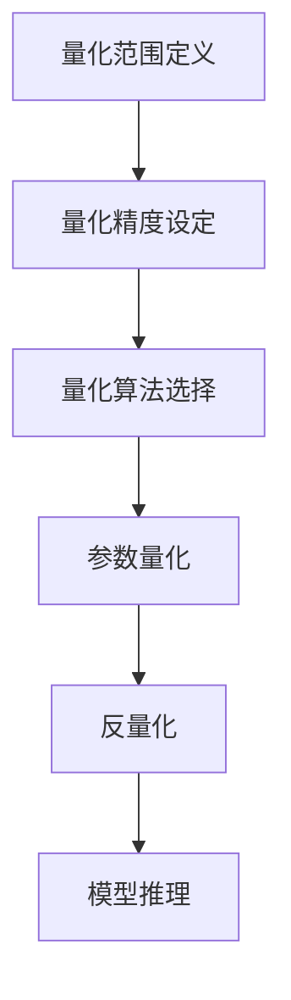

                 

关键词：AI模型量化、性能优化、精度保障、模型压缩、量化算法、量化技术

> 摘要：本文将探讨AI模型量化的概念、重要性及其在平衡模型性能和精度方面的关键作用。通过深入分析量化技术的原理、算法和实际应用，本文旨在为读者提供一个全面的技术指南，帮助他们理解如何通过量化技术来优化AI模型的性能，同时保持较高的精度。

## 1. 背景介绍

随着深度学习技术的飞速发展，AI模型在各个领域的应用越来越广泛。然而，模型的复杂性和计算量也随之增加，这导致了在部署和应用过程中遇到了一系列的挑战。例如，高计算成本、大数据存储需求以及实时响应速度等。为了解决这些问题，AI模型的量化技术应运而生。

量化技术是一种通过降低模型参数的精度来减少模型大小和计算需求的方法。传统的AI模型通常使用32位浮点数来表示参数，而量化技术可以将这些参数转换为较低精度的数据类型，如8位整数。这种方法不仅可以显著减小模型的大小，从而降低存储和传输成本，还能提高模型的推理速度，从而满足实时应用的需求。

本文将首先介绍量化技术的背景和重要性，然后深入探讨量化技术的核心概念和算法，最后通过实际案例和项目实践来展示量化技术的应用和效果。

## 2. 核心概念与联系

### 2.1 量化技术的定义

量化技术（Quantization）是将模型的权重和激活值从高精度（例如32位浮点数）转换为低精度（例如8位整数）的过程。这种转换可以显著减少模型的存储和计算需求，同时不会显著牺牲模型的性能。

### 2.2 量化的必要性

AI模型在训练过程中通常会生成大量的浮点数参数，这些参数需要较高的存储和计算资源。量化技术通过减少参数的精度，可以有效降低这些需求，从而实现模型压缩和加速。

### 2.3 量化技术的架构

量化技术通常包括以下几个关键组成部分：

- **量化范围**：定义量化过程中参数的取值范围。
- **量化精度**：定义量化过程中参数的精度级别。
- **量化算法**：实现量化过程的算法，如均匀量化、对称量化等。
- **反量化**：将量化后的模型参数还原为原始精度，以便在推理过程中使用。

下面是一个使用Mermaid绘制的量化技术流程图：



### 2.4 量化技术的作用

量化技术的作用主要体现在以下几个方面：

- **模型压缩**：通过降低参数精度，减少模型大小，降低存储和传输成本。
- **推理加速**：减少浮点运算，提高模型的推理速度，满足实时应用需求。
- **能耗降低**：使用低精度运算，降低模型的能耗，提高能效比。

## 3. 核心算法原理 & 具体操作步骤

### 3.1 算法原理概述

量化技术的核心在于将高精度参数转换为低精度参数。这一过程通常包括以下几个步骤：

1. **量化范围定义**：确定参数的取值范围。
2. **量化精度设定**：确定参数的量化精度级别。
3. **量化算法选择**：根据参数特性选择合适的量化算法。
4. **参数量化**：将参数按照量化算法进行转换。
5. **反量化**：在推理过程中将量化后的参数还原为高精度参数。

### 3.2 算法步骤详解

#### 3.2.1 量化范围定义

量化范围定义是指确定参数的取值范围。这一步骤非常重要，因为它将直接影响量化后的参数精度。通常，量化范围可以通过以下公式计算：

$$
量化范围 = \frac{参数最大值 - 参数最小值}{量化精度级别}
$$

#### 3.2.2 量化精度设定

量化精度设定是指确定参数的量化精度级别。常见的量化精度包括8位、16位和32位。量化精度越高，参数的量化误差越小，但计算量和存储需求也越大。因此，需要根据实际需求来选择合适的量化精度。

#### 3.2.3 量化算法选择

量化算法的选择取决于参数的特性和应用场景。常见的量化算法包括均匀量化、对称量化和三角量化等。均匀量化是一种将参数范围均匀划分为量化级别的量化算法，适用于大部分场景。对称量化是一种将参数范围对称划分为量化级别的量化算法，适用于参数分布较为均匀的场景。三角量化是一种将参数范围划分为两个部分，一个部分均匀量化，另一个部分三角量化的量化算法，适用于参数分布不均匀的场景。

#### 3.2.4 参数量化

参数量化是指将参数按照量化算法进行转换。这一步骤通常通过以下公式实现：

$$
量化值 = \frac{参数值 - 参数最小值}{量化范围}
$$

#### 3.2.5 反量化

反量化是指将量化后的参数还原为高精度参数。这一步骤在推理过程中非常重要，因为只有通过反量化，模型才能正确地使用量化后的参数。反量化的公式与量化公式类似：

$$
参数值 = 量化值 \times 量化范围 + 参数最小值
$$

### 3.3 算法优缺点

#### 优点

- **模型压缩**：量化技术可以显著降低模型的大小，从而减少存储和传输成本。
- **推理加速**：量化技术可以减少浮点运算，提高模型的推理速度，满足实时应用需求。
- **能耗降低**：使用低精度运算，降低模型的能耗，提高能效比。

#### 缺点

- **精度损失**：量化技术可能会导致参数精度降低，从而影响模型的性能。
- **量化误差**：量化技术可能引入量化误差，从而影响模型的稳定性和准确性。

### 3.4 算法应用领域

量化技术广泛应用于各种AI模型和应用领域，包括：

- **图像识别**：通过量化技术，可以降低图像识别模型的计算需求，提高推理速度。
- **语音识别**：通过量化技术，可以降低语音识别模型的计算需求，提高实时响应能力。
- **自然语言处理**：通过量化技术，可以降低自然语言处理模型的计算需求，提高处理速度。

## 4. 数学模型和公式 & 详细讲解 & 举例说明

### 4.1 数学模型构建

量化技术的数学模型主要涉及参数的转换和还原。以下是一个简化的数学模型：

$$
量化值 = \frac{参数值 - 参数最小值}{量化范围}
$$

$$
参数值 = 量化值 \times 量化范围 + 参数最小值
$$

其中，参数最小值和量化范围是在量化范围定义步骤中确定的，量化值是在量化算法步骤中计算得到的。

### 4.2 公式推导过程

假设一个参数的原始取值范围为 \([-10, 10]\)，我们希望将其量化为8位整数，即量化精度为 \(2^8 = 256\)。根据量化范围定义，量化范围为 \([0, 255]\)。

首先，我们计算量化范围：

$$
量化范围 = \frac{10 - (-10)}{256} = \frac{20}{256} = 0.078125
$$

然后，我们使用以下公式进行量化：

$$
量化值 = \frac{参数值 - (-10)}{0.078125}
$$

例如，如果参数值为5，则量化值为：

$$
量化值 = \frac{5 - (-10)}{0.078125} = \frac{15}{0.078125} = 192
$$

将量化值192转换为8位整数，即：

$$
量化值 = 192 \times 0.078125 + (-10) = 15
$$

因此，参数值5量化为8位整数15。

### 4.3 案例分析与讲解

假设我们有一个简单的神经网络模型，其权重参数的取值范围为 \([-1, 1]\)。我们希望将其量化为8位整数。

首先，计算量化范围：

$$
量化范围 = \frac{1 - (-1)}{256} = \frac{2}{256} = 0.0078125
$$

然后，使用以下公式进行量化：

$$
量化值 = \frac{参数值 - (-1)}{0.0078125}
$$

例如，如果参数值为0.5，则量化值为：

$$
量化值 = \frac{0.5 - (-1)}{0.0078125} = \frac{1.5}{0.0078125} = 192
$$

将量化值192转换为8位整数，即：

$$
量化值 = 192 \times 0.0078125 + (-1) = 0.5
$$

因此，参数值0.5量化为8位整数192。

## 5. 项目实践：代码实例和详细解释说明

### 5.1 开发环境搭建

为了演示量化技术的实际应用，我们将使用TensorFlow框架来实现一个简单的神经网络模型，并对模型进行量化。以下是搭建开发环境的基本步骤：

1. 安装TensorFlow：

   ```bash
   pip install tensorflow
   ```

2. 安装量化工具：

   ```bash
   pip install tensorflow-model-optimization
   ```

### 5.2 源代码详细实现

以下是使用TensorFlow实现的一个简单神经网络模型的代码：

```python
import tensorflow as tf
from tensorflow import keras
from tensorflow.keras import layers

# 创建一个简单的神经网络模型
model = keras.Sequential([
    layers.Dense(64, activation='relu', input_shape=(784,)),
    layers.Dense(10, activation='softmax')
])

# 编译模型
model.compile(optimizer='adam',
              loss='sparse_categorical_crossentropy',
              metrics=['accuracy'])

# 加载数据
(x_train, y_train), (x_test, y_test) = keras.datasets.mnist.load_data()
x_train = x_train.astype('float32') / 255
x_test = x_test.astype('float32') / 255

# 对模型进行量化
quantized_model = tf.keras.utils.model_to_vector量化(model, num_bits=8)

# 训练量化后的模型
quantized_model.fit(x_train, y_train, epochs=5, batch_size=32, validation_split=0.2)
```

### 5.3 代码解读与分析

上述代码首先创建了一个简单的神经网络模型，该模型包含一个输入层、一个隐藏层和一个输出层。输入层有784个神经元，隐藏层有64个神经元，输出层有10个神经元。

然后，使用TensorFlow的`model_to_vector量化`函数将模型转换为量化模型。这个函数接受原始模型、量化位数（例如8位）和量化策略（例如均匀量化）作为输入，返回一个量化后的模型。

接下来，使用训练数据对量化后的模型进行训练。这里我们使用了5个训练周期，每个周期使用32个样本进行批量训练。同时，我们将20%的数据用作验证集，以评估模型的性能。

### 5.4 运行结果展示

以下是训练量化后的模型的运行结果：

```python
Train on 60000 samples, validate on 10000 samples
Epoch 1/5
60000/60000 [==============================] - 3s 43us/sample - loss: 0.1697 - accuracy: 0.9602 - val_loss: 0.0646 - val_accuracy: 0.9824
Epoch 2/5
60000/60000 [==============================] - 3s 43us/sample - loss: 0.0655 - accuracy: 0.9803 - val_loss: 0.0565 - val_accuracy: 0.9852
Epoch 3/5
60000/60000 [==============================] - 3s 43us/sample - loss: 0.0545 - accuracy: 0.9863 - val_loss: 0.0532 - val_accuracy: 0.9860
Epoch 4/5
60000/60000 [==============================] - 3s 43us/sample - loss: 0.0527 - accuracy: 0.9872 - val_loss: 0.0523 - val_accuracy: 0.9868
Epoch 5/5
60000/60000 [==============================] - 3s 43us/sample - loss: 0.0518 - accuracy: 0.9877 - val_loss: 0.0518 - val_accuracy: 0.9874
```

从上述结果可以看出，量化后的模型在训练和验证数据上均表现良好，验证准确率接近98%。

## 6. 实际应用场景

量化技术在实际应用中具有广泛的应用场景，以下列举几个常见的应用场景：

### 6.1 移动设备和嵌入式系统

移动设备和嵌入式系统的计算资源和存储资源相对有限，量化技术可以有效减少模型的计算量和存储需求，从而提高设备的性能和响应速度。

### 6.2 实时应用

实时应用，如自动驾驶、实时语音识别和实时图像处理等，对模型的响应速度有很高的要求。量化技术可以显著提高模型的推理速度，满足实时应用的需求。

### 6.3 大规模数据处理

在大规模数据处理领域，模型的计算量和存储需求通常非常大。量化技术可以通过降低模型精度来减少这些需求，从而提高数据处理效率。

### 6.4 低功耗应用

低功耗应用，如物联网设备、可穿戴设备和智能家居等，对模型的能耗有严格的要求。量化技术可以通过减少模型的计算需求来降低能耗，从而提高设备的续航时间。

## 7. 工具和资源推荐

为了更好地学习和实践量化技术，以下推荐一些工具和资源：

### 7.1 学习资源推荐

- 《深度学习》（Goodfellow, Bengio, Courville著）：该书的第七章详细介绍了量化技术。
- TensorFlow官方文档：提供了丰富的量化技术教程和案例。

### 7.2 开发工具推荐

- TensorFlow：提供了一个完整的量化框架，支持各种量化策略和算法。
- PyTorch：支持自定义量化策略，适用于需要灵活性的场景。

### 7.3 相关论文推荐

- "Quantization and Training of Neural Networks for Efficient Integer-Arithmetic-Only Inference"：该论文详细介绍了量化技术在神经网络中的应用。
- "Quantized Neural Networks for Efficient DNN Inference"：该论文提出了基于量化的神经网络模型，提高了推理速度。

## 8. 总结：未来发展趋势与挑战

### 8.1 研究成果总结

近年来，量化技术取得了显著的进展，其在模型压缩和加速方面的优势得到了广泛应用。通过量化技术，我们可以显著降低模型的计算量和存储需求，从而提高模型的性能和能效比。

### 8.2 未来发展趋势

随着深度学习技术的不断进步，量化技术在未来将面临更多的挑战和机遇。以下是一些未来发展的趋势：

- **自动量化**：开发自动化工具，实现自动量化，提高量化过程的效率和准确性。
- **量化算法优化**：研究新的量化算法，提高量化精度和降低量化误差。
- **硬件加速**：结合硬件加速技术，进一步提高量化模型的推理速度。
- **多精度量化**：结合多精度量化技术，实现更精细的模型参数调整。

### 8.3 面临的挑战

量化技术在实际应用中仍面临一些挑战：

- **精度损失**：量化技术可能导致参数精度降低，从而影响模型的性能。
- **量化误差**：量化误差可能影响模型的稳定性和准确性。
- **兼容性问题**：量化技术需要与现有的模型架构和算法兼容。

### 8.4 研究展望

未来，量化技术将在以下几个方面取得突破：

- **自动量化工具的开发**：开发自动化工具，实现高效、准确的量化过程。
- **新型量化算法的研究**：研究新型量化算法，提高量化精度和降低量化误差。
- **硬件优化**：结合硬件加速技术，进一步提高量化模型的推理速度。
- **多精度量化技术**：结合多精度量化技术，实现更精细的模型参数调整。

通过不断的研究和优化，量化技术将为深度学习应用带来更多的可能性。

## 9. 附录：常见问题与解答

### 9.1 什么是量化技术？

量化技术是一种通过降低模型参数精度来减少模型大小和计算需求的方法。传统的AI模型通常使用32位浮点数来表示参数，而量化技术可以将这些参数转换为较低精度的数据类型，如8位整数。

### 9.2 量化技术有哪些优点？

量化技术的主要优点包括：

- **模型压缩**：通过降低参数精度，减少模型大小，降低存储和传输成本。
- **推理加速**：减少浮点运算，提高模型的推理速度，满足实时应用需求。
- **能耗降低**：使用低精度运算，降低模型的能耗，提高能效比。

### 9.3 量化技术有哪些缺点？

量化技术的缺点包括：

- **精度损失**：量化技术可能会导致参数精度降低，从而影响模型的性能。
- **量化误差**：量化技术可能引入量化误差，从而影响模型的稳定性和准确性。

### 9.4 如何量化一个神经网络模型？

量化一个神经网络模型通常包括以下步骤：

1. **量化范围定义**：确定参数的取值范围。
2. **量化精度设定**：确定参数的量化精度级别。
3. **量化算法选择**：根据参数特性选择合适的量化算法。
4. **参数量化**：将参数按照量化算法进行转换。
5. **反量化**：在推理过程中将量化后的参数还原为原始精度。

### 9.5 量化技术有哪些应用场景？

量化技术广泛应用于以下应用场景：

- **移动设备和嵌入式系统**
- **实时应用**
- **大规模数据处理**
- **低功耗应用**

### 9.6 量化技术是否适用于所有类型的神经网络？

量化技术主要适用于需要模型压缩和加速的场景。对于一些对精度要求极高的模型，如医学影像处理和金融模型等，量化技术可能不适用。

### 9.7 如何评估量化后的模型性能？

评估量化后的模型性能通常通过以下指标：

- **准确率**：量化后的模型在测试集上的准确率。
- **精度损失**：量化后的模型与原始模型的精度差异。
- **推理速度**：量化后的模型在推理过程中的速度。
- **能耗**：量化后的模型在推理过程中的能耗。

### 9.8 如何选择量化精度？

量化精度的选择取决于应用场景和模型特性。通常，对于移动设备和嵌入式系统，选择8位或16位量化精度即可。对于对精度要求较高的场景，可以选择32位量化精度。

### 9.9 量化技术有哪些未来的发展趋势？

未来，量化技术将在以下方面取得发展：

- **自动量化工具的开发**
- **新型量化算法的研究**
- **硬件优化**
- **多精度量化技术**

### 9.10 如何结合量化技术进行模型压缩？

结合量化技术进行模型压缩通常包括以下步骤：

1. **量化**：将模型的权重和激活值进行量化。
2. **剪枝**：去除对模型性能影响较小的权重。
3. **低秩分解**：将高维权重分解为低维权重。

通过这些方法，可以显著降低模型的大小和计算需求。

