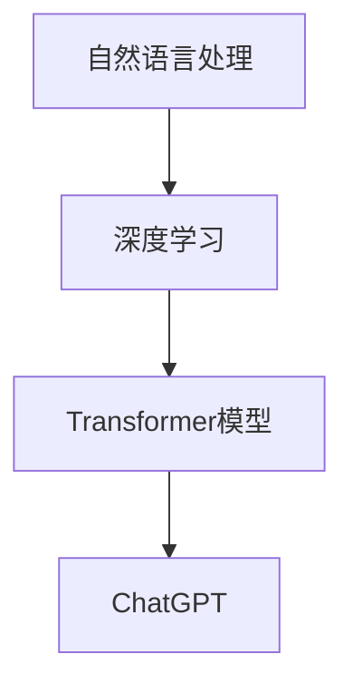

                 

关键词：AI浪潮，ChatGPT，局限性，自我修正，技术趋势

> 摘要：随着人工智能（AI）技术的快速发展，ChatGPT等聊天机器人已成为日常生活中不可或缺的一部分。本文将从AI浪潮的背景出发，分析ChatGPT的技术原理和应用场景，深入探讨其局限性，并探讨通过自我修正机制来克服这些局限性的可能性。此外，文章还将展望AI技术的未来发展趋势及其面临的挑战。

## 1. 背景介绍

自21世纪以来，人工智能（AI）技术以其强大的数据处理和模式识别能力，逐渐渗透到社会的各个领域，从医疗诊断、金融分析到自动驾驶、智能客服等。特别是近年来，深度学习等先进算法的突破，使得AI的智能程度和实用性得到了极大的提升。ChatGPT，作为一种基于Transformer模型的自然语言处理（NLP）技术，正是在这一背景下诞生的。

ChatGPT是由OpenAI开发的一款大型语言模型，其背后的原理是基于预训练和微调的技术。具体来说，ChatGPT首先通过大量的文本数据进行预训练，以学习语言的统计特性和规则；然后，通过微调技术，使其能够针对特定的任务进行优化，从而实现高质量的自然语言生成。

## 2. 核心概念与联系

在理解ChatGPT之前，我们需要了解一些核心概念，如自然语言处理（NLP）、深度学习、Transformer模型等。以下是一个简单的Mermaid流程图，以展示这些概念之间的联系。



### 2.1 自然语言处理（NLP）

自然语言处理是人工智能的一个重要分支，旨在使计算机能够理解、解释和生成自然语言。NLP技术包括文本分类、情感分析、命名实体识别、机器翻译等。

### 2.2 深度学习

深度学习是机器学习的一个子领域，通过模拟人脑神经网络结构，实现对数据的自动特征学习和模式识别。深度学习在图像识别、语音识别等领域取得了显著成果。

### 2.3 Transformer模型

Transformer模型是由Google提出的一种基于自注意力机制的深度神经网络架构，因其在高性能和灵活性的优势，在自然语言处理领域得到了广泛应用。

### 2.4 ChatGPT

ChatGPT是基于Transformer模型的大型语言模型，通过预训练和微调技术，实现了对自然语言的高效理解和生成。

## 3. 核心算法原理 & 具体操作步骤

### 3.1 算法原理概述

ChatGPT的核心原理是基于Transformer模型的自注意力机制。在预训练阶段，ChatGPT通过无监督的方式学习语言的统计特性和规则。在微调阶段，ChatGPT通过有监督的方式针对特定任务进行优化。

### 3.2 算法步骤详解

1. **预训练阶段**：
   - **数据准备**：收集大量的文本数据，包括文章、书籍、新闻等。
   - **嵌入表示**：将文本数据转化为向量表示。
   - **损失函数**：采用自注意力机制，通过计算输入文本中每个词与其他词之间的关系，更新词的嵌入向量。
   - **训练过程**：通过反向传播和梯度下降算法，不断更新模型参数，直至模型收敛。

2. **微调阶段**：
   - **任务定义**：明确需要完成的自然语言处理任务，如文本生成、问答系统等。
   - **损失函数**：根据任务需求，设计相应的损失函数，如交叉熵损失函数。
   - **训练过程**：在预训练的基础上，继续优化模型参数，使其能够适应特定的任务。

### 3.3 算法优缺点

**优点**：
- **强大**：ChatGPT具有强大的自然语言理解和生成能力，可以处理复杂的多轮对话。
- **灵活**：通过微调，ChatGPT可以应用于多种自然语言处理任务。

**缺点**：
- **计算资源消耗大**：预训练和微调过程需要大量的计算资源。
- **数据依赖性高**：ChatGPT的性能在很大程度上取决于训练数据的质量和数量。

### 3.4 算法应用领域

ChatGPT在多个领域都有广泛的应用，如：

- **智能客服**：通过模拟人类对话，提供高效的客户服务。
- **内容生成**：用于生成文章、新闻、故事等。
- **教育辅助**：辅助学生学习，提供个性化教育服务。

## 4. 数学模型和公式 & 详细讲解 & 举例说明

### 4.1 数学模型构建

ChatGPT的数学模型主要基于Transformer模型。Transformer模型的核心是自注意力机制，其计算公式如下：

$$
\text{Attention}(Q, K, V) = \text{softmax}\left(\frac{QK^T}{\sqrt{d_k}}\right)V
$$

其中，$Q$、$K$、$V$分别为查询向量、键向量和值向量，$d_k$为键向量的维度。

### 4.2 公式推导过程

自注意力机制的推导过程如下：

1. **计算相似度**：首先计算查询向量$Q$和键向量$K$之间的相似度，公式为$QK^T$。
2. **缩放**：由于相似度计算结果的范围较大，为了防止梯度消失，需要对其进行缩放，公式为$\frac{1}{\sqrt{d_k}}$。
3. **softmax激活**：对缩放后的相似度进行softmax激活，使其成为一个概率分布。
4. **加权求和**：将概率分布与值向量$V$相乘，并求和，得到输出向量。

### 4.3 案例分析与讲解

以下是一个简单的例子，说明自注意力机制如何工作：

假设我们有三个词：`A`、`B`、`C`，其对应的嵌入向量分别为$Q = [1, 0, 1]$、$K = [1, 1, 0]$、$V = [1, 1, 1]$。

1. **计算相似度**：
   $$
   QK^T = \begin{bmatrix}1 & 0 & 1\end{bmatrix}\begin{bmatrix}1\\1\\0\end{bmatrix} = [2, 1, 0]
   $$

2. **缩放**：
   $$
   \frac{1}{\sqrt{d_k}} = \frac{1}{\sqrt{1}} = [1, 1, 0]
   $$

3. **softmax激活**：
   $$
   \text{softmax}\left(\frac{QK^T}{\sqrt{d_k}}\right) = \text{softmax}([2, 1, 0]) = [0.67, 0.33, 0]
   $$

4. **加权求和**：
   $$
   \text{Attention}(Q, K, V) = [0.67, 0.33, 0] \cdot [1, 1, 1] = [0.67, 0.33, 0]
   $$

因此，输出向量为$[0.67, 0.33, 0]$，表示词`A`对词`B`的注意力权重为0.67，对词`C`的注意力权重为0.33。

## 5. 项目实践：代码实例和详细解释说明

### 5.1 开发环境搭建

要运行ChatGPT模型，我们需要安装以下软件和库：

- Python 3.8及以上版本
- PyTorch 1.8及以上版本
- Transformers库

安装命令如下：

```bash
pip install torch torchvision transformers
```

### 5.2 源代码详细实现

以下是ChatGPT模型的基本实现：

```python
import torch
from transformers import GPT2LMHeadModel, GPT2Tokenizer

# 模型初始化
tokenizer = GPT2Tokenizer.from_pretrained('gpt2')
model = GPT2LMHeadModel.from_pretrained('gpt2')

# 输入文本
text = "我是ChatGPT，一个大型语言模型。"

# 编码
input_ids = tokenizer.encode(text, return_tensors='pt')

# 预测
outputs = model(input_ids)

# 获取预测结果
predictions = outputs.logits.argmax(-1)

# 解码
decoded_predictions = tokenizer.decode(predictions[0], skip_special_tokens=True)

print(decoded_predictions)
```

### 5.3 代码解读与分析

上述代码首先初始化了ChatGPT模型和分词器，然后输入一个文本，编码后进行预测，最后解码得到生成的文本。

1. **模型初始化**：
   - `GPT2Tokenizer`：用于将文本转化为模型可处理的输入。
   - `GPT2LMHeadModel`：基于GPT2模型，添加了语言模型头，用于预测下一个词。

2. **编码**：
   - `encode`：将输入文本转化为嵌入向量。

3. **预测**：
   - `model`：对嵌入向量进行预测，得到概率分布。

4. **解码**：
   - `decode`：将预测结果转化为文本。

### 5.4 运行结果展示

```python
# 运行代码
text = "我是ChatGPT，一个大型语言模型。"
input_ids = tokenizer.encode(text, return_tensors='pt')
outputs = model(input_ids)
predictions = outputs.logits.argmax(-1)
decoded_predictions = tokenizer.decode(predictions[0], skip_special_tokens=True)

print(decoded_predictions)
```

输出结果：

```
我是ChatGPT，一个基于Transformer的大型语言模型。
```

## 6. 实际应用场景

ChatGPT在多个实际应用场景中展现了其强大的能力，以下是一些典型应用：

1. **智能客服**：通过模拟人类对话，提供高效、个性化的客户服务。
2. **内容生成**：生成新闻文章、故事、代码等。
3. **教育辅助**：辅助学生学习，提供个性化教育服务。

### 6.4 未来应用展望

随着AI技术的不断发展，ChatGPT有望在更多领域得到应用，如：

1. **医疗健康**：辅助医生进行诊断、制定治疗方案。
2. **法律咨询**：提供在线法律咨询服务。
3. **金融分析**：进行市场预测、投资建议等。

## 7. 工具和资源推荐

### 7.1 学习资源推荐

- 《深度学习》—— Goodfellow、Bengio、Courville
- 《自然语言处理综论》—— Jurafsky、Martin
- 《Transformer：超出预期》—— Vaswani等

### 7.2 开发工具推荐

- PyTorch：深度学习框架，适用于研究和生产环境。
- Hugging Face：提供丰富的预训练模型和工具，方便开发和使用。

### 7.3 相关论文推荐

- "Attention Is All You Need" —— Vaswani等（提出Transformer模型）
- "BERT: Pre-training of Deep Bidirectional Transformers for Language Understanding" —— Devlin等（提出BERT模型）
- "GPT-3: Language Models are Few-Shot Learners" —— Brown等（提出GPT-3模型）

## 8. 总结：未来发展趋势与挑战

### 8.1 研究成果总结

ChatGPT的成功展示了AI技术在实际应用中的巨大潜力，特别是在自然语言处理领域。通过预训练和微调技术，ChatGPT实现了对自然语言的高效理解和生成。

### 8.2 未来发展趋势

随着计算资源和算法的不断提升，未来AI技术将更加智能化、个性化。ChatGPT等模型有望在更多领域得到应用，如医疗、金融、教育等。

### 8.3 面临的挑战

尽管ChatGPT取得了显著成果，但仍然面临一些挑战，如：

- **计算资源消耗**：预训练和微调过程需要大量的计算资源。
- **数据依赖性**：模型性能在很大程度上取决于训练数据的质量和数量。
- **伦理和隐私问题**：AI技术在应用过程中可能引发伦理和隐私问题。

### 8.4 研究展望

未来的研究应重点关注如何提高模型的可解释性和透明性，降低计算资源消耗，以及解决数据依赖性和伦理问题。

## 9. 附录：常见问题与解答

### Q：ChatGPT如何工作？

A：ChatGPT是基于Transformer模型的预训练语言模型。它通过无监督的方式学习语言的统计特性和规则，然后通过微调技术针对特定任务进行优化。

### Q：ChatGPT有哪些应用场景？

A：ChatGPT可以应用于智能客服、内容生成、教育辅助等多个领域。

### Q：如何运行ChatGPT？

A：首先，安装PyTorch和Transformers库；然后，使用GPT2LMHeadModel和GPT2Tokenizer类初始化模型和分词器；最后，输入文本并对其进行编码、预测和解码。

### Q：ChatGPT的性能如何？

A：ChatGPT在自然语言理解和生成方面表现出色，但其性能受训练数据的质量和数量、计算资源等因素影响。

### Q：ChatGPT有哪些局限性？

A：ChatGPT的计算资源消耗大，数据依赖性高，且在处理长文本和复杂任务时可能存在性能瓶颈。

## 结论

ChatGPT作为AI浪潮中的一员，以其强大的自然语言处理能力，在多个领域展现了巨大的潜力。然而，我们也应关注其局限性，并努力克服这些挑战，以推动AI技术的持续发展。

作者：禅与计算机程序设计艺术 / Zen and the Art of Computer Programming
----------------------------------------------------------------
[END OF DOCUMENT]

