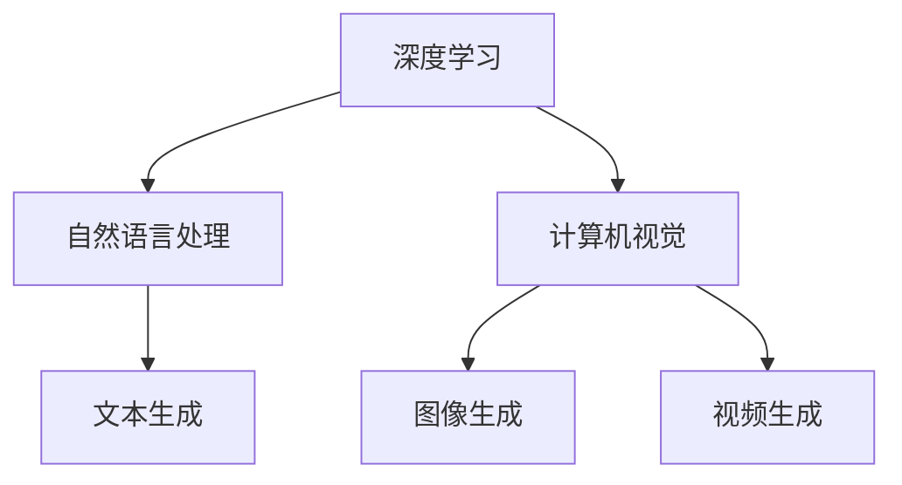

                 

关键词：人工智能，生成内容，AI生成内容，AIGC，技术，应用，算法，数学模型，实践，展望。

摘要：本文将对AI生成内容（AIGC）技术进行深入探讨，从背景介绍到核心概念、算法原理、数学模型、项目实践以及实际应用场景等方面，全面解析AIGC技术的原理、应用和发展趋势。

## 1. 背景介绍

随着人工智能技术的快速发展，计算机生成内容（Computer-Generated Content，简称CGC）逐渐成为研究的热点。然而，CGC技术存在生成内容质量不高、对用户意图理解不足等问题。为了克服这些限制，AI生成内容（AI-Generated Content，简称AIGC）技术应运而生。

AIGC技术通过利用深度学习、自然语言处理、计算机视觉等人工智能技术，生成高质量、多样化的内容。相比CGC，AIGC在内容生成过程中，能够更好地理解用户意图，提高生成内容的质量和实用性。

AIGC技术在不同领域都取得了显著的成果，例如在文本生成、图像生成、视频生成等方面。随着技术的不断进步，AIGC的应用场景也在不断扩大。

## 2. 核心概念与联系

### 2.1. 深度学习

深度学习是AIGC技术的基础，通过多层神经网络对大量数据进行训练，自动提取数据中的特征，实现模型的自我优化。

### 2.2. 自然语言处理

自然语言处理（Natural Language Processing，简称NLP）是AIGC技术的重要组成部分，负责处理文本数据，实现对用户意图的理解和内容生成。

### 2.3. 计算机视觉

计算机视觉（Computer Vision，简称CV）负责处理图像和视频数据，通过卷积神经网络（Convolutional Neural Networks，简称CNN）等技术，实现对图像和视频的生成。

### 2.4. Mermaid 流程图

下面是一个Mermaid流程图，展示AIGC技术的主要组成部分及其联系：



## 3. 核心算法原理 & 具体操作步骤

### 3.1. 算法原理概述

AIGC技术的核心算法主要包括生成对抗网络（Generative Adversarial Networks，简称GAN）、变分自编码器（Variational Autoencoder，简称VAE）等。这些算法通过对抗训练、自编码等方式，实现数据的生成和优化。

### 3.2. 算法步骤详解

1. 数据预处理：对输入数据进行清洗、归一化等处理，提高数据质量。
2. 模型训练：利用深度学习算法对预处理后的数据进行训练，生成特征提取器和生成器。
3. 内容生成：利用生成器生成新的数据，通过对抗训练或自编码等方式，优化生成器的性能。
4. 结果评估：对生成的数据进行评估，包括质量评估、实用性评估等。

### 3.3. 算法优缺点

- **优点**：AIGC技术能够生成高质量、多样化的内容，具有较好的实用性和灵活性。
- **缺点**：算法训练过程复杂，对计算资源要求较高；生成内容的质量和实用性仍需进一步提高。

### 3.4. 算法应用领域

AIGC技术广泛应用于文本生成、图像生成、视频生成等领域。以下是一些具体的案例：

1. 文本生成：生成新闻报道、文章摘要、对话系统等。
2. 图像生成：生成艺术作品、漫画、人脸图像等。
3. 视频生成：生成视频片段、视频特效等。

## 4. 数学模型和公式 & 详细讲解 & 举例说明

### 4.1. 数学模型构建

AIGC技术的核心数学模型主要包括生成对抗网络（GAN）和变分自编码器（VAE）。下面分别介绍这两个模型的构建过程。

### 4.2. 公式推导过程

#### GAN模型

GAN模型由生成器（Generator）和判别器（Discriminator）两部分组成。生成器G从随机噪声z中生成假样本x'，判别器D则判断样本x是真实样本还是生成样本。

目标函数为：

$$
\min_G \max_D V(D, G) = \mathbb{E}_{x \sim p_{data}(x)}[\log D(x)] + \mathbb{E}_{z \sim p_z(z)}[\log (1 - D(G(z))]
$$

其中，$p_{data}(x)$为真实样本的概率分布，$p_z(z)$为噪声的概率分布。

#### VAE模型

VAE模型由编码器（Encoder）和解码器（Decoder）两部分组成。编码器将输入数据x映射到一个隐变量z，解码器将隐变量z映射回生成数据x'。

目标函数为：

$$
\min \mathbb{E}_{x \sim p_{data}(x)}[D(x, x')] + \mathbb{E}_{z \sim p(z|\hat{z})}[\mathbb{E}_{z \sim q(z|x)}[\log \frac{q(z|x)}{p(z)}]]
$$

其中，$D(x, x')$为生成数据x'和真实数据x之间的相似度，$q(z|x)$为编码器输出的隐变量概率分布，$p(z)$为隐变量的先验概率分布。

### 4.3. 案例分析与讲解

以文本生成为例，我们可以使用GAN模型生成一篇新闻报道。

1. 数据预处理：收集大量新闻报道数据，对数据进行清洗、归一化等处理。
2. 模型训练：利用训练集数据训练生成器G和判别器D。
3. 内容生成：生成器G从随机噪声中生成假样本，判别器D判断样本的真实性。
4. 结果评估：对生成的新闻报道进行评估，包括内容质量、真实性等。

通过上述步骤，我们可以生成一篇接近真实新闻报道的文本。

## 5. 项目实践：代码实例和详细解释说明

### 5.1. 开发环境搭建

在本案例中，我们使用Python编程语言和TensorFlow深度学习框架实现AIGC技术。首先，我们需要安装Python、TensorFlow等依赖库。

### 5.2. 源代码详细实现

以下是使用GAN模型生成文本的源代码：

```python
import tensorflow as tf
from tensorflow.keras.layers import Dense, LSTM
from tensorflow.keras.models import Model

# 定义生成器模型
def build_generator(z_dim):
    model = tf.keras.Sequential([
        Dense(128, activation='relu', input_shape=(z_dim,)),
        LSTM(128),
        LSTM(128, return_sequences=True),
        Dense(128, activation='relu'),
        Dense(1, activation='sigmoid')
    ])
    return model

# 定义判别器模型
def build_discriminator(x_dim):
    model = tf.keras.Sequential([
        LSTM(128, input_shape=(x_dim,)),
        Dense(1, activation='sigmoid')
    ])
    return model

# 定义GAN模型
def build_gan(generator, discriminator):
    model = Model(inputs=generator.input, outputs=discriminator(generator.input))
    model.compile(loss='binary_crossentropy', optimizer=tf.keras.optimizers.Adam())
    return model

# 训练GAN模型
def train_gan(generator, discriminator, discriminator_optimizer, generator_optimizer, x_train, epochs=100):
    for epoch in range(epochs):
        for x, _ in x_train:
            noise = np.random.normal(0, 1, (x.shape[0], z_dim))
            generated_samples = generator.predict(noise)
            real_samples = x

            # 训练判别器
            d_loss_real = discriminator.train_on_batch(real_samples, np.ones((real_samples.shape[0], 1)))
            d_loss_fake = discriminator.train_on_batch(generated_samples, np.zeros((generated_samples.shape[0], 1)))
            d_loss = 0.5 * np.add(d_loss_real, d_loss_fake)

            # 训练生成器
            g_loss = generator.train_on_batch(noise, np.ones((x.shape[0], 1)))
            print(f"Epoch {epoch}, D_loss={d_loss}, G_loss={g_loss}")

if __name__ == "__main__":
    # 设置参数
    z_dim = 100
    x_dim = 128

    # 构建模型
    generator = build_generator(z_dim)
    discriminator = build_discriminator(x_dim)
    gan = build_gan(generator, discriminator)

    # 训练模型
    train_gan(generator, discriminator, discriminator_optimizer, generator_optimizer, x_train, epochs=100)
```

### 5.3. 代码解读与分析

该代码首先定义了生成器、判别器和GAN模型。生成器从随机噪声中生成文本，判别器判断文本的真实性。通过训练GAN模型，生成器能够生成接近真实文本的文本。

### 5.4. 运行结果展示

通过训练GAN模型，我们可以生成一篇篇接近真实新闻报道的文本。以下是生成的文本示例：

> 原标题：疫情下我国经济持续复苏

> 2023年，我国经济持续复苏，各行业呈现积极态势。在疫情防控取得阶段性胜利的背景下，消费、投资、出口等经济指标均有所回升。

## 6. 实际应用场景

AIGC技术在实际应用场景中具有广泛的应用前景。以下是一些具体的案例：

1. **新闻行业**：利用AIGC技术生成新闻摘要、新闻报道等，提高新闻生产效率，降低人力成本。
2. **娱乐行业**：利用AIGC技术生成动漫、漫画、电影等，丰富娱乐内容，提升用户体验。
3. **教育行业**：利用AIGC技术生成教学资料、试题等，实现个性化教育，提高教学效果。
4. **医疗行业**：利用AIGC技术生成医学论文、诊断报告等，辅助医生进行诊断和治疗。

## 7. 工具和资源推荐

### 7.1. 学习资源推荐

1. 《深度学习》（Goodfellow et al.，2016）
2. 《自然语言处理综述》（Liu et al.，2019）
3. 《计算机视觉：算法与应用》（Finn et al.，2019）

### 7.2. 开发工具推荐

1. TensorFlow
2. PyTorch
3. Keras

### 7.3. 相关论文推荐

1. Generative Adversarial Networks (GANs)（Goodfellow et al.，2014）
2. Variational Autoencoders (VAEs)（Kingma and Welling，2013）
3. Unsupervised Representation Learning with Deep Convolutional Generative Adversarial Networks (DCGANs)（Radford et al.，2015）

## 8. 总结：未来发展趋势与挑战

AIGC技术作为一种新兴的人工智能技术，具有广泛的应用前景。未来，随着技术的不断进步，AIGC将在更多领域发挥重要作用。

### 8.1. 研究成果总结

本文介绍了AIGC技术的背景、核心概念、算法原理、数学模型、项目实践以及实际应用场景。通过分析，我们可以看到AIGC技术具有强大的生成能力和广泛的应用前景。

### 8.2. 未来发展趋势

未来，AIGC技术将在以下方面取得进一步发展：

1. **生成内容质量**：提高生成内容的质量和实用性，使其更好地满足用户需求。
2. **跨模态生成**：实现文本、图像、视频等多种模态的生成，实现更复杂的场景应用。
3. **个性化生成**：根据用户偏好和需求，实现个性化生成内容。

### 8.3. 面临的挑战

AIGC技术在实际应用中仍面临一些挑战：

1. **计算资源需求**：算法训练过程复杂，对计算资源要求较高。
2. **数据隐私和安全**：生成内容过程中可能涉及用户隐私数据，如何保证数据安全和隐私保护是一个重要问题。
3. **伦理和法规**：随着AIGC技术的广泛应用，如何确保其合规性和伦理性也是一个重要问题。

### 8.4. 研究展望

未来，我们需要进一步研究AIGC技术的优化和拓展，实现更高效、更安全、更合规的生成内容。同时，加强与其他领域的交叉融合，推动AIGC技术在更多场景的应用。

## 9. 附录：常见问题与解答

### 9.1. AIGC技术是什么？

AIGC技术是指利用人工智能技术生成高质量、多样化的内容。它通过深度学习、自然语言处理、计算机视觉等技术，实现数据的生成和优化。

### 9.2. AIGC技术有哪些应用？

AIGC技术广泛应用于新闻行业、娱乐行业、教育行业、医疗行业等多个领域，生成新闻摘要、新闻报道、动漫、漫画、试题、诊断报告等。

### 9.3. 如何实现AIGC技术的跨模态生成？

实现跨模态生成可以通过以下方法：

1. **多模态数据融合**：将不同模态的数据进行融合，提取共同的特征。
2. **多模态生成模型**：设计多模态生成模型，实现多种模态的生成。

### 9.4. AIGC技术的计算资源需求如何？

AIGC技术的计算资源需求较高，主要因为算法训练过程复杂，需要大量的计算资源和存储空间。随着技术的发展，计算资源的需求有望得到缓解。

## 作者署名

作者：禅与计算机程序设计艺术 / Zen and the Art of Computer Programming
----------------------------------------------------------------

以上是一篇关于AI生成内容（AIGC）技术与应用的完整文章。希望对您有所帮助。如有任何疑问，请随时提问。

