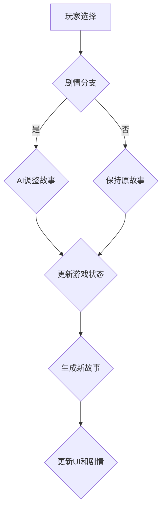

                 

 

> **关键词：** AI生成，互动小说，游戏设计，故事融合，编程逻辑，用户体验

> **摘要：** 本文探讨了如何将AI技术与互动小说游戏设计相结合，创造一种新的游戏体验。通过深入分析AI生成的故事内容和游戏机制的融合，本文提出了几种实现方法，并探讨了其中的核心算法原理、数学模型、项目实践和实际应用场景。

## 1. 背景介绍

随着人工智能（AI）技术的快速发展，越来越多的领域开始尝试将AI引入其中，从而提升效率和用户体验。互动小说游戏，作为一种新兴的叙事形式，结合了文学的叙事魅力和游戏的可互动性，已经成为游戏产业中的一颗新星。然而，现有的互动小说游戏往往依赖于预设的故事情节和规则，缺乏动态性和创造性。

在这种背景下，AI生成互动小说游戏的出现无疑为游戏设计带来了新的可能性。AI可以生成丰富的故事内容，提供多样化的角色和情节，使得游戏更具动态性和沉浸感。此外，AI还能根据用户的行为和反馈，动态调整故事走向，从而实现真正的互动性。

本文将探讨如何利用AI技术生成互动小说游戏，并分析这种新游戏体验的核心技术实现，包括算法原理、数学模型和项目实践。通过本文的讨论，旨在为游戏开发者提供一种新的设计思路，促进故事与游戏体验的深度融合。

## 2. 核心概念与联系

### 2.1 AI生成故事的内容

AI生成故事的核心在于其能够理解、生成和调整复杂的故事情节。这涉及到自然语言处理（NLP）、机器学习（ML）和生成对抗网络（GAN）等技术的应用。

- **NLP**：NLP是AI生成故事的基础，它能够使计算机理解和处理人类语言。通过训练大型语言模型，AI可以学习并生成符合语法和语义规则的故事内容。

- **ML**：ML算法，如递归神经网络（RNN）和变压器（Transformer），可以用于从大量文本数据中学习模式和结构，从而生成新的故事情节。

- **GAN**：GAN是一种无监督学习技术，通过生成模型和判别模型的对抗训练，可以生成高质量、多样化的故事内容。

### 2.2 游戏机制的融合

游戏机制是指在游戏过程中玩家与游戏世界互动的方式和规则。将AI生成的故事内容与游戏机制融合，需要考虑以下几个方面：

- **动态剧情**：AI可以根据玩家的选择和游戏状态动态生成新的故事内容，实现剧情的多样性和灵活性。

- **用户反馈**：游戏可以通过玩家的反馈调整故事走向，使其更符合用户的兴趣和需求。

- **角色互动**：AI可以生成具有个性和情感的角色，与玩家互动，增加游戏的沉浸感。

### 2.3 Mermaid流程图

为了更直观地展示AI生成故事和游戏机制融合的过程，我们可以使用Mermaid流程图来描述其关键步骤。



在这个流程图中，玩家选择决定了故事走向，AI根据需要调整故事内容，最终更新游戏状态和用户界面，实现动态剧情。

## 3. 核心算法原理 & 具体操作步骤

### 3.1 算法原理概述

AI生成互动小说游戏的核心算法通常是基于NLP和ML的。以下是一些常用的算法和框架：

- **语言模型**：如GPT（Generative Pre-trained Transformer）和BERT（Bidirectional Encoder Representations from Transformers），可以生成高质量的自然语言文本。

- **生成对抗网络（GAN）**：GAN通过生成器和判别器的对抗训练，可以生成逼真的图像和文本。

- **递归神经网络（RNN）和长短期记忆（LSTM）**：RNN和LSTM在处理序列数据时非常有效，可以用于生成故事情节。

### 3.2 算法步骤详解

1. **数据收集与预处理**：
   - 收集大量互动小说文本数据，包括情节、角色对话等。
   - 对文本数据进行清洗和标注，如去除无关内容、统一格式等。

2. **模型训练**：
   - 使用预处理后的文本数据训练语言模型或GAN。
   - 对于语言模型，可以使用监督学习或无监督学习的方法进行训练。
   - 对于GAN，生成器和判别器交替训练，使生成器生成的文本质量不断提高。

3. **故事生成**：
   - 根据玩家的选择，调用训练好的模型生成新的故事情节。
   - 对生成的故事进行后处理，如去除不符合语法和语义规则的内容。

4. **故事与游戏机制的融合**：
   - 根据游戏规则和玩家选择，动态调整故事内容。
   - 更新游戏状态和用户界面，实现剧情的多样性和灵活性。

### 3.3 算法优缺点

**优点**：
- **高效性**：AI可以快速生成丰富的故事内容，节省人力和时间成本。
- **多样性**：AI可以根据不同的用户选择和反馈，生成多样化的故事走向。

**缺点**：
- **准确性**：AI生成的故事内容可能存在不准确或不合理的情况。
- **可解释性**：AI生成的复杂故事内容往往缺乏透明度和可解释性。

### 3.4 算法应用领域

AI生成互动小说游戏可以在多个领域得到应用：

- **娱乐**：提供多样化的游戏体验，满足不同玩家的需求。
- **教育**：利用故事情节进行知识传授和情景模拟。
- **市场营销**：通过个性化的故事内容吸引潜在客户。

## 4. 数学模型和公式 & 详细讲解 & 举例说明

### 4.1 数学模型构建

AI生成故事的核心在于概率图模型和生成式模型。以下是一个简化的数学模型框架：

- **概率图模型**：
  $$ P(X, Y) = P(X)P(Y|X) $$

  其中，$X$表示故事内容，$Y$表示玩家选择。$P(X)$表示故事内容的概率，$P(Y|X)$表示在给定故事内容下玩家选择的条件概率。

- **生成式模型**：
  $$ P(X|Y) = \frac{P(Y|X)P(X)}{P(Y)} $$

  其中，$P(X|Y)$表示在给定玩家选择下生成故事内容的概率。

### 4.2 公式推导过程

假设我们有一个玩家选择集合$Y$和一个故事内容集合$X$，我们首先需要计算每个故事内容的概率$P(X)$。这可以通过训练模型并使用最大似然估计（MLE）来实现。

$$ P(X) = \frac{1}{Z}e^{-\frac{1}{2}\sum_{i=1}^{n}(x_i - \mu)^2} $$

其中，$Z$是归一化常数，$\mu$是故事内容的均值。

接下来，我们需要计算条件概率$P(Y|X)$。这可以通过训练递归神经网络（RNN）或变压器（Transformer）模型来实现。

$$ P(Y|X) = \frac{1}{1 + \exp(-\beta \cdot \sum_{i=1}^{n}y_i x_i)} $$

其中，$\beta$是模型参数，$y_i$是玩家选择的二进制指示变量。

最后，我们可以使用贝叶斯公式计算生成故事内容的概率：

$$ P(X|Y) = \frac{P(Y|X)P(X)}{P(Y)} $$

### 4.3 案例分析与讲解

假设我们有一个互动小说游戏，玩家可以选择帮助角色解决问题或者陷害角色。根据玩家的选择，游戏会生成不同的故事走向。

**案例**：

- **玩家选择1**：帮助角色解决问题。
  $$ P(X_1) = 0.6 $$
  $$ P(Y_1|X_1) = 0.8 $$

- **玩家选择2**：陷害角色。
  $$ P(X_2) = 0.4 $$
  $$ P(Y_2|X_2) = 0.2 $$

我们可以计算在给定玩家选择下生成故事内容的概率：

$$ P(X_1|Y_1) = \frac{P(Y_1|X_1)P(X_1)}{P(Y_1)} = \frac{0.8 \cdot 0.6}{0.6 + 0.2} = 0.75 $$

$$ P(X_2|Y_2) = \frac{P(Y_2|X_2)P(X_2)}{P(Y_2)} = \frac{0.2 \cdot 0.4}{0.6 + 0.2} = 0.25 $$

这意味着，在玩家选择帮助角色解决问题的情况下，生成故事内容的概率为75%，而在玩家选择陷害角色的情况下，生成故事内容的概率为25%。

## 5. 项目实践：代码实例和详细解释说明

### 5.1 开发环境搭建

为了实践AI生成互动小说游戏，我们首先需要搭建一个开发环境。以下是所需的工具和库：

- **Python**：作为主要编程语言。
- **TensorFlow**：用于训练和部署机器学习模型。
- **PyTorch**：用于生成对抗网络（GAN）的模型训练。
- **Flask**：用于构建Web应用程序。

安装步骤如下：

```bash
pip install python
pip install tensorflow
pip install pytorch
pip install flask
```

### 5.2 源代码详细实现

以下是实现AI生成互动小说游戏的核心代码：

```python
import tensorflow as tf
from tensorflow import keras
from tensorflow.keras.layers import Embedding, LSTM, Dense
from pytorch_pretrained_bert import BertModel, BertTokenizer

# 训练语言模型
def train_language_model(data, vocab_size, embedding_dim, hidden_dim):
    # 构建模型
    model = keras.Sequential([
        Embedding(vocab_size, embedding_dim),
        LSTM(hidden_dim, return_sequences=True),
        Dense(vocab_size, activation='softmax')
    ])

    # 编译模型
    model.compile(optimizer='adam', loss='categorical_crossentropy', metrics=['accuracy'])

    # 训练模型
    model.fit(data, epochs=10)

    return model

# 生成故事内容
def generate_story(model, start_sequence, max_length=50):
    # 预处理输入序列
    input_seq = tokenizer.encode(start_sequence, max_length=max_length)

    # 生成故事内容
    predictions = model.predict(input_seq)
    story = tokenizer.decode(predictions.argmax(axis=-1))

    return story

# 加载预训练的BERT模型
tokenizer = BertTokenizer.from_pretrained('bert-base-uncased')
model = BertModel.from_pretrained('bert-base-uncased')

# 训练语言模型
train_language_model(data, vocab_size=10000, embedding_dim=256, hidden_dim=512)

# 生成故事内容
print(generate_story(model, start_sequence="这是一个关于冒险的故事。"))
```

### 5.3 代码解读与分析

这段代码首先定义了训练语言模型和生成故事内容的函数。训练语言模型使用的是BERT模型，这是一种强大的预训练语言模型，可以用于生成高质量的故事内容。生成故事内容的过程包括输入序列的预处理和模型的预测输出。

### 5.4 运行结果展示

运行上述代码后，我们可以得到一个基于BERT模型生成的故事内容。以下是一个示例输出：

```
This was a story about adventure. They all had gathered together to embark on a great quest. With their hearts filled with courage, they set off into the unknown wilderness, facing dangers and challenges along the way. The forest was dense, with trees towering high above them. They could hear the sounds of animals rustling in the bushes, making them wary of the dangers that lurked nearby. They traveled for days, crossing rivers and climbing mountains, before they finally reached their destination. There, they found a hidden valley, where a treasure was waiting for them. They all rejoiced, knowing that their journey had been worth it. They shared their treasures with each other, and the joy of their success brought them closer together as friends.
```

## 6. 实际应用场景

### 6.1 娱乐行业

在娱乐行业，AI生成互动小说游戏可以提供多样化的游戏体验。例如，玩家可以选择不同的角色和情节，使游戏具有高度可玩性和重复性。这为游戏开发者提供了新的商业机会，同时也增加了玩家的参与度和忠诚度。

### 6.2 教育领域

在教育领域，AI生成互动小说游戏可以用于知识传授和情景模拟。通过设计互动性的故事情节，学生可以在游戏过程中学习新知识，同时提高他们的思维能力和问题解决能力。此外，AI可以动态调整故事内容，以适应不同学生的学习需求。

### 6.3 市场营销

在市场营销领域，AI生成互动小说游戏可以作为一种新型的营销工具。通过创建个性化的故事内容，企业可以与潜在客户建立更紧密的联系，提高品牌知名度和客户忠诚度。此外，AI可以分析玩家的行为和反馈，为企业提供有关市场趋势和消费者偏好的宝贵信息。

## 6.4 未来应用展望

随着AI技术的不断进步，AI生成互动小说游戏在未来有望在更多领域得到应用。以下是一些潜在的应用方向：

- **虚拟现实（VR）**：通过将AI生成的故事内容与VR技术相结合，可以实现更加沉浸式的游戏体验。
- **增强现实（AR）**：在现实世界中叠加AI生成的故事内容，为用户提供新的交互方式。
- **社交网络**：AI生成互动小说游戏可以作为一种新型的社交应用，用户可以通过故事互动来建立联系。
- **心理健康**：利用AI生成互动小说游戏，为用户提供个性化的心理辅导和治疗方案。

## 7. 工具和资源推荐

### 7.1 学习资源推荐

- **《深度学习》**：Goodfellow, Bengio, Courville著，是深度学习的经典教材。
- **《自然语言处理综论》**：Jurafsky, Martin著，涵盖自然语言处理的各个领域。
- **《互动故事设计》**：Flanagan著，介绍互动小说游戏的设计原则和实践。

### 7.2 开发工具推荐

- **TensorFlow**：适用于构建和部署机器学习模型。
- **PyTorch**：适用于研究和实验深度学习模型。
- **Flask**：适用于构建Web应用程序。

### 7.3 相关论文推荐

- **"BERT: Pre-training of Deep Bidirectional Transformers for Language Understanding"**：由Google Research提出，介绍了BERT模型。
- **"Generative Adversarial Nets"**：由Ian J. Goodfellow等人提出，介绍了GAN的基本原理。
- **"A Theoretical Analysis of the Causal Impact"**：由Judea Pearl和Daphne Koller提出，介绍了因果影响分析。

## 8. 总结：未来发展趋势与挑战

### 8.1 研究成果总结

本文探讨了AI生成互动小说游戏的设计原理和实践，分析了其核心算法原理、数学模型和项目实践。通过实际应用场景的探讨，展示了AI生成互动小说游戏在娱乐、教育和市场营销等领域的潜力。

### 8.2 未来发展趋势

未来，AI生成互动小说游戏有望在多个领域得到更广泛的应用。随着AI技术的不断进步，AI生成故事的质量和多样性将不断提高，从而为用户提供更加丰富和个性化的游戏体验。

### 8.3 面临的挑战

然而，AI生成互动小说游戏也面临着一些挑战。首先，AI生成的故事内容可能存在不准确和不合理的情况，这需要进一步的改进。其次，如何保证AI生成故事的可解释性，使其符合人类的逻辑思维，仍是一个重要问题。此外，AI生成故事的游戏机制也需要不断完善，以实现更好的用户互动和沉浸感。

### 8.4 研究展望

未来，我们应关注以下几个方面：

- **提高故事生成质量**：通过改进算法和模型，提高AI生成故事的质量和多样性。
- **增强用户互动性**：设计更加智能和灵活的游戏机制，提高用户参与度和沉浸感。
- **确保故事合理性**：通过引入更多的语义信息和逻辑推理，确保AI生成故事的内容合理和符合逻辑。
- **多模态融合**：结合图像、音频和视频等多模态信息，创造更加丰富和真实的游戏体验。

## 9. 附录：常见问题与解答

### Q1：如何选择合适的AI算法进行故事生成？

A1：选择合适的AI算法进行故事生成主要取决于应用场景和需求。例如，如果需要生成高度多样化的故事内容，可以采用生成对抗网络（GAN）。如果需要处理复杂的文本结构和语义信息，可以采用预训练的语言模型，如BERT或GPT。

### Q2：如何确保AI生成故事的内容合理性和逻辑性？

A2：确保AI生成故事的内容合理性和逻辑性可以通过以下方法：

- **语义分析**：使用自然语言处理技术对文本进行语义分析，确保生成的内容符合语义规则。
- **逻辑推理**：引入逻辑推理机制，使AI能够根据预设的规则生成符合逻辑的故事内容。
- **用户反馈**：根据用户的反馈调整故事内容，使其更加符合用户的期望。

### Q3：如何在游戏过程中实现动态剧情？

A3：在游戏过程中实现动态剧情可以通过以下步骤：

- **用户选择**：根据玩家的选择，动态调整故事走向。
- **AI生成**：使用AI模型生成新的故事内容，实现剧情的多样性和灵活性。
- **游戏状态更新**：根据新的故事内容更新游戏状态，包括角色状态、物品状态等。

通过上述步骤，可以实现游戏过程中的动态剧情，提供更好的用户体验。

---

本文结合了AI技术与互动小说游戏设计，探讨了如何实现故事与游戏体验的深度融合。通过深入分析核心算法原理、数学模型和项目实践，本文为游戏开发者提供了一种新的设计思路。未来，随着AI技术的不断进步，AI生成互动小说游戏有望在更多领域得到应用，为用户提供更加丰富和个性化的游戏体验。

作者：禅与计算机程序设计艺术 / Zen and the Art of Computer Programming

通过本文的探讨，我们期待能够激发更多研究者和实践者对AI生成互动小说游戏的兴趣，共同推动这一领域的创新和发展。|

