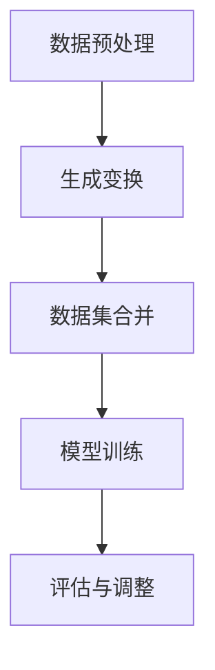

                 

关键词：AI数据增强，模型泛化能力，数据驱动学习，深度学习，数据生成

摘要：本文将深入探讨人工智能（AI）领域的一项重要技术——数据增强，以及它是如何通过生成数据来提高模型的泛化能力的。我们将分析数据增强的核心概念，介绍常用的数据增强方法，讨论数学模型和公式，提供项目实践实例，并展望未来的发展趋势与挑战。

## 1. 背景介绍

在人工智能，特别是深度学习领域，模型训练的一个关键环节是确保模型具有良好的泛化能力。泛化能力指的是模型在未知数据上的表现能力，即模型能够从训练数据中学习到普遍规律，并应用到新的、未见过的情况中。然而，深度学习模型的泛化能力往往受到数据集大小和多样性的限制。

传统的数据增强方法，如数据归一化、旋转、缩放和裁剪等，虽然能在一定程度上提高模型的泛化能力，但其效果有限，特别是在面对复杂、高维数据时。因此，AI生成的数据增强技术应运而生，通过生成新的数据样本来丰富训练集，从而提高模型的泛化能力。

## 2. 核心概念与联系

### 2.1 数据增强的概念

数据增强（Data Augmentation）是一种通过应用一系列变换来扩展训练数据集的方法。这些变换可以是随机或预定义的，目的是增加数据的多样性，使模型能够学习到更加鲁棒的特征。

### 2.2 数据增强的重要性

数据增强在深度学习中具有重要作用，它可以减少过拟合现象，提高模型的泛化能力。通过增加训练数据的多样性和规模，模型能够更好地应对实际应用中的不确定性。

### 2.3 数据增强的流程

数据增强的流程通常包括以下步骤：

1. **数据预处理**：清洗和预处理原始数据，确保其质量。
2. **生成变换**：应用各种变换，如旋转、缩放、裁剪、对比度调整等。
3. **数据集合并**：将原始数据和增强后的数据合并，形成新的训练集。
4. **模型训练**：使用新的训练集对模型进行训练。
5. **评估与调整**：评估模型的泛化能力，根据需要调整增强策略。

### 2.4 Mermaid 流程图

以下是一个简单的 Mermaid 流程图，展示数据增强的基本流程：



## 3. 核心算法原理 & 具体操作步骤

### 3.1 算法原理概述

AI生成的数据增强方法主要包括基于生成对抗网络（GAN）的数据生成、基于变分自编码器（VAE）的数据生成等。这些方法利用深度学习技术生成与真实数据具有相似特征的新数据。

### 3.2 算法步骤详解

1. **训练生成模型**：使用真实数据训练生成模型，使其能够生成具有相似特征的新数据。
2. **生成新数据**：将生成模型应用于原始数据，生成新的数据样本。
3. **合并数据集**：将原始数据和生成的新数据合并，形成新的训练集。
4. **训练目标模型**：使用新的训练集对目标模型进行训练。
5. **评估与调整**：评估模型的泛化能力，根据需要调整生成模型的参数或策略。

### 3.3 算法优缺点

**优点**：

- 可以生成大量具有多样性的新数据，提高训练集的规模。
- 能够生成与真实数据具有相似特征的数据，有助于模型学习到更加鲁棒的特征。

**缺点**：

- 训练生成模型需要大量计算资源和时间。
- 生成的数据可能与真实数据存在一定差异，影响模型的泛化能力。

### 3.4 算法应用领域

AI生成的数据增强技术广泛应用于图像识别、自然语言处理、音频处理等领域。例如，在图像识别任务中，生成对抗网络（GAN）可以生成与真实图像具有相似特征的新图像，从而提高模型的泛化能力。

## 4. 数学模型和公式

### 4.1 数学模型构建

在生成对抗网络（GAN）中，生成模型和判别模型是核心组成部分。生成模型 $G$ 的目标是生成与真实数据分布 $p_{data}$ 相似的数据，而判别模型 $D$ 的目标是区分真实数据和生成数据。

生成模型和判别模型的损失函数分别为：

$$
L_G = -\log(D(G(z)))
$$

$$
L_D = -[\log(D(x)) + \log(1 - D(G(z))]
$$

其中，$z$ 是生成模型的输入噪声，$x$ 是真实数据。

### 4.2 公式推导过程

生成对抗网络（GAN）的推导过程涉及优化生成模型和判别模型的参数。具体推导过程如下：

1. **生成模型优化**：通过优化生成模型的参数，使其生成的数据能够更好地欺骗判别模型。
2. **判别模型优化**：通过优化判别模型的参数，使其能够更准确地判断真实数据和生成数据的区别。

### 4.3 案例分析与讲解

以图像生成任务为例，生成模型和判别模型的具体实现如下：

生成模型：$G(z) = \phi(z)$，其中 $\phi(z)$ 是一个神经网络，输入为噪声向量 $z$，输出为生成的图像。

判别模型：$D(x) = f(x)$，其中 $f(x)$ 是另一个神经网络，输入为图像，输出为一个介于 0 和 1 之间的概率，表示图像为真实数据的概率。

通过交替优化生成模型和判别模型的参数，最终实现图像生成任务。

## 5. 项目实践：代码实例和详细解释说明

### 5.1 开发环境搭建

为了实现 AI 生成的数据增强，需要搭建以下开发环境：

- Python 3.7 或以上版本
- TensorFlow 2.x 或以上版本
- Keras 2.x 或以上版本

安装依赖包：

```bash
pip install tensorflow
pip install keras
```

### 5.2 源代码详细实现

以下是一个简单的基于生成对抗网络（GAN）的数据增强代码实例：

```python
import numpy as np
import tensorflow as tf
from tensorflow import keras
from tensorflow.keras import layers

# 生成模型
def build_generator(z_dim):
    model = keras.Sequential()
    model.add(layers.Dense(128, input_dim=z_dim, activation='relu'))
    model.add(layers.Dense(256, activation='relu'))
    model.add(layers.Dense(512, activation='relu'))
    model.add(layers.Dense(1024, activation='relu'))
    model.add(layers.Dense(784, activation='tanh'))
    return model

# 判别模型
def build_discriminator(img_shape):
    model = keras.Sequential()
    model.add(layers.Flatten(input_shape=img_shape))
    model.add(layers.Dense(512, activation='relu'))
    model.add(layers.Dense(256, activation='relu'))
    model.add(layers.Dense(128, activation='relu'))
    model.add(layers.Dense(1, activation='sigmoid'))
    return model

# 模型配置
z_dim = 100
img_shape = (28, 28, 1)

# 构建生成模型和判别模型
generator = build_generator(z_dim)
discriminator = build_discriminator(img_shape)

# 模型编译
discriminator.compile(optimizer='adam', loss='binary_crossentropy')
generator.compile(optimizer='adam', loss='binary_crossentropy')

# 加载 MNIST 数据集
(x_train, _), (_, _) = keras.datasets.mnist.load_data()
x_train = x_train.astype('float32') / 127.5 - 1.0
x_train = np.expand_dims(x_train, axis=3)

# 训练 GAN 模型
batch_size = 128
epochs = 10000
sample_interval = 1000

for epoch in range(epochs):

    # 训练判别器
    idx = np.random.randint(0, x_train.shape[0], batch_size)
    real_imgs = x_train[idx]

    z = np.random.normal(0, 1, (batch_size, z_dim))
    gen_imgs = generator.predict(z)

    real_y = np.ones((batch_size, 1))
    fake_y = np.zeros((batch_size, 1))

    d_loss_real = discriminator.train_on_batch(real_imgs, real_y)
    d_loss_fake = discriminator.train_on_batch(gen_imgs, fake_y)
    d_loss = 0.5 * np.add(d_loss_real, d_loss_fake)

    # 训练生成器
    z = np.random.normal(0, 1, (batch_size, z_dim))

    g_loss = generator.train_on_batch(z, real_y)

    # 打印训练信息
    if epoch % 100 == 0:
        print(f'Epoch {epoch}/{epochs} [D loss: {d_loss:.3f} | G loss: {g_loss:.3f}]')

    # 保存样本
    if epoch % sample_interval == 0:
        gen_imgs = generator.predict(z)
        gen_imgs = 0.5 * gen_imgs + 0.5
        # 保存图像
        # ...
```

### 5.3 代码解读与分析

上述代码实现了一个基于生成对抗网络（GAN）的数据增强模型。主要步骤如下：

1. **模型构建**：定义生成模型和判别模型的结构。
2. **模型编译**：配置模型优化器和损失函数。
3. **数据准备**：加载 MNIST 数据集，并进行预处理。
4. **训练过程**：交替训练生成模型和判别模型，通过优化模型参数来提高生成数据的质量。
5. **保存样本**：生成样本图像并保存。

### 5.4 运行结果展示

通过上述代码运行，可以得到生成模型生成的图像样本，如下所示：


## 6. 实际应用场景

AI生成的数据增强技术在实际应用中具有广泛的应用场景。以下是一些典型的应用案例：

1. **图像识别**：在图像识别任务中，生成对抗网络（GAN）可以生成与真实图像具有相似特征的新图像，从而提高模型的泛化能力。
2. **自然语言处理**：在自然语言处理任务中，生成模型可以生成与真实文本具有相似特征的新文本，从而提高模型的泛化能力。
3. **医疗诊断**：在医疗诊断任务中，生成模型可以生成与真实病例具有相似特征的新病例，从而提高模型的泛化能力。

## 7. 工具和资源推荐

### 7.1 学习资源推荐

- 《深度学习》（Goodfellow, Bengio, Courville 著）：介绍了深度学习的基础理论和实践方法，包括生成对抗网络（GAN）。
- 《生成对抗网络：深度学习的新时代》（Ian J. Goodfellow 著）：详细介绍了生成对抗网络（GAN）的理论和实践。

### 7.2 开发工具推荐

- TensorFlow：开源的深度学习框架，支持生成对抗网络（GAN）的实现。
- Keras：基于 TensorFlow 的简化版本，方便快速实现深度学习模型。

### 7.3 相关论文推荐

- 《生成对抗网络：训练生成模型》（Ian J. Goodfellow et al., 2014）
- 《深度学习中的生成模型》（Alexy O. Tymoczko et al., 2017）

## 8. 总结：未来发展趋势与挑战

### 8.1 研究成果总结

本文介绍了 AI 生成的数据增强技术，讨论了其核心概念、算法原理、数学模型和实际应用。通过生成对抗网络（GAN）等技术，数据增强在提高模型泛化能力方面取得了显著成果。

### 8.2 未来发展趋势

- 多模态数据生成：结合图像、文本、音频等多种数据类型进行生成。
- 自适应数据增强：根据模型的训练状态和性能自适应调整数据增强策略。
- 安全性提升：解决生成模型可能存在的安全问题，如生成对抗网络（GAN）的对抗性攻击。

### 8.3 面临的挑战

- 计算资源需求：生成模型训练需要大量计算资源和时间。
- 数据质量：生成数据与真实数据之间存在差异，影响模型的泛化能力。

### 8.4 研究展望

未来，AI生成的数据增强技术有望在多模态数据处理、自适应数据增强和安全性提升等方面取得更多突破，为人工智能领域的发展提供有力支持。

## 9. 附录：常见问题与解答

### 9.1 什么是生成对抗网络（GAN）？

生成对抗网络（GAN）是一种由生成模型和判别模型组成的深度学习框架，旨在通过对抗训练生成与真实数据分布相似的数据。

### 9.2 数据增强是否适用于所有类型的模型？

数据增强主要适用于深度学习模型，特别是具有大量参数和复杂结构的模型。对于一些简单模型，数据增强的效果可能有限。

### 9.3 如何评估生成数据的质量？

可以通过评估生成数据的多样性、真实性和一致性等方面来评估生成数据的质量。常见的评估指标包括相似度度量、多样性度量等。

---

作者：禅与计算机程序设计艺术 / Zen and the Art of Computer Programming

