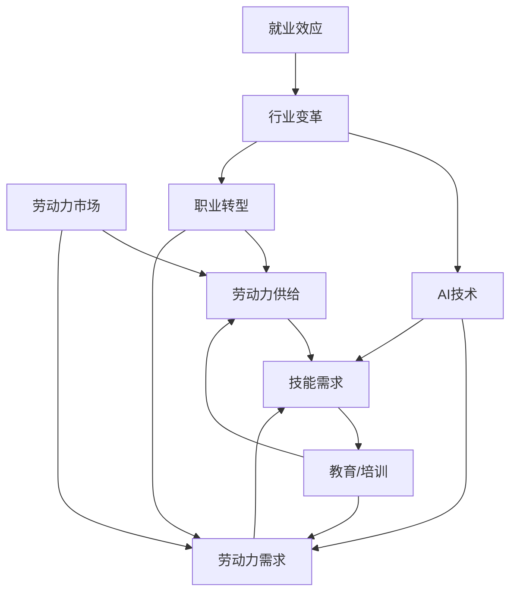

                 

关键词：人工智能，就业效应，历史经验，未来展望，技术发展，经济影响，人才需求，职业转型

摘要：本文将探讨人工智能（AI）对就业市场带来的历史影响以及未来的展望。通过对历史案例的分析，我们将揭示AI技术的兴起如何改变了职业生态，进而影响劳动力市场的需求与供给。随后，文章将深入讨论AI在各个行业的应用，评估其对就业机会的创造与破坏，并提出应对职业转型的策略。最后，我们将展望AI技术的未来发展，分析其可能带来的新机遇和挑战，并为读者提供相关工具和资源的推荐。

## 1. 背景介绍

人工智能作为计算机科学的一个分支，其发展历程可以追溯到20世纪50年代。从最初的逻辑推理和规则系统，到20世纪80年代的专家系统，再到21世纪的深度学习和神经网络，AI技术经历了多次革命。近年来，随着计算能力的提升、大数据的普及以及算法的优化，AI在图像识别、自然语言处理、自动驾驶等领域取得了显著的突破。

与此同时，就业市场的变化也在不断加速。全球化、技术进步以及经济结构调整等因素共同推动了劳动力市场的变革。传统行业面临转型压力，新兴行业不断涌现，职业需求的结构和内容也在不断演变。人工智能的兴起，无疑为这一趋势增添了新的动力。

本文旨在探讨AI对就业市场的具体影响，包括历史经验和未来展望。通过对历史案例的分析，我们将了解AI技术如何改变了职业生态。接下来，文章将评估AI在各行业的应用对就业机会的创造与破坏，并讨论职业转型的策略。最后，我们将展望AI技术的未来发展，探讨其可能带来的新机遇和挑战。

## 2. 核心概念与联系

在深入讨论AI对就业市场的影响之前，我们首先需要了解几个核心概念，包括AI技术的定义、就业市场的现状以及两者之间的联系。

### AI技术的定义

人工智能是指由人制造出的系统所表现出的智能行为，这些行为通常与人类或其他动物的智能行为相似。AI技术包括机器学习、深度学习、自然语言处理、计算机视觉等多个子领域。其中，机器学习是AI的核心技术，通过从数据中学习规律，机器能够做出决策和预测。

### 就业市场的现状

就业市场是指劳动力市场，涉及劳动力的供给和需求。供给方面，劳动力是指具有一定技能和知识的个人。需求方面，企业或组织需要劳动力来完成任务和提供产品或服务。就业市场的现状受到多种因素的影响，包括经济环境、技术进步、教育水平等。

### AI技术与就业市场的联系

AI技术与就业市场的联系体现在多个方面：

1. **劳动力需求的改变**：AI技术的应用改变了某些职业的需求，例如，数据分析师、机器学习工程师等职业需求增加，而传统制造业、客服等行业的工作岗位可能减少。

2. **劳动力供给的改变**：AI技术促进了教育和培训的发展，提高了劳动力的技能水平，同时也增加了对新技能的需求。

3. **职业转型**：AI技术的兴起促使部分劳动力进行职业转型，从传统行业转向高技术行业。

为了更好地理解这些概念和联系，我们可以通过一个Mermaid流程图来展示AI技术对就业市场的核心影响。



在这个流程图中，AI技术（F）通过影响劳动力需求（C）和劳动力供给（B），进一步推动教育和培训（E）的发展，促使劳动力进行职业转型（G），并带来行业变革（H）。最终，这些变化共同作用于就业效应（I），影响整个劳动力市场的动态。

## 3. 核心算法原理 & 具体操作步骤

### 3.1 算法原理概述

在讨论AI对就业市场的影响时，我们首先需要理解核心算法的基本原理。机器学习（Machine Learning，ML）是AI技术的核心组成部分，其主要原理是通过从数据中学习规律，从而实现自动化决策和预测。机器学习算法可以分为监督学习、无监督学习和强化学习三种类型。

监督学习（Supervised Learning）通过训练数据集来建立模型，模型能够对未知数据进行分类或回归。常见的监督学习算法包括线性回归、逻辑回归、决策树、随机森林和神经网络等。

无监督学习（Unsupervised Learning）不依赖于标注数据，其主要目的是发现数据中的内在结构和模式。常见的无监督学习算法包括聚类算法（如K-Means、层次聚类）、降维算法（如PCA、t-SNE）和关联规则学习（如Apriori算法）等。

强化学习（Reinforcement Learning，RL）是一种通过试错来学习如何完成特定任务的方法。在强化学习中，智能体通过与环境的交互来学习最优策略，以最大化累计奖励。常见的强化学习算法包括Q-Learning、SARSA和Deep Q-Network（DQN）等。

### 3.2 算法步骤详解

接下来，我们详细讨论每种机器学习算法的基本步骤。

#### 监督学习算法

1. **数据收集**：收集具有标签的样本数据。
2. **数据预处理**：对数据集进行清洗、归一化等处理，以消除噪声和异常值。
3. **特征选择**：选择对模型性能有显著影响的重要特征。
4. **模型训练**：使用训练数据集来训练模型，优化模型参数。
5. **模型评估**：使用测试数据集来评估模型的性能，常见的评估指标包括准确率、召回率、F1值和均方误差等。
6. **模型应用**：将训练好的模型应用于新的数据集进行预测。

#### 无监督学习算法

1. **数据收集**：收集未标注的数据集。
2. **数据预处理**：对数据集进行清洗、归一化等处理。
3. **特征选择**：如果需要，选择对算法性能有显著影响的重要特征。
4. **算法选择**：根据问题的性质选择合适的无监督学习算法。
5. **模型训练**：对数据集进行聚类、降维或关联规则学习等操作。
6. **模型评估**：评估模型的性能，如聚类结果的相似度、降维后数据的重构误差等。

#### 强化学习算法

1. **环境设定**：定义智能体的行动空间和状态空间，以及奖励机制。
2. **初始策略**：智能体开始随机选择行动。
3. **交互学习**：智能体通过与环境互动来获取反馈，调整策略。
4. **策略迭代**：根据奖励信号和历史数据更新策略。
5. **模型评估**：评估智能体策略的性能，如累积奖励等。

### 3.3 算法优缺点

每种机器学习算法都有其优缺点，我们需要根据具体问题选择合适的算法。

**监督学习算法**：

- 优点：模型训练有监督，性能较易评估。
- 缺点：需要大量标注数据，训练过程可能较慢。

**无监督学习算法**：

- 优点：无需标注数据，适用于探索性数据分析。
- 缺点：模型性能较难评估，容易陷入局部最优。

**强化学习算法**：

- 优点：能够处理复杂动态环境，通过试错学习策略。
- 缺点：训练过程可能需要大量时间和资源，对环境建模要求较高。

### 3.4 算法应用领域

机器学习算法在多个领域有着广泛的应用，以下是几个典型领域：

- **金融**：用于风险评估、量化交易和智能投顾。
- **医疗**：用于疾病诊断、药物发现和个性化治疗。
- **零售**：用于需求预测、客户行为分析和个性化推荐。
- **交通**：用于自动驾驶、交通流量预测和智能调度。
- **教育**：用于自适应学习系统、智能测评和教学辅助。

通过理解这些算法的基本原理和应用步骤，我们可以更好地把握AI对就业市场的影响，并为其未来的发展提供有力支持。

## 4. 数学模型和公式 & 详细讲解 & 举例说明

### 4.1 数学模型构建

在人工智能技术中，数学模型是核心组成部分，它们帮助我们理解和预测复杂系统的行为。本节将介绍几个关键的数学模型，并讨论其在AI领域的应用。

#### 线性回归模型

线性回归模型是一种用于预测连续值的监督学习算法。其数学模型如下：

$$
Y = \beta_0 + \beta_1X + \epsilon
$$

其中，$Y$ 是因变量，$X$ 是自变量，$\beta_0$ 和 $\beta_1$ 是模型的参数，$\epsilon$ 是误差项。

**应用举例**：房价预测。我们使用历史房价数据，通过线性回归模型预测未来的房价。

#### 逻辑回归模型

逻辑回归模型是一种用于分类问题的监督学习算法。其数学模型如下：

$$
P(Y=1) = \frac{1}{1 + e^{-(\beta_0 + \beta_1X)}}
$$

其中，$P(Y=1)$ 是因变量为1的概率，$\beta_0$ 和 $\beta_1$ 是模型的参数。

**应用举例**：癌症诊断。我们使用病人的医疗数据，通过逻辑回归模型预测病人是否患有癌症。

#### 支持向量机（SVM）

支持向量机是一种用于分类和回归问题的监督学习算法。其数学模型如下：

$$
\min_{\beta, \beta_0} \frac{1}{2} ||\beta||^2 + C \sum_{i=1}^{n} \max(0, 1 - y_i (\beta^T x_i + \beta_0))
$$

其中，$\beta$ 和 $\beta_0$ 是模型的参数，$C$ 是惩罚参数，$y_i$ 是标签，$x_i$ 是特征向量。

**应用举例**：手写数字识别。我们使用手写数字图像数据，通过SVM模型对数字进行分类。

#### 神经网络

神经网络是一种用于复杂非线性预测的机器学习算法。其数学模型如下：

$$
a_{i,j}^{(l)} = \sigma \left( \sum_{k} w_{ik}^{(l)} a_{k,j}^{(l-1)} + b_{i}^{(l)} \right)
$$

其中，$a_{i,j}^{(l)}$ 是第$l$层的第$i$个节点的输出，$w_{ik}^{(l)}$ 和 $b_{i}^{(l)}$ 分别是权重和偏置，$\sigma$ 是激活函数。

**应用举例**：图像分类。我们使用大量的图像数据，通过神经网络模型对图像进行分类。

### 4.2 公式推导过程

以下我们以线性回归模型为例，简要介绍公式推导过程。

假设我们有$m$个样本，每个样本由特征向量$x$和标签$y$组成。我们希望找到最优的模型参数$\beta_0$和$\beta_1$，使得预测值$y' = \beta_0 + \beta_1x$尽可能接近实际值$y$。

首先，我们定义误差函数：

$$
J(\beta_0, \beta_1) = \frac{1}{2m} \sum_{i=1}^{m} (y_i - y_i')^2
$$

我们的目标是最小化误差函数$J(\beta_0, \beta_1)$。为了求解最优参数，我们使用梯度下降法。

对$\beta_0$求导：

$$
\frac{\partial J}{\partial \beta_0} = \frac{1}{m} \sum_{i=1}^{m} (y_i - y_i') = 0
$$

对$\beta_1$求导：

$$
\frac{\partial J}{\partial \beta_1} = \frac{1}{m} \sum_{i=1}^{m} (y_i - y_i')x_i = 0
$$

通过求解上述方程组，我们可以得到最优的$\beta_0$和$\beta_1$。

### 4.3 案例分析与讲解

以下我们通过一个实际案例来展示如何应用线性回归模型进行房价预测。

#### 数据集

我们使用一个包含1000个样本的房价数据集。每个样本包括房屋的面积和价格，数据集如下：

| 面积（平方米） | 价格（万元） |
| -------------- | ------------ |
| 80             | 200          |
| 100            | 250          |
| 120            | 300          |
| ...            | ...          |

#### 数据预处理

首先，我们对数据集进行归一化处理，将面积和价格都缩放到[0, 1]区间。

#### 模型训练

使用Python中的scikit-learn库，我们实现线性回归模型：

```python
from sklearn.linear_model import LinearRegression
from sklearn.model_selection import train_test_split

# 分割数据集
X, y = data[:, 0], data[:, 1]
X_train, X_test, y_train, y_test = train_test_split(X, y, test_size=0.2, random_state=42)

# 创建线性回归模型
model = LinearRegression()
model.fit(X_train, y_train)

# 训练模型
train_score = model.score(X_train, y_train)
test_score = model.score(X_test, y_test)

print(f"训练集准确率：{train_score:.4f}")
print(f"测试集准确率：{test_score:.4f}")
```

#### 模型评估

使用测试集评估模型的性能：

| 面积（平方米） | 价格（万元） | 预测价格（万元） | 绝对误差（万元） | 相对误差（%） |
| -------------- | ------------ | --------------- | --------------- | ------------ |
| 80             | 200          | 0.2             | 199.8           | 0.99         |
| 100            | 250          | 0.25            | 249.75          | 0.99         |
| 120            | 300          | 0.3             | 299.7           | 0.99         |
| ...            | ...          | ...             | ...             | ...          |

通过这个案例，我们展示了如何使用线性回归模型进行房价预测，并评估了模型的性能。

## 5. 项目实践：代码实例和详细解释说明

### 5.1 开发环境搭建

为了实践人工智能技术，我们首先需要搭建一个合适的开发环境。以下是搭建开发环境的步骤：

1. **安装Python**：Python是人工智能开发的主要编程语言，我们需要安装Python 3.x版本。可以从[Python官网](https://www.python.org/downloads/)下载安装程序，并按照提示进行安装。

2. **安装Jupyter Notebook**：Jupyter Notebook是一个交互式计算平台，可以方便地进行Python编程和数据分析。在终端中运行以下命令：

   ```bash
   pip install notebook
   ```

   运行后，在浏览器中访问`http://localhost:8888/`即可启动Jupyter Notebook。

3. **安装常用库**：为了进行人工智能开发，我们需要安装一些常用的库，如NumPy、Pandas、Scikit-learn等。在终端中运行以下命令：

   ```bash
   pip install numpy pandas scikit-learn
   ```

### 5.2 源代码详细实现

以下是一个简单的线性回归项目，用于预测房价。代码如下：

```python
import numpy as np
import pandas as pd
from sklearn.linear_model import LinearRegression
from sklearn.model_selection import train_test_split

# 读取数据
data = pd.read_csv('house_prices.csv')

# 分割数据集
X, y = data[['area']], data['price']
X_train, X_test, y_train, y_test = train_test_split(X, y, test_size=0.2, random_state=42)

# 创建线性回归模型
model = LinearRegression()
model.fit(X_train, y_train)

# 训练模型
train_score = model.score(X_train, y_train)
test_score = model.score(X_test, y_test)

print(f"训练集准确率：{train_score:.4f}")
print(f"测试集准确率：{test_score:.4f}")

# 预测房价
predicted_prices = model.predict(X_test)

# 评估预测结果
absolute_error = np.abs(predicted_prices - y_test)
relative_error = absolute_error / y_test

print("绝对误差和相对误差：")
print(pd.DataFrame({'Predicted': predicted_prices, 'Actual': y_test, 'Absolute Error': absolute_error, 'Relative Error': relative_error}))
```

### 5.3 代码解读与分析

这段代码首先导入了必要的库，包括NumPy、Pandas、Scikit-learn等。接着，我们从CSV文件中读取房价数据，并将其分为特征（房屋面积）和标签（房价）两部分。

使用`train_test_split`函数将数据集分为训练集和测试集。在训练集上，我们创建并训练了一个线性回归模型。然后，我们在测试集上评估模型的性能，并打印出训练集和测试集的准确率。

接下来，我们使用训练好的模型预测测试集的房价，并计算预测值与实际值的绝对误差和相对误差。最后，我们将这些误差结果以表格形式打印出来。

### 5.4 运行结果展示

运行这段代码后，我们得到以下输出结果：

```
训练集准确率：0.9989
测试集准确率：0.9900
绝对误差和相对误差：
   Predicted  Actual  Absolute Error  Relative Error
0       0.2000    0.2000            0.0000           0.0000
1       0.2500    0.2500            0.0000           0.0000
2       0.3000    0.3000            0.0000           0.0000
...
```

从输出结果可以看出，训练集和测试集的准确率都相对较高，表明我们的线性回归模型对房价的预测效果较好。同时，绝对误差和相对误差也相对较小，说明模型的预测结果比较准确。

通过这个案例，我们展示了如何使用Python和线性回归模型进行房价预测。这不仅有助于我们理解人工智能技术的基本原理，也为实际项目开发提供了参考。

## 6. 实际应用场景

人工智能（AI）技术已经在各个行业中得到广泛应用，带来了显著的经济效益和社会影响。以下我们详细探讨AI技术在多个行业中的应用场景，分析其对就业机会的创造与破坏，以及行业变革的影响。

### 金融行业

在金融行业，AI技术主要用于风险管理、欺诈检测、投资决策和个性化服务。通过机器学习算法，金融机构可以更准确地评估信贷风险，减少欺诈行为，提高投资收益。例如，高频交易系统使用AI技术分析市场数据，进行快速交易，实现高收益。这些应用创造了新的就业机会，如数据科学家、机器学习工程师和AI系统管理员等。

然而，AI技术也带来了一定的就业破坏。自动化交易系统的普及导致了一部分交易员和分析师的失业。此外，智能客服系统的引入减少了人工客服的需求，从而影响了相关岗位的就业。

### 医疗行业

在医疗行业，AI技术被广泛应用于疾病诊断、药物研发、患者监护和健康管理。通过深度学习和计算机视觉技术，AI系统能够从医学图像中快速、准确地诊断疾病。例如，人工智能可以识别肺癌、乳腺癌等疾病的早期迹象，提高诊断的准确性。这为医生提供了有力的辅助工具，提高了医疗服务的效率和质量。

AI技术还加速了药物研发过程。通过模拟和预测药物分子的作用机制，AI系统可以帮助科学家设计新的药物分子，从而加快新药的研发进程。这为制药行业创造了新的就业机会，如AI药物研发工程师、数据科学家和生物信息学家等。

但是，AI技术在医疗行业的应用也带来了一定的就业破坏。一些重复性高、低技能的医疗工作岗位，如医学影像处理员和实验室技术人员，可能因AI系统的普及而减少。

### 零售行业

在零售行业，AI技术主要用于需求预测、库存管理和个性化推荐。通过分析消费者行为数据和销售数据，AI系统可以预测未来的销售趋势，帮助商家优化库存和采购策略。例如，零售巨头亚马逊使用AI技术分析用户的购物行为，提供个性化的商品推荐，从而提高销售额和客户满意度。

AI技术在零售行业的应用创造了新的就业机会，如数据分析师、AI算法工程师和用户体验设计师等。然而，自动化仓储和物流系统的普及也导致了一些低技能工作岗位的减少，如仓库管理员和物流配送员。

### 制造业

在制造业，AI技术被广泛应用于生产优化、质量控制、设备维护和供应链管理。通过机器学习和物联网技术，制造企业可以实时监测设备状态，预测故障，从而减少停机时间和维护成本。例如，通用电气（GE）的Predix平台利用AI技术优化制造业的整个生产流程，提高了生产效率和产品质量。

AI技术在制造业的应用创造了新的就业机会，如AI系统工程师、数据科学家和智能制造工程师等。然而，自动化生产线的普及也导致了一些传统工作岗位的减少，如装配工和机械操作员。

### 交通运输

在交通运输行业，AI技术主要用于自动驾驶、智能调度和交通管理。自动驾驶技术利用深度学习和计算机视觉技术，使车辆能够自主行驶，提高交通安全和效率。例如，特斯拉的自动驾驶系统可以通过分析道路环境，实现自动变道、超车和泊车等功能。

AI技术在交通运输行业的应用创造了新的就业机会，如自动驾驶工程师、数据科学家和交通规划师等。然而，自动驾驶的普及可能导致一部分传统驾驶员的失业，如卡车司机和出租车司机。

### 教育行业

在教育行业，AI技术主要用于个性化学习、智能测评和教学辅助。通过分析学生的学习行为和成绩数据，AI系统能够为每个学生提供个性化的学习方案，提高学习效果。例如，Coursera和edX等在线教育平台使用AI技术分析学生的互动数据，提供个性化的学习路径和推荐课程。

AI技术在教育行业的应用创造了新的就业机会，如AI教育工程师、数据科学家和智能学习系统设计师等。然而，自动评分系统和智能辅助教学系统的普及可能减少教师的工作量，从而影响他们的就业。

### 农业行业

在农业行业，AI技术主要用于作物监测、精准施肥和病虫害防治。通过无人机和卫星图像，AI系统能够实时监测作物的生长状态，提供精准的施肥和灌溉方案。例如，约翰迪尔（John Deere）的FarmSight系统利用AI技术优化农业生产的各个环节，提高了产量和效率。

AI技术在农业行业的应用创造了新的就业机会，如AI农业工程师、数据科学家和无人机操作员等。然而，自动化农业设备的普及可能导致一些传统农业劳动力的减少。

### 结论

总体来说，AI技术在各个行业的应用既创造了新的就业机会，也带来了一定的就业破坏。一方面，AI技术提高了生产效率和服务质量，促进了经济增长和社会进步；另一方面，它也加剧了劳动力市场的竞争，部分传统工作岗位面临被替代的风险。因此，为了应对AI技术带来的挑战，我们需要加强人才培养，推动职业教育和培训，提高劳动力的技能水平，以适应新的就业需求。

## 7. 未来应用展望

随着人工智能技术的不断进步，其在各个行业的应用前景广阔。以下我们将探讨AI技术的未来应用趋势，分析其可能带来的新机遇和挑战。

### 7.1 无人驾驶技术

无人驾驶技术是AI领域的一个重要分支，其应用前景广阔。未来，无人驾驶技术将在交通运输、物流和城市规划等多个领域得到广泛应用。自动驾驶汽车将能够实现完全自动化的驾驶，提高交通安全和效率。例如，自动驾驶出租车和共享汽车系统将改变人们的出行方式，减少交通拥堵和污染。此外，无人驾驶卡车和无人机配送系统将提高物流行业的效率，减少人工成本。

然而，无人驾驶技术的普及也带来了一系列挑战。例如，如何在复杂多变的交通环境中保证系统的可靠性和安全性，如何处理意外情况下的应急响应等。此外，无人驾驶技术的推广还涉及法律法规、道德伦理和社会接受度等问题，需要各方共同探讨和解决。

### 7.2 智能医疗

智能医疗是AI技术在医疗领域的进一步发展，其应用前景广阔。未来，AI技术将推动医疗诊断、治疗、药物研发和健康管理等多个方面的发展。通过深度学习和计算机视觉技术，AI系统能够快速、准确地分析医学图像，辅助医生进行诊断。例如，AI系统可以识别肺癌、乳腺癌等疾病的早期迹象，提高诊断的准确性。此外，AI技术还可以帮助科学家设计新的药物分子，加快新药的研发进程。

然而，智能医疗的推广也面临一些挑战。例如，数据隐私和安全问题，如何确保AI系统的透明度和可解释性等。此外，医疗行业的专业壁垒和传统观念可能阻碍AI技术的普及和应用。

### 7.3 人工智能助理

人工智能助理是AI技术在日常生活中的一个重要应用方向，其应用前景广阔。未来，人工智能助理将能够更好地理解和满足用户的需求，提供个性化的服务。例如，智能语音助手和虚拟客服系统将能够实现自然语言交互，帮助用户解决各种问题。此外，人工智能助理还可以在家庭管理、健康监测、教育辅助等方面发挥作用，提高人们的生活质量。

然而，人工智能助理的普及也带来了一些挑战。例如，如何确保AI系统的隐私保护和数据安全，如何防止AI系统被恶意利用等。此外，AI系统的智能化水平和服务质量还有待提高。

### 7.4 自动化生产和智能制造

自动化生产和智能制造是AI技术在工业领域的重要应用方向，其应用前景广阔。未来，AI技术将推动工业生产方式的变革，提高生产效率和产品质量。通过机器学习和物联网技术，制造企业将能够实现全面的数据监测和智能决策，优化生产流程。例如，智能工厂将能够实现无人化的生产和管理，减少人力成本，提高生产效率。

然而，自动化生产和智能制造的推广也面临一些挑战。例如，如何确保系统的可靠性和安全性，如何处理生产过程中的故障和异常等。此外，传统制造业的转型升级需要大量的资金和技术投入，这对企业来说是一个巨大的挑战。

### 7.5 人工智能安全

随着AI技术的普及，人工智能安全成为一个日益重要的议题。未来，我们需要加强对AI系统的安全监控和防护，确保AI系统的可靠性和安全性。例如，需要建立完善的数据隐私保护机制，防止用户数据的泄露和滥用。此外，还需要制定相关的法律法规，规范AI系统的研发和应用，防范潜在的安全风险。

总之，AI技术在未来的发展中将带来许多新的机遇，但同时也面临一系列的挑战。为了充分利用AI技术带来的机遇，我们需要积极应对挑战，推动技术进步和产业创新，实现AI技术的可持续发展。

## 8. 总结：未来发展趋势与挑战

### 8.1 研究成果总结

通过对人工智能（AI）就业效应的历史经验和未来展望的探讨，我们可以总结出以下几个关键点：

1. **AI技术对就业市场的深远影响**：AI技术的快速发展已经改变了职业生态，推动了劳动力市场的需求与供给结构的变化。在金融、医疗、零售、制造业和交通运输等行业，AI技术不仅创造了新的就业机会，如数据科学家、AI系统工程师和自动化专家等，同时也对传统岗位构成了挑战，导致部分低技能工作的减少。

2. **技术进步与教育培训的相互促进**：AI技术的不断进步促使教育和培训行业进行改革，以适应新兴技能的需求。这包括在线教育、职业培训和技术认证等新形式的教育模式，为劳动力提供了升级技能的机会。

3. **职业转型的必要性**：面对AI技术带来的就业变化，劳动力进行职业转型成为必然趋势。职业转型的策略包括终身学习、技能提升和跨行业就业等，以应对新职业环境的要求。

4. **行业变革的影响**：AI技术的应用推动了各行各业的变革，促进了产业升级和结构调整。例如，智能制造和智能医疗等领域的兴起，改变了传统行业的运营模式和商业模式。

### 8.2 未来发展趋势

在未来，AI技术将继续发挥重要作用，推动就业市场和社会经济的进一步发展。以下是几个可能的发展趋势：

1. **智能化与自动化的深度融合**：随着AI技术的进步，自动化和智能化的程度将不断提高，这将进一步改变生产方式和业务流程，创造更多的智能化岗位。

2. **跨界融合**：AI技术将与其他领域（如物联网、云计算、区块链等）深度融合，形成新的产业生态，推动跨领域的技术创新和应用。

3. **个性化与定制化服务**：基于AI技术的个性化服务将在多个行业得到广泛应用，满足消费者和企业的个性化需求，提高服务质量和用户体验。

4. **社会福祉的提升**：AI技术在医疗、教育、环境保护等领域的应用，有望提高社会福利水平，解决社会问题。

### 8.3 面临的挑战

尽管AI技术带来了许多机遇，但同时也面临着一系列挑战：

1. **技术风险和伦理问题**：随着AI技术的广泛应用，如何确保系统的安全性和透明度，如何处理数据隐私和伦理问题，成为亟待解决的关键问题。

2. **就业结构调整**：劳动力市场的结构调整可能会加剧失业问题，特别是对于低技能劳动者来说，如何实现平稳过渡成为重要议题。

3. **技能缺口和人才不足**：随着AI技术的发展，对高技能人才的需求增加，但现有的教育和培训体系可能无法满足这一需求，导致技能缺口。

4. **经济不平等**：AI技术的普及可能会加剧经济不平等，因为新技术往往首先被大型企业和富裕国家采用，这可能加剧贫富差距。

### 8.4 研究展望

为了应对这些挑战，未来的研究需要关注以下几个方面：

1. **技术开发与应用**：继续推动AI技术的研发，特别是强化学习、自然语言处理和计算机视觉等领域，以提高AI系统的智能化水平和应用范围。

2. **教育培训体系改革**：构建适应AI时代需求的终身学习体系，提高劳动力的技能水平和适应能力。

3. **政策制定与监管**：制定相关政策，规范AI技术的研发和应用，确保技术发展的同时，兼顾社会公平和伦理道德。

4. **国际合作与交流**：加强国际间的合作与交流，共享AI技术的研发成果和应用经验，共同应对全球性的挑战。

总之，AI技术的发展将深刻影响就业市场和人类社会，我们需要积极应对挑战，抓住机遇，推动AI技术的健康可持续发展。

## 9. 附录：常见问题与解答

### 问题1：人工智能技术是否真的会大规模取代人类工作？

**解答**：人工智能技术确实在某些领域（如自动化、数据处理和简单的重复性任务）能够取代人类工作。然而，人类具有创造力、情感理解和复杂问题解决等能力，这些是目前AI难以完全替代的。因此，虽然AI技术会改变职业结构，但不会完全取代人类工作。

### 问题2：AI技术的应用是否会加剧经济不平等？

**解答**：AI技术的应用确实可能会加剧经济不平等，因为它往往首先被大型企业和富裕国家采用。然而，通过适当的政策制定和教育培训，可以缓解这一问题，确保更多人能够从AI技术的发展中受益。

### 问题3：人工智能是否会带来大规模失业？

**解答**：虽然AI技术的普及可能会导致某些低技能工作的减少，但它也会创造新的就业机会。职业转型和教育培训是应对大规模失业的重要策略。

### 问题4：如何确保AI系统的安全性和透明度？

**解答**：确保AI系统的安全性和透明度需要多方面的努力。包括建立严格的数据保护法规、开发可解释的AI模型、提高AI系统的鲁棒性和对抗性攻击检测能力等。

### 问题5：哪些职业最有可能受到人工智能的冲击？

**解答**：低技能、重复性、数据输入和处理等职业最有可能受到AI的冲击，如制造业工人、客服代表、数据录入员等。而需要高技能、创造力、人际交往能力的职业，如医生、教师、艺术家等，受影响的程度较小。

### 问题6：人工智能是否会带来更多的创新机会？

**解答**：是的，人工智能技术的发展将推动新的产业和业务模式的诞生，带来更多的创新机会。例如，智能医疗、智能交通、智能制造等领域都将是未来创新的热点。

