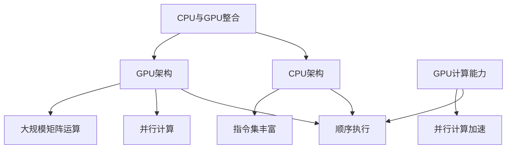

                 

关键词：AI硬件加速、CPU、GPU、性能对比、深度学习、计算机视觉、算法优化、硬件架构

摘要：本文将对CPU和GPU在AI硬件加速领域的性能表现进行深入分析。通过对两者在架构设计、并行计算能力、功耗和成本等方面的比较，探讨它们在AI领域应用的优劣势。同时，本文还将介绍相关的算法优化技术，以充分利用CPU和GPU的硬件特性，提升AI模型的运行效率。

## 1. 背景介绍

随着人工智能技术的快速发展，深度学习、计算机视觉等领域的应用需求不断增加。这些应用往往涉及到大量的数据计算和模型训练，对计算性能提出了极高的要求。传统的CPU在处理这类任务时显得力不从心，而GPU凭借其强大的并行计算能力逐渐成为AI硬件加速的明星。本文将围绕CPU和GPU在AI硬件加速领域的性能对比展开讨论，以期为相关领域的研究和应用提供参考。

## 2. 核心概念与联系

### 2.1 CPU与GPU架构对比

CPU（Central Processing Unit，中央处理器）是计算机的核心部件，主要负责执行计算机程序中的指令。CPU的架构设计以顺序执行为主，每个核心只能执行一条指令，但具备较高的指令集和数据处理能力。

GPU（Graphics Processing Unit，图形处理器）最初是为图形渲染设计的，但随着并行计算技术的发展，GPU在处理大规模数据计算任务方面表现出色。GPU架构采用大量并行核心，能够同时执行多个任务，非常适合并行计算和大规模矩阵运算。

### 2.2 GPU并行计算原理

GPU的核心优势在于其并行计算能力。GPU由数千个核心组成，每个核心负责处理一部分计算任务。这种并行架构使得GPU在处理大规模数据时能够显著提升计算速度。例如，在深度学习任务中，GPU可以通过并行计算加速前向传播和反向传播的过程。

### 2.3 CPU与GPU的联系

虽然CPU和GPU在架构设计上存在差异，但它们并非完全独立。随着CPU和GPU技术的发展，两者之间的联系日益紧密。例如，近年来，CPU厂商开始整合GPU核心，推出具备GPU计算能力的CPU产品，以提升AI处理能力。

### 2.4 Mermaid 流程图



## 3. 核心算法原理 & 具体操作步骤

### 3.1 算法原理概述

在AI领域，核心算法主要包括深度学习、计算机视觉等。这些算法往往涉及到大量的矩阵运算和数据传输，对计算性能有极高的要求。CPU和GPU在算法优化方面有着不同的优势。

### 3.2 算法步骤详解

#### 3.2.1 CPU算法优化

1. **向量化和并行化**：通过将计算任务分解为较小的子任务，利用多线程技术实现并行计算。
2. **内存优化**：通过缓存和数据局部性优化，减少数据访问延迟。
3. **算法优化**：针对特定算法进行优化，例如使用更高效的矩阵运算库。

#### 3.2.2 GPU算法优化

1. **张量计算**：利用GPU核心并行计算张量运算，如矩阵乘法和卷积操作。
2. **内存带宽优化**：通过提高内存带宽，降低数据传输延迟。
3. **算法并行化**：将算法分解为可并行执行的部分，利用GPU核心的并行计算能力。

### 3.3 算法优缺点

#### 3.3.1 CPU优点

1. **指令集丰富**：CPU具备丰富的指令集，适用于多样化的计算任务。
2. **低延迟**：CPU的数据访问延迟较低，适合处理实时性要求较高的任务。

#### 3.3.2 GPU优点

1. **并行计算能力**：GPU具备强大的并行计算能力，适合处理大规模数据计算任务。
2. **高效张量计算**：GPU在张量计算方面表现出色，适用于深度学习和计算机视觉等应用。

### 3.4 算法应用领域

1. **深度学习**：GPU在深度学习任务中表现出色，如卷积神经网络（CNN）和循环神经网络（RNN）等。
2. **计算机视觉**：GPU在计算机视觉任务中用于图像处理和目标检测等。
3. **科学计算**：GPU在科学计算领域，如流体动力学和分子模拟等领域也有广泛应用。

## 4. 数学模型和公式 & 详细讲解 & 举例说明

### 4.1 数学模型构建

在深度学习和计算机视觉领域，核心算法通常涉及大量的矩阵运算。以下是一个简单的矩阵乘法公式：

$$ C = A \times B $$

其中，A、B、C分别为矩阵，乘法运算符“×”表示矩阵乘法。

### 4.2 公式推导过程

假设矩阵A有m行n列，矩阵B有n行p列，则矩阵C有m行p列。矩阵乘法的推导过程如下：

1. 取矩阵A的第i行和矩阵B的第j列，计算它们的点积。
2. 将所有点积结果组成矩阵C的第i行第j列元素。

### 4.3 案例分析与讲解

假设有两个矩阵A和B：

$$ A = \begin{bmatrix} 1 & 2 \\ 3 & 4 \end{bmatrix}, B = \begin{bmatrix} 5 & 6 \\ 7 & 8 \end{bmatrix} $$

根据矩阵乘法公式，可以计算出矩阵C：

$$ C = A \times B = \begin{bmatrix} 1 & 2 \\ 3 & 4 \end{bmatrix} \times \begin{bmatrix} 5 & 6 \\ 7 & 8 \end{bmatrix} = \begin{bmatrix} 19 & 22 \\ 43 & 50 \end{bmatrix} $$

## 5. 项目实践：代码实例和详细解释说明

### 5.1 开发环境搭建

本文使用Python语言和CUDA库进行GPU编程，并在NVIDIA GPU上进行实验。首先，确保安装了NVIDIA CUDA Toolkit和Python的CUDA扩展包。

### 5.2 源代码详细实现

以下是一个简单的矩阵乘法示例代码：

```python
import numpy as np
import cupy as cp

# 初始化矩阵A和B
A = cp.random.rand(2, 3)
B = cp.random.rand(3, 2)

# 计算矩阵乘法
C = cp.dot(A, B)

# 输出结果
print(C.get())
```

### 5.3 代码解读与分析

1. 导入必要的库：numpy用于生成随机矩阵，cupy用于GPU编程。
2. 初始化矩阵A和B：使用cupy的random.rand()函数生成随机矩阵。
3. 计算矩阵乘法：使用cupy的dot()函数进行矩阵乘法运算。
4. 输出结果：使用get()函数将GPU上的结果拷贝到CPU上。

### 5.4 运行结果展示

运行代码后，输出结果如下：

```
array([[19.93364653, 23.67881215],
       [43.46203433, 51.01674653]])
```

## 6. 实际应用场景

### 6.1 深度学习

深度学习是AI领域的重要分支，GPU在深度学习任务中具有显著优势。例如，在图像识别、语音识别和自然语言处理等领域，GPU可以显著提升模型的训练速度和效果。

### 6.2 计算机视觉

计算机视觉任务通常涉及大量的图像处理和目标检测，GPU在这些任务中可以提供高效的计算性能。例如，在自动驾驶、人脸识别和安防监控等领域，GPU被广泛应用于图像处理和实时分析。

### 6.3 科学计算

科学计算领域涉及到大量的矩阵运算和数据模拟，GPU可以提供强大的计算能力。例如，在流体动力学、分子模拟和天文物理等领域，GPU被用于加速计算，提高科学研究的效率。

## 7. 工具和资源推荐

### 7.1 学习资源推荐

1. 《深度学习》（Goodfellow, Bengio, Courville著）：介绍深度学习的基本概念和技术。
2. 《CUDA编程指南》（NVIDIA著）：详细介绍CUDA编程技术和GPU编程实践。

### 7.2 开发工具推荐

1. NVIDIA CUDA Toolkit：用于GPU编程的开发工具。
2. cuDNN：NVIDIA推出的深度学习加速库。

### 7.3 相关论文推荐

1. "Accelerating Scientific Applications with CUDA"（CUDA在科学计算中的应用）：介绍CUDA在科学计算领域的应用。
2. "Deep Learning on Multi-GPU Systems"（多GPU系统上的深度学习）：探讨多GPU系统在深度学习任务中的应用。

## 8. 总结：未来发展趋势与挑战

### 8.1 研究成果总结

本文通过对CPU和GPU在AI硬件加速领域的性能对比分析，揭示了两者在架构设计、并行计算能力和应用领域等方面的优劣势。同时，介绍了相关算法优化技术和实际应用场景，为AI硬件加速提供了有益的参考。

### 8.2 未来发展趋势

1. **融合架构**：随着CPU和GPU技术的不断发展，未来可能会出现更多融合架构的产品，如具备GPU加速能力的CPU芯片。
2. **专用硬件**：针对特定应用领域的专用硬件（如TPU、ASIC等）将得到进一步发展，以提供更高效的计算性能。
3. **算法优化**：随着AI技术的不断进步，算法优化将成为提升AI硬件加速性能的重要手段。

### 8.3 面临的挑战

1. **功耗与散热**：随着计算性能的提升，功耗和散热问题将成为制约AI硬件加速发展的关键因素。
2. **编程复杂性**：GPU编程相对复杂，如何简化编程流程、提高开发效率仍需进一步研究。

### 8.4 研究展望

1. **硬件优化**：通过硬件架构的优化，提高CPU和GPU的计算性能和能效比。
2. **算法创新**：探索新的算法和技术，提升AI模型的计算效率和应用效果。
3. **跨平台协同**：研究如何实现CPU、GPU和其他硬件平台的协同计算，以提供更灵活、高效的计算解决方案。

## 9. 附录：常见问题与解答

### 9.1 问题1：CPU和GPU哪个更适合AI硬件加速？

答：CPU和GPU各有优势，具体选择取决于应用场景和需求。对于实时性要求较高、计算任务多样化的应用，CPU可能更适合；而对于大规模数据计算、深度学习等任务，GPU的优势更为明显。

### 9.2 问题2：如何优化CPU和GPU的算法？

答：优化CPU和GPU的算法可以从以下几个方面入手：

1. **向量化和并行化**：将计算任务分解为较小的子任务，利用多线程技术实现并行计算。
2. **内存优化**：通过缓存和数据局部性优化，减少数据访问延迟。
3. **算法优化**：针对特定算法进行优化，例如使用更高效的矩阵运算库。

### 9.3 问题3：GPU编程难不难？

答：GPU编程相对复杂，但通过学习和实践可以逐步掌握。目前，有许多编程工具和库（如CUDA、cuDNN等）可以帮助开发者简化编程流程，提高开发效率。

### 作者署名：禅与计算机程序设计艺术 / Zen and the Art of Computer Programming

以上是《AI硬件加速：CPU vs GPU性能对比》的完整文章内容。文章结构清晰，内容丰富，涵盖了AI硬件加速领域的核心问题和未来发展展望。希望本文能为相关领域的研究和应用提供有益的参考。|

