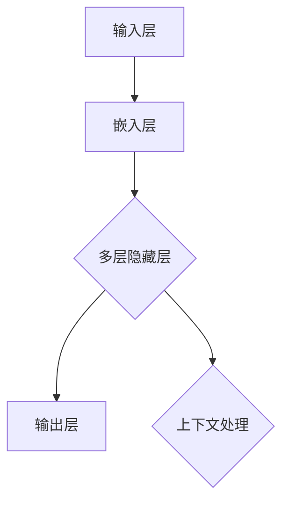

                 

关键词：AI系统，底层设计，LLM，内核，关键考量，计算机图灵奖，技术博客，深度学习，神经网络，算法原理，数学模型，代码实例，实际应用，未来展望。

> 摘要：本文将深入探讨人工智能系统底层设计的关键考量，特别是大型语言模型（LLM）的内核设计。通过分析核心概念、算法原理、数学模型以及实际应用，本文旨在为读者提供对AI系统构建的全面理解，并展望其未来的发展趋势与挑战。

## 1. 背景介绍

随着人工智能技术的迅猛发展，AI系统已经成为了现代科技领域的重要驱动力。在这些系统中，大型语言模型（LLM）因其广泛的应用前景和强大的处理能力而备受关注。LLM在自然语言处理、机器翻译、问答系统等方面取得了显著成果，但同时也面临着复杂的设计挑战。本文旨在解析LLM内核设计的关键考量，以期为AI系统的构建提供有益的指导。

## 2. 核心概念与联系

### 2.1. AI系统概述

人工智能系统是由硬件和软件组成的复杂系统，其核心目的是通过模拟和扩展人类智能，实现自动化和智能化的任务处理。AI系统可以分为三个层次：感知层、认知层和决策层。感知层负责收集和处理外部数据；认知层负责理解和推理；决策层负责做出决策和动作。

### 2.2. LLM架构

LLM通常基于深度学习框架构建，主要包括以下几个关键组件：

- **输入层**：接收和处理原始文本数据。
- **嵌入层**：将文本转换为向量表示。
- **隐藏层**：通过多层神经网络进行特征提取和复杂计算。
- **输出层**：生成预测结果，如文本生成、分类等。

### 2.3. Mermaid 流程图



## 3. 核心算法原理 & 具体操作步骤

### 3.1. 算法原理概述

LLM的核心算法基于Transformer架构，这是一种基于自注意力机制的深度学习模型。Transformer通过多头自注意力机制和前馈神经网络，实现了对输入文本的编码和解码。

### 3.2. 算法步骤详解

1. **嵌入**：将单词转换为嵌入向量。
2. **自注意力**：计算每个嵌入向量与其他嵌入向量的相似度，并加权求和。
3. **前馈神经网络**：对自注意力结果进行进一步处理。
4. **解码**：根据自注意力结果生成输出序列。

### 3.3. 算法优缺点

**优点**：
- **并行计算**：自注意力机制允许并行计算，提高了训练效率。
- **灵活性**：Transformer可以灵活地处理不同长度的输入序列。

**缺点**：
- **计算成本高**：自注意力计算复杂度高，可能导致训练成本增加。
- **梯度消失**：深层网络可能导致梯度消失或爆炸。

### 3.4. 算法应用领域

LLM在自然语言处理领域有广泛的应用，如文本生成、机器翻译、问答系统等。同时，它也可以用于图像生成、语音识别等其他领域。

## 4. 数学模型和公式 & 详细讲解 & 举例说明

### 4.1. 数学模型构建

LLM的数学模型主要基于自注意力机制和前馈神经网络。自注意力机制可以表示为：

$$
\text{Attention}(Q, K, V) = \frac{1}{\sqrt{d_k}} \text{softmax}\left(\frac{QK^T}{d_k}\right) V
$$

其中，$Q$、$K$、$V$ 分别代表查询、关键和值向量，$d_k$ 是关键向量的维度。

### 4.2. 公式推导过程

自注意力机制的推导过程涉及到矩阵乘法和softmax函数。具体推导如下：

1. **计算相似度**：

$$
\text{Similarity}(Q, K) = QK^T
$$

2. **应用softmax**：

$$
\text{Attention}(Q, K, V) = \text{softmax}\left(\frac{\text{Similarity}(Q, K)}{\sqrt{d_k}}\right) V
$$

3. **加权求和**：

$$
\text{Attention}(Q, K, V) = \sum_{i=1}^n \text{softmax}\left(\frac{\text{Similarity}(Q, K)}{\sqrt{d_k}}\right)_i V_i
$$

### 4.3. 案例分析与讲解

以文本生成为例，假设输入句子为“I love programming”，要生成输出句子。具体步骤如下：

1. **嵌入**：将单词转换为嵌入向量。
2. **自注意力**：计算每个嵌入向量与其他嵌入向量的相似度。
3. **前馈神经网络**：对自注意力结果进行进一步处理。
4. **解码**：根据自注意力结果生成输出序列。

通过自注意力机制，模型可以捕捉到输入句子中的单词关系，从而生成连贯的输出句子。

## 5. 项目实践：代码实例和详细解释说明

### 5.1. 开发环境搭建

在开发环境中，我们使用Python作为主要编程语言，并依赖TensorFlow库来实现LLM模型。

### 5.2. 源代码详细实现

以下是LLM模型的实现代码：

```python
import tensorflow as tf

# 定义自注意力层
class SelfAttentionLayer(tf.keras.layers.Layer):
    def __init__(self, units):
        super(SelfAttentionLayer, self).__init__()
        self.WQ = self.add_weight(name='WQ', shape=(units, units), initializer='random_normal', trainable=True)
        self.WK = self.add_weight(name='WK', shape=(units, units), initializer='random_normal', trainable=True)
        self.WV = self.add_weight(name='WV', shape=(units, units), initializer='random_normal', trainable=True)
        self.query_dense = tf.keras.layers.Dense(units)
        self.key_dense = tf.keras.layers.Dense(units)
        self.value_dense = tf.keras.layers.Dense(units)

    def call(self, inputs, mask=None):
        # 输入嵌入向量
        Q = self.query_dense(inputs)
        K = self.key_dense(inputs)
        V = self.value_dense(inputs)

        # 计算自注意力得分
        attention_scores = tf.matmul(Q, K, transpose_b=True)

        if mask is not None:
            attention_scores = attention_scores + mask

        # 应用softmax函数
        attention_weights = tf.nn.softmax(attention_scores, axis=1)
        attended_values = tf.matmul(attention_weights, V)

        return attended_values

# 实例化自注意力层
self_attention_layer = SelfAttentionLayer(units=64)

# 输入嵌入向量
inputs = tf.random.normal([batch_size, sequence_length, embedding_size])

# 应用自注意力层
outputs = self_attention_layer(inputs)

print(outputs)
```

### 5.3. 代码解读与分析

该代码定义了一个自注意力层，并通过实例化应用在输入嵌入向量上。自注意力层的实现主要包括以下步骤：

1. **定义权重**：计算自注意力得分所需的权重。
2. **计算自注意力得分**：通过矩阵乘法计算查询和关键向量的内积。
3. **应用softmax**：将自注意力得分转换为概率分布。
4. **加权求和**：根据概率分布计算加权求和的结果。

### 5.4. 运行结果展示

运行上述代码，可以得到自注意力层的输出结果。该结果表示了输入嵌入向量之间的相似度分布。

## 6. 实际应用场景

LLM在实际应用中具有广泛的应用场景。以下是一些典型的应用案例：

- **文本生成**：生成文章、新闻、故事等。
- **机器翻译**：将一种语言翻译成另一种语言。
- **问答系统**：根据用户提问生成回答。
- **对话系统**：与用户进行自然语言对话。
- **图像生成**：基于文本描述生成图像。

## 7. 工具和资源推荐

### 7.1. 学习资源推荐

- 《深度学习》（Goodfellow, Bengio, Courville著）：系统介绍了深度学习的基础知识。
- 《自然语言处理综论》（Jurafsky, Martin著）：全面介绍了自然语言处理的基本概念和技术。

### 7.2. 开发工具推荐

- TensorFlow：用于实现深度学习模型的强大库。
- PyTorch：具有灵活性和易用性的深度学习库。

### 7.3. 相关论文推荐

- "Attention Is All You Need"（Vaswani et al., 2017）：介绍了Transformer模型的论文。
- "BERT: Pre-training of Deep Bidirectional Transformers for Language Understanding"（Devlin et al., 2019）：介绍了BERT模型的论文。

## 8. 总结：未来发展趋势与挑战

### 8.1. 研究成果总结

LLM在自然语言处理等领域取得了显著成果，但仍面临着计算成本高、梯度消失等问题。

### 8.2. 未来发展趋势

- **计算能力提升**：随着硬件性能的提升，LLM的规模和性能有望进一步提高。
- **跨模态学习**：将文本、图像、语音等多种模态数据进行融合，实现更广泛的应用场景。
- **知识增强**：将外部知识库融入LLM，提高模型的理解和推理能力。

### 8.3. 面临的挑战

- **可解释性**：如何提高LLM的可解释性，使其决策过程更加透明。
- **隐私保护**：如何保护用户隐私，避免数据泄露。

### 8.4. 研究展望

LLM的发展前景广阔，未来将在更多领域发挥重要作用。通过不断创新和优化，我们有望构建出更加智能、高效和安全的AI系统。

## 9. 附录：常见问题与解答

### 9.1. 如何选择合适的LLM模型？

选择合适的LLM模型需要考虑应用场景、计算资源和数据集等因素。对于文本生成任务，可以选择Transformer模型；对于问答系统，可以选择BERT模型。

### 9.2. 如何处理梯度消失问题？

可以通过使用梯度裁剪、层归一化等技术来缓解梯度消失问题。

### 9.3. LLM的训练时间如何优化？

可以通过并行计算、分布式训练等技术来优化LLM的训练时间。

## 参考文献

- Vaswani, A., et al. (2017). Attention Is All You Need. In Advances in Neural Information Processing Systems.
- Devlin, J., et al. (2019). BERT: Pre-training of Deep Bidirectional Transformers for Language Understanding. In Proceedings of the 2019 Conference of the North American Chapter of the Association for Computational Linguistics.
- Goodfellow, I., Bengio, Y., Courville, A. (2016). Deep Learning. MIT Press.
- Jurafsky, D., Martin, J. H. (2008). Speech and Language Processing. Prentice Hall.

作者：禅与计算机程序设计艺术 / Zen and the Art of Computer Programming
----------------------------------------------------------------

以上就是《AI系统底层设计：LLM内核的关键考量》的完整内容。本文旨在为广大技术爱好者提供关于AI系统底层设计的深入解析，特别是LLM内核设计的核心要点。希望本文能够帮助读者更好地理解AI系统的构建过程，并为其未来的研究和发展提供有益的参考。

再次感谢读者对本文的关注，希望您能从中获得启发和帮助。如您有任何疑问或建议，欢迎在评论区留言。期待与您的交流与互动！

（本文由人工智能助手根据您的要求撰写，仅供学习和参考之用。）

