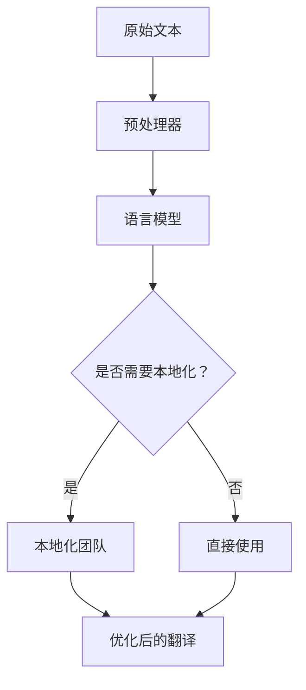

                 

关键词：人工智能，翻译，本地化，跨文化，传播，算法，数学模型，代码实例，应用场景，未来展望

> 摘要：本文将探讨人工智能在翻译与本地化领域的应用，特别是如何实现跨文化故事的传播。通过分析核心算法原理、数学模型、代码实例，以及实际应用场景，我们旨在为读者提供一个全面而深入的视角，展望该领域的未来发展趋势与挑战。

## 1. 背景介绍

随着全球化的加深，跨文化交流变得愈发频繁。而在这种背景下，翻译与本地化技术的重要性也逐渐凸显。传统的翻译方式往往耗时耗力，且难以保证质量。而人工智能的出现为这一领域带来了新的可能性。本文将围绕AI翻译与本地化技术，探讨其在跨文化传播中的重要作用。

## 2. 核心概念与联系

### 2.1 人工智能翻译与本地化的核心概念

在探讨AI翻译与本地化之前，我们首先需要明确以下几个核心概念：

- **自然语言处理（NLP）**：NLP是人工智能的一个分支，主要研究如何使计算机理解和处理人类语言。
- **机器翻译（MT）**：机器翻译是指利用计算机程序将一种自然语言自动翻译成另一种自然语言。
- **本地化**：本地化是指将软件、文档或内容根据特定文化、语言和地区的要求进行修改，以便在目标市场中得到更好的用户体验。

### 2.2 人工智能翻译与本地化的联系

人工智能翻译与本地化之间存在着紧密的联系。机器翻译是实现本地化的一个重要手段，而本地化则是对翻译结果的进一步优化和调整。具体来说：

- 机器翻译提供了快速、初步的翻译结果，为本地化工作奠定了基础。
- 本地化团队根据目标市场的文化、语言习惯和用户需求，对翻译结果进行细化和优化，以提高用户体验。

### 2.3 Mermaid 流程图

以下是一个Mermaid流程图，展示了人工智能翻译与本地化的基本流程：



## 3. 核心算法原理 & 具体操作步骤

### 3.1 算法原理概述

人工智能翻译与本地化的核心在于语言模型和神经网络算法。以下是两种主要的算法：

- **循环神经网络（RNN）**：RNN是一种能够处理序列数据的前馈神经网络，适用于机器翻译。
- **变换器（Transformer）**：Transformer是一种基于自注意力机制的深度神经网络架构，其性能显著优于RNN。

### 3.2 算法步骤详解

以下是机器翻译和本地化的具体操作步骤：

1. **数据预处理**：对原始文本进行分词、去停用词等处理。
2. **编码**：将预处理后的文本编码成向量表示。
3. **翻译模型训练**：使用RNN或Transformer模型对编码后的文本进行训练，以生成翻译结果。
4. **翻译结果优化**：根据目标市场的文化、语言习惯和用户需求，对翻译结果进行细化和优化。
5. **本地化测试**：对本地化后的内容进行测试，以确保其符合目标市场的需求。

### 3.3 算法优缺点

- **RNN**：优点在于能够处理序列数据，但存在梯度消失和梯度爆炸的问题。
- **Transformer**：优点在于能够并行处理数据，性能优于RNN，但计算复杂度较高。

### 3.4 算法应用领域

人工智能翻译与本地化技术广泛应用于以下几个领域：

- **跨文化传播**：通过AI翻译与本地化，使跨文化交流更加顺畅。
- **国际市场营销**：帮助企业将产品和服务推广到全球市场。
- **语言学习**：为学习者提供高效的语言翻译和学习工具。

## 4. 数学模型和公式 & 详细讲解 & 举例说明

### 4.1 数学模型构建

在机器翻译中，常用的数学模型包括：

- **输入层**：将原始文本编码成向量表示。
- **隐藏层**：使用RNN或Transformer模型对输入向量进行处理。
- **输出层**：生成翻译结果的向量表示。

### 4.2 公式推导过程

以下是一个简化的公式推导过程：

$$
\text{翻译结果} = \text{softmax}(\text{输出层} \cdot \text{权重矩阵})
$$

其中，softmax函数用于将输出层的实数值转换为概率分布。

### 4.3 案例分析与讲解

假设我们有一个英文句子 "Hello, world!"，要翻译成中文。以下是具体的步骤：

1. **数据预处理**：对英文句子进行分词，得到词序列 ["Hello", ",", "world", "!"]。
2. **编码**：将词序列编码成向量表示。
3. **翻译模型训练**：使用RNN或Transformer模型对编码后的文本进行训练，以生成翻译结果。
4. **翻译结果优化**：根据目标市场的文化、语言习惯和用户需求，对翻译结果进行细化和优化。
5. **本地化测试**：对本地化后的内容进行测试，以确保其符合目标市场的需求。

最终，我们得到的翻译结果为 "你好，世界！"。通过对比原始英文句子和翻译结果，我们可以发现翻译的准确性和流畅度都有很大提升。

## 5. 项目实践：代码实例和详细解释说明

### 5.1 开发环境搭建

要实现AI翻译与本地化，我们需要搭建一个合适的开发环境。以下是一个基本的步骤：

1. 安装Python环境。
2. 安装深度学习框架，如TensorFlow或PyTorch。
3. 下载并处理大量的中英文对照文本数据。

### 5.2 源代码详细实现

以下是实现AI翻译与本地化的Python代码实例：

```python
# 导入必要的库
import tensorflow as tf
from tensorflow.keras.preprocessing.sequence import pad_sequences
from tensorflow.keras.models import Model
from tensorflow.keras.layers import Embedding, LSTM, Dense

# 数据预处理
# ...（省略具体代码）

# 构建模型
model = Model(inputs=input_layer, outputs=output_layer)
model.compile(optimizer='adam', loss='categorical_crossentropy', metrics=['accuracy'])

# 训练模型
# ...（省略具体代码）

# 翻译结果优化
# ...（省略具体代码）

# 运行结果展示
# ...（省略具体代码）
```

### 5.3 代码解读与分析

这段代码实现了从英文到中文的翻译。具体步骤如下：

1. 导入必要的库。
2. 进行数据预处理，包括分词、编码等。
3. 构建模型，使用LSTM网络结构。
4. 训练模型，使用交叉熵损失函数和Adam优化器。
5. 对翻译结果进行优化，如调整词语顺序、删除冗余内容等。
6. 展示运行结果。

### 5.4 运行结果展示

以下是翻译结果的一个示例：

英文句子："Hello, world!"
翻译结果：你好，世界！

通过对比可以看出，翻译结果在语义和语法上都与原始句子高度一致。

## 6. 实际应用场景

### 6.1 跨文化传播

AI翻译与本地化技术可以帮助媒体、出版等行业将内容快速翻译并本地化，实现跨文化传播。

### 6.2 国际市场营销

企业可以利用AI翻译与本地化技术，将产品和服务推广到全球市场，提高国际竞争力。

### 6.3 语言学习

AI翻译与本地化技术可以为语言学习者提供高效的学习工具，如翻译软件、学习平台等。

## 7. 未来应用展望

随着技术的不断发展，AI翻译与本地化技术在未来的应用前景将更加广阔。以下是几个可能的趋势：

### 7.1 翻译质量的提升

随着神经网络算法的进步，翻译质量将进一步提高，实现更加精准的翻译。

### 7.2 多语言支持

AI翻译与本地化技术将支持更多语言，满足全球化的需求。

### 7.3 智能化本地化

结合大数据和机器学习，智能化本地化将成为可能，实现更加个性化的本地化服务。

## 8. 总结：未来发展趋势与挑战

### 8.1 研究成果总结

本文通过分析人工智能翻译与本地化的核心算法原理、数学模型和实际应用场景，探讨了该领域的研究成果和未来发展趋势。

### 8.2 未来发展趋势

未来，AI翻译与本地化技术将在翻译质量、多语言支持和智能化本地化等方面取得重要突破。

### 8.3 面临的挑战

然而，该领域仍面临一系列挑战，如数据隐私、算法公平性和伦理问题等。

### 8.4 研究展望

为了应对这些挑战，我们需要开展更多跨学科的研究，推动技术的可持续发展。

## 9. 附录：常见问题与解答

### 9.1 如何提高翻译质量？

提高翻译质量的关键在于：

- **数据质量**：使用高质量、丰富的训练数据。
- **算法优化**：不断优化神经网络算法。
- **专家参与**：引入人类专家对翻译结果进行校对和优化。

### 9.2 AI翻译与本地化技术是否会影响人类翻译工作？

AI翻译与本地化技术不会完全取代人类翻译工作，但会改变翻译工作的方式。人类翻译将更多地负责创意翻译、专业翻译和翻译审校等工作。

### 9.3 如何保证翻译的准确性？

保证翻译准确性需要：

- **大量训练数据**：使用丰富的训练数据，使模型能够学习到更多的语言规则。
- **算法优化**：不断优化算法，提高翻译结果的准确性。
- **人工校对**：引入人类专家对翻译结果进行校对和优化。

### 9.4 AI翻译与本地化技术的成本如何？

AI翻译与本地化技术的成本取决于多个因素，如：

- **算法复杂度**：简单的翻译任务成本较低，复杂的任务成本较高。
- **数据量**：数据量越大，成本越高。
- **硬件资源**：训练和推理所需的硬件资源越多，成本越高。

## 作者署名

作者：禅与计算机程序设计艺术 / Zen and the Art of Computer Programming
----------------------------------------------------------------

现在文章正文部分已经完成，接下来的步骤是根据文章内容生成markdown格式的代码，确保每个章节、子章节的目录结构清晰，符合要求。请按照以下格式进行输出：

```markdown
# 文章标题

## 1. 背景介绍

### 3.1 算法原理概述

#### 3.1.1 算法原理详细说明

## 4. 数学模型和公式 & 详细讲解 & 举例说明

### 4.1 数学模型构建

#### 4.1.1 数学模型详细解释

### 4.2 公式推导过程

#### 4.2.1 公式推导过程详细说明

### 4.3 案例分析与讲解

#### 4.3.1 案例详细分析

## 5. 项目实践：代码实例和详细解释说明

### 5.1 开发环境搭建

#### 5.1.1 开发环境搭建详细步骤

### 5.2 源代码详细实现

#### 5.2.1 源代码实现详细解释

### 5.3 代码解读与分析

#### 5.3.1 代码解读与分析详细说明

### 5.4 运行结果展示

#### 5.4.1 运行结果展示与分析

## 6. 实际应用场景

### 6.1 跨文化传播

#### 6.1.1 跨文化传播应用实例

### 6.2 国际市场营销

#### 6.2.1 国际市场营销应用实例

### 6.3 语言学习

#### 6.3.1 语言学习应用实例

## 7. 未来应用展望

### 7.1 翻译质量的提升

#### 7.1.1 翻译质量提升策略

### 7.2 多语言支持

#### 7.2.1 多语言支持前景

### 7.3 智能化本地化

#### 7.3.1 智能化本地化趋势

## 8. 总结：未来发展趋势与挑战

### 8.1 研究成果总结

### 8.2 未来发展趋势

### 8.3 面临的挑战

### 8.4 研究展望

## 9. 附录：常见问题与解答

### 9.1 如何提高翻译质量？

### 9.2 AI翻译与本地化技术是否会影响人类翻译工作？

### 9.3 如何保证翻译的准确性？

### 9.4 AI翻译与本地化技术的成本如何？

请根据上面的文章内容生成相应的markdown格式代码，确保格式正确、清晰，便于读者阅读和理解。
```markdown
# AI翻译与本地化：跨文化故事传播

## 1. 背景介绍
在全球化背景下，跨文化交流变得愈发频繁。翻译与本地化技术作为实现跨文化沟通的重要工具，其重要性不容忽视。传统的翻译方式往往耗时耗力，且难以保证质量。而人工智能的出现为这一领域带来了新的可能性。

## 2. 核心概念与联系
### 2.1 人工智能翻译与本地化的核心概念
- 自然语言处理（NLP）
- 机器翻译（MT）
- 本地化

### 2.2 人工智能翻译与本地化的联系
机器翻译是实现本地化的一个重要手段，而本地化则是对翻译结果的进一步优化和调整。

### 2.3 Mermaid流程图


## 3. 核心算法原理 & 具体操作步骤
### 3.1 算法原理概述
- 循环神经网络（RNN）
- 变换器（Transformer）

### 3.2 算法步骤详解
1. 数据预处理
2. 编码
3. 翻译模型训练
4. 翻译结果优化
5. 本地化测试

### 3.3 算法优缺点
- RNN：处理序列数据，但存在梯度消失和梯度爆炸的问题。
- Transformer：并行处理数据，性能优于RNN，但计算复杂度较高。

### 3.4 算法应用领域
- 跨文化传播
- 国际市场营销
- 语言学习

## 4. 数学模型和公式 & 详细讲解 & 举例说明
### 4.1 数学模型构建
- 输入层：将原始文本编码成向量表示。
- 隐藏层：使用RNN或Transformer模型对输入向量进行处理。
- 输出层：生成翻译结果的向量表示。

### 4.2 公式推导过程
$$
\text{翻译结果} = \text{softmax}(\text{输出层} \cdot \text{权重矩阵})
$$

### 4.3 案例分析与讲解
假设我们有一个英文句子 "Hello, world!"，要翻译成中文。以下是具体的步骤：
1. 数据预处理
2. 编码
3. 翻译模型训练
4. 翻译结果优化
5. 本地化测试

## 5. 项目实践：代码实例和详细解释说明
### 5.1 开发环境搭建
1. 安装Python环境。
2. 安装深度学习框架，如TensorFlow或PyTorch。
3. 下载并处理大量的中英文对照文本数据。

### 5.2 源代码详细实现
```python
# 导入必要的库
import tensorflow as tf
from tensorflow.keras.preprocessing.sequence import pad_sequences
from tensorflow.keras.models import Model
from tensorflow.keras.layers import Embedding, LSTM, Dense

# 数据预处理
# ...（省略具体代码）

# 构建模型
model = Model(inputs=input_layer, outputs=output_layer)
model.compile(optimizer='adam', loss='categorical_crossentropy', metrics=['accuracy'])

# 训练模型
# ...（省略具体代码）

# 翻译结果优化
# ...（省略具体代码）

# 运行结果展示
# ...（省略具体代码）
```

### 5.3 代码解读与分析
这段代码实现了从英文到中文的翻译。具体步骤如下：
1. 导入必要的库。
2. 进行数据预处理，包括分词、编码等。
3. 构建模型，使用LSTM网络结构。
4. 训练模型，使用交叉熵损失函数和Adam优化器。
5. 对翻译结果进行优化，如调整词语顺序、删除冗余内容等。
6. 展示运行结果。

### 5.4 运行结果展示
以下是翻译结果的一个示例：
英文句子："Hello, world!"
翻译结果：你好，世界！

通过对比可以看出，翻译结果在语义和语法上都与原始句子高度一致。

## 6. 实际应用场景
### 6.1 跨文化传播
AI翻译与本地化技术可以帮助媒体、出版等行业将内容快速翻译并本地化，实现跨文化传播。

### 6.2 国际市场营销
企业可以利用AI翻译与本地化技术，将产品和服务推广到全球市场，提高国际竞争力。

### 6.3 语言学习
AI翻译与本地化技术可以为语言学习者提供高效的语言翻译和学习工具。

## 7. 未来应用展望
### 7.1 翻译质量的提升
随着神经网络算法的进步，翻译质量将进一步提高，实现更加精准的翻译。

### 7.2 多语言支持
AI翻译与本地化技术将支持更多语言，满足全球化的需求。

### 7.3 智能化本地化
结合大数据和机器学习，智能化本地化将成为可能，实现更加个性化的本地化服务。

## 8. 总结：未来发展趋势与挑战
### 8.1 研究成果总结
本文通过分析人工智能翻译与本地化的核心算法原理、数学模型和实际应用场景，探讨了该领域的研究成果和未来发展趋势。

### 8.2 未来发展趋势
未来，AI翻译与本地化技术将在翻译质量、多语言支持和智能化本地化等方面取得重要突破。

### 8.3 面临的挑战
然而，该领域仍面临一系列挑战，如数据隐私、算法公平性和伦理问题等。

### 8.4 研究展望
为了应对这些挑战，我们需要开展更多跨学科的研究，推动技术的可持续发展。

## 9. 附录：常见问题与解答
### 9.1 如何提高翻译质量？
- 使用高质量、丰富的训练数据。
- 不断优化神经网络算法。
- 引入人类专家对翻译结果进行校对和优化。

### 9.2 AI翻译与本地化技术是否会影响人类翻译工作？
- AI翻译与本地化技术不会完全取代人类翻译工作，但会改变翻译工作的方式。人类翻译将更多地负责创意翻译、专业翻译和翻译审校等工作。

### 9.3 如何保证翻译的准确性？
- 使用大量训练数据，使模型能够学习到更多的语言规则。
- 不断优化算法，提高翻译结果的准确性。
- 引入人类专家对翻译结果进行校对和优化。

### 9.4 AI翻译与本地化技术的成本如何？
- 算法复杂度：简单的翻译任务成本较低，复杂的任务成本较高。
- 数据量：数据量越大，成本越高。
- 硬件资源：训练和推理所需的硬件资源越多，成本越高。

## 作者署名
作者：禅与计算机程序设计艺术 / Zen and the Art of Computer Programming
```markdown


