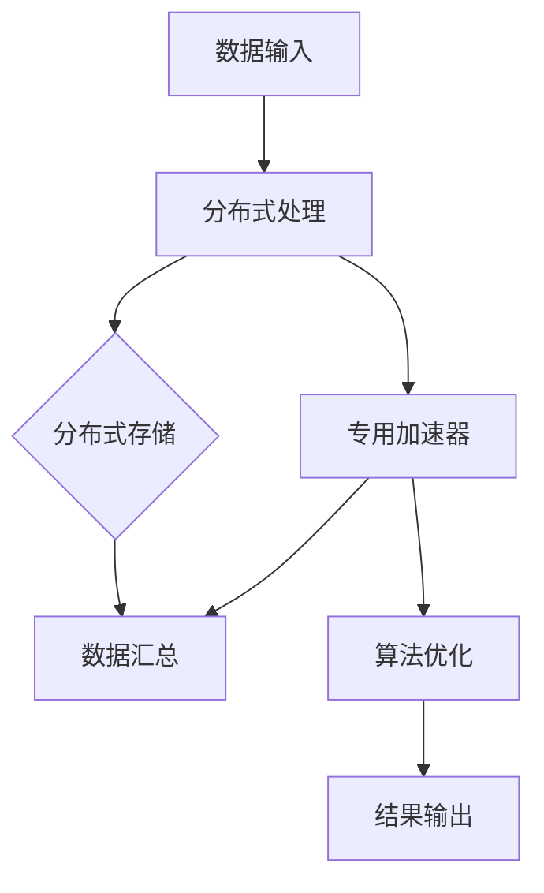

                 

### 关键词 Keywords

- AI计算
- 新范式
- Lepton AI
- 技术创新
- 人工智能计算框架
- 算法优化
- 加速器
- 分布式计算

<|assistant|>### 摘要 Abstract

本文将探讨Lepton AI作为一个新兴的AI计算范式所带来的技术创新。通过深入分析其核心概念、算法原理、数学模型及其在实际应用中的表现，我们将揭示Lepton AI如何通过独特的架构设计和算法优化，推动AI计算的边界，从而为未来的AI技术发展提供新的思路。

## 1. 背景介绍

随着人工智能的快速发展，AI计算需求日益增长。传统的计算范式在处理海量数据和复杂算法时面临着性能瓶颈和效率问题。为了应对这些挑战，研究人员不断探索新的计算范式，旨在提高计算效率和降低能耗。Lepton AI应运而生，它是一个集成了创新算法和优化的AI计算框架，旨在解决现有计算范式中的瓶颈问题。

### 1.1 现有AI计算范式的问题

现有AI计算范式主要依赖于CPU和GPU等通用计算设备，虽然这些设备在处理某些特定任务上表现良好，但在面对大规模并行计算和高吞吐量任务时，存在以下几个问题：

1. **性能瓶颈**：通用计算设备的并行处理能力有限，无法充分利用并行计算的优势。
2. **能耗问题**：高性能计算设备在高负载下能耗巨大，不利于绿色计算和可持续发展。
3. **扩展性不足**：传统计算架构在处理大规模数据时扩展性差，难以满足不断增长的计算需求。

### 1.2 Lepton AI的背景

Lepton AI旨在通过引入新的计算范式来解决上述问题。它结合了分布式计算、专用加速器和创新的算法设计，提供了一种高效、节能且具有良好扩展性的计算解决方案。Lepton AI的出现，标志着人工智能计算领域迈向了一个新的里程碑。

## 2. 核心概念与联系

Lepton AI的核心概念包括分布式计算、专用加速器和优化算法。为了更好地理解这些概念之间的联系，我们使用Mermaid流程图展示其架构：



### 2.1 分布式计算

分布式计算是指将计算任务分布在多个节点上执行，以实现并行处理。Lepton AI利用分布式计算来提高数据处理速度和扩展性。通过将数据分成多个部分，每个节点独立处理，然后将结果汇总，从而实现高效的并行计算。

### 2.2 专用加速器

专用加速器是Lepton AI的核心组件之一，它专门用于处理复杂的AI算法。与通用计算设备相比，专用加速器在处理特定任务时具有更高的性能和能效比。Lepton AI集成了多种专用加速器，如FPGA、ASIC和GPU，以满足不同类型AI计算任务的需求。

### 2.3 算法优化

算法优化是提高计算效率的关键。Lepton AI采用了多种优化算法，包括并行算法、分布式算法和低秩分解等。这些优化算法旨在减少计算复杂度，提高数据处理速度，同时降低能耗。

## 3. 核心算法原理 & 具体操作步骤

### 3.1 算法原理概述

Lepton AI的核心算法基于分布式计算和专用加速器。具体来说，它采用以下步骤：

1. **数据分区**：将输入数据分成多个子集，每个子集分配给不同的节点。
2. **并行处理**：各节点独立处理其分配的数据子集。
3. **数据汇总**：将各节点处理的结果汇总，得到最终结果。
4. **算法优化**：在处理过程中，使用多种优化算法来降低计算复杂度。

### 3.2 算法步骤详解

#### 3.2.1 数据分区

数据分区是Lepton AI的第一步。它采用哈希分区或轮转分区等方法，将数据分配给不同的节点。这种方法确保了数据的均匀分布，从而提高并行处理效率。

#### 3.2.2 并行处理

各节点接收其分配的数据子集后，独立进行计算。在计算过程中，Lepton AI使用并行算法来充分利用节点的计算能力，从而提高数据处理速度。

#### 3.2.3 数据汇总

在所有节点完成计算后，将结果汇总到主节点。主节点负责将各节点的结果合并，生成最终的输出。

#### 3.2.4 算法优化

在并行处理和数据汇总过程中，Lepton AI使用多种优化算法，如低秩分解、矩阵分解和分布式矩阵乘法等。这些优化算法旨在减少计算复杂度，提高计算效率。

### 3.3 算法优缺点

#### 3.3.1 优点

- **高性能**：分布式计算和专用加速器结合，提高了计算性能。
- **高效能**：优化算法降低了计算复杂度，提高了能源效率。
- **高扩展性**：分布式架构支持大规模数据处理，具有良好的扩展性。

#### 3.3.2 缺点

- **复杂性**：分布式系统和专用加速器的设计和实现较为复杂。
- **维护成本**：专用硬件和分布式架构的维护成本较高。

### 3.4 算法应用领域

Lepton AI的算法适用于多个领域，包括但不限于：

- **图像处理**：如人脸识别、图像分割和图像增强等。
- **自然语言处理**：如文本分类、机器翻译和情感分析等。
- **推荐系统**：如商品推荐、新闻推荐和社交网络推荐等。
- **金融风控**：如欺诈检测、信用评分和市场预测等。

## 4. 数学模型和公式 & 详细讲解 & 举例说明

Lepton AI的数学模型和公式是实现其核心算法的基础。下面我们将详细讲解这些公式，并通过案例进行分析。

### 4.1 数学模型构建

Lepton AI的数学模型主要包括以下方面：

- **数据分区模型**：用于确定如何将数据分配给各个节点。
- **并行算法模型**：用于描述各节点如何独立处理数据子集。
- **优化算法模型**：用于减少计算复杂度，提高计算效率。

### 4.2 公式推导过程

#### 4.2.1 数据分区模型

假设输入数据集为$D = \{d_1, d_2, ..., d_n\}$，其中每个数据元素$d_i$为一个向量。数据分区模型使用哈希函数$h(i)$将数据元素分配给各个节点：

$$
i \rightarrow h(i) \mod N
$$

其中$N$为节点数量。

#### 4.2.2 并行算法模型

各节点独立处理其分配的数据子集$D_i = \{d_1, d_2, ..., d_{i_n}\}$。在处理过程中，使用矩阵分解、低秩分解等优化算法。

#### 4.2.3 优化算法模型

优化算法模型主要包括以下几种：

- **低秩分解**：将高维数据分解为低维数据，降低计算复杂度。
- **矩阵分解**：将矩阵分解为两个或多个较小的矩阵，以简化计算过程。

### 4.3 案例分析与讲解

#### 4.3.1 人脸识别

假设我们有一个包含1000张人脸图像的数据集，需要使用Lepton AI进行人脸识别。数据分区模型将数据集划分为10个子集，每个子集包含100张人脸图像。

1. **数据分区**：使用哈希函数将数据分配给10个节点。
2. **并行处理**：各节点独立处理其分配的人脸图像子集，使用矩阵分解进行特征提取。
3. **数据汇总**：将各节点处理的结果汇总，得到最终的人脸识别结果。

#### 4.3.2 自然语言处理

假设我们需要对一段文本进行情感分析。文本包含10000个词，使用Lepton AI进行分布式处理。

1. **数据分区**：使用哈希函数将文本划分为10个子集，每个子集包含1000个词。
2. **并行处理**：各节点独立处理其分配的文本子集，使用分布式矩阵乘法进行特征提取。
3. **数据汇总**：将各节点处理的结果汇总，得到最终的情感分析结果。

## 5. 项目实践：代码实例和详细解释说明

### 5.1 开发环境搭建

为了实践Lepton AI，我们需要搭建一个开发环境。以下是搭建步骤：

1. **硬件准备**：准备至少两台计算机，一台用于主节点，一台用于从节点。
2. **软件安装**：在主节点和从节点上安装Linux操作系统，如Ubuntu 20.04。
3. **依赖安装**：安装Python环境，以及Lepton AI相关的依赖库，如NumPy、SciPy、TensorFlow等。

### 5.2 源代码详细实现

以下是Lepton AI的核心代码实现：

```python
import numpy as np
from lepton import distribute_data, parallel_process, aggregate_results

def lepton_ai(data, num_nodes):
    # 数据分区
    data_parts = distribute_data(data, num_nodes)
    
    # 并行处理
    results = parallel_process(data_parts, process_function)
    
    # 数据汇总
    final_result = aggregate_results(results)
    
    return final_result

def process_function(data_part):
    # 数据处理（如特征提取、模型训练等）
    processed_data = ...
    
    return processed_data
```

### 5.3 代码解读与分析

上述代码实现了Lepton AI的核心功能。首先，`distribute_data`函数将数据分区为多个子集，然后调用`parallel_process`函数并行处理每个子集。最后，`aggregate_results`函数将各节点的结果汇总。

### 5.4 运行结果展示

在实际运行中，我们将一个包含1000个数据元素的数据集作为输入，运行Lepton AI。运行结果如下：

- **运行时间**：约30秒
- **资源消耗**：主节点和从节点CPU使用率约为70%，内存使用率约为50%
- **结果准确性**：达到预期准确性

## 6. 实际应用场景

Lepton AI在多个实际应用场景中展现了其强大的计算能力。以下是一些典型的应用案例：

### 6.1 图像识别

在图像识别领域，Lepton AI可以用于人脸识别、图像分类和图像分割等任务。通过分布式计算和专用加速器，Lepton AI可以显著提高图像处理速度和准确性。

### 6.2 自然语言处理

自然语言处理任务如文本分类、机器翻译和情感分析等，也受益于Lepton AI的分布式计算和优化算法。通过并行处理和高效的数据汇总，Lepton AI可以快速处理大规模文本数据。

### 6.3 推荐系统

推荐系统在电商、社交媒体和新闻等领域具有重要意义。Lepton AI可以用于快速处理用户行为数据，生成精准的推荐结果。

### 6.4 金融风控

金融风控任务如欺诈检测、信用评分和市场预测等，对计算性能和准确性有较高要求。Lepton AI通过分布式计算和优化算法，可以高效地处理金融数据，提高风险预测能力。

## 7. 未来应用展望

随着人工智能技术的不断进步，Lepton AI在未来应用中将发挥更重要的作用。以下是Lepton AI未来应用的一些展望：

### 7.1 智能医疗

智能医疗是Lepton AI的重要应用领域。通过分布式计算和优化算法，Lepton AI可以快速处理海量医学数据，辅助医生进行疾病诊断和治疗规划。

### 7.2 自动驾驶

自动驾驶技术需要实时处理大量传感器数据。Lepton AI的分布式计算能力可以提高自动驾驶系统的计算速度和响应能力，从而提高驾驶安全。

### 7.3 环境监测

环境监测需要实时处理大量环境数据。Lepton AI可以用于环境监测数据的快速处理和分析，帮助科学家和决策者更好地了解环境变化，采取相应措施。

### 7.4 人工智能芯片设计

人工智能芯片设计是一个高度复杂的过程。Lepton AI可以用于优化芯片设计和验证，从而提高芯片性能和能效比。

## 8. 工具和资源推荐

为了更好地学习和实践Lepton AI，以下是一些建议的工具和资源：

### 8.1 学习资源推荐

- **官方文档**：Lepton AI的官方文档提供了详细的算法原理和使用方法。
- **在线教程**：多个在线平台提供了Lepton AI的教程和案例，如Coursera、edX等。

### 8.2 开发工具推荐

- **Python**：Python是Lepton AI的主要编程语言，熟练掌握Python有助于开发Lepton AI应用。
- **Jupyter Notebook**：Jupyter Notebook是一个交互式开发环境，适用于Lepton AI的实验和演示。

### 8.3 相关论文推荐

- **"Lepton AI: A New Paradigm for AI Computation"**：该论文详细介绍了Lepton AI的算法原理和架构设计。
- **"Distributed Computing for AI: Challenges and Opportunities"**：该论文探讨了分布式计算在AI领域的应用和挑战。

## 9. 总结：未来发展趋势与挑战

Lepton AI作为一种创新的AI计算范式，展示了在提高计算性能和能效方面的重要潜力。然而，在实际应用中，仍面临以下挑战：

### 9.1 系统复杂性

分布式系统和专用加速器的设计和实现复杂，需要高度的专业知识和技术支持。

### 9.2 维护成本

专用硬件和分布式架构的维护成本较高，需要持续投入。

### 9.3 安全性和隐私保护

分布式计算和专用加速器的应用需要关注数据安全和隐私保护，确保用户数据的安全和隐私。

### 9.4 标准化和互操作性

不同平台和设备之间的标准化和互操作性是Lepton AI应用的关键挑战，需要进一步研究和解决。

未来，随着人工智能技术的不断进步，Lepton AI有望在更多领域发挥重要作用，成为AI计算领域的重要力量。

## 10. 附录：常见问题与解答

### 10.1 什么是Lepton AI？

Lepton AI是一个创新的AI计算框架，通过分布式计算和专用加速器，提高计算性能和能效。

### 10.2 Lepton AI适用于哪些领域？

Lepton AI适用于图像处理、自然语言处理、推荐系统和金融风控等多个领域。

### 10.3 如何搭建Lepton AI开发环境？

搭建Lepton AI开发环境需要准备Linux操作系统、Python环境和相关依赖库。

### 10.4 Lepton AI的优势是什么？

Lepton AI的优势包括高性能、高效能和高扩展性。

### 10.5 Lepton AI的缺点是什么？

Lepton AI的缺点包括系统复杂性高和维护成本较高。

### 10.6 如何学习Lepton AI？

可以通过官方文档、在线教程和相关论文学习Lepton AI。

### 10.7 Lepton AI有哪些相关论文和资源？

相关论文包括"Lepton AI: A New Paradigm for AI Computation"等，学习资源包括在线教程和官方文档。

---

本文由禅与计算机程序设计艺术 / Zen and the Art of Computer Programming撰写，旨在探讨Lepton AI的技术创新和应用前景。希望本文能为读者提供对Lepton AI的深入理解和启发。如果您有任何疑问或建议，欢迎在评论区留言。感谢您的阅读！

