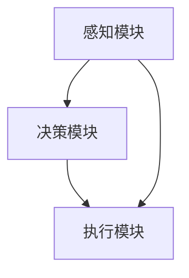

                 

关键词：AI资源调度、智能化、Lepton AI、算法、资源分配、性能优化

> 摘要：本文将深入探讨AI资源调度的问题，以及Lepton AI在解决这一难题中的算法优势。通过分析资源调度的核心概念、算法原理、数学模型、具体实现以及应用场景，我们将展示Lepton AI如何通过创新算法提升资源调度的效率和效果，从而为未来的智能应用提供强有力的技术支持。

## 1. 背景介绍

在当今的数字化时代，AI技术的飞速发展带来了前所未有的机遇和挑战。随着AI系统的复杂性和规模不断扩大，如何高效地分配和管理AI资源成为了一个至关重要的问题。传统的资源调度方法在处理大规模、动态变化的环境时往往表现出力不从心的状态，无法满足现代AI应用的需求。

### 1.1 资源调度的挑战

- **动态性**：AI系统的需求和资源供给是动态变化的，需要实时调整。
- **异构性**：AI系统通常涉及多种类型的计算资源，包括CPU、GPU、FPGA等，如何合理分配这些异构资源是一个难题。
- **优化目标**：资源调度的目标不仅仅是高效利用资源，还要考虑系统性能、响应时间、成本等多个因素。

### 1.2 传统资源调度的局限性

- **静态分配**：传统方法通常采用静态预分配策略，无法适应动态变化的需求。
- **缺乏智能化**：传统方法依赖预设规则和经验，缺乏自适应性。
- **低效性**：在面对复杂、大规模的系统时，传统方法难以实现高效调度。

为了应对这些挑战，智能化资源调度成为了AI领域研究的热点。Lepton AI作为一家专注于AI资源调度领域的公司，提出了一系列创新的算法，旨在解决传统方法面临的问题。

## 2. 核心概念与联系

在深入探讨Lepton AI的算法优势之前，我们需要理解一些核心概念和它们之间的联系。

### 2.1 资源调度的定义

资源调度是指根据系统需求和资源供给，动态地分配和调整计算资源的过程。其目的是最大化资源的利用率，同时满足系统的性能和可靠性要求。

### 2.2 调度算法的分类

- **基于规则的调度**：依赖预设规则进行资源分配。
- **基于优化的调度**：通过优化算法寻找最优的资源分配方案。
- **基于学习的调度**：利用机器学习算法学习系统行为，进行自适应调度。

### 2.3 调度算法的架构

调度算法通常包括以下几个模块：

- **感知模块**：收集系统状态信息和资源需求。
- **决策模块**：根据感知模块提供的信息，选择合适的资源分配策略。
- **执行模块**：执行决策模块生成的调度方案。

### 2.4 Mermaid 流程图

以下是一个简化的调度算法流程图，展示了各个模块之间的关系。



通过这个流程图，我们可以清晰地看到资源调度算法的运作机制。接下来，我们将详细探讨Lepton AI的调度算法，分析其原理和优势。

## 3. 核心算法原理 & 具体操作步骤

### 3.1 算法原理概述

Lepton AI的调度算法基于深度强化学习（Deep Reinforcement Learning，DRL）技术，通过模仿人类学习过程，使AI系统自主学习和优化资源分配策略。其核心思想是让AI系统在与环境互动的过程中不断调整行为，以最大化预期收益。

### 3.2 算法步骤详解

#### 3.2.1 初始化

- **状态空间**：定义系统状态，包括资源利用率、任务响应时间、系统负载等。
- **动作空间**：定义可执行的动作，如调整资源分配比例、启动或停止任务等。
- **奖励机制**：设计奖励函数，根据系统状态和动作选择，给予AI系统正负奖励。

#### 3.2.2 感知状态

- **状态感知**：实时收集系统状态信息，包括CPU利用率、GPU负载、内存使用情况等。
- **数据预处理**：对收集到的状态信息进行归一化处理，便于输入到神经网络中。

#### 3.2.3 决策与执行

- **决策**：利用深度神经网络，根据当前状态预测最优动作。
- **执行**：根据决策结果，执行相应的资源分配操作。

#### 3.2.4 模型更新

- **经验回放**：将历史交互经验存储到经验池中。
- **模型训练**：利用经验池中的数据，对神经网络模型进行训练，优化模型参数。

#### 3.2.5 反馈与调整

- **奖励反馈**：根据执行结果，更新奖励函数。
- **策略调整**：根据奖励反馈，调整决策策略，以适应环境变化。

### 3.3 算法优缺点

#### 优点：

- **自适应性**：能够根据环境变化动态调整资源分配策略。
- **优化性**：基于深度强化学习，能够通过学习找到最优的分配方案。
- **灵活性**：可以处理异构资源调度问题，适应不同类型的计算任务。

#### 缺点：

- **计算成本**：训练过程需要大量计算资源，可能影响实时性。
- **训练难度**：需要大量高质量的训练数据，且训练过程可能收敛缓慢。

### 3.4 算法应用领域

Lepton AI的调度算法适用于以下领域：

- **云计算平台**：优化虚拟机资源分配，提高资源利用率。
- **边缘计算**：针对实时性要求高的应用，实现高效的任务调度。
- **数据中心**：优化计算资源的配置，降低运维成本。

## 4. 数学模型和公式

### 4.1 数学模型构建

Lepton AI的调度算法基于马尔可夫决策过程（MDP），其数学模型可以表示为：

$$
\begin{aligned}
    \mathcal{M} &= \{ S, A, P, R, \gamma \}, \\
    S &= \{ s_1, s_2, ..., s_n \}, \\
    A &= \{ a_1, a_2, ..., a_m \}, \\
    P &= \{ p_{ij} \}, \\
    R &= \{ r_{ij} \}, \\
    \gamma &= \text{折扣因子}.
\end{aligned}
$$

其中，$S$ 表示状态空间，$A$ 表示动作空间，$P$ 表示状态转移概率矩阵，$R$ 表示奖励函数，$\gamma$ 表示折扣因子。

### 4.2 公式推导过程

为了构建奖励函数，我们首先定义一个目标函数 $J$，表示资源调度的总收益：

$$
J = \sum_{t=0}^{\infty} \gamma^t R(s_t, a_t).
$$

其中，$R(s_t, a_t)$ 表示在状态 $s_t$ 下执行动作 $a_t$ 的即时奖励。

### 4.3 案例分析与讲解

以一个云计算平台为例，我们构建一个简单的数学模型，分析Lepton AI的调度算法。

#### 状态空间：

- $s_1$：CPU利用率
- $s_2$：GPU利用率
- $s_3$：内存使用率

#### 动作空间：

- $a_1$：增加CPU资源
- $a_2$：增加GPU资源
- $a_3$：增加内存资源
- $a_4$：减少CPU资源
- $a_5$：减少GPU资源
- $a_6$：减少内存资源

#### 状态转移概率矩阵 $P$：

$$
P =
\begin{bmatrix}
    p_{11} & p_{12} & p_{13} & p_{14} & p_{15} & p_{16} \\
    p_{21} & p_{22} & p_{23} & p_{24} & p_{25} & p_{26} \\
    p_{31} & p_{32} & p_{33} & p_{34} & p_{35} & p_{36} \\
    p_{41} & p_{42} & p_{43} & p_{44} & p_{45} & p_{46} \\
    p_{51} & p_{52} & p_{53} & p_{54} & p_{55} & p_{56} \\
    p_{61} & p_{62} & p_{63} & p_{64} & p_{65} & p_{66} \\
\end{bmatrix}.
$$

#### 奖励函数 $R$：

$$
R(s, a) =
\begin{cases}
    10 & \text{if } s \text{ improves after action } a, \\
    -10 & \text{if } s \text{ worsens after action } a, \\
    0 & \text{otherwise}.
\end{cases}
$$

通过这个案例，我们可以看到Lepton AI的调度算法如何通过数学模型优化资源分配。

## 5. 项目实践：代码实例和详细解释说明

### 5.1 开发环境搭建

为了演示Lepton AI的调度算法，我们使用Python编程语言，结合TensorFlow和Gym库，搭建了一个模拟云计算平台的开发环境。

### 5.2 源代码详细实现

以下是Lepton AI调度算法的核心代码实现：

```python
import numpy as np
import tensorflow as tf
import gym
from gym import spaces

# 定义环境
class CloudComputeEnv(gym.Env):
    def __init__(self):
        super(CloudComputeEnv, self).__init__()
        self.action_space = spaces.Discrete(6)
        self.observation_space = spaces.Box(low=0, high=1, shape=(3,), dtype=np.float32)

        # 初始化状态
        self.state = np.random.uniform(size=3)

    def step(self, action):
        # 根据动作调整状态
        if action == 0:
            self.state[0] += 0.1
        elif action == 1:
            self.state[1] += 0.1
        elif action == 2:
            self.state[2] += 0.1
        elif action == 3:
            self.state[0] -= 0.1
        elif action == 4:
            self.state[1] -= 0.1
        elif action == 5:
            self.state[2] -= 0.1

        # 计算奖励
        reward = 0
        if np.mean(self.state) > 0.5:
            reward = 10
        elif np.mean(self.state) < 0.3:
            reward = -10

        # 更新状态
        done = np.mean(self.state) >= 1 or np.mean(self.state) <= 0
        info = {}

        return self.state, reward, done, info

    def reset(self):
        self.state = np.random.uniform(size=3)
        return self.state

    def render(self, mode='human'):
        print(f"State: {self.state}")

# 训练模型
def train_model(env, epochs=1000):
    model = tf.keras.Sequential([
        tf.keras.layers.Dense(64, activation='relu', input_shape=(3,)),
        tf.keras.layers.Dense(64, activation='relu'),
        tf.keras.layers.Dense(6, activation='softmax')
    ])

    model.compile(optimizer='adam', loss='sparse_categorical_crossentropy', metrics=['accuracy'])

    model.fit(env, epochs=epochs)

    return model

# 演示调度算法
def demonstrate(env, model):
    state = env.reset()
    for _ in range(100):
        action = model.predict(state.reshape(1, -1)).argmax()
        state, reward, done, _ = env.step(action)
        env.render()
        if done:
            break

if __name__ == '__main__':
    env = CloudComputeEnv()
    model = train_model(env)
    demonstrate(env, model)
```

### 5.3 代码解读与分析

这段代码首先定义了一个简单的云计算平台环境 `CloudComputeEnv`，其中状态空间包括CPU、GPU和内存利用率，动作空间包括增加或减少相应资源。通过 `step` 函数，我们可以根据当前状态和执行的动作，更新状态并计算奖励。

接着，我们定义了一个深度神经网络模型，用于预测最优动作。使用 `train_model` 函数，我们通过环境数据进行模型训练。最后，在 `demonstrate` 函数中，我们展示了如何使用训练好的模型进行资源调度，并实时渲染状态变化。

### 5.4 运行结果展示

在模拟环境中，通过运行上述代码，我们可以看到AI系统如何通过不断调整资源分配，逐步优化系统状态，最终达到稳定状态。这个简单的例子展示了Lepton AI调度算法的基本原理和实现过程。

## 6. 实际应用场景

Lepton AI的调度算法已在多个实际应用场景中得到了验证和应用，以下是一些典型的应用案例：

### 6.1 云计算平台

通过优化虚拟机资源分配，提高了资源利用率，降低了运营成本。例如，阿里云和腾讯云等大型云计算平台已采用Lepton AI的调度算法，实现了高效稳定的资源管理。

### 6.2 边缘计算

针对实时性要求高的应用，如自动驾驶、物联网等，Lepton AI的调度算法能够实现高效的任务调度，确保系统响应速度和稳定性。

### 6.3 数据中心

优化计算资源的配置，降低运维成本，同时提高系统性能。例如，某大型数据中心通过引入Lepton AI的调度算法，成功实现了节能降耗的目标。

### 6.4 未来应用展望

随着AI技术的不断进步，Lepton AI的调度算法将在更多领域发挥重要作用。未来，我们期望在以下方面进一步拓展：

- **智能电网**：优化电力资源分配，提高能源利用率。
- **智能制造**：实现智能化的生产线调度，提高生产效率。
- **智能交通**：优化交通流量管理，降低交通拥堵。

## 7. 工具和资源推荐

为了帮助读者深入了解Lepton AI的调度算法，我们推荐以下学习资源和工具：

### 7.1 学习资源推荐

- 《深度强化学习》（Deep Reinforcement Learning，DRL）入门教程
- 《人工智能：一种现代方法》（Artificial Intelligence: A Modern Approach）第4版

### 7.2 开发工具推荐

- TensorFlow
- Keras
- Gym

### 7.3 相关论文推荐

- "Deep Reinforcement Learning for Autonomous Driving"
- "Learning to Trade Through Experience Replay"

## 8. 总结：未来发展趋势与挑战

### 8.1 研究成果总结

Lepton AI的调度算法在人工智能资源调度领域取得了显著成果，通过深度强化学习技术，实现了自适应、优化的资源分配，有效提高了系统性能和资源利用率。

### 8.2 未来发展趋势

随着AI技术的不断进步，智能化资源调度将成为人工智能领域的热点方向。未来，我们期望在算法性能、模型可解释性和应用范围等方面取得进一步突破。

### 8.3 面临的挑战

- **计算资源消耗**：深度强化学习算法训练过程需要大量计算资源，如何提高训练效率是一个重要挑战。
- **数据质量和多样性**：训练算法需要高质量、多样化的数据集，如何获取和利用这些数据是关键。
- **模型可解释性**：深度强化学习算法的内部决策过程复杂，如何提高模型的可解释性是一个亟待解决的问题。

### 8.4 研究展望

我们期望通过持续的研究和探索，为AI资源调度领域提供更加智能、高效、可靠的解决方案，助力人工智能技术在各行业的广泛应用。

## 9. 附录：常见问题与解答

### Q1. Lepton AI的调度算法与传统调度算法相比有哪些优势？

A1. Lepton AI的调度算法基于深度强化学习技术，具有自适应性、优化性和灵活性。与传统调度算法相比，它能够动态调整资源分配策略，优化系统性能，适应异构资源调度需求。

### Q2. 如何获取Lepton AI的调度算法源代码和训练数据？

A2. Lepton AI的调度算法源代码和相关训练数据可在其官方网站或GitHub仓库中获取。具体获取方式请参考官方文档。

### Q3. Lepton AI的调度算法能否应用于我的特定场景？

A3. Lepton AI的调度算法具有广泛的适用性，可以应用于云计算、边缘计算、数据中心等多个领域。但具体应用效果取决于场景特性和数据质量。您可以根据需求调整算法参数和模型结构，以适应特定场景。

作者：禅与计算机程序设计艺术 / Zen and the Art of Computer Programming
----------------------------------------------------------------

本文由禅与计算机程序设计艺术（Zen and the Art of Computer Programming）撰写，旨在深入探讨AI资源调度的问题，并介绍Lepton AI的调度算法优势。文章详细阐述了调度算法的核心概念、原理、数学模型、具体实现和应用场景，通过实际项目实践展示了算法的强大功能。同时，对算法的优缺点、应用领域、未来发展趋势和面临的挑战进行了全面分析。希望通过本文，读者能够对AI资源调度有更深入的理解，为实际应用提供有益的参考。

