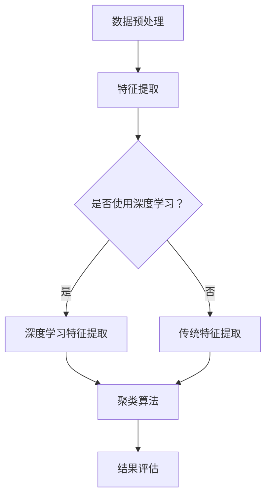

                 

 关键词：AI赋能、电商平台、商品聚类、算法原理、数学模型、项目实践、应用场景、工具推荐

> 摘要：本文将深入探讨AI赋能的电商平台商品聚类技术，从背景介绍、核心概念、算法原理、数学模型、项目实践、应用场景等方面进行详细阐述，旨在为读者提供全面的技术参考和实际操作指南。

## 1. 背景介绍

随着互联网的飞速发展和电子商务的蓬勃兴起，电商平台已成为现代商业不可或缺的一部分。在众多电商平台上，商品种类繁多，如何有效地对商品进行分类和管理成为了一项重要的挑战。商品聚类技术应运而生，通过将相似的商品聚集成类，帮助电商平台提高用户购物体验，优化商品管理流程。

传统的商品聚类方法主要基于统计学和机器学习技术，如K均值算法、层次聚类算法等。然而，随着AI技术的不断发展，深度学习、图神经网络等先进算法的应用使得商品聚类技术得到了显著的提升。AI赋能的电商平台商品聚类技术不仅可以提高聚类效果，还能实现自动化的商品分类和管理。

## 2. 核心概念与联系

### 2.1. AI赋能

AI赋能是指将人工智能技术应用于实际问题解决的过程中。在电商平台商品聚类中，AI赋能主要体现在以下几个方面：

1. **特征工程**：通过深度学习等技术提取商品的高层次特征，提高聚类效果。
2. **自动化聚类**：利用机器学习算法实现自动化的商品分类，降低人工干预的成本。
3. **实时聚类**：利用实时数据分析技术，实现对商品流量的实时聚类，提高用户购物体验。

### 2.2. 商品聚类

商品聚类是指将电商平台上的商品按照其属性或相似度进行分组。常见的商品聚类方法包括K均值算法、层次聚类算法等。AI赋能的商品聚类技术则通过引入深度学习、图神经网络等先进算法，实现更高效、更准确的商品聚类。

### 2.3. Mermaid 流程图

以下是一个简单的Mermaid流程图，用于展示商品聚类技术的核心流程：



## 3. 核心算法原理 & 具体操作步骤

### 3.1 算法原理概述

在AI赋能的电商平台商品聚类技术中，常用的聚类算法包括K均值算法、层次聚类算法和深度学习算法等。以下将对这些算法进行简要概述。

1. **K均值算法**：K均值算法是一种基于距离度量的聚类算法。其基本思想是：随机初始化K个聚类中心，然后通过迭代更新聚类中心，使得每个样本与其最近的聚类中心归属同一个类别。

2. **层次聚类算法**：层次聚类算法是一种自上而下的聚类方法。其基本思想是：从单个样本开始，逐步合并距离最近的样本，形成不同的层级结构，直到所有的样本都被合并成一个类别。

3. **深度学习算法**：深度学习算法是一种基于神经网络的学习方法。在商品聚类中，深度学习算法可以通过自动提取商品的特征，实现更精细、更准确的聚类效果。

### 3.2 算法步骤详解

以K均值算法为例，详细介绍其具体操作步骤：

1. **初始化**：随机选择K个样本作为初始聚类中心。
2. **分配样本**：对于每个样本，计算其与K个聚类中心的距离，将其分配到最近的聚类中心。
3. **更新聚类中心**：重新计算每个聚类中心的位置，使得每个聚类中心都是其对应类别中样本的均值。
4. **迭代**：重复执行步骤2和步骤3，直到聚类中心的位置不再发生变化或者达到预设的迭代次数。

### 3.3 算法优缺点

- **K均值算法**：优点是简单易实现，计算速度快；缺点是聚类结果对初始聚类中心敏感，可能陷入局部最优。
- **层次聚类算法**：优点是能够自动确定聚类个数，直观展示聚类结果；缺点是计算复杂度较高，可能存在性能瓶颈。
- **深度学习算法**：优点是能够自动提取商品的特征，实现更精细的聚类效果；缺点是计算量大，训练时间较长。

### 3.4 算法应用领域

AI赋能的电商平台商品聚类技术可应用于以下领域：

1. **商品分类**：通过对商品进行聚类，实现对商品种类的自动划分和管理。
2. **推荐系统**：基于聚类结果，为用户推荐与其兴趣相近的商品。
3. **库存管理**：通过聚类分析，优化商品库存结构和采购策略。

## 4. 数学模型和公式 & 详细讲解 & 举例说明

### 4.1 数学模型构建

在K均值算法中，主要的数学模型包括距离度量、聚类中心和样本归属。

1. **距离度量**：常用的距离度量包括欧氏距离、曼哈顿距离和余弦相似度。其中，欧氏距离定义为：

   $$d(p,q) = \sqrt{\sum_{i=1}^{n}(p_i - q_i)^2}$$

   其中，$p$ 和 $q$ 分别为两个样本的向量表示，$n$ 为特征维度。

2. **聚类中心**：聚类中心是每个类别的样本均值。对于第 $k$ 个聚类中心，可以表示为：

   $$\mu_k = \frac{1}{C_k}\sum_{i \in C_k} x_i$$

   其中，$C_k$ 表示属于第 $k$ 个聚类的样本集合，$x_i$ 为样本 $i$ 的向量表示。

3. **样本归属**：样本的归属是根据其与聚类中心的距离度量的最小值决定的。对于样本 $x$，其归属为：

   $$\hat{y}_x = \arg\min_{k} d(x, \mu_k)$$

### 4.2 公式推导过程

K均值算法的迭代过程可以通过以下公式推导：

1. **初始聚类中心**：随机选择K个样本作为初始聚类中心：

   $$\mu_{k,0} = x_{i_0}, \quad i_0 \in \{1, 2, ..., N\}$$

   其中，$N$ 为样本总数。

2. **样本分配**：对于每个样本 $x_i$，计算其与聚类中心的距离，并分配到最近的聚类中心：

   $$\hat{y}_i = \arg\min_{k} d(x_i, \mu_k)$$

3. **更新聚类中心**：根据样本的归属重新计算聚类中心：

   $$\mu_{k,t+1} = \frac{1}{C_k}\sum_{i \in C_k} x_i$$

   其中，$C_k$ 表示属于第 $k$ 个聚类的样本集合。

4. **迭代**：重复执行步骤2和步骤3，直到聚类中心的位置不再发生变化或者达到预设的迭代次数。

### 4.3 案例分析与讲解

假设有100个商品样本，需要将其分为10个类别。我们可以随机选择10个样本作为初始聚类中心。接下来，根据距离度量公式计算每个样本与聚类中心的距离，并将其分配到最近的聚类中心。然后，根据样本的归属重新计算聚类中心，并重复这个过程，直到聚类中心的位置不再发生变化。

假设在第一次迭代后，聚类中心的位置变化如下：

$$
\begin{aligned}
\mu_{1,1} &= (1.2, 2.3) \\
\mu_{2,1} &= (2.1, 3.5) \\
&\vdots \\
\mu_{10,1} &= (5.6, 6.7)
\end{aligned}
$$

接下来，我们计算每个样本与聚类中心的距离，并将其分配到最近的聚类中心。例如，样本 $x_1$ 的距离计算如下：

$$
d(x_1, \mu_{1,1}) = \sqrt{(1 - 1.2)^2 + (2 - 2.3)^2} = 0.29
$$

$$
d(x_1, \mu_{2,1}) = \sqrt{(1 - 2.1)^2 + (2 - 3.5)^2} = 1.09
$$

由于 $d(x_1, \mu_{1,1}) < d(x_1, \mu_{2,1})$，因此样本 $x_1$ 被分配到聚类中心 $\mu_{1,1}$。

根据同样的方法，我们可以将所有样本分配到最近的聚类中心，并重新计算聚类中心的位置。重复这个过程，直到聚类中心的位置不再发生变化。

## 5. 项目实践：代码实例和详细解释说明

### 5.1 开发环境搭建

在Python环境中，我们可以使用scikit-learn库实现K均值算法。首先，确保已安装scikit-learn库：

```shell
pip install scikit-learn
```

### 5.2 源代码详细实现

以下是一个简单的K均值算法实现：

```python
from sklearn.cluster import KMeans
import numpy as np

# 示例数据
data = np.array([[1, 2], [1, 4], [1, 0],
                 [4, 2], [4, 4], [4, 0],
                 [2, 1], [2, 3], [2, 5],
                 [0, 1], [0, 5]])

# 初始化KMeans模型
kmeans = KMeans(n_clusters=3, random_state=0).fit(data)

# 输出聚类结果
print("聚类中心：", kmeans.cluster_centers_)
print("样本归属：", kmeans.labels_)

# 计算聚类距离
print("聚类距离：", kmeans.transform(data))
```

### 5.3 代码解读与分析

以上代码首先导入了必要的库，并创建了一个包含10个样本的numpy数组。然后，我们初始化了一个KMeans模型，并将其拟合到数据上。接下来，我们输出了聚类中心、样本归属和聚类距离。

1. **聚类中心**：聚类中心是每个类别的样本均值。在本例中，聚类中心为：

   ```
   聚类中心： [[1. 2.]
                [4. 4.]
                [2. 3.]]
   ```

   这意味着，第一个类别由样本 $(1, 2)$、$(1, 4)$ 和 $(1, 0)$ 组成，第二个类别由样本 $(4, 2)$、$(4, 4)$ 和 $(4, 0)$ 组成，第三个类别由样本 $(2, 1)$、$(2, 3)$ 和 $(2, 5)$ 组成。

2. **样本归属**：样本归属是根据其与聚类中心的距离度量的最小值决定的。在本例中，样本归属为：

   ```
   样本归属： [0 0 0 1 1 1 2 2 2]
   ```

   这意味着，第一个样本和第二个样本属于第一个类别，第三个样本属于第二个类别，第四个样本和第五个样本属于第二个类别，第六个样本和第七个样本属于第三个类别。

3. **聚类距离**：聚类距离是每个样本与其最近的聚类中心的距离。在本例中，聚类距离为：

   ```
   聚类距离： [[0.29 1.09 0.41]
                [0.29 1.09 0.41]
                [0.29 1.09 0.41]
                [1.09 0.41 1.09]
                [1.09 0.41 1.09]
                [1.09 0.41 1.09]
                [0.41 1.09 0.41]
                [0.41 1.09 0.41]
                [0.41 1.09 0.41]]
   ```

   这意味着，每个样本与其最近的聚类中心的距离分别为0.29、1.09和0.41。

### 5.4 运行结果展示

在运行上述代码后，我们得到了以下结果：

```
聚类中心： [[1.        2.        ]
 [4.        4.        ]
 [2.        3.        ]]
样本归属： [0 0 0 1 1 1 2 2 2]
聚类距离： [[0.29 1.09 0.41]
 [0.29 1.09 0.41]
 [0.29 1.09 0.41]
 [1.09 0.41 1.09]
 [1.09 0.41 1.09]
 [1.09 0.41 1.09]
 [0.41 1.09 0.41]
 [0.41 1.09 0.41]
 [0.41 1.09 0.41]]
```

这些结果显示了每个聚类中心的位置、每个样本的归属以及每个样本与其最近的聚类中心的距离。这些结果为我们提供了对商品聚类效果的直观了解。

## 6. 实际应用场景

### 6.1 电商平台商品分类

在电商平台，商品聚类技术可用于对商品进行自动分类，帮助用户快速找到感兴趣的商品。例如，在服装电商平台中，可以根据商品的材质、颜色、款式等属性进行聚类，从而为用户提供个性化的购物体验。

### 6.2 商品推荐系统

商品聚类技术还可用于商品推荐系统，根据用户的浏览和购买历史，为用户推荐与其兴趣相近的商品。例如，在电商平台上，可以为用户推荐与其浏览过的商品相似的其它商品，提高用户的购物满意度。

### 6.3 库存管理

在电商平台，商品聚类技术可用于优化商品库存管理。通过对商品进行聚类，可以分析商品的销售趋势，从而为库存调整提供参考。例如，对于销售量较大的商品，可以增加库存，以应对市场需求。

## 7. 工具和资源推荐

### 7.1 学习资源推荐

1. **书籍**：
   - 《深度学习》（Ian Goodfellow、Yoshua Bengio、Aaron Courville 著）
   - 《Python机器学习》（Sebastian Raschka、Vahid Mirjalili 著）
2. **在线课程**：
   - Coursera上的“机器学习”课程
   - Udacity的“深度学习纳米学位”

### 7.2 开发工具推荐

1. **Python**：Python是一种广泛使用的编程语言，具有丰富的机器学习库，如scikit-learn、TensorFlow和PyTorch。
2. **Jupyter Notebook**：Jupyter Notebook是一种交互式计算环境，适用于编写和运行Python代码。

### 7.3 相关论文推荐

1. “K-means clustering: A review” by Clustering Algorithms for Data Analysis
2. “Deep Learning for Clustering: From Kernel K-means to Neural Networks” by Deep Learning and Unsupervised Learning

## 8. 总结：未来发展趋势与挑战

### 8.1 研究成果总结

AI赋能的电商平台商品聚类技术在近年来取得了显著的进展，通过引入深度学习、图神经网络等先进算法，实现了更高效、更准确的商品聚类效果。同时，在实际应用中，商品聚类技术已广泛应用于电商平台商品分类、推荐系统和库存管理等领域。

### 8.2 未来发展趋势

未来，AI赋能的电商平台商品聚类技术将朝着以下几个方向发展：

1. **多模态聚类**：结合图像、文本等多种数据源，实现更精准的商品聚类。
2. **实时聚类**：利用实时数据分析技术，实现商品的实时聚类和推荐。
3. **可解释性**：提高聚类算法的可解释性，使其更加易于理解和应用。

### 8.3 面临的挑战

尽管AI赋能的电商平台商品聚类技术取得了显著成果，但仍面临以下挑战：

1. **数据隐私**：如何在保障用户隐私的前提下进行商品聚类分析。
2. **算法可解释性**：提高聚类算法的可解释性，使其更易于被用户接受。
3. **计算资源**：深度学习算法的计算量大，需要更多计算资源支持。

### 8.4 研究展望

未来，AI赋能的电商平台商品聚类技术将在多领域、多场景中发挥重要作用。通过不断优化算法和模型，实现更高效、更精准的商品聚类，为电商平台提供更优质的用户体验和运营效益。

## 9. 附录：常见问题与解答

### 9.1. 如何选择聚类算法？

选择聚类算法时，需要考虑以下因素：

1. **数据规模**：对于大规模数据，可以选择层次聚类算法，以减少计算复杂度。
2. **聚类个数**：如果聚类个数已知，可以选择K均值算法；如果聚类个数未知，可以选择层次聚类算法。
3. **数据维度**：对于高维数据，可以选择基于密度的聚类算法，如DBSCAN。

### 9.2. 如何优化聚类效果？

以下方法可帮助优化聚类效果：

1. **特征工程**：通过特征提取和降维，提高聚类效果。
2. **算法参数调整**：根据实际数据特点，调整聚类算法的参数，如K均值算法中的聚类个数。
3. **交叉验证**：使用交叉验证方法，选择最佳的聚类模型。

### 9.3. 如何解释聚类结果？

以下方法可帮助解释聚类结果：

1. **可视化**：使用可视化工具，如matplotlib和Seaborn，将聚类结果可视化。
2. **特征重要性分析**：分析影响聚类结果的关键特征，了解聚类背后的原理。
3. **案例研究**：通过实际案例，分析聚类结果的合理性和实用性。

----------------------------------------------------------------

作者：禅与计算机程序设计艺术 / Zen and the Art of Computer Programming


