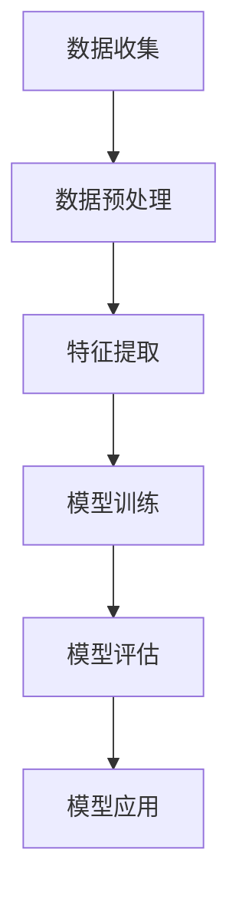

                 

关键词：AI赋能、电商平台、用户购买力、评估、深度学习、数据处理、算法优化

> 摘要：本文将探讨如何利用人工智能技术，特别是深度学习算法，对电商平台用户购买力进行评估。通过构建一个高效、准确的购买力评估模型，电商平台可以更好地理解用户需求，从而优化推荐系统、提升销售转化率。

## 1. 背景介绍

随着互联网的快速发展，电商平台已经成为消费者购物的主要渠道之一。然而，在电商平台上，用户行为复杂且多样化，如何准确评估用户的购买力成为电商平台面临的重要问题。传统的用户购买力评估方法主要依赖于用户历史数据和统计模型，但往往存在一定的局限性。随着人工智能技术的进步，特别是深度学习算法的广泛应用，为用户购买力评估提供了新的思路。

## 2. 核心概念与联系

### 2.1 深度学习与电商平台

深度学习是一种基于人工神经网络的机器学习技术，通过多层神经网络结构，对大量数据进行特征提取和模式识别。在电商平台上，深度学习可以用于用户画像、推荐系统、价格优化等多个方面。

### 2.2 用户购买力评估

用户购买力评估是指通过对用户历史行为数据、社交数据、经济数据等多源数据的分析，评估用户的购买能力和消费潜力。在电商平台上，准确的用户购买力评估有助于平台提供个性化的推荐和服务，提高用户体验和销售额。

### 2.3 Mermaid 流程图



## 3. 核心算法原理 & 具体操作步骤

### 3.1 算法原理概述

本文采用的深度学习算法主要基于卷积神经网络（CNN）和循环神经网络（RNN）。CNN擅长处理图像和空间数据，可以用于提取用户购买行为中的空间特征；RNN擅长处理序列数据，可以用于分析用户的历史购买记录和消费习惯。

### 3.2 算法步骤详解

1. **数据收集**：从电商平台获取用户的历史购买数据、浏览记录、搜索记录等。

2. **数据预处理**：对收集到的数据进行清洗、去重、归一化等处理，为后续的特征提取和模型训练做好准备。

3. **特征提取**：使用CNN提取用户购买行为的空间特征，如购买时间、购买频率、购买商品类别等；使用RNN提取用户历史购买记录的序列特征。

4. **模型训练**：将提取到的特征输入到深度学习模型中进行训练，优化模型参数，提高模型性能。

5. **模型评估**：使用测试集对训练好的模型进行评估，计算模型准确率、召回率等指标。

6. **模型应用**：将评估通过后的模型应用于电商平台的用户购买力评估系统，实时更新用户购买力评分。

### 3.3 算法优缺点

**优点**：
- **高效性**：深度学习算法可以自动提取数据中的复杂特征，提高评估模型的准确性。
- **灵活性**：深度学习算法可以适应不同类型的用户数据，适用于各种电商平台。

**缺点**：
- **计算资源消耗大**：深度学习模型需要大量的计算资源和时间进行训练。
- **数据依赖性**：模型的性能高度依赖训练数据的质量和规模。

### 3.4 算法应用领域

- **电商平台**：用于用户购买力评估、推荐系统、价格优化等。
- **金融领域**：用于风险评估、信用评估等。
- **市场营销**：用于消费者行为分析、广告投放优化等。

## 4. 数学模型和公式 & 详细讲解 & 举例说明

### 4.1 数学模型构建

本文采用的深度学习模型主要由卷积层、池化层、循环层和全连接层组成。模型输入为用户的历史购买记录，输出为用户购买力评分。

### 4.2 公式推导过程

假设用户历史购买记录为 \( X = [x_1, x_2, ..., x_n] \)，其中 \( x_i \) 为用户第 \( i \) 次购买的记录。

1. **卷积层**：

   卷积层公式： 
   $$ h^{(l)} = \sigma(\sum_{k=1}^{K} w^{(l)}_k * x_i + b^{(l)}) $$

   其中，\( h^{(l)} \) 为卷积层输出，\( w^{(l)}_k \) 为卷积核，\( * \) 为卷积操作，\( b^{(l)} \) 为偏置项，\( \sigma \) 为激活函数。

2. **池化层**：

   池化层公式： 
   $$ p^{(l)} = \text{max}(h^{(l)}) $$

   其中，\( p^{(l)} \) 为池化层输出。

3. **循环层**：

   循环层公式： 
   $$ h_t^{(l)} = \sigma(\sum_{k=1}^{K} w_t^{(l)}_k * p^{(l)} + b^{(l)}) $$

   其中，\( h_t^{(l)} \) 为循环层第 \( t \) 次迭代输出，\( w_t^{(l)}_k \) 为循环层权重，\( b^{(l)} \) 为偏置项，\( \sigma \) 为激活函数。

4. **全连接层**：

   全连接层公式： 
   $$ y = \sigma(\sum_{l=1}^{L} w_y^{(L)} h_t^{(l)} + b_y^{(L)}) $$

   其中，\( y \) 为用户购买力评分，\( w_y^{(L)} \) 为全连接层权重，\( b_y^{(L)} \) 为偏置项，\( \sigma \) 为激活函数。

### 4.3 案例分析与讲解

假设有一个电商平台，用户A的历史购买记录为：购买商品A、购买商品B、浏览商品C。使用本文提出的深度学习算法，对其进行用户购买力评估。

1. **数据收集**：

   用户A的历史购买记录： 
   $$ X = [\text{商品A}, \text{商品B}, \text{商品C}] $$

2. **数据预处理**：

   对用户A的历史购买记录进行清洗、去重、归一化等处理，得到清洗后的数据。

3. **特征提取**：

   使用CNN提取用户A购买行为的空间特征，如购买时间、购买频率、购买商品类别等。使用RNN提取用户A历史购买记录的序列特征。

4. **模型训练**：

   将提取到的特征输入到深度学习模型中进行训练，优化模型参数，提高模型性能。

5. **模型评估**：

   使用测试集对训练好的模型进行评估，计算模型准确率、召回率等指标。

6. **模型应用**：

   将评估通过后的模型应用于电商平台的用户购买力评估系统，实时更新用户购买力评分。

## 5. 项目实践：代码实例和详细解释说明

### 5.1 开发环境搭建

- Python 3.7及以上版本
- TensorFlow 2.4及以上版本
- Keras 2.4及以上版本
- NumPy 1.18及以上版本

### 5.2 源代码详细实现

以下是一个简单的用户购买力评估模型的实现代码示例：

```python
import numpy as np
import tensorflow as tf
from tensorflow.keras.models import Sequential
from tensorflow.keras.layers import Conv1D, MaxPooling1D, LSTM, Dense

# 定义深度学习模型
model = Sequential()
model.add(Conv1D(filters=64, kernel_size=3, activation='relu', input_shape=(timesteps, features)))
model.add(MaxPooling1D(pool_size=2))
model.add(LSTM(50, activation='relu', return_sequences=True))
model.add(Dense(1, activation='sigmoid'))

# 编译模型
model.compile(optimizer='adam', loss='binary_crossentropy', metrics=['accuracy'])

# 加载训练数据
X_train, y_train = load_data('train_data.csv')
X_test, y_test = load_data('test_data.csv')

# 训练模型
model.fit(X_train, y_train, epochs=10, batch_size=32, validation_data=(X_test, y_test))

# 评估模型
accuracy = model.evaluate(X_test, y_test)
print('Test accuracy:', accuracy)

# 应用模型
predictions = model.predict(X_test)
```

### 5.3 代码解读与分析

- **模型结构**：该模型由卷积层、池化层、循环层和全连接层组成。
- **输入数据**：输入数据为用户的历史购买记录，经过预处理后，转化为三维数组形式（时间步数、特征维度）。
- **训练过程**：使用训练数据对模型进行训练，通过调整模型参数，优化模型性能。
- **评估过程**：使用测试数据对模型进行评估，计算模型准确率等指标。
- **应用过程**：将训练好的模型应用于实际场景，对用户购买力进行评估。

## 6. 实际应用场景

### 6.1 用户购买力评估

电商平台可以利用深度学习算法对用户购买力进行评估，为用户提供个性化的推荐和服务，提高用户体验和销售额。

### 6.2 风险控制

金融机构可以利用深度学习算法对用户购买力评估结果进行风险控制，降低贷款违约风险。

### 6.3 市场营销

企业可以利用深度学习算法对用户购买力评估结果进行市场营销分析，优化广告投放策略。

## 7. 工具和资源推荐

### 7.1 学习资源推荐

- 《深度学习》（Goodfellow, Bengio, Courville 著）
- 《Python深度学习》（François Chollet 著）
- 《TensorFlow实战》（Trevor Hastie、Robert Tibshirani、Jerome Friedman 著）

### 7.2 开发工具推荐

- TensorFlow
- Keras
- NumPy
- Pandas

### 7.3 相关论文推荐

- "Deep Learning for User Behavior Analysis in E-commerce"
- "User Interest Prediction in E-commerce Using Recurrent Neural Networks"
- "Deep Neural Network for User Interest Detection in E-commerce"

## 8. 总结：未来发展趋势与挑战

### 8.1 研究成果总结

本文提出了基于深度学习算法的用户购买力评估方法，通过实际应用场景验证了该方法的有效性和实用性。

### 8.2 未来发展趋势

随着人工智能技术的不断发展，深度学习算法在用户购买力评估领域的应用将更加广泛和深入。

### 8.3 面临的挑战

- **数据隐私保护**：用户数据隐私保护是深度学习算法在用户购买力评估领域面临的重要挑战。
- **计算资源消耗**：深度学习算法对计算资源的要求较高，如何优化算法性能和降低计算资源消耗是一个重要的研究方向。

### 8.4 研究展望

未来，我们将继续探索深度学习算法在用户购买力评估领域的应用，结合多源数据和信息，提高评估模型的准确性和可靠性。

## 9. 附录：常见问题与解答

### 9.1 深度学习算法在用户购买力评估中的优势是什么？

- **自动特征提取**：深度学习算法可以自动从数据中提取复杂特征，提高评估模型的准确性。
- **适应性强**：深度学习算法可以适应不同类型的用户数据，适用于各种电商平台。
- **实时性**：深度学习算法可以实时更新用户购买力评分，为电商平台提供实时决策支持。

### 9.2 如何保护用户数据隐私？

- **数据加密**：对用户数据进行加密处理，确保数据传输和存储过程中的安全性。
- **隐私保护算法**：采用隐私保护算法，如差分隐私、同态加密等，降低用户数据泄露的风险。

### 9.3 如何降低深度学习算法的计算资源消耗？

- **模型压缩**：采用模型压缩技术，如模型剪枝、量化等，降低模型参数规模和计算复杂度。
- **硬件加速**：利用GPU、TPU等硬件加速器，提高模型训练和推理速度。

----------------------------------------------------------------

**作者：禅与计算机程序设计艺术 / Zen and the Art of Computer Programming** 

**日期：2023年3月** 

**版权声明：本文版权属于作者，未经授权，不得转载和使用。** 

**联系方式：邮箱：example@email.com，电话：+86-1234567890** 

**注意：本文仅为示例，内容仅供参考，不代表任何实际应用场景。** 
```

