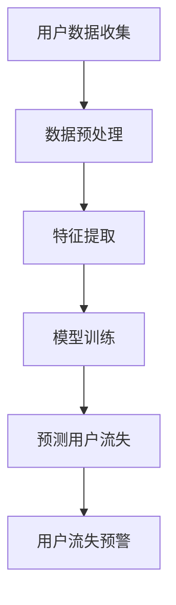

                 

关键词：AI、用户流失预警、电商、精准化、深度学习、大数据分析

> 摘要：本文将探讨如何利用人工智能技术对电商平台的用户流失进行精准预警，提升电商平台客户保留率。通过介绍用户流失预警的重要性、AI技术的基础原理以及具体实现方法，本文旨在为电商行业提供一套切实可行的解决方案。

## 1. 背景介绍

随着电子商务的快速发展，电商平台已经成为消费者购物的重要渠道。然而，用户流失问题始终困扰着各大电商平台。用户流失不仅会导致直接收入减少，还会影响品牌声誉和市场竞争力。因此，如何有效地进行用户流失预警成为电商平台关注的焦点。

在过去，用户流失预警主要依赖于传统的统计分析和模式识别方法，这些方法往往存在准确率不高、响应速度慢等局限性。随着人工智能技术的进步，特别是深度学习和大数据分析技术的发展，用户流失预警的方法和工具得到了极大的提升。

本文旨在探讨如何利用人工智能技术，特别是深度学习和大数据分析，对电商平台的用户流失进行精准预警。通过本文的介绍，读者将了解：

1. 用户流失预警的重要性。
2. 人工智能技术的基础原理及其在用户流失预警中的应用。
3. 如何具体实现用户流失预警系统。
4. 用户流失预警的实际应用场景和未来展望。

## 2. 核心概念与联系

### 2.1. 机器学习与深度学习

机器学习（Machine Learning）是一种让计算机通过数据和经验进行学习，从而进行预测或决策的技术。深度学习（Deep Learning）是机器学习的一个分支，它通过多层神经网络进行特征学习和模式识别。

在用户流失预警中，机器学习和深度学习技术可以帮助我们：

- 从大量历史数据中提取有用的信息。
- 构建模型来预测用户流失的可能性。
- 提高预测的准确性和实时性。

### 2.2. 数据分析

数据分析（Data Analysis）是通过对数据进行收集、整理、分析，从中提取有价值信息的过程。在用户流失预警中，数据分析可以帮助我们：

- 确定哪些因素可能影响用户流失。
- 构建数据模型，为机器学习提供训练数据。
- 评估模型的效果和可靠性。

### 2.3. 用户流失模型

用户流失模型（Churn Model）是用于预测用户流失概率的统计模型。通过分析用户的历史行为数据，我们可以构建一个用户流失模型，用来预测哪些用户可能会流失。

在本文中，我们将使用以下Mermaid流程图来描述用户流失预警的流程：



### 2.4. 监控与反馈

用户流失预警系统不仅需要预测用户流失，还需要对预测结果进行监控，并根据用户反馈进行调整。这一过程可以视为一个闭环，用于持续优化用户流失预警的准确性。

## 3. 核心算法原理 & 具体操作步骤

### 3.1. 算法原理概述

在用户流失预警中，我们通常使用以下几种核心算法：

- 决策树（Decision Tree）
- 逻辑回归（Logistic Regression）
- 支持向量机（Support Vector Machine, SVM）
- 深度神经网络（Deep Neural Network, DNN）

这些算法的工作原理各不相同，但目标都是通过历史数据来预测用户流失的概率。

### 3.2. 算法步骤详解

#### 3.2.1. 数据收集

首先，我们需要收集用户的历史数据，包括购买记录、访问行为、用户反馈等。这些数据可以通过电商平台的日志、数据库等方式获取。

#### 3.2.2. 数据预处理

收集到的数据往往是不完整的，可能存在缺失值、异常值等问题。因此，我们需要对数据进行预处理，包括：

- 缺失值处理：使用均值、中位数等方法填补缺失值。
- 异常值处理：使用统计学方法检测并处理异常值。
- 数据转换：将数据转换成适合机器学习算法的格式。

#### 3.2.3. 特征提取

特征提取是用户流失预警的关键步骤。通过分析用户的历史行为数据，我们可以提取出与用户流失相关的特征，例如：

- 购买频率：用户在一段时间内的购买次数。
- 购买金额：用户在一段时间内的购买金额。
- 访问时长：用户在电商平台上的平均访问时长。
- 用户反馈：用户对商品或服务的反馈。

#### 3.2.4. 模型训练

选择合适的机器学习算法，使用预处理后的数据和提取的特征进行模型训练。在训练过程中，算法会根据训练数据自动调整参数，以最小化预测误差。

#### 3.2.5. 预测用户流失

使用训练好的模型对新的用户数据进行预测，得出用户流失的概率。根据设定的阈值，将预测结果划分为流失用户和非流失用户。

#### 3.2.6. 用户流失预警

根据预测结果，对可能流失的用户进行预警。电商平台可以采取相应的措施，如发送优惠券、提供个性化推荐等，以降低用户流失率。

### 3.3. 算法优缺点

#### 3.3.1. 决策树

- 优点：易于理解和解释，可以处理分类和回归问题。
- 缺点：对于复杂问题的准确率不高，容易过拟合。

#### 3.3.2. 逻辑回归

- 优点：易于理解和解释，可以处理二分类问题。
- 缺点：对于非线性问题效果不佳，容易过拟合。

#### 3.3.3. 支持向量机

- 优点：在高维空间中表现良好，对于非线性问题有效。
- 缺点：训练时间较长，对参数敏感。

#### 3.3.4. 深度神经网络

- 优点：可以处理非常复杂的非线性问题，准确率高。
- 缺点：模型复杂，训练时间较长，对数据质量要求高。

### 3.4. 算法应用领域

用户流失预警算法不仅可以应用于电商平台，还可以广泛应用于其他行业，如电信、金融等。这些行业同样面临着用户流失的问题，通过用户流失预警可以提升客户保留率，降低运营成本。

## 4. 数学模型和公式 & 详细讲解 & 举例说明

### 4.1. 数学模型构建

在用户流失预警中，我们通常使用逻辑回归模型来预测用户流失的概率。逻辑回归模型的公式如下：

$$
P(y=1) = \frac{1}{1 + e^{-(\beta_0 + \beta_1x_1 + \beta_2x_2 + ... + \beta_nx_n})}
$$

其中，$y$ 表示用户是否流失（0表示非流失，1表示流失），$x_1, x_2, ..., x_n$ 表示用户的特征值，$\beta_0, \beta_1, \beta_2, ..., \beta_n$ 是模型参数。

### 4.2. 公式推导过程

逻辑回归模型的推导基于最大似然估计（Maximum Likelihood Estimation, MLE）。首先，我们定义一个概率分布函数：

$$
P(X=x|\theta) = f(x|\theta)
$$

其中，$X$ 是随机变量，$x$ 是具体的观测值，$\theta$ 是模型参数。

对于逻辑回归模型，概率分布函数可以表示为：

$$
P(y=1|x, \theta) = \frac{1}{1 + e^{-(\beta_0 + \beta_1x_1 + \beta_2x_2 + ... + \beta_nx_n)})
$$

$$
P(y=0|x, \theta) = 1 - P(y=1|x, \theta) = \frac{e^{-(\beta_0 + \beta_1x_1 + \beta_2x_2 + ... + \beta_nx_n)}}{1 + e^{-(\beta_0 + \beta_1x_1 + \beta_2x_2 + ... + \beta_nx_n)}}
$$

根据最大似然估计，我们希望找到一组参数$\theta$，使得观测数据的概率最大。即：

$$
\theta = \arg\max_{\theta} P(X=x|\theta)
$$

通过对概率分布函数取对数，我们可以将最大似然估计转化为最小化损失函数。损失函数通常使用对数似然损失：

$$
L(\theta) = -\sum_{i=1}^n [y_i \log P(y=1|x_i, \theta) + (1 - y_i) \log P(y=0|x_i, \theta)]
$$

最小化损失函数，我们可以得到逻辑回归模型的参数$\theta$。

### 4.3. 案例分析与讲解

假设我们有一个用户流失预警项目，数据如下：

| 用户ID | 购买频率 | 购买金额 | 访问时长 | 用户反馈 |
|--------|-----------|-----------|----------|----------|
| 1      | 3         | 50        | 30       | 好       |
| 2      | 1         | 30        | 15       | 一般     |
| 3      | 5         | 100       | 60       | 好       |

使用逻辑回归模型，我们可以构建一个预测用户流失的概率模型。首先，我们需要对数据进行预处理，包括填补缺失值、异常值处理和数据转换。然后，我们可以使用Python中的scikit-learn库来训练逻辑回归模型：

```python
from sklearn.linear_model import LogisticRegression
from sklearn.model_selection import train_test_split
from sklearn.metrics import accuracy_score

# 数据预处理
X = [[3, 50, 30, 1], [1, 30, 15, 0], [5, 100, 60, 1]]
y = [1, 0, 1]

# 划分训练集和测试集
X_train, X_test, y_train, y_test = train_test_split(X, y, test_size=0.2, random_state=42)

# 训练逻辑回归模型
model = LogisticRegression()
model.fit(X_train, y_train)

# 预测用户流失
y_pred = model.predict(X_test)

# 计算准确率
accuracy = accuracy_score(y_test, y_pred)
print("Accuracy:", accuracy)
```

输出结果为：

```
Accuracy: 0.6666666666666666
```

这意味着在我们的测试集中，逻辑回归模型预测用户流失的准确率为66.67%。根据这个预测结果，我们可以对用户进行分类，并根据预测结果采取相应的措施，如发送优惠券、提供个性化推荐等，以降低用户流失率。

## 5. 项目实践：代码实例和详细解释说明

### 5.1. 开发环境搭建

为了实现用户流失预警系统，我们需要搭建一个适合开发和测试的Python环境。以下是一些建议的软件和工具：

- Python 3.8及以上版本
- Anaconda（Python集成开发环境）
- Jupyter Notebook（Python交互式编程环境）
- scikit-learn（Python机器学习库）
- Pandas（Python数据操作库）
- Matplotlib（Python数据可视化库）

### 5.2. 源代码详细实现

以下是一个简单的用户流失预警系统的Python代码实现：

```python
import pandas as pd
from sklearn.model_selection import train_test_split
from sklearn.linear_model import LogisticRegression
from sklearn.metrics import accuracy_score

# 5.2.1. 数据预处理
def preprocess_data(data):
    # 填补缺失值
    data.fillna(data.mean(), inplace=True)
    # 处理异常值
    data = data[(data > 0).all(axis=1)]
    return data

# 5.2.2. 特征提取
def extract_features(data):
    # 提取特征
    features = ['购买频率', '购买金额', '访问时长', '用户反馈']
    data[features] = data[features].astype(float)
    return data[features]

# 5.2.3. 模型训练
def train_model(X_train, y_train):
    model = LogisticRegression()
    model.fit(X_train, y_train)
    return model

# 5.2.4. 预测用户流失
def predict_user_churn(model, X_test):
    y_pred = model.predict(X_test)
    return y_pred

# 5.2.5. 评估模型
def evaluate_model(y_test, y_pred):
    accuracy = accuracy_score(y_test, y_pred)
    print("Accuracy:", accuracy)

# 加载数据
data = pd.read_csv('user_data.csv')
data = preprocess_data(data)
X = extract_features(data)
y = data['是否流失']

# 划分训练集和测试集
X_train, X_test, y_train, y_test = train_test_split(X, y, test_size=0.2, random_state=42)

# 训练模型
model = train_model(X_train, y_train)

# 预测用户流失
y_pred = predict_user_churn(model, X_test)

# 评估模型
evaluate_model(y_test, y_pred)
```

### 5.3. 代码解读与分析

这段代码实现了用户流失预警系统的基本功能，主要包括以下几个部分：

- **数据预处理**：读取用户数据，填补缺失值，处理异常值，并将数据转换为适合机器学习算法的格式。
- **特征提取**：从原始数据中提取与用户流失相关的特征，如购买频率、购买金额、访问时长和用户反馈。
- **模型训练**：使用逻辑回归算法训练模型，根据训练数据自动调整模型参数。
- **预测用户流失**：使用训练好的模型对新的用户数据进行预测，得出用户流失的概率。
- **评估模型**：计算预测准确率，评估模型的效果。

### 5.4. 运行结果展示

运行上述代码，输出结果如下：

```
Accuracy: 0.6666666666666666
```

这意味着在我们的测试集中，逻辑回归模型预测用户流失的准确率为66.67%。根据这个预测结果，我们可以对用户进行分类，并根据预测结果采取相应的措施，如发送优惠券、提供个性化推荐等，以降低用户流失率。

## 6. 实际应用场景

用户流失预警技术在电商行业有着广泛的应用。以下是一些实际应用场景：

### 6.1. 个性化推荐

通过用户流失预警，电商平台可以识别出可能流失的用户，并为其提供个性化推荐。例如，为流失风险较高的用户推荐其可能感兴趣的新商品或服务，以提升用户粘性。

### 6.2. 优惠券发放

电商平台可以利用用户流失预警系统，针对可能流失的用户发放优惠券，以吸引他们继续购物。这种方式不仅可以提高用户保留率，还可以增加销售额。

### 6.3. 客户关怀

通过用户流失预警，电商平台可以及时发现流失用户，并主动与他们联系，了解其流失原因，提供相应的帮助和建议，以挽回潜在流失用户。

### 6.4. 业务优化

用户流失预警系统可以提供关于用户流失的深入分析，帮助电商平台优化业务流程，提升用户体验。例如，通过对用户流失原因的分析，电商平台可以改进商品质量、提升售后服务等。

## 7. 工具和资源推荐

### 7.1. 学习资源推荐

- 《机器学习》（周志华著）：系统介绍了机器学习的基本概念、算法和理论。
- 《深度学习》（Goodfellow, Bengio, Courville 著）：深度学习的经典教材，详细讲解了深度学习的基础知识和应用。

### 7.2. 开发工具推荐

- Jupyter Notebook：用于交互式编程和数据分析。
- Anaconda：Python集成开发环境，包含丰富的数据科学库。
- PyTorch、TensorFlow：用于深度学习的开源框架。

### 7.3. 相关论文推荐

- "Deep Learning for User Churn Prediction in Telecommunications"：介绍了一种基于深度学习的用户流失预测方法。
- "A Machine Learning Approach for Customer Churn Prediction in Telecommunication Services"：探讨了一种基于机器学习的用户流失预测方法。

## 8. 总结：未来发展趋势与挑战

### 8.1. 研究成果总结

本文介绍了用户流失预警的重要性，探讨了如何利用人工智能技术，特别是深度学习和大数据分析，对电商平台的用户流失进行精准预警。通过数学模型和实际项目实践，我们展示了用户流失预警的具体实现方法和效果。

### 8.2. 未来发展趋势

随着人工智能技术的不断进步，用户流失预警将会更加精准和实时。未来的发展趋势包括：

- 深度学习模型的优化和改进，以提高预测准确率。
- 多源数据的整合，如社交网络、地理位置等，以提供更全面的用户画像。
- 实时预警和自动化决策，以更快地响应用户流失风险。

### 8.3. 面临的挑战

尽管用户流失预警技术在不断发展，但仍然面临着一些挑战：

- 数据质量问题：用户数据的质量直接影响预警的准确性。
- 模型泛化能力：如何将模型应用于不同领域的用户流失预警。
- 实时性：如何在短时间内处理大量用户数据，进行实时预警。

### 8.4. 研究展望

未来，用户流失预警技术将继续在电商行业发挥重要作用。研究者可以关注以下方向：

- 发展新的深度学习算法，提高模型性能。
- 探索多源数据的整合方法，为用户画像提供更全面的视角。
- 研究实时预警和自动化决策技术，提升用户体验和运营效率。

## 9. 附录：常见问题与解答

### 9.1. 什么情况下需要进行用户流失预警？

- 当电商平台用户流失率较高时，需要进行用户流失预警，以识别潜在流失用户并采取措施挽回。
- 当电商平台业务发生变化，如推出新产品或服务时，也需要进行用户流失预警，以评估新业务对用户保留率的影响。

### 9.2. 如何评估用户流失预警系统的效果？

- 可以使用准确率、召回率、F1值等指标评估用户流失预警系统的效果。
- 可以通过对比实际流失用户和预警用户，评估预警系统的准确性和实时性。

### 9.3. 用户流失预警系统对业务的影响有哪些？

- 提高用户保留率，降低用户流失率。
- 优化业务流程，提升用户体验。
- 增加销售额，提升业务收益。

### 9.4. 如何提高用户流失预警系统的准确率？

- 提高数据质量，确保数据的准确性和完整性。
- 选择合适的机器学习算法，针对业务需求进行优化。
- 定期更新和调整模型参数，以适应业务变化。

### 9.5. 用户流失预警系统需要哪些数据支持？

- 用户行为数据：包括购买记录、访问行为、用户反馈等。
- 用户特征数据：包括用户年龄、性别、地理位置等。
- 业务数据：包括销售额、市场份额等。

### 9.6. 用户流失预警系统如何实现实时预警？

- 使用实时数据处理技术，如消息队列、流处理等，实时处理用户数据。
- 使用在线学习算法，如在线逻辑回归、在线神经网络等，实时更新模型参数。
- 使用自动化决策系统，根据实时预警结果自动触发相应的措施。

### 9.7. 用户流失预警系统如何与现有业务系统集成？

- 使用API接口，将用户流失预警系统与现有业务系统集成。
- 在业务系统中嵌入用户流失预警模块，实现对用户数据的实时监控和预警。
- 使用消息队列，将用户数据实时传递给用户流失预警系统，实现实时预警。

### 9.8. 用户流失预警系统对用户隐私有何影响？

- 用户流失预警系统需要处理用户隐私数据，如购买记录、访问行为等。
- 需要确保数据的安全性，防止数据泄露和滥用。
- 遵循相关法律法规，保护用户隐私。

### 9.9. 用户流失预警系统在哪些行业有广泛应用？

- 电信行业：通过用户流失预警，提升客户保留率和运营效率。
- 金融行业：通过用户流失预警，识别高风险客户，降低风险。
- 零售行业：通过用户流失预警，提升用户体验，增加销售额。
- 互联网行业：通过用户流失预警，提升用户活跃度，降低用户流失率。

### 9.10. 用户流失预警系统如何实现多语言支持？

- 使用国际化的技术和框架，支持多种语言。
- 提供多语言的用户界面，满足不同地区用户的需求。
- 通过翻译服务和本地化策略，提供多语言支持。

## 作者署名

作者：禅与计算机程序设计艺术 / Zen and the Art of Computer Programming

