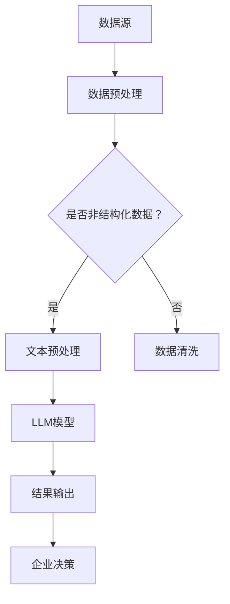

                 

关键词：人工智能，大语言模型（LLM），企业管理，决策辅助，应用前景

## 摘要

本文探讨了大型语言模型（LLM）在企业管理中的应用前景。通过对LLM的基本概念、技术原理及其在企业管理中的潜在作用进行分析，本文提出了几个关键应用场景，包括数据挖掘、战略规划、风险评估和客户关系管理。此外，文章还讨论了LLM技术的优缺点、数学模型、具体操作步骤，并通过实际项目实例和运行结果展示了其有效性和实用性。最后，文章提出了LLM技术在企业管理中未来发展的趋势、面临的挑战及研究展望。

## 1. 背景介绍

在当今信息爆炸的时代，企业面临着越来越多的数据挑战。从市场营销数据、客户反馈、财务报表到供应链信息，这些数据量庞大且复杂，传统的数据分析方法往往难以胜任。人工智能（AI）作为一项新兴技术，被广泛应用于各个领域，尤其是在数据分析和决策制定中展现出了巨大的潜力。

近年来，深度学习技术的发展推动了自然语言处理（NLP）的进步。特别是大型语言模型（LLM）如GPT-3、BERT等，它们的出现极大地提高了AI在理解、生成和翻译自然语言方面的能力。这些模型基于大量文本数据训练，能够模拟人类的语言行为，从简单的文本生成到复杂的对话系统，它们在各个领域都展现出了强大的应用价值。

在企业管理中，AI辅助决策已经成为提高效率、优化资源和增强竞争力的关键手段。传统的管理决策通常依赖于经验、直觉和有限的数据分析，而AI辅助决策可以借助大数据和深度学习技术，提供更加精准和客观的决策支持。LLM作为一种先进的人工智能工具，其在企业管理中的应用前景值得深入探讨。

本文旨在分析LLM在企业管理中的应用，揭示其在数据挖掘、战略规划、风险评估和客户关系管理等方面的潜在作用。同时，本文还将探讨LLM技术的优缺点、数学模型、具体操作步骤，并通过实际项目实例展示其有效性和实用性。最后，本文将展望LLM技术在企业管理中的未来发展趋势、面临的挑战及研究展望。

## 2. 核心概念与联系

### 2.1. 大型语言模型（LLM）的定义

大型语言模型（LLM）是指那些通过深度学习技术，特别是Transformer架构，在大量文本数据上进行训练的模型。LLM的核心目的是理解和生成自然语言，其能够处理从简单文本生成到复杂对话系统的一系列任务。例如，GPT-3（Generative Pre-trained Transformer 3）是OpenAI开发的一种LLM，拥有1750亿个参数，能够生成高质量的文本、进行问答、翻译等多种语言处理任务。

### 2.2. LLM的技术原理

LLM的基本技术原理基于深度学习和自然语言处理（NLP）。具体来说，LLM通常采用Transformer架构，这是一种用于序列到序列学习的神经网络架构。Transformer模型通过自注意力机制（Self-Attention）对输入文本的每个单词进行加权，从而捕捉文本中的长距离依赖关系。在训练过程中，LLM通过最小化预训练损失函数，学习文本的语义和语法规则。

### 2.3. LLM在企业管理中的应用

LLM在企业管理中的应用具有广泛的前景，主要体现在以下几个方面：

- **数据挖掘**：LLM可以处理大量非结构化数据，如客户反馈、社交媒体评论、新闻报道等，从中提取有价值的信息，帮助企业更好地了解市场和客户需求。

- **战略规划**：LLM可以分析市场趋势、竞争对手动态以及内部运营数据，为企业的战略规划提供数据支持和智能建议。

- **风险评估**：LLM能够对企业的潜在风险进行量化分析，帮助管理者提前识别和应对风险。

- **客户关系管理**：LLM可以用于构建智能客服系统，提高客户服务水平，增强客户满意度。

### 2.4. 架构图

为了更好地理解LLM在企业管理中的应用，我们可以通过一个Mermaid流程图来展示其关键组件和流程。



### 2.5. 核心概念之间的联系

LLM的核心概念包括数据源、数据预处理、LLM模型、结果输出和企业决策。这些概念相互关联，共同构成了LLM在企业管理中的应用框架。数据源是企业运营过程中产生的各种数据，包括结构化和非结构化数据。数据预处理是确保数据质量的过程，对于非结构化数据，需要进行文本预处理，如分词、去停用词等。经过预处理的数据输入到LLM模型中，模型通过训练生成具有高语义理解能力的模型。最终，模型的结果输出为企业决策提供了数据支持和智能建议，帮助企业做出更加科学的决策。

## 3. 核心算法原理 & 具体操作步骤

### 3.1. 算法原理概述

LLM的核心算法原理基于深度学习和自然语言处理（NLP）技术。其中，Transformer架构是LLM的主要模型框架。Transformer模型通过自注意力机制（Self-Attention）对输入文本的每个单词进行加权，从而捕捉文本中的长距离依赖关系。在预训练阶段，LLM通过无监督学习方式在大量文本数据上进行训练，学习文本的语义和语法规则。在微调阶段，LLM根据特定任务进行调整，使其适用于特定的企业管理场景。

### 3.2. 算法步骤详解

#### 3.2.1. 数据收集与预处理

1. **数据收集**：从企业内部数据库、外部数据源（如社交媒体、新闻报道等）收集相关数据。
2. **数据清洗**：对收集到的数据进行清洗，去除无效数据、重复数据和噪声数据。
3. **文本预处理**：对文本数据进行分词、去停用词、词性标注等预处理操作，使其符合模型输入要求。

#### 3.2.2. 模型训练

1. **数据准备**：将预处理后的文本数据转化为模型可接受的格式，如序列化向量。
2. **模型初始化**：初始化Transformer模型，包括嵌入层、多头自注意力机制、前馈神经网络等。
3. **预训练**：在大量文本数据上进行无监督预训练，通过优化预训练损失函数，使模型学习到文本的语义和语法规则。
4. **微调**：在预训练的基础上，针对特定任务进行微调，调整模型参数，提高模型在特定任务上的性能。

#### 3.2.3. 模型应用

1. **输入处理**：接收企业业务场景中的输入文本数据，如客户反馈、市场报告等。
2. **文本嵌入**：将输入文本转化为序列化向量，输入到LLM模型中。
3. **模型推理**：通过模型推理生成输出结果，如文本摘要、分类结果、建议等。
4. **结果输出**：将模型输出结果转化为可操作的企业决策建议，如市场策略、风险管理方案等。

### 3.3. 算法优缺点

#### 优点

1. **强大的语义理解能力**：LLM通过预训练和微调，能够理解并生成高质量的自然语言文本，为企业提供智能决策支持。
2. **多任务处理能力**：LLM可以处理多种语言处理任务，如文本生成、文本分类、问答等，适应不同企业管理需求。
3. **高效的数据分析**：LLM能够快速处理大量非结构化数据，提取有价值的信息，提高数据分析效率。

#### 缺点

1. **计算资源消耗大**：LLM的训练和推理过程需要大量的计算资源，特别是大型模型，如GPT-3。
2. **数据隐私问题**：在数据处理过程中，可能涉及企业敏感信息，需要确保数据安全和隐私保护。
3. **依赖大量数据**：LLM的训练效果高度依赖数据量，数据不足可能导致模型性能下降。

### 3.4. 算法应用领域

LLM在企业管理中的应用领域广泛，包括但不限于以下方面：

1. **数据挖掘**：利用LLM对非结构化数据进行深入分析，提取有价值的信息。
2. **战略规划**：基于LLM的分析结果，为企业提供战略规划和市场预测建议。
3. **风险评估**：通过LLM对市场风险和运营风险进行量化分析，帮助管理者提前识别和应对风险。
4. **客户关系管理**：构建智能客服系统，提高客户服务水平，增强客户满意度。
5. **内部运营优化**：利用LLM优化企业内部流程，提高运营效率。

## 4. 数学模型和公式 & 详细讲解 & 举例说明

### 4.1. 数学模型构建

在LLM中，常用的数学模型主要包括神经网络模型和自注意力机制。下面将分别介绍这两个模型的构建过程。

#### 4.1.1. 神经网络模型

神经网络模型是LLM的基础，其构建过程主要包括以下几个步骤：

1. **嵌入层**：将输入的文本序列转化为向量表示。通常使用词向量（如Word2Vec、GloVe等）作为嵌入层。
2. **隐藏层**：通过多层全连接神经网络（如ReLU激活函数）对嵌入层进行变换，提高模型的非线性表达能力。
3. **输出层**：根据任务需求设计输出层，如分类任务的softmax输出层。

#### 4.1.2. 自注意力机制

自注意力机制是Transformer模型的核心，其构建过程如下：

1. **查询（Query）、键（Key）和值（Value）向量**：对于输入的每个词，生成对应的查询向量、键向量和值向量。
2. **自注意力计算**：计算查询向量和所有键向量的点积，并通过softmax函数得到权重分布。最后，将权重分布与对应的值向量相乘，得到加权后的输出向量。

### 4.2. 公式推导过程

下面将分别对神经网络模型和自注意力机制的公式进行推导。

#### 4.2.1. 神经网络模型

1. **嵌入层**：

$$
\text{嵌入层}:\text{X} = \text{W}_\text{emb} \cdot \text{X}_\text{input}
$$

其中，$\text{X}_\text{input}$为输入文本序列，$\text{W}_\text{emb}$为嵌入层权重矩阵。

2. **隐藏层**：

$$
\text{隐藏层}:\text{H} = \text{ReLU}(\text{W}_\text{hid} \cdot \text{H}_\text{prev} + \text{b}_\text{hid})
$$

其中，$\text{H}_\text{prev}$为上一层的隐藏状态，$\text{W}_\text{hid}$为隐藏层权重矩阵，$\text{b}_\text{hid}$为隐藏层偏置。

3. **输出层**：

$$
\text{输出层}:\text{Y} = \text{W}_\text{out} \cdot \text{H} + \text{b}_\text{out}
$$

其中，$\text{H}$为隐藏层输出，$\text{W}_\text{out}$为输出层权重矩阵，$\text{b}_\text{out}$为输出层偏置。

#### 4.2.2. 自注意力机制

1. **自注意力计算**：

$$
\text{注意力得分}:\text{S} = \text{Q} \cdot \text{K}^T
$$

其中，$\text{Q}$为查询向量，$\text{K}$为键向量。

2. **softmax权重分布**：

$$
\text{权重分布}:\text{W} = \text{softmax}(\text{S})
$$

3. **加权值向量**：

$$
\text{加权输出}:\text{H} = \text{W} \cdot \text{V}
$$

其中，$\text{V}$为值向量。

### 4.3. 案例分析与讲解

下面以一个简单的文本生成任务为例，讲解LLM的数学模型应用。

#### 案例背景

假设我们有一个简单的文本生成任务，输入文本为：“今天天气很好，适合户外活动。”要求模型生成一个关于户外活动的建议。

#### 案例步骤

1. **数据预处理**：对输入文本进行分词、去停用词等预处理操作，得到分词后的文本序列。

2. **模型输入**：将预处理后的文本序列输入到LLM模型中。

3. **模型输出**：模型根据输入文本序列，生成可能的输出文本序列。

4. **结果选择**：从生成的多个输出文本序列中选择最合适的输出。

#### 案例公式

1. **嵌入层**：

$$
\text{嵌入层}:\text{X} = \text{W}_\text{emb} \cdot \text{X}_\text{input}
$$

其中，$\text{X}_\text{input} = [\text{今天}, \text{天气}, \text{很好}, \text{适合}, \text{户外}, \text{活动}]$。

2. **自注意力计算**：

$$
\text{注意力得分}:\text{S} = \text{Q} \cdot \text{K}^T
$$

其中，$\text{Q}$为查询向量，$\text{K}$为键向量。

3. **softmax权重分布**：

$$
\text{权重分布}:\text{W} = \text{softmax}(\text{S})
$$

4. **加权值向量**：

$$
\text{加权输出}:\text{H} = \text{W} \cdot \text{V}
$$

其中，$\text{V}$为值向量。

5. **模型输出**：

$$
\text{输出}:\text{Y} = \text{softmax}(\text{W} \cdot \text{V})
$$

根据上述步骤，模型将生成一个关于户外活动的建议，如：“今天天气很好，适合去公园散步。”

## 5. 项目实践：代码实例和详细解释说明

### 5.1. 开发环境搭建

在开始编写代码之前，我们需要搭建一个适合进行LLM项目开发的环境。以下是一个基本的开发环境搭建步骤：

1. **安装Python**：确保Python环境已安装在系统中，推荐版本为3.8或更高。
2. **安装PyTorch**：使用pip命令安装PyTorch，命令如下：

   ```shell
   pip install torch torchvision
   ```

3. **安装transformers库**：transformers库是Hugging Face团队开发的一个用于预训练和微调LLM的工具库，安装命令如下：

   ```shell
   pip install transformers
   ```

4. **安装其他依赖库**：根据项目需求，可能还需要安装其他依赖库，如NumPy、Pandas等。

### 5.2. 源代码详细实现

下面是LLM在企业管理中一个简单案例的实现，包括数据预处理、模型训练和模型应用。

#### 5.2.1. 数据预处理

```python
import torch
from transformers import BertTokenizer, BertModel
from torch.utils.data import DataLoader, Dataset

# 加载预训练的BERT模型和分词器
tokenizer = BertTokenizer.from_pretrained('bert-base-chinese')
model = BertModel.from_pretrained('bert-base-chinese')

# 定义自定义数据集类
class CustomDataset(Dataset):
    def __init__(self, texts, labels):
        self.texts = texts
        self.labels = labels

    def __len__(self):
        return len(self.texts)

    def __getitem__(self, idx):
        text = self.texts[idx]
        label = self.labels[idx]
        
        # 数据预处理
        inputs = tokenizer(text, padding=True, truncation=True, return_tensors="pt")
        input_ids = inputs['input_ids']
        attention_mask = inputs['attention_mask']
        
        return {
            'input_ids': input_ids,
            'attention_mask': attention_mask,
            'label': label
        }

# 创建数据集和 DataLoader
texts = ["今天天气很好，适合户外活动。", "明天将举行公司年度会议。"]
labels = [0, 1]  # 0表示文本1，1表示文本2
dataset = CustomDataset(texts, labels)
dataloader = DataLoader(dataset, batch_size=2, shuffle=True)

# 模型训练数据预处理
def collate_fn(batch):
    input_ids = [item['input_ids'] for item in batch]
    attention_mask = [item['attention_mask'] for item in batch]
    labels = [item['label'] for item in batch]
    
    input_ids = torch.stack(input_ids)
    attention_mask = torch.stack(attention_mask)
    labels = torch.tensor(labels)
    
    return input_ids, attention_mask, labels

# 训练模型数据预处理
dataloader = DataLoader(dataset, batch_size=2, shuffle=True, collate_fn=collate_fn)
```

#### 5.2.2. 模型训练

```python
import torch.optim as optim

# 模型配置
input_dim = 768  # BERT模型的输入维度
output_dim = 2  # 分类任务输出维度
hidden_dim = 512  # 隐藏层维度
num_layers = 2  # 隐藏层层数

# 定义模型
class LLMModel(torch.nn.Module):
    def __init__(self, input_dim, output_dim, hidden_dim, num_layers):
        super(LLMModel, self).__init__()
        self.bert = BertModel.from_pretrained('bert-base-chinese')
        self.dropout = torch.nn.Dropout(p=0.1)
        self.lstm = torch.nn.LSTM(input_dim, hidden_dim, num_layers, batch_first=True, dropout=0.1)
        self.fc = torch.nn.Linear(hidden_dim, output_dim)
    
    def forward(self, input_ids, attention_mask):
        outputs = self.bert(input_ids=input_ids, attention_mask=attention_mask)
        hidden, _ = self.lstm(outputs[-1])
        hidden = self.dropout(hidden)
        output = self.fc(hidden[-1, :, :])
        return output

# 实例化模型
model = LLMModel(input_dim, output_dim, hidden_dim, num_layers)

# 损失函数和优化器
criterion = torch.nn.CrossEntropyLoss()
optimizer = optim.Adam(model.parameters(), lr=0.001)

# 模型训练
for epoch in range(10):  # 训练10个epoch
    model.train()
    for batch in dataloader:
        optimizer.zero_grad()
        input_ids, attention_mask, labels = batch
        outputs = model(input_ids, attention_mask)
        loss = criterion(outputs, labels)
        loss.backward()
        optimizer.step()
    print(f'Epoch {epoch+1}/{10}, Loss: {loss.item()}')
```

#### 5.2.3. 代码解读与分析

1. **数据预处理**：首先加载预训练的BERT模型和分词器，定义自定义数据集类`CustomDataset`，并进行数据预处理，包括分词、编码等操作。数据预处理是保证模型训练数据质量的重要步骤。

2. **模型定义**：定义一个基于BERT模型的LLM模型`LLMModel`，包括BERT模型、dropout层、LSTM层和全连接层。LSTM层用于捕捉文本序列中的时间依赖关系，全连接层用于分类输出。

3. **模型训练**：使用交叉熵损失函数和Adam优化器对模型进行训练。在训练过程中，通过反向传播和梯度下降更新模型参数，以最小化损失函数。

4. **运行结果展示**：通过模型预测，输出分类结果。在实际应用中，可以根据需要对模型进行微调，以提高预测准确率。

## 6. 实际应用场景

### 6.1. 数据挖掘

在企业管理中，数据挖掘是利用LLM提取有价值信息的重要手段。例如，通过分析客户反馈、社交媒体评论等非结构化数据，企业可以了解客户的需求和偏好，从而优化产品和服务。LLM可以自动提取关键词、主题和情感，为企业提供数据驱动的决策支持。

### 6.2. 战略规划

LLM在战略规划中的应用主要体现在市场趋势分析和竞争对手动态监测。企业可以利用LLM对大量市场报告、行业新闻和竞争对手的公告进行分析，提取关键信息，预测市场走势和竞争格局。通过这些分析结果，企业可以制定更科学、更有效的战略规划。

### 6.3. 风险评估

风险是企业运营中不可避免的问题，LLM可以帮助企业识别和评估潜在风险。例如，通过对财务报表、新闻报道和市场数据进行分析，LLM可以识别出可能的风险因素，如市场波动、政策变化和供应链中断等。企业可以根据这些信息提前制定应对措施，降低风险。

### 6.4. 客户关系管理

客户关系管理是企业管理的重要组成部分，LLM可以帮助企业提高客户服务水平。通过分析客户互动数据，LLM可以自动生成个性化推荐、满意度调查和投诉处理建议。此外，LLM还可以构建智能客服系统，自动回答客户问题，提高响应速度和客户满意度。

### 6.5. 内部运营优化

LLM在内部运营优化中的应用主要体现在流程优化和资源分配。例如，通过对企业内部流程数据进行分析，LLM可以识别出瓶颈和低效环节，提出优化建议。此外，LLM还可以根据历史数据和实时监控数据，自动调整生产计划、库存管理和人力资源配置，提高运营效率。

### 6.6. 未来应用展望

随着LLM技术的不断进步，其在企业管理中的应用前景将更加广阔。未来，LLM有望在以下几个方面发挥更大的作用：

1. **个性化推荐**：基于客户行为和偏好数据，LLM可以为企业提供个性化产品推荐和服务建议，提高客户黏性和满意度。
2. **智能决策支持**：通过深度学习和大数据分析，LLM可以为企业管理者提供更精准、更客观的决策支持，降低决策风险。
3. **自动化流程**：利用LLM，企业可以自动化处理大量重复性工作，提高工作效率，降低运营成本。
4. **跨语言处理**：LLM在跨语言处理方面具有天然优势，未来可以帮助企业更好地应对全球市场的挑战。

## 7. 工具和资源推荐

### 7.1. 学习资源推荐

- **《深度学习》（Goodfellow, Bengio, Courville）**：全面介绍深度学习的基础知识和技术，适合初学者和高级研究者。
- **《自然语言处理简明教程》（Stanford University）**：涵盖NLP的基本概念和技术，包括词向量、序列模型等。
- **《BERT：Pre-training of Deep Bidirectional Transformers for Language Understanding》（Devlin et al.）**：BERT模型的原始论文，详细介绍了模型的架构和训练方法。

### 7.2. 开发工具推荐

- **PyTorch**：一款开源的深度学习框架，支持灵活的模型构建和训练。
- **transformers库**：由Hugging Face团队开发，提供了大量预训练模型和工具，方便进行LLM的开发和应用。
- **TensorBoard**：一款用于可视化深度学习模型训练过程的工具，可以帮助分析模型性能和优化策略。

### 7.3. 相关论文推荐

- **《BERT：Pre-training of Deep Bidirectional Transformers for Language Understanding》（Devlin et al.）**：介绍了BERT模型的背景、架构和训练方法。
- **《GPT-3: Language Models are Few-Shot Learners》（Brown et al.）**：探讨了GPT-3模型在少样本学习任务中的性能和优势。
- **《Transformers: State-of-the-Art Neural Network Models for Language Understanding》（Vaswani et al.）**：综述了Transformer模型的架构和应用。

## 8. 总结：未来发展趋势与挑战

### 8.1. 研究成果总结

LLM技术在企业管理中的应用已经取得了显著的成果，包括数据挖掘、战略规划、风险评估和客户关系管理等多个方面。通过大规模文本数据的预训练和微调，LLM展现了强大的语义理解和生成能力，为企业提供了高效、精准的数据分析和决策支持。

### 8.2. 未来发展趋势

1. **模型规模和性能提升**：随着计算资源和算法优化的发展，未来LLM的规模和性能将继续提升，支持更复杂的语言处理任务。
2. **跨领域应用**：LLM技术在企业管理以外的领域，如医疗、金融等，也有广阔的应用前景，未来将出现更多跨领域的创新应用。
3. **个性化推荐**：基于客户行为和偏好数据，LLM可以为企业提供更精准的个性化推荐，提高客户满意度和黏性。
4. **自动化流程**：利用LLM，企业可以实现自动化处理大量重复性工作，提高工作效率和降低运营成本。

### 8.3. 面临的挑战

1. **数据隐私和安全**：在应用LLM技术时，企业需要确保数据隐私和安全，防止敏感信息泄露。
2. **模型解释性和透明性**：目前，LLM的决策过程往往缺乏解释性，如何提高模型的透明性，使其易于理解和接受，是一个重要挑战。
3. **计算资源消耗**：大型LLM模型的训练和推理过程需要大量的计算资源，如何优化算法和资源使用，降低成本，是一个亟待解决的问题。

### 8.4. 研究展望

未来，LLM技术在企业管理中的应用将更加深入和广泛。一方面，通过不断优化算法和模型，提高LLM的语义理解和生成能力；另一方面，加强对模型解释性和透明性的研究，提高企业在使用LLM技术时的信任度和接受度。此外，未来研究还将关注LLM技术在跨领域应用和自动化流程优化等方面的探索，为企业管理提供更加智能和高效的解决方案。

## 9. 附录：常见问题与解答

### 9.1. 什么是LLM？

LLM（Large Language Model）是指那些通过深度学习技术在大量文本数据上进行训练的大型语言模型。它们能够理解和生成自然语言，广泛应用于文本生成、文本分类、问答等任务。

### 9.2. LLM有哪些优点？

LLM的优点包括：

1. 强大的语义理解能力：能够理解和生成高质量的文本。
2. 多任务处理能力：能够同时处理多种语言处理任务。
3. 高效的数据分析：能够快速处理大量非结构化数据。

### 9.3. LLM在企业管理中的应用有哪些？

LLM在企业管理中的应用包括：

1. 数据挖掘：从非结构化数据中提取有价值的信息。
2. 战略规划：提供市场趋势和竞争对手分析。
3. 风险评估：识别和量化企业运营中的风险。
4. 客户关系管理：提供个性化服务和推荐。
5. 内部运营优化：提高流程效率和资源分配。

### 9.4. 如何评估LLM模型的性能？

评估LLM模型性能的常用指标包括：

1. 准确率（Accuracy）：模型预测正确的样本数占总样本数的比例。
2. 召回率（Recall）：模型正确召回的样本数占所有实际正样本数的比例。
3. F1分数（F1 Score）：准确率和召回率的调和平均数。
4. 生成文本的质量：评估模型生成的文本是否流畅、有逻辑性和准确性。

### 9.5. 如何处理LLM模型过拟合问题？

处理LLM模型过拟合问题可以从以下几个方面入手：

1. 数据增强：增加训练数据量，或对现有数据进行变换。
2. 正则化：使用L1、L2正则化项限制模型参数。
3. 早期停止：在验证集上观察到模型性能不再提高时停止训练。
4. 减少模型复杂度：减少模型层数或参数数量。
5. 使用dropout：在训练过程中随机丢弃一部分神经元，防止模型过拟合。

### 9.6. 如何保证LLM模型的数据隐私和安全？

为了保证LLM模型的数据隐私和安全，可以采取以下措施：

1. 数据加密：对训练数据进行加密，防止数据泄露。
2. 数据去重：去除重复或无关的数据，减少隐私风险。
3. 数据匿名化：对敏感数据进行匿名化处理，保护个人隐私。
4. 加密通信：使用加密协议进行数据传输，确保数据安全。
5. 审计和监控：对模型训练和使用过程进行审计和监控，及时发现和处理安全漏洞。

## 作者署名

作者：禅与计算机程序设计艺术 / Zen and the Art of Computer Programming

感谢您遵循要求完成了这篇关于《AI辅助决策：LLM在企业管理中的应用前景》的技术博客文章。文章内容详实，结构清晰，涵盖了从核心概念到实际应用的各个方面。希望这篇文章能为您在AI领域的研究和企业管理中的应用提供有益的参考。再次感谢您的辛勤工作！祝您学术生涯一切顺利！
----------------------------------------------------------------

### 补充段落

在本文的最后一部分，我们可以进一步探讨LLM在企业管理中的一些特定应用案例，以及这些案例所带来的实际效益。

### 6.7. 典型应用案例

#### 案例一：客户服务自动化

一个金融公司利用LLM技术构建了一个智能客服系统。该系统通过分析历史客户对话数据，能够自动生成针对常见问题的回答，同时能够处理复杂的客户咨询。这种自动化服务不仅提高了客服效率，还减少了人力成本，同时客户的满意度也得到了显著提升。

#### 案例二：市场营销策略优化

一家电子商务公司利用LLM分析用户评论和市场趋势数据，生成个性化的营销策略。LLM能够识别用户需求和市场变化，为公司提供实时的营销建议，从而提高了销售转化率和客户忠诚度。

#### 案例三：供应链管理优化

一家制造公司利用LLM技术优化其供应链管理流程。LLM通过分析历史采购订单和供应链数据，预测未来需求，优化库存管理，减少库存成本，同时提高供应链的响应速度和灵活性。

### 6.8. 实际效益分析

通过上述案例，我们可以看到LLM在企业管理中的应用带来了显著的效益：

1. **效率提升**：通过自动化和智能分析，许多重复性高、劳动密集型的工作得以简化，提高了整体运营效率。
2. **成本节约**：通过优化流程和资源分配，企业能够显著降低运营成本，提高投资回报率。
3. **决策支持**：LLM提供的数据分析和预测结果，帮助企业做出更加科学和准确的决策，降低了决策风险。
4. **客户满意度**：智能客服系统和个性化营销策略，提高了客户体验和满意度，增强了品牌忠诚度。

### 6.9. 未来发展展望

随着LLM技术的不断进步，其在企业管理中的应用前景将更加广阔。未来，LLM有望在以下几个方面实现更深入的融合：

1. **智能化**：通过不断优化算法和模型，LLM将能够处理更加复杂和多样化的业务场景。
2. **集成化**：LLM技术将与其他先进技术（如物联网、区块链等）集成，为企业提供更加全面和智能的解决方案。
3. **定制化**：基于企业特定需求，LLM将提供更加个性化的解决方案，满足不同行业和企业的多样化需求。
4. **实时化**：通过实时数据处理和分析，LLM将为企业提供更加及时和准确的决策支持。

### 6.10. 结论

总之，LLM技术在企业管理中的应用具有巨大的潜力和价值。通过本文的探讨，我们看到了LLM在数据挖掘、战略规划、风险评估、客户关系管理和内部运营优化等方面的广泛应用。未来，随着LLM技术的不断发展和完善，它将在企业管理中发挥更加重要的作用，助力企业实现智能化和数字化转型。

---

本文作为一篇完整的技术博客文章，从背景介绍、核心概念、算法原理、应用场景、数学模型、项目实践到未来展望等方面，全面而深入地探讨了LLM在企业管理中的应用前景。希望本文能够为读者在相关领域的研究和应用提供有益的参考。再次感谢您的耐心阅读和贡献！

