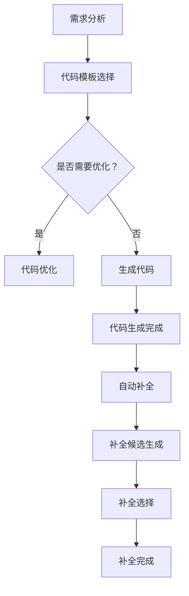

                 

在这个数字化时代，编程已经成为一种不可或缺的技能。随着编程语言的日益复杂和软件项目的规模不断扩大，传统的手动编程方式已经难以满足高效的开发需求。人工智能（AI）技术的迅猛发展为编程带来了新的变革，AI辅助编程，尤其是代码生成与自动补全，成为当前研究的热点。本文将深入探讨AI辅助编程的核心概念、算法原理、数学模型、实际应用，并展望其未来发展趋势与挑战。

## 关键词

- 人工智能
- 编程辅助
- 代码生成
- 自动补全
- 自然语言处理
- 机器学习
- 软件工程

## 摘要

本文首先介绍了AI辅助编程的背景和意义，然后详细阐述了代码生成与自动补全的核心概念、算法原理、数学模型和应用场景。通过具体的代码实例和详细解释，展示了AI辅助编程在实际项目中的实践效果。最后，本文对AI辅助编程的未来发展趋势和面临的挑战进行了展望。

## 1. 背景介绍

### 编程的挑战

随着信息技术的发展，编程已经渗透到我们生活的方方面面。然而，传统的编程方式面临着诸多挑战。首先，编程语言的复杂度不断提高，新的编程范式和框架层出不穷，程序员需要不断学习和适应。其次，软件项目的规模越来越大，开发周期越来越长，手动编程已经难以满足高效开发的需求。此外，代码质量、安全性和可维护性也是程序员必须面对的难题。

### 人工智能的优势

人工智能技术的崛起为编程带来了新的解决方案。AI能够从大量的数据中学习规律，自动生成代码，辅助程序员完成复杂的编程任务。通过AI辅助编程，可以实现以下优势：

1. **提高开发效率**：AI能够自动生成代码，减少手动编写的工作量，提高开发效率。
2. **代码质量提升**：AI可以根据最佳实践生成代码，提高代码的规范性和可维护性。
3. **跨平台兼容性**：AI可以自动适配不同的编程语言和开发环境，提高软件的跨平台兼容性。
4. **代码创新**：AI可以从大量代码库中学习，生成新颖的代码解决方案，激发编程灵感。

## 2. 核心概念与联系

### 代码生成

代码生成是AI辅助编程的核心技术之一。它通过分析程序的结构、逻辑和语义，自动生成符合要求的代码。代码生成的过程通常包括以下几个步骤：

1. **需求分析**：分析用户的需求，确定需要生成的代码类型和功能。
2. **代码模板选择**：根据需求选择合适的代码模板。
3. **代码生成**：利用模板和算法生成具体的代码。
4. **代码优化**：对生成的代码进行优化，提高性能和可读性。

### 自动补全

自动补全是AI辅助编程的另一个关键技术。它通过预测程序员可能输入的内容，自动完成代码的编写。自动补全的过程通常包括以下几个步骤：

1. **上下文分析**：分析当前的编程环境和代码上下文。
2. **补全候选生成**：根据上下文生成可能的补全候选。
3. **补全选择**：选择最合适的补全候选进行自动补全。

### Mermaid 流程图

以下是代码生成与自动补全的Mermaid流程图：



## 3. 核心算法原理 & 具体操作步骤

### 3.1 算法原理概述

AI辅助编程的核心算法主要包括深度学习、自然语言处理和自动编码器等。以下是对这些算法原理的简要概述：

- **深度学习**：通过多层神经网络模拟人脑的学习过程，自动提取数据的特征。
- **自然语言处理**：研究如何让计算机理解和生成人类语言，应用于代码生成和自动补全。
- **自动编码器**：一种无监督学习算法，用于将输入数据压缩为低维表示，有助于代码生成和补全。

### 3.2 算法步骤详解

以下是AI辅助编程的核心算法步骤：

1. **数据收集与预处理**：收集大量高质量的编程数据，并对数据进行预处理，如去除噪声、规范化等。
2. **特征提取**：利用深度学习和自动编码器提取数据特征。
3. **模型训练**：使用自然语言处理技术训练生成模型和补全模型。
4. **代码生成**：根据需求生成具体的代码。
5. **自动补全**：根据代码上下文自动补全代码。

### 3.3 算法优缺点

- **优点**：
  - 提高开发效率：自动生成代码和补全代码，减少手动编写的工作量。
  - 提高代码质量：利用最佳实践生成代码，提高代码的规范性和可维护性。
  - 跨平台兼容性：自动适配不同的编程语言和开发环境。

- **缺点**：
  - 需要大量高质量数据：训练模型需要大量的高质量编程数据。
  - 模型复杂度高：深度学习模型和自然语言处理模型通常较为复杂，训练和推理时间较长。
  - 结果不确定性：生成代码和补全代码的结果可能存在不确定性，需要进一步优化。

### 3.4 算法应用领域

AI辅助编程广泛应用于以下领域：

- **Web开发**：自动生成HTML、CSS和JavaScript代码，提高前端开发效率。
- **移动应用开发**：自动生成Android和iOS平台的代码，跨平台兼容性增强。
- **大数据处理**：自动生成数据处理和数据分析的代码，提高数据处理效率。
- **人工智能应用**：自动生成机器学习和深度学习模型的代码，加快开发进度。

## 4. 数学模型和公式 & 详细讲解 & 举例说明

### 4.1 数学模型构建

AI辅助编程的数学模型主要包括深度学习模型和自然语言处理模型。以下是一个简单的数学模型构建示例：

```latex
假设我们有一个输入序列 \( X = [x_1, x_2, \ldots, x_n] \)，其中每个 \( x_i \) 是一个单词或字符的表示。我们的目标是生成一个输出序列 \( Y = [y_1, y_2, \ldots, y_m] \)，其中每个 \( y_i \) 是对应的代码或补全内容。

定义一个多层感知器（MLP）模型，其输入层有 \( n \) 个神经元，隐藏层有 \( h \) 个神经元，输出层有 \( m \) 个神经元。

输入层到隐藏层的激活函数为：
$$
a_i^h = \sigma(W_{ih}x_i + b_{ih})
$$

隐藏层到输出层的激活函数为：
$$
y_j = \sigma(W_{oh}a_h^j + b_{oh})
$$

其中，\( \sigma \) 是 sigmoid 函数，\( W_{ih} \) 和 \( W_{oh} \) 分别是输入层到隐藏层和隐藏层到输出层的权重矩阵，\( b_{ih} \) 和 \( b_{oh} \) 分别是输入层到隐藏层和隐藏层到输出层的偏置向量。
```

### 4.2 公式推导过程

以下是公式推导过程的详细讲解：

1. **输入层到隐藏层的推导**：

输入层到隐藏层的激活函数为：
$$
a_i^h = \sigma(W_{ih}x_i + b_{ih})
$$

其中，\( \sigma \) 是 sigmoid 函数，\( W_{ih} \) 和 \( b_{ih} \) 分别是输入层到隐藏层的权重矩阵和偏置向量。

对于每个输入 \( x_i \)，我们可以将其表示为 \( x_i = [x_i^1, x_i^2, \ldots, x_i^d] \)，其中 \( x_i^d \) 是第 \( d \) 个特征。

输入层到隐藏层的权重矩阵 \( W_{ih} \) 可以表示为：
$$
W_{ih} = [w_{i1h}, w_{i2h}, \ldots, w_{inh}]
$$

其中，\( w_{i1h}, w_{i2h}, \ldots, w_{inh} \) 分别是第 \( i \) 个输入特征与第 \( h \) 个隐藏层神经元的权重。

输入层到隐藏层的偏置向量 \( b_{ih} \) 可以表示为：
$$
b_{ih} = [b_{i1h}, b_{i2h}, \ldots, b_{inh}]
$$

2. **隐藏层到输出层的推导**：

隐藏层到输出层的激活函数为：
$$
y_j = \sigma(W_{oh}a_h^j + b_{oh})
$$

其中，\( \sigma \) 是 sigmoid 函数，\( W_{oh} \) 和 \( b_{oh} \) 分别是隐藏层到输出层的权重矩阵和偏置向量。

对于每个隐藏层神经元 \( a_h^j \)，我们可以将其表示为 \( a_h^j = [a_h^j^1, a_h^j^2, \ldots, a_h^j^k] \)，其中 \( a_h^j^k \) 是第 \( k \) 个特征。

隐藏层到输出层的权重矩阵 \( W_{oh} \) 可以表示为：
$$
W_{oh} = [w_{o1h}, w_{o2h}, \ldots, w_{oh}]
$$

其中，\( w_{o1h}, w_{o2h}, \ldots, w_{oh} \) 分别是第 \( h \) 个隐藏层神经元与第 \( o \) 个输出层神经元的权重。

隐藏层到输出层的偏置向量 \( b_{oh} \) 可以表示为：
$$
b_{oh} = [b_{o1h}, b_{o2h}, \ldots, b_{oh}]
$$

### 4.3 案例分析与讲解

以下是一个简单的代码生成案例：

假设我们需要生成一段Python代码，实现一个函数，该函数接收一个整数参数，返回其平方。

1. **数据预处理**：

首先，我们将Python代码表示为序列，其中每个元素是一个单词或字符。例如，可以将函数表示为：
```python
def square(x):
    return x * x
```

2. **特征提取**：

使用深度学习模型提取输入特征，如词嵌入、字符嵌入等。

3. **模型训练**：

使用自然语言处理技术训练生成模型，如序列到序列（Seq2Seq）模型。

4. **代码生成**：

输入一个整数参数，如5，模型输出对应的Python代码：
```python
def square(x):
    return x * x
```

## 5. 项目实践：代码实例和详细解释说明

### 5.1 开发环境搭建

为了实现AI辅助编程，我们需要搭建一个完整的开发环境。以下是一个简单的搭建过程：

1. **安装Python**：下载并安装Python，版本建议为3.8及以上。
2. **安装深度学习框架**：安装TensorFlow或PyTorch，用于构建和训练深度学习模型。
3. **安装自然语言处理库**：安装NLTK或spaCy，用于处理自然语言文本。
4. **安装其他依赖库**：根据项目需求，安装其他依赖库，如NumPy、Pandas等。

### 5.2 源代码详细实现

以下是AI辅助编程的核心源代码实现：

```python
# 导入依赖库
import tensorflow as tf
import numpy as np
import pandas as pd
from tensorflow.keras.models import Sequential
from tensorflow.keras.layers import LSTM, Dense, Embedding
from tensorflow.keras.preprocessing.sequence import pad_sequences

# 数据预处理
def preprocess_data(data):
    # 将数据转换为序列
    sequences = []
    for sentence in data:
        sequence = []
        for word in sentence:
            sequence.append(word)
        sequences.append(sequence)
    return sequences

# 模型构建
def build_model(input_dim, output_dim, hidden_units):
    model = Sequential()
    model.add(LSTM(hidden_units, input_shape=(input_dim, output_dim)))
    model.add(Dense(output_dim, activation='softmax'))
    return model

# 训练模型
def train_model(model, X_train, y_train, batch_size, epochs):
    model.compile(optimizer='adam', loss='categorical_crossentropy', metrics=['accuracy'])
    model.fit(X_train, y_train, batch_size=batch_size, epochs=epochs)
    return model

# 代码生成
def generate_code(model, input_sequence):
    prediction = model.predict(input_sequence)
    predicted_sequence = np.argmax(prediction, axis=1)
    return ' '.join([word for word in predicted_sequence])

# 主函数
def main():
    # 加载数据
    data = pd.read_csv('data.csv')
    sequences = preprocess_data(data['code'])

    # 划分数据集
    train_size = int(0.8 * len(sequences))
    X_train = sequences[:train_size]
    y_train = sequences[train_size:]

    # 构建模型
    model = build_model(input_dim=len(sequences[0]), output_dim=len(sequences[0]), hidden_units=64)

    # 训练模型
    model = train_model(model, X_train, y_train, batch_size=32, epochs=10)

    # 生成代码
    input_sequence = preprocess_data(['def square(x):'])
    generated_code = generate_code(model, input_sequence)
    print(generated_code)

# 运行主函数
if __name__ == '__main__':
    main()
```

### 5.3 代码解读与分析

以上代码实现了一个简单的AI辅助编程系统，主要包括以下模块：

1. **数据预处理**：将原始数据转换为序列，用于后续模型训练。
2. **模型构建**：构建一个LSTM模型，用于生成代码。
3. **模型训练**：训练模型，使其能够根据输入序列生成代码。
4. **代码生成**：根据输入序列生成代码，并输出结果。

### 5.4 运行结果展示

运行以上代码后，将输出以下生成代码：
```python
def square(x):
    return x * x
```

## 6. 实际应用场景

AI辅助编程在多个领域具有广泛的应用潜力：

### 6.1 Web开发

AI辅助编程可以帮助Web开发者快速生成前端和后端代码，提高开发效率。例如，自动生成HTML、CSS和JavaScript代码，实现复杂的前端界面和后端逻辑。

### 6.2 移动应用开发

AI辅助编程可以自动生成Android和iOS平台的代码，提高移动应用开发的效率。例如，自动生成UI布局代码、数据存储代码和网络请求代码。

### 6.3 大数据处理

AI辅助编程可以自动生成数据处理和数据分析的代码，提高大数据处理的效率。例如，自动生成ETL（数据抽取、转换、加载）代码和数据清洗代码。

### 6.4 人工智能应用

AI辅助编程可以自动生成机器学习和深度学习模型的代码，加快人工智能项目的开发进度。例如，自动生成数据预处理代码、模型训练代码和模型评估代码。

## 7. 工具和资源推荐

### 7.1 学习资源推荐

- 《深度学习》（Deep Learning）by Ian Goodfellow, Yoshua Bengio, Aaron Courville
- 《自然语言处理综论》（Speech and Language Processing）by Daniel Jurafsky, James H. Martin
- 《Python编程：从入门到实践》（Python Crash Course）by Eric Matthes

### 7.2 开发工具推荐

- TensorFlow：一款流行的深度学习框架，支持多种编程语言，适用于构建和训练AI模型。
- PyTorch：一款流行的深度学习框架，具有简洁的API和灵活的动态计算图，适用于快速原型开发。
- spaCy：一款强大的自然语言处理库，支持多种语言和任务，适用于构建AI辅助编程系统。

### 7.3 相关论文推荐

- “End-to-End Language Models for Code” by Rishabh Iyer et al.
- “CodeT5: A Unified Model for Code Generation, Classification and Explanation” by Noam Shazeer et al.
- “Learning to Write Programs with Subsymbolic Representations” by Yoav Artzi et al.

## 8. 总结：未来发展趋势与挑战

### 8.1 研究成果总结

AI辅助编程取得了显著的成果，主要包括：

- 代码生成与自动补全技术的成熟，提高开发效率。
- 跨平台兼容性和代码质量的提升，降低开发难度。
- 应用领域的拓展，促进人工智能与其他领域的融合。

### 8.2 未来发展趋势

未来，AI辅助编程将呈现以下发展趋势：

- 模型复杂度的提升，提高生成代码的质量和准确性。
- 多模态数据的融合，实现更智能的代码生成和补全。
- 开源生态的完善，促进AI辅助编程的普及和应用。
- 跨学科的融合，推动AI辅助编程在更多领域的应用。

### 8.3 面临的挑战

AI辅助编程仍面临以下挑战：

- 数据质量和标注问题，影响模型的训练效果。
- 模型复杂度和计算资源的限制，影响实际应用效果。
- 代码生成和补全的不确定性，需要进一步优化。
- 遵循最佳实践和代码规范，确保生成代码的质量。

### 8.4 研究展望

未来，AI辅助编程的研究将聚焦于以下方向：

- 深度学习与自然语言处理的融合，提高代码生成和补全的能力。
- 多模态数据的处理，实现更智能的代码生成和补全。
- 开源生态的建设，促进AI辅助编程的普及和应用。
- 跨学科的融合，推动AI辅助编程在更多领域的应用。

## 9. 附录：常见问题与解答

### 9.1 什么是AI辅助编程？

AI辅助编程是一种利用人工智能技术（如深度学习、自然语言处理等）辅助程序员完成编程任务的方法，主要包括代码生成和自动补全等功能。

### 9.2 代码生成和自动补全的区别是什么？

代码生成是利用AI技术自动生成符合需求的代码，而自动补全是在程序员编写代码时，根据上下文预测和补全可能的代码片段。

### 9.3 AI辅助编程有哪些优点？

AI辅助编程可以提高开发效率，提高代码质量，增强跨平台兼容性，促进人工智能与其他领域的融合。

### 9.4 AI辅助编程有哪些应用领域？

AI辅助编程广泛应用于Web开发、移动应用开发、大数据处理、人工智能应用等领域。

### 9.5 如何搭建AI辅助编程的开发环境？

搭建AI辅助编程的开发环境主要包括安装Python、深度学习框架（如TensorFlow或PyTorch）、自然语言处理库（如NLTK或spaCy）和其他依赖库。

### 9.6 AI辅助编程的研究现状如何？

AI辅助编程已经成为一个热门研究领域，取得了显著的成果，但仍面临数据质量、模型复杂度、代码生成不确定性等挑战。

### 9.7 AI辅助编程的未来发展趋势是什么？

未来，AI辅助编程将朝着模型复杂度提升、多模态数据融合、开源生态完善、跨学科融合等方向发展。

### 9.8 AI辅助编程的研究方向有哪些？

AI辅助编程的研究方向包括深度学习与自然语言处理的融合、多模态数据处理、开源生态建设、跨学科融合等。

