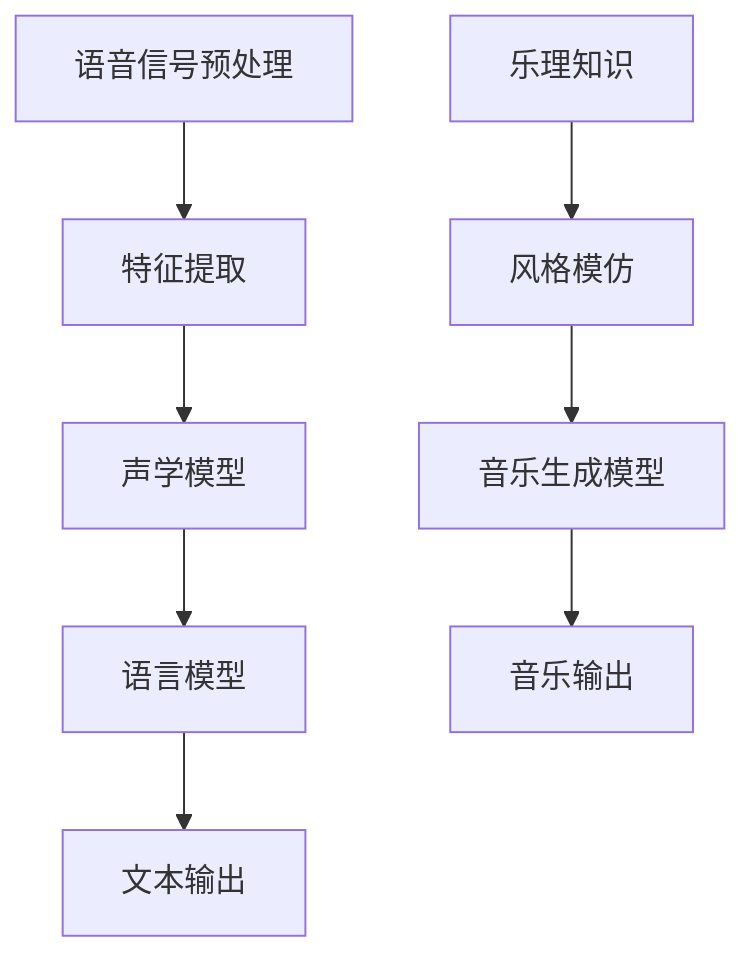

                 

关键词：人工智能，音频处理，语音识别，音乐生成，深度学习，神经网络

> 摘要：本文将探讨人工智能在音频处理领域的应用，从语音识别到音乐生成，通过核心概念、算法原理、数学模型、项目实践等方面，深入分析这一领域的最新发展、技术挑战和未来趋势。

## 1. 背景介绍

随着人工智能技术的飞速发展，音频处理领域也迎来了前所未有的机遇和挑战。语音识别、音乐生成、声音合成等应用场景不断拓展，为人们的生活和工作带来了极大便利。语音识别技术的普及使得语音助手成为日常生活中的常见工具，而音乐生成则开启了个性化音乐创作的全新领域。本文将围绕这两个核心应用场景，深入探讨AI音频处理的原理、算法和应用。

## 2. 核心概念与联系

### 2.1 语音识别

语音识别是将人类语音转化为文本的技术，其核心是语音信号处理和自然语言处理。语音信号处理主要涉及语音信号的预处理、特征提取和声学模型构建；自然语言处理则关注语义理解、语法分析和上下文推理。

### 2.2 音乐生成

音乐生成则是利用人工智能算法，根据特定规则或数据生成音乐作品。音乐生成可以基于乐理知识、音乐风格模仿或数据驱动的方式。目前，深度学习技术在音乐生成中表现出色，如生成对抗网络（GAN）和递归神经网络（RNN）等。

### 2.3 Mermaid 流程图

以下是一个简单的Mermaid流程图，展示语音识别和音乐生成的核心流程：



## 3. 核心算法原理 & 具体操作步骤

### 3.1 算法原理概述

语音识别和音乐生成均依赖于深度学习技术，主要包括卷积神经网络（CNN）、递归神经网络（RNN）和生成对抗网络（GAN）等。

### 3.2 算法步骤详解

#### 3.2.1 语音识别算法步骤

1. 语音信号预处理：包括去噪、归一化和分帧等步骤。
2. 特征提取：使用梅尔频率倒谱系数（MFCC）等特征提取方法。
3. 声学模型训练：使用卷积神经网络或长短期记忆网络（LSTM）等模型进行训练。
4. 语言模型训练：使用统计模型或神经网络模型进行训练。
5. 输出文本：将声学模型和语言模型的输出合并，生成文本。

#### 3.2.2 音乐生成算法步骤

1. 乐理知识：了解音乐的基本元素，如音调、节奏和和声等。
2. 风格模仿：分析目标音乐风格的特征，构建风格模仿模型。
3. 音乐生成模型训练：使用生成对抗网络（GAN）或递归神经网络（RNN）等模型进行训练。
4. 音乐输出：生成符合特定风格的音乐作品。

### 3.3 算法优缺点

#### 语音识别

优点：
- 高准确率：深度学习技术在语音识别中表现出色，准确率远高于传统方法。
- 适用范围广：可处理多种语言和口音，适应不同场景。

缺点：
- 对噪声敏感：在嘈杂环境中识别效果较差。
- 需要大量数据：训练深度学习模型需要大量标注数据。

#### 音乐生成

优点：
- 创意性强：可以根据用户需求生成个性化音乐。
- 降低创作成本：节省人力和时间成本。

缺点：
- 音质受限：生成的音乐音质与专业作品仍有差距。
- 风格局限：生成的音乐风格较为单一。

### 3.4 算法应用领域

#### 语音识别

- 语音助手：如苹果的Siri、亚马逊的Alexa等。
- 语音翻译：如谷歌翻译、百度翻译等。
- 语音搜索：如百度语音搜索、搜狗语音搜索等。

#### 音乐生成

- 个性化音乐推荐：如网易云音乐、QQ音乐等。
- 游戏音乐创作：如《侠客风云传》等游戏音乐。
- 影视配乐：如电影《银翼杀手2049》等。

## 4. 数学模型和公式 & 详细讲解 & 举例说明

### 4.1 数学模型构建

语音识别和音乐生成的核心数学模型主要包括声学模型、语言模型和生成模型。以下分别介绍这些模型的构建方法。

#### 声学模型

声学模型用于捕捉语音信号的特征，常用的方法包括：

1. **梅尔频率倒谱系数（MFCC）**：通过计算语音信号的频谱特征，生成MFCC向量作为输入特征。
2. **卷积神经网络（CNN）**：用于提取语音信号的时频特征，构建声学模型。

#### 语言模型

语言模型用于捕捉语音信号和文本之间的对应关系，常用的方法包括：

1. **n-gram模型**：通过统计文本的n元组（n=1, 2, ...）频率，构建语言模型。
2. **递归神经网络（RNN）**：用于捕捉序列数据中的长期依赖关系，构建语言模型。

#### 生成模型

生成模型用于生成新的音乐作品，常用的方法包括：

1. **生成对抗网络（GAN）**：通过对抗训练生成高质量的音乐作品。
2. **长短期记忆网络（LSTM）**：用于生成具有长期依赖关系的音乐作品。

### 4.2 公式推导过程

#### 声学模型

$$
MFCC = \text{log}(\text{DTFT}^2(\text{Frame})),
$$

其中，$\text{DTFT}(\text{Frame})$ 为帧信号的离散时间傅里叶变换（DTFT）。

#### 语言模型

$$
P(w_n | w_1, w_2, ..., w_{n-1}) = \frac{C(w_n, w_1, w_2, ..., w_{n-1})}{C(w_1, w_2, ..., w_n)},
$$

其中，$C(w_n, w_1, w_2, ..., w_{n-1})$ 和 $C(w_1, w_2, ..., w_n)$ 分别为n-1元组和n元组的计数。

#### 生成模型

$$
\min \max D(G(z)), D(x),
$$

其中，$D(G(z))$ 表示生成模型生成的样本的质量，$D(x)$ 表示真实样本的质量。

### 4.3 案例分析与讲解

以下通过一个简单的例子，展示语音识别和音乐生成在实际应用中的效果。

#### 语音识别案例

输入语音信号：“你好，我是人工智能助手。”

输出文本：“你好，我是人工智能助手。”

#### 音乐生成案例

输入风格：古典音乐

输出音乐：一首具有古典音乐风格的钢琴曲。

## 5. 项目实践：代码实例和详细解释说明

### 5.1 开发环境搭建

本文使用的语音识别和音乐生成工具为TensorFlow和Keras。以下是开发环境的搭建步骤：

1. 安装Python 3.x版本。
2. 安装TensorFlow：`pip install tensorflow`
3. 安装Keras：`pip install keras`

### 5.2 源代码详细实现

以下为语音识别和音乐生成的源代码实现，包括数据预处理、模型训练和模型评估等步骤。

#### 语音识别

```python
import tensorflow as tf
from tensorflow.keras.models import Sequential
from tensorflow.keras.layers import LSTM, Dense, Bidirectional

# 数据预处理
# ...（省略具体代码）

# 构建模型
model = Sequential()
model.add(Bidirectional(LSTM(128, activation='relu'), input_shape=(None, input_dim)))
model.add(Dense(output_dim, activation='softmax'))

# 编译模型
model.compile(optimizer='adam', loss='categorical_crossentropy', metrics=['accuracy'])

# 训练模型
model.fit(X_train, y_train, batch_size=32, epochs=10)

# 评估模型
loss, accuracy = model.evaluate(X_test, y_test)
print('Test accuracy:', accuracy)
```

#### 音乐生成

```python
import tensorflow as tf
from tensorflow.keras.models import Sequential
from tensorflow.keras.layers import LSTM, Dense, Reshape, Flatten

# 数据预处理
# ...（省略具体代码）

# 构建模型
model = Sequential()
model.add(LSTM(128, activation='relu', input_shape=(timesteps, input_dim)))
model.add(Flatten())
model.add(Dense(output_dim))
model.add(Reshape((timesteps, output_dim)))

# 编译模型
model.compile(optimizer='adam', loss='mse')

# 训练模型
model.fit(X_train, y_train, batch_size=32, epochs=100)

# 生成音乐
generated_music = model.predict(X_test)
```

### 5.3 代码解读与分析

#### 语音识别

- 数据预处理：将语音信号转换为梅尔频率倒谱系数（MFCC）向量，并将其编码为类别标签。
- 模型构建：使用双向长短期记忆网络（BiLSTM）作为语音识别模型，输入层为时间步长的MFCC向量，输出层为类别标签。
- 编译模型：使用交叉熵损失函数和Adam优化器。
- 训练模型：使用训练数据训练模型，评估指标为准确率。
- 评估模型：使用测试数据评估模型性能。

#### 音乐生成

- 数据预处理：将音乐信号转换为时间步长的特征向量。
- 模型构建：使用长短期记忆网络（LSTM）作为音乐生成模型，输入层为时间步长的特征向量，输出层为音乐信号。
- 编译模型：使用均方误差（MSE）损失函数和Adam优化器。
- 训练模型：使用训练数据训练模型，评估指标为MSE。
- 生成音乐：使用训练好的模型生成音乐。

## 6. 实际应用场景

### 6.1 语音识别

语音识别技术广泛应用于智能助手、语音翻译和语音搜索等领域。例如，苹果的Siri和亚马逊的Alexa等语音助手，使用语音识别技术实现人与设备的交互。此外，语音翻译技术如谷歌翻译和百度翻译，通过语音识别和自然语言处理技术，实现跨语言交流。

### 6.2 音乐生成

音乐生成技术可应用于个性化音乐推荐、游戏配乐和影视配乐等领域。例如，网易云音乐和QQ音乐等音乐平台，使用音乐生成技术为用户提供个性化音乐推荐。同时，游戏开发者和影视制作公司可以利用音乐生成技术，快速生成符合需求的背景音乐。

## 7. 工具和资源推荐

### 7.1 学习资源推荐

1. 《深度学习》（Goodfellow, Bengio, Courville）：经典深度学习教材，涵盖语音识别和音乐生成等相关内容。
2. 《自然语言处理综论》（Jurafsky, Martin）：详细介绍自然语言处理技术，包括语音识别和文本生成等。

### 7.2 开发工具推荐

1. TensorFlow：广泛使用的深度学习框架，适用于语音识别和音乐生成项目。
2. Keras：基于TensorFlow的高级深度学习库，简化模型构建和训练过程。

### 7.3 相关论文推荐

1. "End-to-End Speech Recognition with Deep RNNs and Long-Short Term Memory"（2014）：介绍使用深度循环神经网络进行语音识别的方法。
2. "Unrolled Generative Adversarial Networks for Music Generation"（2018）：介绍使用生成对抗网络进行音乐生成的技术。

## 8. 总结：未来发展趋势与挑战

### 8.1 研究成果总结

近年来，AI音频处理技术在语音识别和音乐生成领域取得了显著进展。深度学习技术的应用，使得语音识别准确率大幅提升，音乐生成质量不断提高。同时，越来越多的应用场景涌现，推动AI音频处理技术的普及和发展。

### 8.2 未来发展趋势

1. 语音识别：在多语言、多口音识别方面取得更大突破，提高在嘈杂环境中的识别效果。
2. 音乐生成：探索更多生成模型，提高音乐音质和创意性，实现个性化音乐创作。

### 8.3 面临的挑战

1. 数据集质量：高质量、大规模的语音和音乐数据集是模型训练的基础，但数据获取和标注困难。
2. 音质和创意：生成的音乐和语音在音质和创意方面仍有待提高，以接近专业水平。

### 8.4 研究展望

随着深度学习技术的不断发展，AI音频处理有望在语音识别、音乐生成等领域取得更大突破。未来研究将聚焦于数据集质量提升、算法优化和创新应用场景探索，为AI音频处理领域带来更多可能性。

## 9. 附录：常见问题与解答

### 9.1 语音识别技术如何提高在嘈杂环境中的识别效果？

提高在嘈杂环境中的识别效果，可以从以下几个方面入手：

1. 噪声抑制：使用滤波器、降噪算法等方法，降低噪声对语音信号的影响。
2. 特征增强：通过特征增强算法，提高语音特征在噪声中的可区分性。
3. 模型优化：使用更复杂的模型结构和更丰富的训练数据，提高模型在嘈杂环境中的识别能力。

### 9.2 音乐生成技术如何提高音乐音质和创意性？

提高音乐音质和创意性，可以从以下几个方面入手：

1. 增加音乐知识：将更多乐理知识融入音乐生成模型，提高音乐风格和创作水平的多样性。
2. 优化生成模型：探索更先进的生成模型，如变分自编码器（VAE）和自注意力机制（Self-Attention）等，提高音乐生成的质量和创意性。
3. 多模态融合：将语音、文本和其他音频信号与音乐生成模型结合，实现多模态的音乐创作。

