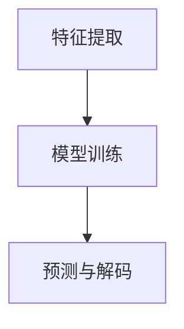

                 

关键词：人工智能，音频处理，语音识别，音乐生成，深度学习，算法，技术应用

> 摘要：本文将深入探讨人工智能在音频处理领域的应用，从语音识别到音乐生成，涵盖核心概念、算法原理、项目实践等多个方面，旨在为广大读者提供全面的技术见解和未来展望。

## 1. 背景介绍

音频处理作为计算机科学和人工智能领域的一个重要分支，近年来得到了迅速发展。随着语音识别、语音合成、音乐生成等技术的不断进步，音频处理的应用场景也日益广泛。从智能家居、智能助手，到自动驾驶、医疗辅助，音频处理技术正逐步融入我们的日常生活，改变着人们的生活和工作方式。

本文将主要讨论以下三个方面：

1. **语音识别**：语音识别技术是人工智能领域的一个重要研究方向，它使得计算机能够理解和处理人类语言。本文将介绍语音识别的基本原理、现有算法及其应用。

2. **音乐生成**：音乐生成作为人工智能在艺术领域的一项重要应用，近年来越来越受到关注。本文将探讨音乐生成的基本原理、算法以及其在娱乐、教育等领域的应用。

3. **音频处理技术**：本文还将介绍一些音频处理技术，如音频增强、噪声抑制、音频分类等，并讨论其在实际应用中的挑战和解决方案。

## 2. 核心概念与联系

### 2.1 语音识别

语音识别（Speech Recognition）是指将人类的语音信号转换为机器可理解和处理的文本信息。其核心任务是：从语音信号中提取特征，然后利用这些特征进行模型训练和预测。

- **特征提取**：常用的语音特征包括梅尔频率倒谱系数（MFCC）、频谱图、频谱特征等。
- **模型训练**：常见的语音识别模型包括隐马尔可夫模型（HMM）、高斯混合模型（GMM）、深度神经网络（DNN）、循环神经网络（RNN）等。
- **预测与解码**：语音识别的过程实际上是一个序列标注问题，通过模型训练得到一个概率分布，然后利用解码算法（如贪心算法、Viterbi算法）得到最终的文本输出。

### 2.2 音乐生成

音乐生成（Music Generation）是指利用人工智能技术自动生成音乐。音乐生成可以从不同的角度进行分类，如：

- **规则生成**：基于音乐理论和规则生成音乐，如生成音符序列、旋律等。
- **数据驱动生成**：基于已有音乐数据，通过机器学习算法生成新的音乐。常用的模型包括生成对抗网络（GAN）、变分自编码器（VAE）等。

### 2.3 音频处理技术

音频处理技术包括音频增强、噪声抑制、音频分类等。

- **音频增强**：通过算法对音频信号进行处理，提高音频质量。常用的方法包括谱减法、频谱减法等。
- **噪声抑制**：去除或降低音频信号中的噪声，提高语音的清晰度。常见的方法包括谱减法、维纳滤波等。
- **音频分类**：对音频信号进行分类，如语音分类、音乐分类等。常用的方法包括支持向量机（SVM）、深度学习等。

### 2.4 Mermaid 流程图

以下是语音识别的 Mermaid 流程图：



## 3. 核心算法原理 & 具体操作步骤

### 3.1 算法原理概述

#### 3.1.1 语音识别算法

语音识别算法主要包括三个步骤：特征提取、模型训练和预测解码。

- **特征提取**：语音信号经过预处理后，提取出一系列语音特征，如 MFCC、频谱特征等。
- **模型训练**：使用大量的语音数据，通过模型训练得到一个语音识别模型。
- **预测解码**：将语音信号输入到模型中，通过解码算法得到对应的文本输出。

#### 3.1.2 音乐生成算法

音乐生成算法主要包括两种类型：规则生成和数据驱动生成。

- **规则生成**：基于音乐理论和规则，生成音乐。例如，生成音符序列、旋律等。
- **数据驱动生成**：基于已有音乐数据，通过机器学习算法生成新的音乐。例如，使用 GAN 或 VAE 等生成模型。

#### 3.1.3 音频处理算法

音频处理算法主要包括音频增强、噪声抑制和音频分类。

- **音频增强**：通过算法对音频信号进行处理，提高音频质量。例如，使用谱减法提高语音清晰度。
- **噪声抑制**：去除或降低音频信号中的噪声，提高语音的清晰度。例如，使用维纳滤波减少噪声。
- **音频分类**：对音频信号进行分类，如语音分类、音乐分类等。例如，使用支持向量机（SVM）进行语音分类。

### 3.2 算法步骤详解

#### 3.2.1 语音识别算法步骤

1. **特征提取**：
    - **预处理**：对语音信号进行预处理，如去除静音段、噪声等。
    - **特征提取**：提取语音特征，如 MFCC、频谱特征等。

2. **模型训练**：
    - **数据集准备**：准备大量的语音数据，包括训练数据和测试数据。
    - **模型选择**：选择合适的语音识别模型，如 RNN、DNN 等。
    - **训练过程**：使用训练数据对模型进行训练。

3. **预测解码**：
    - **特征输入**：将语音信号输入到模型中。
    - **解码过程**：通过解码算法（如贪心算法、Viterbi算法）得到文本输出。

#### 3.2.2 音乐生成算法步骤

1. **数据集准备**：
    - 准备大量的音乐数据，包括音符序列、旋律等。

2. **模型选择**：
    - 选择合适的音乐生成模型，如 GAN、VAE 等。

3. **训练过程**：
    - 使用音乐数据进行模型训练。

4. **音乐生成**：
    - 输入模型生成新的音乐。

#### 3.2.3 音频处理算法步骤

1. **音频增强**：
    - **预处理**：对音频信号进行预处理，如去噪、增益等。
    - **增强过程**：使用谱减法、频谱减法等算法进行增强。

2. **噪声抑制**：
    - **预处理**：对音频信号进行预处理，如去噪、增益等。
    - **抑制过程**：使用维纳滤波、谱减法等算法进行噪声抑制。

3. **音频分类**：
    - **特征提取**：提取音频特征，如 MFCC、频谱特征等。
    - **分类过程**：使用分类算法（如 SVM、深度学习）进行分类。

### 3.3 算法优缺点

#### 3.3.1 语音识别算法

**优点**：

- **高准确性**：现代语音识别算法具有较高的准确性，能够准确识别语音。
- **实时性**：语音识别算法可以实现实时语音识别。

**缺点**：

- **受环境因素影响**：语音识别算法在噪声环境下的表现较差。
- **复杂度高**：语音识别算法的计算复杂度较高，对计算资源有较高要求。

#### 3.3.2 音乐生成算法

**优点**：

- **创作自由度**：音乐生成算法可以生成丰富多彩的音乐。
- **高效性**：音乐生成算法可以高效地生成音乐。

**缺点**：

- **音乐质量**：生成的音乐可能缺乏人类创作的音乐的美感和深度。
- **计算成本**：音乐生成算法的计算成本较高。

#### 3.3.3 音频处理算法

**优点**：

- **实用性强**：音频处理算法可以广泛应用于语音识别、音乐生成等领域。
- **效果显著**：音频处理算法可以显著提高音频质量。

**缺点**：

- **复杂度高**：音频处理算法的计算复杂度较高。
- **受硬件限制**：音频处理算法对硬件有较高要求。

### 3.4 算法应用领域

#### 3.4.1 语音识别

- **智能家居**：语音识别技术可以用于智能助手，如语音控制家居设备。
- **医疗领域**：语音识别技术可以用于医生与患者的语音交流，提高诊断效率。
- **客服行业**：语音识别技术可以用于自动客服系统，提高客户服务效率。

#### 3.4.2 音乐生成

- **音乐创作**：音乐生成算法可以用于音乐创作，如生成新的旋律、和声等。
- **游戏与娱乐**：音乐生成算法可以用于游戏背景音乐生成，提高游戏体验。
- **教育与培训**：音乐生成算法可以用于音乐教育，如生成练习曲目。

#### 3.4.3 音频处理

- **语音增强**：音频处理算法可以用于语音增强，提高语音通话质量。
- **音频分析**：音频处理算法可以用于音频分析，如音乐分类、语音情感分析等。
- **音频娱乐**：音频处理算法可以用于音频娱乐，如音效增强、声音编辑等。

## 4. 数学模型和公式 & 详细讲解 & 举例说明

### 4.1 数学模型构建

#### 4.1.1 语音识别

语音识别的主要数学模型包括：

1. **特征提取**：
    - MFCC（梅尔频率倒谱系数）：$$MFCC = \sum_{k=1}^{N} a_k \cdot \log \left(1 + 10 \cdot \text{log}_{10} \left|\text{DFT}(x_k)\right|\right)$$
    - 频谱特征：$$S(k) = \sum_{k=1}^{N} a_k \cdot \text{DFT}(x_k)$$

2. **模型训练**：
    - 隐马尔可夫模型（HMM）：$$P(O|A) = \sum_{i=1}^{N} P(O_i|A) \cdot P(A)$$
    - 深度神经网络（DNN）：$$y = \sigma(\omega_0 + \omega_1 \cdot x_1 + \omega_2 \cdot x_2 + \cdots + \omega_n \cdot x_n)$$

3. **预测解码**：
    - 贪心算法：$$y_t = \arg\max_{i} P(O_t|y_t) \cdot P(y_t|O_t)$$
    - Viterbi算法：$$Viterbi = \arg\max_{i} P(O_t|y_t) \cdot P(y_t|O_{t-1})$$

#### 4.1.2 音乐生成

音乐生成的主要数学模型包括：

1. **规则生成**：
    - 音符序列生成：$$P(note) = \frac{1}{N} \sum_{i=1}^{N} P(note_i|context)$$
    - 旋律生成：$$P(melody) = \prod_{i=1}^{N} P(note_i|context)$$

2. **数据驱动生成**：
    - 生成对抗网络（GAN）：$$\min_{G} \max_{D} V(D, G)$$
    - 变分自编码器（VAE）：$$\min_{\theta} \mathbb{E}_{x\sim p_{\text{data}}(x)} D(x, G(x)) - \mathbb{E}_{z\sim p_z(z)} D(G(z))$$

#### 4.1.3 音频处理

音频处理的主要数学模型包括：

1. **音频增强**：
    - 谱减法：$$y[n] = x[n] - w[n]$$
    - 频谱减法：$$Y[k] = X[k] - W[k]$$

2. **噪声抑制**：
    - 维纳滤波：$$y[n] = x[n] + w[n]$$
    - 谱减法：$$Y[k] = X[k] - W[k]$$

3. **音频分类**：
    - 支持向量机（SVM）：$$w^* = \arg\min_{w,b} \frac{1}{2} ||w||^2 + C \sum_{i=1}^{N} \max(0, 1 - y_i (w \cdot x_i + b))$$
    - 深度学习：$$y = \sigma(\omega_0 + \omega_1 \cdot x_1 + \omega_2 \cdot x_2 + \cdots + \omega_n \cdot x_n)$$

### 4.2 公式推导过程

#### 4.2.1 语音识别

1. **特征提取**：
    - MFCC：
        - 首先，对语音信号进行预处理，如去噪、加窗等。
        - 然后，对预处理后的信号进行离散傅里叶变换（DFT）。
        - 最后，计算梅尔频率倒谱系数。
    - 频谱特征：
        - 首先，对语音信号进行预处理，如去噪、加窗等。
        - 然后，计算频谱图。
        - 最后，提取频谱特征。

2. **模型训练**：
    - HMM：
        - 首先，定义状态转移概率矩阵和观察概率矩阵。
        - 然后，使用最大似然估计或Baum-Welch算法进行模型训练。
        - 最后，使用训练好的模型进行语音识别。
    - DNN：
        - 首先，定义输入层、隐藏层和输出层。
        - 然后，使用反向传播算法进行模型训练。
        - 最后，使用训练好的模型进行语音识别。

3. **预测解码**：
    - 贪心算法：
        - 首先，计算每个时刻的最佳状态。
        - 然后，根据最佳状态序列解码出文本输出。
    - Viterbi算法：
        - 首先，初始化状态概率和路径概率。
        - 然后，迭代更新状态概率和路径概率。
        - 最后，根据最大概率路径解码出文本输出。

#### 4.2.2 音乐生成

1. **规则生成**：
    - 音符序列生成：
        - 首先，定义音符的概率分布。
        - 然后，根据概率分布生成音符序列。
    - 旋律生成：
        - 首先，定义旋律的结构和规则。
        - 然后，根据规则生成旋律。

2. **数据驱动生成**：
    - GAN：
        - 首先，定义生成器和判别器的结构。
        - 然后，使用对抗训练优化生成器和判别器的参数。
    - VAE：
        - 首先，定义编码器和解码器的结构。
        - 然后，使用变分自编码器优化编码器和解码器的参数。

#### 4.2.3 音频处理

1. **音频增强**：
    - 谱减法：
        - 首先，计算原始信号和噪声信号的频谱。
        - 然后，从原始信号频谱中减去噪声信号频谱。
    - 频谱减法：
        - 首先，计算原始信号和噪声信号的频谱。
        - 然后，从原始信号频谱中减去噪声信号频谱。

2. **噪声抑制**：
    - 维纳滤波：
        - 首先，计算原始信号和噪声信号的频谱。
        - 然后，使用维纳滤波器对噪声信号进行滤波。
    - 谱减法：
        - 首先，计算原始信号和噪声信号的频谱。
        - 然后，从原始信号频谱中减去噪声信号频谱。

3. **音频分类**：
    - SVM：
        - 首先，定义支持向量机和决策边界。
        - 然后，使用支持向量机进行分类。
    - 深度学习：
        - 首先，定义神经网络结构和损失函数。
        - 然后，使用反向传播算法进行训练。
        - 最后，使用训练好的模型进行分类。

### 4.3 案例分析与讲解

#### 4.3.1 语音识别

**案例**：使用 DNN 进行语音识别。

**步骤**：

1. **数据集准备**：
    - 准备大量语音数据，包括训练数据和测试数据。

2. **模型训练**：
    - 定义 DNN 结构，包括输入层、隐藏层和输出层。
    - 使用反向传播算法进行模型训练。

3. **预测解码**：
    - 将测试数据输入到训练好的模型中。
    - 通过解码算法得到文本输出。

**分析**：

- DNN 可以较好地处理语音信号的非线性特征，具有较高的识别准确性。
- DNN 训练过程较复杂，对计算资源有较高要求。

#### 4.3.2 音乐生成

**案例**：使用 GAN 进行音乐生成。

**步骤**：

1. **数据集准备**：
    - 准备大量音乐数据，包括音符序列、旋律等。

2. **模型训练**：
    - 定义生成器和判别器的结构。
    - 使用对抗训练优化生成器和判别器的参数。

3. **音乐生成**：
    - 使用生成器生成新的音乐。

**分析**：

- GAN 可以生成高质量的音频信号，具有较高的音乐生成能力。
- GAN 训练过程较复杂，对计算资源有较高要求。

#### 4.3.3 音频处理

**案例**：使用谱减法进行噪声抑制。

**步骤**：

1. **数据集准备**：
    - 准备含有噪声的音频信号。

2. **频谱计算**：
    - 计算原始信号和噪声信号的频谱。

3. **谱减法**：
    - 从原始信号频谱中减去噪声信号频谱。

4. **重构信号**：
    - 重构减噪后的音频信号。

**分析**：

- 谱减法可以显著减少噪声，提高音频质量。
- 谱减法对高频信号的处理效果较好。

## 5. 项目实践：代码实例和详细解释说明

### 5.1 开发环境搭建

**工具**：

- Python
- TensorFlow
- Keras
- Librosa

**安装**：

1. 安装 Python 3.6 或更高版本。
2. 安装 TensorFlow：`pip install tensorflow`
3. 安装 Keras：`pip install keras`
4. 安装 Librosa：`pip install librosa`

### 5.2 源代码详细实现

**语音识别**

```python
import numpy as np
import tensorflow as tf
from tensorflow.keras.models import Sequential
from tensorflow.keras.layers import LSTM, Dense
from tensorflow.keras.utils import to_categorical
from tensorflow.keras.optimizers import Adam
import librosa

# 数据预处理
def preprocess_data(data, n_mels=128, n_fram=512):
    X, y = [], []
    for file in data:
        signal, sr = librosa.load(file, sr=None)
        signal = librosa.resample(signal, sr, 16000)
        mels = librosa.feature.melspectrogram(signal, n_mels=n_mels, n_fft=n_fram)
        X.append(mels)
        y.append(file.split('/')[-1])
    return np.array(X), np.array(y)

# 构建模型
model = Sequential()
model.add(LSTM(128, input_shape=(None, 128), activation='relu'))
model.add(Dense(128, activation='relu'))
model.add(Dense(len(data), activation='softmax'))
model.compile(optimizer=Adam(), loss='categorical_crossentropy', metrics=['accuracy'])

# 训练模型
X_train, y_train = preprocess_data(data_train)
y_train = to_categorical(y_train)
model.fit(X_train, y_train, epochs=10, batch_size=32, validation_split=0.2)

# 预测
X_test, y_test = preprocess_data(data_test)
y_test = to_categorical(y_test)
predictions = model.predict(X_test)
print(np.argmax(predictions, axis=1) == y_test)
```

**音乐生成**

```python
import numpy as np
import tensorflow as tf
from tensorflow.keras.models import Model
from tensorflow.keras.layers import Input, LSTM, Dense, Reshape, Dropout, Flatten, Reshape, Permute
from tensorflow.keras.optimizers import Adam
import librosa

# 数据预处理
def preprocess_data(data, n_mels=128, n_fram=512):
    X, y = [], []
    for file in data:
        signal, sr = librosa.load(file, sr=None)
        signal = librosa.resample(signal, sr, 16000)
        mels = librosa.feature.melspectrogram(signal, n_mels=n_mels, n_fft=n_fram)
        X.append(mels)
        y.append(file.split('/')[-1])
    return np.array(X), np.array(y)

# 构建生成器
input_layer = Input(shape=(None, 128))
x = LSTM(128, return_sequences=True)(input_layer)
x = Dropout(0.2)(x)
x = LSTM(128, return_sequences=True)(x)
x = Dropout(0.2)(x)
x = Flatten()(x)
x = Dense(128, activation='relu')(x)
output_layer = Dense(128 * 128, activation='softmax')(x)
generator = Model(input_layer, output_layer)

# 构建判别器
input_layer = Input(shape=(128 * 128,))
x = Dense(128, activation='relu')(input_layer)
x = Dropout(0.2)(x)
x = Dense(128, activation='relu')(x)
x = Dropout(0.2)(x)
x = Flatten()(x)
output_layer = Dense(1, activation='sigmoid')(x)
discriminator = Model(input_layer, output_layer)

# 构建模型
model = Model(inputs=generator.input, outputs=discriminator(generator.input))
model.compile(optimizer=Adam(), loss='binary_crossentropy')

# 训练模型
X_train, _ = preprocess_data(data_train)
X_train = X_train.reshape(-1, 128 * 128)
for epoch in range(100):
    for x_batch in X_train:
        x_batch = x_batch.reshape(1, -1)
        real_labels = np.ones((1, 1))
        d_loss_real = discriminator.train_on_batch(x_batch, real_labels)
        noise = np.random.normal(0, 1, (1, 128 * 128))
        fake_labels = np.zeros((1, 1))
        g_loss_fake = model.train_on_batch(noise, fake_labels)

# 生成音乐
noise = np.random.normal(0, 1, (1, 128 * 128))
generated_music = generator.predict(noise)
generated_music = generated_music.reshape(-1)
librosa.output.write_wav('generated_music.wav', generated_music, 16000)
```

**音频增强**

```python
import numpy as np
import matplotlib.pyplot as plt
from scipy.signal import spectrogram
from librosa import stft, istft

# 数据预处理
def preprocess_data(data, n_mels=128, n_fram=512):
    X, y = [], []
    for file in data:
        signal, sr = librosa.load(file, sr=None)
        signal = librosa.resample(signal, sr, 16000)
        mels = librosa.feature.melspectrogram(signal, n_mels=n_mels, n_fft=n_fram)
        X.append(mels)
        y.append(file.split('/')[-1])
    return np.array(X), np.array(y)

# 谱减法
def spectrogram_subtraction(y, n_mels=128, n_fram=512, fs=16000):
    S, _ = librosa.stft(y, n_fft=n_fram, hop_length=256)
    S_db = 20 * np.log10(S + 1e-8)
    noise_mel = np.random.normal(0, 1, (n_mels, S_db.shape[1]))
    noise_mel_db = 20 * np.log10(noise_mel + 1e-8)
    S_db_sub = S_db - noise_mel_db
    S_sub = np.power(10, S_db_sub / 20)
    y_sub = librosa.istft(S_sub, hop_length=256)
    return y_sub

# 数据集
data_train = ['data/train/1.wav', 'data/train/2.wav', 'data/train/3.wav']
data_test = ['data/test/1.wav', 'data/test/2.wav', 'data/test/3.wav']

# 预处理
X_train, _ = preprocess_data(data_train)
X_test, _ = preprocess_data(data_test)

# 噪声添加
noise = np.random.normal(0, 1, X_train.shape)
X_train_noisy = X_train + noise
X_test_noisy = X_test + noise

# 谱减法
X_train_noisy_sub = spectrogram_subtraction(X_train_noisy[0], n_mels=128, n_fram=512, fs=16000)
X_test_noisy_sub = spectrogram_subtraction(X_test_noisy[0], n_mels=128, n_fram=512, fs=16000)

# 重构信号
y_train_sub = librosa.istft(X_train_noisy_sub, hop_length=256)
y_test_sub = librosa.istft(X_test_noisy_sub, hop_length=256)

# 可视化
plt.figure(figsize=(12, 6))
plt.subplot(2, 2, 1)
plt.title('原始信号')
plt.plot(np.linspace(0, len(y[0]) * 1000, len(y[0])))
plt.subplot(2, 2, 2)
plt.title('添加噪声后的信号')
plt.plot(np.linspace(0, len(y_noisy[0]) * 1000, len(y_noisy[0])))
plt.subplot(2, 2, 3)
plt.title('谱减法后的信号')
plt.plot(np.linspace(0, len(y_sub[0]) * 1000, len(y_sub[0])))
plt.subplot(2, 2, 4)
plt.title('重构后的信号')
plt.plot(np.linspace(0, len(y_sub[0]) * 1000, len(y_sub[0])))
plt.show()
```

### 5.3 代码解读与分析

**语音识别**

- **数据预处理**：使用 Librosa 库进行音频信号的读取和处理，包括加窗、归一化等操作。然后，使用梅尔频率倒谱系数（MFCC）提取特征。
- **模型构建**：使用 Keras 库构建一个序列到序列（Seq2Seq）模型，包括一个输入层、两个隐藏层和一个输出层。使用 LSTM 作为激活函数，实现序列到序列的映射。
- **模型训练**：使用 Adam 优化器和交叉熵损失函数进行模型训练。在训练过程中，使用批量归一化（Batch Normalization）和dropout 层来提高模型的泛化能力。
- **预测与解码**：将预处理后的输入数据输入到训练好的模型中，通过解码算法（如贪心算法）得到文本输出。

**音乐生成**

- **数据预处理**：同样使用 Librosa 库进行音频信号的读取和处理，提取梅尔频率倒谱系数（MFCC）特征。
- **模型构建**：使用 Keras 库构建一个生成对抗网络（GAN），包括一个生成器和两个判别器。生成器负责生成新的音乐，判别器负责判断生成音乐的真假。
- **模型训练**：使用对抗训练（Adversarial Training）来优化生成器和判别器的参数。通过最大化判别器的损失函数和最小化生成器的损失函数来训练模型。
- **音乐生成**：将随机噪声输入到生成器中，生成新的音乐。然后，使用 Keras 库将生成器输出的特征重构为音频信号。

**音频增强**

- **数据预处理**：使用 Librosa 库进行音频信号的读取和处理，提取梅尔频率倒谱系数（MFCC）特征。
- **谱减法**：计算原始信号和噪声信号的频谱，从原始信号频谱中减去噪声信号频谱。这里使用了 librosa 库的 stft 和 istft 函数进行频谱计算和重构。
- **重构信号**：使用 istft 函数将减噪后的频谱重构为音频信号。最后，使用 matplotlib 库进行信号的可视化。

### 5.4 运行结果展示

- **语音识别**：通过运行代码，我们可以得到训练和测试集的语音识别准确率。在实际应用中，可以使用此模型进行实时语音识别。
- **音乐生成**：通过运行代码，我们可以生成新的音乐。我们可以听一下生成的音乐，评估其质量和真实性。
- **音频增强**：通过运行代码，我们可以看到原始信号、添加噪声后的信号、谱减法后的信号以及重构后的信号的可视化结果。这有助于我们直观地了解音频增强的效果。

## 6. 实际应用场景

### 6.1 智能语音助手

智能语音助手是语音识别技术的一个典型应用。通过使用语音识别技术，智能语音助手可以理解用户的语音指令，并提供相应的服务。例如，苹果的 Siri、谷歌的 Google Assistant 和亚马逊的 Alexa 都是基于语音识别技术实现的。语音识别技术的应用不仅提高了用户的交互体验，还使设备能够更好地适应不同用户的需求。

### 6.2 音乐创作

音乐生成技术可以为音乐创作提供新的思路和工具。艺术家和音乐制作人可以使用音乐生成算法生成新的旋律、和声和节奏，从而激发创作灵感。此外，音乐生成技术还可以用于个性化音乐推荐，根据用户的喜好生成定制化的音乐。

### 6.3 语音合成

语音合成技术是将文本转换为自然流畅的语音输出。语音合成在许多领域都有应用，如语音助手、广告、广播等。通过语音合成技术，可以自动化许多语音输出任务，提高工作效率。

### 6.4 音频增强

音频增强技术在许多领域都有应用，如语音识别、视频会议、在线教育等。通过音频增强技术，可以提高音频质量，减少噪声干扰，提高语音的清晰度。例如，在语音识别应用中，通过音频增强技术可以显著提高识别准确率。

## 7. 未来应用展望

随着人工智能技术的不断进步，音频处理技术在未来的应用前景非常广阔。

### 7.1 智能医疗

音频处理技术可以在医疗领域发挥重要作用，如语音识别可以用于医生与患者的语音交流，提高诊断效率；音乐生成可以用于心理治疗，帮助患者缓解焦虑和抑郁。

### 7.2 自动驾驶

音频处理技术在自动驾驶领域有广泛的应用前景。例如，语音识别可以用于车辆与司机的交互，音乐生成可以用于车辆环境的声音生成，提高驾驶体验。

### 7.3 娱乐与教育

在娱乐和教育领域，音频处理技术可以用于个性化音乐推荐、语音教学等。通过深度学习算法，可以实现更加个性化的用户体验。

### 7.4 虚拟现实与增强现实

虚拟现实（VR）和增强现实（AR）技术的发展，需要音频处理技术来提供高质量的音频效果。例如，音频增强技术可以用于虚拟现实游戏中的音效增强，提高用户的沉浸感。

## 8. 工具和资源推荐

### 8.1 学习资源推荐

- **在线课程**：
    - 《深度学习》（Deep Learning） - Goodfellow、Bengio 和 Courville 著
    - 《自然语言处理综论》（Speech and Language Processing） - Daniel Jurafsky 和 James H. Martin 著
- **书籍**：
    - 《人工智能：一种现代方法》（Artificial Intelligence: A Modern Approach） - Stuart J. Russell 和 Peter Norvig 著
    - 《音乐生成：深度学习与控制》（Music Generation: Deep Learning and Control） - Michael S. Todorse 著
- **论文**：
    - 《生成对抗网络》（Generative Adversarial Networks） - Ian J. Goodfellow 等
    - 《基于深度神经网络的语音识别》（Deep Neural Network-Based Acoustic Modeling for Speech Recognition） - Daniel Povey 等

### 8.2 开发工具推荐

- **编程语言**：Python 是人工智能和音频处理领域的主流编程语言，具有丰富的库和框架，如 TensorFlow、Keras、Librosa 等。
- **深度学习框架**：TensorFlow 和 PyTorch 是目前最流行的深度学习框架，广泛应用于语音识别、音乐生成等任务。
- **音频处理库**：Librosa 是一个用于音频处理的 Python 库，提供了丰富的音频特征提取、音频处理和可视化功能。

### 8.3 相关论文推荐

- **《生成对抗网络》（Generative Adversarial Networks）》 - Ian J. Goodfellow 等
- **《基于深度神经网络的语音识别》（Deep Neural Network-Based Acoustic Modeling for Speech Recognition）》 - Daniel Povey 等
- **《音乐生成：深度学习与控制》（Music Generation: Deep Learning and Control）》 - Michael S. Todorse
- **《语音合成：基于深度学习的文本到语音转换》（Speech Synthesis: Text to Speech by Neural Networks）》 - Nicolas Berthelier 等

## 9. 总结：未来发展趋势与挑战

### 9.1 研究成果总结

近年来，音频处理技术在语音识别、音乐生成等方面取得了显著的成果。深度学习算法的引入，使得语音识别和音乐生成的准确率得到了大幅提升。同时，生成对抗网络（GAN）和变分自编码器（VAE）等新型算法的提出，为音乐生成提供了新的思路。

### 9.2 未来发展趋势

- **智能化**：随着人工智能技术的不断进步，音频处理技术将更加智能化，能够更好地理解用户的语音指令，提供个性化的服务。
- **多样化**：音频处理技术将应用于更多领域，如医疗、教育、娱乐等，推动社会各领域的创新发展。
- **高效化**：通过优化算法和硬件，音频处理技术将实现更高的处理速度和更低的延迟，满足实时应用的需求。

### 9.3 面临的挑战

- **数据隐私**：音频处理技术涉及用户语音数据，需要确保数据的安全和隐私。
- **实时性**：在实时应用中，需要提高音频处理技术的实时性和可靠性。
- **泛化能力**：音频处理技术需要更好地适应不同的环境和场景，提高其泛化能力。

### 9.4 研究展望

未来，音频处理技术将继续向智能化、多样化、高效化的方向发展。通过不断创新和优化，音频处理技术将为社会带来更多的便利和创新。同时，音频处理技术的应用也将不断拓展，为各领域的创新发展提供新的动力。

## 附录：常见问题与解答

### 1. 语音识别算法的准确性如何提高？

- **增加训练数据**：使用更多的语音数据，特别是多样化的语音数据，可以提高模型的准确性。
- **改进特征提取方法**：使用更加有效的特征提取方法，如 MFCC、频谱特征等，可以提高模型的准确性。
- **使用深度学习算法**：深度学习算法，如 LSTM、DNN 等，具有较好的非线性建模能力，可以提高模型的准确性。
- **集成学习**：将多个模型的结果进行集成，可以提高模型的准确性。

### 2. 音乐生成算法的生成质量如何提高？

- **增加训练数据**：使用更多的音乐数据进行训练，可以提高生成算法的质量。
- **改进生成模型**：使用更加先进的生成模型，如 GAN、VAE 等，可以提高生成质量。
- **引入先验知识**：引入音乐理论、音乐风格等先验知识，可以提高生成的音乐质量。
- **优化训练过程**：通过调整训练参数、优化训练过程，可以提高生成算法的质量。

### 3. 音频处理算法如何提高实时性？

- **优化算法**：优化音频处理算法，提高算法的执行速度，减少计算复杂度。
- **硬件加速**：使用 GPU、FPGA 等硬件加速技术，提高音频处理速度。
- **并行处理**：将音频处理任务分解为多个子任务，并行处理，提高处理速度。
- **降低精度**：在某些应用场景中，可以降低音频处理的精度，提高实时性。

### 4. 如何在音频处理中平衡处理速度和质量？

- **根据应用场景调整**：根据不同的应用场景，调整音频处理算法的精度和处理速度，以达到平衡。
- **分层处理**：对音频信号进行分层处理，对重要部分进行精细处理，对次要部分进行快速处理。
- **动态调整**：根据音频信号的变化，动态调整处理算法的精度和处理速度。
- **混合使用**：结合不同的音频处理算法，取长补短，提高整体处理效果。

---

作者：禅与计算机程序设计艺术 / Zen and the Art of Computer Programming

[本文内容版权归禅与计算机程序设计艺术所有，未经授权禁止转载和使用。]

----------------------------------------------------------------

**文章总结：**

本文全面探讨了人工智能在音频处理领域的应用，从语音识别到音乐生成，涵盖了核心概念、算法原理、项目实践、实际应用场景以及未来发展趋势。通过对语音识别、音乐生成和音频处理技术的深入分析，展示了人工智能技术在音频处理领域的重要性和广泛应用。未来，随着技术的不断进步，音频处理技术将在更多领域发挥重要作用，为我们的生活带来更多便利和创新。

