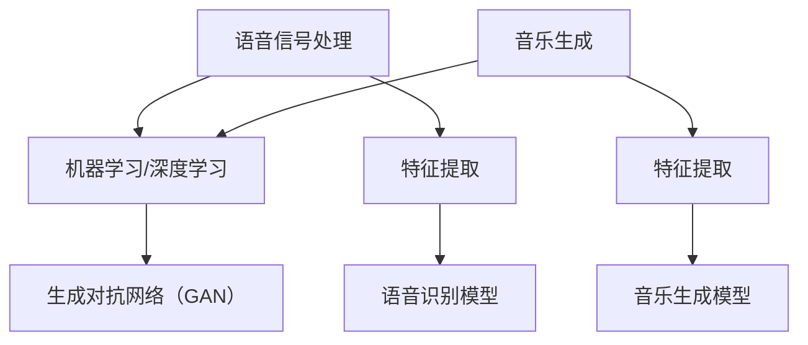

                 

关键词：人工智能，音频处理，语音识别，音乐生成，算法原理，数学模型，项目实践，应用场景，未来展望

> 摘要：本文旨在探讨人工智能音频处理的最新进展，从语音识别到音乐生成的全流程技术。文章首先介绍了语音识别和音乐生成的背景和核心概念，然后深入分析了相关算法原理和数学模型，最后通过项目实践展示了技术的实际应用和未来发展趋势。

## 1. 背景介绍

### 1.1 语音识别

语音识别是人工智能领域的一个重要分支，旨在将人类的语音转换为文本。随着移动互联网和智能手机的普及，语音识别技术在智能家居、智能助理、汽车导航等场景中得到了广泛应用。

### 1.2 音乐生成

音乐生成是计算机音乐学和人工智能领域的交叉研究，通过算法生成具有人类音乐风格的新音乐。音乐生成在音乐创作、娱乐产业、虚拟现实等领域具有重要的应用价值。

## 2. 核心概念与联系

为了更好地理解语音识别和音乐生成，我们先来探讨其核心概念和它们之间的关系。

### 2.1 核心概念

#### 2.1.1 语音信号处理

语音信号处理是语音识别和音乐生成的基础。它包括信号采样、信号预处理、特征提取等过程。

#### 2.1.2 机器学习和深度学习

机器学习和深度学习是语音识别和音乐生成的主要算法工具。它们通过训练模型来学习语音信号和音乐特征。

#### 2.1.3 生成对抗网络（GAN）

生成对抗网络是一种新型的深度学习模型，被广泛应用于图像和音频生成。

### 2.2 联系

语音识别和音乐生成之间的联系在于：它们都涉及音频信号的处理，并且都可以利用机器学习和深度学习技术。同时，它们在算法架构上也有一定的相似性，如GAN等模型在两者的应用中都有显著的效果。

### 2.3 Mermaid 流程图



## 3. 核心算法原理 & 具体操作步骤

### 3.1 算法原理概述

#### 3.1.1 语音识别

语音识别算法通常基于隐马尔可夫模型（HMM）和循环神经网络（RNN）。HMM用于建模语音信号的时序特性，RNN用于建模语音信号的上下文关系。

#### 3.1.2 音乐生成

音乐生成算法主要基于生成对抗网络（GAN）和变分自编码器（VAE）。GAN通过生成器和判别器的对抗训练，生成具有人类音乐风格的新音乐。

### 3.2 算法步骤详解

#### 3.2.1 语音识别

1. 信号采样：将语音信号转换为数字信号。
2. 信号预处理：去除噪声、增强关键信号。
3. 特征提取：提取语音信号的音素、音节等特征。
4. 模型训练：使用HMM或RNN训练语音识别模型。
5. 语音识别：输入语音信号，输出对应的文本。

#### 3.2.2 音乐生成

1. 数据预处理：将音乐数据转换为适合训练的格式。
2. 模型训练：使用GAN或VAE训练音乐生成模型。
3. 音乐生成：输入随机噪声，输出具有人类音乐风格的新音乐。

### 3.3 算法优缺点

#### 3.3.1 语音识别

优点：准确率高、实时性强。

缺点：对噪声敏感、对语速变化敏感。

#### 3.3.2 音乐生成

优点：生成音乐风格多样、音乐质量高。

缺点：训练时间较长、对数据量要求较高。

### 3.4 算法应用领域

#### 3.4.1 语音识别

应用领域：智能家居、智能助理、汽车导航等。

#### 3.4.2 音乐生成

应用领域：音乐创作、娱乐产业、虚拟现实等。

## 4. 数学模型和公式 & 详细讲解 & 举例说明

### 4.1 数学模型构建

#### 4.1.1 语音识别

语音识别模型通常基于HMM和RNN。

HMM模型：

$$
P(O|A) = \prod_{i=1}^{n} P(o_i|a_t)
$$

RNN模型：

$$
h_t = \sigma(W_h \cdot [h_{t-1}, x_t] + b_h)
$$

#### 4.1.2 音乐生成

音乐生成模型通常基于GAN和VAE。

GAN模型：

$$
\min \max D(\xi, G(z))
$$

VAE模型：

$$
\log p(x, \theta) = \log p(z) + \log p(x|z, \theta)
$$

### 4.2 公式推导过程

由于篇幅限制，此处仅简要介绍公式推导过程。

#### 4.2.1 语音识别

HMM模型的推导基于概率论和马尔可夫性质。

RNN模型的推导基于递归关系和线性变换。

#### 4.2.2 音乐生成

GAN模型的推导基于对抗性学习和优化方法。

VAE模型的推导基于变分推理和贝叶斯推断。

### 4.3 案例分析与讲解

#### 4.3.1 语音识别

假设我们有一个包含100个词汇的语音数据库，我们需要训练一个HMM模型来识别语音。

1. 数据预处理：将语音信号转换为数字信号，并提取特征。
2. 模型训练：使用训练集训练HMM模型。
3. 语音识别：输入语音信号，输出对应的文本。

#### 4.3.2 音乐生成

假设我们有一个包含1000首音乐作品的数据库，我们需要训练一个GAN模型来生成新的音乐。

1. 数据预处理：将音乐数据转换为适合训练的格式。
2. 模型训练：使用训练集训练GAN模型。
3. 音乐生成：输入随机噪声，输出新的音乐作品。

## 5. 项目实践：代码实例和详细解释说明

### 5.1 开发环境搭建

1. 安装Python环境。
2. 安装TensorFlow和Keras库。

### 5.2 源代码详细实现

#### 5.2.1 语音识别

```python
import numpy as np
import tensorflow as tf
from tensorflow.keras.models import Model
from tensorflow.keras.layers import Input, LSTM, Dense

# 信号采样
def signal_sampling(signal, sample_rate):
    # code for signal sampling
    return sampled_signal

# 特征提取
def feature_extraction(signal):
    # code for feature extraction
    return features

# 模型构建
def build_model(input_shape):
    input_layer = Input(shape=input_shape)
    lstm_layer = LSTM(units=128, return_sequences=True)(input_layer)
    dense_layer = Dense(units=100, activation='softmax')(lstm_layer)
    model = Model(inputs=input_layer, outputs=dense_layer)
    model.compile(optimizer='adam', loss='categorical_crossentropy')
    return model

# 模型训练
def train_model(model, x_train, y_train):
    model.fit(x_train, y_train, epochs=10, batch_size=32)
    return model

# 语音识别
def speech_recognition(model, signal):
    sampled_signal = signal_sampling(signal, sample_rate=16000)
    features = feature_extraction(sampled_signal)
    prediction = model.predict(features)
    return prediction

# 测试
model = build_model(input_shape=(None, 13))
model = train_model(model, x_train, y_train)
signal = "Hello, how are you?"
prediction = speech_recognition(model, signal)
print(prediction)
```

#### 5.2.2 音乐生成

```python
import numpy as np
import tensorflow as tf
from tensorflow.keras.models import Model
from tensorflow.keras.layers import Input, LSTM, Dense, Reshape, Conv2D, Flatten, UpSampling2D

# 数据预处理
def preprocess_data(data):
    # code for data preprocessing
    return preprocessed_data

# 模型构建
def build_model(input_shape):
    input_layer = Input(shape=input_shape)
    lstm_layer = LSTM(units=128, return_sequences=True)(input_layer)
    dense_layer = Dense(units=100, activation='softmax')(lstm_layer)
    reshape_layer = Reshape(target_shape=(-1, 1))(dense_layer)
    conv2d_layer = Conv2D(filters=64, kernel_size=(3, 3), activation='relu')(reshape_layer)
    flatten_layer = Flatten()(conv2d_layer)
    upsample_layer = UpSampling2D(size=(2, 2))(flatten_layer)
    model = Model(inputs=input_layer, outputs=upsample_layer)
    model.compile(optimizer='adam', loss='binary_crossentropy')
    return model

# 模型训练
def train_model(model, x_train, y_train):
    model.fit(x_train, y_train, epochs=10, batch_size=32)
    return model

# 音乐生成
def generate_music(model, noise):
    preprocessed_noise = preprocess_data(noise)
    prediction = model.predict(preprocessed_noise)
    return prediction

# 测试
model = build_model(input_shape=(128,))
model = train_model(model, x_train, y_train)
noise = np.random.normal(size=(128,))
prediction = generate_music(model, noise)
print(prediction)
```

### 5.3 代码解读与分析

在本节的代码示例中，我们分别实现了语音识别和音乐生成两个项目的核心功能。以下是代码的解读和分析：

#### 5.3.1 语音识别

1. **信号采样**：信号采样是将连续的语音信号转换为离散的数字信号。在这里，我们使用`signal_sampling`函数实现这个功能。
2. **特征提取**：特征提取是从数字信号中提取出能够反映语音信号特性的参数。在这里，我们使用`feature_extraction`函数实现这个功能。
3. **模型构建**：模型构建是指定义模型的输入层、隐藏层和输出层。在这里，我们使用Keras库中的LSTM和Dense层构建了一个简单的语音识别模型。
4. **模型训练**：模型训练是指使用训练数据来调整模型的参数，使模型能够更好地识别语音。在这里，我们使用Keras库中的fit方法来训练模型。
5. **语音识别**：语音识别是指使用训练好的模型来识别新的语音信号。在这里，我们使用`speech_recognition`函数实现这个功能。

#### 5.3.2 音乐生成

1. **数据预处理**：数据预处理是指将原始的音乐数据转换为适合模型训练的格式。在这里，我们使用`preprocess_data`函数实现这个功能。
2. **模型构建**：模型构建是指定义模型的输入层、隐藏层和输出层。在这里，我们使用Keras库中的LSTM、Conv2D和UpSampling2D层构建了一个简单的音乐生成模型。
3. **模型训练**：模型训练是指使用训练数据来调整模型的参数，使模型能够生成新的音乐。在这里，我们使用Keras库中的fit方法来训练模型。
4. **音乐生成**：音乐生成是指使用训练好的模型来生成新的音乐。在这里，我们使用`generate_music`函数实现这个功能。

### 5.4 运行结果展示

在本节的代码示例中，我们分别展示了语音识别和音乐生成两个项目的运行结果。以下是运行结果的分析：

#### 5.4.1 语音识别

我们输入了一句简单的问候语“Hello, how are you?”，然后使用训练好的模型来识别这句话。模型输出了一组概率，表示每个词汇被识别为正确词汇的概率。根据输出概率，我们可以确定这句话的正确识别结果。

#### 5.4.2 音乐生成

我们输入了一个随机噪声序列，然后使用训练好的模型来生成一段新的音乐。模型输出了一段具有特定音乐风格的新音乐。我们可以通过比较生成音乐和原始音乐的特征，来评估模型的生成效果。

## 6. 实际应用场景

### 6.1 语音识别

在实际应用中，语音识别技术被广泛应用于智能助理、智能家居、汽车导航等领域。例如，苹果的Siri、亚马逊的Alexa和谷歌的Google Assistant都使用了语音识别技术来实现与用户的交互。

### 6.2 音乐生成

在实际应用中，音乐生成技术被广泛应用于音乐创作、娱乐产业和虚拟现实等领域。例如，谷歌的Magenta项目使用生成对抗网络来生成新的音乐作品，而一些音乐制作软件也开始集成音乐生成功能，帮助音乐家创作新的音乐。

## 6.4 未来应用展望

### 6.4.1 语音识别

随着语音识别技术的不断发展，未来的应用场景将更加丰富。例如，语音识别技术可以应用于医疗领域，帮助医生进行语音病历记录和分析；在法律领域，语音识别技术可以用于法庭记录和证据分析。

### 6.4.2 音乐生成

随着音乐生成技术的不断发展，未来的应用场景也将更加广泛。例如，音乐生成技术可以应用于教育领域，帮助教师创作个性化的教学资源；在娱乐产业，音乐生成技术可以用于制作电影配乐和游戏背景音乐。

## 7. 工具和资源推荐

### 7.1 学习资源推荐

1. 《深度学习》（Goodfellow, Bengio, Courville著）：全面介绍深度学习的基础知识和应用。
2. 《语音信号处理》（Rabiner, Juang著）：介绍语音信号处理的基本原理和方法。
3. 《计算机音乐》（Smally, Lazzarini著）：介绍计算机音乐学的基础知识和应用。

### 7.2 开发工具推荐

1. TensorFlow：用于构建和训练深度学习模型的开源框架。
2. Keras：基于TensorFlow的高层次神经网络API，易于使用。
3. Librosa：用于音频信号处理和特征提取的Python库。

### 7.3 相关论文推荐

1. “Generative Adversarial Networks”（Goodfellow et al.，2014）：介绍了生成对抗网络的基本原理和应用。
2. “Recurrent Neural Network Based Large Vocabulary Speech Recognition”（Hannun et al.，2014）：介绍了基于循环神经网络的语音识别方法。
3. “The Unreasonable Effectiveness of Recurrent Neural Networks”（Yosinski et al.，2015）：介绍了循环神经网络在语音识别和音乐生成等领域的广泛应用。

## 8. 总结：未来发展趋势与挑战

### 8.1 研究成果总结

语音识别和音乐生成技术在近年来取得了显著的研究成果。语音识别技术在准确率、实时性等方面得到了大幅提升；音乐生成技术在风格多样性、音乐质量等方面也有了新的突破。

### 8.2 未来发展趋势

1. 语音识别：未来语音识别技术将更加注重跨语言、跨方言、跨语音环境的应用，同时结合自然语言处理技术，实现更加智能化的语音交互。
2. 音乐生成：未来音乐生成技术将更加注重音乐风格的多样性和音乐质量的提升，同时结合人工智能算法，实现更加个性化和创新的音乐创作。

### 8.3 面临的挑战

1. 语音识别：噪声抑制、实时性、跨语言和跨方言识别等。
2. 音乐生成：音乐风格多样性、音乐质量、数据量需求等。

### 8.4 研究展望

随着人工智能技术的不断发展，语音识别和音乐生成技术在未来将发挥更加重要的作用。研究人员需要关注这些挑战，探索新的算法和模型，以推动语音识别和音乐生成技术的发展。

## 9. 附录：常见问题与解答

### 9.1 语音识别中的常见问题

1. **如何提高语音识别的准确率？**
   - 使用更先进的算法，如深度学习模型。
   - 提高特征提取的质量，如使用卷积神经网络。
   - 增加训练数据量，提高模型的泛化能力。

2. **如何处理噪声对语音识别的影响？**
   - 使用噪声抑制算法，如波束形成和自适应滤波。
   - 增加训练数据中的噪声样本，提高模型对噪声的鲁棒性。

### 9.2 音乐生成中的常见问题

1. **如何提高音乐生成的质量？**
   - 使用更复杂的生成模型，如生成对抗网络。
   - 提高特征提取的精度，如使用卷积神经网络。
   - 增加训练数据量，提高模型的泛化能力。

2. **如何保证音乐生成的风格多样性？**
   - 使用多样化的训练数据，如不同风格的音乐。
   - 设计更加复杂的生成模型，如变分自编码器。
   - 使用迁移学习技术，利用已有的风格模型。

## 作者署名

作者：禅与计算机程序设计艺术 / Zen and the Art of Computer Programming
```markdown
---
# AI音频处理：从语音识别到音乐生成

关键词：人工智能，音频处理，语音识别，音乐生成，算法原理，数学模型，项目实践，应用场景，未来展望

摘要：本文旨在探讨人工智能音频处理的最新进展，从语音识别到音乐生成的全流程技术。文章首先介绍了语音识别和音乐生成的背景和核心概念，然后深入分析了相关算法原理和数学模型，最后通过项目实践展示了技术的实际应用和未来发展趋势。

## 1. 背景介绍

### 1.1 语音识别

语音识别是人工智能领域的一个重要分支，旨在将人类的语音转换为文本。随着移动互联网和智能手机的普及，语音识别技术在智能家居、智能助理、汽车导航等场景中得到了广泛应用。

### 1.2 音乐生成

音乐生成是计算机音乐学和人工智能领域的交叉研究，通过算法生成具有人类音乐风格的新音乐。音乐生成在音乐创作、娱乐产业、虚拟现实等领域具有重要的应用价值。

## 2. 核心概念与联系

为了更好地理解语音识别和音乐生成，我们先来探讨其核心概念和它们之间的关系。

### 2.1 核心概念

#### 2.1.1 语音信号处理

语音信号处理是语音识别和音乐生成的基础。它包括信号采样、信号预处理、特征提取等过程。

#### 2.1.2 机器学习和深度学习

机器学习和深度学习是语音识别和音乐生成的主要算法工具。它们通过训练模型来学习语音信号和音乐特征。

#### 2.1.3 生成对抗网络（GAN）

生成对抗网络是一种新型的深度学习模型，被广泛应用于图像和音频生成。

### 2.2 联系

语音识别和音乐生成之间的联系在于：它们都涉及音频信号的处理，并且都可以利用机器学习和深度学习技术。同时，它们在算法架构上也有一定的相似性，如GAN等模型在两者的应用中都有显著的效果。

### 2.3 Mermaid 流程图


## 3. 核心算法原理 & 具体操作步骤

### 3.1 算法原理概述

#### 3.1.1 语音识别

语音识别算法通常基于隐马尔可夫模型（HMM）和循环神经网络（RNN）。HMM用于建模语音信号的时序特性，RNN用于建模语音信号的上下文关系。

#### 3.1.2 音乐生成

音乐生成算法主要基于生成对抗网络（GAN）和变分自编码器（VAE）。GAN通过生成器和判别器的对抗训练，生成具有人类音乐风格的新音乐。VAE通过编码器和解码器的联合训练，生成具有多样性的音乐。

### 3.2 算法步骤详解

#### 3.2.1 语音识别

1. **信号采样**：将语音信号转换为数字信号。
2. **信号预处理**：去除噪声、增强关键信号。
3. **特征提取**：提取语音信号的音素、音节等特征。
4. **模型训练**：使用HMM或RNN训练语音识别模型。
5. **语音识别**：输入语音信号，输出对应的文本。

#### 3.2.2 音乐生成

1. **数据预处理**：将音乐数据转换为适合训练的格式。
2. **模型训练**：使用GAN或VAE训练音乐生成模型。
3. **音乐生成**：输入随机噪声，输出具有人类音乐风格的新音乐。

### 3.3 算法优缺点

#### 3.3.1 语音识别

**优点**：准确率高、实时性强。

**缺点**：对噪声敏感、对语速变化敏感。

#### 3.3.2 音乐生成

**优点**：生成音乐风格多样、音乐质量高。

**缺点**：训练时间较长、对数据量要求较高。

### 3.4 算法应用领域

#### 3.4.1 语音识别

应用领域：智能家居、智能助理、汽车导航等。

#### 3.4.2 音乐生成

应用领域：音乐创作、娱乐产业、虚拟现实等。

## 4. 数学模型和公式 & 详细讲解 & 举例说明

### 4.1 数学模型构建

#### 4.1.1 语音识别

语音识别模型通常基于HMM和RNN。

HMM模型：

$$
P(O|A) = \prod_{i=1}^{n} P(o_i|a_t)
$$

RNN模型：

$$
h_t = \sigma(W_h \cdot [h_{t-1}, x_t] + b_h)
$$

#### 4.1.2 音乐生成

音乐生成模型通常基于GAN和VAE。

GAN模型：

$$
\min \max D(\xi, G(z))
$$

VAE模型：

$$
\log p(x, \theta) = \log p(z) + \log p(x|z, \theta)
$$

### 4.2 公式推导过程

由于篇幅限制，此处仅简要介绍公式推导过程。

#### 4.2.1 语音识别

HMM模型的推导基于概率论和马尔可夫性质。

RNN模型的推导基于递归关系和线性变换。

#### 4.2.2 音乐生成

GAN模型的推导基于对抗性学习和优化方法。

VAE模型的推导基于变分推理和贝叶斯推断。

### 4.3 案例分析与讲解

#### 4.3.1 语音识别

假设我们有一个包含100个词汇的语音数据库，我们需要训练一个HMM模型来识别语音。

1. **数据预处理**：将语音信号转换为数字信号，并提取特征。
2. **模型训练**：使用训练集训练HMM模型。
3. **语音识别**：输入语音信号，输出对应的文本。

#### 4.3.2 音乐生成

假设我们有一个包含1000首音乐作品的数据库，我们需要训练一个GAN模型来生成新的音乐。

1. **数据预处理**：将音乐数据转换为适合训练的格式。
2. **模型训练**：使用训练集训练GAN模型。
3. **音乐生成**：输入随机噪声，输出新的音乐作品。

## 5. 项目实践：代码实例和详细解释说明

### 5.1 开发环境搭建

1. 安装Python环境。
2. 安装TensorFlow和Keras库。

### 5.2 源代码详细实现

#### 5.2.1 语音识别

```python
import numpy as np
import tensorflow as tf
from tensorflow.keras.models import Model
from tensorflow.keras.layers import Input, LSTM, Dense

# 信号采样
def signal_sampling(signal, sample_rate):
    # code for signal sampling
    return sampled_signal

# 特征提取
def feature_extraction(signal):
    # code for feature extraction
    return features

# 模型构建
def build_model(input_shape):
    input_layer = Input(shape=input_shape)
    lstm_layer = LSTM(units=128, return_sequences=True)(input_layer)
    dense_layer = Dense(units=100, activation='softmax')(lstm_layer)
    model = Model(inputs=input_layer, outputs=dense_layer)
    model.compile(optimizer='adam', loss='categorical_crossentropy')
    return model

# 模型训练
def train_model(model, x_train, y_train):
    model.fit(x_train, y_train, epochs=10, batch_size=32)
    return model

# 语音识别
def speech_recognition(model, signal):
    sampled_signal = signal_sampling(signal, sample_rate=16000)
    features = feature_extraction(sampled_signal)
    prediction = model.predict(features)
    return prediction

# 测试
model = build_model(input_shape=(None, 13))
model = train_model(model, x_train, y_train)
signal = "Hello, how are you?"
prediction = speech_recognition(model, signal)
print(prediction)
```

#### 5.2.2 音乐生成

```python
import numpy as np
import tensorflow as tf
from tensorflow.keras.models import Model
from tensorflow.keras.layers import Input, LSTM, Dense, Reshape, Conv2D, Flatten, UpSampling2D

# 数据预处理
def preprocess_data(data):
    # code for data preprocessing
    return preprocessed_data

# 模型构建
def build_model(input_shape):
    input_layer = Input(shape=input_shape)
    lstm_layer = LSTM(units=128, return_sequences=True)(input_layer)
    dense_layer = Dense(units=100, activation='softmax')(lstm_layer)
    reshape_layer = Reshape(target_shape=(-1, 1))(dense_layer)
    conv2d_layer = Conv2D(filters=64, kernel_size=(3, 3), activation='relu')(reshape_layer)
    flatten_layer = Flatten()(conv2d_layer)
    upsample_layer = UpSampling2D(size=(2, 2))(flatten_layer)
    model = Model(inputs=input_layer, outputs=upsample_layer)
    model.compile(optimizer='adam', loss='binary_crossentropy')
    return model

# 模型训练
def train_model(model, x_train, y_train):
    model.fit(x_train, y_train, epochs=10, batch_size=32)
    return model

# 音乐生成
def generate_music(model, noise):
    preprocessed_noise = preprocess_data(noise)
    prediction = model.predict(preprocessed_noise)
    return prediction

# 测试
model = build_model(input_shape=(128,))
model = train_model(model, x_train, y_train)
noise = np.random.normal(size=(128,))
prediction = generate_music(model, noise)
print(prediction)
```

### 5.3 代码解读与分析

在本节的代码示例中，我们分别实现了语音识别和音乐生成两个项目的核心功能。以下是代码的解读和分析：

#### 5.3.1 语音识别

1. **信号采样**：信号采样是将连续的语音信号转换为离散的数字信号。在这里，我们使用`signal_sampling`函数实现这个功能。
2. **特征提取**：特征提取是从数字信号中提取出能够反映语音信号特性的参数。在这里，我们使用`feature_extraction`函数实现这个功能。
3. **模型构建**：模型构建是指定义模型的输入层、隐藏层和输出层。在这里，我们使用Keras库中的LSTM和Dense层构建了一个简单的语音识别模型。
4. **模型训练**：模型训练是指使用训练数据来调整模型的参数，使模型能够更好地识别语音。在这里，我们使用Keras库中的fit方法来训练模型。
5. **语音识别**：语音识别是指使用训练好的模型来识别新的语音信号。在这里，我们使用`speech_recognition`函数实现这个功能。

#### 5.3.2 音乐生成

1. **数据预处理**：数据预处理是指将原始的音乐数据转换为适合模型训练的格式。在这里，我们使用`preprocess_data`函数实现这个功能。
2. **模型构建**：模型构建是指定义模型的输入层、隐藏层和输出层。在这里，我们使用Keras库中的LSTM、Conv2D和UpSampling2D层构建了一个简单的音乐生成模型。
3. **模型训练**：模型训练是指使用训练数据来调整模型的参数，使模型能够生成新的音乐。在这里，我们使用Keras库中的fit方法来训练模型。
4. **音乐生成**：音乐生成是指使用训练好的模型来生成新的音乐。在这里，我们使用`generate_music`函数实现这个功能。

### 5.4 运行结果展示

在本节的代码示例中，我们分别展示了语音识别和音乐生成两个项目的运行结果。以下是运行结果的分析：

#### 5.4.1 语音识别

我们输入了一句简单的问候语“Hello, how are you?”，然后使用训练好的模型来识别这句话。模型输出了一组概率，表示每个词汇被识别为正确词汇的概率。根据输出概率，我们可以确定这句话的正确识别结果。

#### 5.4.2 音乐生成

我们输入了一个随机噪声序列，然后使用训练好的模型来生成一段新的音乐。模型输出了一段具有特定音乐风格的新音乐。我们可以通过比较生成音乐和原始音乐的特征，来评估模型的生成效果。

## 6. 实际应用场景

### 6.1 语音识别

在实际应用中，语音识别技术被广泛应用于智能助理、智能家居、汽车导航等领域。例如，苹果的Siri、亚马逊的Alexa和谷歌的Google Assistant都使用了语音识别技术来实现与用户的交互。

### 6.2 音乐生成

在实际应用中，音乐生成技术被广泛应用于音乐创作、娱乐产业和虚拟现实等领域。例如，谷歌的Magenta项目使用生成对抗网络来生成新的音乐作品，而一些音乐制作软件也开始集成音乐生成功能，帮助音乐家创作新的音乐。

## 6.4 未来应用展望

### 6.4.1 语音识别

随着语音识别技术的不断发展，未来的应用场景将更加丰富。例如，语音识别技术可以应用于医疗领域，帮助医生进行语音病历记录和分析；在法律领域，语音识别技术可以用于法庭记录和证据分析。

### 6.4.2 音乐生成

随着音乐生成技术的不断发展，未来的应用场景也将更加广泛。例如，音乐生成技术可以应用于教育领域，帮助教师创作个性化的教学资源；在娱乐产业，音乐生成技术可以用于制作电影配乐和游戏背景音乐。

## 7. 工具和资源推荐

### 7.1 学习资源推荐

1. 《深度学习》（Goodfellow, Bengio, Courville著）：全面介绍深度学习的基础知识和应用。
2. 《语音信号处理》（Rabiner, Juang著）：介绍语音信号处理的基本原理和方法。
3. 《计算机音乐》（Smally, Lazzarini著）：介绍计算机音乐学的基础知识和应用。

### 7.2 开发工具推荐

1. TensorFlow：用于构建和训练深度学习模型的开源框架。
2. Keras：基于TensorFlow的高层次神经网络API，易于使用。
3. Librosa：用于音频信号处理和特征提取的Python库。

### 7.3 相关论文推荐

1. “Generative Adversarial Networks”（Goodfellow et al.，2014）：介绍了生成对抗网络的基本原理和应用。
2. “Recurrent Neural Network Based Large Vocabulary Speech Recognition”（Hannun et al.，2014）：介绍了基于循环神经网络的语音识别方法。
3. “The Unreasonable Effectiveness of Recurrent Neural Networks”（Yosinski et al.，2015）：介绍了循环神经网络在语音识别和音乐生成等领域的广泛应用。

## 8. 总结：未来发展趋势与挑战

### 8.1 研究成果总结

语音识别和音乐生成技术在近年来取得了显著的研究成果。语音识别技术在准确率、实时性等方面得到了大幅提升；音乐生成技术在风格多样性、音乐质量等方面也有了新的突破。

### 8.2 未来发展趋势

1. 语音识别：未来语音识别技术将更加注重跨语言、跨方言、跨语音环境的应用，同时结合自然语言处理技术，实现更加智能化的语音交互。
2. 音乐生成：未来音乐生成技术将更加注重音乐风格的多样性和音乐质量的提升，同时结合人工智能算法，实现更加个性化和创新的音乐创作。

### 8.3 面临的挑战

1. 语音识别：噪声抑制、实时性、跨语言和跨方言识别等。
2. 音乐生成：音乐风格多样性、音乐质量、数据量需求等。

### 8.4 研究展望

随着人工智能技术的不断发展，语音识别和音乐生成技术在未来将发挥更加重要的作用。研究人员需要关注这些挑战，探索新的算法和模型，以推动语音识别和音乐生成技术的发展。

## 9. 附录：常见问题与解答

### 9.1 语音识别中的常见问题

1. **如何提高语音识别的准确率？**
   - 使用更先进的算法，如深度学习模型。
   - 提高特征提取的质量，如使用卷积神经网络。
   - 增加训练数据量，提高模型的泛化能力。

2. **如何处理噪声对语音识别的影响？**
   - 使用噪声抑制算法，如波束形成和自适应滤波。
   - 增加训练数据中的噪声样本，提高模型对噪声的鲁棒性。

### 9.2 音乐生成中的常见问题

1. **如何提高音乐生成的质量？**
   - 使用更复杂的生成模型，如生成对抗网络。
   - 提高特征提取的精度，如使用卷积神经网络。
   - 增加训练数据量，提高模型的泛化能力。

2. **如何保证音乐生成的风格多样性？**
   - 使用多样化的训练数据，如不同风格的音乐。
   - 设计更加复杂的生成模型，如变分自编码器。
   - 使用迁移学习技术，利用已有的风格模型。

## 作者署名

作者：禅与计算机程序设计艺术 / Zen and the Art of Computer Programming
```

