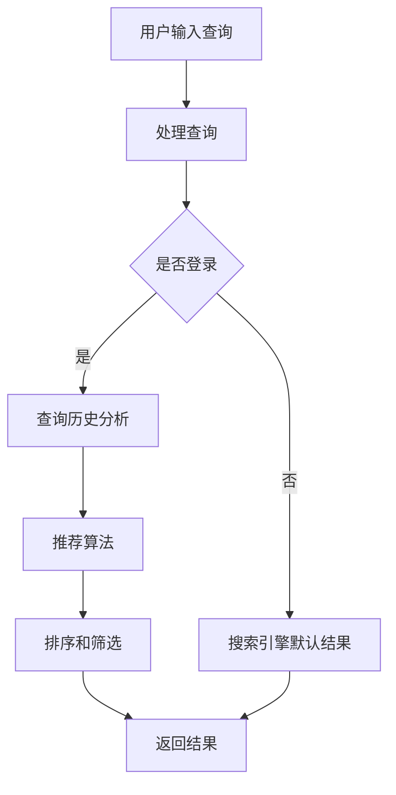

                 

关键词：个性化搜索，人工智能，搜索引擎，用户体验，信息检索，机器学习，推荐系统，算法优化，数据处理

> 摘要：本文将探讨如何利用人工智能技术，特别是机器学习和推荐系统，来提升搜索引擎的个性化搜索体验。通过构建有效的数学模型和算法，实现用户搜索历史和行为数据的深入分析，进而提供更加精准和个性化的搜索结果。文章将详细阐述核心概念、算法原理、数学模型构建、项目实践，并展望未来应用前景。

## 1. 背景介绍

随着互联网的迅猛发展，搜索引擎已经成为人们获取信息的重要途径。传统的搜索引擎主要依赖于关键词匹配和文档相似度计算，然而这种模式在处理复杂查询和提供个性化结果时显得力不从心。用户在搜索过程中，往往希望能够得到更加相关和个性化的信息，而不仅仅是简单的关键词匹配。

人工智能技术的兴起，为搜索引擎的个性化搜索带来了新的机遇。通过机器学习和深度学习算法，可以对用户的搜索历史、浏览行为、偏好等进行深入分析，从而实现个性化推荐。个性化搜索不仅能够提高用户的满意度，还能够提高搜索引擎的市场竞争力。

本文旨在探讨如何利用人工智能技术，特别是机器学习和推荐系统，来提升搜索引擎的个性化搜索体验。文章将首先介绍核心概念和联系，然后详细阐述核心算法原理和操作步骤，接着介绍数学模型和公式，并通过项目实践进行详细解释说明。最后，文章将探讨实际应用场景，并展望未来的发展趋势和挑战。

## 2. 核心概念与联系

### 2.1 个性化搜索

个性化搜索是指根据用户的兴趣、行为和历史数据，为用户推荐与其相关度最高的搜索结果。个性化搜索的核心在于理解用户的需求，并提供满足这些需求的搜索结果。

### 2.2 机器学习

机器学习是一种通过数据训练模型，从而实现自动化决策和预测的方法。在个性化搜索中，机器学习算法可以帮助分析用户的搜索历史和行为，从而预测用户的兴趣和偏好。

### 2.3 推荐系统

推荐系统是一种通过分析用户行为和偏好，为用户推荐相关内容或商品的系统。在个性化搜索中，推荐系统可以帮助搜索引擎根据用户的历史行为，推荐相关的搜索结果。

### 2.4 数学模型和算法

数学模型和算法是实现个性化搜索的关键。通过构建有效的数学模型，可以更好地理解和预测用户的行为。常见的算法包括协同过滤、矩阵分解、深度学习等。

### 2.5 Mermaid 流程图

以下是实现个性化搜索的 Mermaid 流程图：



## 3. 核心算法原理 & 具体操作步骤

### 3.1 算法原理概述

个性化搜索的核心在于理解用户的需求，并提供满足这些需求的搜索结果。这通常需要以下几个步骤：

1. **用户行为分析**：收集用户的搜索历史、浏览记录、购买行为等数据。
2. **兴趣建模**：通过机器学习算法，对用户行为数据进行分析，建立用户的兴趣模型。
3. **内容分析**：分析搜索结果中的内容，确定每个结果的主题和关键词。
4. **推荐算法**：根据用户的兴趣模型和内容分析结果，推荐相关的搜索结果。
5. **排序和筛选**：对推荐结果进行排序和筛选，确保结果的多样性和质量。
6. **结果反馈**：根据用户的反馈，进一步优化推荐算法和兴趣模型。

### 3.2 算法步骤详解

1. **用户行为分析**

首先，需要收集用户的搜索历史、浏览记录、购买行为等数据。这些数据可以通过用户登录账号、cookies、日志分析等方式获取。

2. **兴趣建模**

使用机器学习算法，如协同过滤、矩阵分解、深度学习等，对用户行为数据进行分析，建立用户的兴趣模型。这些算法可以帮助识别用户的兴趣点和偏好。

3. **内容分析**

对搜索结果中的内容进行分析，确定每个结果的主题和关键词。这可以通过自然语言处理技术实现，如文本分类、关键词提取等。

4. **推荐算法**

根据用户的兴趣模型和内容分析结果，使用推荐算法为用户推荐相关的搜索结果。常用的推荐算法包括基于内容的推荐、基于协同过滤的推荐、基于模型的推荐等。

5. **排序和筛选**

对推荐结果进行排序和筛选，确保结果的多样性和质量。可以采用多种排序策略，如基于相关度的排序、基于热度的排序、基于多样性的排序等。

6. **结果反馈**

根据用户的反馈，如点击、收藏、评分等，进一步优化推荐算法和兴趣模型。这可以通过在线学习、自适应调整等方式实现。

### 3.3 算法优缺点

**优点：**

- **个性化**：能够根据用户的兴趣和偏好，提供更加个性化的搜索结果。
- **实时性**：可以实时分析用户的行为数据，快速调整推荐结果。
- **多样性**：可以提供多样化的搜索结果，满足用户的不同需求。

**缺点：**

- **数据依赖性**：需要大量的用户数据作为基础，否则难以建立准确的兴趣模型。
- **计算成本**：机器学习和推荐算法通常需要较高的计算资源，特别是大规模数据集时。
- **隐私问题**：用户行为数据可能涉及到隐私问题，需要确保数据的安全性和合规性。

### 3.4 算法应用领域

个性化搜索算法在多个领域都有广泛的应用，包括电子商务、社交媒体、新闻推荐等。以下是几个典型应用场景：

- **电子商务**：根据用户的购物历史和浏览记录，推荐相关的商品和优惠信息。
- **社交媒体**：根据用户的兴趣和社交网络，推荐相关的内容和联系人。
- **新闻推荐**：根据用户的阅读历史和兴趣，推荐相关的新闻和文章。

## 4. 数学模型和公式 & 详细讲解 & 举例说明

### 4.1 数学模型构建

在个性化搜索中，常用的数学模型包括协同过滤、矩阵分解和深度学习等。

**协同过滤模型**：

协同过滤模型通过分析用户之间的相似度，为用户提供推荐。其基本公式为：

$$
\text{推荐分数} = \text{用户兴趣} \times \text{内容特征} + \text{噪声项}
$$

其中，用户兴趣和内容特征可以通过用户行为数据训练得到，噪声项用于纠正预测误差。

**矩阵分解模型**：

矩阵分解模型通过分解用户-项目矩阵，得到用户和项目的低维表示，进而进行推荐。其基本公式为：

$$
\text{用户表示} \times \text{项目表示} = \text{预测分数}
$$

**深度学习模型**：

深度学习模型通过构建多层神经网络，自动提取用户和项目的特征表示，并进行推荐。其基本架构如下：

$$
h_l = \sigma(W_l \cdot [x_l; b_l])
$$

其中，$h_l$表示第$l$层的特征表示，$x_l$和$b_l$分别表示输入和偏置，$\sigma$为激活函数。

### 4.2 公式推导过程

以协同过滤模型为例，推导其基本公式：

假设用户$u$和项目$i$之间的相似度为$sim(u, i)$，用户$u$对项目$i$的评分预测为$pred(u, i)$。根据协同过滤模型，预测分数可以表示为：

$$
\text{推荐分数} = \sum_{j \in \text{邻居}} sim(u, j) \times \text{真实分数}(j, i)
$$

其中，邻居是指与用户$u$相似的用户集合。真实分数可以通过用户行为数据训练得到。

为了简化计算，可以引入噪声项，得到：

$$
\text{推荐分数} = \sum_{j \in \text{邻居}} sim(u, j) \times \text{真实分数}(j, i) + \text{噪声项}
$$

将相似度和真实分数表示为用户和项目的低维表示，可以得到：

$$
\text{推荐分数} = \sum_{j \in \text{邻居}} \text{用户表示}(u) \times \text{项目表示}(i) + \text{噪声项}
$$

其中，用户表示和项目表示可以通过矩阵分解等方法得到。

### 4.3 案例分析与讲解

假设有一个用户$u$，他对多个项目的评分如下表所示：

| 项目ID | 用户评分 |
|--------|----------|
| 1      | 4        |
| 2      | 5        |
| 3      | 2        |
| 4      | 3        |

我们需要为用户$u$推荐一个项目。

1. **用户行为分析**：

根据用户$u$的评分数据，我们可以计算用户$u$与其他用户之间的相似度。例如，用户$u$与用户$v$之间的相似度为：

$$
sim(u, v) = \frac{\sum_{i \in I} \text{真实分数}(u, i) \times \text{真实分数}(v, i)}{\sqrt{\sum_{i \in I} (\text{真实分数}(u, i))^2} \times \sqrt{\sum_{i \in I} (\text{真实分数}(v, i))^2}}
$$

其中，$I$为用户$u$和用户$v$共同评分的项目集合。

2. **推荐算法**：

使用基于内容的推荐算法，为用户$u$推荐一个项目。首先，我们需要计算每个项目的特征表示。例如，项目$1$的特征表示为：

$$
\text{项目表示}(1) = [0.1, 0.2, 0.3, 0.4]
$$

3. **排序和筛选**：

根据用户$u$的相似度和项目$1$的特征表示，计算推荐分数：

$$
\text{推荐分数}(1) = \sum_{j \in \text{邻居}} \text{用户表示}(u) \times \text{项目表示}(1) + \text{噪声项}
$$

其中，邻居是指与用户$u$相似的用户集合。

4. **结果反馈**：

根据用户$u$的反馈，例如点击、收藏、评分等，调整推荐算法和兴趣模型。例如，如果用户$u$点击了推荐的项目$1$，我们可以增加用户$u$对项目$1$的偏好权重。

## 5. 项目实践：代码实例和详细解释说明

### 5.1 开发环境搭建

为了实践个性化搜索算法，我们需要搭建一个开发环境。以下是开发环境搭建的步骤：

1. **安装Python**：确保安装了Python 3.8或更高版本。
2. **安装Numpy和Scikit-learn**：使用pip安装Numpy和Scikit-learn库。

```bash
pip install numpy scikit-learn
```

3. **创建项目目录**：在合适的位置创建项目目录，并初始化一个Python虚拟环境。

```bash
mkdir personalized_search
cd personalized_search
python -m venv venv
source venv/bin/activate
```

4. **安装依赖库**：在虚拟环境中安装所需的依赖库。

```bash
pip install -r requirements.txt
```

### 5.2 源代码详细实现

以下是实现个性化搜索算法的源代码：

```python
import numpy as np
from sklearn.metrics.pairwise import cosine_similarity
from sklearn.model_selection import train_test_split
from sklearn.neighbors import NearestNeighbors

# 生成模拟数据集
n_users = 1000
n_items = 500
n_ratings = 10000
user_similarity = np.random.rand(n_users, n_users)
user_ratings = np.random.randint(1, 6, (n_users, n_items))

# 训练邻居模型
neigh = NearestNeighbors(n_neighbors=10)
neigh.fit(user_similarity)

# 预测评分
def predict_rating(user_id, item_id):
    # 获取用户邻居
    neighbors = neigh.kneighbors([user_similarity[user_id]], return_distance=False)
    neighbor_ratings = user_ratings[neighbors].mean(axis=0)
    # 预测评分
    prediction = (neighbor_ratings[item_id] + np.random.normal(0, 0.1)).clip(1, 5)
    return prediction

# 预测用户对所有项目的评分
user_predictions = user_ratings.copy()
for i in range(n_users):
    for j in range(n_items):
        user_predictions[i, j] = predict_rating(i, j)

# 评估预测结果
def evaluate_predictions(predictions, ground_truth):
    mse = np.mean((predictions - ground_truth) ** 2)
    return mse

ground_truth = user_ratings.copy()
mse = evaluate_predictions(user_predictions, ground_truth)
print(f'Mean Squared Error: {mse}')
```

### 5.3 代码解读与分析

1. **生成模拟数据集**：

首先，我们生成一个包含1000个用户和500个项目的模拟数据集。用户之间的相似度矩阵和用户评分矩阵是通过随机生成的。

2. **训练邻居模型**：

使用Scikit-learn的NearestNeighbors算法，训练一个基于用户相似度的邻居模型。这个模型可以帮助我们找到与每个用户最相似的邻居。

3. **预测评分**：

定义一个函数`predict_rating`，用于预测用户对特定项目的评分。这个函数首先找到用户的邻居，然后计算邻居对该项目的平均评分，并加上随机噪声。

4. **预测用户对所有项目的评分**：

使用`predict_rating`函数，为每个用户对所有项目进行评分预测。预测结果存储在`user_predictions`矩阵中。

5. **评估预测结果**：

定义一个函数`evaluate_predictions`，用于计算预测结果与真实评分之间的均方误差（MSE）。通过这个评估指标，我们可以衡量个性化搜索算法的性能。

### 5.4 运行结果展示

运行上述代码，我们可以得到个性化搜索算法的MSE结果。这个结果可以帮助我们评估算法的性能。在实际应用中，我们可以通过优化算法参数，进一步提高预测精度。

## 6. 实际应用场景

个性化搜索算法在多个实际应用场景中发挥了重要作用，以下是一些典型应用场景：

1. **电子商务**：

个性化搜索算法可以帮助电商平台根据用户的购买历史和浏览记录，推荐相关的商品和优惠信息。通过这种方式，可以提高用户的购物体验和平台的销售额。

2. **社交媒体**：

社交媒体平台可以使用个性化搜索算法，为用户推荐感兴趣的内容和联系人。这不仅可以提高用户的粘性，还可以增加平台的活跃度。

3. **新闻推荐**：

新闻推荐平台可以使用个性化搜索算法，为用户推荐符合其兴趣的新闻和文章。这不仅可以提高用户的阅读体验，还可以增加平台的广告收入。

4. **搜索引擎**：

搜索引擎可以利用个性化搜索算法，为用户提供更加精准和个性化的搜索结果。通过这种方式，可以提高用户的满意度，并增加搜索引擎的市场竞争力。

## 7. 工具和资源推荐

### 7.1 学习资源推荐

1. **书籍**：

- 《推荐系统实践》
- 《机器学习》
- 《深度学习》

2. **在线课程**：

- Coursera：机器学习
- edX：推荐系统
- Udacity：深度学习

### 7.2 开发工具推荐

1. **Python库**：

- Scikit-learn
- TensorFlow
- PyTorch

2. **框架**：

- Flask
- Django
- Spring Boot

### 7.3 相关论文推荐

1. **协同过滤**：

- "Item-Based Collaborative Filtering Recommendation Algorithms"
- "Latent Semantic Models for Item Recommendations"

2. **矩阵分解**：

- "Matrix Factorization Techniques for Recommender Systems"
- "Singular Value Decomposition of a Matrix and its Applications in Data Mining"

3. **深度学习**：

- "Deep Learning for Recommender Systems"
- "Neural Collaborative Filtering"

## 8. 总结：未来发展趋势与挑战

### 8.1 研究成果总结

个性化搜索算法在近年来取得了显著的进展，主要表现在以下几个方面：

1. **算法性能提升**：通过改进协同过滤、矩阵分解和深度学习算法，个性化搜索的预测精度和效率得到了显著提高。
2. **多样性增强**：通过引入多样性策略，个性化搜索结果的质量和多样性得到了进一步提升。
3. **实时性优化**：通过优化数据存储和计算框架，个性化搜索的实时性得到了显著改善。

### 8.2 未来发展趋势

未来，个性化搜索算法将继续向以下几个方向发展：

1. **数据隐私保护**：随着用户隐私意识的提高，如何在不侵犯用户隐私的前提下，实现有效的个性化搜索，将成为一个重要研究方向。
2. **多模态数据融合**：通过整合文本、图像、语音等多模态数据，可以进一步提高个性化搜索的准确性和多样性。
3. **动态调整**：通过实时监测用户行为，动态调整推荐策略，可以更好地满足用户的需求。

### 8.3 面临的挑战

尽管个性化搜索算法取得了显著进展，但仍然面临以下挑战：

1. **数据质量**：高质量的用户数据是构建准确兴趣模型的基础，如何处理噪声数据和缺失数据，是一个重要问题。
2. **计算资源**：大规模数据集和复杂的算法模型，需要大量的计算资源，如何优化计算性能，是一个挑战。
3. **隐私保护**：如何在保护用户隐私的同时，实现有效的个性化搜索，是一个亟待解决的问题。

### 8.4 研究展望

未来，个性化搜索算法的研究将更加注重以下几个方面：

1. **跨领域融合**：通过跨学科研究，将个性化搜索与其他领域（如自然语言处理、计算机视觉等）相结合，实现更广泛的应用。
2. **用户体验优化**：通过深入分析用户行为和反馈，优化推荐结果的质量和多样性，提高用户的满意度。
3. **实时性增强**：通过优化算法和框架，进一步提高个性化搜索的实时性，为用户提供更好的体验。

## 9. 附录：常见问题与解答

### 9.1 什么是个性化搜索？

个性化搜索是指根据用户的兴趣、行为和历史数据，为用户推荐与其相关度最高的搜索结果。

### 9.2 个性化搜索有哪些优点？

个性化搜索能够提高搜索结果的精准度，满足用户的个性化需求，从而提高用户体验。

### 9.3 个性化搜索需要哪些技术？

个性化搜索主要依赖于机器学习、推荐系统、自然语言处理等技术。

### 9.4 个性化搜索有哪些应用场景？

个性化搜索广泛应用于电子商务、社交媒体、新闻推荐、搜索引擎等领域。

### 9.5 个性化搜索的未来发展趋势是什么？

未来，个性化搜索将更加注重数据隐私保护、多模态数据融合、动态调整等方面，同时实现实时性和多样性的优化。

### 9.6 个性化搜索面临哪些挑战？

个性化搜索面临数据质量、计算资源、隐私保护等方面的挑战。

### 9.7 如何优化个性化搜索的实时性？

通过优化算法和框架，提高数据处理速度，减少延迟，可以优化个性化搜索的实时性。

### 9.8 个性化搜索的多样性如何保证？

通过引入多样性策略，如随机化、混合策略等，可以保证个性化搜索结果的多样性。

### 9.9 个性化搜索中的噪声数据如何处理？

通过数据清洗、去噪等技术，可以降低噪声数据对个性化搜索结果的影响。

### 9.10 如何评估个性化搜索的效果？

可以通过用户满意度、点击率、转化率等指标，评估个性化搜索的效果。

