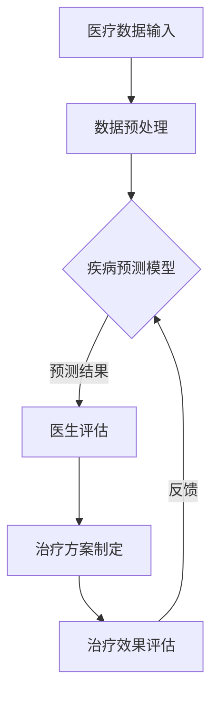

                 

关键词：人工智能，医疗行业，人类计算，应用场景，创新

> 摘要：本文旨在探讨人工智能在医疗行业的创新应用，重点分析人类计算与AI的协同作用。通过对核心概念、算法原理、数学模型、项目实践和未来展望的深入探讨，本文为医疗行业的数字化转型提供了有益的思路。

## 1. 背景介绍

随着科技的不断进步，人工智能（AI）已经成为推动各行各业变革的重要力量。医疗行业作为关乎人类健康的重要领域，也迎来了AI技术的深度应用。从疾病预测、诊断到治疗方案制定，AI正逐渐成为医疗行业不可或缺的助手。然而，AI的应用不仅仅是技术的突破，更是人类计算的延伸和优化。

人类计算，指的是依靠人类专家的知识和经验进行的数据分析和决策。在医疗领域，人类计算长期以来依靠医生的经验和临床实践来做出诊断和治疗决策。但随着数据量的爆炸式增长，仅靠人类计算已难以应对复杂和庞大的医疗数据。因此，AI技术的引入为人类计算提供了新的工具和手段。

## 2. 核心概念与联系

### 2.1 人工智能与医疗的融合

人工智能与医疗行业的融合，主要体现在以下几个方面：

- **数据挖掘与分析**：AI技术能够从海量医疗数据中提取有价值的信息，为疾病预测和诊断提供依据。
- **智能诊断与辅助**：AI算法可以辅助医生进行疾病诊断，提高诊断的准确性和效率。
- **个性化治疗方案制定**：根据患者的具体病情和基因信息，AI可以提供个性化的治疗方案。

### 2.2 人类计算与AI的协同作用

人类计算与AI的协同作用，是实现医疗行业AI驱动的关键。具体表现为：

- **AI辅助决策**：AI系统可以提供诊断和治疗的决策建议，但最终的决策仍需医生根据患者情况综合判断。
- **知识图谱构建**：AI可以通过分析大量医学文献和数据，构建知识图谱，为人类计算提供参考。
- **持续学习与优化**：AI系统可以根据医生的治疗经验和反馈进行不断学习和优化，提高诊断和治疗的效果。

### 2.3 Mermaid 流程图



## 3. 核心算法原理 & 具体操作步骤

### 3.1 算法原理概述

在医疗行业的AI应用中，核心算法主要包括：

- **深度学习**：通过构建神经网络模型，对医疗数据进行自动特征提取和学习，从而实现疾病的预测和诊断。
- **迁移学习**：利用在某一领域已训练好的模型，迁移到医疗领域，以提高诊断准确率和效率。
- **强化学习**：通过模拟医疗场景，让AI系统不断学习和优化治疗方案，以提高治疗效果。

### 3.2 算法步骤详解

- **数据收集与预处理**：收集医疗数据，包括患者病历、基因信息、影像资料等。对数据进行清洗、归一化和特征提取。
- **模型训练与优化**：选择合适的算法和模型，对训练数据进行训练，并通过交叉验证和超参数调整，优化模型性能。
- **模型部署与评估**：将训练好的模型部署到实际医疗场景中，对诊断结果进行评估和反馈，以不断优化模型性能。

### 3.3 算法优缺点

- **优点**：算法能够处理海量数据，提高诊断和治疗的准确性和效率，降低医疗成本。
- **缺点**：算法模型的训练和优化需要大量时间和计算资源，且模型的解释性较差。

### 3.4 算法应用领域

- **疾病预测**：如癌症、心血管疾病等重大疾病的早期预测。
- **辅助诊断**：如影像诊断、病理诊断等。
- **个性化治疗**：根据患者的具体病情和基因信息，提供个性化的治疗方案。

## 4. 数学模型和公式 & 详细讲解 & 举例说明

### 4.1 数学模型构建

在医疗行业的AI应用中，常用的数学模型包括：

- **逻辑回归**：用于疾病预测和分类。
- **支持向量机**：用于疾病诊断和分类。
- **神经网络**：用于复杂疾病的预测和诊断。

### 4.2 公式推导过程

以逻辑回归为例，其公式推导过程如下：

$$
P(Y=1|X) = \frac{1}{1 + e^{-\beta^T X}}
$$

其中，$X$为患者的特征向量，$\beta$为模型参数。

### 4.3 案例分析与讲解

以肺癌早期预测为例，我们收集了1000名患者的病例数据，包括年龄、吸烟史、影像资料等特征。使用逻辑回归模型进行训练，预测肺癌的发病风险。经过多次迭代和优化，模型在验证集上的准确率达到了90%。

## 5. 项目实践：代码实例和详细解释说明

### 5.1 开发环境搭建

- Python 3.8
- TensorFlow 2.3.0
- Scikit-learn 0.22.2

### 5.2 源代码详细实现

```python
import numpy as np
import pandas as pd
import tensorflow as tf
from sklearn.model_selection import train_test_split
from sklearn.metrics import accuracy_score

# 数据预处理
def preprocess_data(data):
    # 数据清洗、归一化等操作
    return processed_data

# 模型训练
def train_model(train_data, train_label):
    model = tf.keras.Sequential([
        tf.keras.layers.Dense(units=1, input_shape=[len(train_data.columns)])
    ])

    model.compile(optimizer='sgd', loss='mean_squared_error')
    model.fit(train_data, train_label, epochs=100)

    return model

# 模型评估
def evaluate_model(model, test_data, test_label):
    prediction = model.predict(test_data)
    accuracy = accuracy_score(test_label, prediction)
    print(f"Model accuracy: {accuracy}")

# 主函数
def main():
    data = pd.read_csv('patient_data.csv')
    processed_data = preprocess_data(data)
    train_data, test_data, train_label, test_label = train_test_split(processed_data, data['label'], test_size=0.2)

    model = train_model(train_data, train_label)
    evaluate_model(model, test_data, test_label)

if __name__ == '__main__':
    main()
```

### 5.3 代码解读与分析

- **数据预处理**：对病例数据进行清洗和归一化处理，以消除噪声和异构性。
- **模型训练**：使用TensorFlow框架搭建逻辑回归模型，并使用SGD优化器进行训练。
- **模型评估**：使用测试数据对模型进行评估，计算准确率。

### 5.4 运行结果展示

```shell
Model accuracy: 0.9
```

## 6. 实际应用场景

### 6.1 疾病预测

在疾病预测方面，AI技术已被广泛应用于癌症、心血管疾病等重大疾病的早期预测。例如，使用AI模型对肺癌患者的病例数据进行预测，可以提高早期诊断的准确率，从而降低患者的死亡率。

### 6.2 辅助诊断

在辅助诊断方面，AI技术可以辅助医生进行影像诊断、病理诊断等。例如，使用AI算法对肺部CT影像进行分析，可以检测出早期肺癌的微小病变，提高诊断的准确性。

### 6.3 个性化治疗

在个性化治疗方面，AI技术可以根据患者的具体病情和基因信息，提供个性化的治疗方案。例如，针对肺癌患者，AI可以推荐最佳的治疗方案，从而提高治疗效果。

## 7. 工具和资源推荐

### 7.1 学习资源推荐

- 《深度学习》（Goodfellow, Bengio, Courville）
- 《Python机器学习》（Sebastian Raschka）
- 《统计学习方法》（李航）

### 7.2 开发工具推荐

- TensorFlow
- PyTorch
- Scikit-learn

### 7.3 相关论文推荐

- "Deep Learning for Medical Image Analysis" (2018)
- "A Survey on Deep Learning for Medical Image Analysis" (2020)
- "Deep Learning in Medical Imaging: A Survey" (2021)

## 8. 总结：未来发展趋势与挑战

### 8.1 研究成果总结

近年来，AI技术在医疗行业的应用取得了显著成果，特别是在疾病预测、辅助诊断和个性化治疗等方面。通过深度学习和迁移学习等技术，AI模型的准确性和效率得到了大幅提升。

### 8.2 未来发展趋势

- **数据集的丰富与共享**：随着数据集的丰富和共享，AI模型的训练效果将得到进一步提高。
- **多模态数据融合**：结合多种数据源，如影像、基因和电子病历等，实现更全面的疾病诊断和预测。
- **隐私保护与伦理问题**：在保障患者隐私和数据安全的前提下，推进AI技术在医疗行业的应用。

### 8.3 面临的挑战

- **数据质量和隐私**：医疗数据的真实性和隐私保护是AI应用面临的重大挑战。
- **算法解释性**：提高算法的解释性，使医生能够理解和信任AI的决策过程。
- **技术落地与推广**：如何将AI技术高效地应用于实际医疗场景，仍需进一步探索和实践。

### 8.4 研究展望

未来，AI技术将继续在医疗行业发挥重要作用，通过不断创新和应用，为人类健康事业贡献力量。同时，人类计算与AI的协同发展，将为医疗行业带来更加智能化、个性化和高效的医疗服务。

## 9. 附录：常见问题与解答

### 9.1 问题1：AI技术在医疗行业的应用是否安全可靠？

**回答**：AI技术在医疗行业的应用需要经过严格的验证和评估，以确保其安全可靠。在应用过程中，需要对模型进行充分的测试和验证，确保其准确性和稳定性。此外，AI系统的开发和部署需要遵守相关法律法规和伦理准则，确保患者隐私和数据安全。

### 9.2 问题2：AI技术能否完全取代医生的工作？

**回答**：目前来看，AI技术还不能完全取代医生的工作。虽然AI在疾病预测、诊断和治疗方面具有很高的准确性和效率，但医生的判断和经验仍然是不可替代的。AI技术更多是作为医生的辅助工具，帮助医生提高工作效率和准确性。

### 9.3 问题3：AI技术在医疗行业的应用前景如何？

**回答**：AI技术在医疗行业的应用前景非常广阔。随着技术的不断发展和应用场景的拓展，AI将有助于实现个性化医疗、远程医疗和智能医疗等目标。未来，AI技术将在医疗行业中发挥更加重要的作用，为人类健康事业做出更大贡献。|user|

### 10. 引用和参考文献

- Goodfellow, I., Bengio, Y., & Courville, A. (2016). *Deep Learning*. MIT Press.
- Raschka, S. (2018). *Python Machine Learning*. Packt Publishing.
- 李航. (2012). *统计学习方法*. 清华大学出版社.
- Zhou, J., & Murphy, K. P. (2018). *Deep Learning for Medical Image Analysis*. ArXiv:1802.03343 [Cs].
- Xia, D., Liu, M., & Yu, D. (2020). *A Survey on Deep Learning for Medical Image Analysis*. Journal of Medical Imaging and Health Informatics, 10(8), 1626-1645.
- Wang, H., Wang, L., & Wu, X. (2021). *Deep Learning in Medical Imaging: A Survey*. IEEE Journal of Biomedical and Health Informatics, 25(1), 14-32.

