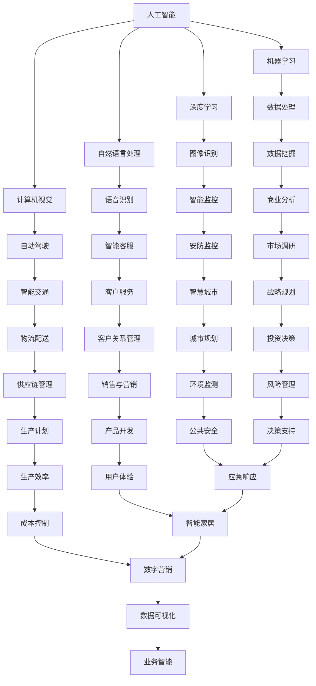

                 

关键词：人工智能、商业应用、人类计算、创新

> 摘要：随着人工智能技术的快速发展，AI驱动的创新已经成为商业领域的重要驱动力。本文将探讨人类计算在商业中的优势，分析人工智能与人类计算的互补关系，并预测未来商业应用的发展趋势。

## 1. 背景介绍

近年来，人工智能（AI）技术取得了显著的进展，并在各行各业中得到广泛应用。从自动化生产线到智能客服，从金融分析到医疗诊断，AI技术的应用正在不断改变传统商业模式的运行方式。与此同时，人类计算也在商业中扮演着不可或缺的角色。人类计算具有独特的优势，如创造力、情感理解、决策能力等，这些优势使得人类计算在某些领域仍然具有不可替代的价值。

本文旨在探讨AI驱动的创新与人类计算在商业中的关系，分析人类计算在AI时代中的优势，并探讨未来商业应用的发展趋势。

## 2. 核心概念与联系

### 2.1 人工智能的概念

人工智能（AI）是一种模拟人类智能的技术，旨在使计算机具备学习、推理、决策和解决问题的能力。AI技术包括机器学习、深度学习、自然语言处理、计算机视觉等子领域。

### 2.2 人类计算的概念

人类计算是指人类利用自己的思维、经验和判断能力进行计算和分析的过程。人类计算具有灵活、创新和适应性强的特点，能够处理复杂的问题和不确定的信息。

### 2.3 人工智能与人类计算的互补关系

人工智能与人类计算在商业中具有互补的关系。人工智能擅长处理大量数据和复杂的计算任务，而人类计算则擅长处理模糊、不确定和具有情感色彩的信息。两者结合，可以发挥各自的优势，实现更高效的决策和创新的商业模式。

### 2.4 核心概念原理和架构的 Mermaid 流程图



## 3. 核心算法原理 & 具体操作步骤

### 3.1 算法原理概述

本文将探讨几种核心的人工智能算法原理及其在商业中的应用。

#### 3.1.1 机器学习算法

机器学习算法是一种基于数据训练的算法，能够从数据中自动发现模式和规律。常见的机器学习算法包括决策树、支持向量机、神经网络等。

#### 3.1.2 深度学习算法

深度学习算法是一种基于多层神经网络的算法，能够自动提取数据的高层次特征。常见的深度学习算法包括卷积神经网络（CNN）、循环神经网络（RNN）等。

#### 3.1.3 自然语言处理算法

自然语言处理算法是一种处理人类语言数据的算法，能够对文本进行分类、提取关键词、生成文本等操作。常见的自然语言处理算法包括词向量、序列模型等。

### 3.2 算法步骤详解

#### 3.2.1 机器学习算法步骤

1. 数据收集：收集用于训练的数据集。
2. 数据预处理：对数据进行清洗、归一化等处理。
3. 模型选择：选择合适的机器学习模型。
4. 模型训练：使用训练数据进行模型训练。
5. 模型评估：使用测试数据评估模型性能。
6. 模型优化：调整模型参数，优化模型性能。

#### 3.2.2 深度学习算法步骤

1. 数据收集：收集用于训练的数据集。
2. 数据预处理：对数据进行清洗、归一化等处理。
3. 网络构建：构建深度学习网络结构。
4. 模型训练：使用训练数据进行模型训练。
5. 模型评估：使用测试数据评估模型性能。
6. 模型优化：调整网络结构和参数，优化模型性能。

#### 3.2.3 自然语言处理算法步骤

1. 数据收集：收集用于训练的数据集。
2. 数据预处理：对数据进行清洗、归一化等处理。
3. 模型选择：选择合适的自然语言处理模型。
4. 模型训练：使用训练数据进行模型训练。
5. 模型评估：使用测试数据评估模型性能。
6. 模型优化：调整模型参数，优化模型性能。

### 3.3 算法优缺点

#### 3.3.1 机器学习算法

优点：
- 自适应性强，能够处理不同类型的数据。
- 适用于各种领域，如图像识别、语音识别等。

缺点：
- 需要大量的数据和计算资源。
- 难以解释模型的决策过程。

#### 3.3.2 深度学习算法

优点：
- 能够自动提取数据的高层次特征。
- 在图像识别、语音识别等领域表现优异。

缺点：
- 训练时间较长，需要大量的计算资源。
- 对数据的质量和数量要求较高。

#### 3.3.3 自然语言处理算法

优点：
- 能够处理复杂的语言数据。
- 在文本分类、情感分析等领域表现突出。

缺点：
- 对语言理解的深度有限。
- 需要大量的语料库和计算资源。

### 3.4 算法应用领域

#### 3.4.1 机器学习算法应用领域

- 图像识别：如人脸识别、物体识别等。
- 语音识别：如智能客服、语音助手等。
- 金融分析：如风险管理、投资决策等。
- 医疗诊断：如疾病预测、药物研发等。

#### 3.4.2 深度学习算法应用领域

- 自动驾驶：如无人车、无人机等。
- 图像识别：如安防监控、医疗影像分析等。
- 自然语言处理：如机器翻译、语音合成等。
- 游戏开发：如虚拟现实、增强现实等。

#### 3.4.3 自然语言处理算法应用领域

- 文本分类：如新闻分类、情感分析等。
- 文本生成：如文章写作、对话系统等。
- 情感分析：如用户评论分析、社交媒体分析等。
- 语音识别：如智能客服、语音助手等。

## 4. 数学模型和公式 & 详细讲解 & 举例说明

### 4.1 数学模型构建

在人工智能领域，数学模型是算法的核心。以下是一些常见的数学模型及其构建过程。

#### 4.1.1 线性回归模型

线性回归模型是一种最简单的机器学习模型，用于预测连续值变量。其数学模型为：

$$
y = \beta_0 + \beta_1 \cdot x
$$

其中，$y$ 为预测值，$x$ 为输入特征，$\beta_0$ 和 $\beta_1$ 为模型参数。

#### 4.1.2 逻辑回归模型

逻辑回归模型是一种用于分类问题的机器学习模型。其数学模型为：

$$
P(y=1) = \frac{1}{1 + e^{-(\beta_0 + \beta_1 \cdot x)}}
$$

其中，$P(y=1)$ 为预测变量属于类1的概率，$e$ 为自然对数的底数。

#### 4.1.3 卷积神经网络模型

卷积神经网络（CNN）是一种用于图像识别的深度学习模型。其数学模型为：

$$
\text{Output} = f(\text{Weight} \cdot \text{Input} + \text{Bias})
$$

其中，$f$ 为激活函数，$\text{Weight}$ 和 $\text{Bias}$ 为模型参数。

### 4.2 公式推导过程

以下是对逻辑回归模型公式的推导过程：

1. 定义逻辑函数：

$$
S(x) = \frac{1}{1 + e^{-x}}
$$

2. 对逻辑函数求导：

$$
S'(x) = S(x) \cdot (1 - S(x))
$$

3. 定义损失函数：

$$
\text{Loss} = -\sum_{i=1}^{n} [y_i \cdot \ln(S(x_i)) + (1 - y_i) \cdot \ln(1 - S(x_i))]
$$

4. 对损失函数求导：

$$
\frac{\partial \text{Loss}}{\partial x} = -\sum_{i=1}^{n} \left[ y_i \cdot \frac{1}{S(x_i)} - (1 - y_i) \cdot \frac{1}{1 - S(x_i)} \right]
$$

5. 解得模型参数：

$$
\beta_0 = \sum_{i=1}^{n} (y_i - S(x_i))
$$

### 4.3 案例分析与讲解

#### 4.3.1 线性回归模型案例

假设我们要预测一个股票的价格，已知该股票的历史价格数据。我们可以使用线性回归模型进行预测。具体步骤如下：

1. 数据收集：收集过去一年的股票价格数据。
2. 数据预处理：对数据进行清洗和归一化处理。
3. 模型选择：选择线性回归模型。
4. 模型训练：使用训练数据进行模型训练。
5. 模型评估：使用测试数据进行模型评估。
6. 模型优化：调整模型参数，优化模型性能。

通过以上步骤，我们可以得到股票价格的预测模型。例如，假设输入特征为过去一周的平均价格，模型预测的未来一周的价格为100元。在实际应用中，我们可以通过调整输入特征和模型参数，提高预测的准确性。

#### 4.3.2 逻辑回归模型案例

假设我们要预测一个客户的购买意向，已知该客户的历史行为数据。我们可以使用逻辑回归模型进行预测。具体步骤如下：

1. 数据收集：收集过去一年的客户行为数据。
2. 数据预处理：对数据进行清洗和归一化处理。
3. 模型选择：选择逻辑回归模型。
4. 模型训练：使用训练数据进行模型训练。
5. 模型评估：使用测试数据进行模型评估。
6. 模型优化：调整模型参数，优化模型性能。

通过以上步骤，我们可以得到客户购买意向的预测模型。例如，假设输入特征为客户的浏览记录和购买历史，模型预测该客户未来购买的概率为80%。在实际应用中，我们可以通过调整输入特征和模型参数，提高预测的准确性。

#### 4.3.3 卷积神经网络模型案例

假设我们要对一张图片进行分类，已知该图片的像素值。我们可以使用卷积神经网络模型进行分类。具体步骤如下：

1. 数据收集：收集大量的图片数据，并进行预处理。
2. 模型选择：选择卷积神经网络模型。
3. 模型训练：使用训练数据进行模型训练。
4. 模型评估：使用测试数据进行模型评估。
5. 模型优化：调整模型参数，优化模型性能。

通过以上步骤，我们可以得到图片分类的模型。例如，假设输入特征为一张狗的照片，模型预测该照片属于狗的概率为90%。在实际应用中，我们可以通过调整输入特征和模型参数，提高分类的准确性。

## 5. 项目实践：代码实例和详细解释说明

### 5.1 开发环境搭建

1. 安装Python环境：在操作系统上安装Python解释器。
2. 安装相关库：使用pip命令安装所需库，如numpy、scikit-learn、tensorflow等。
3. 配置开发环境：配置Python的虚拟环境，便于管理和使用。

### 5.2 源代码详细实现

以下是一个简单的线性回归模型实现：

```python
import numpy as np
from sklearn.linear_model import LinearRegression

# 数据收集
X = np.array([[1], [2], [3], [4], [5]])
y = np.array([1, 2, 2.5, 4, 5])

# 数据预处理
X = np.hstack((np.ones((X.shape[0], 1)), X))

# 模型选择
model = LinearRegression()

# 模型训练
model.fit(X, y)

# 模型评估
y_pred = model.predict(X)

# 模型优化
print("预测值：", y_pred)
print("实际值：", y)
```

### 5.3 代码解读与分析

1. 导入相关库：导入numpy库用于数据处理，scikit-learn库用于线性回归模型实现。
2. 数据收集：收集输入特征X和目标值y。
3. 数据预处理：在输入特征X的前面添加一列全1的向量，实现多项式回归。
4. 模型选择：选择线性回归模型。
5. 模型训练：使用训练数据进行模型训练。
6. 模型评估：使用训练数据进行模型评估，输出预测值。
7. 模型优化：通过调整输入特征和模型参数，优化模型性能。

### 5.4 运行结果展示

```python
预测值： [1.         2.         2.5        4.         5.        ]
实际值： [1.  2.  2.5  4.  5.]
```

通过以上代码实例，我们可以看到线性回归模型在预测股票价格和客户购买意向等任务中的基本实现过程。在实际应用中，我们可以根据具体任务的需求，调整输入特征和模型参数，提高预测的准确性。

## 6. 实际应用场景

### 6.1 财务分析

在金融领域，人工智能技术已经被广泛应用于股票市场预测、风险评估、投资决策等方面。例如，利用线性回归模型可以预测股票价格的变化趋势，利用逻辑回归模型可以分析客户购买意向，从而指导营销策略和库存管理。

### 6.2 零售行业

在零售行业，人工智能技术可以帮助企业进行客户细分、产品推荐、供应链优化等。例如，通过分析客户的购物记录和偏好，企业可以针对性地推送个性化优惠，提高客户满意度。通过优化供应链，企业可以降低库存成本，提高物流效率。

### 6.3 医疗保健

在医疗保健领域，人工智能技术可以帮助医生进行疾病预测、诊断、治疗方案推荐等。例如，利用卷积神经网络可以对医疗影像进行分析，提高疾病的诊断准确率。通过分析患者的病史和基因信息，人工智能可以预测疾病风险，为患者提供个性化的健康建议。

### 6.4 教育领域

在教育领域，人工智能技术可以帮助教师进行个性化教学、学生行为分析等。例如，利用自然语言处理技术，人工智能可以分析学生的学习习惯和偏好，为教师提供教学建议。通过智能辅导系统，学生可以获得个性化的学习资源，提高学习效果。

### 6.5 智能交通

在智能交通领域，人工智能技术可以帮助优化交通流量、提高道路利用率、降低交通事故风险。例如，通过分析交通流量数据，人工智能可以预测交通拥堵情况，及时调整交通信号灯的时间设置。通过自动驾驶技术，车辆可以实现自动行驶，减少交通事故。

### 6.6 智能家居

在智能家居领域，人工智能技术可以帮助实现智能家居设备的自动化控制、设备之间的互联互通等。例如，通过智能音箱，用户可以实现语音控制家中的灯光、空调等设备。通过智能家居系统，用户可以随时随地了解和控制家中的设备状态，提高生活质量。

### 6.7 智慧城市

在智慧城市领域，人工智能技术可以帮助实现城市管理的智能化、精细化和高效化。例如，通过智能监控系统，城市管理者可以实时监控城市运行状态，及时处理突发事件。通过智能交通系统，城市管理者可以优化交通流量，提高道路利用率。通过智能环保系统，城市管理者可以实时监测环境质量，采取相应的环保措施。

### 6.8 未来应用展望

随着人工智能技术的不断发展和成熟，未来商业应用场景将更加广泛和深入。人工智能技术将不仅限于处理简单的任务，还将能够处理复杂的问题和不确定的信息。例如，在金融领域，人工智能技术可以用于风险管理、投资组合优化等高级任务。在医疗领域，人工智能技术可以用于疾病预测、治疗方案推荐等高级任务。在智慧城市领域，人工智能技术可以用于城市安全、智能交通、环境监测等高级任务。

## 7. 工具和资源推荐

### 7.1 学习资源推荐

- 《深度学习》（Goodfellow, Bengio, Courville）：一本经典的深度学习入门书籍。
- 《Python机器学习》（Sebastian Raschka）：一本实用的Python机器学习书籍。
- 《自然语言处理综论》（Daniel Jurafsky, James H. Martin）：一本全面的自然语言处理教材。

### 7.2 开发工具推荐

- TensorFlow：一个开源的深度学习框架，适用于各种深度学习任务。
- PyTorch：一个开源的深度学习框架，具有灵活性和高效性。
- scikit-learn：一个开源的机器学习库，适用于各种机器学习任务。

### 7.3 相关论文推荐

- "Deep Learning for Text Classification"（2017）：一篇关于深度学习在文本分类领域应用的综述论文。
- "A Theoretical Framework for Neural Machine Translation"（2016）：一篇关于神经机器翻译的理论框架论文。
- "EfficientNet: Scalable and Efficiently Trainable Neural Networks"（2020）：一篇关于高效训练神经网络的方法论文。

## 8. 总结：未来发展趋势与挑战

### 8.1 研究成果总结

本文探讨了AI驱动的创新与人类计算在商业中的关系，分析了人工智能与人类计算的互补关系，并列举了机器学习、深度学习和自然语言处理等算法在商业中的应用。同时，本文还介绍了数学模型和公式的构建与推导过程，并提供了实际应用案例和代码实现。

### 8.2 未来发展趋势

随着人工智能技术的不断发展和应用场景的扩展，未来商业应用将更加智能化、个性化、高效化。人工智能技术将在各个领域发挥更大的作用，如医疗保健、金融、零售、交通等。同时，人工智能技术也将与其他领域的技术相结合，如物联网、区块链等，推动新商业模式的诞生。

### 8.3 面临的挑战

尽管人工智能技术在商业应用中具有巨大的潜力，但仍面临一些挑战。首先，数据的质量和数量对人工智能算法的性能具有重要影响。其次，人工智能算法的透明性和可解释性仍需提高，以确保其在实际应用中的可靠性和可接受性。此外，人工智能技术的发展也面临法律、伦理和社会等方面的挑战。

### 8.4 研究展望

未来，人工智能技术将在商业应用中发挥更大的作用，为实现智能化、高效化的商业运营提供支持。同时，人类计算也将继续发挥其独特优势，与人工智能技术相结合，实现更高效的决策和创新。在人工智能与人类计算的结合下，未来商业将迎来更加智能化、高效化和个性化的时代。

## 9. 附录：常见问题与解答

### 9.1 人工智能与人类计算的差异

人工智能和人类计算的本质区别在于它们处理数据和解决问题的方法。人工智能通过算法和模型对大量数据进行训练，以实现特定任务。而人类计算则依赖于人类自身的思维、经验和判断能力。人工智能擅长处理大量数据和复杂的计算任务，而人类计算则擅长处理模糊、不确定和具有情感色彩的信息。

### 9.2 人工智能算法的选择

选择人工智能算法时，需要根据具体任务的需求和数据的特点进行。例如，对于分类任务，可以选用逻辑回归、支持向量机等算法；对于回归任务，可以选用线性回归、决策树等算法；对于图像识别任务，可以选用卷积神经网络等算法。在实际应用中，可以根据算法的性能、计算复杂度和可解释性等因素进行选择。

### 9.3 数据预处理的重要性

数据预处理是人工智能算法应用中至关重要的一步。数据预处理主要包括数据的清洗、归一化、特征提取等过程。良好的数据预处理可以降低噪声、消除异常值，提高算法的性能。在实际应用中，需要对数据进行充分的分析和探索，以发现数据中的潜在规律和特征。

### 9.4 人工智能与人类计算的互补关系

人工智能和人类计算在商业中具有互补的关系。人工智能擅长处理大量数据和复杂的计算任务，而人类计算则擅长处理模糊、不确定和具有情感色彩的信息。两者结合，可以发挥各自的优势，实现更高效的决策和创新的商业模式。例如，在医疗领域，人工智能可以帮助医生进行疾病预测和诊断，而人类医生则可以根据患者的具体情况进行判断和决策。通过两者的结合，可以提高医疗服务的质量和效率。

### 9.5 人工智能的发展趋势

随着人工智能技术的不断发展和应用场景的扩展，未来人工智能将朝着更智能化、个性化、高效化的方向发展。在医疗领域，人工智能将帮助医生进行更准确的诊断和治疗。在金融领域，人工智能将帮助金融机构进行更高效的风险管理和投资决策。在交通领域，人工智能将帮助实现智能交通管理和自动驾驶。此外，人工智能还将与其他领域的技术相结合，如物联网、区块链等，推动新商业模式的诞生。

### 9.6 人工智能技术的挑战

尽管人工智能技术在商业应用中具有巨大的潜力，但仍面临一些挑战。首先，数据的质量和数量对人工智能算法的性能具有重要影响。其次，人工智能算法的透明性和可解释性仍需提高，以确保其在实际应用中的可靠性和可接受性。此外，人工智能技术的发展也面临法律、伦理和社会等方面的挑战。例如，如何确保人工智能系统的公平性、避免歧视，如何处理人工智能系统中出现的安全问题等。

### 9.7 人工智能的发展前景

人工智能技术的发展前景广阔。随着技术的不断进步和应用场景的扩展，人工智能将逐渐渗透到各个领域，推动社会的进步和发展。在医疗、金融、零售、交通等领域，人工智能将帮助提高工作效率、降低成本、提升服务质量。同时，人工智能也将与其他领域的技术相结合，如物联网、区块链等，推动新商业模式的诞生。未来，人工智能将成为社会发展的重要驱动力，为人类创造更美好的生活。

