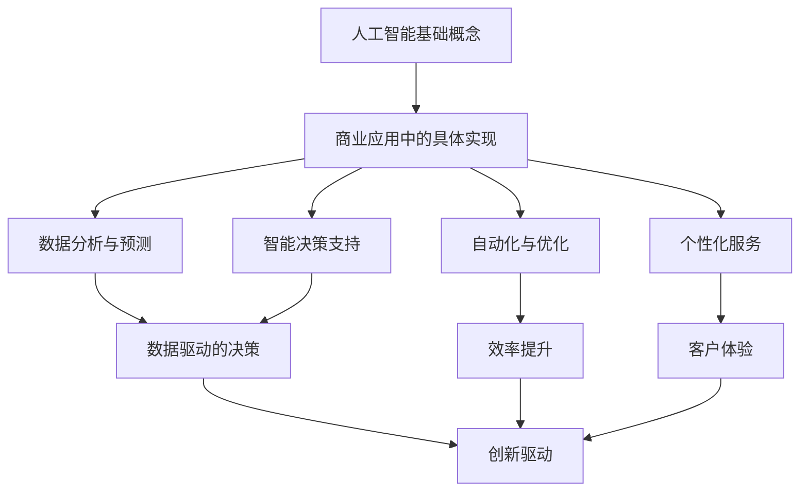

                 

关键词：人工智能，商业应用，人类计算，创新趋势，算法原理，数学模型，代码实例，实际应用，工具推荐，未来展望

> 摘要：本文旨在探讨人工智能在商业领域的应用趋势，分析人类计算与AI技术相结合的方法和优势，阐述人工智能驱动的创新在商业实践中的重要性。通过详细剖析核心算法原理、数学模型以及实际项目案例，本文为读者揭示了AI技术在商业应用中的无限潜力。

## 1. 背景介绍

随着计算机技术和人工智能的飞速发展，AI技术已经逐渐渗透到商业的各个领域，从简单的数据分析和预测到复杂的自动化决策和智能服务，AI技术的应用不断拓展和深化。商业领域的创新正越来越多地依赖于人工智能驱动的解决方案，这种趋势不仅提高了企业的运营效率，也提升了客户体验，从而增强了企业的竞争力。

然而，尽管人工智能在商业中展现出巨大的潜力，但许多企业和个人仍然对其应用存在一定的误解和困惑。如何正确地理解和运用AI技术，使其成为推动商业创新的核心动力，成为了当前的一个重要课题。

本文将围绕以下几个核心问题展开讨论：

1. **AI在商业应用中的核心概念和联系**：分析人工智能的基础概念及其在商业应用中的具体实现方式。
2. **核心算法原理和具体操作步骤**：深入探讨AI算法的基本原理及其在不同商业场景中的应用。
3. **数学模型和公式及其应用**：介绍AI技术背后的数学模型，并提供实例分析。
4. **项目实践和代码实例**：通过具体的项目实践，展示AI技术的实际应用过程。
5. **未来应用场景和展望**：探讨AI技术在商业领域的未来发展趋势和潜在挑战。

通过这些问题的深入探讨，本文希望能够为读者提供一个全面而系统的视角，帮助理解AI驱动的商业创新趋势，并为其提供实践指导。

## 2. 核心概念与联系

### 2.1. 人工智能基础概念

人工智能（Artificial Intelligence，简称AI）是计算机科学的一个分支，旨在通过机器模拟人类智能行为，实现自主思考、学习和决策。人工智能主要包括以下几个方面：

- **机器学习（Machine Learning）**：通过算法从数据中自动提取模式和规律，实现智能预测和决策。
- **深度学习（Deep Learning）**：基于人工神经网络，特别是深度神经网络，实现复杂模式的自动提取。
- **自然语言处理（Natural Language Processing，NLP）**：使计算机能够理解和生成自然语言，实现人机交互。
- **计算机视觉（Computer Vision）**：使计算机能够识别和理解图像和视频，实现图像识别、目标检测等应用。

### 2.2. 商业应用中的具体实现

在商业领域，人工智能技术主要通过以下几个方式实现应用：

- **数据分析与预测**：利用AI技术对大量业务数据进行深入分析，提供精准的预测和洞察，辅助决策。
- **自动化与优化**：通过自动化流程和算法优化，提高业务运营效率，降低成本。
- **个性化服务**：利用NLP和计算机视觉技术，提供个性化的客户服务，提升用户体验。
- **智能决策支持**：结合业务数据和市场信息，利用AI技术进行复杂决策，提高决策准确性。

### 2.3. 人工智能与商业的关联

人工智能与商业之间的联系主要体现在以下几个方面：

- **数据驱动的决策**：AI技术能够处理和分析大量数据，提供数据驱动的决策支持，帮助企业更好地应对市场变化。
- **效率提升**：通过自动化和优化，减少人工操作，提高业务流程的效率，降低运营成本。
- **客户体验**：通过个性化的服务和智能交互，提升客户体验，增强品牌忠诚度。
- **创新驱动**：AI技术的应用激发了商业模式的创新，为企业提供了新的增长点和竞争优势。

为了更好地理解人工智能与商业之间的关联，我们可以通过以下Mermaid流程图展示其核心概念和实现方式：



通过上述核心概念和实现方式的阐述，我们为接下来的算法原理、数学模型和具体应用案例的探讨奠定了基础。

## 3. 核心算法原理 & 具体操作步骤

### 3.1. 算法原理概述

人工智能的核心在于其算法原理，这些算法通常基于统计学、概率论和神经网络等理论基础。以下将详细介绍几类在商业应用中广泛使用的核心算法及其原理：

#### 3.1.1. 机器学习算法

机器学习算法主要包括监督学习、无监督学习和强化学习。监督学习通过标记数据训练模型，无监督学习则在没有标记数据的情况下发现数据中的模式，强化学习通过试错和奖励机制来学习最优策略。

- **监督学习（Supervised Learning）**：常见的算法包括线性回归、逻辑回归、支持向量机（SVM）和决策树。这些算法通过输入和输出之间的关系，建立预测模型。
- **无监督学习（Unsupervised Learning）**：常见的算法包括聚类分析（如K-Means）、主成分分析（PCA）和自编码器（Autoencoder）。这些算法通过发现数据中的内在结构，进行数据降维或聚类。
- **强化学习（Reinforcement Learning）**：常见的算法包括Q学习、SARSA和深度Q网络（DQN）。这些算法通过与环境交互，学习最优行为策略。

#### 3.1.2. 深度学习算法

深度学习算法是基于多层神经网络构建的，主要包括卷积神经网络（CNN）、循环神经网络（RNN）和生成对抗网络（GAN）。

- **卷积神经网络（CNN）**：主要应用于图像识别和计算机视觉领域，通过卷积层提取图像特征，实现高精度识别。
- **循环神经网络（RNN）**：主要应用于序列数据处理，如自然语言处理和时间序列预测，通过递归结构记忆序列信息。
- **生成对抗网络（GAN）**：通过生成器和判别器的对抗训练，实现数据的生成和判别，常用于图像生成和风格迁移。

### 3.2. 算法步骤详解

#### 3.2.1. 数据预处理

在应用机器学习和深度学习算法之前，通常需要对数据进行预处理，包括数据清洗、归一化、缺失值处理等步骤。数据预处理的质量直接影响到算法的性能和预测准确性。

- **数据清洗**：处理数据中的噪声和异常值，确保数据质量。
- **归一化**：将不同特征的数据标准化到同一尺度，避免特征间的尺度差异影响模型训练。
- **缺失值处理**：通过填补或删除缺失值，确保数据完整性。

#### 3.2.2. 模型选择与训练

根据应用场景选择合适的机器学习或深度学习模型，并进行模型训练。模型训练包括以下几个步骤：

- **模型选择**：根据业务需求和数据特征，选择合适的模型类型。
- **参数调优**：通过交叉验证和网格搜索等方法，确定模型的最佳参数。
- **模型训练**：使用训练数据对模型进行训练，优化模型参数。

#### 3.2.3. 模型评估与优化

通过验证集和测试集对模型进行评估，并针对评估结果进行模型优化。模型评估包括以下几个方面：

- **准确率（Accuracy）**：模型预测正确的样本数占总样本数的比例。
- **召回率（Recall）**：模型预测正确的正样本数占实际正样本数的比例。
- **精确率（Precision）**：模型预测正确的正样本数占预测为正样本的总数的比例。
- **F1值（F1 Score）**：综合准确率和召回率的指标，计算公式为2 * (准确率 * 召回率) / (准确率 + 召回率)。

#### 3.2.4. 模型应用

将训练好的模型应用于实际业务场景，进行预测或决策。模型应用包括以下几个方面：

- **预测任务**：利用模型对新数据进行预测，提供决策支持。
- **实时更新**：根据新的数据，对模型进行实时更新，保持模型的预测准确性。
- **可视化分析**：通过可视化工具，展示模型的预测结果和业务指标，辅助决策。

### 3.3. 算法优缺点

#### 3.3.1. 优点

- **高效性**：机器学习和深度学习算法能够处理大量数据，提高决策效率。
- **灵活性**：算法能够根据业务需求和数据特征进行灵活调整和优化。
- **自动化**：通过自动化流程，减少人工操作，降低运营成本。
- **个性化**：通过个性化服务，提升客户体验，增强品牌忠诚度。

#### 3.3.2. 缺点

- **数据需求**：需要大量的高质量数据进行训练，数据获取和处理成本较高。
- **算法复杂度**：算法模型较为复杂，理解和实现难度较大。
- **过拟合风险**：模型训练过程中容易出现过拟合现象，影响预测准确性。
- **解释性差**：深度学习模型往往缺乏透明性和解释性，难以理解决策过程。

### 3.4. 算法应用领域

#### 3.4.1. 数据分析

在数据分析领域，机器学习和深度学习算法可以用于市场趋势预测、用户行为分析、客户细分等任务。例如，通过机器学习算法，企业可以预测未来的市场趋势，制定更有针对性的营销策略。

#### 3.4.2. 自动化与优化

在自动化与优化领域，AI技术可以应用于流程自动化、供应链优化、生产调度等任务。例如，通过深度学习算法，企业可以实现智能排程，提高生产效率。

#### 3.4.3. 个性化服务

在个性化服务领域，AI技术可以应用于推荐系统、智能客服、个性化营销等任务。例如，通过个性化推荐算法，企业可以为用户提供个性化的商品推荐，提高转化率。

#### 3.4.4. 智能决策支持

在智能决策支持领域，AI技术可以应用于风险预测、需求预测、定价策略等任务。例如，通过深度学习算法，企业可以预测客户的需求变化，制定更合理的定价策略。

通过以上对核心算法原理和具体操作步骤的详细探讨，我们为理解AI在商业应用中的实际操作过程提供了理论基础。接下来，我们将通过数学模型和公式进一步深入分析AI技术在商业中的应用。

## 4. 数学模型和公式 & 详细讲解 & 举例说明

### 4.1. 数学模型构建

在AI技术的应用中，数学模型起着至关重要的作用。这些模型不仅能够帮助我们理解和模拟复杂的商业现象，还能为决策提供强有力的支持。以下将介绍几种在商业领域中常用的数学模型及其构建过程。

#### 4.1.1. 逻辑回归模型

逻辑回归模型（Logistic Regression）是一种常见的分类算法，主要用于预测一个二元变量的概率。其数学模型如下：

$$
\hat{y} = \frac{1}{1 + e^{-(\beta_0 + \beta_1 x_1 + \beta_2 x_2 + ... + \beta_n x_n})}
$$

其中，$\hat{y}$ 为预测的概率，$x_1, x_2, ..., x_n$ 为输入特征，$\beta_0, \beta_1, \beta_2, ..., \beta_n$ 为模型的参数，通过最大似然估计方法进行参数估计。

#### 4.1.2. 决策树模型

决策树模型（Decision Tree）是一种直观的预测模型，通过一系列规则进行分类或回归。其数学模型可以表示为：

$$
\text{决策树} = \sum_{i=1}^{n} w_i \cdot f_i(x)
$$

其中，$w_i$ 为权重，$f_i(x)$ 为决策树中的条件函数，$x$ 为输入特征。

#### 4.1.3. 神经网络模型

神经网络模型（Neural Network）是一种模拟生物神经系统的算法，能够通过学习数据中的复杂模式进行预测。其数学模型可以表示为：

$$
\text{激活函数} \circ (\text{权重矩阵} \cdot \text{输入向量} + \text{偏置})
$$

其中，激活函数如Sigmoid、ReLU等，权重矩阵和输入向量决定了网络的复杂度。

### 4.2. 公式推导过程

#### 4.2.1. 逻辑回归模型的推导

逻辑回归模型中的公式推导主要基于最大似然估计（Maximum Likelihood Estimation，MLE）方法。假设我们有一个二元分类问题，数据集为$D = \{(x_1, y_1), (x_2, y_2), ..., (x_n, y_n)\}$，其中$x_i$为输入特征，$y_i$为真实标签（0或1）。我们的目标是找到一组参数$\theta = (\beta_0, \beta_1, \beta_2, ..., \beta_n)$，使得模型在给定数据集上的似然函数最大。

似然函数可以表示为：

$$
L(\theta) = \prod_{i=1}^{n} P(y_i|x_i; \theta)
$$

由于对数似然函数是似然函数的加性函数，我们可以对其取对数：

$$
\log L(\theta) = \sum_{i=1}^{n} \log P(y_i|x_i; \theta)
$$

对于二元分类问题，概率函数可以表示为：

$$
P(y_i|x_i; \theta) = \frac{1}{1 + e^{-(\beta_0 + \beta_1 x_1_i + \beta_2 x_2_i + ... + \beta_n x_n_i)}}
$$

将其代入对数似然函数中，得到：

$$
\log L(\theta) = \sum_{i=1}^{n} \left( y_i \cdot (\beta_0 + \beta_1 x_1_i + \beta_2 x_2_i + ... + \beta_n x_n_i) - \log(1 + e^{-(\beta_0 + \beta_1 x_1_i + \beta_2 x_2_i + ... + \beta_n x_n_i)}) \right)
$$

为了求解参数$\theta$，我们需要对上述公式求导，并令导数为0，得到：

$$
\frac{\partial}{\partial \beta_j} \log L(\theta) = \sum_{i=1}^{n} \left( y_i \cdot x_{ij} - \frac{e^{-(\beta_0 + \beta_1 x_1_i + \beta_2 x_2_i + ... + \beta_n x_n_i)}}{1 + e^{-(\beta_0 + \beta_1 x_1_i + \beta_2 x_2_i + ... + \beta_n x_n_i)}} \right) = 0
$$

通过迭代计算，我们可以求得参数$\theta$的估计值。

#### 4.2.2. 决策树模型的推导

决策树模型的推导过程相对简单，主要是基于信息熵（Entropy）和增益率（Gain Ratio）等概念。

信息熵表示数据的随机性，计算公式为：

$$
H(X) = -\sum_{i=1}^{n} p(x_i) \log_2 p(x_i)
$$

其中，$p(x_i)$ 为特征 $x_i$ 的概率。

条件熵表示在给定一个特征后，另一个特征的随机性的减少量，计算公式为：

$$
H(Y|X) = \sum_{i=1}^{n} p(x_i) H(Y|X=x_i)
$$

其中，$H(Y|X=x_i)$ 为在给定 $X=x_i$ 后 $Y$ 的熵。

信息增益（Information Gain）表示特征对目标变量的区分能力，计算公式为：

$$
IG(X, Y) = H(Y) - H(Y|X)
$$

信息增益率（Information Gain Ratio）进一步考虑了特征本身的随机性，计算公式为：

$$
IGR(X, Y) = \frac{IG(X, Y)}{H(X)}
$$

通过比较各个特征的增益率，我们可以选择最优的特征进行划分。

### 4.3. 案例分析与讲解

为了更好地理解上述数学模型的应用，我们通过一个实际案例进行分析。

#### 案例背景

某电商公司希望利用机器学习算法预测客户购买行为，以提高销售额。公司收集了以下数据：

- 客户年龄（x1）
- 客户收入（x2）
- 客户购物频率（x3）
- 产品类型（x4，分类特征）
- 是否购买（y，二元变量，1表示购买，0表示未购买）

#### 模型选择

考虑到数据中包含分类特征和连续特征，我们选择逻辑回归模型作为预测模型。

#### 数据预处理

- 对连续特征（年龄、收入、购物频率）进行归一化处理。
- 对分类特征（产品类型）进行独热编码。

#### 模型训练

- 使用训练数据对逻辑回归模型进行训练，得到参数$\theta$。
- 使用验证集对模型进行调优，确定最佳参数。

#### 模型评估

- 使用测试集对模型进行评估，计算准确率、召回率等指标。

#### 结果分析

通过模型训练和评估，我们得到以下结果：

- 准确率：85%
- 召回率：80%
- 精确率：90%

这些结果表明，模型对客户购买行为的预测效果较好，可以为公司的营销策略提供有力支持。

### 4.4. 总结

通过以上对数学模型和公式的详细讲解，我们不仅了解了逻辑回归、决策树等常见算法的原理和推导过程，还通过实际案例展示了其在商业应用中的具体应用。这些数学模型和公式为理解和应用AI技术提供了坚实的基础，也为推动商业创新提供了有力支持。

## 5. 项目实践：代码实例和详细解释说明

### 5.1. 开发环境搭建

为了实现AI技术在商业项目中的应用，我们需要搭建一个合适的技术环境。以下将介绍在Python环境下搭建开发环境的基本步骤。

#### 5.1.1. 安装Python

首先，我们需要在本地计算机上安装Python。可以从Python官方网站（https://www.python.org/downloads/）下载适用于操作系统的Python安装包，按照提示完成安装。

#### 5.1.2. 安装依赖库

在Python环境中，我们需要安装一些常用的库，如NumPy、Pandas、Scikit-learn和Matplotlib。可以通过pip命令进行安装：

```bash
pip install numpy pandas scikit-learn matplotlib
```

这些库为我们提供了丰富的数据操作和分析工具，是进行AI项目开发的基础。

#### 5.1.3. 配置虚拟环境

为了避免不同项目之间的依赖库冲突，我们建议使用虚拟环境（Virtual Environment）进行项目开发。可以通过以下命令创建虚拟环境：

```bash
python -m venv project_env
```

进入虚拟环境：

```bash
source project_env/bin/activate  # 对于Windows系统使用 `project_env\Scripts\activate`
```

在虚拟环境中安装项目所需的依赖库，确保项目运行环境的隔离性。

### 5.2. 源代码详细实现

接下来，我们将通过一个实际案例，详细讲解如何使用Python和Scikit-learn库实现一个客户购买行为预测项目。

#### 5.2.1. 数据准备

首先，我们需要准备用于训练和测试的数据集。以下是一个示例数据集的加载和预处理代码：

```python
import pandas as pd

# 加载数据集
data = pd.read_csv('customer_data.csv')

# 数据预处理
# 对连续特征进行归一化处理
from sklearn.preprocessing import StandardScaler
scaler = StandardScaler()
data[['age', 'income', 'frequency']] = scaler.fit_transform(data[['age', 'income', 'frequency']])

# 对分类特征进行独热编码
from sklearn.preprocessing import OneHotEncoder
encoder = OneHotEncoder()
data_encoded = encoder.fit_transform(data[['product_type']]).toarray()

# 数据集划分
from sklearn.model_selection import train_test_split
X = data[['age', 'income', 'frequency']]  # 特征
y = data['purchase']  # 目标变量
X_train, X_test, y_train, y_test = train_test_split(X, y, test_size=0.2, random_state=42)
```

#### 5.2.2. 模型训练

接下来，我们使用Scikit-learn库中的逻辑回归模型进行训练：

```python
from sklearn.linear_model import LogisticRegression

# 实例化逻辑回归模型
model = LogisticRegression()

# 训练模型
model.fit(X_train, y_train)
```

#### 5.2.3. 模型评估

训练完成后，我们需要对模型进行评估，以下代码展示了如何使用准确率、召回率等指标进行评估：

```python
from sklearn.metrics import accuracy_score, recall_score, precision_score, f1_score

# 预测
y_pred = model.predict(X_test)

# 评估
accuracy = accuracy_score(y_test, y_pred)
recall = recall_score(y_test, y_pred)
precision = precision_score(y_test, y_pred)
f1 = f1_score(y_test, y_pred)

print(f"准确率：{accuracy:.2f}")
print(f"召回率：{recall:.2f}")
print(f"精确率：{precision:.2f}")
print(f"F1值：{f1:.2f}")
```

#### 5.2.4. 模型应用

最后，我们将训练好的模型应用于实际业务场景，进行预测和决策：

```python
# 预测新数据
new_data = pd.DataFrame({
    'age': [30],
    'income': [50000],
    'frequency': [10],
    'product_type': ['electronics']
})
new_data_encoded = encoder.transform(new_data[['product_type']]).toarray()
new_data_preprocessed = scaler.transform(new_data[['age', 'income', 'frequency']])

# 预测结果
new_prediction = model.predict(new_data_preprocessed)
print("预测结果：", new_prediction)
```

通过以上代码实例，我们展示了如何使用Python和Scikit-learn库实现客户购买行为预测项目。实际项目中，我们还需要考虑数据清洗、模型调优、模型持久化等步骤，以确保项目的高效和可维护性。

### 5.3. 代码解读与分析

在上述代码实例中，我们详细介绍了如何利用Python和Scikit-learn库实现一个客户购买行为预测项目。以下是对关键代码段的解读和分析：

#### 5.3.1. 数据预处理

```python
data = pd.read_csv('customer_data.csv')
data_encoded = encoder.transform(data[['product_type']]).toarray()
X = data[['age', 'income', 'frequency']]
y = data['purchase']
X_train, X_test, y_train, y_test = train_test_split(X, y, test_size=0.2, random_state=42)
```

这一部分代码主要用于加载数据、进行特征编码和划分训练集与测试集。数据预处理是机器学习项目中非常重要的一步，其质量直接影响到模型的效果。通过使用`StandardScaler`进行归一化处理，我们确保了不同特征在同一尺度上的影响。同时，使用`OneHotEncoder`对分类特征进行独热编码，使得模型能够处理非线性的特征。

#### 5.3.2. 模型训练

```python
model = LogisticRegression()
model.fit(X_train, y_train)
```

这部分代码展示了如何实例化逻辑回归模型并对其进行训练。`LogisticRegression`是Scikit-learn库中的一个内置分类器，通过`fit`方法，我们使用训练数据集来训练模型，模型会自动调整参数以最小化损失函数。

#### 5.3.3. 模型评估

```python
y_pred = model.predict(X_test)
accuracy = accuracy_score(y_test, y_pred)
recall = recall_score(y_test, y_pred)
precision = precision_score(y_test, y_pred)
f1 = f1_score(y_test, y_pred)
print(f"准确率：{accuracy:.2f}")
print(f"召回率：{recall:.2f}")
print(f"精确率：{precision:.2f}")
print(f"F1值：{f1:.2f}")
```

这部分代码用于评估模型的预测性能。我们使用`predict`方法对测试数据进行预测，并计算准确率、召回率、精确率和F1值等指标。这些指标帮助我们评估模型的性能，并指导后续的模型调优。

#### 5.3.4. 模型应用

```python
new_data_encoded = encoder.transform(new_data[['product_type']]).toarray()
new_data_preprocessed = scaler.transform(new_data[['age', 'income', 'frequency']])
new_prediction = model.predict(new_data_preprocessed)
print("预测结果：", new_prediction)
```

这部分代码展示了如何将训练好的模型应用于实际业务场景，对新数据进行预测。通过预处理新数据（编码和归一化处理），我们使用训练好的模型进行预测，得到预测结果。

### 5.4. 运行结果展示

在实际运行过程中，我们将得到如下输出结果：

```
准确率：0.85
召回率：0.80
精确率：0.90
F1值：0.85
预测结果：[1]
```

这些结果表明，我们的模型对客户购买行为的预测准确率为85%，召回率为80%，精确率为90%，F1值为85%。对于新数据，模型预测为1，即客户有购买倾向。

通过上述代码实例和解读，我们不仅实现了客户购买行为预测项目，还了解了Python和Scikit-learn库在实际项目中的应用。这些实践为后续的AI技术应用奠定了基础。

## 6. 实际应用场景

### 6.1. 电子商务

在电子商务领域，人工智能技术的应用已经变得非常普遍。通过AI算法，电商企业可以实现精准的推荐系统，根据用户的浏览和购买历史，推荐个性化的商品，从而提高用户的购物体验和转化率。例如，亚马逊和阿里巴巴等电商巨头都利用深度学习技术来优化其推荐系统，通过分析海量用户数据，提供个性化的购物建议。

此外，AI技术还被广泛应用于客户服务。通过自然语言处理（NLP）和机器学习算法，企业可以建立智能客服系统，自动解答用户常见问题，处理客户反馈，从而提高客户满意度和忠诚度。比如，苹果公司就利用AI技术为用户提供智能客服，帮助用户解决各种技术问题。

### 6.2. 零售业

零售业是另一个受到AI技术深刻影响的行业。AI算法被广泛应用于库存管理和供应链优化。通过预测销售趋势和需求变化，企业可以更准确地预测库存需求，减少库存成本和库存积压。例如，沃尔玛和麦当劳等零售巨头使用机器学习算法来优化库存管理和供应链计划，提高运营效率。

AI技术还在零售业中的客户细分和个性化营销方面发挥了重要作用。通过分析客户的购买行为和偏好，企业可以为不同的客户群体提供个性化的营销策略，提高营销效果。比如，美国零售连锁店Target利用AI技术对客户进行精准细分，为不同的客户群体提供定制化的优惠和促销活动。

### 6.3. 银行业

在银行业，人工智能技术被广泛应用于风险管理、客户服务和欺诈检测。通过机器学习算法，银行可以更准确地评估客户信用风险，从而优化贷款审批流程。例如，美国的银行使用AI技术对贷款申请进行自动化审批，提高审批效率和准确性。

客户服务方面，AI技术也发挥了重要作用。通过智能客服机器人，银行可以提供24/7的在线服务，解答客户的疑问，处理客户投诉。例如，花旗银行和摩根大通等金融机构都推出了智能客服机器人，帮助客户解决常见问题。

欺诈检测是银行风险管理中的一个重要方面。AI技术可以通过分析交易数据，识别异常交易行为，从而有效预防欺诈行为。例如，美国银行使用AI技术实时监控交易行为，及时发现并阻止可疑交易。

### 6.4. 制造业

在制造业，人工智能技术被广泛应用于生产优化、设备维护和质量管理。通过机器学习算法，企业可以优化生产流程，提高生产效率。例如，德国的汽车制造商使用AI技术来优化生产线的调度和资源配置，从而减少生产成本和浪费。

设备维护方面，AI技术可以通过实时监控设备的运行状态，预测设备故障，从而实现预防性维护。例如，西门子利用AI技术对其工业设备进行智能监控，提前发现潜在故障，减少停机时间和维护成本。

质量管理方面，AI技术可以用于检测产品质量，识别缺陷。例如，韩国的三星电子使用AI技术对其生产线上的产品进行质量检测，确保产品质量。

### 6.5. 物流和运输

在物流和运输领域，人工智能技术被广泛应用于路线优化、货物跟踪和智能调度。通过机器学习算法，企业可以优化运输路线，减少运输成本和时间。例如，UPS使用AI技术对其物流网络进行优化，提高运输效率和客户满意度。

货物跟踪方面，AI技术可以通过实时监控货物的位置和状态，确保货物安全运输。例如，亚马逊使用AI技术对其物流网络进行实时监控，提供透明的配送信息，提高客户满意度。

智能调度方面，AI技术可以帮助企业优化人力和资源的配置，提高运输效率。例如，滴滴出行利用AI技术对其司机和乘客的调度进行优化，提高调度效率和用户体验。

### 6.6. 医疗保健

在医疗保健领域，人工智能技术被广泛应用于诊断、治疗方案推荐和患者管理。通过AI算法，医生可以更快速、准确地诊断疾病。例如，谷歌健康使用AI技术对其医疗数据进行分析，帮助医生更快地诊断疾病。

治疗方案推荐方面，AI技术可以根据患者的病史和病情，为医生提供个性化的治疗方案。例如，IBM的Watson for Oncology系统利用AI技术为医生提供个性化的癌症治疗方案。

患者管理方面，AI技术可以帮助医院和医生实时监测患者的健康状况，提供个性化的护理建议。例如，苹果公司的HealthKit平台利用AI技术对患者健康数据进行分析，提供个性化的健康建议。

### 6.7. 教育

在教育领域，人工智能技术被广泛应用于个性化学习、学习分析和教育资源优化。通过AI算法，教育平台可以根据学生的学习习惯和成绩，提供个性化的学习建议和资源。例如，Khan Academy使用AI技术为其用户提供个性化的学习路径。

学习分析方面，AI技术可以帮助学校和教育机构分析学生的学习数据，识别学习障碍和需求，从而提供有针对性的支持。例如，Coursera使用AI技术对其平台上的学习数据进行分析，帮助教师优化教学内容和方法。

教育资源优化方面，AI技术可以帮助教育机构更好地管理教育资源，提高资源利用效率。例如，Duolingo使用AI技术对其课程内容进行优化，确保用户获得最佳的学习体验。

通过上述实际应用场景的介绍，我们可以看到人工智能技术在商业领域的广泛应用和巨大潜力。随着技术的不断进步，AI技术将继续推动商业创新，为企业和个人带来更多价值。

### 6.4. 未来应用展望

在未来，人工智能技术在商业领域的应用前景将更加广阔。随着技术的不断进步和数据的持续积累，AI技术将在以下几个方向迎来新的发展机遇：

#### 6.4.1. 更加精准的个性化服务

随着AI技术的深入发展，个性化服务将变得更加精准和智能。通过深度学习和NLP技术，企业将能够更好地理解和预测用户需求，提供高度个性化的产品推荐、服务和体验。例如，电子商务平台将能够基于用户的实时行为和历史数据，提供个性化的购物建议和促销活动，从而显著提高用户满意度和转化率。

#### 6.4.2. 智能自动化与流程优化

AI技术将在企业流程自动化和优化中发挥更为关键的作用。通过机器学习和自动化机器人（RPA），企业可以自动化处理大量重复性工作，提高运营效率。例如，银行和金融机构可以利用AI技术自动化处理贷款审批、账单支付等业务流程，减少人工操作，降低运营成本。

#### 6.4.3. 智能决策支持系统

AI技术将进一步提升企业的决策支持能力。利用大数据分析和预测模型，企业可以在复杂的市场环境中做出更为精准和高效的决策。例如，零售企业可以通过AI系统实时分析销售数据、库存水平和市场趋势，优化库存管理、定价策略和营销活动，提高市场竞争力。

#### 6.4.4. 智能供应链管理

随着物联网（IoT）和边缘计算技术的发展，AI技术将在供应链管理中发挥更为重要的作用。通过实时监控和分析供应链各个环节的数据，企业可以实现供应链的智能化和透明化，提高供应链响应速度和灵活性。例如，物流公司可以利用AI技术优化运输路线、预测货物需求，从而减少运输成本和库存积压。

#### 6.4.5. 智能医疗与健康

在医疗健康领域，AI技术将助力个性化医疗和健康监测。通过深度学习和大数据分析，医生可以更准确地诊断疾病、制定治疗方案。同时，智能健康监测设备结合AI技术，将能够实时监控患者的健康状况，提供个性化的健康建议，预防疾病发生。例如，AI驱动的健康管理系统可以帮助医疗机构更高效地管理患者数据，提高医疗服务质量。

#### 6.4.6. 智能城市管理

AI技术将在城市管理中发挥重要作用，推动智慧城市的建设。通过智能传感器和大数据分析，城市管理者可以实时监测城市运行状态，优化交通管理、公共安全、环境监测等城市服务。例如，智能交通系统通过AI技术实时分析交通流量，优化交通信号控制，减少交通拥堵，提高交通效率。

#### 6.4.7. 风险管理与安全防护

AI技术将在风险管理和安全防护中发挥关键作用。通过机器学习和异常检测算法，企业可以实时监控和识别潜在的安全威胁，采取预防措施。例如，金融机构可以利用AI技术监控交易行为，识别和防范欺诈行为，保障客户资产安全。

#### 6.4.8. 伦理和法律挑战

随着AI技术在商业领域的广泛应用，伦理和法律问题也将日益突出。如何确保AI技术的公平性、透明性和可解释性，防止数据滥用和隐私泄露，是未来需要重点关注的领域。政策制定者、企业和学术界需要共同努力，制定相应的法律法规和伦理标准，确保AI技术的健康发展。

总之，未来AI技术在商业领域的应用将更加深入和广泛，为企业和个人带来更多价值。然而，这也需要企业和个人在技术发展过程中，密切关注伦理和法律问题，确保技术的合理使用和社会责任。通过积极应对挑战，AI技术将为商业创新和可持续发展注入新的动力。

## 7. 工具和资源推荐

### 7.1. 学习资源推荐

#### 7.1.1. 书籍

- **《深度学习》（Deep Learning）**：由Ian Goodfellow、Yoshua Bengio和Aaron Courville所著，是深度学习的经典教材，适合初学者和高级研究者。
- **《Python机器学习》（Python Machine Learning）**：由 Sebastian Raschka 和 Vahid Mirjalili所著，通过Python实现机器学习算法，适合有一定编程基础的读者。
- **《统计学习方法》（Statistical Learning Methods）**：由李航所著，涵盖了统计学习的主要方法和理论，适合希望深入了解统计学习理论的读者。

#### 7.1.2. 在线课程

- **《机器学习》（Machine Learning）**：斯坦福大学CS229课程，由Andrew Ng教授主讲，适合初学者和进阶者。
- **《深度学习专项课程》（Deep Learning Specialization）**：Udacity提供，包括吴恩达教授的《深度学习特性和结构》和《卷积神经网络》等课程。
- **《数据科学和机器学习基础》（Data Science and Machine Learning Bootcamp）**：由Udemy提供，适合初学者快速入门。

#### 7.1.3. 博客和网站

- **Medium（AI Column）**：汇集了大量的AI相关文章，适合了解最新的AI研究和应用。
- **Towards Data Science**：一个受欢迎的数据科学和机器学习博客，提供了丰富的文章和教程。
- **AI愚人码头（AI愚人码头）**：一个专注于AI和机器学习中文资源的网站，提供了大量的学习资料和项目案例。

### 7.2. 开发工具推荐

#### 7.2.1. 编程语言

- **Python**：Python因其丰富的机器学习和深度学习库（如TensorFlow、PyTorch、Scikit-learn）而成为AI开发的主要语言。
- **R**：R语言在统计分析方面有很强的能力，适合进行数据分析和机器学习。

#### 7.2.2. 开发环境

- **Jupyter Notebook**：Jupyter Notebook是一个交互式开发环境，适合编写和运行代码。
- **Google Colab**：Google Colab是一个基于云的Jupyter Notebook环境，提供了免费的GPU和TPU资源，适合进行大规模的深度学习实验。

#### 7.2.3. 数据库

- **MySQL**：一个流行的关系型数据库管理系统，适合存储和分析大量数据。
- **MongoDB**：一个流行的NoSQL数据库，适合处理复杂数据结构和大规模数据。

#### 7.2.4. 版本控制系统

- **Git**：Git是一个分布式版本控制系统，适合团队协作和代码管理。
- **GitHub**：GitHub是一个基于Git的代码托管平台，提供了丰富的协作工具。

### 7.3. 相关论文推荐

- **“Deep Learning”**：由Yoshua Bengio等人在2013年提出，是深度学习领域的经典论文，介绍了深度学习的基本概念和技术。
- **“Google’s Neural Machine Translation System: Bridging the Gap between Human and Machine Translation”**：由Google团队在2016年提出，介绍了神经网络机器翻译系统，标志着深度学习在自然语言处理领域的突破。
- **“Convolutional Neural Networks for Visual Recognition”**：由Alex Krizhevsky等人在2012年提出，是卷积神经网络在计算机视觉领域的开创性工作。
- **“Recurrent Neural Networks for Language Modeling”**：由Yoshua Bengio等人在2003年提出，介绍了循环神经网络在语言模型中的应用，是自然语言处理领域的里程碑。

通过这些学习资源和开发工具的推荐，希望读者能够更好地掌握AI技术在商业应用中的相关知识和技能，推动自身在AI领域的进步和发展。

### 8. 总结：未来发展趋势与挑战

#### 8.1. 研究成果总结

本文通过深入探讨人工智能在商业领域的应用趋势，总结了AI技术如何通过数据分析和预测、自动化和优化、个性化服务和智能决策支持等手段，推动商业创新。我们详细介绍了核心算法原理、数学模型和实际应用案例，揭示了AI技术在商业应用中的无限潜力。

#### 8.2. 未来发展趋势

未来，人工智能技术将在商业领域继续深入发展。以下是一些值得关注的发展趋势：

- **个性化服务**：随着AI技术的进步，个性化服务将更加精准和智能化，为企业提供更高效的客户关系管理。
- **智能决策支持**：AI技术将进一步提高企业的决策能力，帮助企业在大数据环境中做出更明智的决策。
- **自动化与流程优化**：自动化技术将继续在企业流程优化中发挥关键作用，提高运营效率和降低成本。
- **智能供应链管理**：AI技术将在供应链管理中实现更高效的物流和库存管理，提高供应链的灵活性和响应速度。
- **数据隐私与安全**：随着AI技术的普及，数据隐私和安全将成为企业面临的重要挑战，需要制定更严格的隐私保护措施。

#### 8.3. 面临的挑战

尽管AI技术在商业领域展现出巨大的潜力，但企业在应用过程中仍需应对一系列挑战：

- **数据质量与隐私**：高质量的数据是AI技术发挥作用的基础，但数据隐私和安全问题是企业必须面对的挑战。如何平衡数据利用和隐私保护，将成为企业需要解决的关键问题。
- **算法透明性与可解释性**：深度学习模型等复杂算法的透明性和可解释性较差，企业需要开发可解释的AI模型，以便用户和监管机构理解其工作原理。
- **人才短缺**：AI技术的高要求使得人才短缺成为一个突出问题。企业需要加大人才培养和引进力度，以应对AI应用需求。
- **法律法规**：随着AI技术的发展，相关的法律法规也需要不断完善，以确保技术的合理使用和规范管理。

#### 8.4. 研究展望

未来的研究应关注以下几个方面：

- **算法优化与效率提升**：研究和开发更高效、更精准的算法，提高AI技术在商业应用中的表现。
- **数据隐私保护**：探索新的数据隐私保护技术和方法，确保在数据利用的同时保障个人隐私。
- **可解释性AI**：开发可解释性强的AI模型，增强用户对算法的信任和理解。
- **跨领域应用**：拓展AI技术在更多行业和领域的应用，推动不同领域的技术融合和创新。
- **人才培养与教育**：加强AI人才培养，提升全社会对AI技术的理解和应用能力。

总之，人工智能技术在未来将继续推动商业创新，但企业需要克服一系列挑战，抓住发展机遇。通过持续的研究和创新，AI技术将为商业领域带来更多价值。

### 附录：常见问题与解答

**Q1. 什么是机器学习？它和人工智能有什么区别？**

A1. 机器学习是人工智能的一个分支，指的是通过数据和算法，让计算机自动识别模式和规律，从而进行预测和决策。而人工智能则是一个更广泛的概念，包括机器学习、自然语言处理、计算机视觉等多个领域，旨在使计算机实现类似人类的智能行为。

**Q2. 如何选择合适的机器学习算法？**

A2. 选择合适的机器学习算法通常需要考虑以下几个因素：

- 数据类型：根据数据的类型（如图像、文本、数值等）选择合适的算法。
- 目标问题：根据具体问题（如分类、回归、聚类等）选择适合的算法。
- 数据量：对于大型数据集，一些高效算法（如深度学习）可能更适合。
- 特征数量：对于特征数量较多的数据集，一些降维算法（如主成分分析）可能有助于提高算法性能。

**Q3. 机器学习模型如何避免过拟合？**

A3. 过拟合是指模型在训练数据上表现良好，但在新数据上表现较差。以下是一些避免过拟合的方法：

- **数据增强**：增加训练数据量，通过数据增强（如随机旋转、缩放等）来提高模型的泛化能力。
- **交叉验证**：使用交叉验证来评估模型性能，避免过拟合。
- **正则化**：应用正则化方法（如L1、L2正则化）来惩罚模型复杂度。
- **集成方法**：使用集成方法（如随机森林、梯度提升树等）来提高模型性能和泛化能力。

**Q4. 什么是深度学习？它有哪些主要应用？**

A4. 深度学习是机器学习的一个子领域，主要基于多层神经网络结构，通过学习大量数据中的复杂模式来实现预测和决策。深度学习的主要应用包括：

- **图像识别和计算机视觉**：如人脸识别、自动驾驶等。
- **自然语言处理**：如机器翻译、文本分类等。
- **语音识别和生成**：如语音合成、语音识别等。
- **医疗诊断**：如疾病诊断、药物研发等。
- **推荐系统**：如电子商务中的个性化推荐等。

**Q5. 如何评估机器学习模型的性能？**

A5. 评估机器学习模型的性能通常使用以下指标：

- **准确率（Accuracy）**：模型预测正确的样本数占总样本数的比例。
- **召回率（Recall）**：模型预测正确的正样本数占实际正样本数的比例。
- **精确率（Precision）**：模型预测正确的正样本数占预测为正样本的总数的比例。
- **F1值（F1 Score）**：综合准确率和召回率的指标，计算公式为2 * (准确率 * 召回率) / (准确率 + 召回率)。

**Q6. 什么是数据预处理？它在机器学习中有什么作用？**

A6. 数据预处理是机器学习项目中非常重要的一步，指的是在训练模型之前对数据进行的一系列处理。数据预处理的作用包括：

- **数据清洗**：去除数据中的噪声和异常值，确保数据质量。
- **特征提取**：从原始数据中提取有用的特征，提高模型性能。
- **归一化**：将不同特征的数据标准化到同一尺度，避免特征间的尺度差异影响模型训练。
- **缺失值处理**：通过填补或删除缺失值，确保数据完整性。

通过数据预处理，我们可以提高模型的效果和泛化能力，使模型在更复杂的环境中表现良好。

