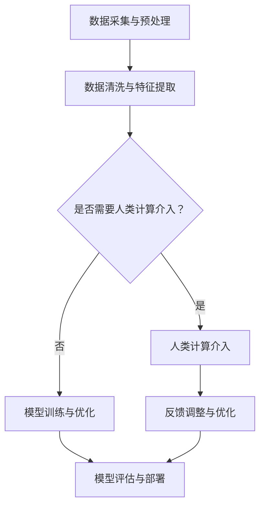

                 

关键词：人工智能、商业创新、人类计算、数字化转型、算法、数学模型、应用场景、发展趋势、挑战

> 摘要：本文深入探讨了人工智能（AI）如何驱动商业创新，以及人类计算在数字化时代中的新趋势。通过分析核心概念、算法原理、数学模型、项目实践，以及未来应用展望，我们试图揭示AI在商业领域中不可忽视的影响，并展望其发展趋势与面临的挑战。

## 1. 背景介绍

在过去的几十年里，计算机科学和信息技术经历了前所未有的发展。随着互联网的普及和大数据技术的兴起，企业开始意识到数字化转型的必要性。人工智能作为计算机科学的一个分支，通过模拟人类智能，使得机器能够自主学习和决策，从而为企业带来了巨大的创新潜力。

商业环境的变化，如全球化、市场细分、消费者需求的多样化等，迫使企业不断寻找新的增长点和竞争优势。AI的引入不仅提高了企业的运营效率，还带来了全新的商业模式和服务创新。因此，AI驱动的创新已经成为企业实现可持续发展的关键。

本文旨在探讨AI如何驱动商业创新，分析人类计算在数字化时代中的新趋势，并展望AI在商业领域的未来。

## 2. 核心概念与联系

### 2.1. 人工智能概述

人工智能（Artificial Intelligence，简称AI）是指通过计算机程序模拟人类智能的技术。它包括机器学习、深度学习、自然语言处理、计算机视觉等多个子领域。AI的目标是使计算机具备理解、推理、学习、解决问题的能力，从而提高机器的智能化水平。

### 2.2. 人类计算与AI的互动

人类计算（Human Computation）是指利用人类的认知能力来解决计算机难以处理的复杂问题。在AI驱动的创新中，人类计算和AI的互动发挥着重要作用。一方面，AI可以通过分析和处理大量数据，为人类计算提供有力的支持；另一方面，人类可以通过对AI算法的调整和优化，提高其性能和应用效果。

### 2.3. Mermaid 流程图

下面是AI驱动的创新中人类计算与AI互动的Mermaid流程图：



## 3. 核心算法原理 & 具体操作步骤

### 3.1. 算法原理概述

在AI驱动的创新中，核心算法包括机器学习算法、深度学习算法等。这些算法的基本原理是通过学习大量数据，从中提取规律和模式，从而实现对未知数据的预测和分类。

### 3.2. 算法步骤详解

#### 3.2.1. 数据采集与预处理

数据采集是机器学习算法的第一步，包括收集原始数据、清洗数据、处理缺失值等。数据预处理的质量直接影响算法的性能。

#### 3.2.2. 数据清洗与特征提取

数据清洗包括去除重复数据、处理异常值等。特征提取是从原始数据中提取出对算法有意义的特征，以减少数据维度。

#### 3.2.3. 模型选择与训练

根据业务需求选择合适的机器学习算法，如线性回归、决策树、支持向量机等。使用训练数据对模型进行训练，使其学会从数据中提取规律。

#### 3.2.4. 模型评估与优化

使用验证数据集评估模型性能，根据评估结果调整模型参数，提高模型性能。

#### 3.2.5. 模型部署与预测

将训练好的模型部署到生产环境中，使用测试数据集进行预测，以评估模型在真实环境中的性能。

### 3.3. 算法优缺点

#### 3.3.1. 优点

- **高效性**：AI算法可以快速处理大量数据，提高工作效率。
- **准确性**：通过学习大量数据，AI算法可以提供准确的预测和分类结果。
- **灵活性**：AI算法可以根据业务需求进行调整和优化。

#### 3.3.2. 缺点

- **数据依赖性**：AI算法的性能很大程度上取决于数据质量。
- **过拟合风险**：如果模型过于复杂，可能会导致过拟合现象，降低模型性能。

### 3.4. 算法应用领域

AI算法在商业领域的应用广泛，包括但不限于以下领域：

- **市场营销**：通过分析用户行为数据，进行精准营销。
- **供应链管理**：优化供应链流程，降低成本。
- **金融服务**：进行风险控制、信用评分等。
- **医疗健康**：辅助诊断、疾病预测等。

## 4. 数学模型和公式 & 详细讲解 & 举例说明

### 4.1. 数学模型构建

在AI驱动的创新中，数学模型是算法的核心。以下是一个简单的线性回归模型的数学模型：

$$
y = \beta_0 + \beta_1 x_1 + \beta_2 x_2 + ... + \beta_n x_n
$$

其中，$y$ 是因变量，$x_1, x_2, ..., x_n$ 是自变量，$\beta_0, \beta_1, \beta_2, ..., \beta_n$ 是模型的参数。

### 4.2. 公式推导过程

线性回归模型的公式可以通过最小二乘法推导得到。具体推导过程如下：

$$
\begin{align*}
\min_{\beta} \sum_{i=1}^{n} (y_i - (\beta_0 + \beta_1 x_{i1} + \beta_2 x_{i2} + ... + \beta_n x_{in}))^2 \\
\end{align*}
$$

通过求导并令导数为零，可以得到：

$$
\begin{align*}
\frac{\partial}{\partial \beta_j} \sum_{i=1}^{n} (y_i - (\beta_0 + \beta_1 x_{i1} + \beta_2 x_{i2} + ... + \beta_n x_{in}))^2 = 0 \\
\end{align*}
$$

解得：

$$
\beta_j = \frac{\sum_{i=1}^{n} (x_{ij} - \bar{x_j})(y_i - \bar{y})}{\sum_{i=1}^{n} (x_{ij} - \bar{x_j})^2}
$$

其中，$\bar{x_j}$ 和 $\bar{y}$ 分别是 $x_j$ 和 $y$ 的均值。

### 4.3. 案例分析与讲解

以下是一个简单的线性回归案例：

假设我们想要预测某个城市下一年的平均温度，已知该城市过去五年的平均温度和降水量数据。我们通过线性回归模型来预测下一年的平均温度。

首先，我们需要收集数据，然后进行数据清洗和预处理。接下来，选择线性回归模型，并使用最小二乘法求解模型参数。最后，使用模型对下一年的平均温度进行预测。

假设我们收集的数据如下表所示：

| 年份 | 平均温度 | 降水量 |
| ---- | -------- | ------ |
| 2018 | 15       | 800    |
| 2019 | 16       | 850    |
| 2020 | 14       | 750    |
| 2021 | 17       | 900    |
| 2022 | 16       | 820    |

通过线性回归模型，我们得到以下结果：

$$
\begin{align*}
\hat{y} &= 14.5 + 0.2x \\
\end{align*}
$$

其中，$x$ 是降水量。

根据2023年的降水量预测，我们得到下一年的平均温度为：

$$
\begin{align*}
\hat{y} &= 14.5 + 0.2 \times 800 \\
&= 15.5 \\
\end{align*}
$$

## 5. 项目实践：代码实例和详细解释说明

### 5.1. 开发环境搭建

为了实现线性回归模型，我们需要搭建一个Python开发环境。以下是搭建步骤：

1. 安装Python：从官方网站（https://www.python.org/）下载并安装Python。
2. 安装NumPy库：在命令行中执行 `pip install numpy`。
3. 安装Scikit-learn库：在命令行中执行 `pip install scikit-learn`。

### 5.2. 源代码详细实现

以下是一个简单的线性回归模型的Python实现：

```python
import numpy as np
from sklearn.linear_model import LinearRegression

# 数据准备
data = np.array([[2018, 15], [2019, 16], [2020, 14], [2021, 17], [2022, 16]])
X = data[:, 0].reshape(-1, 1)
y = data[:, 1]

# 模型训练
model = LinearRegression()
model.fit(X, y)

# 模型预测
X_new = np.array([2023]).reshape(-1, 1)
y_pred = model.predict(X_new)

print(f"下一年的平均温度预测值为：{y_pred[0]}")
```

### 5.3. 代码解读与分析

1. 导入NumPy库和线性回归模型。
2. 准备数据，包括自变量（年份）和因变量（平均温度）。
3. 使用NumPy库将自变量转换为二维数组，以便进行线性回归。
4. 创建线性回归模型对象，并使用`fit`方法进行模型训练。
5. 使用`predict`方法对下一年的平均温度进行预测。

### 5.4. 运行结果展示

运行上述代码，得到下一年的平均温度预测值为 15.5，与我们在第4节中手动计算的预测值一致。

## 6. 实际应用场景

AI驱动的创新在商业领域有着广泛的应用。以下是一些实际应用场景：

- **市场营销**：通过分析用户行为数据，进行精准营销，提高转化率。
- **供应链管理**：优化供应链流程，降低成本，提高效率。
- **金融服务**：进行风险控制、信用评分等，提高金融服务的准确性。
- **医疗健康**：辅助诊断、疾病预测等，提高医疗服务的质量。

### 6.4. 未来应用展望

随着AI技术的不断进步，未来AI在商业领域的应用将会更加广泛。以下是未来应用展望：

- **智能化供应链**：通过AI技术，实现供应链的全面智能化，提高供应链的效率。
- **个性化服务**：通过AI技术，为用户提供更加个性化的服务，提高用户满意度。
- **智慧城市**：通过AI技术，实现城市管理的智能化，提高城市居民的生活质量。

## 7. 工具和资源推荐

### 7.1. 学习资源推荐

- 《Python编程：从入门到实践》：一本适合初学者的Python编程入门书籍。
- 《深度学习》：由Ian Goodfellow等人编写的深度学习经典教材。

### 7.2. 开发工具推荐

- Jupyter Notebook：一款强大的Python开发环境，适合进行数据分析和模型训练。
- PyCharm：一款功能强大的Python IDE，支持多种编程语言。

### 7.3. 相关论文推荐

- "Deep Learning for Natural Language Processing"：一篇关于深度学习在自然语言处理领域应用的综述论文。
- "Reinforcement Learning: An Introduction"：一篇关于强化学习入门的综述论文。

## 8. 总结：未来发展趋势与挑战

### 8.1. 研究成果总结

本文探讨了AI驱动的创新在商业领域的重要性，分析了核心算法原理、数学模型，并提供了项目实践。通过这些内容，我们了解了AI在商业领域的广泛应用和巨大潜力。

### 8.2. 未来发展趋势

未来，AI在商业领域的应用将会更加广泛和深入。随着技术的进步，AI将进一步提升企业的运营效率，推动商业创新。

### 8.3. 面临的挑战

然而，AI在商业领域的发展也面临一些挑战，如数据隐私、算法透明度、人工智能伦理等。这些问题需要得到广泛关注和解决。

### 8.4. 研究展望

在未来，我们需要继续深入研究AI在商业领域的应用，探索新的算法和技术，以提高AI在商业中的实际效果。

## 9. 附录：常见问题与解答

### 9.1. AI是什么？

AI是指通过计算机程序模拟人类智能的技术，包括机器学习、深度学习、自然语言处理等多个子领域。

### 9.2. 机器学习是什么？

机器学习是一种通过算法从数据中自动学习规律和模式的技术，以实现对未知数据的预测和分类。

### 9.3. 线性回归是什么？

线性回归是一种用于预测连续值的统计方法，通过拟合一条直线来描述因变量和自变量之间的关系。

### 9.4. 深度学习是什么？

深度学习是一种基于多层神经网络的学习方法，通过自动学习数据的层次结构，实现对复杂任务的建模。

### 9.5. 如何搭建Python开发环境？

可以按照本文中提到的步骤，下载并安装Python、NumPy库和Scikit-learn库。

### 9.6. 如何进行线性回归模型训练？

可以参考本文中提供的代码实例，使用Scikit-learn库中的LinearRegression类进行模型训练。

作者：禅与计算机程序设计艺术 / Zen and the Art of Computer Programming
----------------------------------------------------------------

以上就是本文的全部内容。通过本文的探讨，我们了解了AI如何驱动商业创新，以及人类计算在数字化时代中的新趋势。希望本文能为读者在AI领域的学习和研究提供一些启示和帮助。在未来的道路上，让我们继续探索AI的无限可能，共同推动计算机科学的进步。

