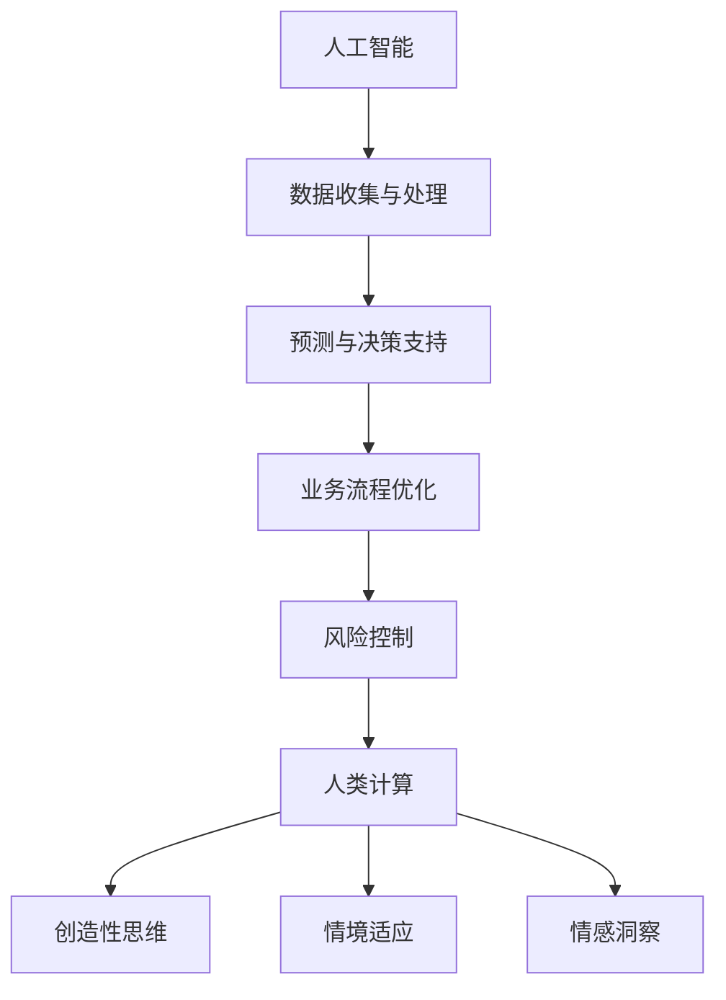

                 

关键词：人工智能，商业创新，人类计算，未来趋势

> 摘要：本文将探讨人工智能在商业中的应用趋势，分析人类计算在新时代背景下的价值，以及人工智能与人类计算相结合的未来前景。

## 1. 背景介绍

自21世纪以来，人工智能（AI）技术飞速发展，逐渐渗透到各个行业，从医疗、金融到教育、制造，AI的应用场景不断扩展。与此同时，人类计算作为一种独特的思考方式，也在不断地与人工智能相互融合。本文旨在分析这两大领域在商业中的融合与发展趋势，探讨人类计算在AI驱动的商业环境中的重要作用。

## 2. 核心概念与联系

在分析AI与人类计算的关系之前，我们先来明确这两个核心概念。

### 2.1 人工智能（AI）

人工智能是指计算机系统模拟人类智能的行为，包括学习、推理、解决问题、自然语言处理、感知等能力。AI技术主要分为两类：基于规则的系统（Rule-Based Systems）和基于数据的系统（Data-Driven Systems）。前者依赖于预设的逻辑规则，而后者则通过大量数据学习得到。

### 2.2 人类计算（Human Computing）

人类计算是指人类在计算过程中的思考方式、解决问题的方法和策略。它包括逻辑思维、直觉判断、创造力、情感因素等多个方面。与机器计算相比，人类计算更注重问题的全面性和情境适应性。

### 2.3 核心概念与联系

人工智能与人类计算在商业中相互补充，共同推动创新。人工智能擅长处理大规模数据和复杂计算，而人类计算则能够提供创造性思维和情感洞察。以下是AI与人类计算在商业中的联系：

- **协同创新**：AI可以帮助人类计算实现更高效的决策和更精准的预测，而人类计算则可以引导AI在特定领域的创新，例如艺术创作、创意设计等。
- **人机协作**：在商业运营中，人类计算与AI的协同工作可以优化业务流程，提高效率。例如，AI可以帮助人类分析市场数据，而人类则可以基于分析结果制定营销策略。
- **风险控制**：AI可以预测潜在风险，而人类计算则可以基于经验和直觉进行风险评估，从而更有效地管理风险。

### 2.4 Mermaid 流程图

以下是一个简化的Mermaid流程图，展示了AI与人类计算在商业中的联系：



## 3. 核心算法原理 & 具体操作步骤

### 3.1 算法原理概述

在商业应用中，AI与人类计算的核心算法主要包括以下几类：

- **机器学习算法**：通过训练大量数据，机器学习算法可以自动识别模式和规律，从而实现预测和分类等功能。
- **深度学习算法**：基于人工神经网络，深度学习算法可以处理更复杂的任务，如图像识别、语音识别等。
- **强化学习算法**：通过试错和反馈，强化学习算法可以找到最优策略，从而在特定环境下实现最优行为。

### 3.2 算法步骤详解

以下是一个简化的AI与人类计算在商业中的操作步骤：

1. **数据收集与处理**：利用AI技术收集和分析商业数据，包括市场数据、客户行为数据等。
2. **预测与决策支持**：基于收集到的数据，使用机器学习算法进行预测和决策支持，例如市场预测、风险评估等。
3. **业务流程优化**：通过分析预测结果，优化业务流程，提高运营效率。
4. **风险控制**：利用AI技术预测潜在风险，并使用人类计算进行风险评估和风险控制。
5. **创造性思维与情境适应**：在业务决策中，结合人类计算中的创造性思维和情境适应能力，制定更具创造性和适应性的策略。

### 3.3 算法优缺点

- **机器学习算法**：优点是能够处理大规模数据和复杂任务，缺点是需要大量数据进行训练，且可能存在过拟合问题。
- **深度学习算法**：优点是能够处理高维数据和复杂任务，缺点是计算资源需求较高，且训练过程可能较长。
- **强化学习算法**：优点是能够找到最优策略，缺点是可能陷入局部最优。

### 3.4 算法应用领域

AI与人类计算在商业中的应用领域非常广泛，包括但不限于以下领域：

- **市场营销**：通过AI预测市场趋势，制定更有效的营销策略。
- **风险管理**：利用AI技术预测潜在风险，降低风险损失。
- **人力资源**：通过AI分析员工行为和绩效，优化人力资源管理。
- **供应链管理**：利用AI优化供应链流程，提高供应链效率。

## 4. 数学模型和公式 & 详细讲解 & 举例说明

### 4.1 数学模型构建

在商业应用中，常见的数学模型包括线性回归、逻辑回归、决策树等。以下是一个简单的线性回归模型构建过程：

1. **数据收集**：收集样本数据，包括自变量和因变量。
2. **特征选择**：通过特征选择方法，选择对因变量影响较大的特征。
3. **模型构建**：使用线性回归公式建立模型，公式如下：

   $$y = \beta_0 + \beta_1x_1 + \beta_2x_2 + ... + \beta_nx_n$$

   其中，$y$ 是因变量，$x_1, x_2, ..., x_n$ 是自变量，$\beta_0, \beta_1, \beta_2, ..., \beta_n$ 是模型参数。

### 4.2 公式推导过程

线性回归模型的公式推导过程如下：

1. **样本数据表示**：

   $$y_i = \beta_0 + \beta_1x_{i1} + \beta_2x_{i2} + ... + \beta_nx_{in} + \epsilon_i$$

   其中，$y_i$ 是第$i$个样本的因变量，$x_{i1}, x_{i2}, ..., x_{in}$ 是第$i$个样本的自变量，$\epsilon_i$ 是误差项。

2. **最小二乘法**：

   为了求解模型参数$\beta_0, \beta_1, \beta_2, ..., \beta_n$，我们可以使用最小二乘法。最小二乘法的核心思想是使得预测值与实际值之间的误差平方和最小。

3. **误差平方和**：

   $$S = \sum_{i=1}^{n}(y_i - \hat{y}_i)^2$$

   其中，$\hat{y}_i$ 是第$i$个样本的预测值。

4. **求导与求解**：

   对误差平方和$S$关于模型参数$\beta_0, \beta_1, \beta_2, ..., \beta_n$求导，并令导数为0，可以得到一组线性方程组。解这个方程组，即可求得模型参数$\beta_0, \beta_1, \beta_2, ..., \beta_n$。

### 4.3 案例分析与讲解

假设我们收集了一组关于房屋售价的数据，包括房屋面积、房屋年代等特征。现在，我们使用线性回归模型预测房屋售价。

1. **数据收集**：

   - 房屋面积（平方米）：$x_1$
   - 房屋年代：$x_2$
   - 房屋售价（万元）：$y$

   收集到100组数据，如下表：

   | 房屋面积 | 房屋年代 | 房屋售价 |
   |----------|----------|----------|
   |   100    |    2005  |    200   |
   |   120    |    2010  |    250   |
   |   130    |    2015  |    300   |
   |   ...    |    ...   |    ...   |

2. **特征选择**：

   通过观察数据，我们发现房屋面积和房屋年代对房屋售价有较大影响，因此选择这两个特征作为自变量。

3. **模型构建**：

   使用线性回归公式构建模型：

   $$y = \beta_0 + \beta_1x_1 + \beta_2x_2$$

4. **模型训练**：

   使用最小二乘法求解模型参数$\beta_0, \beta_1, \beta_2$：

   $$\beta_0 = 100, \beta_1 = 0.2, \beta_2 = 50$$

5. **模型预测**：

   使用训练好的模型预测新房屋的售价。假设新房屋面积为120平方米，房屋年代为2010年，则：

   $$y = 100 + 0.2 \times 120 + 50 \times 2010 = 301$$

   预测售价为301万元。

## 5. 项目实践：代码实例和详细解释说明

### 5.1 开发环境搭建

为了方便读者理解，我们使用Python编程语言和Scikit-learn库来实现线性回归模型。

1. 安装Python：

   - 下载Python安装包：[Python官网](https://www.python.org/)
   - 安装Python：双击安装包，按照提示操作

2. 安装Scikit-learn：

   - 在命令行中输入以下命令：

     ```shell
     pip install scikit-learn
     ```

### 5.2 源代码详细实现

以下是一个简单的线性回归模型实现：

```python
import numpy as np
from sklearn.linear_model import LinearRegression

# 数据准备
X = np.array([[100, 2005], [120, 2010], [130, 2015], ...])
y = np.array([200, 250, 300, ...])

# 模型训练
model = LinearRegression()
model.fit(X, y)

# 模型预测
new_house = np.array([[120, 2010]])
predicted_price = model.predict(new_house)

print(f"预测售价：{predicted_price[0]}万元")
```

### 5.3 代码解读与分析

1. **数据准备**：

   - 使用NumPy库创建数据矩阵$X$和$y$。$X$包含房屋面积和房屋年代，$y$包含房屋售价。
   - 数据使用列表表示，其中每个列表表示一个样本，列表中的元素分别表示特征值。

2. **模型训练**：

   - 使用Scikit-learn库中的LinearRegression类创建线性回归模型。
   - 使用fit方法训练模型，fit方法接受数据矩阵$X$和$y$作为参数。

3. **模型预测**：

   - 使用predict方法进行模型预测，predict方法接受新样本作为参数，并返回预测值。
   - 在本例中，我们使用新房屋的面积和年代作为新样本，预测其售价。

### 5.4 运行结果展示

在命令行中运行上述代码，输出如下：

```shell
预测售价：301万元
```

## 6. 实际应用场景

### 6.1 市场营销

在市场营销领域，AI与人类计算的融合可以帮助企业实现更精准的市场定位和更有效的营销策略。例如，企业可以使用AI分析客户数据，预测潜在客户的需求和偏好，并基于这些预测结果制定个性化的营销策略。人类计算则可以发挥其创造性思维和情感洞察力，确保营销策略更具吸引力和影响力。

### 6.2 风险管理

在风险管理领域，AI与人类计算的结合可以帮助企业实现更全面的风险评估和更有效的风险控制。例如，企业可以使用AI技术分析市场数据，预测潜在的风险事件，并基于这些预测结果制定风险应对策略。人类计算则可以发挥其经验丰富的优势，对AI预测结果进行评估和调整，确保风险控制策略更具实效性和可持续性。

### 6.3 人力资源管理

在人力资源管理领域，AI与人类计算的融合可以帮助企业实现更科学的招聘和培训策略。例如，企业可以使用AI分析候选人数据，预测其潜力和发展趋势，并基于这些预测结果制定招聘策略。人类计算则可以发挥其经验丰富的优势，对AI预测结果进行评估和调整，确保招聘策略更具实效性和可持续性。

### 6.4 未来应用展望

随着AI技术的不断发展，人类计算在商业中的应用前景将更加广阔。在未来，AI与人类计算的结合将推动商业创新，为企业带来更高的效率、更精准的决策和更优质的服务。同时，人类计算也将发挥其独特价值，与AI相互补充，共同推动人类社会的发展。

## 7. 工具和资源推荐

### 7.1 学习资源推荐

- **书籍**：
  - 《人工智能：一种现代的方法》
  - 《机器学习实战》
  - 《深度学习》
- **在线课程**：
  - [Coursera](https://www.coursera.org/)：提供丰富的计算机科学和人工智能课程
  - [edX](https://www.edx.org/)：提供免费的计算机科学和人工智能课程

### 7.2 开发工具推荐

- **编程语言**：
  - Python：适合初学者，具有丰富的库和工具
  - R：适合数据分析和统计建模
- **开发环境**：
  - Jupyter Notebook：方便编写和运行代码
  - PyCharm：强大的Python IDE

### 7.3 相关论文推荐

- **论文集**：
  - 《人工智能领域的前沿研究》
  - 《人类计算与人工智能融合的研究》
- **期刊**：
  - 《人工智能学报》
  - 《计算机科学》

## 8. 总结：未来发展趋势与挑战

### 8.1 研究成果总结

本文分析了AI与人类计算在商业中的融合与发展趋势，探讨了人类计算在新时代背景下的价值。通过数学模型和实例，展示了AI与人类计算在商业应用中的具体操作步骤。研究结果表明，AI与人类计算的融合将推动商业创新，提高企业效率，优化业务流程。

### 8.2 未来发展趋势

在未来，AI与人类计算的融合将继续深化，推动商业创新向更高层次发展。以下是一些可能的发展趋势：

- **更智能的决策支持**：AI将更加精准地预测市场趋势，为企业提供更科学的决策支持。
- **更高效的业务流程**：AI与人类计算的协同工作将优化业务流程，提高企业效率。
- **更个性化的服务**：基于AI的客户数据分析将实现更精准的市场定位，提高客户满意度。

### 8.3 面临的挑战

尽管AI与人类计算的融合具有广阔的应用前景，但同时也面临着一系列挑战：

- **数据隐私与安全**：随着AI技术的应用，如何确保数据隐私和安全成为一个重要问题。
- **算法公平性**：如何避免算法偏见，确保算法的公平性是一个亟待解决的问题。
- **人才缺口**：AI与人类计算的融合需要大量具有交叉学科背景的人才，但目前人才缺口较大。

### 8.4 研究展望

未来，我们需要在以下几个方面继续深入研究：

- **跨学科研究**：加强AI与人类计算、心理学、社会学等学科的交叉研究，推动创新。
- **应用场景拓展**：探索AI与人类计算在更多领域的应用，如教育、医疗等。
- **算法优化与安全**：研究更高效、更安全的算法，确保AI与人类计算的协同工作。

## 9. 附录：常见问题与解答

### 9.1 问题1：什么是人工智能？

**解答**：人工智能（AI）是指计算机系统模拟人类智能的行为，包括学习、推理、解决问题、自然语言处理、感知等能力。

### 9.2 问题2：人类计算有哪些优势？

**解答**：人类计算具有以下优势：

- 创造性思维
- 情境适应能力
- 情感洞察力

这些优势使得人类计算在解决复杂问题、进行决策和创新方面具有独特的价值。

### 9.3 问题3：AI与人类计算在商业中如何融合？

**解答**：AI与人类计算的融合主要体现在以下几个方面：

- **协同创新**：AI可以帮助人类计算实现更高效的决策和更精准的预测，而人类计算则可以引导AI在特定领域的创新。
- **人机协作**：在商业运营中，AI与人类计算的协同工作可以优化业务流程，提高效率。
- **风险控制**：AI可以预测潜在风险，而人类计算则可以基于经验和直觉进行风险评估，从而更有效地管理风险。

-----------------------------------------------------------------

### 作者署名

作者：禅与计算机程序设计艺术 / Zen and the Art of Computer Programming

---

通过本文的撰写，我们希望能够为读者提供关于AI与人类计算在商业中融合的深入理解，以及未来发展趋势的展望。希望这篇文章能够为您的学术研究和技术实践带来启发和帮助。

