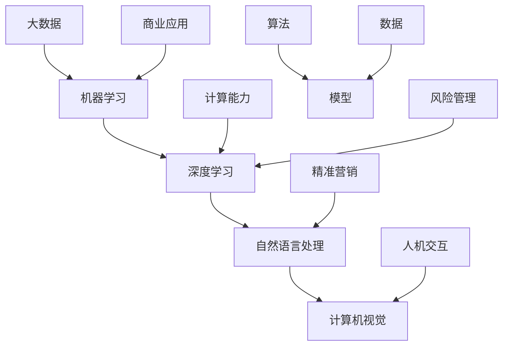

                 

关键词：人工智能，商业应用，道德因素，创新趋势

> 摘要：本文探讨了人工智能（AI）在商业领域的应用，强调了人类计算在AI驱动的创新中的重要性，并深入分析了AI应用中的道德考虑因素。通过阐述AI的核心概念、算法原理、数学模型及实际应用案例，本文探讨了AI的未来发展趋势及其面临的挑战，为读者提供了对未来研究的展望。

## 1. 背景介绍

### 1.1 人工智能的发展历程

人工智能（AI）作为计算机科学的一个重要分支，自20世纪50年代诞生以来，经历了多次变革与发展。从最初的规则推理、知识表示，到机器学习、深度学习，AI技术不断突破，逐步实现了从理论到实践的重大飞跃。特别是在大数据和计算能力的推动下，AI技术在商业领域的应用日益广泛，为企业带来了前所未有的创新机遇。

### 1.2 商业领域的AI应用现状

随着AI技术的进步，商业领域逐渐认识到AI的价值。目前，AI在商业领域的应用涵盖了多个方面，包括智能客服、风险管理、供应链优化、精准营销等。这些应用不仅提高了企业的运营效率，还为企业带来了显著的竞争优势。例如，智能客服系统可以实时响应用户需求，提高客户满意度；风险管理模型可以预测潜在风险，帮助企业规避损失。

## 2. 核心概念与联系

### 2.1 人工智能的核心概念

人工智能（AI）是指使计算机具备类似人类智能的技术，主要包括以下几个方面：

- **机器学习**：通过算法让计算机从数据中学习规律，逐步提高决策能力。
- **深度学习**：基于多层神经网络，对大规模数据进行自动特征提取和模式识别。
- **自然语言处理**：使计算机能够理解和生成自然语言，实现人与机器的交互。
- **计算机视觉**：使计算机能够识别和理解图像和视频中的内容。

### 2.2 人工智能的架构与联系



## 3. 核心算法原理 & 具体操作步骤

### 3.1 算法原理概述

人工智能的核心在于算法。以下是几种常见的AI算法及其原理：

- **机器学习**：基于数据驱动，通过算法让计算机自动学习规律。主要算法包括决策树、支持向量机、神经网络等。
- **深度学习**：基于多层神经网络，自动提取数据特征。主要算法包括卷积神经网络（CNN）、循环神经网络（RNN）、生成对抗网络（GAN）等。
- **自然语言处理**：利用算法对自然语言进行理解和生成。主要算法包括词嵌入、序列到序列模型、注意力机制等。

### 3.2 算法步骤详解

以深度学习为例，其基本步骤如下：

1. **数据预处理**：对原始数据进行清洗、归一化等处理。
2. **模型构建**：设计神经网络结构，包括层数、神经元数目、激活函数等。
3. **训练**：通过梯度下降等优化算法，调整网络参数，使模型能够准确预测。
4. **评估**：使用验证集和测试集，评估模型性能，调整模型参数。
5. **部署**：将训练好的模型部署到生产环境，进行实际应用。

### 3.3 算法优缺点

- **机器学习**：优点在于能够自动学习数据中的规律，适应性强；缺点是依赖于大量数据，训练过程复杂。
- **深度学习**：优点在于能够自动提取数据特征，效果更好；缺点是计算资源需求大，模型解释性差。
- **自然语言处理**：优点在于能够实现人机交互，提高用户体验；缺点是语言表达复杂，模型训练困难。

### 3.4 算法应用领域

- **机器学习**：广泛应用于金融、医疗、电商等领域，用于预测、分类、聚类等任务。
- **深度学习**：广泛应用于图像识别、语音识别、自然语言处理等领域，实现高效的特征提取和模式识别。
- **自然语言处理**：广泛应用于智能客服、智能搜索、智能推荐等领域，实现人机交互和信息检索。

## 4. 数学模型和公式 & 详细讲解 & 举例说明

### 4.1 数学模型构建

在人工智能中，数学模型是核心。以下是一个简单的线性回归模型：

$$y = wx + b$$

其中，$y$ 是目标变量，$x$ 是特征变量，$w$ 是权重，$b$ 是偏置。

### 4.2 公式推导过程

以线性回归为例，推导过程如下：

1. **目标函数**：最小化预测值与实际值之间的误差。

$$J(w, b) = \frac{1}{2m} \sum_{i=1}^{m} (wx_i + b - y_i)^2$$

2. **梯度下降**：迭代更新权重和偏置，使目标函数最小化。

$$w := w - \alpha \frac{\partial J}{\partial w}$$
$$b := b - \alpha \frac{\partial J}{\partial b}$$

其中，$\alpha$ 是学习率。

### 4.3 案例分析与讲解

假设我们有一个简单的数据集，其中$x$表示广告展示次数，$y$表示广告点击次数。我们的目标是预测广告点击次数。

1. **数据预处理**：对数据进行归一化处理。

2. **模型构建**：选择线性回归模型，设计网络结构。

3. **训练**：使用梯度下降算法训练模型。

4. **评估**：使用验证集评估模型性能，调整模型参数。

5. **部署**：将训练好的模型部署到生产环境，进行广告点击预测。

## 5. 项目实践：代码实例和详细解释说明

### 5.1 开发环境搭建

在Python中，我们可以使用TensorFlow库进行深度学习模型的开发。

```bash
pip install tensorflow
```

### 5.2 源代码详细实现

以下是一个简单的线性回归模型的代码实例：

```python
import tensorflow as tf

# 定义输入和输出
X = tf.placeholder(tf.float32, shape=[None, 1])
Y = tf.placeholder(tf.float32, shape=[None, 1])

# 定义模型参数
w = tf.Variable(0.0, name='weight')
b = tf.Variable(0.0, name='bias')

# 定义线性模型
y_pred = w * X + b

# 定义损失函数
loss = tf.reduce_mean(tf.square(y_pred - Y))

# 定义优化器
optimizer = tf.train.GradientDescentOptimizer(learning_rate=0.001)
train_op = optimizer.minimize(loss)

# 初始化变量
init = tf.global_variables_initializer()

# 训练模型
with tf.Session() as sess:
    sess.run(init)
    for step in range(201):
        sess.run(train_op, feed_dict={X: X_train, Y: Y_train})
        if step % 100 == 0:
            loss_val = sess.run(loss, feed_dict={X: X_train, Y: Y_train})
            print(f"Step {step}, Loss: {loss_val}")

# 预测新数据
X_new = tf.placeholder(tf.float32, shape=[None, 1])
Y_pred = w * X_new + b
with tf.Session() as sess:
    sess.run(init)
    pred_val = sess.run(Y_pred, feed_dict={X_new: X_new_data})
    print(f"Predicted value: {pred_val}")
```

### 5.3 代码解读与分析

- **输入和输出**：定义输入和输出数据，使用`tf.placeholder`。
- **模型参数**：定义模型参数，使用`tf.Variable`。
- **线性模型**：定义线性模型，使用`tf.multiply`和`tf.add`。
- **损失函数**：定义损失函数，使用`tf.reduce_mean`和`tf.square`。
- **优化器**：定义优化器，使用`tf.train.GradientDescentOptimizer`。
- **训练模型**：使用`tf.Session`运行训练过程，使用`tf.global_variables_initializer`初始化变量。
- **预测新数据**：使用`tf.Session`运行预测过程，使用`tf.run`。

### 5.4 运行结果展示

通过训练和预测，我们可以得到广告点击次数的预测值，并可以用于实际业务场景。

## 6. 实际应用场景

### 6.1 智能客服

智能客服是AI在商业领域的一个典型应用。通过自然语言处理技术，智能客服系统能够实时响应用户的问题，提供24/7的客户服务，提高客户满意度。

### 6.2 风险管理

AI技术在金融领域的风险管理中发挥着重要作用。通过机器学习和深度学习模型，银行和金融机构可以预测潜在风险，制定合理的风险控制策略。

### 6.3 供应链优化

AI技术可以优化供应链管理，提高物流效率。通过预测需求、优化库存管理，企业可以实现精准采购和高效配送，降低运营成本。

### 6.4 精准营销

精准营销是AI在电商领域的核心应用。通过用户行为分析和个性化推荐，电商平台可以提供更符合用户需求的商品和服务，提高销售额。

## 7. 工具和资源推荐

### 7.1 学习资源推荐

- **书籍**：《深度学习》、《Python机器学习》
- **在线课程**：Coursera、edX上的机器学习和深度学习课程
- **博客和论坛**：Medium、Stack Overflow

### 7.2 开发工具推荐

- **编程语言**：Python、Java
- **深度学习框架**：TensorFlow、PyTorch
- **数据库**：MySQL、PostgreSQL

### 7.3 相关论文推荐

- **深度学习**：Hinton等人的《Deep Learning》
- **自然语言处理**：Jurafsky和Martin的《Speech and Language Processing》
- **计算机视觉**：Kris Biederman的《ImageNet: A High-Level Database of Objects, Scenes and Events》

## 8. 总结：未来发展趋势与挑战

### 8.1 研究成果总结

近年来，人工智能在商业领域取得了显著成果，推动了企业运营的变革。然而，随着AI技术的不断发展，我们仍然面临着诸多挑战。

### 8.2 未来发展趋势

未来，人工智能将在商业领域继续发挥重要作用。随着计算能力的提升和算法的优化，AI将更加高效、精准地为企业提供支持。同时，AI与5G、物联网等新兴技术的融合，将进一步拓展AI的应用场景。

### 8.3 面临的挑战

- **数据隐私**：随着AI技术的发展，数据隐私问题日益突出。如何保护用户数据，防止数据泄露，成为亟待解决的问题。
- **算法透明度**：深度学习等复杂算法的内部机制尚不透明，如何提高算法的透明度和可解释性，是一个重要挑战。
- **人工智能伦理**：AI技术的广泛应用引发了伦理问题，如何确保AI系统的道德性和公正性，是一个亟待解决的问题。

### 8.4 研究展望

在未来，我们应重点关注以下几个方面：

- **数据隐私保护技术**：研究更加高效、安全的数据隐私保护方法，保护用户数据安全。
- **算法透明化和可解释性**：开发可解释性更强的算法，提高算法的透明度和可解释性，增强用户信任。
- **人工智能伦理**：建立人工智能伦理规范，确保AI系统的道德性和公正性。

## 9. 附录：常见问题与解答

### 9.1 人工智能是什么？

人工智能（AI）是指使计算机具备类似人类智能的技术，包括机器学习、深度学习、自然语言处理等。

### 9.2 人工智能在商业领域有哪些应用？

人工智能在商业领域的应用广泛，包括智能客服、风险管理、供应链优化、精准营销等。

### 9.3 如何搭建深度学习开发环境？

在Python中，可以使用TensorFlow库进行深度学习开发。首先安装TensorFlow，然后导入相关库即可。

### 9.4 人工智能技术是否会影响就业？

人工智能技术的发展可能导致某些岗位的减少，但同时也会创造新的就业机会。关键在于如何适应和利用这一变革。

---

作者：禅与计算机程序设计艺术 / Zen and the Art of Computer Programming

本文旨在探讨人工智能在商业领域的应用及其面临的道德考虑因素。通过分析AI的核心概念、算法原理、数学模型及实际应用案例，本文为读者提供了对未来研究的展望。在未来，人工智能将继续在商业领域发挥重要作用，但我们也需要关注其带来的伦理和社会问题。希望本文能为读者带来启示和思考。

