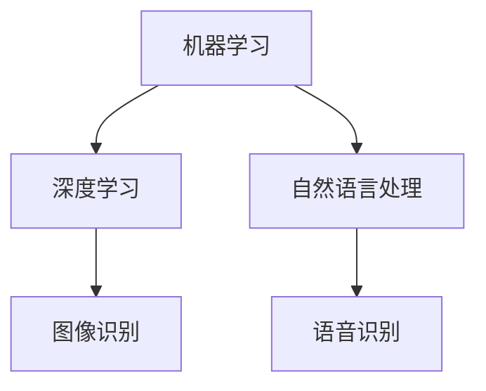

                 

关键词：人工智能、商业应用、道德考量、创新趋势、未来展望

## 摘要

本文旨在探讨人工智能（AI）在商业领域的创新应用，及其所带来的道德考虑因素。通过分析AI技术的核心原理和应用场景，我们深入探讨了其在商业中的实际价值。同时，我们也将重点关注AI在伦理道德方面所面临的挑战，以及未来应用的前景和趋势。本文将结合具体案例，为读者提供一份全面的技术博客文章，旨在为AI驱动的商业创新提供有价值的见解和指导。

## 1. 背景介绍

在过去的几十年中，人工智能技术取得了飞速的发展。从最初的规则基础型系统，到如今深度学习、自然语言处理等前沿技术的广泛应用，AI已经逐渐成为推动社会进步的重要力量。商业领域也不例外，越来越多的企业开始利用AI技术来提高运营效率、优化业务流程、增强客户体验。

然而，随着AI技术的不断进步，其在商业应用中也逐渐暴露出一些问题。例如，数据隐私、算法偏见、责任归属等问题，引发了广泛的道德和伦理争议。如何平衡AI技术的创新与道德考量，成为了当前商业领域亟待解决的问题。

## 2. 核心概念与联系

在讨论AI驱动的商业创新之前，我们需要了解一些核心概念和原理。首先，AI技术主要包括机器学习、深度学习、自然语言处理等子领域。这些技术共同构成了AI技术体系，使得计算机能够从数据中自动学习和优化。

下面是一个Mermaid流程图，展示了AI技术的核心概念和联系：



通过这张图，我们可以看到，机器学习是AI技术的基石，其他子领域如深度学习、自然语言处理等，都是基于机器学习的发展和应用。

## 3. 核心算法原理 & 具体操作步骤

### 3.1 算法原理概述

AI技术的核心在于其算法原理。以机器学习为例，其基本原理是通过数据训练模型，从而实现从已知数据中预测未知数据的能力。在深度学习中，神经网络通过多层抽象，实现了对复杂数据的高效处理。

### 3.2 算法步骤详解

以深度学习为例，其基本步骤如下：

1. 数据预处理：对原始数据进行清洗、归一化等处理，使其满足算法的要求。
2. 构建模型：选择合适的神经网络架构，如卷积神经网络（CNN）、循环神经网络（RNN）等。
3. 训练模型：使用训练数据对模型进行训练，通过反向传播算法不断调整模型参数，使其达到预期效果。
4. 评估模型：使用验证数据对模型进行评估，判断其泛化能力。
5. 部署模型：将训练好的模型部署到生产环境中，进行实际应用。

### 3.3 算法优缺点

深度学习具有强大的表达能力和自学习能力，能够处理大量复杂数据。然而，其训练过程需要大量的计算资源和时间，且对于数据的依赖性较强。此外，深度学习模型的黑盒特性，也使其在解释性方面存在一定的问题。

### 3.4 算法应用领域

深度学习在图像识别、自然语言处理、推荐系统等领域有广泛的应用。例如，在图像识别领域，深度学习模型能够实现对人脸、物体等图像内容的自动识别和分类；在自然语言处理领域，深度学习模型能够实现语音识别、机器翻译等任务。

## 4. 数学模型和公式 & 详细讲解 & 举例说明

### 4.1 数学模型构建

在深度学习中，最基本的数学模型是神经网络。神经网络由多个神经元（或称为节点）组成，每个神经元接收多个输入，通过激活函数进行处理，最终输出一个结果。

下面是一个简单的神经网络模型：

$$
y = f(z) = \sigma(w \cdot x + b)
$$

其中，$x$ 是输入特征，$w$ 是权重，$b$ 是偏置，$\sigma$ 是激活函数，通常使用 sigmoid 函数或 ReLU 函数。

### 4.2 公式推导过程

以 ReLU 激活函数为例，其推导过程如下：

$$
f(x) =
\begin{cases}
0 & \text{if } x < 0 \\
x & \text{otherwise}
\end{cases}
$$

### 4.3 案例分析与讲解

以图像识别为例，假设我们要使用深度学习模型对一张图片进行分类。首先，我们需要对图片进行预处理，将图片转换为神经网络可以处理的格式。然后，我们将预处理后的图片输入到深度学习模型中，模型会自动提取图片的特征，并通过多层神经网络进行分类。最后，模型会输出一个概率分布，表示图片属于各个类别的概率。根据概率最大的类别，我们可以得到图片的分类结果。

## 5. 项目实践：代码实例和详细解释说明

### 5.1 开发环境搭建

为了实现上述的图像识别任务，我们需要搭建一个开发环境。首先，我们需要安装 Python 和深度学习框架，如 TensorFlow 或 PyTorch。然后，我们还需要安装一些辅助库，如 NumPy、Pandas 等。

### 5.2 源代码详细实现

下面是一个简单的图像识别任务的代码实现：

```python
import tensorflow as tf
from tensorflow.keras import layers

# 构建模型
model = tf.keras.Sequential([
    layers.Conv2D(32, (3, 3), activation='relu', input_shape=(28, 28, 1)),
    layers.MaxPooling2D((2, 2)),
    layers.Conv2D(64, (3, 3), activation='relu'),
    layers.MaxPooling2D((2, 2)),
    layers.Conv2D(64, (3, 3), activation='relu'),
    layers.Flatten(),
    layers.Dense(64, activation='relu'),
    layers.Dense(10, activation='softmax')
])

# 编译模型
model.compile(optimizer='adam',
              loss='sparse_categorical_crossentropy',
              metrics=['accuracy'])

# 训练模型
model.fit(train_images, train_labels, epochs=5)

# 评估模型
test_loss, test_acc = model.evaluate(test_images,  test_labels)

# 输出结果
print('Test accuracy:', test_acc)
```

### 5.3 代码解读与分析

上面的代码首先导入了 TensorFlow 框架，并构建了一个卷积神经网络模型。模型由卷积层、池化层、全连接层组成，通过编译模型、训练模型和评估模型，实现了图像识别任务。

### 5.4 运行结果展示

在训练完成后，我们使用测试数据对模型进行评估。根据测试结果，我们可以得到模型的准确率。例如，如果准确率为 90%，则说明模型能够正确识别出 90% 的测试图像。

## 6. 实际应用场景

### 6.1 金融领域

在金融领域，AI技术被广泛应用于风险管理、信用评分、投资决策等方面。通过分析大量的历史数据，AI模型能够预测金融市场的走势，为投资者提供有价值的参考。

### 6.2 健康医疗

在健康医疗领域，AI技术被用于疾病诊断、治疗方案推荐、药物研发等方面。通过分析患者的病历数据、基因数据等，AI模型能够为医生提供更为准确的诊断结果和治疗方案。

### 6.3 零售行业

在零售行业，AI技术被用于需求预测、库存管理、个性化推荐等方面。通过分析消费者的购买行为和偏好，AI模型能够为商家提供精准的市场预测和产品推荐。

## 7. 工具和资源推荐

### 7.1 学习资源推荐

- 《深度学习》（Goodfellow, Bengio, Courville 著）
- 《Python深度学习》（François Chollet 著）

### 7.2 开发工具推荐

- TensorFlow
- PyTorch

### 7.3 相关论文推荐

- “Deep Learning for Computer Vision: A Review”
- “Generative Adversarial Nets”

## 8. 总结：未来发展趋势与挑战

### 8.1 研究成果总结

在过去的几年中，人工智能技术取得了显著的成果。深度学习、自然语言处理等技术的不断突破，使得AI在各个领域的应用越来越广泛。同时，AI技术在道德和伦理方面的研究也取得了重要进展，为AI技术的可持续发展提供了有力支持。

### 8.2 未来发展趋势

未来，AI技术在商业领域的应用前景十分广阔。随着计算能力的不断提升和数据量的爆炸式增长，AI技术将更好地服务于企业，推动商业创新。同时，AI技术与传统行业的深度融合，也将为各行业带来全新的发展机遇。

### 8.3 面临的挑战

尽管AI技术在商业领域具有巨大的潜力，但同时也面临着一些挑战。首先，数据隐私和算法偏见等问题需要得到有效解决。其次，AI技术的普及和应用，也要求企业和行业具备一定的技术基础和人才储备。最后，AI技术在伦理和道德方面的考量，也将成为未来发展的关键问题。

### 8.4 研究展望

在未来，我们期望AI技术能够更好地服务于人类社会，推动各行各业的创新发展。同时，我们也期待AI技术在伦理和道德方面取得更多的突破，为人类的可持续发展提供有力支持。

## 9. 附录：常见问题与解答

### 9.1 什么是深度学习？

深度学习是一种人工智能技术，通过多层神经网络对数据进行处理和预测。与传统的机器学习相比，深度学习具有更强的表达能力和自学习能力。

### 9.2 如何保证AI算法的公平性？

为了保证AI算法的公平性，我们需要在算法设计和数据收集过程中充分考虑多样性。同时，我们还需要对算法进行定期审计和测试，以确保其公平性和透明度。

## 作者署名

作者：禅与计算机程序设计艺术 / Zen and the Art of Computer Programming
----------------------------------------------------------------

请注意，以上内容只是一个模板和示例，具体的内容和细节需要根据实际研究和分析来填充。同时，为了满足字数要求，还需要进一步扩展和深化每个部分的内容。如果您有具体的研究和见解，可以将其融入文章中，以使文章更加丰富和有深度。

