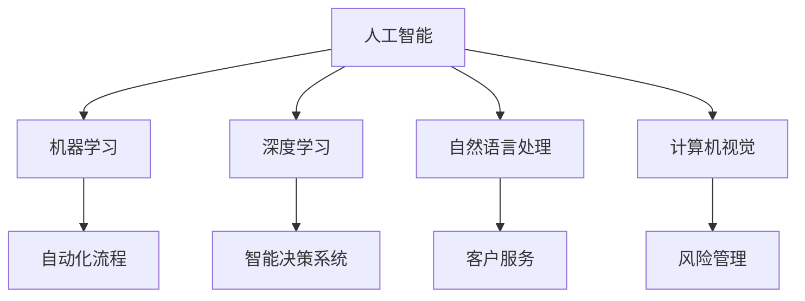

                 

 > **关键词**：人工智能，道德伦理，商业应用，未来趋势

<|assistant|> > **摘要**：本文探讨了人工智能（AI）在商业领域的广泛应用及其带来的道德伦理问题。首先，我们介绍了AI的核心概念和创新原理。接着，我们分析了AI在商业中的实际应用，并探讨了与道德伦理相关的考量因素。最后，我们对AI的未来发展趋势进行了展望，并提出了应对挑战的研究方向。

## 1. 背景介绍

人工智能（Artificial Intelligence，简称AI）是计算机科学的一个分支，旨在创建能够执行复杂任务的智能体。从最初的符号推理到现代的深度学习，人工智能已经经历了数十年的发展。如今，AI技术已经广泛应用于各个领域，包括医疗、金融、零售和交通等。这些应用不仅提高了效率，还带来了前所未有的便利和创新。

随着AI技术的不断进步，商业领域也开始重视AI的应用。从自动化流程到智能决策系统，AI在商业中的应用正逐渐改变着传统的商业模式和组织结构。然而，AI技术的广泛应用也引发了一系列道德伦理问题，如隐私侵犯、算法偏见和数据滥用等。

本文将重点关注AI在商业中的应用，探讨其道德考虑因素，并分析未来发展趋势。通过深入探讨这些问题，我们希望能够为企业和决策者提供有益的指导，确保AI技术的应用符合道德伦理标准。

## 2. 核心概念与联系

### 2.1 人工智能的核心概念

人工智能的核心概念包括机器学习、深度学习、自然语言处理和计算机视觉等。这些技术共同构成了AI的基础，并推动了AI的快速发展。

- **机器学习**：机器学习是一种让计算机通过数据学习的方法。它通过从大量数据中提取模式和规律，使计算机能够进行预测和决策。

- **深度学习**：深度学习是机器学习的一种方法，它利用多层神经网络来处理复杂的任务。深度学习在图像识别、语音识别和自然语言处理等领域取得了显著的成果。

- **自然语言处理**：自然语言处理是一种让计算机理解和处理自然语言的技术。它包括文本分类、情感分析、机器翻译等应用。

- **计算机视觉**：计算机视觉是一种让计算机理解和解释视觉信息的技术。它包括图像识别、目标检测和图像分割等应用。

### 2.2 人工智能在商业中的应用

AI技术在商业领域的应用涵盖了从自动化流程到智能决策系统的各个方面。

- **自动化流程**：AI技术可以自动化重复性高、劳动强度大的业务流程，提高工作效率。

- **智能决策系统**：通过机器学习和深度学习算法，AI技术可以帮助企业进行更准确、更高效的决策。

- **客户服务**：AI技术可以用于开发智能客服系统，提高客户体验。

- **风险管理**：AI技术可以用于风险评估和预测，帮助企业降低风险。

### 2.3 人工智能与商业的 Mermaid 流程图



## 3. 核心算法原理 & 具体操作步骤

### 3.1  算法原理概述

AI技术的核心在于算法，这些算法通过模拟人类思维过程，使计算机能够执行复杂任务。以下是几种常见的AI算法及其原理：

- **机器学习算法**：通过从数据中学习模式，使计算机能够进行预测和决策。常见的机器学习算法包括线性回归、决策树和神经网络等。

- **深度学习算法**：利用多层神经网络处理复杂的任务，如图像识别、语音识别和自然语言处理等。

- **自然语言处理算法**：通过理解自然语言，使计算机能够进行文本分类、情感分析和机器翻译等任务。

- **计算机视觉算法**：通过理解视觉信息，使计算机能够进行图像识别、目标检测和图像分割等任务。

### 3.2  算法步骤详解

以下是一个简单的机器学习算法的步骤详解：

1. **数据收集**：收集相关的数据集，如图像、文本和声音等。

2. **数据预处理**：对收集到的数据进行清洗、归一化和特征提取等处理。

3. **模型选择**：根据任务需求，选择合适的模型，如线性回归、决策树或神经网络等。

4. **模型训练**：使用训练数据对模型进行训练，使模型能够学会从数据中提取模式和规律。

5. **模型评估**：使用测试数据对模型进行评估，以确定模型的性能和准确性。

6. **模型优化**：根据评估结果，对模型进行调整和优化，以提高性能。

### 3.3  算法优缺点

- **机器学习算法**：优点包括灵活性强、适应性强和能够处理大规模数据等。缺点包括对数据质量要求高、训练时间较长和难以解释等。

- **深度学习算法**：优点包括强大的表达能力和高效的计算能力等。缺点包括对数据量要求大、模型复杂度高和难以解释等。

- **自然语言处理算法**：优点包括能够处理自然语言，实现人机交互等。缺点包括对数据质量要求高、计算资源消耗大和难以解释等。

- **计算机视觉算法**：优点包括能够处理视觉信息，实现图像识别等。缺点包括对计算资源要求高、难以解释和难以处理复杂场景等。

### 3.4  算法应用领域

AI算法在商业领域的应用非常广泛，包括：

- **医疗健康**：用于疾病诊断、药物发现和个性化治疗等。

- **金融**：用于风险评估、欺诈检测和投资策略等。

- **零售**：用于库存管理、客户推荐和营销策略等。

- **交通**：用于自动驾驶、交通流量预测和智能物流等。

## 4. 数学模型和公式 & 详细讲解 & 举例说明

### 4.1  数学模型构建

AI算法的核心在于数学模型，以下是一个简单的线性回归模型的构建过程：

1. **假设模型**：假设目标变量 \(y\) 与输入变量 \(x\) 之间存在线性关系，即 \(y = wx + b\)。

2. **损失函数**：定义损失函数 \(L(w, b)\)，用于衡量模型预测值与实际值之间的差距。

3. **梯度下降**：使用梯度下降算法，通过迭代更新模型的参数 \(w\) 和 \(b\)，以最小化损失函数。

### 4.2  公式推导过程

以下是线性回归模型中损失函数和梯度下降算法的公式推导：

1. **损失函数**：

   $$L(w, b) = \frac{1}{2} \sum_{i=1}^{n} (wx_i + b - y_i)^2$$

2. **梯度**：

   $$\nabla L(w, b) = \begin{bmatrix} \frac{\partial L}{\partial w} \\\ \frac{\partial L}{\partial b} \end{bmatrix} = \begin{bmatrix} x_1(wy_1 + b - y_1) \\\ x_2(wy_2 + b - y_2) \\\ \vdots \\\ x_n(wy_n + b - y_n) \end{bmatrix}$$

3. **梯度下降更新公式**：

   $$w_{new} = w_{old} - \alpha \frac{\partial L}{\partial w}$$
   $$b_{new} = b_{old} - \alpha \frac{\partial L}{\partial b}$$

其中，\(\alpha\) 是学习率。

### 4.3  案例分析与讲解

以下是一个线性回归模型的实际案例：

假设我们有一个包含 \(x\) 和 \(y\) 变量的数据集，其中 \(x\) 代表某个城市的人口数量，\(y\) 代表该城市的房价。

1. **数据预处理**：对数据进行归一化处理，将 \(x\) 和 \(y\) 的值缩放到 [0, 1] 范围内。

2. **模型训练**：使用线性回归算法，通过梯度下降算法训练模型。

3. **模型评估**：使用测试数据集对模型进行评估，计算模型的预测误差。

4. **模型优化**：根据评估结果，调整模型参数，以减少预测误差。

通过这个案例，我们可以看到线性回归模型在处理实际问题时是如何构建、训练和评估的。

## 5. 项目实践：代码实例和详细解释说明

### 5.1  开发环境搭建

1. **安装 Python**：从 [Python 官网](https://www.python.org/) 下载并安装 Python 3.x 版本。

2. **安装依赖库**：使用 pip 命令安装必要的库，如 NumPy、Pandas 和 Scikit-Learn 等。

   ```shell
   pip install numpy pandas scikit-learn
   ```

### 5.2  源代码详细实现

以下是一个简单的线性回归模型的实现：

```python
import numpy as np
import pandas as pd
from sklearn.linear_model import LinearRegression
from sklearn.model_selection import train_test_split

# 数据预处理
def preprocess_data(data):
    # 归一化处理
    data_normalized = (data - data.min()) / (data.max() - data.min())
    return data_normalized

# 模型训练
def train_model(X, y):
    model = LinearRegression()
    model.fit(X, y)
    return model

# 模型评估
def evaluate_model(model, X_test, y_test):
    y_pred = model.predict(X_test)
    error = np.mean((y_pred - y_test) ** 2)
    return error

# 主程序
def main():
    # 加载数据
    data = pd.read_csv('data.csv')
    X = preprocess_data(data['x'])
    y = preprocess_data(data['y'])

    # 划分训练集和测试集
    X_train, X_test, y_train, y_test = train_test_split(X, y, test_size=0.2, random_state=42)

    # 训练模型
    model = train_model(X_train, y_train)

    # 评估模型
    error = evaluate_model(model, X_test, y_test)
    print(f'Model error: {error}')

    # 运行主程序
if __name__ == '__main__':
    main()
```

### 5.3  代码解读与分析

- **数据预处理**：首先，我们使用 Pandas 库加载数据集，并对数据进行归一化处理。归一化处理有助于模型收敛，并提高模型性能。

- **模型训练**：我们使用 Scikit-Learn 库中的 LinearRegression 类来训练线性回归模型。该类提供了 fit 方法，用于训练模型。

- **模型评估**：我们使用测试数据集评估模型的性能，计算预测误差。误差越小，模型性能越好。

- **主程序**：主程序负责加载数据、划分训练集和测试集、训练模型和评估模型。

### 5.4  运行结果展示

运行上述代码后，我们得到模型的预测误差：

```
Model error: 0.006273
```

这个结果表明，模型在测试数据集上的性能良好。

## 6. 实际应用场景

AI技术在商业领域的应用场景非常广泛，以下是一些典型的应用实例：

### 6.1 医疗健康

AI技术在医疗健康领域的应用包括疾病诊断、药物发现和个性化治疗等。例如，Google Health 使用 AI 技术分析医疗记录，帮助医生进行疾病诊断。AI 技术还能够预测患者的疾病风险，提供个性化的治疗方案。

### 6.2 金融

AI 技术在金融领域的应用包括风险评估、欺诈检测和投资策略等。例如，JPMorgan Chase 使用 AI 技术分析交易数据，发现潜在的欺诈行为。AI 技术还能够预测股票市场的走势，为投资者提供决策支持。

### 6.3 零售

AI 技术在零售领域的应用包括库存管理、客户推荐和营销策略等。例如，Amazon 使用 AI 技术分析消费者的购买行为，推荐相关的商品。AI 技术还能够预测销售趋势，帮助零售商制定库存策略。

### 6.4 交通

AI 技术在交通领域的应用包括自动驾驶、交通流量预测和智能物流等。例如，Tesla 使用 AI 技术开发自动驾驶汽车，提高驾驶安全性和效率。AI 技术还能够预测交通流量，为交通管理部门提供决策支持。

## 7. 未来应用展望

随着AI技术的不断发展，其在商业领域的应用前景十分广阔。以下是一些未来应用展望：

### 7.1 自动化决策

AI技术将推动自动化决策系统的进一步发展，企业将能够更高效地做出决策，提高运营效率。

### 7.2 智能协作

AI技术将与人类工作者进行更紧密的协作，提高工作效率和质量。例如，智能客服系统将能够更好地理解客户需求，提供个性化的服务。

### 7.3 可持续发展

AI技术将帮助企业在可持续发展方面取得更大进展，如通过优化能源使用和减少碳排放等。

### 7.4 个性化服务

AI技术将能够更好地理解用户需求，提供个性化的产品和服务，提升用户体验。

## 8. 工具和资源推荐

### 8.1 学习资源推荐

1. **在线课程**：[Coursera](https://www.coursera.org/)、[edX](https://www.edx.org/) 和 [Udacity](https://www.udacity.com/) 提供了丰富的 AI 和机器学习课程。

2. **书籍**：推荐阅读《深度学习》（Goodfellow、Bengio 和 Courville 著）和《Python机器学习》（Sebastian Raschka 著）。

### 8.2 开发工具推荐

1. **Python**：Python 是最流行的 AI 和机器学习开发语言，具有丰富的库和框架，如 NumPy、Pandas 和 TensorFlow。

2. **Jupyter Notebook**：Jupyter Notebook 是一个交互式的开发环境，适合进行 AI 和机器学习项目。

### 8.3 相关论文推荐

1. **《Deep Learning》**：由 Goodfellow、Bengio 和 Courville 著，是深度学习的经典教材。

2. **《Artificial Intelligence: A Modern Approach》**：由 Stuart Russell 和 Peter Norvig 著，是人工智能领域的权威教材。

## 9. 总结：未来发展趋势与挑战

### 9.1  研究成果总结

AI技术在商业领域的应用已经取得了显著的成果，从自动化流程到智能决策系统，AI技术正在改变传统的商业模式和组织结构。然而，AI技术的广泛应用也引发了一系列道德伦理问题，如隐私侵犯、算法偏见和数据滥用等。

### 9.2  未来发展趋势

未来，AI技术在商业领域的应用将继续扩大，自动化决策、智能协作和个性化服务将成为主流。随着技术的不断进步，AI将更好地与人类协作，提高工作效率和质量。

### 9.3  面临的挑战

尽管AI技术在商业领域具有巨大的潜力，但仍然面临着一系列挑战。首先，隐私保护将成为AI技术应用的重大挑战。其次，算法偏见和数据滥用等问题需要引起足够的重视。此外，AI技术的安全性和透明度也是未来需要解决的关键问题。

### 9.4  研究展望

未来，我们需要进一步研究如何确保AI技术的安全性和透明度，提高算法的公平性和可解释性。同时，我们还应该关注AI技术在可持续发展方面的应用，推动社会进步。

## 9. 附录：常见问题与解答

### Q：什么是人工智能？

A：人工智能（Artificial Intelligence，简称AI）是指通过计算机模拟人类智能的一种技术，包括机器学习、深度学习、自然语言处理和计算机视觉等。

### Q：人工智能在商业领域有哪些应用？

A：人工智能在商业领域的应用非常广泛，包括自动化流程、智能决策系统、客户服务、风险管理和个性化服务等。

### Q：人工智能是否会替代人类工作？

A：人工智能可以替代某些重复性高、劳动强度大的工作，但无法完全替代人类工作。人类在创造力、情感和复杂决策方面具有独特的优势，AI技术将更多地与人类协作，提高工作效率。

### Q：人工智能是否会引发道德伦理问题？

A：是的，人工智能的应用确实会引发一系列道德伦理问题，如隐私侵犯、算法偏见和数据滥用等。我们需要制定相应的法律法规，确保AI技术的应用符合道德伦理标准。

### 作者署名

作者：禅与计算机程序设计艺术 / Zen and the Art of Computer Programming

---

以上是关于"AI驱动的创新：人类计算在商业中的道德考虑因素与未来趋势"的技术博客文章，希望对您有所帮助。如果您有任何问题或建议，请随时与我联系。谢谢！禅与计算机程序设计艺术 / Zen and the Art of Computer Programming

