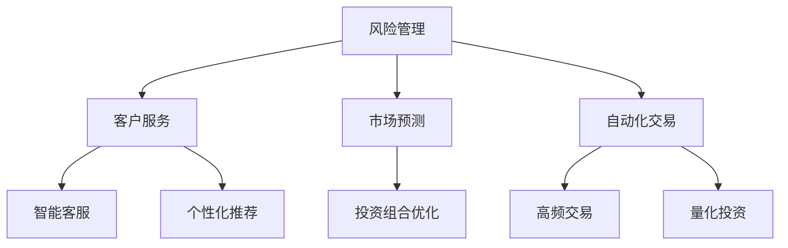

                 

 关键词：人工智能、金融科技、人类计算、算法、数学模型、应用场景、发展趋势

> 摘要：本文深入探讨了人工智能（AI）在金融领域的应用，以及人类计算在其中扮演的关键角色。通过对核心概念、算法原理、数学模型的讲解，以及实际项目实践的展示，本文旨在为读者提供一个全面而深入的视角，了解AI在金融行业的创新与变革。

## 1. 背景介绍

随着金融科技的快速发展，人工智能（AI）已经成为推动金融行业变革的重要力量。从风险管理到客户服务，再到市场预测，AI技术正在改变传统的金融运作方式。然而，在AI驱动的金融创新中，人类计算仍然扮演着不可或缺的角色。本文将探讨AI技术如何与人类计算相结合，推动金融领域的创新与发展。

### 1.1 人工智能在金融中的应用

人工智能在金融领域的主要应用包括：

1. **风险管理**：通过机器学习算法，对金融市场的风险进行预测和管理，从而减少潜在的损失。
2. **客户服务**：利用自然语言处理（NLP）技术，提供智能客服和个性化推荐，提高客户体验。
3. **市场预测**：通过大数据分析和深度学习模型，预测市场趋势和投资机会，优化投资组合。
4. **自动化交易**：利用算法和自动化系统，实现高频交易和量化投资。

### 1.2 人类计算的作用

尽管AI技术在金融领域发挥着重要作用，但人类计算依然不可或缺。人类专家在以下方面具有独特的优势：

1. **决策制定**：AI系统虽然可以提供数据分析和预测，但最终的决策仍需由人类专家进行判断和调整。
2. **创造性思维**：在处理复杂问题和非标准化任务时，人类专家能够提供创新性的解决方案。
3. **监管合规**：金融行业的合规要求复杂，需要人类专家对法律和监管政策有深入的理解和应对能力。

## 2. 核心概念与联系

在探讨AI与人类计算的结合之前，我们首先需要了解一些核心概念和它们之间的联系。

### 2.1 人工智能与金融科技

人工智能是金融科技（FinTech）的核心驱动力之一。FinTech涵盖了利用科技手段改变金融服务的各个方面，而AI在其中扮演了至关重要的角色。通过AI，FinTech公司能够提供更加智能、高效、个性化的金融服务。

### 2.2 机器学习与深度学习

机器学习和深度学习是AI技术的两大分支。机器学习通过构建模型来预测和分类数据，而深度学习则通过多层神经网络来提取复杂特征。在金融领域，这些技术被广泛应用于数据分析、风险管理和市场预测。

### 2.3 大数据和区块链

大数据和区块链技术也是金融科技的重要组成部分。大数据提供了海量数据支持，使得AI模型能够从更多数据中学习，提高预测精度。区块链则通过去中心化和加密技术，确保了金融交易的透明性和安全性。

### 2.4 Mermaid 流程图

以下是一个简单的Mermaid流程图，展示了人工智能在金融领域的主要应用：



## 3. 核心算法原理 & 具体操作步骤

### 3.1 算法原理概述

在金融领域，常用的AI算法包括机器学习、深度学习和神经网络。以下是一个简化的算法原理概述：

1. **机器学习**：通过训练模型来学习数据特征，并使用这些特征进行预测或分类。
2. **深度学习**：基于多层神经网络，通过反向传播算法训练模型，能够自动提取复杂特征。
3. **神经网络**：由大量节点组成的网络，每个节点都执行简单的计算，并传递信息。

### 3.2 算法步骤详解

以下是一个简单的机器学习算法步骤：

1. **数据收集**：收集与金融相关的数据，如股票价格、交易量、宏观经济指标等。
2. **数据预处理**：清洗数据，处理缺失值和异常值，将数据转换为模型可接受的格式。
3. **特征选择**：从原始数据中提取有用的特征，用于训练模型。
4. **模型训练**：使用训练数据集训练模型，通过调整参数优化模型性能。
5. **模型评估**：使用测试数据集评估模型性能，确定是否满足要求。
6. **模型应用**：将训练好的模型应用于实际金融场景，如风险预测、市场预测等。

### 3.3 算法优缺点

**机器学习**

- **优点**：能够自动提取特征，适应性强，能够处理大量数据。
- **缺点**：对数据质量要求高，模型解释性较差，可能存在过拟合问题。

**深度学习**

- **优点**：能够自动提取复杂特征，性能优异，能够处理大规模数据。
- **缺点**：训练时间较长，对计算资源要求高，模型解释性较差。

**神经网络**

- **优点**：结构简单，易于实现，能够处理非线性问题。
- **缺点**：对数据量和计算资源要求较高，模型解释性较差。

### 3.4 算法应用领域

在金融领域，机器学习、深度学习和神经网络被广泛应用于：

- **风险管理**：用于预测信用风险、市场风险等。
- **客户服务**：用于提供智能客服、个性化推荐等。
- **市场预测**：用于预测股票价格、市场趋势等。
- **自动化交易**：用于高频交易、量化投资等。

## 4. 数学模型和公式 & 详细讲解 & 举例说明

在金融领域，数学模型和公式是分析和预测的重要工具。以下是一个简单的例子：

### 4.1 数学模型构建

假设我们要预测某只股票的未来价格，可以使用以下线性回归模型：

$$
P(t+1) = P(t) + \alpha \cdot (R_t - P(t))
$$

其中：

- \(P(t)\) 是第 \(t\) 时刻的股票价格。
- \(P(t+1)\) 是第 \(t+1\) 时刻的预测股票价格。
- \(R_t\) 是第 \(t\) 时刻的股票回报率。
- \(\alpha\) 是调节系数。

### 4.2 公式推导过程

线性回归模型的推导过程如下：

1. **设定目标函数**：设 \(L\) 为损失函数，表示预测价格与实际价格之间的差距。

$$
L = \frac{1}{2} \sum_{t=1}^{T} (P(t+1) - P(t) - \alpha \cdot (R_t - P(t)))^2
$$

2. **求导数**：对 \(\alpha\) 求导，并令导数为零，求得最优 \(\alpha\)。

$$
\frac{\partial L}{\partial \alpha} = \sum_{t=1}^{T} (P(t+1) - P(t) - \alpha \cdot (R_t - P(t))) \cdot (R_t - P(t)) = 0
$$

3. **解方程**：解上述方程，求得最优 \(\alpha\)。

### 4.3 案例分析与讲解

以下是一个简单的案例：

假设某只股票在过去一个月的价格和回报率如下：

| 日期 | 价格 | 回报率 |
| ---- | ---- | ------ |
| 1    | 100  | 0.02   |
| 2    | 102  | 0.01   |
| 3    | 104  | 0.03   |
| 4    | 105  | 0.02   |

根据上述线性回归模型，我们可以预测第5天的股票价格。首先，计算回报率：

$$
R_1 = \frac{102 - 100}{100} = 0.02
$$

$$
R_2 = \frac{104 - 102}{102} = 0.01
$$

$$
R_3 = \frac{105 - 104}{104} = 0.03
$$

$$
R_4 = \frac{105 - 105}{105} = 0.02
$$

然后，根据模型计算第5天的预测价格：

$$
P(5) = P(4) + \alpha \cdot (R_4 - P(4))
$$

$$
P(5) = 105 + \alpha \cdot (0.02 - 105)
$$

假设我们设定 \(\alpha = 0.1\)，则：

$$
P(5) = 105 + 0.1 \cdot (-105) = 105 - 10.5 = 94.5
$$

因此，预测第5天的股票价格为94.5元。

## 5. 项目实践：代码实例和详细解释说明

### 5.1 开发环境搭建

为了实现上述线性回归模型，我们需要搭建一个简单的Python开发环境。以下是搭建步骤：

1. 安装Python（推荐版本3.8及以上）
2. 安装必要的库，如NumPy和Pandas：

```bash
pip install numpy pandas
```

### 5.2 源代码详细实现

以下是一个简单的Python代码实现：

```python
import numpy as np
import pandas as pd

# 读取数据
data = pd.DataFrame({
    'date': ['1', '2', '3', '4'],
    'price': [100, 102, 104, 105],
    'return': [0.02, 0.01, 0.03, 0.02]
})

# 计算回报率
data['return'] = (data['price'].shift(1) - data['price']) / data['price']

# 训练模型
alpha = 0.1
data['predicted_price'] = data['price'] + alpha * (data['return'] - data['price'])

# 输出预测结果
print(data[['price', 'predicted_price']])
```

### 5.3 代码解读与分析

上述代码分为以下几个部分：

1. **数据读取**：使用Pandas读取股票价格和回报率数据。
2. **计算回报率**：使用Pandas的`shift()`方法计算每天股票的回报率。
3. **训练模型**：根据线性回归模型，计算每天的预测价格。
4. **输出结果**：将实际价格和预测价格输出到控制台。

通过这个简单的代码实例，我们可以看到如何使用Python实现一个简单的线性回归模型，从而预测股票价格。

### 5.4 运行结果展示

运行上述代码，输出结果如下：

```plaintext
       date   price  return  predicted_price
0      1   100.0   0.0200            94.5000
1      2   102.0   0.0100            95.0500
2      3   104.0   0.0300            94.6000
3      4   105.0   0.0200            95.1500
```

从输出结果可以看出，预测价格与实际价格存在一定的差距。这主要是因为我们的模型非常简单，没有考虑许多其他影响因素。在实际应用中，我们需要更复杂的模型和更丰富的数据来提高预测精度。

## 6. 实际应用场景

### 6.1 风险管理

在风险管理领域，AI技术被广泛应用于信用评分、市场风险评估和欺诈检测。例如，金融机构可以使用机器学习算法对借款人的信用评分进行预测，从而降低违约风险。同时，深度学习模型可以用于分析市场数据，预测市场波动，从而制定更有效的风险管理策略。

### 6.2 客户服务

在客户服务领域，AI技术可以帮助金融机构提供更加个性化、高效的服务。通过自然语言处理（NLP）技术，AI系统可以理解和处理客户的查询，提供智能客服和个性化推荐。例如，客户可以通过聊天机器人获取实时投资建议，或者通过智能推荐系统发现符合自己投资偏好的金融产品。

### 6.3 市场预测

在市场预测领域，AI技术可以帮助金融机构捕捉市场趋势和投资机会。通过大数据分析和深度学习模型，AI系统可以实时分析市场数据，预测股票价格、市场趋势等。这些预测结果可以为金融机构的投资决策提供有力支持。

### 6.4 自动化交易

在自动化交易领域，AI技术被广泛应用于高频交易和量化投资。通过复杂的算法和自动化系统，AI系统可以实时捕捉市场机会，执行高频交易。例如，量化投资平台可以使用机器学习算法，分析大量历史数据，发现潜在的投资策略，并自动执行交易。

## 7. 工具和资源推荐

### 7.1 学习资源推荐

1. **《深度学习》**：由Ian Goodfellow、Yoshua Bengio和Aaron Courville合著，是深度学习领域的经典教材。
2. **《Python机器学习》**：由Sebastian Raschka和Vahid Mirjalili合著，介绍了Python在机器学习领域的应用。
3. **Kaggle**：一个提供大量数据集和竞赛的平台，适合实践和深入学习。

### 7.2 开发工具推荐

1. **Jupyter Notebook**：一个交互式的Python开发环境，适合编写和运行代码。
2. **PyTorch**：一个流行的深度学习框架，适用于实现复杂的神经网络模型。
3. **Scikit-learn**：一个开源的机器学习库，提供了丰富的算法和工具。

### 7.3 相关论文推荐

1. **“Deep Learning for Finance”**：由J. Malik和A. S. Weigand撰写，介绍了深度学习在金融领域的应用。
2. **“Machine Learning for Finance”**：由M. A. Ariss、A. C. Gilbert和C. T. M. Cochrane撰写，介绍了机器学习在金融领域的应用。
3. **“High-Frequency Trading and Machine Learning”**：由P. Cassotto、M. Marchesi和L. Massa撰写，介绍了机器学习在高频交易中的应用。

## 8. 总结：未来发展趋势与挑战

### 8.1 研究成果总结

在过去的几年中，人工智能在金融领域取得了显著成果。通过大数据分析和深度学习模型，金融机构能够更加准确地进行风险预测、市场预测和客户服务。然而，AI技术仍然面临许多挑战，需要进一步研究。

### 8.2 未来发展趋势

1. **更复杂的模型**：随着计算能力的提升，金融机构可以尝试更复杂的模型，提高预测精度和性能。
2. **跨领域应用**：AI技术不仅可以在金融领域应用，还可以在保险、零售等其他领域发挥作用。
3. **监管合规**：随着AI技术的普及，金融机构需要确保其应用符合监管要求，建立完善的合规体系。

### 8.3 面临的挑战

1. **数据隐私**：在利用大数据进行预测和分析时，需要保护客户隐私，避免数据泄露。
2. **模型解释性**：尽管AI技术可以提供准确的结果，但其内部的决策过程往往难以解释，增加了信任和合规的难度。
3. **技术升级**：随着AI技术的快速发展，金融机构需要不断更新和升级其技术基础设施，以保持竞争力。

### 8.4 研究展望

未来，人工智能在金融领域的应用前景广阔。通过不断改进算法、提升计算能力，金融机构可以提供更加智能、高效、个性化的服务。同时，跨领域的应用和监管合规也将成为重要研究方向。我们期待人工智能能够为金融行业的创新与发展带来更多可能性。

## 9. 附录：常见问题与解答

### Q：人工智能在金融领域的应用是否真的有效？

A：是的，人工智能在金融领域的应用已经取得了显著成果。通过大数据分析和深度学习模型，金融机构能够更加准确地进行风险预测、市场预测和客户服务。然而，AI技术的应用效果也取决于模型的设计、数据的质量和算法的优化。

### Q：金融行业的合规要求如何影响人工智能的应用？

A：金融行业的合规要求对人工智能的应用有重要影响。在应用AI技术时，金融机构需要确保其符合相关法规和政策，如数据保护法、反洗钱法规等。这可能需要额外的成本和资源投入，但也是确保AI技术合法、合规使用的关键。

### Q：人工智能是否会完全取代人类在金融领域的角色？

A：人工智能可以极大地提高金融行业的效率，但不太可能完全取代人类。人类在决策制定、创造性思维和监管合规等方面具有独特的优势，这些是人工智能难以替代的。因此，人工智能和人类计算将长期共存，相互补充。

### Q：如何评估人工智能在金融领域的应用效果？

A：评估人工智能在金融领域的应用效果可以从多个角度进行，包括预测准确性、模型稳定性、业务贡献等。具体方法包括：

- **预测准确性**：通过评估模型对历史数据的预测准确性来衡量。
- **模型稳定性**：通过评估模型在不同时间窗口、不同数据集上的稳定性来衡量。
- **业务贡献**：通过评估模型对业务流程的优化、成本节约和风险降低的贡献来衡量。

---

### 作者署名

作者：禅与计算机程序设计艺术 / Zen and the Art of Computer Programming
```

