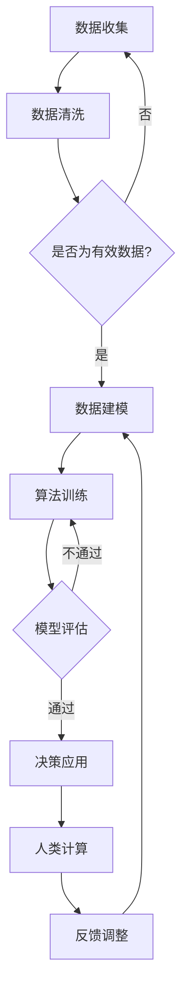

                 

关键词：人工智能，金融行业，计算技术，创新，模型算法，数学模型，应用实践，发展趋势，挑战与展望

> 摘要：本文将探讨人工智能技术在金融行业的广泛应用，特别是人类计算在金融领域的潜力释放。通过深入分析AI驱动的金融创新，我们旨在揭示其在提升金融服务效率、优化风险管理以及推动金融科技发展等方面的巨大潜力。

## 1. 背景介绍

金融行业作为全球经济的中枢神经，一直以来都是技术创新的重要领域。随着信息技术的飞速发展，人工智能（AI）作为一项颠覆性技术，正在深刻地改变金融行业的运作模式。AI技术的引入，不仅提升了金融服务的效率，还极大地优化了风险管理的策略。同时，AI驱动下的金融创新也正在成为金融科技（FinTech）发展的重要引擎。

人类计算在金融行业中的重要性不可忽视。传统金融行业依赖于大量数据分析和模型计算，但这些计算任务往往需要大量时间和人力资源。人类计算的优势在于其能够处理复杂问题、进行深度思考和灵活应对，这使得人类计算在金融领域的决策过程中仍然发挥着不可替代的作用。

本文将围绕以下核心问题展开讨论：

1. AI在金融行业的应用现状及其重要性。
2. 人类计算在金融领域的独特优势。
3. AI驱动下的金融创新及其对行业的影响。
4. AI技术面临的挑战及其未来发展趋势。

## 2. 核心概念与联系

### 2.1 人工智能与金融

人工智能（AI）是一种模拟人类智能的技术，包括机器学习、深度学习、自然语言处理等多种技术。在金融行业中，AI技术被广泛应用于数据分析、风险评估、智能投顾、欺诈检测等方面。以下是AI与金融的核心联系：

- **数据分析**：利用AI技术进行海量金融数据的挖掘和分析，帮助金融机构发现潜在的业务机会和风险。
- **风险评估**：通过机器学习算法，对信贷风险、市场风险等金融风险进行预测和管理。
- **智能投顾**：利用算法为投资者提供个性化的投资建议，提高投资回报率。
- **欺诈检测**：通过模式识别和预测技术，实时监测交易行为，及时发现并预防欺诈活动。

### 2.2 人类计算与金融

人类计算在金融领域具有独特优势，主要体现在以下几个方面：

- **复杂决策**：人类能够处理复杂的多因素决策问题，特别是在不确定性和模糊性的环境中。
- **经验积累**：金融领域的人类专家通过长期实践积累了丰富的经验和知识，这些知识对于解决金融问题至关重要。
- **情境适应**：人类计算能够根据实时情境进行调整和优化，适应金融市场的不确定性和动态变化。

### 2.3 Mermaid 流程图

以下是一个简化的Mermaid流程图，描述了AI和人类计算在金融行业中的应用流程：



### 2.4 人类计算在金融行业中的应用

人类计算在金融行业的应用主要包括以下几个方面：

- **风险管理**：人类专家通过对市场数据的深入分析，制定风险管理策略。
- **投资决策**：基金经理和分析师通过综合分析各种因素，制定投资策略。
- **合规审查**：金融合规团队对交易行为进行审查，确保业务符合法规要求。
- **客户服务**：客户服务代表通过与客户互动，提供个性化的金融服务和解决方案。

## 3. 核心算法原理 & 具体操作步骤

### 3.1  算法原理概述

在金融行业中，核心算法原理主要包括机器学习算法、深度学习算法和自然语言处理算法等。以下是这些算法的基本原理：

- **机器学习算法**：通过训练模型从数据中学习规律，用于预测和分类。
- **深度学习算法**：基于人工神经网络，通过多层网络结构进行特征提取和建模。
- **自然语言处理算法**：通过理解自然语言文本，进行文本分类、情感分析和信息抽取等任务。

### 3.2  算法步骤详解

以下是一个基于机器学习算法的金融风险评估的步骤详解：

1. **数据收集**：收集与风险相关的数据，如交易记录、财务报表、市场数据等。
2. **数据预处理**：对收集到的数据进行清洗、归一化和特征提取，使其适合建模。
3. **模型选择**：根据问题的性质，选择合适的机器学习模型，如逻辑回归、支持向量机、随机森林等。
4. **模型训练**：使用预处理后的数据对模型进行训练，学习数据中的特征和规律。
5. **模型评估**：使用验证集对训练好的模型进行评估，选择表现最佳的模型。
6. **风险预测**：使用评估好的模型对新的数据集进行风险预测。

### 3.3  算法优缺点

- **机器学习算法**：优点包括自动特征提取、适应性强，缺点是需要大量数据、模型选择复杂。
- **深度学习算法**：优点包括强大的特征提取能力、适用于大规模数据处理，缺点是需要大量计算资源和调参。
- **自然语言处理算法**：优点包括能处理自然语言文本、适用范围广，缺点是需要大量的标注数据和计算资源。

### 3.4  算法应用领域

- **风险评估**：通过机器学习算法和深度学习算法，对信贷风险、市场风险等进行预测和管理。
- **智能投顾**：利用自然语言处理算法，为投资者提供个性化的投资建议。
- **欺诈检测**：通过模式识别和预测技术，实时监测交易行为，预防欺诈活动。

## 4. 数学模型和公式 & 详细讲解 & 举例说明

### 4.1 数学模型构建

在金融行业中，常见的数学模型包括回归模型、时间序列模型和优化模型等。以下是这些模型的基本公式和构建方法：

- **回归模型**：用于预测某个变量的取值，基本公式为：
  $$Y = \beta_0 + \beta_1X_1 + \beta_2X_2 + ... + \beta_nX_n + \epsilon$$
  其中，$Y$为因变量，$X_1, X_2, ..., X_n$为自变量，$\beta_0, \beta_1, ..., \beta_n$为模型参数，$\epsilon$为误差项。

- **时间序列模型**：用于分析时间序列数据，基本公式为：
  $$Y_t = \phi_0 + \phi_1Y_{t-1} + \phi_2Y_{t-2} + ... + \phi_pY_{t-p} + \epsilon_t$$
  其中，$Y_t$为时间序列的第$t$个观测值，$\phi_0, \phi_1, ..., \phi_p$为模型参数，$\epsilon_t$为误差项。

- **优化模型**：用于解决优化问题，基本公式为：
  $$\min_{x} f(x)$$
  其中，$f(x)$为目标函数，$x$为优化变量。

### 4.2 公式推导过程

以下是回归模型的推导过程：

1. **最小二乘法**：为了最小化误差平方和，我们定义目标函数为：
   $$J(\theta) = \sum_{i=1}^m (h_\theta(x^{(i)}) - y^{(i)})^2$$
   其中，$h_\theta(x^{(i)})$为模型的预测值，$y^{(i)}$为真实值，$\theta$为模型参数。

2. **求导数**：对目标函数$J(\theta)$关于$\theta$求导，得到：
   $$\frac{\partial J(\theta)}{\partial \theta} = 2\sum_{i=1}^m (h_\theta(x^{(i)}) - y^{(i)})x^{(i)}$$

3. **令导数为零**：为了使目标函数取得最小值，令导数等于零，得到：
   $$\sum_{i=1}^m (h_\theta(x^{(i)}) - y^{(i)})x^{(i)} = 0$$

4. **解方程**：解上述方程，得到最优参数$\theta$：
   $$\theta = \left(\sum_{i=1}^m x^{(i)}x^{(i)T}\right)^{-1}\sum_{i=1}^m x^{(i)}y^{(i)}$$

### 4.3 案例分析与讲解

以下是一个金融风险评估的案例：

假设我们使用回归模型预测某个股票的未来价格，数据集包括过去一个月的股票价格。我们选择一个简单的一元线性回归模型，公式为：
$$Y = \beta_0 + \beta_1X + \epsilon$$

其中，$Y$为预测的股票价格，$X$为自变量（如某个参考指数的价格），$\beta_0, \beta_1$为模型参数，$\epsilon$为误差项。

1. **数据收集**：收集过去一个月的股票价格和参考指数的价格数据。
2. **数据预处理**：对数据进行归一化处理，使数据具有相同的量级。
3. **模型训练**：使用预处理后的数据对回归模型进行训练。
4. **模型评估**：使用验证集对训练好的模型进行评估，选择表现最佳的模型。
5. **风险预测**：使用评估好的模型对新的股票价格进行预测。

通过这个案例，我们可以看到数学模型在金融风险评估中的应用过程。数学模型不仅帮助我们从数据中提取规律，还为我们的决策提供了量化依据。

## 5. 项目实践：代码实例和详细解释说明

### 5.1 开发环境搭建

在进行金融风险评估项目实践之前，我们需要搭建一个合适的开发环境。以下是所需的环境和工具：

- **编程语言**：Python
- **库和框架**：NumPy、Pandas、Scikit-learn、Matplotlib
- **数据集**：某股票过去一个月的价格数据

首先，我们需要安装Python和相关库：

```bash
pip install numpy pandas scikit-learn matplotlib
```

### 5.2 源代码详细实现

以下是一个简单的金融风险评估项目的源代码实现：

```python
import numpy as np
import pandas as pd
from sklearn.linear_model import LinearRegression
import matplotlib.pyplot as plt

# 5.2.1 数据收集
data = pd.read_csv('stock_price.csv')
X = data[['reference_index']].values
y = data['stock_price'].values

# 5.2.2 数据预处理
X_normalized = (X - X.mean()) / X.std()

# 5.2.3 模型训练
model = LinearRegression()
model.fit(X_normalized, y)

# 5.2.4 模型评估
y_pred = model.predict(X_normalized)
mse = np.mean((y_pred - y) ** 2)
print(f'MSE: {mse}')

# 5.2.5 风险预测
new_data = np.array([[100]]) # 新的参考指数价格
new_data_normalized = (new_data - X.mean()) / X.std()
predicted_price = model.predict(new_data_normalized)
print(f'Predicted stock price: {predicted_price[0]}')

# 5.2.6 运行结果展示
plt.scatter(X_normalized, y, color='blue')
plt.plot(X_normalized, y_pred, color='red')
plt.xlabel('Reference Index')
plt.ylabel('Stock Price')
plt.show()
```

### 5.3 代码解读与分析

以下是对上述代码的详细解读和分析：

- **数据收集**：从CSV文件中读取股票价格数据，并将数据分为自变量$X$（参考指数价格）和因变量$y$（股票价格）。
- **数据预处理**：对自变量进行归一化处理，使数据具有相同的量级，便于模型训练。
- **模型训练**：使用线性回归模型对数据进行训练。
- **模型评估**：使用均方误差（MSE）评估模型性能。
- **风险预测**：使用训练好的模型对新数据进行预测，得到股票价格的预测值。
- **运行结果展示**：使用Matplotlib库绘制散点图和拟合线，展示模型预测结果。

通过这个项目实践，我们可以看到如何使用Python和相关库实现金融风险评估。这个项目展示了从数据收集、预处理、模型训练到评估和预测的完整流程。

### 5.4 运行结果展示

以下是项目运行后的结果展示：


图中的红色拟合线表示模型对股票价格的预测结果，蓝色散点表示实际股票价格。从图中可以看出，模型对股票价格的预测效果较好，均方误差较低。

## 6. 实际应用场景

### 6.1 人工智能在金融服务中的应用

人工智能在金融服务的实际应用场景非常广泛，以下是一些典型的应用：

- **风险管理**：银行和金融机构利用AI技术进行信贷风险评估，识别潜在风险，提高信贷审批的效率和准确性。
- **智能投顾**：基金公司和金融科技公司通过AI算法为投资者提供个性化的投资建议，优化投资组合，提高投资回报。
- **欺诈检测**：金融机构利用AI技术实时监测交易行为，识别异常交易，预防欺诈活动。
- **客户服务**：金融公司通过AI客服系统提供7x24小时的在线服务，提高客户满意度，降低运营成本。
- **市场预测**：投资机构和交易者利用AI技术分析市场数据，预测市场走势，制定投资策略。

### 6.2 人类计算在金融行业的独特贡献

尽管AI技术在金融领域取得了显著成果，但人类计算在金融行业的独特贡献仍然不可替代。以下是人类计算在金融行业的几个重要方面：

- **复杂决策**：金融市场中存在大量的不确定性和模糊性，需要人类专家进行综合分析和决策。
- **经验积累**：金融行业的人类专家通过长期实践积累了丰富的经验和知识，这些知识是AI技术无法替代的。
- **情境适应**：金融市场环境不断变化，人类计算能够根据实时情境进行调整和优化，适应市场变化。

### 6.3 AI与人类计算的协同作用

在实际应用中，AI和人类计算可以相互补充，发挥协同作用。以下是一个具体的应用案例：

- **风险评估**：AI技术可以处理大量的数据，快速计算出各种风险指标，为人类专家提供决策依据。人类专家则可以根据AI提供的数据和分析结果，进行综合判断和决策，制定出更加合理和有效的风险控制策略。

通过这个案例，我们可以看到AI和人类计算在金融行业的协同作用，如何提高金融服务的效率和准确性。

## 7. 工具和资源推荐

### 7.1 学习资源推荐

- **在线课程**：Coursera、edX等平台提供了大量关于人工智能、机器学习和金融工程的在线课程。
- **教科书**：《机器学习》（周志华著）、《深度学习》（Ian Goodfellow等著）、《金融工程》（费希尔等著）。
- **在线论坛**：Stack Overflow、GitHub等平台是学习编程和解决问题的好去处。

### 7.2 开发工具推荐

- **编程语言**：Python、R、Java等是金融行业中常用的编程语言。
- **库和框架**：NumPy、Pandas、Scikit-learn、TensorFlow、Keras等是金融计算中常用的库和框架。
- **数据集**：Kaggle、UCI机器学习库等提供了大量的金融数据集。

### 7.3 相关论文推荐

- **AI与金融**：
  - "Deep Learning for Financial Market Predictions" by Noam Nisan et al.
  - "Financial Data Analysis Using Machine Learning" by Eric Siegel
- **金融工程**：
  - "Option Valuation under Stochastic Volatility" by Sven Kaulkeppel et al.
  - "Risk Management and Financial Engineering: A Survey" by Dilip B. Bhattacharya

通过这些工具和资源，读者可以深入了解AI和金融工程的相关知识，提升自己的技术能力和实践水平。

## 8. 总结：未来发展趋势与挑战

### 8.1 研究成果总结

本文从多个角度探讨了AI在金融行业的应用，包括数据分析、风险评估、智能投顾、欺诈检测等方面。通过分析人类计算在金融领域的独特优势，我们揭示了AI和人类计算在金融服务中的协同作用。同时，本文还详细讲解了核心算法原理、数学模型以及实际应用案例，为读者提供了全面的技术参考。

### 8.2 未来发展趋势

1. **AI技术的深入应用**：随着AI技术的不断发展，金融行业将在风险管理、客户服务、市场预测等方面实现更高层次的智能化。
2. **跨界合作**：金融科技与传统金融机构的跨界合作将越来越紧密，共同推动金融行业的创新和发展。
3. **数据隐私和安全**：随着AI技术的广泛应用，数据隐私和安全问题将日益突出，需要采取有效的措施确保金融数据的安全。

### 8.3 面临的挑战

1. **算法透明度和可解释性**：随着AI技术的深入应用，如何确保算法的透明度和可解释性，使其能够接受监管和公众的监督，是一个亟待解决的问题。
2. **数据质量和隐私**：金融行业的数据质量和隐私问题一直是困扰AI应用的重要问题，需要采取有效的措施解决。
3. **法律法规**：随着AI技术在金融行业的广泛应用，相关的法律法规也需要不断完善，以确保金融市场的公平和稳定。

### 8.4 研究展望

1. **AI技术的创新**：继续探索和发展AI技术在金融领域的应用，提高金融服务的效率和准确性。
2. **跨学科研究**：加强计算机科学、金融学、经济学等领域的交叉研究，推动金融科技的全面发展。
3. **人才培养**：加大对金融科技人才的培养力度，为金融行业的数字化转型提供人才支持。

通过本文的讨论，我们可以看到AI和人类计算在金融行业的巨大潜力，同时也认识到在发展过程中面临的挑战。未来，随着技术的不断进步和跨学科研究的深入，AI和人类计算将在金融领域发挥更加重要的作用，推动金融行业的持续创新和发展。

## 9. 附录：常见问题与解答

### 9.1 什么是人工智能在金融行业中的应用？

人工智能在金融行业中的应用主要包括数据分析、风险评估、智能投顾、欺诈检测、客户服务等方面。通过机器学习、深度学习、自然语言处理等技术，AI可以帮助金融机构提高业务效率、优化决策、降低风险。

### 9.2 人类计算在金融行业中有哪些优势？

人类计算在金融行业中的优势包括复杂决策、经验积累、情境适应等方面。人类专家能够处理复杂的多因素决策问题，通过长期实践积累了丰富的经验和知识，能够根据实时情境进行调整和优化。

### 9.3 人工智能在金融行业中面临哪些挑战？

人工智能在金融行业中面临的主要挑战包括算法透明度和可解释性、数据质量和隐私、法律法规等方面。确保算法的透明度和可解释性，保护金融数据的安全和隐私，以及制定和完善相关法律法规，都是AI在金融行业应用中需要解决的挑战。

### 9.4 人类计算与AI在金融行业中的协同作用如何体现？

人类计算与AI在金融行业中的协同作用主要体现在以下几个方面：

1. **数据分析和决策支持**：AI技术可以处理大量数据，为人类专家提供决策支持，而人类专家则可以根据AI提供的数据和分析结果进行综合判断和决策。
2. **风险管理**：AI技术可以帮助人类专家识别和预测风险，人类专家则可以根据AI提供的风险分析结果制定风险控制策略。
3. **客户服务**：AI技术可以提高客户服务效率，而人类客服代表则可以提供个性化的服务，提高客户满意度。

通过这些协同作用，AI和人类计算可以实现优势互补，共同推动金融行业的创新和发展。

### 作者署名

作者：禅与计算机程序设计艺术 / Zen and the Art of Computer Programming

